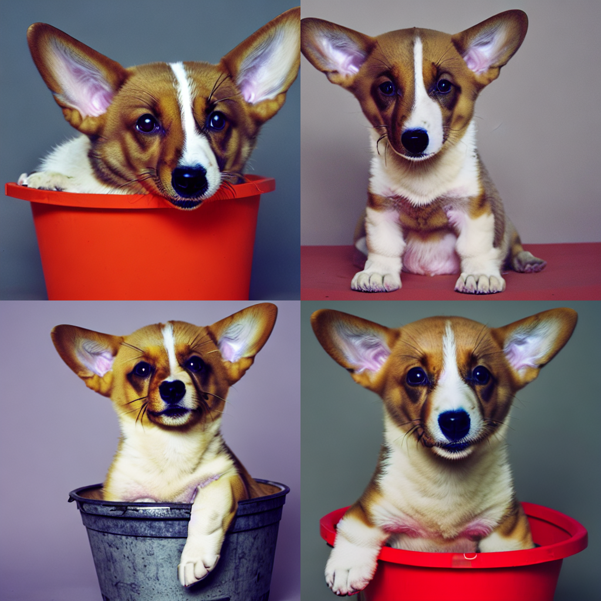

# Elucidating the Design Space of Diffusion-Based Generative Models

## 项目背景
PlaygroundAI 三月初推出 Playground v2.5 ，其仿佛基于edm公式训练。质量宣称优于现有各种模型        
我们解决了三个关键问题：增强色彩和对比度、改进多宽高比生成以及改进以人为中心的精细细节。    
英文版博客 https://playground.com/blog/playground-v2-5     
技术报告 https://marketing-cdn.playground.com/research/pgv2.5_compressed.pdf    

diffuser库在2024三月十号上新，支持 Playground v2.5 推理和基于其的 dreambooth_lora 微调 (可以带上edm)      

diffuser
v0.27.0: Stable Cascade, Playground v2.5, EDM-style training, IP-Adapter image embeds, and more   
需要实测模型效果    
大致看来可以达到加速，以及质量不降低的特效   
类似LCM   

更新概览：    

Stable Cascade    
Stable Cascade 系列管道与 Stable Diffusion 的不同之处在于，它们建立在三个不同的模型之上，并允许对患者图像进行分层压缩，从而实现卓越的输出。   
allow for hierarchical compression of image patients, achieving remarkable outputs.


Playground v2.5   
PlaygroundAI 发布了新的 v2.5 模型（playgroundai/playground-v2.5-1024px-aesthetic），该模型在美观方面尤其出色。除了一些调整之外，该模型紧密遵循 Stable Diffusion XL 的架构。   

EDM-style training   
EDM 是指以下论文中介绍的训练和采样技术：Elucidating the Design Space of Diffusion-Based Generative Models。我们在脚本中引入了对使用 EDM 公式进行训练的支持train_dreambooth_lora_sdxl.py。  
要stabilityai/stable-diffusion-xl-base-1.0使用 EDM 公式进行训练，您只需--do_edm_style_training在训练命令中指定标志即可   
采用 EDM 公式的新调度程序   
为了更好地支持 Playground v2.5 模型和 EDM 式培训，我们提供了对 EDMDPMSolverMultistepScheduler 和 的支持EDMEulerScheduler。DPMSolverMultistepScheduler它们分别支持和 的EDM 公式 EulerDiscreteScheduler。    

Trajectory Consistency Distillation   
轨迹一致性蒸馏 (TCD) 使模型能够以更少的步骤生成更高质量和更详细的图像。此外，由于蒸馏过程中有效的误差缓解，即使在推理步骤较大的情况下，TCD 也表现出优越的性能。它是在轨迹一致性蒸馏中提出的。   
此版本提供了支持TCDScheduler这种快速采样的功能。与 LCM-LoRA 非常相似，TCD 需要额外的适配器来加速。   

IP-Adapter 图像嵌入和屏蔽 embeddings and masking     
所有支持 IP 适配器的管道都接受 ip_adapter_image_embeds 参数。    
我们还引入了对提供二进制掩码的支持，以指定应将输出图像的哪一部分分配给 IP 适配器。对于每个输入 IP 适配器图像，必须提供二进制掩码和 IP 适配器。   


合并 LoRA 指南    
合并 LoRA 是一种有趣且富有创意的方式来创建新的、独特的图像。set_adaptersDiffusers 通过连接 LoRA 权重进行合并的方法提供合并支持。   
现在，Diffusers 还支持add_weighted_adapterPEFT 库中的方法，解锁更高效的合并方法，如 TIES、DARE、线性，甚至这些合并方法的组合，如dare_ties.    

LEDITS++   
我们正在添加对名为 LEDITS++ 的真实图像编辑技术的支持：使用文本到图像模型进行无限图像编辑 Limitless Image Editing using Text-to-Image Models ，这是一种无参数方法，不需要微调或任何优化。   
为了编辑真实图像，LEDITS++ 管道首先反转图像 DPM-solver++ 调度程序，该调度程序有助于通过 只需要 20 个扩散步骤进行编辑，以实现反转和推理相结合。LEDITS++ 指导的定义使其既反映了编辑的方向（如果我们想要远离/靠近编辑概念）又反映了效果的强度。该指南还包括一个专注于相关图像区域的屏蔽术语，特别是对于多次编辑，可确保每个概念的相应指南术语大部分保持隔离，从而限制干扰。    


## 原理
NeurIPS 2022 年 
摘要   
我们认为，基于扩散的生成模型的理论和实践目前不必要地复杂化，并试图通过提出一个明确区分具体设计选择的设计空间来弥补这种情况。这让我们能够识别采样和训练过程以及评分网络的预处理的一些变化。总之，我们的改进使 CIFAR-10 在类条件设置下的 FID 达到 1.79，在无条件设置下达到 1.97，采样速度比之前的设计快得多（每个图像 35 个网络评估）。为了进一步证明其模块化性质，我们表明我们的设计更改极大地提高了之前工作中预训练评分网络的效率和质量，包括将之前训练的 ImageNet-64 模型的 FID 从 2.07 提高到接近 SOTA 1.55 ，并在使用我们建议的改进进行重新训练后达到新的 SOTA 1.36。   


Tero Karras 等研究者在论文《Elucidating the design space of diffusionbased generative models》中对扩散模型的设计空间进行了分析，并确定了 3 个阶段，分别为   
i) 选择噪声水平的调度，  
ii) 选择网络参数化（每个参数化生成一个不同的损失函数），  
iii) 设计采样算法。     

本来是想直接consistency model的，但是发现consistency model基本被Karras method全文贯穿了，所以索性就直接从Karras method开始了  

Karras method 来源于

'' Karras T, Aittala M, Aila T, et al. Elucidating the design space of diffusion-based generative models[C]. NIPS, 2022. '' https://arxiv.org/pdf/2206.00364.pdf

这篇文章主要干了3件事情：

1. 给出了几种diffusion模型的通用框架，并且将这些模型分成了几个部分，然后加以分析，看一看什么是对模型影响最大的，哪些需要调整之类的事情。

2. 着眼于sampling过程，即图像生成部分，琢磨怎么有效减少生成图片的步数。

3. 反思了神经网络结构部分，并且尝试修改这个部分，以便他达到更好的效果。


总体来说Karras文章告诉我们的事情是，如果把整个diffusion模型的架构统一起来，那么就可以发现不少可以加速模型，提升效果的点。

### Consistency Model
一致性模型与扩散模型的联系太紧密了，讨论从扩散模型作为基于分数的生成模型的想法开始，因此在我们赶上故事之前有很多背景。

特别是以下两篇论文与一致性模型密切相关

1. 基于随机微分方程的基于分数的生成建模


2. 阐明基于扩散的生成模型的设计空间


另外，我认为以某种方式阅读它可能是可以的。


''Consistency Models Yang Song, Prafulla Dhariwal, Mark Chen, and Ilya Sutskever In the 40th International Conference on Machine Learning, 2023.'' https://arxiv.org/pdf/2303.01469.pdf

Consistency Model的目标是让目标生成的速度尽可能快，比如一步到位，同时也可以支持基于zero-shot的图像生成问题，比如图像填充之类的问题。这是因为Consistency Model不光可以从0开始重新训练，也可以先获得一个预训练模型，然后在这个预训练模型的基础上进行修正，以此达到完成既定的任务。

参考链接 https://zhuanlan.zhihu.com/p/630353542


首先，已知如果将扩散模型的扩散过程的时间步长增加到无穷大，则逆扩散过程可以表示为随机微分方程的解，也可以表示为称为概率流常微分方程的常微分方程的解（Song et 等，2021 年）。

然后在某个时间
�
t
概率流常微分方程（PF ODE）的求解轨迹如下。


### 进一步学习
文章用一种新的设计框架统一diffusion-based model，并使用模块化（modular）的思想，分别从采样、训练、score network设计三个方面分析和改进diffusion-based model。    
之前的工作1已经把diffusion-based model统一到SDE或者ODE框架下了，这篇文章的作者同样也从SDE和ODE的角度出发，不过换了一种SDE和ODE的表示形式。  

原论文公式过多   


## 测试
测试 playgroundai/playground-v2.5-1024px-aesthetic   
推理fp16   
显存占用   
加载模型比较久，将近四分钟    
模型加载8g左右   
50步用时   

过程问题   
在底层计算卷积时报错返回   
报错invalid argument   
torch和torchvision不匹配   
没有按照torch官网安装  

按照官网装torch后终于运行成功     
其实还是挺快   


    from diffusers import DiffusionPipeline
    import torch

    model_path = "/models/playground-v2.5-1024px-aesthetic/"
    #model_path = "/home/WujieAITeam/private/dj/models/playground-v2.5-1024px-aesthetic/playground-v2.5-1024px-aesthetic.fp16.safetensors"

    pipe = DiffusionPipeline.from_pretrained(
        model_path,
        torch_dtype=torch.float16,
        variant="fp16",
    ).to("cuda")

    # # Optional: Use DPM++ 2M Karras scheduler for crisper fine details
    # from diffusers import EDMDPMSolverMultistepScheduler
    # pipe.scheduler = EDMDPMSolverMultistepScheduler()

    prompt = "Astronaut in a jungle, cold color palette, muted colors, detailed, 8k"
    image = pipe(prompt=prompt, num_inference_steps=50, guidance_scale=3).images[0]

    image.save("/home/WujieAITeam/private/lujunda/infer-pics/playground-v2.5/" + prompt[:10] + ".png")

1024*1024  1.4mb   


prompt = "A Girl with brown hair with a ponytail, With a light brown shirt from the 80s, with short pants with Brown suspenders with colorful buttons, With black tights with light brown sneakers in a classic tone,"   
negative_prompt = "watermark, low quality, cloned face, ugly, poorly drawn hands, extra limbs, missing legs, (bad body), (signature), (watermark), (username), blurry, cropped, (text), too many fingers, long neck,lowres, bad anatomy, bad hands, text, error, missing fingers, extra digit, fewer digits, cropped, worst quality, low quality, normal quality, jpeg artifacts, signature, watermark, username, blurry, bad feet,{{poorly drawn hands}}, {{poorly drawn face}}, {{{mutation}}}, {{{deformed}}}, {{ugly}}, blurry, {{bad anatomy}}, {{{bad proportions}}}, {{extra limbs}}, cloned face, {{{disfigured}}}, {{{more than 2 nipples}}}, {{{adult}}}, out of frame, ugly, extra limbs, {bad anatomy}, gross proportions, {malformed limbs}, {{missing arms}}, {{missing legs}}, {{{extra arms}}}, {{{extra legs}}}, mutated hands, {fused fingers}, {too many fingers}, (((long neck:1.3)), missing fingers, extra digit, fewer digits, bad feet, sideways, side view portrait, no photo frame, ((long length neck:1.5))"   

显存14g    
耗时两分钟   
1024*1024   
1.18mb   
   
    


采用“webui 效果抖动” prompt      
原图   
     
    


## 训练
训练 dreambooth_lora      
其原理和特点在于dreambooth微调unet,同时训练lora层     
还用lora微调text encoders   
Training with text encoder(s)   
Alongside the UNet, LoRA fine-tuning of the text encoders is also supported.    

使用edm    
计划采用 /diffusers-main/examples/advanced_diffusion_training    
或者 diffusers-main/examples/dreambooth/train_dreambooth_lora_sdxl.py     

这个脚本是不是没有训练text encoder的lora?   
这个脚本时dreambooth吗？    


### 单纯advanced
会使用   
__main__ - list of token identifiers: ['TOK']  
validation prompt: a \<s0>\<s1> icon of an astronaut riding a horse, in the style of \<s0>\<s1>   
所谓text_inverse的方法加入到dreambooth_lora中训练     
枢轴微调 (Pivotal Tuning) ,关键调整, 将文本反转与常规扩散微调相结合 - 我们将新标记插入模型的文本编码器中，而不是重用现有标记。然后，我们优化新插入的令牌嵌入来表示新概念。    

除了 UNet 之外，还支持 LoRA 文本编码器微调。   

optimizer: for this example, we'll use prodigy - an adaptive optimizer   
pivotal tuning   
min SNR gamma   
我们把 Replicate 在 SDXL Cog 训练器中使用的枢轴微调 (Pivotal Tuning) 技术与 Kohya 训练器中使用的 Prodigy 优化器相结合，再加上一堆其他优化，一起对 SDXL 进行 Dreambooth LoRA 微调，取得了非常好的效果。    

使用 Dreambooth LoRA 微调后的 Stable Diffusion XL(SDXL) 模型仅需借助少量图像即可捕获新概念，同时保留了 SDXL 出图美观高质的优势。   


#### 第一次启动训练    
没有使用dora    

用了连不上网  --push_to_hub   
需要升级peft使用dora 安装prodigyopt     


占用22g显存   
训练时间半个小时  

原始   
    
```
训练命令
accelerate launch train_dreambooth_lora_sdxl_advanced.py \
  --pretrained_model_name_or_path=$MODEL_NAME \
  --pretrained_vae_model_name_or_path=$VAE_PATH \
  --dataset_name=$DATASET_NAME \
  --instance_prompt="3d icon in the style of TOK" \
  --validation_prompt="a TOK icon of an astronaut riding a horse, in the style of TOK" \
  --output_dir=$OUTPUT_DIR \
  --caption_column="prompt" \
  --mixed_precision="bf16" \
  --resolution=1024 \
  --train_batch_size=3 \
  --repeats=1 \
  --report_to="wandb"\
  --gradient_accumulation_steps=1 \
  --gradient_checkpointing \
  --learning_rate=1.0 \
  --text_encoder_lr=1.0 \
  --optimizer="prodigy"\
  --train_text_encoder_ti\
  --train_text_encoder_ti_frac=0.5\
  --snr_gamma=5.0 \
  --lr_scheduler="constant" \
  --lr_warmup_steps=0 \
  --rank=8 \
  --max_train_steps=1000 \
  --checkpointing_steps=2000 \
  --seed="0" \


Loaded scheduler as EulerDiscreteScheduler 
Num examples = 22
03/27/2024 07:07:33 - INFO - __main__ -   Num batches each epoch = 8
03/27/2024 07:07:33 - INFO - __main__ -   Num Epochs = 125
03/27/2024 07:07:33 - INFO - __main__ -   Instantaneous batch size per device = 3
03/27/2024 07:07:33 - INFO - __main__ -   Total train batch size (w. parallel, distributed & accumulation) = 3
03/27/2024 07:07:33 - INFO - __main__ -   Gradient Accumulation steps = 1
03/27/2024 07:07:33 - INFO - __main__ -   Total optimization steps = 1000

Loaded scheduler as EulerDiscreteScheduler 进行 validation 推理

```

The weights were trained using DreamBooth.

LoRA for the text encoder was enabled: False.

Pivotal tuning was enabled: True.

Special VAE used for training: madebyollin/sdxl-vae-fp16-fix.  

Trigger words    
To trigger image generation of trained concept(or concepts) replace each concept identifier in you prompt with the new inserted tokens:    

to trigger concept TOK-> use <s0><s1> in your prompt


####   第二次启动训练
使用 dora    
加大训练轮次3000    
依旧是22g显存    
两个小时   


#### 推理    
使用上述技术训练的模型的推理应该与任何其他训练器训得的模型的推理方式相同，      
不同之处在于，当我们进行枢轴微调时，除了 LoRA 的 *.safetensors 权重之外，还有经过训练的新词元及其文本嵌入模型的 *.safetensors 。there is also the *.safetensors text embeddings trained with the model for the new tokens. .为了对这些进行推理，我们在加载 LoRA 模型的方式上加了 2 个步骤:       


将嵌入模型加载到文本编码器中

    # load embeddings to the text encoders
    state_dict = load_file(embedding_path)
    这里是17KB

    # notice we load the tokens <s0><s1>, as "TOK" as only a place-holder and training was performed using the new initialized   tokens - <s0><s1>
    # load embeddings of text_encoder 1 (CLIP ViT-L/14)
    pipe.load_textual_inversion(state_dict["clip_l"], token=["<s0>", "<s1>"], text_encoder=pipe.text_encoder, tokenizer=pipe.  tokenizer)
    # load embeddings of text_encoder 2 (CLIP ViT-G/14)
    pipe.load_textual_inversion(state_dict["clip_g"], token=["<s0>", "<s1>"], text_encoder=pipe.text_encoder_2, tokenizer=pipe.  tokenizer_2)

加载你的 LoRA     
这里是24MB     

    # normal LoRA loading
    pipe.load_lora_weights("LinoyTsaban/web_y2k_lora", weight_name="pytorch_lora_weights.safetensors")
    prompt="a <s0><s1> webpage about an astronaut riding a horse"
    images = pipe(
        prompt,
        cross_attention_kwargs={"scale": 0.8},
    ).images
    # your output image
    images[0]


cross_attention_kwargs={"scale": 1.0}?????
lora权重如何影响？？？？  


#### 总结
2024.1.2文章LoRA training scripts of the world, unite!发表  
后来diffuser支持该advanced训练  

advanced训练原理：    
优化器prodigy，标配学习率1，且文本编码器和unet学习率必须相同    
训练unet的lora，不确定文本编码器是否训练lora  
dreambooth方式训练，给文本（罕见词）和图片一起去训练  
罕见词替换设置，所谓pivotal finetune   
可以设置dora训练    
秩默认8     


### advanced + edm 训练
EDM 式训练尚不支持 Min-SNR gamma。    


## 训练对比结果
图片过多过大  
sdxl 使用 dreambooth_lora advanced 微调   
sdxl 使用 dreambooth_lora advanced 微调 + edm   
Playground v2.5 使用 dreambooth_lora advanced 微调  
Playground v2.5 使用 dreambooth_lora advanced 微调 + edm  

实验数据集  
"linoyts/3d_icon" 23张  

实验结果  
优化器 prodigy  
学习率 1 （所有都默认设置成1）  
vae：madebyollin/sdxl-vae-fp16-fix  

训练占显存22g   
推理占显存8g  
sdxl采样器：EulerDiscreteScheduler  

base_model : SDXL-base-1.0

小结：

1. Min-SNR gamma is not supported with the EDM-style training yet.
--snr_gamma=5.0  \      
可能导致edm收敛缓慢        

2. edm训练dreambooth_lora没有显著的提升效果

3. 训练次数过多会过拟合，图片质量下降     
有些prompt难以遵循指定训练的风格      


base_model : playground-v2.5

playground是使用edm训练的，无法使用snr接训dreambooth_lora，所以训练dreambooth_lora时都关闭snr   
效果都比较差，学不到概念    
最后都会训练崩    


## MJHQ-30K测评
我们引入了一个新的基准MJHQ-30K，用于自动评估模型的美学质量。该基准测试在高质量数据集上计算 FID，以衡量美学质量。

我们整理了来自 Midjourney 的高质量数据集，包含 10 个常见类别，每个类别有 3K 个样本。按照惯例，我们使用美学评分和 CLIP 评分aesthetic score and CLIP score 来确保高图像质量和高图文对齐。此外，我们特别注意使每个类别中的数据多样化。

对于 Playground v2，我们报告总体 FID 和每个类别的 FID。 （所有 FID 指标均在分辨率 1024x1024 下计算。）从结果来看，我们的模型在整体 FID 和所有类别 FID 方面优于 SDXL-1-0-refiner，尤其是在人物和时尚类别中。这与用户研究的结果一致，表明人类偏好与 MJHQ30K 基准的 FID 分数之间存在相关性。

Unzip mjhq30k_imgs.zip into its per-category folder structure.

    root
    ├── animals
    ├── art
    ├── fashion
    ├── food
    ├── indoor
    ├── landscape
    ├── logo
    ├── people
    ├── plants
    └── vehicles

测量 FID  
要对模型的性能进行基准测试，您需要首先使用 中的相同提示生成图像meta_data.json。

我们使用clean-fid计算 FID 。您可以使用以下方法测量生成的图像和参考图像之间的 FID

    from cleanfid import fid
    score = fid.compute_fid(ref_dir, gen_dir)


测评 dreambooth_lora 的训练模型   
三万张图    
推理时间45小时    
还在推理中    
SDXL-base-1.0 默认 EulerDiscreteScheduler     
推理步数25步    


这个advanced方法应该理解为 ti + lora  
由于没有保留类文件夹进行类先验约束    ,有着lora的通病：在通用prompt上会语言漂移，风格泛滥    


12线程计算   
overall fid 42.46135841839822  
4分钟三万张  

animals fid 62.29403569758563   
半分钟 3000张  


### 指标


# 这份代码是不是传统意义的 dreambooth_lora ?
可以dreambooth_lora      
但是我运行的示例命令只是lora + embeddings 一起训练的结果      


Training with text encoder(s)

Alongside the UNet, LoRA fine-tuning of the text encoders is also supported. In addition to the text encoder optimization available with train_dreambooth_lora_sdxl_advanced.py, in the advanced script pivotal tuning is also supported. pivotal tuning combines Textual Inversion with regular diffusion fine-tuning

To do so, just specify --train_text_encoder_ti while launching training (for regular text encoder optimizations, use --train_text_encoder). Please keep the following points in mind:

SDXL has two text encoders. So, we fine-tune both using LoRA.      
When not fine-tuning the text encoders, we ALWAYS precompute the text embeddings to save memory.

有train_text_encoder_ti         
但没有开启dreambooth的arg

    export MODEL_NAME="stabilityai/stable-diffusion-xl-base-1.0"
    export DATASET_NAME="./3d_icon"
    export OUTPUT_DIR="3d-icon-SDXL-LoRA"
    export VAE_PATH="madebyollin/sdxl-vae-fp16-fix"

    accelerate launch train_dreambooth_lora_sdxl_advanced.py \
    --pretrained_model_name_or_path=$MODEL_NAME \
    --pretrained_vae_model_name_or_path=$VAE_PATH \
    --dataset_name=$DATASET_NAME \
    --instance_prompt="3d icon in the style of TOK" \
    --validation_prompt="a TOK icon of an astronaut riding a horse, in the style of TOK" \
    --output_dir=$OUTPUT_DIR \
    --caption_column="prompt" \
    --mixed_precision="bf16" \
    --resolution=1024 \
    --train_batch_size=3 \
    --repeats=1 \
    --report_to="wandb"\
    --gradient_accumulation_steps=1 \
    --gradient_checkpointing \
    --learning_rate=1.0 \
    --text_encoder_lr=1.0 \
    --optimizer="prodigy"\
    --train_text_encoder_ti\
    --train_text_encoder_ti_frac=0.5\
    --snr_gamma=5.0 \
    --lr_scheduler="constant" \
    --lr_warmup_steps=0 \
    --rank=8 \
    --max_train_steps=1000 \
    --checkpointing_steps=2000 \
    --seed="0" \
    --push_to_hub


推理   

    text_encoders = [pipe.text_encoder, pipe.text_encoder_2]
    tokenizers = [pipe.tokenizer, pipe.tokenizer_2]

    embedding_path = hf_hub_download(repo_id=repo_id, filename="3d-icon-SDXL-LoRA_emb.safetensors", repo_type="model")

    state_dict = load_file(embedding_path)
    # load embeddings of text_encoder 1 (CLIP ViT-L/14)
    pipe.load_textual_inversion(state_dict["clip_l"], token=["<s0>", "<s1>"], text_encoder=pipe.text_encoder, tokenizer=pipe.tokenizer)
    # load embeddings of text_encoder 2 (CLIP ViT-G/14)
    pipe.load_textual_inversion(state_dict["clip_g"], token=["<s0>", "<s1>"], text_encoder=pipe.text_encoder_2, tokenizer=pipe.tokenizer_2)

webui

    You can then run inference by prompting a y2k_emb webpage about the movie Mean Girls <lora:y2k:0.9>. You can use the y2k_emb token normally, including increasing its weight by doing (y2k_emb:1.2).


comfyui

You can then include it in your models/Lora directory. Then you will load the LoRALoader node and hook that up with your model and CLIP. Official guide for loading LoRAs

and include it in your models/embeddings directory and use it in your prompts like embedding:y2k_emb. Official guide for loading embeddings.


## 新出功能
### LoRA training of Targeted U-net Blocks    

The advanced script now supports custom choice of U-net blocks to train during Dreambooth LoRA tuning.

Note

This feature is still experimental

Recently, works like B-LoRA showed the potential advantages of learning the LoRA weights of specific U-net blocks, not only in speed & memory, but also in reducing the amount of needed data, improving style manipulation and overcoming overfitting issues. In light of this, we're introducing a new feature to the advanced script to allow for configurable U-net learned blocks.

Usage Configure LoRA learned U-net blocks adding a lora_unet_blocks flag, with a comma seperated string specifying the targeted blocks. e.g:

--lora_unet_blocks="unet.up_blocks.0.attentions.0,unet.up_blocks.0.attentions.1"


Note

if you specify both --use_blora and --lora_unet_blocks, values given in --lora_unet_blocks will be ignored. When enabling --use_blora, targeted U-net blocks are automatically set to be "unet.up_blocks.0.attentions.0,unet.up_blocks.0.attentions.1" as discussed in the paper. If you wish to experiment with different blocks, specify --lora_unet_blocks only.

Inference    
Inference is the same as for B-LoRAs, except the input targeted blocks should be modified based on your training configuration.


    import torch
    from diffusers import StableDiffusionXLPipeline, AutoencoderKL

    # taken & modified from B-LoRA repo - https://github.com/yardenfren1996/B-LoRA/blob/main/blora_utils.py
    def is_belong_to_blocks(key, blocks):
        try:
            for g in blocks:
                if g in key:
                    return True
            return False
        except Exception as e:
            raise type(e)(f'failed to is_belong_to_block, due to: {e}')
        
    def lora_lora_unet_blocks(lora_path, alpha, target_blocks):  
    state_dict, _ = pipeline.lora_state_dict(lora_path)
    filtered_state_dict = {k: v * alpha for k, v in state_dict.items() if is_belong_to_blocks(k, target_blocks)}
    return filtered_state_dict

    vae = AutoencoderKL.from_pretrained("madebyollin/sdxl-vae-fp16-fix", torch_dtype=torch.float16)
    pipeline = StableDiffusionXLPipeline.from_pretrained(
        "stabilityai/stable-diffusion-xl-base-1.0",
        vae=vae,
        torch_dtype=torch.float16,
    ).to("cuda")

    lora_path  = "lora-library/B-LoRA-pen_sketch"

    state_dict = lora_lora_unet_blocks(content_B_lora_path,alpha=1,target_blocks=["unet.up_blocks.0.attentions.0"])

    # Load traine dlora layers into the unet
    pipeline.load_lora_into_unet(state_dict, None, pipeline.unet)

    #generate
    prompt = "a dog in [v30] style"
    pipeline(prompt, num_images_per_prompt=4).images


### B-LoRA training

The advanced script now supports B-LoRA training too!

Proposed in Implicit Style-Content Separation using B-LoRA, B-LoRA is a method that leverages LoRA to implicitly separate the style and content components of `a single image`. It was shown that learning the LoRA weights of two specific blocks (referred to as B-LoRAs) achieves style-content separation that cannot be achieved by training each B-LoRA independently. Once trained, the two B-LoRAs can be used as independent components to allow various image stylization tasks

Usage Enable B-LoRA training by adding this flag

--use_blora


You can train a B-LoRA with as little as 1 image, and 1000 steps. Try this default configuration as a start:

Inference The inference is a bit different:

we need load specific unet layers (as opposed to a regular LoRA/DoRA)    
the trained layers we load, changes based on our objective (e.g. style/content)

    import torch
    from diffusers import StableDiffusionXLPipeline, AutoencoderKL

    # taken & modified from B-LoRA repo - https://github.com/yardenfren1996/B-LoRA/blob/main/blora_utils.py
    def is_belong_to_blocks(key, blocks):
        try:
            for g in blocks:
                if g in key:
                    return True
            return False
        except Exception as e:
            raise type(e)(f'failed to is_belong_to_block, due to: {e}')
        
    def lora_lora_unet_blocks(lora_path, alpha, target_blocks):  
    state_dict, _ = pipeline.lora_state_dict(lora_path)
    filtered_state_dict = {k: v * alpha for k, v in state_dict.items() if is_belong_to_blocks(k, target_blocks)}
    return filtered_state_dict

    vae = AutoencoderKL.from_pretrained("madebyollin/sdxl-vae-fp16-fix", torch_dtype=torch.float16)
    pipeline = StableDiffusionXLPipeline.from_pretrained(
        "stabilityai/stable-diffusion-xl-base-1.0",
        vae=vae,
        torch_dtype=torch.float16,
    ).to("cuda")

    # pick a blora for content/style (you can also set one to None) 
    content_B_lora_path  = "lora-library/B-LoRA-teddybear"
    style_B_lora_path= "lora-library/B-LoRA-pen_sketch"


    content_B_LoRA = lora_lora_unet_blocks(content_B_lora_path,alpha=1,target_blocks=["unet.up_blocks.0.attentions.0"])
    style_B_LoRA = lora_lora_unet_blocks(style_B_lora_path,alpha=1.1,target_blocks=["unet.up_blocks.0.attentions.1"])
    combined_lora = {**content_B_LoRA, **style_B_LoRA}

    # Load both loras
    pipeline.load_lora_into_unet(combined_lora, None, pipeline.unet)

    #generate
    prompt = "a [v18] in [v30] style"
    pipeline(prompt, num_images_per_prompt=4).images

## 代码内部

    parser.add_argument("--repeats", type=int, default=1, help="How many times to repeat the training data.")

    parser.add_argument(
        "--class_data_dir",
        type=str,
        default=None,
        required=False,
        help="A folder containing the training data of class images.",
    )

    parser.add_argument(
        "--class_prompt",
        type=str,
        default=None,
        help="The prompt to specify images in the same class as provided instance images.",
    )

    parser.add_argument(
        "--token_abstraction",
        type=str,
        default="TOK",
        help="identifier specifying the instance(or instances) as used in instance_prompt, validation prompt, "
        "captions - e.g. TOK. To use multiple identifiers, please specify them in a comma seperated string - e.g. "
        "'TOK,TOK2,TOK3' etc.",
    )

    parser.add_argument(
        "--num_new_tokens_per_abstraction",
        type=int,
        default=2,
        help="number of new tokens inserted to the tokenizers per token_abstraction identifier when "
        "--train_text_encoder_ti = True. By default, each --token_abstraction (e.g. TOK) is mapped to 2 new "
        "tokens - <si><si+1> ",
    )

    parser.add_argument(
        "--with_prior_preservation",
        default=False,
        action="store_true",
        help="Flag to add prior preservation loss.",
    )

我忘记开with_prior_preservation       
代码是支持训练的    

    parser.add_argument("--prior_loss_weight", type=float, default=1.0, help="The weight of prior preservation loss.")
    parser.add_argument(
        "--num_class_images",
        type=int,
        default=100,
        help=(
            "Minimal class images for prior preservation loss. If there are not enough images already present in"
            " class_data_dir, additional images will be sampled with class_prompt."
        ),
    )

    parser.add_argument(
        "--dataloader_num_workers",
        type=int,
        default=0,
        help=(
            "Number of subprocesses to use for data loading. 0 means that the data will be loaded in the main process."
        ),
    )


    parser.add_argument(
        "--lora_unet_blocks",
        type=str,
        default=None,
        help=(
            "the U-net blocks to tune during training. please specify them in a comma separated string, e.g. `unet.up_blocks.0.attentions.0,unet.up_blocks.0.attentions.1` etc."
            "NOTE: By default (if not specified) - regular LoRA training is performed. "
            "if --use_blora is enabled, this arg will be ignored, since in B-LoRA training, targeted U-net blocks are `unet.up_blocks.0.attentions.0` and `unet.up_blocks.0.attentions.1`"
        ),
    )
    parser.add_argument(
        "--use_blora",
        action="store_true",
        help=(
            "Whether to train a B-LoRA as proposed in- Implicit Style-Content Separation using B-LoRA https://arxiv.org/abs/2403.14572. "
        ),
    )


    parser.add_argument(
        "--cache_latents",
        action="store_true",
        default=False,
        help="Cache the VAE latents",
    )

    if args.with_prior_preservation:
        if args.class_data_dir is None:
            raise ValueError("You must specify a data directory for class images.")
        if args.class_prompt is None:
            raise ValueError("You must specify prompt for class images.")

自动生成需要数量的class图片     
只需要提供文件夹路径，空的也行     

    def main(args):
        # Generate class images if prior preservation is enabled.
        if args.with_prior_preservation:
            class_images_dir = Path(args.class_data_dir)
            if not class_images_dir.exists():
                class_images_dir.mkdir(parents=True)
            cur_class_images = len(list(class_images_dir.iterdir()))

            if cur_class_images < args.num_class_images:

                num_new_images = args.num_class_images - cur_class_images
                logger.info(f"Number of class images to sample: {num_new_images}.")

                sample_dataset = PromptDataset(args.class_prompt, num_new_images)
                sample_dataloader = torch.utils.data.DataLoader(sample_dataset, batch_size=args.sample_batch_size)

class PromptDataset(Dataset):

    "A simple dataset to prepare the prompts to generate class images on multiple GPUs."

    def __init__(self, prompt, num_samples):
        self.prompt = prompt
        self.num_samples = num_samples

    def __len__(self):
        return self.num_samples

    def __getitem__(self, index):
        example = {}
        example["prompt"] = self.prompt
        example["index"] = index
        return example


# advance 基础知识
all of them have been incorporated into the new diffusers training script.  

advanced_diffusion_training（简称为advanced）的基础上进行edm训练对比。  advanced_diffusion_training包括了一些训练技巧：pivotal tuning, 优化器prodigy, min-snr, dora


包括: Nataniel Ruiz 的 Dreambooth、 Rinon Gal 的 文本逆化 (textual inversion) 、  
Ron Mokady 的 枢轴微调、Simo Ryu 的 cog-sdxl、  
Kohya 的 sd-scripts   
以及 The Last Ben 的 fast-stable-diffusion。    

Replicate 在 SDXL Cog 训练器中使用的枢轴微调 (Pivotal Tuning) 技术Pivoting halfway    
与 Kohya 训练器中使用的 Prodigy 优化器    

按我理解 textual inversion 和 dreambooth 都是特定ip的学习     
textual inversion训练新文本.just optimizing the inserted embeddings         
lora使用lora层风格迁移    
dreambooth使用罕见词微调unet    

## dreambooth

DreamBooth: Fine Tuning Text-to-Image Diffusion Models for Subject-Driven Generation      
微调文本到图像扩散模型--主题驱动生成
We include a file dataset/prompts_and_classes.txt which contains all of the prompts used in the paper for live subjects and objects, as well as the class name used for the subjects.

该数据集包括 15 个不同类别的 30 个科目。其中 9 个是活体主体（狗和猫），21 个是物体。该数据集包含每个主题的可变数量的图像 (4-6)。拍摄对象的图像通常是在不同条件、环境和不同角度下拍摄的。

    
      
     


## 最早的lora微调    
？？？？      

这个好像是DreamBooth LoRA微调   
https://aistudio.baidu.com/projectdetail/5704542?contributionType=1   
sd1.5   
prompt: "a photo of sks dog in a bucket"  
  

dogs文件夹  
  
文本信息统一为instance_prompt="a photo of sks dog"  
单张图片对应多图  


## Pivotal tuning
Dreambooth微调 升级版   

以 Dreambooth 为例，进行常规 Dreambooth 微调时，你需要选择一个稀有词元作为触发词，例如“一只 sks 狗” 中的 sks 。但是，因为这些词元原本就来自于词表，所以它们通常有自己的原义，这就有可能会影响你的结果。举个例子，社区之前经常使用 sks 作为触发词，但实际上其原义是一个武器品牌。   

为了解决这个问题，我们`插入一个新词元\<s0>\<s1>到模型的文本编码器中，而非重用词表中现有的词元`。然后，我们`优化新插入词元的嵌入向量来表示新概念，这种想法就是文本逆化`，即我们对嵌入空间中的新词元进行学习来达到学习新概念的目的。一旦我们获得了新词元及其对应的嵌入向量，我们就可以用这些词元嵌入向量来训练我们的 Dreambooth LoRA，以获得两全其美的效果。    
We then optimize the newly-inserted token embeddings to represent the new concept: that is Textual Inversion – we learn to represent the concept through new "words" in the embedding space. Once we obtain the new token and its embeddings to represent it, we can train our Dreambooth LoRA with those token embeddings to get the best of both worlds.    

    --train_text_encoder_ti
    --train_text_encoder_ti_frac=0.5
    --token_abstraction="TOK"
    --num_new_tokens_per_abstraction=2
    --adam_weight_decay_text_encoder

train_text_encoder_ti 开启文本逆化训练，用于训练新概念的嵌入向量。   
train_text_encoder_ti_frac 指定何时停止文本逆化 (即停止文本嵌入向量的更新，仅继续更新 UNet.i.e. stop optimization of the textual embeddings and continue optimizing the UNet only)。中途定轴Pivoting halfway  (即仅在训练前半部分执行文本逆化) 是 cog sdxl 使用的默认设置，我们目前的实验也验证了其有效性。我们鼓励大家对此参数进行更多实验。     
token_abstraction 即概念标识符concept identifier，我们在提示文本中用该词描述我们希望训练的概念。该标识符词元会用在 instance prompt, validation prompt or custom captions.中。这里我们选择 TOK 作为概念标识符，如 “TOK 的照片”即为一个含有概念标识符的实例提示 "a photo of a TOK" can be the instance prompt。注意，--token_abstraction 只是一个占位符place-holder，因此，在训练之前我们需要用一个新词元new tokens 来代替 TOK 并对其进行训练 (举个例子，训练时“一张 TOK 的照片”会变成“一张 <s0><s1> 的照片”，其中 <s0><s1> 就是新词元)。同样地，需要确保这里的 token_abstraction 与实例提示、验证提示和自定义提示 (如有) 中的标识符相一致。    
num_new_tokens_per_abstraction 表示每个 token_abstraction 对应多少个新词元 the number of new tokens to initialize for each token_abstraction- - 即需要向模型的文本编码器插入多少个新词元并对其进行训练how many new tokens to insert and train for each text encoder of the model。默认设置为 2，我们鼓励大家对不同取值进行实验并分享你们的发现！   
adam_weight_decay_text_encoder 用于为文本编码器设置与 UNet 不同的权重衰减。   


## Min-SNR Gamma weighting
Efficient Diffusion Training via Min-SNR Weighting Strategy   
2023.03     

训练扩散模型通常会遇到收敛缓慢的问题，`部分是由于各时间步之间的优化方向相互冲突`。Hang 等人 通过引入简单的最小信噪比 Gamma 法 simple Min-SNR-gamma approach 来缓解此问题。     
--snr_gamma=5.0  \    

为了解决这个问题，我们将扩散训练视为多任务学习问题，并引入一种简单而有效的方法，称为 Min-SNR-γ。    

方法根据`钳位信噪比调整时间步长的损失权重，有效平衡时间步长之间的冲突`。
This method adapts loss weights of timesteps based on clamped signal-to-noise ratios, which effectively balances the conflicts among timesteps.

3.4× faster than previous weighting strategies.

For small datasets, the effects of Min-SNR weighting strategy might not appear to be pronounced, but for larger datasets, the effects will likely be more pronounced.     


默认情况下 --snr_gamma=None ，即不启用。启用 --snr_gamma 时，建议取值为 5.0。


## prodigy 快速自适应无参数学习器

An Expeditiously Adaptive Parameter-Free Learner    


Adaptive Optimizers   
    
收敛意味着我们选择的损失函数达到了最小值，我们认为损失函数达到最小值即说明模型已习得我们想要教给它的内容。当前，深度学习任务的标准 (也是最先进的) 优化器当属 Adam 和 AdamW 优化器。     
然而，这两个优化器要求用户设置大量的超参 (如学习率、权重衰减等)，以此为收敛铺平道路。这可能会导致我们需要不断试验各种超参，最后常常因为耗时过长而不得不采用次优超参，从而导致次优结果。   

即使你最后试到了理想的学习率，但如果学习率在训练期间保持为常数，仍然可能导致收敛问题。      
一些超参可能需要频繁的更新以加速收敛，而另一些超参的调整又不能太大以防止振荡。    

我们引入了有自适应学习率的算法，例如 Adafactor 和 Prodigy。这些方法根据每个参数过去的梯度来动态调整学习率，借此来优化算法对搜索空间的遍历轨迹。

对扩散模型特别是其 LoRA 训练有用的设置还有:

    --prodigy_safeguard_warmup=True
    --prodigy_use_bias_correction=True
    --adam_beta1=0.9
    # 注意，以下超参的取值与默认值不同:
    --adam_beta2=0.99
    --adam_weight_decay=0.01

在使用 Prodigy 进行训练时，你还可以对其他超参进行调整 (如: --prodigy_beta3 、prodigy_de Couple 、prodigy_safeguard_warmup )


默认情况下，Prodigy 使用 AdamW 中的权重衰减。如果你想让它使用标准l2正则化（如 Adam所使用）用选项decouple=False      


我们考虑自适应方法中估计学习率的问题，例如 AdaGrad 和 Adam。我们提出了 Prodigy，一种可证明地估计到解 D 的距离的算法，这是最佳设置学习率所必需的。 Prodigy 的核心是 D-Adaptation 方法的修改，用于无学习率学习。它将 D-Adaptation 的收敛速度提高了 O(plog(D/d0)) 倍，其中 d0 是 D 的初始估计。   
我们的实验结果表明，我们的方法始终优于 D-Adaptation，并达到接近手动调整 Adam 的测试精度值。   


## 影响 LoRA 模型质量的其他技巧
### 文本编码器lr
The importance of different unet and text encoder learning rates is evident when performing pivotal tuning as well- in this case, setting a higher learning rate for the text encoder is perceived to be better.    
在使用Pivotal Tuning时，为 UNet 和文本编码器设置不同的学习率是已被证明了的 - 此时，为文本编码器设置更高的学习率更好。

当使用 Prodigy (或一般的自适应优化器) 时，我们一开始可以让所有训练参数的初始学习率相同，让优化器自行调节    

在优化文本编码器时，为其设置专有的学习率 (与 UNet 学习率独立) 所得模型的生成质量会更好 - 特别地，文本编码器需要 较低 的学习率，因为它一般过拟合 更快 。   

    --train_text_encoder
    --learning_rate=1e-4 #unet
    --text_encoder_lr=5e-5
--train_text_encoder 启用文本编码器全模型训练 (即文本编码器的权重都参与更新，而不是仅仅优化文本逆化新词元的嵌入 as opposed to just optimizing the inserted embeddings we saw in textual inversion ( --train_text_encoder_ti ))。如果你希望文本编码器的学习率始终与 --learning_rate 一致，可设 --text_encoder_lr=None 。


### Custom Captioning 自定义描述文本
这属于升级技巧    
不在传统lora或者dreambooth训练中使用   


While it is possible to achieve good results by training on a set of images all captioned with the same instance prompt, e.g. "photo of a person" or "in the style of " etc, using the same caption may lead to suboptimal results, depending on the complexity of the learned concept, how "familiar" the model is with the concept, and how well the training set captures it.
具体效果取决于很多因素，包括待学习概念的复杂性、模型原本对该概念的“熟悉程度”，以及训练集捕获新概念的效果如何。      

要加载自定义图像描述文本，我们需要训练集的目录结构遵循 datasets 库的 ImageFolder 结构，其包含图像及每张图像对应的描述文本。   
指的是metadata.json   
而不是torchvision的ImageFolder，一个文件夹一个类    


方式 1:   
从 hub 中选择一个已包含图像及其对应提示的数据集 - 如 LinoyTsaban/3d_icon。现在要做的就是在训练参数中指定数据集的名称及文本列的名称 (在本例中列名为 "prompt"):

    --dataset_name=LinoyTsaban/3d_icon
    --caption_column=prompt

方式 2:   
你还可以使用自己的图像并为其添加描述文本。此时，你可以借助 这个 Colab Notebook 来用 BLIP 自动为图像生成描述文本，或者你可以在元数据文件中手动创建描述文本。后面的事情就和方式 1 一样了，将 --dataset_name 设为文件夹路径， --caption_column 设为描述文本所对应的列名。


### Repeats 图像样本重复次数
This argument refers to the number of times an image from your dataset is repeated in the training set. This differs from epochs in that first the images are repeated, and only then shuffled.     
其与 epoch 的不同之处在于，图像首先被重复（复制），然后才被打乱。？？？？？有什么用吗？？？    


### 数据集选择
For example, if my concept is this red backpack:    
   
I would likely want to prompt it worn by people as well, so having examples like this:    
我觉得后面用户有可能给一个某人背着包的提示，因此训练集中最好有下面这样的样本:   
   

这样就能在训练时匹配推理时的应用场景，因此模型推理时就更容易外推至该类场景或者设定。      

举个例子_， 在 人脸 数据上进行训练时，在准备数据集时需要特别注意以下几点:   
应尽可能选择 高分辨率、高画质 的图像。模糊或低分辨率的图像不利于微调结果。

在训练特定人物的人脸时，建议训练集中不要出现其他人的脸，因为我们不想对目标人脸产生模糊的概念。

特写照片 对于最终产生真实感的效果很重要，但是同时也应该包含好的全身照片，以提高对不同姿势/构图的泛化能力。

我们建议 避免纳入离拍摄主体较远的照片，因为此类图像中的大多数像素与我们希望优化的概念无关，模型可以从中学习的东西不多。

避免重复的背景/服装/姿势 —— 在灯光、姿势、背景和面部表情方面力求 多样性。多样性越大，LoRA 就越灵活、越通用。

先验保留损失 `先验保留损失是一种使用模型自己生成的样本来帮助其学习如何生成更多样化的图像的方法`。由于这些图像样本与你提供的图像属于同一类，因此它们可以`帮助模型保留已习得的有关该类的信息`，并习得如何使用已知的该类的信息来形成新的组合。

用于正则化的真实图像 VS 模型生成的图像 real images for regularization VS model generated ones     
选择类图像时，你可以在合成图像 (即由扩散模型生成) 和真实图像之间进行选择 When choosing class images, you can decide between synthetic ones (i.e. generated by the diffusion model) and real ones. 。支持使用真实图像的理由是它们提高了微调模型的真实感。另一方面，有些人也会认为使用模型生成的图像可以更好地保留模型习得的 知识 及审美。preserving the models knowledge of the class and general aesthetics.

名人相 - 这主要与用于训练的描述文本或实例提示有当关。使用“令牌标识符 + 基础模型所知道的与待训练任务相似的公众人物”进行提示时，我们发现一些案例的微调效果得到了改善。      
Celebrity lookalike - this is more a comment on the captioning/instance prompt used to train. Some fine tuners experienced improvements in their results when prompting with a token identifier + a public person that the base model knows about that resembles the person they trained on.      


#### 使用先验保留损失进行训练:

    --with_prior_preservation
    --class_data_dir
    --num_class_images
    --class_prompt

--with_prior_preservation - 启用先验保留训练    
--class_data_dir - 包含类图像的文件夹的路径   
--num_class_images - 先验保留损失所需的最小类图像数Minimal class images for prior preservation loss。如果 --class_data_dir 中没有足够的图像，则用 --class_prompt 采样出更多的图像。


### 实践

#### 比较snr, pivotal tuning
为了减小超参搜索空间，我们使用一些流行配置作为起点，并基于此进行调整以达成效果。

    --train_batch_size = 1, 2,3, 4
    -repeats = 1,2
    -learning_rate = 1.0 (Prodigy), 1e-4 (AdamW)
    -text_encoder_lr = 1.0 (Prodigy), 3e-4, 5e-5 (AdamW)
    -snr_gamma = None, 5.0
    -max_train_steps = 1000, 1500, 1800
    -text_encoder_training = regular finetuning, pivotal tuning (textual inversion)

文本编码器全模型微调 VS 枢轴微调 - 我们注意到枢轴微调取得了比文本编码器全模型微调更好的结果，且无需微调文本编码器的权重。   

首先，我们想为 Huggy 微调一个 LoRA 模型，这意味着既要教会模型相应的艺术风格，同时还要教会它特定的角色。在这个例子中，我们制作了一个高质量的 Huggy 吉祥物数据集 (我们使用的是 Chunte-Lee 的艺术作品)，该数据集包含 31 张图像及其对应的描述文本。   

    --learning_rate=1e-4 \
    --text_encoder_lr=3e-4 \
    --optimizer="adamw"\
    --train_text_encoder_ti\
    --lr_scheduler="constant" \
    --lr_warmup_steps=0 \
    --rank=32 \
    --max_train_steps=1000 \    
   
这两个版本都使用了以下参数 (但版本 2 多了一个 snr_gamma )   
     


#### 比较 AdamW 及 Prodigy 优化器
两个版本都使用枢轴微调进行训练。      
使用 optimizer=prodigy 进行训练时，我们将初始学习率设置为 1。而对 adamW，我们使用了 cog-sdxl 中用于枢轴微调的默认学习率 ( learning_rate 为 1e-4 ， text_encoder_lr 为 3e-4 )      


#### 网页风格
    –rank = 4,16,32
    -optimizer = prodigy, adamW
    -repeats = 1,2,3
    -learning_rate = 1.0 (Prodigy), 1e-4 (AdamW)
    -text_encoder_lr = 1.0 (Prodigy), 3e-4, 5e-5 (AdamW)
    -snr_gamma = None, 5.0
    -train_batch_size = 1, 2, 3, 4
    -max_train_steps = 500, 1000, 1500
    -text_encoder_training = regular finetuning, pivotal tuning

从互联网上抓取的 27 个 20 世纪 90 年代和 21 世纪初的网页截图 (相当复古🥲):
     

虽然我们使用的训练图像大致相同 (~30 张)，但我们注意到，对于这种风格的 LoRA，在 Huggy LoRA 效果很好的设置对于网页风格来说表现出了过拟合。    
     

对于 v1，我们选择了训练 Huggy LoRA 时的最佳配置作为起点 - 显然过拟合了。因此我们尝试在下一个版本中通过调整 --max_train_steps 、 --repeats 、 --train_batch_size 以及 --snr_gamma 来解决这个问题。更具体地说，我们基于这四个配置迭代了 8 个版本，如下 (所有其余配置保持不变):    
     

我们发现 v4、v5 及 v6 可以达到最佳的折衷效果:？？？？   
审美不一致     
     


#### 人脸lora
问题在于：即使只需要少量图片，训练过程也会半小时到三小时，还有过拟合风险，定制个人sdxl成本还是太高      


在人脸图像上进行训练时，我们的目标是让 LoRA 生成尽可能真实且与目标人物相似的图像，同时又能够很好地泛化至训练集中未见过的背景和构图。      
本例中，我们聚合了多个 Linoy 脸部数据集 (每个数据集含 6-10 张图像)，其中包括一组同时拍摄的特写照片、不同场合的照片集 (不同的背景、灯光和服装) 以及全身照。      
we used different datasets of Linoy's face composed of 6-10 images, including a set of close-up photos taken all at the same time and a dataset of shots taken at different occasions (changing backgrounds, lighting and outfits) as well as full body shots.      
我们深知，如果由于照明/分辨率/聚焦上的问题导致图像的质量偏低，此时较少的高质图像比较多的低质图像的微调效果更好


    rank = 4,16,32, 64
    optimizer = prodigy, adamW
    repeats = 1,2,3,4
    learning_rate = 1.0 , 1e-4
    text_encoder_lr = 1.0, 3e-4
    snr_gamma = None, 5.0
    num_class_images = 100, 150
    max_train_steps = 75 * num_images, 100 * num_images, 120 * num_images
    text_encoder_training = regular finetuning, pivotal tuning

先验保留损失

与通常的做法相反，我们发现使用生成的类图像会降低与目标人脸的相似性及生成图像的真实性。    
我们利用从 unsplash 下载的开源图像创建了[真实肖像的 数据集。](https://huggingface.co/datasets/multimodalart/faces-prior-preservation)

总结：对于真实性要求高的，采用真实类数据保留先验    

当使用真实图像数据集时，我们注意到语言漂移更少 (即模型不会将“女人/男人”一词仅与经过训练的面孔相关联，而是可以生成不同的人 i.e. the model doesn't associate the term woman/man with trained faces only and can generate different people as well) ; 同时在输入含经训练的人脸相关词元的提示词情况下，其生成又能保证真实感及整体质量。while at the same time maintaining realism and overall quality when prompted for the trained faces.    

即通过真实人脸先验数据集，可以做到输入prompt:man依旧能生成不是 训练人脸 的图      

秩

我们比较了秩设为 4、16、32 和 64 等不同值时的 LoRA。在这些实验中，我们发现秩为 64 的 LoRA 生成的图像磨皮效果更强tend to have a more air-brushed appearance,，并且皮肤纹理看上去不太真实。      
因此，在后面的实验以及 LoRA ease 空间 上，我们都把秩默认设为 32。

6张图实现id迁移     
训练步数      

尽管仅需很少高质图像 (在我们的例子中为 6) 就能达到好的训练效果，但我们仍需要确定模型训练的理想步数。      
基于训练图像数，我们尝试了几种不同的乘数: 6 x75 = 450 步 / 6 x100 = 600 步 / 6 x120 = 720 步。      
如下图所示，初步结果表明，使用 120 倍乘数效果较好 (`如果数据集足够多样而不会过拟合，训练集中最好不要有相似的照片`)        

     


    rank = 32
    optimizer = prodigy
    repeats = 1
    learning_rate = 1.0
    text_encoder_lr = 1.0
    max_train_steps = 75 * num_images, 100 * num_images, 120 * num_images
    train_text_encoder_ti
    with_prior_preservation_loss
    num_class_images = 150


## dora
DoRA：权重分解低阶自适应中提出， DoRA与 LoRA 非常相似，`不同之处在于它将预训练的权重分解为大小和方向两个部分，并采用 LoRA 进行定向更新，以有效地最小化可训练参数的数量`。作者发现，通过使用 DoRA，LoRA 的学习能力和训练稳定性都得到了增强，并且在推理过程中没有任何额外的开销。    

LoRA 似乎比 DoRA 收敛得更快（因此训练 LoRA 时可能导致过度拟合的一组参数可能对 DoRA 效果很好）
DoRA 质量优于 LoRA，尤其是在较低等级中，等级 8 的 DoRA 和等级 8 的 LoRA 的质量差异似乎比训练等级为 32 或 64 时更显着。
这也与论文中显示的一些定量分析相一致。
用法


## ZipLoRA-pytorch
   
   
     
   
基于这些观察，我们假设一种类似于拉链的方法，旨在减少相似方向和的数量，同时保留原始 LoRA 的内容和风格生成属性，将产生更稳健、更高质量的合并。就像拉链无缝连接织物的两侧一样，我们提出的基于优化的方法找到了一组不相交的合并系数来混合两个 LoRA。这确保了合并后的 LoRA 能够熟练地捕捉主题和风格。


# 结尾