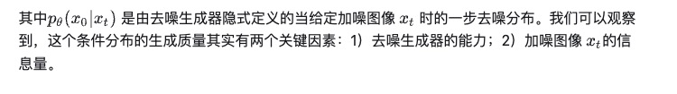
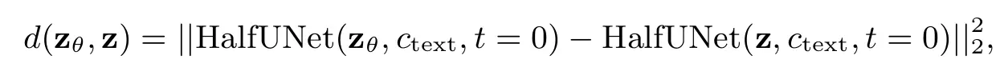
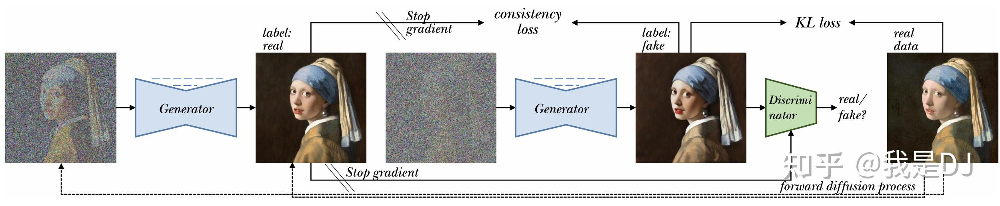
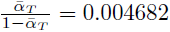

# few step gen


   
   
realistic-vision-v51  
这两张能被鉴黄   


## SDXS
Real-Time One-Step Latent Diffusion Models with Image Conditions    
小米2024 3.25     


2024.3.25 推出 SDXS-512-0.9 is a old version of SDXS-512. For some reasons, we are only releasing this version for the time being, and will gradually release other versions.

Model Information:

Teacher DM: SD Turbo   
Offline DM: SD v2.1 base   
VAE: TAESD  (10MB)


该模型与1.0版本的主要区别在于三个方面：

该版本采用TAESD，当weight_type为float16时，可能会产生低质量的图像。我们的图像解码器与当前版本的扩散器不兼容，因此现在不会提供。   
该版本没有执行实现细节部分中提到的LoRA-GAN微调，这可能会导致图像细节稍差。   
该版本在最高分辨率阶段用交叉注意力取代了自注意力，与直接删除它们相比，这引入了最小的开销。    

```
weight_type = torch.float32     # or float16

# use original VAE   335MB 
# pipe.vae = AutoencoderKL.from_pretrained("IDKiro/sdxs-512-0.9/vae_large")

```


### 原理
没看懂    

为了提高迭代采样的速度，作者引入了模型小型化和减少采样步骤的方法。该方法利用`知识蒸馏来简化 U-Net 和 图像解码器 的架构`，并引入了一种新的one step DM 训练技术，其使用了`特征匹配和分数蒸馏`。共推出了两种模型：SDXS-512 和 SDXS-1024，在单个 GPU 上分别实现了约 100 FPS（比 SD v1.5 快 30 倍）和 30 FP（比 SDXL 快 60 倍）的推理速度。此外，该训练方法尤其有利于图像条件控制和图像到图像的任务。    
文章 https://arxiv.org/abs/2403.16627   

此外，我们提出的方法还可以训练 ControlNet。   
   


methods   
#### Model Acceleration
    
unet去掉mid   
ctrlnet去掉mid   
image decoder没看懂    


We train an extremely light-weight image decoder to mimic the original VAE decoder’s output through a combination of output distillation loss and GAN loss. (335 -> 10 MB)   
我们训练一个极其轻量级的图像解码器，通过输出蒸馏损失和 GAN 损失的组合来模仿原始 VAE 解码器的输出。   
We also leverage the block removal distillation strategy to efficiently transfer the knowledge from the original U-Net to a more compact version.    
我们还利用块去除蒸馏策略来有效地将知识从原始 U-Net 转移到更紧凑的版本。   

U网。  LDM 采用 U-Net 架构 [36]，结合残差块和 Transformer 块作为其核心去噪模型。 为了利用预训练的 U-Net 的功能，同时减少计算需求和参数数量，我们采用了受 BK-SDM [16] 的块去除训练策略启发的知识蒸馏策略。 这涉及有选择地从 U-Net 中删除残差和 Transformer 块，旨在训练一个更紧凑的模型，该模型仍然可以有效地再现原始模型的中间特征图和输出。 图 2 (b) 说明了提取微型 U-Net 的训练策略。 知识蒸馏是通过输出知识蒸馏（OKD）和特征知识蒸馏（FKD）损失来实现的：   
    
    


甚至在 GPU 上实现了 100 FPS 的 512x512 图像生成和 30 FPS 的 1024x1024 图像生成。   
实测a800 512*512   
1 step   
46fps   
显存消耗3.5g   
  


#### 文本转图像
为了减少 NFE(number of function evaluations)，我们建议拉直采样轨迹straightening the sampling trajectory ，并通过用所提出的特征匹配损失替换蒸馏损失函数by replacing the distillation loss function with the proposed feature matching loss，快速将多步模型微调为一步模型。然后，我们扩展了 Diff-Instruct 训练策略，使用所提出的特征匹配损失的梯度来替换时间步后半部分由分数蒸馏提供的梯度。   


    
feature matching loss   

   

Diff-Instruct [37] 将分数蒸馏带回到图像生成中，依赖于两个分布 p、q 之间的 Integral Kullback-Leibler (IKL) 散度的定义：     
   
其中 qt 和 pt 表示时间 t 时扩散过程的边际密度。  (3)中q0和p0之间的IKL梯度为   


#### 图像到图像
我们将我们提出的训练策略扩展到 ControlNet 的训练，依靠将预训练的 ControlNet 添加到评分函数中。 the score function.   

   
 specifically for transformations involving canny edges and depth maps.   
     


#### 再阅读
提出了一个同时做diffusion模型轻量化和采样步数压缩的框架SDXS。    
对于模型压缩部分，主要关注于VAE的decoder和UNet的压缩，因为这两块占据的资源消耗是最多的。    
对于采样步数压缩部分，使用feature matching loss来代替蒸馏loss， 并且进一步地，扩展了Diff-Instruct训练策略，在timestep的后半部分，使用了feature matching loss的梯度来代替score distillation的梯度   

Methods    
Diff-Instruct    
    这一部分的基础知识可以参考对DreamFusion中的介绍。

Architecture Optimizations    

对VAE decoder的压缩是结合了`output distillation loss`和`GAN loss`来训练一个轻量化的image decoder来模仿原始的VAE decoder的输出。如公式1所示，G()是我要训练的tiny decoder，x是原始的decoder出来的图像，下采样了8倍计算的L1 loss, 说是为了减少冗余。使用的是一些包含残差块和上采样层的纯CNN结构。     
   

对于UNet，使用的是同时监督输出的OKD损失和监督中间层特征的FKD损失。如公式2所示。作者没有对其加原始的去噪损失。    
    

借鉴了block removal distillation策略，移除了对latency贡献最多的几个模块。比如，对于SD-2.1 base来说，去掉了middle stage，downsampling stage的最后一个stage，和upsampling的第一个stage，去除了最高分辨率stage的所有Transformer结构。     
对于controlNet的蒸馏，也是蒸馏了UNet中间特征层和最终的输出, 考虑到ControlNet不影响原始的UNet encoder的特征层，所以特征蒸馏只是在UNet的decoder上去做的。      


One-Step Training

    Feature Matching Warmup.
    这里借鉴了ReFlow的思想来讲故事，不过使用的是一个叫加权版SSIM的FM损失，如公式3所示。 

     

约束tiny unet生成的图像和原始的UNet使用ODE采样器生成的图像两个过encoder $f_{\theta}$ 在不同层上的特征的SSIM一致，不过作者使用FM损失只是用于warmup少量的训练steps。    


Segmented Diff-Instruct.

虽然feature matching loss可以生成清晰的图像，但是毕竟还不是直接和真实分布的匹配关系，所以只能用来当初始化。   
所以借鉴Diff-Instruct来匹配模型输出的分布。   
作者发现在采样轨迹是corse to fine的，t->T，score function提供了低频信息的梯度，t->0，提供的是高频信息的梯度。因此作者把采样过程分成了两部分，[0, \alpha T]和(\alpha T, T]，后者使用L_FM来代替，因为它可以提供足够多的低频信息。* 随着训练过程，逐渐降低FM损失的权重。   

    


    
实际中，online DM和student DM是交替训练的，并且在训练的中间阶段，将teacher DM 从预训练模型切换为经过训练的小型化一步模型本身，进一步减少了训练开销。   

#### 看原论文
假设图像生成时间限制为1秒，那么SDXL只能使用16个nfe生成略模糊的图像，而SDXS-1024可以生成30个清晰的图像。此外，我们提出的方法还可以训练ControlNet    

real distribution p0(x)   
dm模型的两种解释：  
代码dm定义：   
    
sde连续定义：   
    


Diff-Instruct     
有必要寻找一种方法从预训练的dm中提取其积累的知识，以指导能够在一步中生成样本的模型的训练。这种来自预训练dm的知识蒸馏被称为分数蒸馏，最初是在3D资产合成领域提出的   
Integral Kullback-Leibler (IKL)积分Kullback-Leibler (IKL)散度    
diff - directive[37]依靠两个分布p, q之间的积分Kullback-Leibler (IKL)散度的定义，将分数蒸馏带回到图像生成中:    

   


### 效果

```
# Ensure using 1 inference step and CFG set to 0.
image = pipe(
    prompt, 
    num_inference_steps=1, 
    guidance_scale=0,
    generator=torch.Generator(device="cuda").manual_seed(seed)
).images[0]

image.save("output.png")

```


## YOSO
"You Only Sample Once: Taming One-Step Text-To-Image Synthesis by Self-Cooperative Diffusion GANs"   
香港科技大学 2024.3.29


Note that YOSO-PixArt-α-512 is trained on JourneyDB with 512 resolution. YOSO-PixArt-α-1024 is obtained by directly merging YOSO-PixArt-α-512 with PixArt-XL-2-1024-MS, without extra explicit training on 1024 resolution.   

(YOSO-PixArt-α-512) This model is fine-tuning from PixArt-XL-2-512x512, enabling one-step inference to perform text-to-image generation.


论文好像只讲lora   
没调通

transformer训练在哪里？？？？    
公式真多   


### 原理
这是通过将扩散过程与 GAN 集成实现的。   
我们通过去噪生成器本身来平滑分布，执行自合作学习。   
by the denoising generator itself, performing self-cooperative learning   

我们提供了史上第一个`DiT`，可以在 512 分辨率上进行训练并生成图像，具有无需明确训练即可适应 1024 分辨率的能力。 

   

（2022|ICLR，扩散 GAN，少量步扩散，对抗散度，非饱和 GAN）用去噪扩散 GAN 解决生成学习难题

（2024，EBGAN，扩散，变分近似）通过扩散过程改进基于能量的对抗模型


#### cfg偏低
导致饱和度不足

加噪，去噪不一致，导致难以生成纯色图


#### 方法
自协同 扩散 GANs   
  


#### Diffusions+GANs (原作者博客)
然而扩散模型的核心缺点是缓慢的生成过程，哪怕采用最先进的采样器，也一般需要20步以上获得高质量的生成结果。

而另一方面，GANs这个生成模型领域在扩散模型之前无可争议的最强模型，其生成过程天然就是一步完成的。但是GANs的问题集中在训练过程的不稳定以及模式崩溃上。前者使得把GANs很难扩展到大型的图文数据集以及大型的模型上，需要极其复杂的模型设计，正则化设计，训练目标设计。这并不利于人们发展先进的文生图GANs技术，因此目前关注文生图的pure GANs不仅少，而且效果也不如扩散模型。

回顾现有的Diffusions+GANs

现有的文生图Diffusions+GANs的工作并不多，总结起来是两条路线：

1）结合diffusions的蒸馏技术和GANs技术：

SD-Turbo[1]是这条路线的代表之作，他们并`没有改动GANs的目标`，直接`把diffusions的去噪结果当成假图片，真实数据当成真图片`来进行GANs的训练。这里存在一个问题：GANs的对抗训练基本是原汁原味的，`容易出现模式崩溃和训练不稳定`。因此SD-Turbo是`在数据空间上定义的鉴别器，并且使用了预训练的Dino v2作为鉴别器骨干，这可以大大稳定训练过程`。但是这种做法的缺点很明显：`Stable Diffusion的动机就是把训练转移到latent space，这个鉴别器设计又把训练搬回去data space了，造成了训练成本的大大增加，说白了也就是stability AI卡大气粗玩得起：）。当然后续是SD3-turbo，他们也注意到了这个问题，把鉴别器又搬回latent space了`。。。

2）把对抗训练和加噪结合：

UFOGen[2]暂时是这条路线里唯一的作品（至少是笔者知道的范围里）。与SD-Turbo不同，UFOGen认为原始的GANs训练目标不稳定，因此需要`使用额外的技术光滑训练分布`。所以他们采用了和diffusions统一的设计，也就是说他们定义了不同的加噪级别，`把diffusions的去噪结果和真实数据都加一样程度的噪声，并在加噪图片上进行GANs的训练`。这种操作带来的好处不言而喻：`真实分布和虚假分布更难区分，从而稳定GANs的对抗训练`。但是`这种在加噪图片上进行的对抗训练，会导致次优的一步生成学习`。

原文   
LCM [30] 基于一致性蒸馏（consistency distillation） [49]，将其调整为稳定扩散（SD），并使图像在 4 步中具有可接受的质量。然而，减少采样步骤导致生成质量较差。

InstaFlow [27] 基于矫正流（Rectified Flows） [26, 25]，将其调整为稳定扩散，促进了仅一步生成文本到图像。尽管如此，生成图像的保真度仍然较低。此外，由于模型在固定数据噪声配对上的训练，失去了支持可变数据噪声组合的灵活性，这对于像图像修改或可以提高生成图像质量的迭代多步采样任务是有害的。

最近，探索了将 DM 和 GAN 结合用于一步文本到图像生成。UFOGen 将 DDGANs [52] 和 SSIDMs [57] 扩展到稳定扩散，通过将重建损失的计算从损坏样本改为清洁（clean）样本来进行修改。然而，它仍然使用损坏样本进行对抗匹配。

ADD [44] 提出了基于稳定扩散的一步文本到图像生成。它遵循早期研究，使用预训练的图像编码器 DINOv2 [35] 作为鉴别器的骨干来加速训练。然而，鉴别器设计将训练从潜在空间移动到像素空间，这大大增加了计算需求。此外，它们直接在清洁的真实数据上执行对抗匹配，增加了训练的挑战。这需要更好但昂贵的鉴别器设计和昂贵的 R1 正则化来稳定训练。

相比之下，我们通过用自生成数据替换真实数据来进行对抗训练，以平滑地实现真实数据。此外，与 UFOGen 和 ADD 相比，我们的方法可以从头开始训练以执行一步生成，这是他们没有展示的。此外，我们将我们的方法不仅扩展到 Stable Diffusion，还扩展到基于扩散 Transformer [37] 的 PixArt-α [6]。这证明了我们提出的 YOSO 的广泛应用。    


##### YOSO的设计   
基于上述两条结合Diffusions+GANs的技术路线，我们可以总结出他们都有各自的缺点。那么一个有趣的问题是，作为一个成年人，我们能不能既要又要呢？

再简要提炼一下我们要达到的目的：

- 光滑对抗目标，也就是`缩短“真实”分布和“伪造”分布之间的距离`。   
- 要达成有效的一步生成学习目标，也就是直接在干净样本上定义鉴别器。   

那么如何达到呢？再回顾一下扩散过程有不同级别的加噪图像，我们可以先定义一步生成的分布如下：  
   
   

  

##### YOSO的训练框架   

一个有趣的观察是给定去噪生成器不变，如果我们增加加噪图像 xt 的信息量，我们大概率能达到更好的去噪图片。得到这个观察之后，我们的算法就呼之欲出了，`核心思想与假设就是从高噪声图片解码出的图片质量不如从低噪图片解码出的图片`，因此我们可以`使用前者作为GANs训练目标的”假“图片，使用后者作为GANs训练的”真“图片`，并构造出如下的训练目标：    
    
其中第一项是经典的去噪目标，第二项是我们提出的对抗训练目标。注意到，我们这种范式和合作学习[3]的思想很像，后者是利用MCMC修正样本进行生成模型学习，而我们是`把低噪图片解码结果当作更好的分布进行学习`，`更好的分布和更差的分布都来自于去噪生成器本身`，因此我们可以称所提的设计为：自合作学习。     
[3] Jianwen Xie, Yang Lu, Ruiqi Gao, and Ying Nian Wu. Cooperative learning of energy-based model and latent variable model via mcmc teaching.     


我们还发现这种构建的目标其实和一致性模型（Consistency Models）[4] 有着很强的联系，不同的是`Consistency Models`把低噪声的图片视作对ODE解的近似，从而构造点对点的距离损失，这就`导致了和去噪步长有关的误差`，从而使其超参数选择变得敏感且困难。`而我们是在分布之间执行对抗损失，并没有这个误差的影响`，但是为了更好的约束模型的生成模式，我们可以把一致性损失加入训练中，从而构造如下的训练目标：   
   
注意在这个训练目标中，我们已经把对抗散度换成了具体进行训练的非饱和目标。   

迈向一步文生图    
虽然我们已经设计好了训练算法，但是实际上扩展到文生图需要做额外的设计。这是因为从头训练文生图的模型所需的计算资源是不可忍受的，我们需要使用预训练的模型作为初始化，并设计一些有效的训练技术使得我们能实现一步文生图。   
(绝大多数机构公司都是这个现状，有些甚至只有Lora微调)   

隐空间感知损失    
我们知道，感知损失是一种有效的图片距离计算损失。然而，我们能够用来初始化的预训练文生图扩散模型无一例外都定义在隐空间。这就导致了使用感知损失的计算成本大：我们不但要在数据空间上计算损失（这本来就贵），还要把隐变量解码，并通过解码器反向传播，这进一步放大了计算成本。最近的研究展现出了预训练的stable diffusion能作为有效的特征提取器[5]，因此我们可以使用预训练的SD计算感知损失。然而SD的骨干是个unet，输入和输出等维，因此我们可以使用unet的middle block计算损失：   
   
这就是所提的隐空间感知损失。注意我们不单实现了隐空间的感知损失，而且SD支持输入文本条件，我们实际上实现了计算给定文本，不同图片之间的距离，这对于文生图任务来说有额外的好处。   
其中 z 是由 VAE 编码的潜在图像，ctext 是文本特征。我们注意到通过稳定扩散计算潜在感知损失的好处不仅在于计算效率，而且在于融合了文本特征，这在文本到图像任务中至关重要。     

隐空间鉴别器    
GANs的训练可以受益于良好的鉴别器设计，而以前的研究证实了使用预训练网络当鉴别器骨干是有好处的。因此与隐空间感知损失相同，我们可以使用SD作为鉴别器骨干初始化，同样的我们只使用半个UNet，也就是只计算到middle block，并在后面接上简单的鉴别头。我们观察到，使用隐空间鉴别器使得训练可以快速收敛，并且也不需要SD-Turbo中使用到的昂贵R1正则化损失（需要计算梯度的梯度？？？？？？）(指像素空间运算，或者说原始latent 128*128空间)。    
所提出策略的优势有两方面：1）我们使用信息丰富的预训练网络作为初始化；2）鉴别器定义在潜在空间中，具有计算效率。与以前在数据空间中定义鉴别器并需要解码潜在图像并从解码器反向的、具有昂贵的计算成本的方法不同，通过应用潜在鉴别器，我们观察到训练过程更加稳定，收敛速度更快。请注意，在我们的方法中不需要昂贵的 R1 正则化。           

解决加噪调度的缺陷   
我们注意到，扩散模型中的最终加噪样本并不是纯噪声，而保留了一定程度的图片信息。这个现象在stable diffusion里尤为明显：   
   
可以看到SD的最终加噪样本其实远远没达到纯噪声，这就导致了训练与采样的分布差距？？？？。`在多步采样中，这个缺陷导致的后果并不明显，人们只观察到SD不能生成很黑或者很亮的图像`。然而我们观察到，这个差距在一步生成中是很明显的，能导致图像的`明显伪像`。为了解决这个问题，我们有两个简单有效的方案：   
   
1）信息先验初始化（Informative Prior Initialization (IPI)）：为了解决这个问题，我们可以采用有信息的初始化，而不是纯噪声初始化。我们使用一个简单的正态分布拟合最终加噪的图像分布，效果是显著的，从上图可以看到使用IPI的图像质量明显更优。????    
实际上会加一个latent     
实际操作怎么初始化？？？？        
什么函数可以生成非高斯噪声？生成有信息噪声？？？？   

   
2）快速转换到v-prediction和终端纯噪声调度：IPI并不是一个完美的解决方案，它在解决终端加噪样本非常接近纯噪声时会遇到数值不稳定问题，上图展示了我们在PixArt上的微调结果，预测ε会导致失败的一步生成。而一个完美的解决方案应该是切换到v-prediction以及使用终端纯噪声调度。而我们观察到，用预测ε的模型初始化，进行v-prediction的YOSO训练会遭遇收敛慢的问题。因此我们提出了一个快速适应的阶段解决这个问题：i）先把模型转换到v-prediction，这个步骤使用预测ε的教师模型参数化v，让学生学习教师模型利用ε参数化出的v；ii）把v-prediction的模型转换到终端纯噪声调度，在这个过程我们在转换学生模型的噪声调度，保持教师的不变，不然预测ε的教师模型是没办法预测纯噪声对应的v的，损失函数保持不变。我们观察到这个快速收敛阶段总共仅仅需要1k迭代就能完成转换，从而彻底解决噪声调度的缺陷。？？？？     

实验一 从头训练的无条件生成     
    
YOSO与SD-Turbo很不同的一点在于，我们的训练目标并不一定需要基于强大的预训练模型，而可以支持从头训练。上表展示了在CIFAR-10数据集上的结果。    
一些值得关注的实验结果：

1）和直接在真实数据上进行对抗训练的对比

从上面的图表我们可以看出，直接在真实数据上进行对抗训练不但效果更差，而且训练也更不稳定。而YOSO提出的对抗目标，达到了更好的效果以及更稳定的训练。

2）和在加噪数据上进行对抗训练的对比

从上表中的UFOGen可以观察到，在加噪数据上进行对抗训练，得到的一步生成结果很差，这佐证了我们上文的观点：加噪的对抗训练会导致次优的一步生成学习。

3）和一致性模型的对比

一致性模型是扩散领域大牛宋飏提出的一种一步生成模型，有着很强的效果。可以看到改进之后的iCT的CIFAR-10的效果其实是比YOSO要好的。但是一致性模型的问题在于：其需要大量的训练资源达到最优的生成效果。从上面的表2可以观察到：当我们使用和YOSO一样的批大小与迭代次数复现iCT时，其生成效果显著下降。我们需要指出的是，YOSO对计算资源的低要求使得我们可以利用有限的计算资源将其扩展到文生图领域。


实验二  文生图实验    
我们在JourneyDB数据集上微调PixArt-α和SD 1.5，批大小设为256。
   
可以看到，基于PixArt-α [6]或SD 1.5的YOSO都显著超越了更多或者相同参数的SD-Turbo。而YOSO-PixArt-α更是展现出了可以和SDXL-Turbo相提并论的性能，注意参数量的对比：0.6B v.s. 2.6B。这表明了所提YOSO的有效性。   
   
我们的模型具有更好的指令追随，比如第一行的比卡丘，指令里要求比卡丘有红色的眼睛和生气的表情，而SDXL-Turbo与SD-Turbo都未能忠实的跟随这一指令。更加值得注意的是，我们观察到SDXL-Turbo有着严重的模式坍塌现象，比如第一行的比卡丘和第三行的绿色恐龙，SDXL-Turbo生成了非常接近的样本，而YOSO并没有这个现象。   

MAD-GAN-2017:单个生成器会产生模式坍塌现象,多个生成器结合起来可以保证样本的多样性,但是简单添加多个彼此鼓励的生成器并没有很大的意义   
模式坍塌（Mode collapse）   
模式（mode）是特征分布中的峰值。一般来说，现实世界中的分布中一般存在多种模式，如MINST数据集中的十种数字就是十种模式。模式坍塌（mode collapse）是指GAN产生的样本单一，其认为满足某一分布的结果为true，其他为False，导致以上结果。比方说利用MINST产生手写数字时，生成器陷入一种模式，只产生特定类型的数字而不产生其他数字的状态，即为模式坍塌    


拓展到1024分辨率：   
我们的训练是在512分辨率上完成的。然而我们注意到PixArt-α拥有从512分辨率模型继续训练到1024分辨率的检查点。受激励于LCM-LoRA的广泛组合性，我们使用了类似的技术组合YOSO-PixArt-α与PixArt-1024：   
   


通过这种组合我们可以一步生成高至1024分辨率的高质量图像生成，并且兼容不同的长宽比。

LoRA微调：我们还提供了额外的使用LoRA进行微调的实验，我们注意到哪怕仅仅使用LoRA微调，YOSO也能实现合理的一步生成质量，这据我们所知应该是目前唯一能做到这个的工作。   
   

从上表可以看到，YOSO-LoRA一步生成的指标甚至优于LCM-LoRA的4步生成，这强烈说明了所提技术的有效性。另外我们也提供YOSO-LoRA的可视化比较：   
   
可以看到，YOSO-LoRA表现出了显著优于InstaFlow和LCM-LoRA两步生成的效果。值得注意的是InstaFlow是进行全参数微调的模型。   

广泛的应用：使用LoRA进行微调的一大好处是，我们可以广泛的兼容社区的模型与插件。从上图中可以看出，我们的YOSO-LoRA支持一步到位的图像编辑，`支持与不同的base model进行融合，支持兼容controlnet`。这说明我们方法的广泛兼容性。


#### 文章翻译再阅读
   
我的理解是，不仅使用真实数据计算loss(kl)，还使用低噪声生成数据做loss(consistency)     

这是通过将扩散过程与 GAN 集成实现的。具体来说，我们通过去噪生成器本身平滑分布，执行自协同（self-cooperative）学习。我们展示了我们的方法可以作为一个从头开始进行训练的一步生成模型   

扩散-GAN 混合模型。扩散模型中的一个问题是，当去噪步长较大时，真实的 q(x_(t−1) | xt) 不再是一个高斯分布？？？？？？？。因此，Diffusion GANs [52] 提议不再使用参数化的高斯分布来最小化负 ELBO，而是提出最小化模型 pθ(x′_(t−1) | xt) 和 q(x_(t−1) | xt) 之间的对抗差异：  

  
其中，pθ(x0|xt) 是由 GAN 生成器强加的。 基于 GAN 的 pθ(x′_(t−1) | xt) 公式的能力，使得更大的去噪步长（即 4 步）成为可能，相比之下高斯分布要小得多。   

扩散-GAN 混合模型被设计用于训练大去噪步长。然而，一个关键问题是它们在损坏的数据分布上匹配生成器分布   
   
这种公式只间接学习 pθ(x0|xt) 且 pθ(x0) =  
     
这是用于一步生成的分布，使得学习过程不够有效。？？？？？？？？   

为了实现更有效的一步生成学习，我们建议直接构建在干净数据上的学习目标。我们首先按以下方式构建干净数据的序列分布：  
    
   

其中 q(x0) 是数据分布，而 Gθ 是去噪生成器，用于预测干净样本。如果网络 ϵθ 被参数化以预测噪声，我们有     
   

给定构建的分布，我们可以如下制定优化目标：    
 


这些公式我都看不懂？？？？        

优化目标是通过对抗散度和 KL 散度的组合构建的。具体而言，对抗散度侧重于在分布级别上匹配，确保生成质量，而 KL 散度侧重于在点级别上匹配，确保模式覆盖。     
然而，直接学习在干净数据分布上的对抗散度与 GAN 训练的挑战类似，这是困难的。为了解决这些挑战，之前的 Diffusion GAN [52, 57] 已经转向学习在损坏数据分布上的对抗散度。不幸的是，正如之前分析的那样，这种方法无法直接匹配 pθ(x0)，从而削弱了一步生成的效果。此外，它还迫使鉴别器适应不同水平的噪声，导致其能力受限。      
回想一下，p^(t)_θ (x) 被定义为      
   
分布的质量有两个关键因素：1）可训练生成器 Gθ 的能力；2）由 xt 给出的信息。   
因此，假设给定生成器 Gθ 固定，如果增加 xt 中的信息量，可以得到更好的分布。      

换句话说，p^(t−1)_θ (x) 很可能优于 p^(t)_θ (x)。 受到协同方法（cooperative approach） [53–55, 11] 的启发，该方法使用模型分布的马尔可夫链蒙特卡洛（MCMC）修订版本来学习生成器，我们建议使用 p^(t−1)_θ (x) 作为学习 p^(t)_θ (x) 的gt，构建以下训练目标：
   
其中 sg[·] 表示停梯度（stop-gradient）操作。这个训练目标可以看作是一种自协同方法，因为来自 p^(t−1)_θ (x) 的 ‘修订’ 样本和来自 p^(t)_θ (x) 的样本由相同的网络 Gθ 生成。请注意，我们仅在平滑学习目标时用数据分布替换 p^(t−1)_θ (x) 作为对抗散度，因为最近的研究 [32] 发现用真实数据和修订数据混合学习生成器是有益的。    

在上述分布匹配目标中，我们应用了`非饱和 GAN 目标`来`最小化边际分布的对抗散度`。`点匹配的 KL 散度可以通过 L2 损失`进行优化。因此，可处理的训练目标如下所示：   
   

其中 Dϕ 是鉴别器网络。我们发现自协同方法与一致性模型 [49] 相关联。然而，一致性模型将 x_(t−1) 视为 xt 的近似 ODE 解以执行点对点匹配（像素级别）。相比之下，我们提出的目标在边际分布级别上匹配 p^(t)_θ (x) 和 p^(t−1)_θ (x)，这避免了与去噪步长相关的 ODE 近似误差。  为了进一步确保所提出模型的模式覆盖，我们可以将`一致性损失`添加到我们的目标中作为正则化???????，构建我们的最终训练目标：     
         
其中 λcon(t) 是一个依赖于时间的超参数。   


5. 朝向一步文本到图像合成      

值得注意的是，最近的研究 [27, 49] 发现，LPIPS 损失 [62] 对于获得具有高样本质量的少量步扩散模型至关重要。然而，值得注意的缺点是，LPIPS 损失是在数据空间中计算的，这是昂贵的。相比之下，流行的潜在扩散模型在潜在空间中运行，以减少计算需求。因此，在训练潜在扩散模型时使用 LPIPS损失是非常昂贵的，因为它不仅需要在数据空间中计算 LPIPS 损失，还需要额外的解码操作。      


固定噪声调度器     
扩散模型中的一个常见问题是最终的损坏样本不是纯噪声。例如，稳定扩散使用的噪声计划使得终端信噪比（terminal SNR）远未达到零。最终时间步的损坏样本如下：   
   
其中，终端 SNR 是     
    

如果我们直接从标准高斯分布中采样噪声，在一步生成中会出现明显的伪影。原因可能是在多步生成中，可以逐渐修复这个差距，而一步生成更直接地反映了这个差距。为了解决这个问题，我们提供了两种简单而有效的解决方案。     

1.信息先验初始化（Informative Prior Initialization，IPI）。非零终端 SNR 问题类似于 VAE 中的先验空洞（prior hole）问题 [22, 3, 21]。因此，我们可以使用信息先验而不是非信息先验来有效解决这个问题。为简单起见，我们采用可学习的高斯分布 N(μ, σ^2·I)，其最优形式如下： 
    
其中 E_x x 和 Std(x) 可以通过有限样本有效地估计，而 ϵ′ 遵循标准高斯分布。所提出的信息先验初始化有效地解决了一步生成中的 “先验空洞问题”？？？？？？？？？？why？？。如图 2 所示，一步生成中的伪影立即消除。我们注意到，这种性能是通过最小的调整实现的，从而使得通过 LoRa 微调开发一步文本到图像生成的可能性成为可能。       
   

2.快速适应 V 预测（V-prediction）和零终端（Zero Terminal） SNR。信息先验初始化并不是一个完美的解决方案，当终端 SNR 非常低时，它会受到数值不稳定性的影响。如图 3 所示，我们对 PixArt-α [6] 进行微调，其终端 SNR 为 4e-5，并引入了技术和 ϵ-预测，但在一步生成中失败了。正如在 [24] 中讨论的那样，解决方案应该是 v-预测 [42] 和零终端 SNR 的组合。然而，我们发现直接切换到 v-预测和零终端 SNR 是计算量很大的，需要大量的额外迭代。这在解决具有有限计算资源的大规模文本到图像问题中是不可接受的。为了解决这个问题，我们提出了一个适应阶段，将预训练的扩散模型微调到 v-预测和零终端 SNR。         
    
适应阶段-I 切换到 v-预测：      
     
  
其中 θ 表示我们要获取的 v-预测模型的参数，ϕ 表示带有 ϵ-预测的冻结预训练模型的参数。    

适应阶段-II 切换到零终端 SNR：    
   
请注意，在适应阶段-II 中，我们将噪声调度器更改为零终端 SNR？？？？？？？。但对于教师模型，我们保持噪声调度器不变？？？？？？？？？？？。这种方法避免了零终端 SNR 的 ϵ-预测的数值不稳定性问题。我们注意到，零终端 SNR 在每个时间步上具有比原始调度更低的 SNR，因此，通过从教师中蒸馏，损失构成了一个有效的目标来构建零终端 SNR 学生。      
我们注意到，这种适应阶段收敛迅速，通常只需要1000次迭代训练。这使得可以从预训练的 ϵ-预测模型快速适应到 v-预测和零终端SNR，从而全面缓解了噪声调度中的非零终端 SNR 问题。       


#### PixArt-XL-2-512x512

PixArt-XL-2-512x512 模型结构    
   

Pixart-α 由用于潜在扩散的纯 Transformer 块组成：它可以在单个采样过程中根据文本提示直接生成 1024px 图像。  
`DiT`    

原始单步就能生成。yoso经过微调   
It is a Transformer Latent Diffusion Model that uses one fixed, pretrained text encoders (T5)) and one latent feature encoder (VAE).   
PixArt-α: Fast Training of Diffusion Transformer for Photorealistic Text-to-Image Synthesis（2023.9）


本文介绍PIXART-A，一种基于 Transformer 的 T2I 扩散模型，其图像生成质量可与最先进的图像生成器（例如 Imagen、SDXL，甚至 Midjourney）竞争，达到接近商业应用的标准。此外，它还支持高达 1024px 分辨率的高分辨率图像合成，训练成本较低，如图 1 和图 2 所示。为了实现这一目标，提出了三个核心设计：`（1）训练策略分解：我们设计了三个不同的训练步骤分别优化像素依赖性、文本图像对齐和图像美学质量； （2）高效的T2I Transformer：我们将交叉注意力模块合并到Diffusion Transformer（DiT）中，以注入文本条件并简化计算密集型的类条件分支； （3）高信息数据：我们强调文本-图像对中概念密度的重要性，并利用大型视觉语言模型自动标记密集的伪标题以辅助文本-图像对齐学习。`结果，PIXART-A训练速度明显超越现有的大规模T2I模型，例如PIXART-A仅花费 Stable Diffusion v1.5 训练时间的 10.8%（A100 GPU 675 天 vs. 6,250 天），节省近300,000美元（ 26,000美元vs. 320,000美元），并减少 90% 的二氧化碳排放。而且，与更大的SOTA模型RAPHAEL相比，我们的训练成本仅为1%。大量实验证明 PIXART-A在图像质量、艺术性和语义控制方面表现出色。我们希望PIXART-A将为 AIGC 社区和初创公司提供新的见解，以加速从头开始构建自己的高质量且低成本的生成模型。    

我的理解是采用了高质量 少量数据 从头训练出了较好的效果   
数据量2500万张，很少    
训练策略，使用dit 密集类条件注入   


它更适合训练和推理，并且将添加最先进的扩散采样器（如`SA-Solver`）    

##### SA-Solver
：用于扩散模型快速采样的随机 Adams 求解器     
SA-Solver: Stochastic Adams Solver for Fast Sampling of Diffusion Models   
扩散概率模型（DPM）在生成任务中取得了相当大的成功。由于从 DPM 采样相当于求解扩散 SDE 或 ODE，非常耗时，因此提出了许多基于改进微分方程求解器的快速采样方法。大多数此类技术都考虑求解扩散常微分方程，因为它具有卓越的效率。然而，随机抽样可以在生成多样化和高质量的数据方面提供额外的优势。在这项工作中，我们从方差控制扩散SDE和线性多步SDE求解器两个方面对随机采样进行了全面分析。根据我们的分析，我们提出了 SA-Solver，它是一种改进的高效随机 Adams 方法，用于求解扩散 SDE 以生成高质量数据。我们的实验表明，SA-Solver 实现了：1）与现有最先进的少步采样采样方法相比，性能得到改进或相当； 2) 在适当数量的功能评估 (NFE) 下，在大量基准数据集上获得 SOTA FID 分数。    

  

Limitations   
The model does not achieve perfect photorealism  
The model cannot render legible text   
The model struggles with more difficult tasks which involve compositionality, such as rendering an image corresponding to “A red cube on top of a blue sphere”   
fingers, .etc in general may not be generated properly.   
The autoencoding part of the model is lossy.   
模型的自动编码部分是有损的。    
 


### 实践
#### 第一种方式：加载lora 和 sd1.5
只有一个lora模型。可以调用社区的sd1.5。   
加载lora失败
a800换了一个a800 diffusers库加载运行成功

只支持sd1.5框架


新a800使用diffusers0.26.3转realist的diffusers模型到ckpt   
到comfyui单纯底模运行失败   

    RuntimeError: Error(s) in loading state_dict for AutoencoderKL:
        size mismatch for encoder.mid.attn_1.q.bias: copying a param with shape torch.Size([512, 1, 1]) from checkpoint, the shape in current model is torch.Size([512]).
但是在diffusers0.26.3的a800能使用diffusers库完整运行realist + lora 


旧a800使用最新0.27.2转，在3090上comfyui运行底模成功   

   
　　最后，diffusers这个代码仓库日新月异，每天都在高强度更新，所以读者需要多git pull安装最新版本，这两个转换脚本什么时候发生变化也不能保证滴。    
https://blog.csdn.net/weixin_43590796/article/details/130818747    


问题不知道出在哪里    
使用   

直接把safetensor转换为ckpt就好了,comfyui不会再报loraloader Error while deserializing header: HeaderTooLarge      
网上还有说去装最新的diffusers库，但感觉和comfyui关系不大    
没事   

加载lora失败
Name: safetensors
Version: 0.4.2
Name: diffusers
Version: 0.28.0.dev0

换机器加载成功
都是a800
但是担心比较时显存和速度会有所不同
Name: safetensors
Version: 0.4.2
Name: diffusers
Version: 0.25.0


##### 1步推理  
目前仅允许基于 SD v1.5 进行 1 步推理。   
 And you should prepare the informative initialization according to the paper for better results.
即需要额外准备图像latent   
```
import torch
from diffusers import DiffusionPipeline, LCMScheduler
pipeline = DiffusionPipeline.from_pretrained("runwayml/stable-diffusion-v1-5", torch_dtype = torch.float16)
pipeline = pipeline.to('cuda')
pipeline.scheduler = LCMScheduler.from_config(pipeline.scheduler.config)
pipeline.load_lora_weights('Luo-Yihong/yoso_sd1.5_lora')
generator = torch.manual_seed(318)
steps = 1
bs = 1
latents = ... # maybe some latent codes of real images or SD generation
latent_mean = latent.mean(dim=0)
noise = torch.randn([1,bs,64,64])
input_latent = pipeline.scheduler.add_noise(latent_mean.repeat(bs,1,1,1),noise,T)
imgs= pipeline(prompt="A photo of a dog",
                    num_inference_steps=steps, 
                    num_images_per_prompt = 1,
                        generator = generator,
                        guidance_scale=1.5,
                    latents = input_latent,
                   )[0]
imgs

```
如果没有质量会较差   
```
pipeline = DiffusionPipeline.from_pretrained("runwayml/stable-diffusion-v1-5", torch_dtype = torch.float16)
pipeline = pipeline.to('cuda')
pipeline.scheduler = LCMScheduler.from_config(pipeline.scheduler.config)
pipeline.load_lora_weights('Luo-Yihong/yoso_sd1.5_lora')
generator = torch.manual_seed(318)
steps = 1
imgs = pipeline(prompt="A photo of a corgi in forest, highly detailed, 8k, XT3.",
                    num_inference_steps=1, 
                    num_images_per_prompt = 1,
                        generator = generator,
                        guidance_scale=1.,
                   )[0]
imgs[0]


```

我根据旧版本构造   

    image = pipeline_yoso_lora(
            prompt=prompt,
            num_inference_steps=steps, 
            num_images_per_prompt = 1,
            generator = torch.Generator(device="cuda").manual_seed(seed),
            guidance_scale=cfg,
            negetive_prompt = negetive_prompt,
            output_type="latent",
            ).images
    bs = 1
    latents = image # maybe some latent codes of real images or SD generation
    latent_mean = latents.mean(dim=0)
    noise = torch.randn([1,bs,64,64])
    noise = noise.to('cuda')
    timesteps = torch.randint(0, pipeline_yoso_lora.scheduler.config.num_train_timesteps, (bs,), device=latents.device)
    timesteps = timesteps.long()
    input_latent = pipeline_yoso_lora.scheduler.add_noise(latent_mean.repeat(bs,1,1,1), noise, timesteps)
    input_latent = input_latent.to(torch.float16)
我这样是0-1000步加噪，作者只是加噪1步

作者新版本构造   

    image = pipeline_yoso_lora(
            prompt=prompt,
            num_inference_steps=steps, 
            num_images_per_prompt = 1,
            generator = torch.Generator(device="cuda").manual_seed(seed),
            guidance_scale=cfg,
            negetive_prompt = negetive_prompt,
            output_type="latent",
            ).images
    bs = 1
    latents = image # maybe some latent codes of real images or SD generation
    latent_mean = latents.mean(dim=0)
    noise = torch.randn([bs,1,64,64])
    noise = noise.to('cuda')
    timesteps = torch.ones(bs).to(latents.device) * 999
    timesteps = timesteps.long()
    init_latent = latent_mean.repeat(bs,1,1,1) + latents.std() *  torch.randn_like(noise)
    input_latent = pipeline_yoso_lora.scheduler.add_noise(init_latent , noise, timesteps)
    input_latent = input_latent.to(torch.float16)

在我看来 文生图 领域这就是两步推理，而且效果还没有两部推理好，类似sdxl原理    
唯一的优势在于选定了某个主题主角，可以给先验latent,然后一步生图     
做一个引导   
区别两步推理在于：   
1. 如果使用生成latent，中间多加一步噪声   
2. 如果使用主题主角引导，需要限定范围，可以直接获取    

这套更新的代码更加用不了    
更差   
直接花图   
   


##### 2步推理   
我们注意到，小的 CFG 可用于提高图像质量。   


#### 第二种方式 yoso_pixart512
加载yoso_pixart512 transfomer. 主模型加载PixArt-XL-2-512x512。lcm schedu . v_prediction    
需要加装pip install sentencepiece（t5模型）(PixArt-XL-2-512x512)     


##### sentencepiece
Unsupervised text tokenizer for Neural Network-based text generation.    
17年发布，到现在仍在更新   
谷歌的语言模型bert，文生图模型PixArt 一般都要加装sentencepiece   
openai则使用另外的分词方式：bpe。如clip sd   

the vocabulary size is predetermined prior to the neural model training.   
其中词汇量大小在神经模型训练之前预先确定  
SentencePiece implements subword units (e.g., byte-pair-encoding (BPE) [Sennrich et al.]) and unigram language model [Kudo.]) with the extension of direct training from raw sentences.   
SentencePiece allows us to make a purely end-to-end system that does not depend on language-specific pre/postprocessing.   


技术亮点   
纯粹数据驱动：SentencePiece 从句子训练标记化和去标记化模型。预标记化（Moses tokenizer / MeCab / KyTea）并不总是需要的。   
与语言无关：SentencePiece 将句子视为 Unicode 字符序列。不存在依赖于语言的逻辑。  
多子字算法：BPE [ Sennrich 等人。 ] 和一元语言模型[ Kudo。 ] 支持。  
子词正则化：SentencePiece 实现了子词采样以进行子词正则化和BPE-dropout，这有助于提高 NMT 模型的鲁棒性和准确性。   
快速且轻量级：分词速度约为 50k 句/秒，内存占用约为 6MB。   
自包含：只要使用相同的模型文件，就可以获得相同的标记化/去标记化。  
直接词汇id生成：SentencePiece管理词汇到id的映射，并且可以直接从原始句子生成词汇id序列。  
基于 NFKC 的标准化：SentencePiece 执行基于 NFKC 的文本标准化。  


#### 第3种方式 yoso_pixart1024
加载yoso_pixart1024 transfomer. 主模型加载PixArt-XL-2-512x512。lcm schedu . v_prediction

## 总结
SDXS-512-0.9 is a old version of SDXS-512. 论文中的512和1024模型尚未开源    
yoso : This is an early version of our pre-trained models, it is expected to be updated soon.     
测试模型均不是论文中的最佳模型    

yoso有两个工作：  
1. 基于PixArt-XL-2 （DiT模型）全参训练  
2. 训练 1 step generate - lora，可以和社区的其他模型结合  


## 其他模型
LCM [30] 基于一致性蒸馏（consistency distillation） [49]，将其调整为稳定扩散（SD），并使图像在 4 步中具有可接受的质量。然而，减少采样步骤导致生成质量较差。

InstaFlow [27] 基于矫正流（Rectified Flows） [26, 25]，将其调整为稳定扩散，促进了仅一步生成文本到图像。尽管如此，生成图像的保真度仍然较低。此外，由于模型在固定数据噪声配对上的训练，失去了支持可变数据噪声组合的灵活性，这对于像图像修改或可以提高生成图像质量的迭代多步采样任务是有害的


### SDXL-Lightning
可以看到 SDXL-Lightning 在 2-8 步之间的生成效果都不错，8 步时质量最稳定，甚至与 SDXL 模型 32 步的生成效果不相上下；即使在 4 步的条件下，在图像质量以及风格多样性也比 Turbo 和 LCM 模型好很多。   
SDXL-Lightning 模型是从 Stability AI 的   stable-diffusion-xl-base-1.0 模型中，使用了一种结合渐进式和对抗式蒸馏的扩散蒸馏方法提炼出来的。渐进式蒸馏使提炼后的模型能保留原模型的图像风格和种类，对抗式蒸馏则用于提升图像生成质量，二者结合使 SDXL-Lightning 在图像的快速生成和高质量、多样化之间找到了一个平衡点， 使其在快速出图的同时，依旧能保持较高的图像质量，并且能够覆盖广泛的图像模式。   

最近，探索了将 DM 和 GAN 结合用于一步文本到图像生成。UFOGen 将 DDGANs [52] 和 SSIDMs [57] 扩展到稳定扩散，通过将重建损失的计算从损坏样本改为清洁（clean）样本来进行修改。然而，它仍然使用损坏样本进行对抗匹配。     
ADD [44] 提出了基于稳定扩散的一步文本到图像生成。它遵循早期研究，使用预训练的图像编码器 DINOv2 [35] 作为鉴别器的骨干来加速训练。然而，鉴别器设计将训练从潜在空间移动到像素空间，这大大增加了计算需求。此外，它们直接在清洁的真实数据上执行对抗匹配，增加了训练的挑战。这需要更好但昂贵的鉴别器设计和昂贵的 R1 正则化来稳定训练。    

相比之下，我们通过用自生成数据替换真实数据来进行对抗训练，以平滑地实现真实数据。此外，与 UFOGen 和 ADD 相比，我们的方法可以从头开始训练以执行一步生成，这是他们没有展示的。此外，我们将我们的方法不仅扩展到 Stable Diffusion，还扩展到基于扩散 Transformer [37] 的 PixArt-α [6]。这证明了我们提出的 YOSO 的广泛应用。    


# prompt 数据集
## parti prompts
https://huggingface.co/datasets/nateraw/parti-prompts   
https://github.com/google-research/parti   
tsv 或 parque 读取   
几百KB   

   
    
  

PartiPrompts (P2) is a rich set of over 1600 prompts in English that we release as part of this work. P2 can be used to measure model capabilities across various categories and challenge aspects.   
     
P2 提示可以很简单，让我们能够衡量扩展的进度。它们也可以很复杂，例如我们为文森特·梵高的《星夜》（1889）创建的以下 67 字描述：   
Oil-on-canvas painting of a blue night sky with roiling energy. A fuzzy and bright yellow crescent moon shining at the top. Below the exploding yellow stars and radiating swirls of blue, a distant village sits quietly on the right. Connecting earth and sky is a flame-like cypress tree with curling and swaying branches on the left. A church spire rises as a beacon over rolling blue hills.    


### 典型案例
针对sdxl有两个prompt来发现其缺点   
"a motorcycle",  
"a black background with a large yellow square",  

playground进行了针对性优化


### 数据集来源：   
谷歌2022年推出 Pathways Autoregressive Text-to-Image model (Parti), an autoregressive text-to-image generation model    

Parti 和 Imagen 在探索两个不同的生成模型系列（分别是自回归模型和扩散模型）方面是互补的   
Parti 将文本到图像的生成视为序列到序列的建模问题，类似于机器翻译——这使其能够受益于大型语言模型的进步，尤其是通过扩展数据和模型大小来解锁的功能。     
In this case, the target outputs are `sequences of image tokens` instead of text tokens in another language.    

Parti 使用功能强大的图像标记器ViT-VQGAN将图像编码为离散标记序列  
通过将 Parti 的编码器-解码器参数扩展到 200 亿个参数，持续提高质量。
MS-COCO 上最先进的零样本 FID 得分为 7.23，微调后的 FID 得分为 3.22。   
我们对 Localized Narratives 和 PartiPrompts 的分析在各种类别和难度方面的有效性，这是我们作为这项工作的一部分发布的 1600 多个英语提示的新整体基准。   

   

从 350M 参数扩展到 20B 参数   

The 20B model especially excels at prompts that are abstract, require world knowledge, specific perspectives, or writing and symbol rendering.   
   
已经能写字   
   


provide a detailed example of it in the paper, where we build a very complex prompt and strategies to produce an image that fully reflects the description.    
https://arxiv.org/abs/2206.10789   
Scaling Autoregressive Models for Content-Rich Text-to-Image Generation   
   
  


### 难例分析
https://sites.research.google/parti/    

Two baseballs to the left of three tennis balls.   
A rhino beetle this size of a tank grapples a real life passenger airplane on the tarmac.   
A portrait of a statue of Anubis with a crown and wearing a yellow t-shirt that has a space shuttle drawn on it. A white brick wall is in the background.   
A cream colored labradoodle next to a white cat with black-tipped ears.   
A plate that has no bananas on it. there is a glass without orange juice next to it.   
A robot painted as graffiti on a brick wall. The words "Fly an airplane" are written on the wall. A sidewalk is in front of the wall, and grass is growing out of cracks in the concrete.   
A shiny robot wearing a race car suit and black visor stands proudly in front of an F1 race car. The sun is setting on a cityscape in the background. comic book illustration.    


## DiffusionDB
   
DiffusionDB is the first large-scale text-to-image prompt dataset. It contains 14 million images generated by Stable Diffusion using prompts and hyperparameters specified by real users.   
数据集中的文本大部分是英文。它还包含其他语言，例如西班牙语、中文和俄语。

DiffusionDB 提供两个子集（DiffusionDB 2M 和 DiffusionDB Large）来支持不同的需求。    
   
两个子集具有相似数量的独特提示，但 DiffusionDB Large 具有更多的图像。 DiffusionDB Large 是 DiffusionDB 2M 的超集。   
DiffusionDB 2M中的图像按格式存储png； DiffusionDB Large 中的图像使用无损webp格式。  


我们使用模块化的文件结构来分发 DiffusionDB。 DiffusionDB 2M 中的 200 万张图像被分为 2,000 个文件夹，其中每个文件夹包含 1,000 个图像和一个 JSON 文件，该文件将这 1,000 个图像链接到它们的提示和超参数。同样，DiffusionDB Large 中的 1400 万张图像被分为 14000 个文件夹。   

```
# DiffusionDB 2M
./
├── images
│   ├── part-000001
│   │   ├── 3bfcd9cf-26ea-4303-bbe1-b095853f5360.png
│   │   ├── 5f47c66c-51d4-4f2c-a872-a68518f44adb.png
│   │   ├── 66b428b9-55dc-4907-b116-55aaa887de30.png
│   │   ├── [...]
│   │   └── part-000001.json
│   ├── part-000002
│   ├── part-000003
│   ├── [...]
│   └── part-002000
└── metadata.parquet


```

```
# DiffusionDB Large
./
├── diffusiondb-large-part-1
│   ├── part-000001
│   │   ├── 0a8dc864-1616-4961-ac18-3fcdf76d3b08.webp
│   │   ├── 0a25cacb-5d91-4f27-b18a-bd423762f811.webp
│   │   ├── 0a52d584-4211-43a0-99ef-f5640ee2fc8c.webp
│   │   ├── [...]
│   │   └── part-000001.json
│   ├── part-000002
│   ├── part-000003
│   ├── [...]
│   └── part-010000
├── diffusiondb-large-part-2
│   ├── part-010001
│   │   ├── 0a68f671-3776-424c-91b6-c09a0dd6fc2d.webp
│   │   ├── 0a0756e9-1249-4fe2-a21a-12c43656c7a3.webp
│   │   ├── 0aa48f3d-f2d9-40a8-a800-c2c651ebba06.webp
│   │   ├── [...]
│   │   └── part-000001.json
│   ├── part-010002
│   ├── part-010003
│   ├── [...]
│   └── part-014000
└── metadata-large.parquet


```


```
{
  "f3501e05-aef7-4225-a9e9-f516527408ac.png": {
    "p": "geodesic landscape, john chamberlain, christopher balaskas, tadao ando, 4 k, ",
    "se": 38753269,
    "c": 12.0,
    "st": 50,
    "sa": "k_lms"
  },
}

Data Fields
key: Unique image name
p: Prompt
se: Random seed
c: CFG Scale (guidance scale)
st: Steps
sa: Sampler


```


然而，生成具有所需细节的图像很困难，因为它需要用户编写正确的提示来指定确切的预期结果。开发此类提示需要反复试验，并且常常让人感觉随意且无原则。西蒙·威利森将编写提示比作巫师学习“魔法咒语”：用户不明白为什么某些提示有效，但他们会将这些提示添加到他们的“咒语书”中。例如，为了生成高度详细的图像，在提示中添加“artstation 上的趋势”和“虚幻引擎”等特殊关键字已成为常见做法。
 “trending on artstation” and “unreal engine”    


我们通过在官方 Stable Diffusion Discord 服务器上抓取用户生成的图像来构建 DiffusionDB。我们选择稳定扩散，因为它是目前唯一开源的大型文本到图像生成模型，并且所有生成的图像都具有 CC0 1.0 通用公共领域奉献许可证，该许可证放弃所有版权并允许用于任何目的。我们选择官方的Stable Diffusion Discord 服务器是因为它是公开的，并且它对生成和共享非法、仇恨或 NSFW（不适合工作，例如性和暴力内容）图像有严格的规则。服务器还不允许用户编写或共享带有个人信息的提示。


### Parquet
我们以 Parquet 格式存储这些表，因为 Parquet 是基于列的：您可以有效地查询各个列（例如提示），而无需读取整个表。

下面是来自 的三个随机行metadata.parquet。

metadata.parquet为 (2000000, 13)， 的形状metatable-large.parquet为 (14000000, 13)。两个表共享相同的架构，每行代表一个图像   

   


方法 3. 使用metadata.parquet（仅限文本）   
如果您的任务不需要图像，那么您可以轻松访问表中的所有 200 万个提示和超参数metadata.parquet。   
```
from urllib.request import urlretrieve
import pandas as pd

# Download the parquet table
table_url = f'https://huggingface.co/datasets/poloclub/diffusiondb/resolve/main/metadata.parquet'
urlretrieve(table_url, 'metadata.parquet')

# Read the table using Pandas
metadata_df = pd.read_parquet('metadata.parquet')

```


## JourneyDB 
Neural Information Processing Systems (NeurIPS) 2023   
1CUHK MMLab,   2The University of Hong Kong,   3Shanghai AI Laboratory,   4Nanjing University,   5CPII   


是一个大规模生成的图像理解数据集，包含4,429,295 张 高分辨率的 Midjourney 图像，并附有相应的文本提示、图像标题和 视觉问答等注释。

如图 1 所示，对于每个图像实例，我们获取相应的文本提示，用于使用 Midjourney 生成图像。此外，我们使用 GPT3.5 来生成标题和 VAQ groundtruth。     
   
   

每个实例都包含一个Midjourney图像、一个文本提示、一个标题和一个 VAQ 基本事实。

我们将风格提示分为 344 个类别，包括 3.2 节中介绍的相机参数、灯光、艺术家风格、配色方案等，并在每个类别中进行风格提示检索，这显着缩小了搜索空间。为了建立基准，我们使用 CLIP 来执行零样本检索评估。结果如表5所示。我们注意到整体风格提示空间的检索导致召回率极低。当在每个类别的子空间上检索时，模型的表现要好得多。  
   


我们设置了任务：提示反演，它采用单个图像并预测相应的提示。  
现有模型很难捕获输入图像的细节和风格相关信息，并且在传统数据集中的表现也不佳。    
   


## 高效推理
comfyui一次几个模型   
生态插件逐步变好   
安装方便   
xyz不知道行不行   

webui可以输出xyz 每一步去噪图


# 结尾