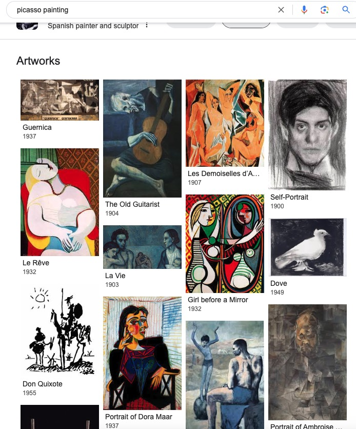

# CustomNet

替代方案 lora    

: Object Customization with Variable-Viewpoints in Text-to-Image Diffusion Models.   
CustomNet: Zero-shot Object Customization with Variable-Viewpoints in Text-to-Image Diffusion Models    

需要额外安装  
basicsr   
但依赖tb-nightly    
清华源不存在tb-nightly    
pip install tb-nightly -i https://mirrors.aliyun.com/pypi/simple    

CustomNet is novel unified customization method that can generate harmonious customized images without test-time optimization. CustomNet supports explicit viewpoint, location, text controls while ensuring object identity preservation.    
   
不知道background-image在哪里设置，示例代码好像没有   

可以通过文字描述或用户定义的背景来实现位置控制和灵活的背景控制。   
`Some` methods `finetune T2I models for each object individually at test-time`, which tend to be overfitted and time-consuming     
`Others train an extra encoder` to extract object visual information for customization efficiently but struggle to preserve the object’s identity.       
we incorporates `3D novel view synthesis` capabilities into the customization process    
we propose a `dataset construction pipeline` to better handle real-world objects and complex backgrounds.    
Additionally, we introduce delicate designs that enable `location control and flexible background control` through textual descriptions or user-defined backgrounds. Our method allows for object customization without the need of test-time optimization     

将定制对象合并到图像生成中是文本到图像 (T2I) 生成的一个有吸引力的功能。一些方法在测试时单独微调每个对象的 T2I 模型，这往往会过度拟合且耗时。其他人训练额外的编码器来提取对象视觉信息以进行有效的定制，但很难保留对象的身份。为了解决这些限制，我们提出了 CustomNet，这是一个基于编码器的统一对象定制框架，它明确地将 3D 新颖视图合成功能合并到定制过程中。这种集成有助于空间位置和视点的调整，产生不同的输出，同时有效地保留对象的身份。为了有效地训练我们的模型，我们提出了一个数据集构建管道，以更好地处理现实世界的对象和复杂的背景。此外，我们还引入了精致的设计，可以通过文字描述或用户定义的背景来实现位置控制和灵活的背景控制。我们的方法允许对象定制，无需测试时优化，提供对视点、位置和文本的同步控制。实验结果表明，我们的方法在身份保存、多样性和和谐性方面优于其他定制方法。

使用方法：输入一张白背景的物品图片作为参考图图，输入prompt编辑背景，可以通过参数改变物品在图片中的坐标位置和3D视角。   
测试模型：CustomNet   
测试参数：   
DDIM，采样50步，GUI无法修改    
测试结论：人物恢复效果差，文本控制不太准确，上下视角不太准确，小图时， 绘制效果不好。图片会被预处理成256*256。    

# PixArt-Σ    
该组织不嫌累

Weak-to-Strong Training of Diffusion Transformer for 4K Text-to-Image Generation   

(🔥 New) Apr. 6, 2024. 💥 PixArt-Σ checkpoint 256px & 512px are released!   
(🔥 New) Mar. 29, 2024. 💥 PixArt-Σ training & inference code & toy data are released!!!   

华为诺亚方舟实验室、大连理工大学、香港大学、香港科技大学    
https://pixart-alpha.github.io/PixArt-sigma-project/    
https://arxiv.org/abs/2403.04692    
[Submitted on 7 Mar 2024 (v1), last revised 17 Mar 2024 (this version, v2)]

## 该组织前期研究
1Huawei Noah's Ark Lab, 2Dalian University of Technology, 3The University of Hong Kong,     
OpenXLab    

  
### PixArt-α: Fast Training of Diffusion Transformer for Photorealistic Text-to-Image Synthesis    
被yoso用来微调模型    
few_step_gen folder有简略介绍    
https://arxiv.org/abs/2310.00426   
[Submitted on 30 Sep 2023 (v1), last revised 29 Dec 2023 (this version, v3)]  

### PIXART-δ: Fast and Controllable Image Generation with Latent Consistency Models    
https://arxiv.org/abs/2401.05252    
[Submitted on 10 Jan 2024]   

Alpha的大小写形式分别是 Α 和 α 。它是希腊字母表中的第1个字母。
Delta(大写 Δ,小写 δ),是第四个希腊字母      
英语名称： sigma ，汉语名称：西格玛（大写Σ，小写σ）Sigma是希腊字母的第十八个字母        
  
PIXART-δ: Fast and Controllable Image Generation with Latent Consistency Models    
PixArt-Σ: Weak-to-Strong Training of Diffusion Transformer for 4K Text-to-Image Generation    

Thanks to PixArt-α, DiT and OpenDMD for their wonderful work and codebase!

## 推理
可以使用gradio推理   
支持diffusers   
可以训练和推理   
有256 512 1024模型    
512dmd模型     

nvcc11.8,torch 2.0.0没说明cu版本   
好像默认11.7   

    File "/root/miniconda3/envs/pixart/lib/python3.9/site-packages/torch/nn/modules/conv.py", line 459, in _conv_forward
        return F.conv2d(input, weight, bias, self.stride,
    RuntimeError: cuDNN error: CUDNN_STATUS_INTERNAL_ERROR

pip install torch==2.0.0 torchvision==0.15.1 torchaudio==2.0.1 --index-url https://download.pytorch.org/whl/cu118      
卸载重装     
还是cudnn错误   

但是这个3090是可以运行webui推理    

有人说 其实就是gpu显存不够，减小点工作量就可以了    

 2、手动使用cudnn

    import torch
    torch.backends.cudnn.enabled = False

dmd模型指定timesteps 400    

    timesteps (`List[int]`, *optional*):
            Custom timesteps to use for the denoising process. If not defined, equal spaced `num_inference_steps`
            timesteps are used. Must be in descending order.       

## 原理
主要模型结构与PixArt-α相同   

    use_resolution_binning (`bool` defaults to `True`):
        If set to `True`, the requested height and width are first mapped to the closest resolutions using
        `ASPECT_RATIO_1024_BIN`. After the produced latents are decoded into images, they are resized back to
        the requested resolution. Useful for generating non-square images.

## k-diffusion

最后，您可能听说过 k-diffusion 这个术语，并想知道它是什么意思。它指的是 Katherine Crowson 的 k-diffusion GitHub 存储库以及与之相关的采样器。    
https://github.com/crowsonkb/k-diffusion    
An implementation of Elucidating the Design Space of Diffusion-Based Generative Models (Karras et al., 2022) for PyTorch, with enhancements and additional features, such as improved sampling algorithms and transformer-based diffusion models.     

该资源库实现了 Karras 2022 文章中研究的采样器。    
 [Submitted on 1 Jun 2022 (v1), last revised 11 Oct 2022 (this version, v2)]   
Elucidating the Design Space of Diffusion-Based Generative Models     

基本上，除了 DDIM、PLMS 和 UniPC 之外，AUTOMATIC1111 中的所有采样器都是从 k-diffusion 中借用的。

Enhancements/additional features

    k-diffusion supports a highly efficient hierarchical transformer model type.

    k-diffusion supports a soft version of Min-SNR loss weighting for improved training at high resolutions with less hyperparameters than the loss weighting used in Karras et al. (2022).

    k-diffusion has wrappers for v-diffusion-pytorch, OpenAI diffusion, and CompVis diffusion models allowing them to be used with its samplers and ODE/SDE.

    k-diffusion implements DPM-Solver, which produces higher quality samples at the same number of function evalutions as Karras Algorithm 2, as well as supporting adaptive step size control. DPM-Solver++(2S) and (2M) are implemented now too for improved quality with low numbers of steps.

    k-diffusion supports CLIP guided sampling from unconditional diffusion models (see sample_clip_guided.py).

    k-diffusion supports log likelihood calculation (not a variational lower bound) for native models and all wrapped models.

    k-diffusion can calculate, during training, the FID and KID vs the training set.

    k-diffusion can calculate, during training, the gradient noise scale (1 / SNR), from An Empirical Model of Large-Batch Training, https://arxiv.org/abs/1812.06162).

To do

    Latent diffusion

## 类似模型
### stabilityai/sdxl-turbo   
SDXL-Turbo is a fast generative text-to-image model that can synthesize photorealistic images from a text prompt in a single network evaluation.    

SDXL-Turbo is a distilled version of SDXL 1.0, trained for real-time synthesis. SDXL-Turbo is based on a novel training method called Adversarial Diffusion Distillation (ADD) (see the technical report), which allows sampling large-scale foundational image diffusion models in `1 to 4 steps` at high image quality. This approach uses score distillation to leverage large-scale off-the-shelf image diffusion models as a teacher signal and combines this with an adversarial loss to ensure high image fidelity even in the low-step regime of one or two sampling steps.

Finetuned from model: SDXL 1.0 Base

### latent-consistency/lcm-lora-sdxl
Latent Consistency Model (LCM) LoRA: SDXL    

Latent Consistency Model (LCM) LoRA was proposed in LCM-LoRA: A universal Stable-Diffusion Acceleration Module by Simian Luo, Yiqin Tan, Suraj Patil, Daniel Gu et al.

It is a distilled consistency adapter for stable-diffusion-xl-base-1.0 that allows to reduce the number of inference steps to only between `2 - 8 steps.`

The adapter can be loaded with it's base model stabilityai/stable-diffusion-xl-base-1.0. Next, the scheduler needs to be changed to LCMScheduler and we can reduce the number of inference steps to just 2 to 8 steps. Please make sure to either disable guidance_scale or use values between 1.0 and 2.0.

Combine with styled LoRAs    
LCM-LoRA can be combined with other LoRAs to generate styled-images in very few steps (4-8). In the following example, we'll use the LCM-LoRA with the papercut LoRA. To learn more about how to combine LoRAs, refer to this guide.

### PixArt-δ-1024-LCM
PixArt-alpha/PixArt-LCM-XL-2-1024-MS

Pixart-α consists of pure transformer blocks for latent diffusion: It can directly generate 1024px images from text prompts `within a single sampling process.`

LCMs is a diffusion distillation method which predict PF-ODE's solution directly in latent space, achieving super fast inference with few steps.

[Submitted on 6 Oct 2023]      
Latent Consistency Models: Synthesizing High-Resolution Images with Few-Step Inference     
Latent Diffusion models (LDMs) have achieved remarkable results in synthesizing high-resolution images. However, the iterative sampling process is computationally intensive and leads to slow generation. Inspired by Consistency Models (song et al.), we propose Latent Consistency Models (LCMs), enabling swift inference with minimal steps on any pre-trained LDMs, including Stable Diffusion (rombach et al). Viewing the guided reverse diffusion process as solving an augmented probability flow ODE (PF-ODE), LCMs are designed to directly predict the solution of such ODE in latent space, mitigating the need for numerous iterations and allowing rapid, high-fidelity sampling. Efficiently distilled from pre-trained classifier-free guided diffusion models, a high-quality 768 x 768 2~4-step LCM takes only 32 A100 GPU hours for training. Furthermore, we introduce Latent Consistency Fine-tuning (LCF), a novel method that is tailored for fine-tuning LCMs on customized image datasets. Evaluation on the LAION-5B-Aesthetics dataset demonstrates that LCMs achieve state-of-the-art text-to-image generation performance with few-step inference. 

https://latent-consistency-models.github.io/

# cosxl     
Cosine-Continuous Stable Diffusion XL   
Cosine-Continuous EDM VPred schedule     

Cos Stable Diffusion XL 1.0 and Cos Stable Diffusion XL 1.0 Edit   

可以一致的生成2k 4k 8k   
显存恒为25g左右    
清晰度没有上升，就是图片大小变大了    
所以是为什么能够一致性的生成？？？？？？    
而且速度还挺快   

尝试使用realistic_vision_v51进行4096*4096生图   
Ran out of memory when regular VAE encoding, retrying with tiled VAE encoding.     
显存2g上升到5g   
42s/it     
42steps 

半个小时    

   
正常写法生图效果不好    
   
确切地说需要使用eular42步    
   
使用dpm ++ 2m不太正常   

要加上ip2p写法    
   

类似ip2p工作  
[Submitted on 28 Jan 2023 (v1), last revised 2 Nov 2023 (this version, v2)]     
SEGA: Instructing Text-to-Image Models using Semantic Guidance         

## 对比度
对比度指的是一幅图像中明暗区域最亮的白和最暗的黑之间不同亮度层级的测量，差异范围越大代表对比越大，差异范围越小代表对比越小，好的对比率120:1就可容易地显示生动、丰富的色彩，当对比率高达300:1时，便可支持各阶的颜色。但对比率遭受和亮度相同的困境，现今尚无一套有效又公正的标准来衡量对比率，所以最好的辨识方式还是依靠使用者眼睛。    
在暗室中，白色画面(最亮时)下的亮度除以黑色画面(最暗时)下的亮度。  

