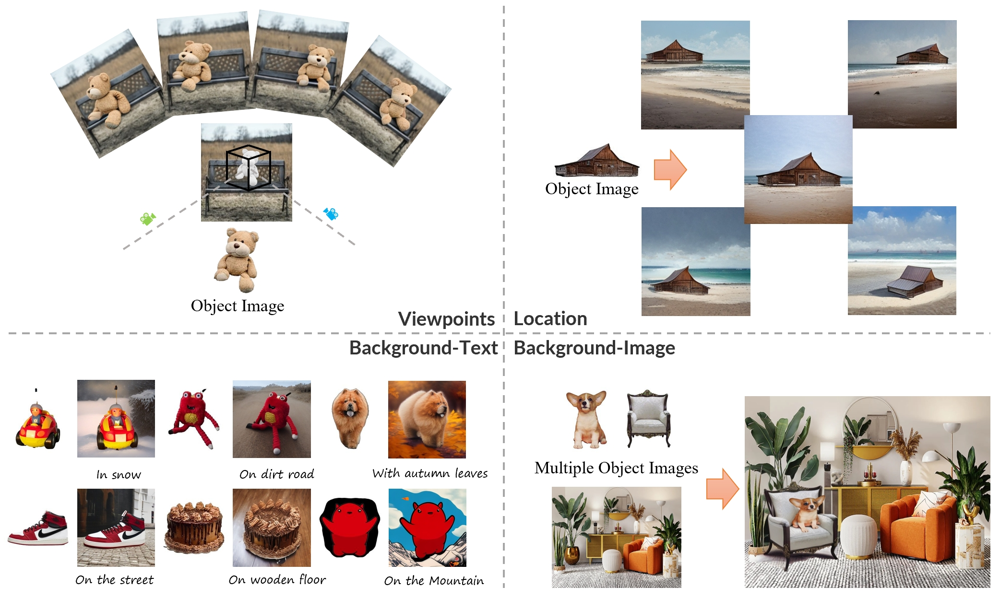
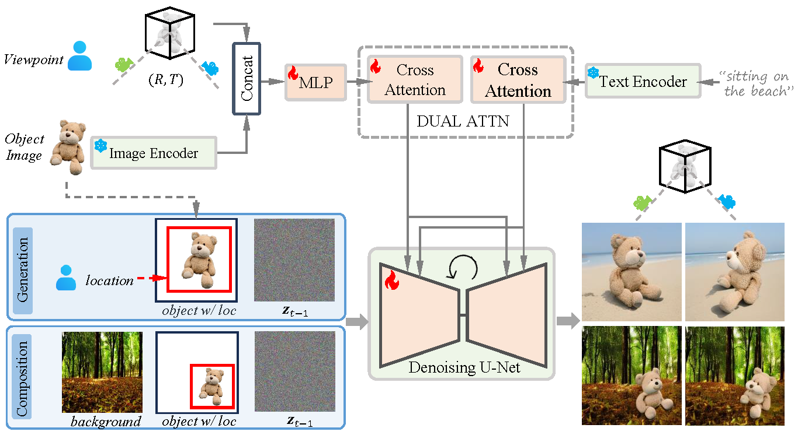
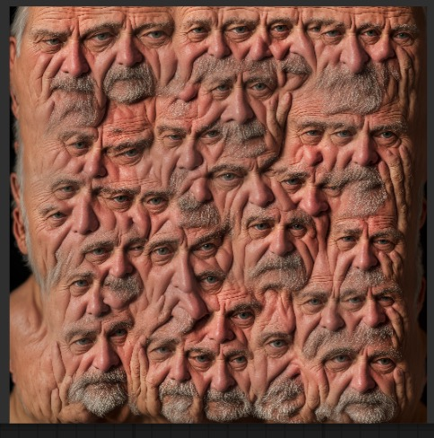
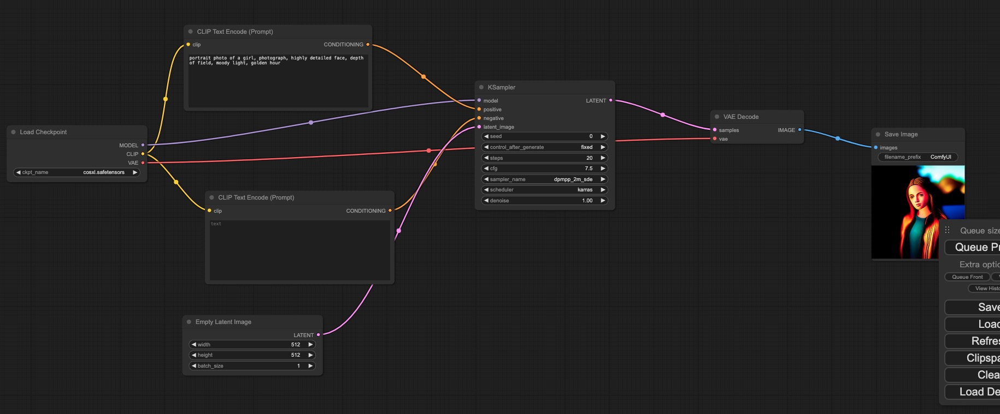
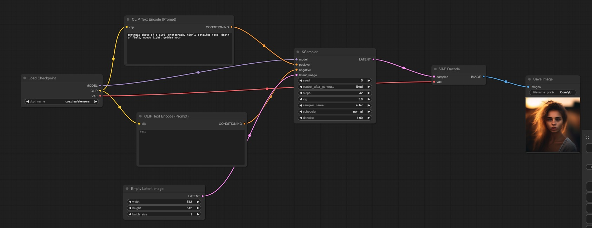
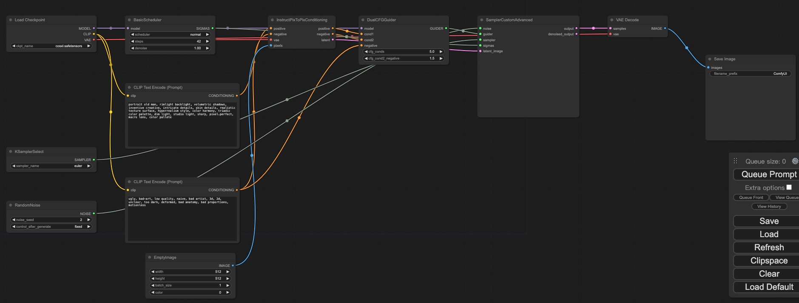

# CustomNet
: Object Customization with Variable-Viewpoints in Text-to-Image Diffusion Models.   
CustomNet: Zero-shot Object Customization with Variable-Viewpoints in Text-to-Image Diffusion Models    

需要额外安装  
basicsr   
但依赖tb-nightly    
清华源不存在tb-nightly    
pip install tb-nightly -i https://mirrors.aliyun.com/pypi/simple    

CustomNet is novel unified customization method that can generate harmonious customized images without test-time optimization. CustomNet supports explicit viewpoint, location, text controls while ensuring object identity preservation.    
   
不知道background-image在哪里设置，示例代码好像没有   

可以通过文字描述或用户定义的背景来实现位置控制和灵活的背景控制。   
`Some` methods `finetune T2I models for each object individually at test-time`, which tend to be overfitted and time-consuming     
`Others train an extra encoder` to extract object visual information for customization efficiently but struggle to preserve the object’s identity.       
we incorporates `3D novel view synthesis` capabilities into the customization process    
we propose a `dataset construction pipeline` to better handle real-world objects and complex backgrounds.    
Additionally, we introduce delicate designs that enable `location control and flexible background control` through textual descriptions or user-defined backgrounds. Our method allows for object customization without the need of test-time optimization     

# PixArt-Σ 
Weak-to-Strong Training of Diffusion Transformer for 4K Text-to-Image Generation   

(🔥 New) Apr. 6, 2024. 💥 PixArt-Σ checkpoint 256px & 512px are released!   
(🔥 New) Mar. 29, 2024. 💥 PixArt-Σ training & inference code & toy data are released!!!   

华为诺亚方舟实验室、大连理工大学、香港大学、香港科技大学    
https://pixart-alpha.github.io/PixArt-sigma-project/    
https://arxiv.org/abs/2403.04692    
[Submitted on 7 Mar 2024 (v1), last revised 17 Mar 2024 (this version, v2)]

## 该组织前期研究
https://arxiv.org/abs/2310.00426   
[Submitted on 30 Sep 2023 (v1), last revised 29 Dec 2023 (this version, v3)]    
PixArt-α: Fast Training of Diffusion Transformer for Photorealistic Text-to-Image Synthesis    
被yoso用来微调模型    
few_step_gen folder有简略介绍   

https://arxiv.org/abs/2401.05252    
[Submitted on 10 Jan 2024]   
PIXART-δ: Fast and Controllable Image Generation with Latent Consistency Models    

## 推理
使用gradio推理   
尚不支持diffusers   
可以训练和推理   
有256 512 1024模型    
后续还会出dmd模型     

nvcc11.8,torch 2.0.0没说明cu版本   
好像默认11.7   

    File "/root/miniconda3/envs/pixart/lib/python3.9/site-packages/torch/nn/modules/conv.py", line 459, in _conv_forward
        return F.conv2d(input, weight, bias, self.stride,
    RuntimeError: cuDNN error: CUDNN_STATUS_INTERNAL_ERROR

pip install torch==2.0.0 torchvision==0.15.1 torchaudio==2.0.1 --index-url https://download.pytorch.org/whl/cu118      
卸载重装     
还是cudnn错误   

但是这个3090是可以运行webui推理    

有人说 其实就是gpu显存不够，减小点工作量就可以了    

 2、手动使用cudnn

    import torch
    torch.backends.cudnn.enabled = False

## 原理
主要模型结构与PixArt-α相同   

# cosxl
Cos Stable Diffusion XL 1.0 and Cos Stable Diffusion XL 1.0 Edit   

可以一致的生成2k 4k 8k   
显存恒为25g左右    
清晰度没有上升，就是图片大小变大了    
所以是为什么能够一致性的生成？？？？？？    
而且速度还挺快   

尝试使用realistic_vision_v51进行4096*4096生图   
Ran out of memory when regular VAE encoding, retrying with tiled VAE encoding.     
显存2g上升到5g   
42s/it     
42steps 

半个小时    

   
正常写法生图效果不好    
   
确切地说需要使用eular42步    
   
使用dpm ++ 2m不太正常   

要加上ip2p写法    
   

