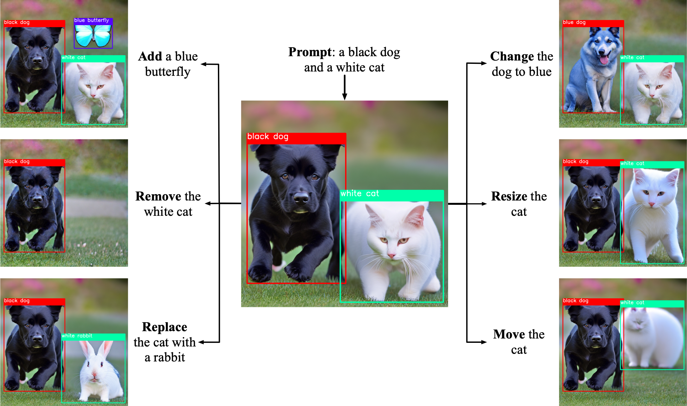
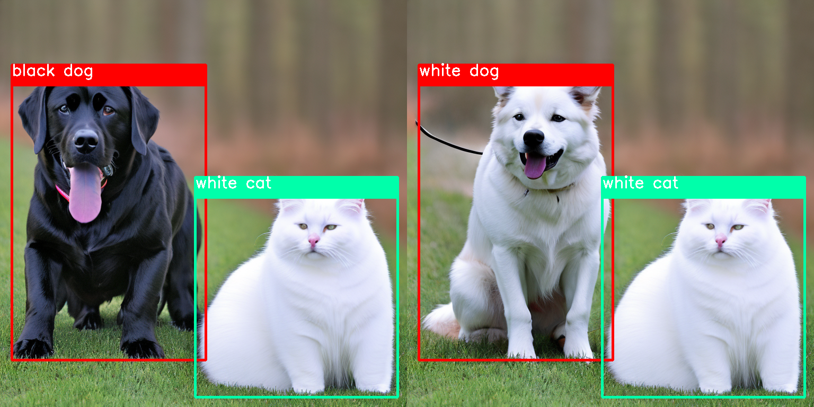
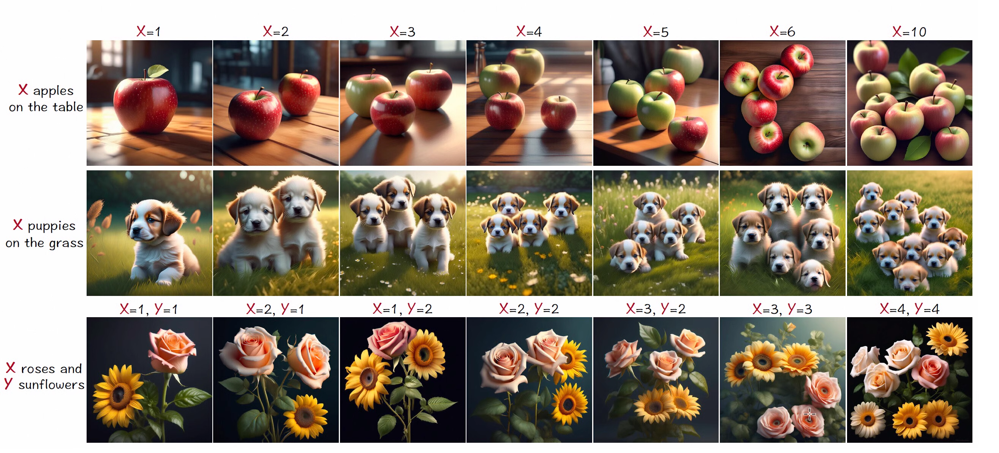
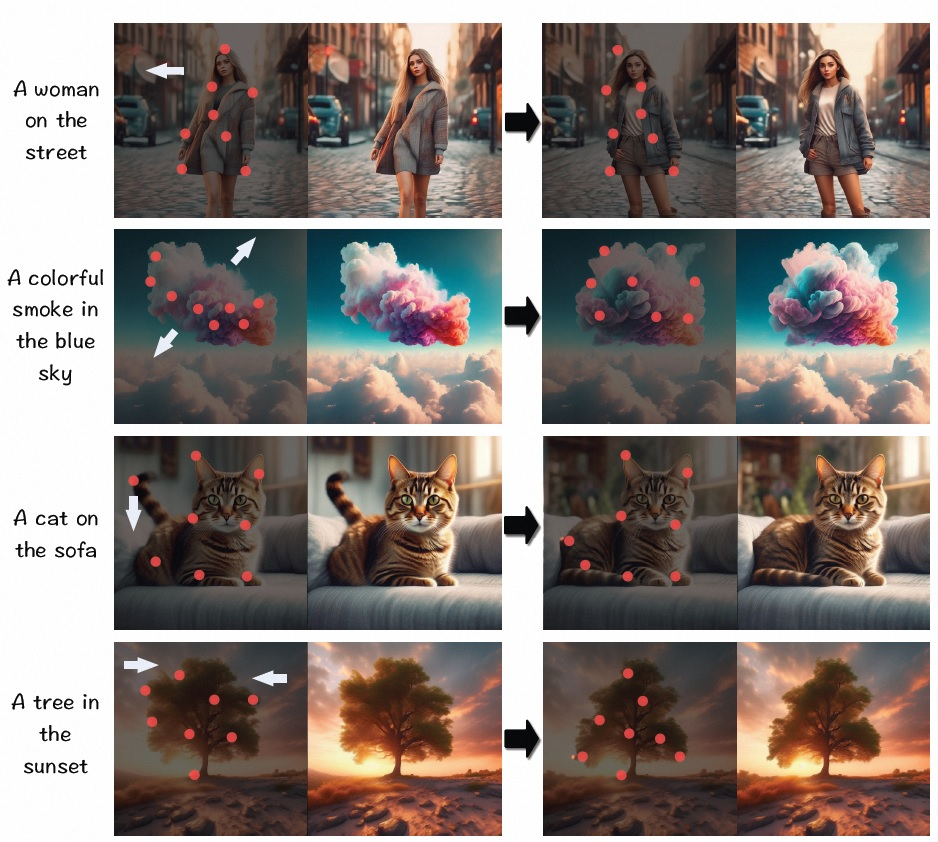

Ranni: Taming Text-to-Image Diffusion for Accurate Prompt Following    
Ranni：驯服文本到图像的扩散以实现准确的提示跟随   

## TODO:
模型控制效果测试，五六个控制方法     
对比两个其他模型    
related_work????     

## 基本信息：  
机构：    
Alibaba Group   |   Ant Group     

仓库：     
https://github.com/ali-vilab/Ranni   

[Submitted on 28 Nov 2023 (v1), last revised 9 Apr 2024 (this version, v3)]    
https://arxiv.org/abs/2311.17002    

This repository is based on the following codebases:

https://github.com/Stability-AI/stablediffusion   
https://github.com/lllyasviel/ControlNet/

权重：    
https://modelscope.cn/models/yutong/Ranni/files   

2024 4.8 : Ranni 被接受为 CVPR 2024 口头论文 🎉    
2024年4.3：我们发布了Ranni的v1代码。    

待办事项列表：    
支持更多条件。    
基于聊天的编辑。    
具有 ID 一致性的连续生成。     

   
## 原理：     
该存储库是 CVPR 2024 论文“Ranni: Taming Text-to-Image Diffusion for Accurate instructions Follow”的官方实现。它包含两个主要组件：1）基于LLM的规划模型，将文本指令映射到图像中的视觉元素，2）基于扩散的绘画模型，在第一阶段按照视觉元素绘制图像。得益于LLM的强大能力，Ranni获得了更好的语义理解。目前，我们发布的模型权重包括 LoRA 微调的 LLaMa-2-7B 和完全微调的 SDv2.1 模型。     

    
     

现有的文本到图像（T2I）扩散模型通常难以解释复杂的提示，尤其是那些具有数量、对象属性绑定和多主题描述的提示。在这项工作中，我们引入了语义面板作为将文本解码为图像的中间件，支持生成器更好地遵循指令。该面板是通过借助大型语言模型对从输入文本中解析出的视觉概念进行排列而获得的，然后将其作为详细的控制信号注入到去噪网络中以补充文本条件。为了促进文本到面板的学习，我们提出了精心设计的语义格式化协议，并配有全自动数据准备管道。得益于这样的设计，我们称之为 `Ranni 的方法能够增强预训练的 T2I 生成器的文本可控性`。更重要的是，`生成中间件的引入带来了更便捷的交互形式`（即直接调整面板中的元素或使用语言指令），并进一步允许用户精细地定制他们的生成，在此基础上我们开发了实用的系统和展示其在连续生成和基于聊天的编辑方面的潜力。    

具有不同的交互方式，包括（a）直接生成，准确提示跟随， （b）连续生成，逐步细化，以及（c）基于聊天的文本指令生成。   

提出了数量意识提示     
     
解决customnet的问题     

对空间关系进行提示。

对属性绑定进行了提示，包括(a)颜色绑定和(b)纹理绑定。为了清楚比较，随机种子被固定以保留一行中的空间排列。    

颜色编辑     

shape editing   
    

 

