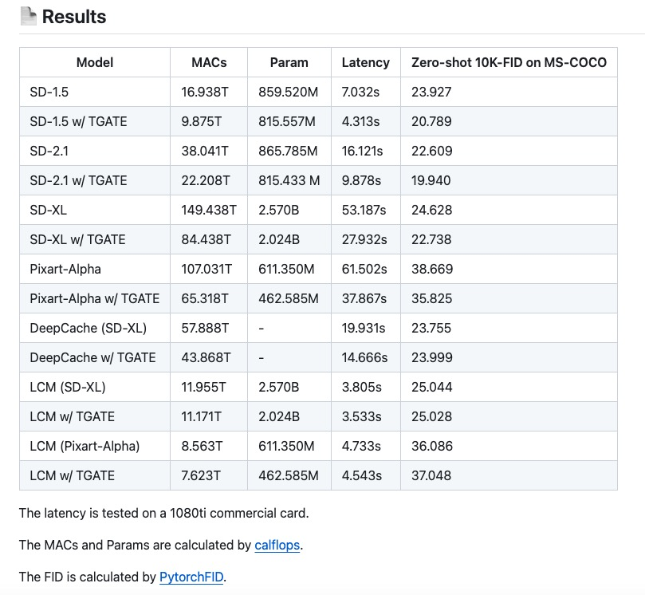
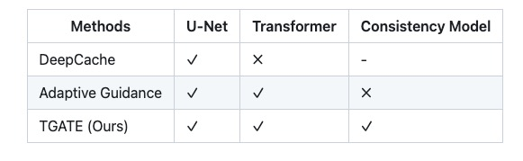

T-GATE: Cross-Attention Makes Inference Cumbersome in Text-to-Image Diffusion Models    
T-GATE：交叉注意力使文本到图像扩散模型中的推理变得麻烦   

## TODO:     
多个模型加速效果以及生成效果需要测试     
至少四个模型     
每个模型五张图    
相关研究比较？？？？    

   

 📖 Related works:    
We encourage the users to read DeepCache and Adaptive Guidance     
     
与 DeepCache 相比：

TGATE可以缓存一次并重复使用缓存的特征，直到采样结束。  
TGATE 对于基于 Transformer 的架构和移动设备更加友好，因为它放弃了高分辨率交叉注意力。    
TGATE 是 DeepCache 的补充。   

与自适应指导相比：    

TGATE可以减少第二阶段的参数。   
TGATE可以进一步提高推理效率。   
TGATE 是对非 cfg 框架的补充，例如潜在一致性模型。   
TGATE 是开源的。   

## 基本信息

🛠️ Requirements  
diffusers==0.27.0.dev0   
pytorch==2.2.0   
transformers   

机构：   
1 AI Initiative, King Abdullah University of Science And Technology  

2 Show Lab, National University of Singapore   3 The Swiss AI Lab, IDSIA

[Submitted on 3 Apr 2024]    
https://arxiv.org/abs/2404.02747    

仓库：   
https://github.com/HaozheLiu-ST/T-GATE   

更新    
2024/04/14：我们发布TGATE v0.1.1来支持该playground-v2.5-1024模型。

2024/04/10：我们将包发布到PyPI。请在此处查看用法。

2024/04/04：技术报告可在arxiv上获取。

2024/04/04：用于 DeepCache (SD-XL) 的 TGATE 发布。

2024/03/30：SD-1.5/2.1/XL 版 TGATE 发布。

2024/03/29：LCM (SD-XL) TGATE、PixArt-Alpha 发布。

2024/03/28：TGATE 开源。

## 原理

     
我们发现交叉注意力输出在初始去噪步骤中收敛到一个固定点。因此，整个推理过程可以分为两个阶段：初始语义规划阶段，在此期间模型依靠文本来规划视觉语义；以及随后的保真度改进阶段，在此期间模型尝试根据先前的图像生成图像。计划的语义。令人惊讶的是，在保真度提高阶段忽略文本条件不仅降低了计算复杂度，而且还略微降低了 FID 分数。这产生了一种称为 TGATE 的简单且无需训练的方法，用于高效生成，一旦交叉注意力输出收敛，该方法就会对其进行缓存，并在剩余的推理步骤中保持固定。     

免培训。     
轻松集成到现有框架中。   
只需要几行代码。  
友好支持基于CNN的U-Net、Transformer、一致性模型   
不同扩散模型加速 10%-50%。   

扩散模型在不同去噪步骤生成的图像。第一行将文本嵌入提供给所有步骤的交叉注意模块。第二行仅使用第1步到第10步的文本嵌入，第三行输入第11步到第25步的文本嵌入。

我们的观察总结如下：

交叉注意力在推理过程的早期收敛，其特点是语义规划和保真度提高阶段。这两个阶段交叉注意力的影响并不均匀。

语义规划通过交叉注意力嵌入文本以获得视觉语义。

保真度提高阶段无需交叉注意即可提高生成质量。事实上，在此阶段嵌入空文本可以提高性能。

🖊️方法    
步骤 1：TGATE 缓存语义规划阶段的注意力结果。    

    if gate_step == cur_step:
        hidden_uncond, hidden_pred_text = hidden_states.chunk(2)
        cache = (hidden_uncond + hidden_pred_text ) / 2
步骤 2：TGATE 在整个保真度提高阶段重复使用它们。    

    if cross_attn and (gate_step<cur_step):
        hidden_states = cache
