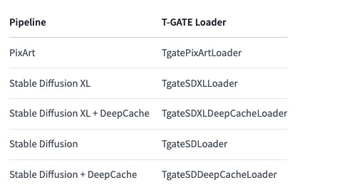

T-GATE: Cross-Attention Makes Inference Cumbersome in Text-to-Image Diffusion Models    
T-GATE：交叉注意力使文本到图像扩散模型中的推理变得麻烦   

## TODO:     
多个模型加速效果以及生成效果需要测试     
至少四个模型     
每个模型五张图    
相关研究比较？？？？    

   

### 相关工作
 📖 Related works:    
We encourage the users to read DeepCache and Adaptive Guidance     
     
与 DeepCache 相比：

TGATE可以缓存一次并重复使用缓存的特征，直到采样结束。  
TGATE 对于基于 Transformer 的架构和移动设备更加友好，因为它放弃了高分辨率交叉注意力。    
TGATE 是 DeepCache 的补充。   

与自适应指导相比：    

TGATE可以减少第二阶段的参数。   
TGATE可以进一步提高推理效率。   
TGATE 是对非 cfg 框架的补充，例如潜在一致性模型。   
TGATE 是开源的。   

## 基本信息

🛠️ Requirements  
diffusers==0.27.0.dev0   
pytorch==2.2.0   
transformers   

机构：   
1 AI Initiative, King Abdullah University of Science And Technology  

2 Show Lab, National University of Singapore   3 The Swiss AI Lab, IDSIA

[Submitted on 3 Apr 2024]    
https://arxiv.org/abs/2404.02747    

仓库：   
https://github.com/HaozheLiu-ST/T-GATE   

更新    
2024/04/14：我们发布TGATE v0.1.1来支持该playground-v2.5-1024模型。

2024/04/10：我们将包发布到PyPI。请在此处查看用法。

2024/04/04：技术报告可在arxiv上获取。

2024/04/04：用于 DeepCache (SD-XL) 的 TGATE 发布。

2024/03/30：SD-1.5/2.1/XL 版 TGATE 发布。

2024/03/29：LCM (SD-XL) TGATE、PixArt-Alpha 发布。

2024/03/28：TGATE 开源。

## 原理

     
我们发现交叉注意力输出在初始去噪步骤中收敛到一个固定点。因此，整个推理过程可以分为两个阶段：初始语义规划阶段，在此期间模型依靠文本来规划视觉语义；以及随后的保真度改进阶段，在此期间模型尝试根据先前的图像生成图像。计划的语义。令人惊讶的是，在保真度提高阶段忽略文本条件不仅降低了计算复杂度，而且还略微降低了 FID 分数。这产生了一种称为 TGATE 的简单且无需训练的方法，用于高效生成，一旦交叉注意力输出收敛，该方法就会对其进行缓存，并在剩余的推理步骤中保持固定。     

免培训。     
轻松集成到现有框架中。   
只需要几行代码。  
友好支持基于CNN的U-Net、Transformer、一致性模型   
不同扩散模型加速 10%-50%。   

扩散模型在不同去噪步骤生成的图像。第一行将文本嵌入提供给所有步骤的交叉注意模块。第二行仅使用第1步到第10步的文本嵌入，第三行输入第11步到第25步的文本嵌入。

我们的观察总结如下：

交叉注意力在推理过程的早期收敛，其特点是语义规划和保真度提高阶段。这两个阶段交叉注意力的影响并不均匀。

语义规划通过交叉注意力嵌入文本以获得视觉语义。

保真度提高阶段无需交叉注意即可提高生成质量。事实上，在此阶段嵌入空文本可以提高性能。

🖊️方法    
步骤 1：TGATE 缓存语义规划阶段的注意力结果。    

    if gate_step == cur_step:
        hidden_uncond, hidden_pred_text = hidden_states.chunk(2)
        cache = (hidden_uncond + hidden_pred_text ) / 2
步骤 2：TGATE 在整个保真度提高阶段重复使用它们。    

    if cross_attn and (gate_step<cur_step):
        hidden_states = cache

测试结论：加速10%-35%，效果明显，图片质量有一定程度下降，以下缺点出现概率增加：细节丢失，颜色变暗，wrong anatomy     
结论：论文原理逻辑有问题，论文效果图也可以看出图片质量下降

T-GATE accelerates inference for Stable Diffusion, PixArt, and Latency Consistency Model pipelines by skipping the cross-attention calculation once it converges. This method doesn’t require any additional training and it can speed up inference from 10-50%. T-GATE is also compatible with other optimization methods like DeepCache.     

the entire inference process can be divided into two stages: an initial semantics-planning phase, during which the model relies on text to plan visual semantics, and a subsequent fidelity-improving phase, during which the model tries to generate images from previously planned semantics.     
ignoring text conditions in the fidelity-improving stage not only reduces computation complexity, but also slightly decreases FID score. 其实对图像质量影响还是很大的     
This yields a simple and training-free method called TGATE for efficient generation, which caches the cross-attention output once it converges and keeps it fixed during the remaining inference steps.   

原理就是在后面去噪阶段弃用 cross-attention 的 text embedding 

缺陷：这种方法保证了空间语义，但细节往往会丢失

4.23周二作者修复bug，发布 v0.1.2 。能用

### 不理解
不知道为什么在模型加载时就要输入tgate step     
在推理又要输入一次     
没看源代码    

### MACs

### FID
FID is a measure of similarity between two datasets of images. It was shown to correlate well with human judgement of visual quality and is most often used to evaluate the quality of samples of Generative Adversarial Networks. FID is calculated by computing the Fréchet distance between two Gaussians fitted to feature representations of the Inception network.

In mathematics, the Fréchet distance is a measure of similarity between curves that takes into account the location and ordering of the points along the curves. It is named after Maurice Fréchet.

In short: The Fréchet distance between two multivariate Gaussians X_1 ~ N(mu_1, C_1) and X_2 ~ N(mu_2, C_2) is

    d^2 = ||mu_1 - mu_2||^2 + Tr(C_1 + C_2 - 2*sqrt(C_1*C_2)).

## diffusers使用
To use T-GATE with a pipeline, you need to use its corresponding loader.

     

推理两张图后报错    
torch python版本？？    
diffusers缺陷？？   
决定不重装环境，直接去试源码     

    --> 148 image = pipe.tgate(
        149                 prompt=prompt_style,
        150                 gate_step=gate_step,
        151                 num_inference_steps=steps, 
        152                 num_images_per_prompt = 1,
        153                 generator = torch.Generator(device="cuda").manual_seed(seed),
        154                 guidance_scale=cfg,
        155                 
        156                 max_sequence_length=300,
        157 
        158             ).images[0]
        160 filename = prompt[:25] if len(prompt) > 24 else prompt
        161 image.save(style_folder_path + filename + ".png")

    File ~/miniconda3/envs/pixart/lib/python3.9/site-packages/torch/utils/_contextlib.py:115, in context_decorator.<locals>.decorate_context(*args, **kwargs)
        112 @functools.wraps(func)
        113 def decorate_context(*args, **kwargs):
        114     with ctx_factory():
    --> 115         return func(*args, **kwargs)
    ...
    --> 231         hidden_uncond, hidden_pred_text = hidden_states.chunk(2)
        232         cache = (hidden_uncond + hidden_pred_text ) / 2
        233 else:

    ValueError: not enough values to unpack (expected 2, got 1)

It's a late answer but may help.

I had the same error. My problem was that 'input_ids' and 'attention_mask' have to be 2D tensor but I got them as 1D tensor. So do

input_ids = input_ids.unsqueeze(0)
attention_mask = attention_mask.unsqueeze(0)
in your case.

解决了！

显然 'input_ids'、'attention_mask'、'token_type_ids' 的大小都需要为
(batch_size,equence_length) ，所以当我使用

.unsqueeze(0)
代替

.squeeze(0)
有效。

## comfyui 使用
    git apply tgate.patch 
    error: comfy/ldm/modules/attention.py: No such file or directory
    error: comfy/model_patcher.py: No such file or directory
    error: comfy/samplers.py: No such file or directory

Git是目前最流行的分布式版本控制系统之一，它可以帮助团队在开发过程中管理和协调代码的更改。通过Git，我们可以进行代码的版本管理，包括跟踪更改、回滚版本、分支管理等。

补丁（patch）是一种用于将更改应用于源代码的方法。它包含了源代码中的更改的信息，可以被Git应用到目标代码库中。补丁通常以.diff或.patch的文件扩展名存在，包含了源代码中的更改的行号、内容等信息。

Git提供了一个命令行工具git apply来应用补丁。使用git apply命令可以将补丁文件应用到当前代码库中，并自动根据补丁文件中的信息修改源代码。

## 工作演进
We thank prompt to prompt and diffusers for the great code.

# 结尾