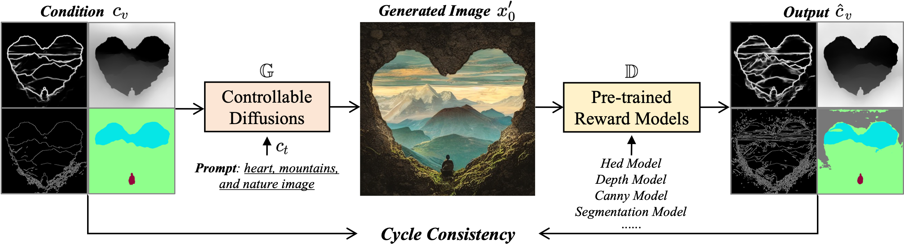
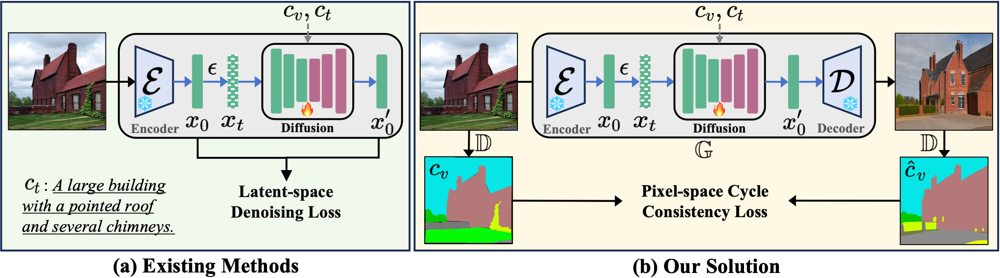
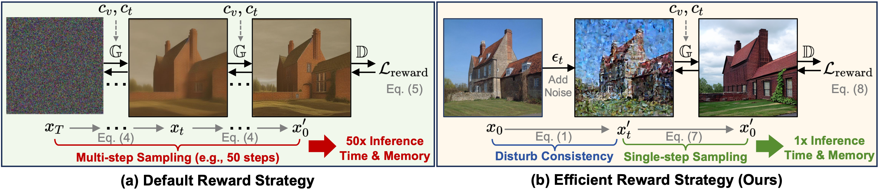
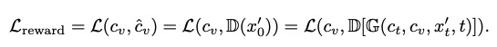
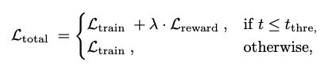
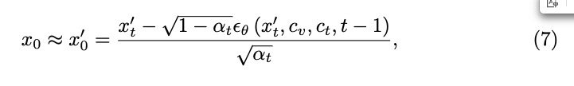

Inference code for: ControlNet++: Improving Conditional Controls with Efficient Consistency Feedback     
ControlNet++：通过高效的一致性反馈改进条件控制    
https://github.com/liming-ai/ControlNet_Plus_Plus   

这是个快速版controlnet 使用lcm加速controlnet

有点类似ST-GCN++命名 

# 论文信息
[Submitted on 11 Apr 2024]     
ControlNet++: Improving Conditional Controls with Efficient Consistency Feedback    
https://arxiv.org/abs/2404.07987  

Center for Research in Computer Vision, University of Central Florida      
2 ByteDance Inc     
几个美国佛罗里达大学留学生在字节实习    

我们揭示了现有方法在生成与图像条件控制一致的图像方面仍然面临重大挑战。为此，我们提出了 ControlNet++，这是一种新颖的方法，通过显式优化生成图像和条件控制之间的像素级循环一致性来改进可控生成。具体来说，对于输入条件控制，我们使用预训练的判别奖励模型来提取生成图像的相应条件，然后优化输入条件控制和提取条件之间的一致性损失。一种简单的实现是从随机噪声生成图像，然后计算一致性损失，但这种方法需要存储多个采样时间步长的梯度，从而导致相当多的时间和内存成本。为了解决这个问题，我们引入了一种有效的奖励策略，通过添加噪声故意干扰输入图像，然后使用单步去噪图像进行奖励微调。这避免了与图像采样相关的大量成本，从而可以更有效地进行奖励微调。大量实验表明ControlNet++显着提高了各种条件控制下的可控性。例如，在分割掩模、艺术线条边缘和深度条件方面，它比 ControlNet 分别提高了 7.9% mIoU、13.4% SSIM 和 7.6% RMSE。       

     

# demo
The first row in outputs is the input conditions. The second row is the images generated by ControlNet++. The third row is the conditions extracted from our generated images. Please note that we use the SD1.5 and trained on specific public datasets, so the quality of the generated images may not be as good as models such as SDXL-based models, or trained on private datasets. For example, the image quality and resolution in the ADE20K dataset (Segmentation) are often poor     
   
    
     
    

    
   

    

We noticed the results in the online demo are unstable: The same code, weights and random seeds have huge differences in results under different spaces, which may due to the ZeroGPU. If it is convenient, please git clone and run it locally.

   

# 模型信息
基于sd1.5

# 原理
ControlNet++: Improving Conditional Controls with Efficient Consistency Feedback     

Cycle Consistency for Conditional Generation    
   
we can directly optimize the cycle consistency loss for better controllability.    

Directly Optimization for Controllability:     
   
utilize discriminative reward models 𝐷 to explicitly optimize the controllability of 𝐺 via pixel-level cycle consistency loss.    

Efficient Reward Strategy:     
    
(a) Pipeline of default reward fine-tuning strategy. Reward fine-tuning requires sampling all the way to the full image. Such a method needs to keep all gradients for each timestep and the memory required is unbearable by current GPUs. (b) We add a small noise (
) to disturb the consistency between input images and conditions, then the single-step denoised image can be directly used for efficient reward fine-tuning.？？？？？？？？？？？？

????      

为了实现像素空间一致性损失 Lreward，需要最终的扩散图像 x0 来计算奖励模型的奖励一致性。 由于现代扩散模型，例如稳定扩散[43]，需要多个步骤，例如 50 个步骤来渲染完整图像，直接使用这样的解决方案在现实设置中是不切实际的：（1）需要多次耗时的采样 从随机噪声中获取图像。  (2) 为了启用梯度反向传播，我们必须在每个时间步存储梯度，这意味着 GPU 内存使用量将随着时间步的数量线性增加。 以ControlNet为例，当批量大小为1且FP16混合精度时，单个去噪步骤和存储所有训练梯度所需的GPU内存约为6.8GB。 如果我们使用 DDIM [51] 调度器进行 50 步推理，则需要大约 340GB 的内存来对单个样本进行奖励微调，这在当前的硬件能力下几乎不可能实现。

尽管可以通过采用低秩适应（LoRA）[11, 20]、梯度检查点[7, 11]或停止梯度[60]等技术来减少GPU内存消耗，但采样次数导致的效率下降 生成图像所需的步骤仍然很重要且不容忽视。 因此，需要一种有效的奖励微调方法。

这个本质上还是减少了采样步骤，换速度     
设置了一个t_thre

其中 tthre 表示时间步长阈值，它是一个超参数，用于确定是否应利用噪声图像 xt 进行奖励微调。 我们注意到，小的噪声 ε（即相对较小的时间步长 t）会扰乱一致性并导致有效的奖励微调。 当时间步长 t 较大时，xt 更接近随机噪声 xT ，直接从 xt 预测 x′0 会导致严重的图像失真。 我们高效奖励的优点是，xt 可以用来训练和奖励扩散模型，而不需要多次采样带来的时间和 GPU 内存成本，从而显着提高奖励微调阶段的效率。

对他们提出的这种像素空间损失方法的愚蠢补充和改正    

与从随机噪声 xT 扩散以获得最终图像 x0 相比，如图 4（a）所示，我们提出了一种一步式有效奖励策略。 具体来说，我们不是从噪声中随机采样，而是向训练图像 x0 添加噪声，从而通过执行等式中的扩散前向过程 q(xt|x0) 来明确扰乱扩散输入 x′t 与其条件控制 cv 之间的一致性。  1. 我们将此过程演示为图 4 (b) 中的干扰一致性，这与标准扩散训练过程相同。 当添加的噪声ε较小时，我们可以通过对受干扰图像x′t进行单步采样3来预测原始图像x′0[18      
   
核心提高他们方法效率的公式     
从少步推理借鉴    
wired    

又和一致性相关    
那么其实起源于lcm   
而且只是在训练时优化，推理没有    

## lcm
[Submitted on 6 Oct 2023]   
Latent Consistency Models: Synthesizing High-Resolution Images with Few-Step Inference     

Institute for Interdisciplinary Information Sciences, Tsinghua University     

公式太多了没时间理

# 结尾

