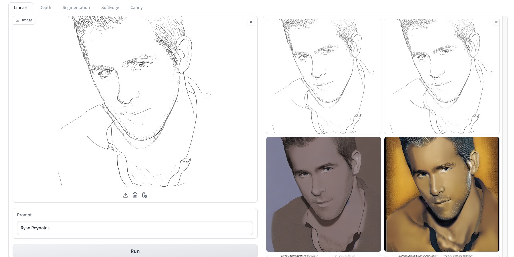
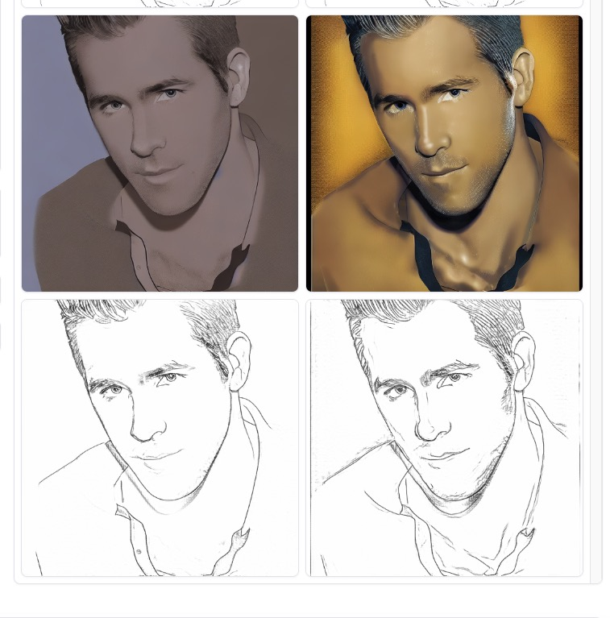
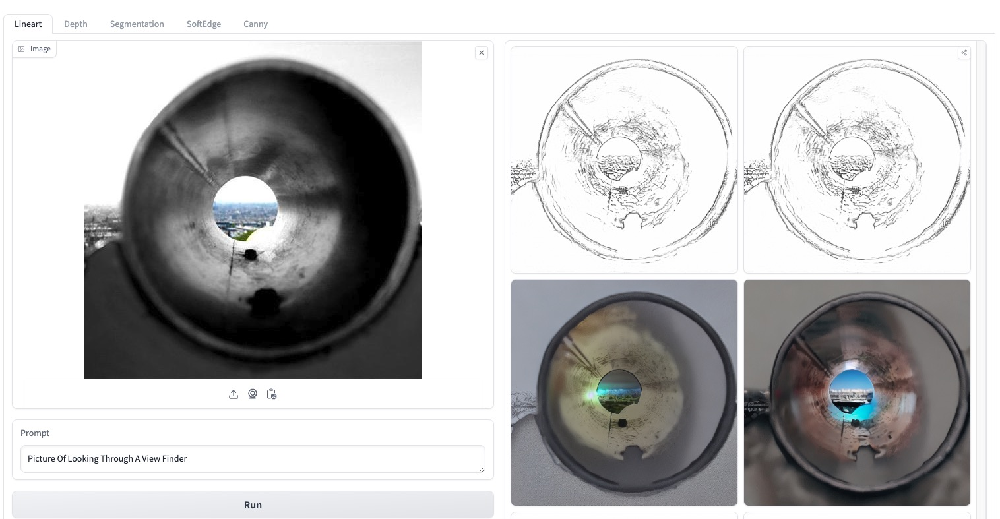
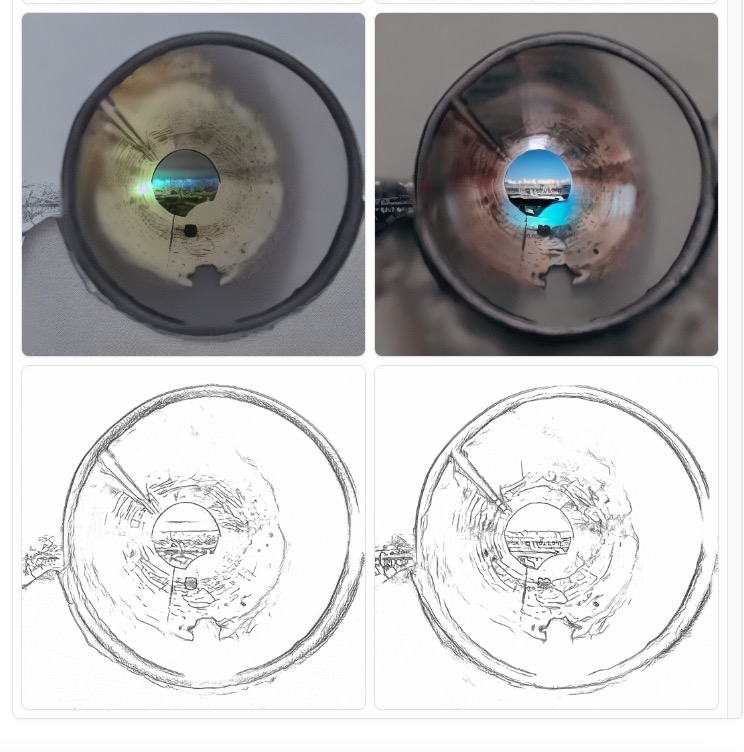
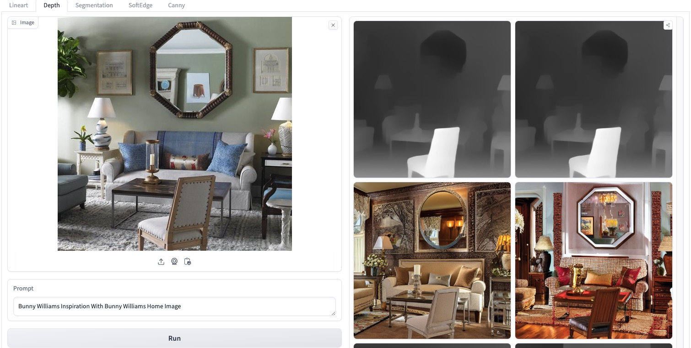
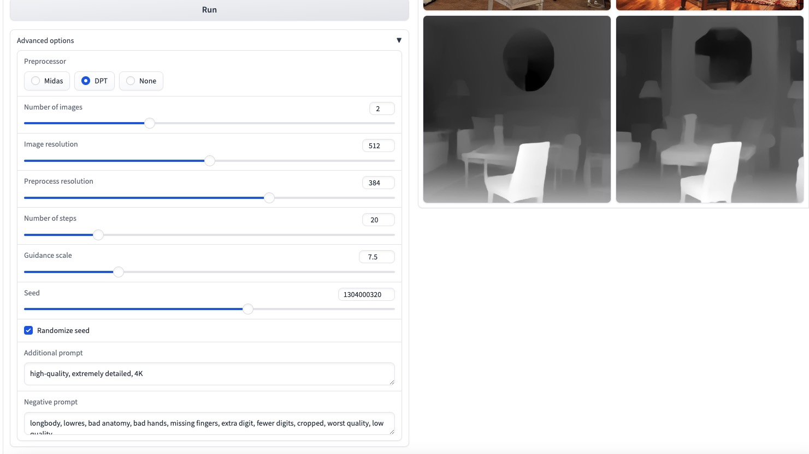
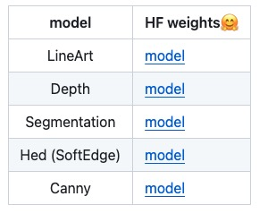

Inference code for: ControlNet++: Improving Conditional Controls with Efficient Consistency Feedback     
ControlNet++：通过高效的一致性反馈改进条件控制    
https://github.com/liming-ai/ControlNet_Plus_Plus   

这是个快速版controlnet 即lcm controlnet

有点类似ST-GCN++命名 

# 论文信息
[Submitted on 11 Apr 2024]     
ControlNet++: Improving Conditional Controls with Efficient Consistency Feedback    
https://arxiv.org/abs/2404.07987    

我们揭示了现有方法在生成与图像条件控制一致的图像方面仍然面临重大挑战。为此，我们提出了 ControlNet++，这是一种新颖的方法，通过显式优化生成图像和条件控制之间的像素级循环一致性来改进可控生成。具体来说，对于输入条件控制，我们使用预训练的判别奖励模型来提取生成图像的相应条件，然后优化输入条件控制和提取条件之间的一致性损失。一种简单的实现是从随机噪声生成图像，然后计算一致性损失，但这种方法需要存储多个采样时间步长的梯度，从而导致相当多的时间和内存成本。为了解决这个问题，我们引入了一种有效的奖励策略，通过添加噪声故意干扰输入图像，然后使用单步去噪图像进行奖励微调。这避免了与图像采样相关的大量成本，从而可以更有效地进行奖励微调。大量实验表明ControlNet++显着提高了各种条件控制下的可控性。例如，在分割掩模、艺术线条边缘和深度条件方面，它比 ControlNet 分别提高了 7.9% mIoU、13.4% SSIM 和 7.6% RMSE。       

     

# demo
The first row in outputs is the input conditions. The second row is the images generated by ControlNet++. The third row is the conditions extracted from our generated images. Please note that we use the SD1.5 and trained on specific public datasets, so the quality of the generated images may not be as good as models such as SDXL-based models, or trained on private datasets. For example, the image quality and resolution in the ADE20K dataset (Segmentation) are often poor     
   
    
     
    

    
   

We noticed the results in the online demo are unstable: The same code, weights and random seeds have huge differences in results under different spaces, which may due to the ZeroGPU. If it is convenient, please git clone and run it locally.

   

