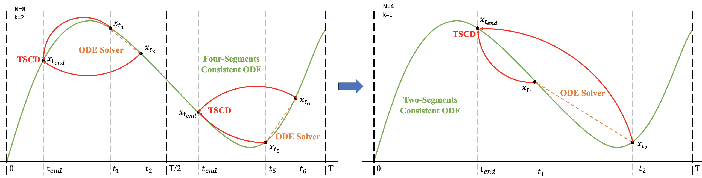
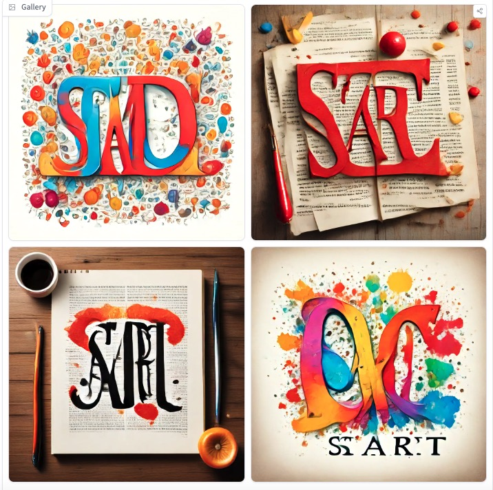
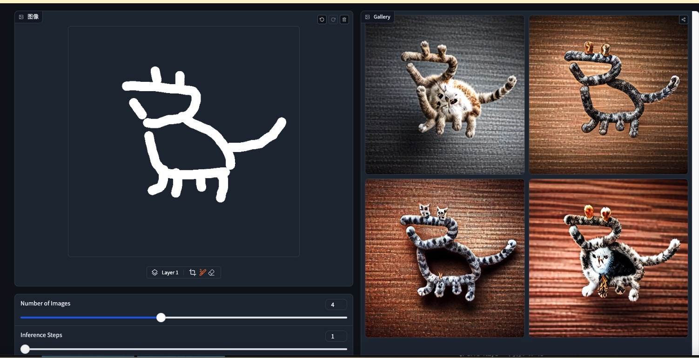
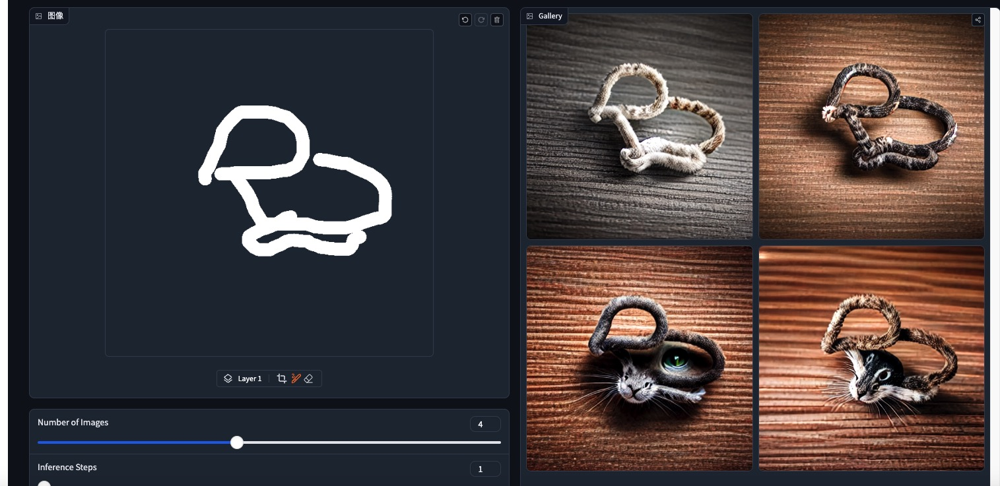
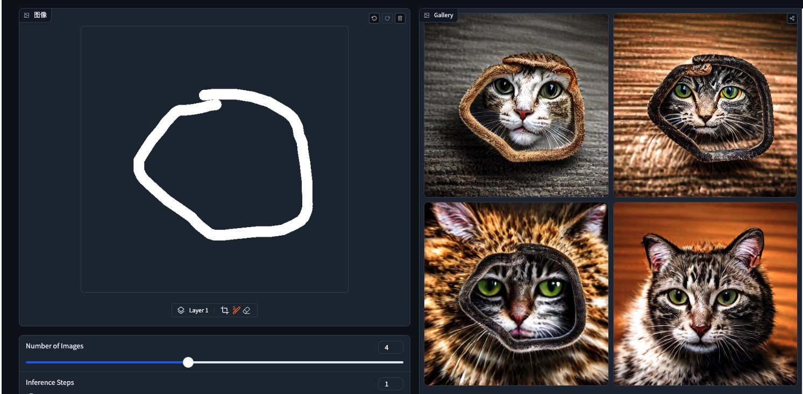

Hyper-SD     
Hyper-SD: Trajectory Segmented Consistency Model for Efficient Image Synthesis

又是一个单步推理模型

# 论文信息
字节    

[Submitted on 21 Apr 2024]
Hyper-SD: Trajectory Segmented Consistency Model for Efficient Image Synthesis

最近，出现了一系列扩散感知蒸馏算法，以减轻与扩散模型（DM）的多步骤推理过程相关的计算开销。当前的蒸馏技术通常分为两个不同的方面：i) ODE 轨迹保持； ii) ODE 轨迹重构。然而，这些方法会遭受严重的性能下降或域转移。为了解决这些限制，我们提出了 Hyper-SD，这是一种新颖的框架，它协同地融合了 ODE 轨迹保存和重构的优点，同时在步骤压缩期间保持近乎无损的性能。首先，我们引入轨迹分段一致性蒸馏，在预定义的时间步段内逐步进行一致性蒸馏，这有利于从高阶角度保存原始 ODE 轨迹。其次，我们结合人类反馈学习来提高模型在低步状态下的性能，并减轻蒸馏过程带来的性能损失。第三，我们集成了分数蒸馏，以进一步提高模型的低步生成能力，并首次尝试利用统一的LoRA来支持所有步骤的推理过程。大量实验和用户研究表明，Hyper-SD 对于 SDXL 和 SD1.5 来说都可以通过 1 到 8 个推理步骤实现 SOTA 性能。例如，在 1 步推理中，Hyper-SDXL 在 CLIP 分数上超过 SDXL-Lightning +0.68，在 Aes 分数上超过 +0.51。

Introduction    
Hyper-SD is one of the new State-of-the-Art diffusion model acceleration techniques. In this repository, we release the models distilled from SDXL Base 1.0 and Stable-Diffusion v1-5。

# 模型信息
https://huggingface.co/ByteDance/Hyper-SD

Project Page: https://hyper-sd.github.io/

News🔥🔥🔥

    Apr.28, 2024. ComfyUI workflows on 1-Step Unified LoRA 🥰 with TCDScheduler to inference on different steps are released! Remember to install ⭕️ ComfyUI-TCD in your ComfyUI/custom_nodes folder!!! You're encouraged to adjust the eta parameter to get better results 🌟!
    Apr.26, 2024. 💥💥💥 Our CFG-Preserved Hyper-SD15/SDXL that facilitate negative prompts and larger guidance scales (e.g. 5~10) will be coming soon!!! 💥💥💥
    Apr.26, 2024. Thanks to @Pete for contributing to our scribble demo with larger canvas right now 👏.
    Apr.24, 2024. The ComfyUI workflow and checkpoint on 1-Step SDXL UNet ✨ is also available! Don't forget ⭕️ to install the custom scheduler in your ComfyUI/custom_nodes folder!!!
    Apr.23, 2024. ComfyUI workflows on N-Steps LoRAs are released! Worth a try for creators 💥!
    Apr.23, 2024. Our technical report 📚 is uploaded to arXiv! Many implementation details are provided and we welcome more discussions👏.
    Apr.21, 2024. Hyper-SD ⚡️ is highly compatible and work well with different base models and controlnets. To clarify, we also append the usage example of controlnet here.
    Apr.20, 2024. Our checkpoints and two demos 🤗 (i.e. SD15-Scribble and SDXL-T2I) are publicly available on HuggingFace Repo.

Hyper-SD Scribble demo host on 🤗 scribble

Hyper-SDXL One-step Text-to-Image demo host on 🤗 T2I

Checkpoints

    Hyper-SDXL-Nstep-lora.safetensors: Lora checkpoint, for SDXL-related models.

    Hyper-SD15-Nstep-lora.safetensors: Lora checkpoint, for SD1.5-related models.

    Hyper-SDXL-1step-unet.safetensors: Unet checkpoint distilled from SDXL-Base.

Hyper-SD is one of the new State-of-the-Art diffusion model acceleration techniques. In this repository, we release the models distilled from SDXL Base 1.0 and Stable-Diffusion v1-5。    

# 原理
Hyper-SD 采用两阶段渐进稠度蒸馏。第一阶段涉及两个独立时间段的一致性蒸馏：[0，T/2]和[T/2，T]以获得两个段的一致性ODE。然后，采用该ODE轨迹在后续阶段训练全局一致性模型     
     

# 效果
ByteDance/Hyper-SDXL-1Step-T2I      

the word 'START'   
    
与论文不一致，文字不遵循    

The unified LoRAs of Hyper-SD are compatible with ControlNet. The examples are conditioned on either scribble or canny images.    

Hyper-SD15-Scribble     
    
a photo of a cat   
lcm   
网页上两三秒出图  
      
    

TCD

# 结尾

