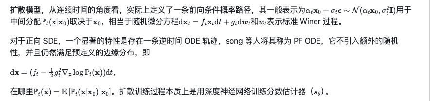
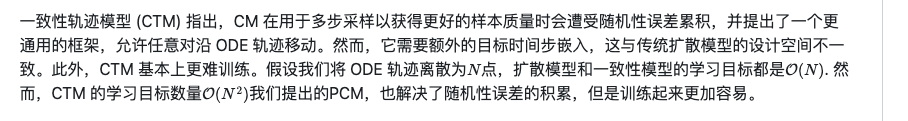
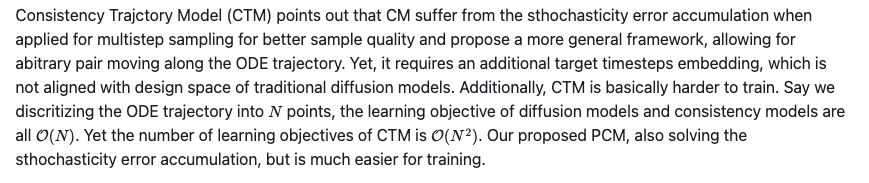
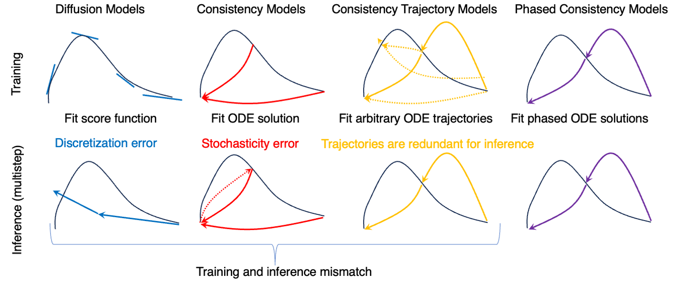

Hyper-SD     
Hyper-SD: Trajectory Segmented Consistency Model for Efficient Image Synthesis

又是一个单步推理模型

# 论文信息
字节    

[Submitted on 21 Apr 2024]     
Hyper-SD: Trajectory Segmented Consistency Model for Efficient Image Synthesis

最近，出现了一系列扩散感知蒸馏算法，以减轻与扩散模型（DM）的多步骤推理过程相关的计算开销。当前的蒸馏技术通常分为两个不同的方面：i) ODE 轨迹保持； ii) ODE 轨迹重构。然而，这些方法会遭受严重的性能下降或域转移。为了解决这些限制，我们提出了 Hyper-SD，这是一种新颖的框架，它协同地融合了 ODE 轨迹保存和重构的优点，同时在步骤压缩期间保持近乎无损的性能。首先，我们引入轨迹分段一致性蒸馏，在预定义的时间步段内逐步进行一致性蒸馏，这有利于从高阶角度保存原始 ODE 轨迹。其次，我们结合人类反馈学习来提高模型在低步状态下的性能，并减轻蒸馏过程带来的性能损失。第三，我们集成了分数蒸馏，以进一步提高模型的低步生成能力，并首次尝试利用统一的LoRA来支持所有步骤的推理过程。大量实验和用户研究表明，Hyper-SD 对于 SDXL 和 SD1.5 来说都可以通过 1 到 8 个推理步骤实现 SOTA 性能。例如，在 1 步推理中，Hyper-SDXL 在 CLIP 分数上超过 SDXL-Lightning +0.68，在 Aes 分数上超过 +0.51。

Introduction    
Hyper-SD is one of the new State-of-the-Art diffusion model acceleration techniques. In this repository, we release `the models distilled from SDXL Base 1.0 and Stable-Diffusion v1-5。`

# 模型信息
https://huggingface.co/ByteDance/Hyper-SD

Project Page: https://hyper-sd.github.io/

News🔥🔥🔥

    Apr.30, 2024. 💥💥💥 Our 8-Steps CFG-Preserved Hyper-SDXL-8steps-CFG-LoRA and Hyper-SD15-8steps-CFG-LoRA is available now(support 5~8 guidance scales), we strongly recommend making the 8-step CFGLora a standard configuration for all SDXL and SD15 models!!! (the 4-steps version will be coming soon)💥💥💥

    Apr.28, 2024. ComfyUI workflows on 1-Step Unified LoRA 🥰 with TCDScheduler to inference on different steps are released! Remember to install ⭕️ ComfyUI-TCD in your ComfyUI/custom_nodes folder!!! You're encouraged to adjust the eta parameter to get better results 🌟!
    Apr.26, 2024. 💥💥💥 Our CFG-Preserved Hyper-SD15/SDXL that facilitate negative prompts and larger guidance scales (e.g. 5~10) will be coming soon!!! 💥💥💥
    Apr.26, 2024. Thanks to @Pete for contributing to our scribble demo with larger canvas right now 👏.
    Apr.24, 2024. The ComfyUI workflow and checkpoint on 1-Step SDXL UNet ✨ is also available! Don't forget ⭕️ to install the custom scheduler in your ComfyUI/custom_nodes folder!!!
    Apr.23, 2024. ComfyUI workflows on N-Steps LoRAs are released! Worth a try for creators 💥!
    Apr.23, 2024. Our technical report 📚 is uploaded to arXiv! Many implementation details are provided and we welcome more discussions👏.
    Apr.21, 2024. Hyper-SD ⚡️ is highly compatible and work well with different base models and controlnets. To clarify, we also append the usage example of controlnet here.
    Apr.20, 2024. Our checkpoints and two demos 🤗 (i.e. SD15-Scribble and SDXL-T2I) are publicly available on HuggingFace Repo.

Hyper-SD Scribble demo host on 🤗 scribble

Hyper-SDXL One-step Text-to-Image demo host on 🤗 T2I

Checkpoints

    Hyper-SDXL-Nstep-lora.safetensors: Lora checkpoint, for SDXL-related models.

    Hyper-SD15-Nstep-lora.safetensors: Lora checkpoint, for SD1.5-related models.

    Hyper-SDXL-1step-unet.safetensors: Unet checkpoint distilled from SDXL-Base.

Hyper-SD is one of the new State-of-the-Art diffusion model acceleration techniques. In this repository, we release the models distilled from SDXL Base 1.0 and Stable-Diffusion v1-5。    

    

# 原理
Hyper-SD 采用两阶段渐进稠度蒸馏。第一阶段涉及两个独立时间段的一致性蒸馏：[0，T/2]和[T/2，T]以获得两个段的一致性ODE。然后，采用该ODE轨迹在后续阶段训练全局一致性模型     
     

原理：
Hyper-SD协同地融合了 ODE 轨迹保存和重构的优点，同时在步骤压缩期间保持近乎无损的性能。
1. 引入轨迹分段一致性蒸馏，在预定义的时间步段内逐步进行一致性蒸馏，这有利于从高阶角度保存原始 ODE 轨迹。
Trajectory Segmented Consistency Distillation （TSCD）
2. 结合人类反馈学习来提高模型在低步状态下的性能，并减轻蒸馏过程带来的性能损失。
3. 集成了分数蒸馏，以进一步提高模型的低步生成能力

# 效果

ByteDance/Hyper-SDXL-1Step-T2I      

the word 'START'   
    
单步与论文不一致，文字不遵循    
可能是多步的结果   

The unified LoRAs of Hyper-SD are compatible with ControlNet. The examples are conditioned on either scribble or canny images.    

Hyper-SD15-Scribble     
    
a photo of a cat   
lcm   
网页上两三秒出图  
      
    

TCD

## lora
1. lora加速   
lora加速生成的人物图片的美观度和清晰度普遍降低。受蒸馏底模影响。     
lora加速生成，在4步以内优势明显，超过8步后不如现在常用的采样方法使用高效采样计划进行采样。
Hyper-SDXL-1step-lora可以和社区底模搭配使用，由TCD改进而来。结合汉服模型1步可以生成，但是画质较差，4步以内生成最好在1024*1024分辨率上使用，否则人物畸形严重。8步生成图片有小的瑕疵。cfg取1附近的值。    
搭配公司底模，换不同prompt会产生人脸很像的情况    
这个lora在使用在1024*1024分辨率效果比较好    
sdxl_lighrning_2step_lora至少需要2步生成。    
LCM&TurboMix LoRA 至少需要6步生成，CFG为2.0时效果最好。4步时图片相当模糊。     
lcm-lora-sdxl 至少需要4步生成，CFG为2.0时效果最好。    
lcm-lora-sdxl人物没那么像。其他不同prompt都挺像    
sdxl_lightning_2step_lora稍微没那么像，但是质感是sdxl base经典的卡通质感    

2. 以上这些加速lora的cfg都比较小     
Hyper-LORA系列有一个 Hyper-SDXL-8steps-CFG-lora 少步推理条件下支持大cfg: 5-8。可以与AYS等加速采样方式对比。   
生成质量差，眼睛一般有问题   

3. 蒸馏主模型    
Hyper-SDXL-1step-Unet效果比lightning好一些，比turbo好。    
文字生成优于另外两种     
lightning偏向卡通和畸形和模糊    

4. 公司已有模型加速采样推荐采用两种方法，这两种都能比较好保留原模型质量：   
4.1 自己蒸馏主模型。但是就现有公开论文的结果看，蒸馏模型也不是无损的。    
4.2 高效采样计划进行10步或15步采样。如AYS, sgm_uniform。少数情况会出不好的图。

# 现有蒸馏方法一观
[Submitted on 21 Apr 2024]     
Hyper-SD: Trajectory Segmented Consistency Model for Efficient Image Synthesis    

current techniques for distilling Diffusion Models (DMs) can be broadly categorized into two approaches: one that preserves the `Ordinary Differential Equation (ODE) trajectory` [4, 20, 24, 34], and another that reformulates it      
保留常微分方程 (ODE) 轨迹     

为了清楚起见，我们将教师模型定义为 ftea，学生模型定义为 fstu，噪声定义为 ε，提示条件定义为 c， off-the-shelf ODE Solver 现成的 ODE 求解器定义为 Ψ(·,·,·)，总训练时间步长为 T ，推理时间步数为 N ，噪声轨迹点为 xt ，skippingstep 跳跃步为 s ，其中 t0 < t1 · · · < tN−1 = T , tn − tn−1 = s, n 均匀分布在 {1, 2 上, . 。 。 ，N−1}。

早期自己对蒸馏的理解   
由硬标签和软标签（教师模型生成的数据）共同计算损失回传    

但是在线模型和离线模型是什么？？？

## 渐进蒸馏（PD）
Progressive Distillation    
老师逐步预测两步，学生直接预测两步，做损失      

progressive Distillation (PD) [20] trains the student model fstu approximate the subsequent flow locations determined by the teacher model ftea over a sequence of steps.    
渐进蒸馏（PD）[20]训练学生模型 fstu 近似由教师模型 ftea 在一系列步骤中确定的后续流动位置。

考虑 2 步 PD 进行说明，ftea 的目标预测 ^ xtn−2 通过以下计算获得：   
    
off-the-shelf ODE Solver 现成的 ODE 求解器定义为 Ψ(·x起点,·模型及输入,·t终点)   
    
两步采样损失由教师和学生共同产生。     
用第n步退回两步进行损失计算？？？    

## 一致性蒸馏（CD）
Consistency Distillation.     
就是一步到位，一步到底（后面改进成不是一步到位）。将（学生预测结果）和（学生预测（老师预测的结果）结果）计算损失     

一致性蒸馏（CD）[24]直接将 xtn 沿 ODE 轨迹映射到其端点 x0。训练损失定义为：    
directly maps xtn along the ODE trajectory to its endpoint x0.     
     
其中，f−stu 是 fstu 的指数移动平均值（EMA），`^ xtn−1 是 ftea 估计的下一个流动位置，其函数与式（3）相同。 `    
xtn实际最终所有加噪步后的噪声信息    

引入 Consistency Trajectory Model (CTM) 一致性轨迹模型（CTM）[4]是为了最大限度地减少多步一致性模型抽样中普遍存在的累积估计误差和离散化误差。    
to minimize accumulated estimation errors and discretization inaccuracies prevalent in multi-step consistency model sampling.    
与以端点x0为目标不同，CTM以0≤tend≤tn−1范围内的任意中间点xtend为目标，从而将损失函数重新定义为：      
   

## 对抗性扩散蒸馏（ADD）
Adversarial Diffusion Distillation    
加了个判别器，然后学生一步到位采样结果和gt 各自通过判别器，然后计算损失。样本选自真实世界或合成数据（比如老师去合成）    
增加数据量    

与 PD 和 CD 相比，SDXL-Turbo [21] 和 SD3-Turbo [22] 中提出的对抗蒸馏（ADD）绕过 ODE 轨迹，使对抗目标直接关注原始状态 x0。 生成损失和判别损失分量计算如下：    
directly focuses on the original state x0 using adversarial objective.The generative and discriminative loss components are computed as follows:    
   
其中 D 表示鉴别器，其任务是区分 x0 和 Ψ(xtn , fstu(xtn , tn, c), 0)。 `目标 x0 可以从真实数据或合成数据中采样。`

判别器D用来对图片打分。然后分数结果计算损失    
generative loss components即使判别器对生成图片打分的结果   

## 分数蒸馏采样 (SDS)
Score distillation sampling    
这个没看懂 ffake怎么得来，fstu学生模型输出的分布的梯度有什么影响？？    

Score distillation sampling(SDS)[14] was integrated into diffusion distillation in SDXL-Turbo[21] and Diffusion Matching Distillation(DMD)[31].    
分数蒸馏采样（SDS）[14]被集成到SDXL-Turbo[21]和 Diffusion Matching Distillation 扩散匹配蒸馏（DMD）[31]中的扩散蒸馏中。  SDXL-Turbo[21]利用ftea来估计真实分布的分数，而DMD[31]进一步引入假分布模拟器ffake来校准分数方向，并使用原始模型的输出分布作为真实分布，从而实现 一步推理。   
SDXL-Turbo[21] utilizes ftea to estimate the score to the real distribution,      
while DMD[31] further introduced a fake distribution simulator ffake to calibrate the score direction and     
uses the output distribution of the original model as the real distribution    

利用 DMD 方法，真分布和假分布之间的 Kullback-Leibler (KL) 散度的梯度可通过以下方程进行近似：    
    
其中 z 是从标准正态分布中采样的随机潜在变量。 这种方法使一步扩散模型能够改进其生成过程，最小化 KL 散度以生成逐渐接近教师模型分布的图像。    

## DM
Ho 等人介绍的扩散模型 (DM)。 [3]，由随机微分方程（SDE）[23]描述的前向扩散过程和反向降噪过程组成。前向过程逐渐给数据添加噪声，改变数据分布pdata(x)成已知的分布，通常是高斯分布。该过程描述如下：   

其中 t ∈ [0, T ]，wt 表示标准布朗运动，μ(·,·) 和 σ(·) 分别是漂移系数和扩散系数。扩散过程中采样的 xt 的分布表示为 pt(x)，经验数据分布 p0(x) ≡ pdata(x)，pT(x) 近似为易处理的高斯分布。    
where t ∈ [0, T ], wt represents the standard Brownian motion, μ(·, ·) and σ(·) are the drift and diffusion coefficients respectively.The `distribution` of xt sampled during the diffusion process is denoted as `pt(x)`, with the `empirical data distribution` p0(x) ≡ pdata(x), and pT(x) being approximated by a tractable Gaussian distribution.   

该 SDE 被证明与常微分方程 (ODE) [23] 具有相同的解轨迹，称为概率流 (PF) ODE，其公式为     
Probability Flow (PF) ODE,    
    

因此，训练 DM sθ(x, t) 来估计`得分函数 ∇xt log pt(xt)`。然后可以使用该估计通过经验 PF ODE 来近似上述 PF ODE。尽管已经提出了各种有效的方法[4,8,10,2022,24,31,34]来求解ODE，但是当使用相对较大的dt步长时，生成的图像x0的质量仍然不是最优的。这强调了 DM 中多步推理的必要性，并对其更广泛的应用提出了重大挑战。例如，一些定制的扩散模型[11,19,30]仍然需要50个推理步骤来生成高质量的图像，尽管在训练过程中开销已经大大减少。     
Therefore, the DM sθ(x, t) is trained to estimate the score function ∇xt log pt(xt).Then the estimation can be used to approximate the above PF ODE by an empirical PF ODE.Although various efficient methods [4, 8, 10, 2022, 24, 31, 34] have been proposed to solve the ODE, the quality of the generated images x0 is still not optimal when using relatively large dt steps.This underlines the necessity for multi-step inference in DMs and presents a substantial challenge to their wider application.For example, several customized diffusion models [11, 19, 30] still require 50 inference steps to generate high-quality images although the overhead has been greatly reduced during training.

## Hyper-SD
Trajectory Segmented Consistency Distillation （TSCD）     
轨迹分段一致性蒸馏     

人类反馈学习   

分数蒸馏

Hyper-SD 采用两阶段渐进稠度蒸馏。   
第一阶段涉及两个独立时间段的一致性蒸馏：[0，T/2]和[T/2，T]以获得两个段的一致性ODE。   
然后，采用该ODE轨迹在后续阶段训练全局一致性模型     

    

## 轨迹一致性蒸馏（TCD）
https://arxiv.org/abs/2402.19159

TCD Trajectory consistency distillation
[34] Jianbin Zheng, Minghui Hu, Zhongyi Fan, Chaoyue Wang, Changxing Ding, Dacheng Tao, and Tat-Jen Cham. Trajectory consistency distillation. arXiv preprint arXiv:2402.19159, 2024. 2, 3, 6, 8, 9, 11

[Submitted on 29 Feb 2024 (v1), last revised 15 Apr 2024 (this version, v2)]    
Trajectory Consistency Distillation: Improved Latent Consistency Distillation by Semi-Linear Consistency Function with Trajectory Mapping

潜在一致性模型（LCM）将一致性模型扩展到潜在空间，并利用引导一致性蒸馏技术在加速文本到图像合成方面取得令人印象深刻的性能。然而，我们观察到 LCM 很难生成既清晰又详细的图像。因此，我们引入了轨迹一致性蒸馏（TCD），它包含轨迹一致性函数和策略随机采样。轨迹一致性函数通过轨迹映射拓宽自洽边界条件的范围，并赋予 TCD 能够以指数的半线性形式准确追踪概率流 ODE 的整个轨迹，从而减少了参数化和蒸馏误差积分器。此外，策略随机抽样提供了对随机性的明确控制，并避免了多步一致性抽样中固有的累积误差。实验表明，TCD 不仅在低 NFE 下显着提高了图像质量，而且在高 NFE 下与教师模型相比还产生了更详细的结果。     
observed that LCM struggles to generate images with both clarity and detailed intricacy. Consequently, we introduce Trajectory Consistency Distillation (TCD), which encompasses `trajectory consistency function and strategic stochastic sampling`. The trajectory consistency function `diminishes the parameterisation and distillation errors` by broadening the scope of the `self-consistency boundary condition` with trajectory mapping and endowing the TCD with the ability to accurately `trace the entire trajectory of the Probability Flow ODE in semi-linear form with an Exponential Integrator`. Additionally, strategic stochastic sampling provides `explicit control of stochastic` and `circumvents the accumulated errors inherent in multi-step consistency sampling`. Experiments demonstrate that TCD not only significantly enhances image quality at low NFEs but also `yields more detailed results compared to the teacher model at high NFEs.`

`yields more detailed results compared to the teacher model at high NFEs.`这个不好说。因为我没有去比单步unet高步数的结果       
而且就目前来说只有在cfg一样才能比     
hypersd-cfg-lora还算可以。但是低步很差    
unet在hyper只有单步，低cfg比不了     

可能需要测试一下才好说

# 其他
## 混合专家模型 Mixture of Experts，简称MoE

随着不同应用场景的实际需求，大模型的参数会变得越来越大，复杂性和规模不断的增加，尤其是在多模态大模型的开发中，每个数据集可能完全不同，有来自文本的数据、图像的数据、语音的数据等，包含不同的模式，特征和标注之间的关系可能也大有不同，这不但增加了训练的难度，也提高了推理的成本，如何将大模型的训练难度和推理成本降低已经是各大研究机构和大厂都在攻克的任务。为了解决这些问题，混合专家（MoE）方法应运而生。

一、什么是混合专家模型？     
混合专家（Mixture of Experts，简称MoE）是一种集成学习方法，它通过将多个专业化的子模型（即“专家”）组合起来，形成一个整体模型，每一个“专家”都在其擅长的领域内做出贡献。而决定哪个“专家”参与解答特定问题的，是一个称为“门控网络”的机制。每个专家模型可以专注于解决特定的子问题，而整体模型则能够在复杂的任务中获得更好的性能。

MoE提出的前提是如果有一个包括了多个领域知识的复杂问题，我们该使用什么样的方法来解决呢？最简单的办法就是把各个领域的专家集合到一起来攻克这个任务，当然我们事先要把不同的任务先分离出来，这样才便于分发给不同领域的专家，让他们来帮忙处理，最后再汇总结论。

二、结构和原理    
混合专家模型（MoE）是一种稀疏门控制的深度学习模型，由两个关键组成部分构成：门控网络（GateNet）和专家网络（Experts）。

门控网络：负责根据输入数据的特征，动态地决定哪个专家模型应该被激活以生成最佳预测。    
专家网络：是一组独立的模型，每个模型都负责处理某个特定的子任务。    

通过门控网络，输入数据将被分配给最适合的专家模型进行处理，并根据不同模型的输出进行加权融合，得到最终的预测结果。

混合专家模型在训练过程中通过门控模型实现“因材施教”，进而在推理过程中实现专家模型之间的“博采众长”。MoE的专家模型可以是小型的MLP或者复杂的LLM。

## TCD
TCD受一致性模型的启发，是一种新的蒸馏技术，可将预训练扩散模型中的知识蒸馏到少步采样器中。

TCD的优势：

    ● 灵活的NFEs: 对于TCD, NFEs可以任意变化(与Turbo相比)，而不会对结果质量产生不利影响(与LCMs相比)，其中LCM在高NFEs时质量显著下降。
    ● 优于Teacher: TCD在高NFEs下保持了卓越的生成质量，甚至超过了origin SDXL的DPM-Solver++(2S)的性能。值得注意的是，在训练期间没有包括额外的鉴别器或LPIPS监督。
    ● 自由改变细节: 在推理过程中，可以通过调整一个超参数gamma简单地修改图像中的细节水平。该选项不需要引入任何其他参数。
    ● 通用性: 与LoRA技术集成，TCD可以直接应用于共享相同骨干网的各种模型(包括自定义社区模型、styled LoRA、ControlNet、IP-Adapter)。

## LCM&TurboMix LoRA
webui strength      
Same way you'd change any other word weight, <lora:$NAME:0.8>      

## UniFL

[Submitted on 8 Apr 2024]    
UniFL: Improve Stable Diffusion via Unified Feedback Learning

扩散模型彻底改变了图像生成领域，导致高质量模型和多样化下游应用的激增。然而，尽管取得了这些重大进步，当前的竞争解决方案仍然存在一些局限性，包括视觉质量差、缺乏美感、推理效率低，而且还没有全面的解决方案。为了应对这些挑战，我们提出了 UniFL，这是一个利用反馈学习来全面增强扩散模型的统一框架。 UniFL 是一种通用、有效且可推广的解决方案，适用于各种扩散模型，例如 SD1.5 和 SDXL。值得注意的是，UniFL 包含三个关键组成部分：感知反馈学习，提高视觉质量；解耦反馈学习，提高审美吸引力；以及对抗性反馈学习，可优化推理速度。深入的实验和广泛的用户研究验证了我们提出的方法在提高生成模型的质量及其加速方面的卓越性能。例如，UniFL 在生成质量方面超过 ImageReward 17% 用户偏好，并在 4 步推理中比 LCM 和 SDXL Turbo 分别高出 57% 和 20%。此外，我们还验证了我们的方法在下游任务中的有效性，包括 Lora、ControlNet 和 AnimateDiff。

## CreaPrompt Lightning

## SDXL-Lightning

ByteDance/SDXL-Lightning

[Submitted on 21 Feb 2024 (v1), last revised 2 Mar 2024 (this version, v3)]   
SDXL-Lightning: Progressive Adversarial Diffusion Distillation

SDXL-Lightning：渐进式对抗扩散蒸馏

我们提出了一种扩散蒸馏方法，该方法在基于 SDXL 的一步/少步 1024px 文本到图像生成中实现了新的最先进技术。我们的方法结合了渐进式和对抗式蒸馏，以实现质量和模式覆盖范围之间的平衡。在本文中，我们讨论了理论分析、鉴别器设计、模型制定和训练技术。我们将经过精炼的 SDXL-Lightning 模型作为 LoRA 和完整的 UNet 权重进行开源。

有lora和unet     

## sdxl-turbo
stabilityai/sdxl-turbo

SDXL-Turbo 是SDXL 1.0的精炼版本，经过实时合成训练。 SDXL-Turbo 基于一种称为对抗扩散蒸馏 (ADD) 的新颖训练方法（请参阅技术报告），该方法允许在高图像质量下以 1 到 4 个步骤对大规模基础图像扩散模型进行采样。这种方法使用分数蒸馏来利用大规模现成的图像扩散模型作为教师信号，并将其与对抗性损失相结合，以确保即使在一个或两个采样步骤的低步骤状态下也能确保高图像保真度。

使用完整模型comfyui仿佛没办法识别文字

只能512*512左右      

## Phased Consistency Model

使用 PCM 提升一致性模型的性能！

1MMLab, CUHK 2Avolution AI 3Hedra 4Shanghai AI Lab 5Sensetime Research 6Stanford University

https://arxiv.org/abs/2405.18407      
阶段一致性模型

[2024 年 5 月 28 日提交]

PCM 在 1-16 步生成设置中的表现明显优于 LCM。虽然 PCM 专为多步细化而设计，但它实现的 1 步生成结果甚至优于或堪比以前最先进的专门设计的 1 步方法。此外，我们表明 PCM 的方法是多功能的并且适用于视频生成，使我们能够训练最先进的几步文本到视频生成器

阶段一致性模型（PCM）是（可能是）当前大型扩散模型中快速文本条件图像生成的最强大的采样加速策略之一。

杨松等人提出的一致性模型 (CM) 是一类很有前途的新型生成模型，可以在无条件和类条件设置下以极少的步骤（通常 2 步）生成高保真图像。先前的工作，潜在一致性模型 (LCM)，试图复制一致性模型在文本条件生成中的强大功能，但通常无法获得令人满意的结果，尤其是在低步长模式（1~4 步）下。相反，我们认为 PCM 是对原始一致性模型的更成功的扩展，可用于高分辨率、文本条件图像生成，更好地复制原始一致性模型在更高级生成设置中的强大功能。

总的来说，我们认为 (L)CM 主要有三个局限性：

    LCM 缺乏 CFG 选择的灵活性，并且对负面提示不敏感。
    LCM 在不同的推理步长下无法得到一致的结果，步长过大（随机抽样误差）或过小（无力）时，其结果都比较模糊。
    LCM 在低步长范围内产生不良且模糊的结果。

我们概括了用于高分辨率文本条件图像生成的一致性模型的设计空间，分析并解决了先前工作 LCM 中的局限性。

PCM 与目前公开的强大的快速生成模型相比，取得了先进的生成效果，包括基于 GAN 的方法：SDXL-Turbo，SD-Turbo，SDXL-Lightning；基于整流的方法：InstaFlow；基于 CM 的方法：LCM，SimpleCTM。

### 原理

一般说来，逆 SDE 的可能路径就是无穷多。而 ODE 轨迹没有随机性，基本上对采样来说更稳定。稳定扩散社区中应用的大多数调度器，包括 DDIM、DPM-solver、Euler 和 Heun 等，一般都是基于更好地近似 ODE 轨迹的原则。大多数基于蒸馏的方法，包括整流流、引导蒸馏，通常也可以看作是用更大的步长更好地近似 ODE 轨迹（尽管它们中的大多数没有讨论相关部分）。

一致性模型旨在通过提炼或训练直接学习 ODE 轨迹的解点。

在 PCM 中，我们将工作重点放在蒸馏上，这通常更容易学习。至于训练，我们将其留待将来研究。

学习范式比较

我们方法的核心思想是将整个 ODE 轨迹分为多个子轨迹。 下图说明了扩散模型 (DM)、一致性模型 (CM)、一致性轨迹模型 (CTM) 以及我们提出的分阶段一致性模型 (PCM) 之间的学习范式差异。

For a better comparison, we also implement a baseline, which we termed as simpleCTM. We adapt the high-level idea of CTM from the k-diffusion framework into the DDPM framework with stable diffusion, and compare its performance. When trained with the same resource, our method achieves significant superior performance.

## AnimateLCM
: Let's Accelerate the Video Generation within 4 Steps!

5.15

    [2024.05]: 🔥🔥🔥 We release the training script for accelerating Stable Video Diffusion.
    [2024.03]: 😆😆😆 We release the AnimateLCM-I2V and AnimateLCM-SVD for fast image animation.
    [2024.02]: 🤗🤗🤗 Release pretrained model weights and Huggingface Demo.
    [2024.02]: 💡💡💡 Technical report is available on arXiv.

一致性模型是杨松教授提出的一类很有前途的新型生成模型，可以实现快速、高质量的生成。

Animate-LCM 是遵循一致性模型在快速动画生成方面的一项先驱性和探索性工作，能够通过 4 个推理步骤生成高质量的动画。

它依赖于解耦学习范式，首先学习图像生成先验，然后学习时间生成先验进行快速采样，大大提高了训练效率。

AnimateLCM 的高级工作流程可以

# 结尾

