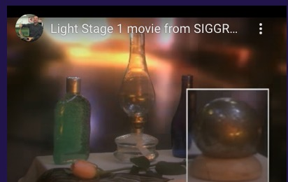
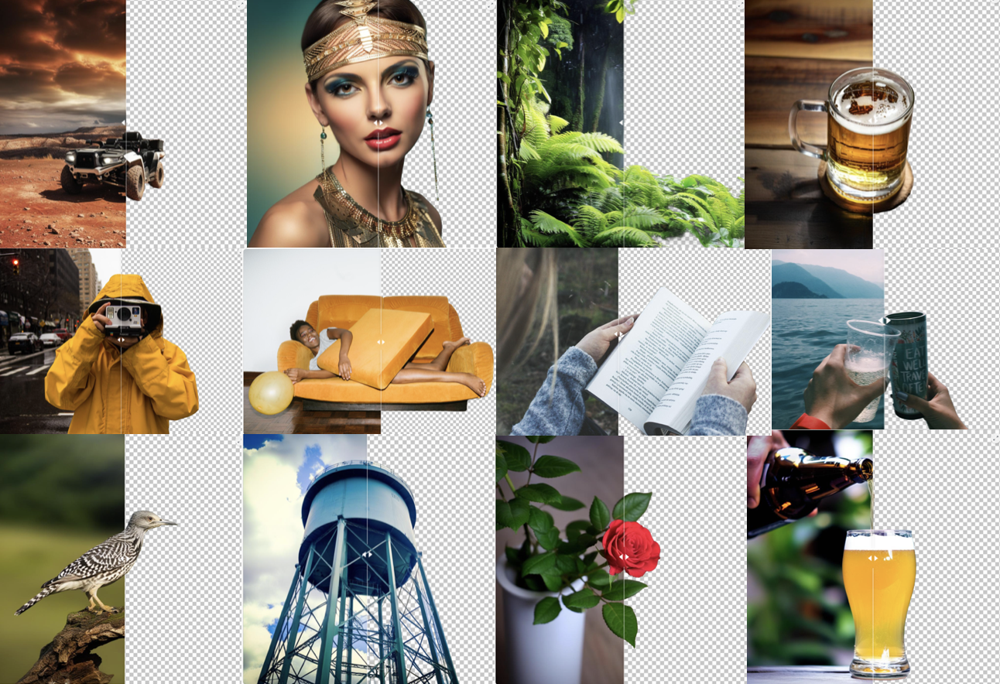

Impose Constant Light

# 论文信息：
controlnet作者

IC-Light 是一个控制图像照明的项目。

“IC-Light”这个名称代表“Impose Constant Light”（我们将在本页末尾简要描述这一点）。

目前，我们发布了两种类型的模型：文本条件重新光照模型和背景条件模型。两种类型都将前景图像作为输入。

Related Work

Also read ...

Total Relighting: Learning to Relight Portraits for Background Replacement

Relightful Harmonization: Lighting-aware Portrait Background Replacement

SwitchLight: Co-design of Physics-driven Architecture and Pre-training Framework for Human Portrait Relighting
About

型号注释 

iclight_sd15_fc.safetensors - 默认的重新照明模型，以文本和前景为条件。您可以使用初始潜伏来影响重新照明。

iclight_sd15_fcon.safetensors - 与“iclight_sd15_fc.safetensors”相同，但使用偏移噪声进行训练。请注意，在用户研究中，默认的“iclight_sd15_fc.safetensors”稍微优于此模型。这就是为什么默认模型是没有偏移噪声的模型的原因。    
Same as "iclight_sd15_fc.safetensors" but trained with offset noise. Note that the default "iclight_sd15_fc.safetensors" outperform this model slightly in a user study. And this is the reason why the default model is the model without offset noise.      
历史经验可以得到更纯的图片颜色

iclight_sd15_fbc.safetensors - 以文本、前景和背景为条件的重新照明模型。

[火]5.13更新   
Currently ComfyUI and Forge versions are available:     
● https://github.com/huchenlei/ComfyUI-IC-Light-Native   
● https://github.com/huchenlei/sd-forge-ic-light    
● https://github.com/kijai/ComfyUI-IC-Light   
I will work on A1111 extension soon.    

# 原理

换背景，换灯光方向（四个：上下左右）     
控制光照柔和与强烈程度，光种     

## Text-Conditioned Model   
输入：提供人物图片（会被自动提取未前景再输入模型），删去背景获取前景图

(Note that the "Lighting Preference" are just initial latents - eg., if the Lighting Preference is "Left" then initial latent is left white right black.)      

Prompt: beautiful woman, detailed face, warm atmosphere, at home, bedroom

Lighting Preference: Left

## Background-Conditioned Model     
输入：提供人物图片，纯背景图    

背景图可以flip     

来自“外观混合”和“光源混合”的两个图像是一致的（理想情况下，在 HDR 空间中数学上是等效的）。

在训练重新照明模型时，我们强加了这种一致性（在潜在空间中使用 MLP）。

因此，该模型能够产生高度一致的重新光照 -如此一致，甚至可以将不同的重新光照合并为法线贴图！尽管事实上这些模型是潜在扩散的。
As a result, the model is able to produce highly consistent relight - so consistent that different relightings can even be merged as normal maps! Despite the fact that the models are latent diffusion.

从扩散模型的角度实现打光，几十年前的技术复现

从左到右依次是输入、模型输出、重新照明、分割的阴影图像和合并的法线贴图。请注意，该模型未使用任何法线贴图数据进行训练。这个正常的估计来自于重新点亮的一致性。

## 施加一致的光
在 HDR 空间中，照明具有所有光传输都是独立的属性。     
illumination has a property that all light transports are independent.

因此，不同光源的外观混合相当于混合光源的外观：   
the blending of appearances of different light sources is equivalent to the appearance with mixed light sources:

# 代码

## 内部
算法流程：输入参考图 -> RMBG-1.4 前景提取 -> i2i -> i2i

打光方向原理
the "Lighting Preference" are just initial latents - eg., if the Lighting Preference is "Left" then initial latent is left white right black.

模型细节
we release two types of models: text-conditioned relighting model and background-conditioned model. Both types take foreground images as inputs.
作者给了两种unet模型，使用时分别融合到底模中
sd_merged = {k: sd_origin[k] + sd_offset[k] for k in sd_origin.keys()}
unet.load_state_dict(sd_merged, strict=True)
unet模型结构轻微修改

光方向初始latent 线性关系

    if bg_source == BGSource.NONE:
            pass
        elif bg_source == BGSource.LEFT:
            gradient = np.linspace(255, 0, image_width)
            image = np.tile(gradient, (image_height, 1))
            input_bg = np.stack((image,) * 3, axis=-1).astype(np.uint8)
        elif bg_source == BGSource.RIGHT:
            gradient = np.linspace(0, 255, image_width)
            image = np.tile(gradient, (image_height, 1))
            input_bg = np.stack((image,) * 3, axis=-1).astype(np.uint8)
        elif bg_source == BGSource.TOP:
            gradient = np.linspace(255, 0, image_height)[:, None]
            image = np.tile(gradient, (1, image_width))
            input_bg = np.stack((image,) * 3, axis=-1).astype(np.uint8)
        elif bg_source == BGSource.BOTTOM:
            gradient = np.linspace(0, 255, image_height)[:, None]
            image = np.tile(gradient, (1, image_width))
            input_bg = np.stack((image,) * 3, axis=-1).astype(np.uint8)
        else:
            raise 'Wrong initial latent!'

conds, unconds = encode_prompt_pair(positive_prompt=prompt + ', ' + a_prompt, negative_prompt=n_prompt)

    fg = resize_and_center_crop(input_fg, image_width, image_height)

    concat_conds = numpy2pytorch([fg]).to(device=vae.device, dtype=vae.dtype)
    concat_conds = vae.encode(concat_conds).latent_dist.mode() * vae.config.scaling_factor

第一阶段 i2i ：Lighting Preference latent 作为初始化 latent    
第二阶段 i2i ：根据Highres scale放大

第一阶段

    bg = resize_and_center_crop(input_bg, image_width, image_height)
    bg_latent = numpy2pytorch([bg]).to(device=vae.device, dtype=vae.dtype)
    bg_latent = vae.encode(bg_latent).latent_dist.mode() * vae.config.scaling_factor
    latents = i2i_pipe(
        image=bg_latent,
        strength=lowres_denoise,
        prompt_embeds=conds,
        negative_prompt_embeds=unconds,
        width=image_width,
        height=image_height,
        num_inference_steps=int(round(steps / lowres_denoise)),
        整个表达式的作用就是对 steps 除以 lowres_denoise 的结果进行四舍五入，返回最接近的整数值。
        num_images_per_prompt=num_samples,
        generator=rng,
        output_type='latent',
        guidance_scale=cfg,
        cross_attention_kwargs={'concat_conds': concat_conds},
        这个地方类似controlnet     
    ).images.to(vae.dtype) / vae.config.scaling_factor

    pixels = vae.decode(latents).sample
    pixels = pytorch2numpy(pixels)
    pixels = [resize_without_crop(
        image=p,
        target_width=int(round(image_width * highres_scale / 64.0) * 64),
        target_height=int(round(image_height * highres_scale / 64.0) * 64))
    for p in pixels]
    pixel空间进行图片放大，resize    

    pixels = numpy2pytorch(pixels).to(device=vae.device, dtype=vae.dtype)
    latents = vae.encode(pixels).latent_dist.mode() * vae.config.scaling_factor
    latents = latents.to(device=unet.device, dtype=unet.dtype)

    image_height, image_width = latents.shape[2] * 8, latents.shape[3] * 8 
    这个操作不明白      

    fg = resize_and_center_crop(input_fg, image_width, image_height)
    concat_conds = numpy2pytorch([fg]).to(device=vae.device, dtype=vae.dtype)
    concat_conds = vae.encode(concat_conds).latent_dist.mode() * vae.config.scaling_factor

    没有必要做两次

第二阶段

    latents = i2i_pipe(
        image=latents,
        strength=highres_denoise,
        prompt_embeds=conds,
        negative_prompt_embeds=unconds,
        width=image_width,
        height=image_height,
        num_inference_steps=int(round(steps / highres_denoise)),
        num_images_per_prompt=num_samples,
        generator=rng,
        output_type='latent',
        guidance_scale=cfg,
        cross_attention_kwargs={'concat_conds': concat_conds},
    ).images.to(vae.dtype) / vae.config.scaling_factor

    pixels = vae.decode(latents).sample

## gradio运行错误解决

### 第一个错误

    File "/root/miniconda3/envs/iclight/lib/python3.10/site-packages/torch/cuda/__init__.py", line 293, in _lazy_init
        torch._C._cuda_init()
    RuntimeError: The NVIDIA driver on your system is too old (found version 11040). Please update your GPU driver by downloading and installing a new version from the URL: http://www.nvidia.com/Download/index.aspx Alternatively, go to: https://pytorch.org to install a PyTorch version that has been compiled with your version of the CUDA driver.

pip install torch torchvision --index-url https://download.pytorch.org/whl/cu121    

torch                     2.3.0+cu121        
torchvision               0.18.0+cu121

不匹配        
nvcc 11.8         
nvidia-smi CUDA 11.4        

pip install torch==2.2.2 torchvision==0.17.2 torchaudio==2.2.2 --index-url https://download.pytorch.org/whl/cu118

降低torch版本可以了

### 第二次错误
推理时候。    
Segmentation fault (core dumped)     
应该是c++ c层面的错误，空指针，堆栈溢出,tensor问题等      

以前在jetson上使用c++程序也遇到过    

换机器重装

Nvidia-smi CUDA Version: 12.2     
Nvcc 11.8   
pip install torch torchvision --index-url https://download.pytorch.org/whl/cu121     
可以了   

## comfyui 运行

Chilloutmix-Ni-pruned-fp16-fix.safetensors底模     
生图很花     

Photon_v1_fp16.safetensors第一次下载中断续下，读取时header有问题

第二次完整下载

!!! Exception during processing!!! With local_files_only set to False, you must first locally save the configuration in the following path: 'openai/clip-vit-large-patch14'.

Photon_v1_fp16不含clip，需要调用 Chilloutmix-Ni-pruned-fp16-fix.safetensors 的 clip

生成质量较差

插件作者还在修改，打补丁      

# 其他
## controlnet作者
https://github.com/lllyasviel

张吕敏（LyuminZhang）是一名博士。自2022年起，他在斯坦福大学Maneesh Agrawala教授的指导下攻读计算机科学专业。在此之前，他自2021年起在香港中文大学黄天进教授实验室担任研究助理。他还与教授合作埃德加·西莫-塞拉 (Edgar Simo-Serra)参与了许多有趣的项目。他获得了工程学学士学位。 2021年于苏州大学获得博士学位，导师为季毅教授和 刘春平教授。

闲暇时，吕敏喜欢开发游戏。 Lvmin 是一款名为 YGOPro2 的 Unity 卡牌游戏的作者。如果你在Google或YouTube上搜索这个游戏，你会发现它很受欢迎。该游戏已被翻译成多种语言，在世界各地拥有粉丝。

### PaintingLight

Generating Digital Painting Lighting Effects via RGB-space Geometry (SIGGRAPH2020/TOG2020)

ACM Transactions on Graphics (Presented in ACM SIGGRAPH 2020), January 2020

Lvmin Zhang, Edgar Simo-Serra, Yi Ji, and Chunping Liu

打光方向另一种实现     

ic-light最大的特色是光种，光方向的多样性，充分体现扩散模型的特点，control的特色      
controlnet也可以简单实现打光方向     

旨在寻找一种操纵数字绘画中的照明的方法。该项目于2019年1月左右启动，核心算法于2020年被ACM Transitions on Graphics接受。

由于数字绘画光照数据不易获得，因此该算法没有使用深度学习。核心思想是利用颜色几何来构建一个感知上可行的重新照明系统。这种重新照明可能在物理上不准确，但对于艺术用例来说已经足够好了。     
Because digital painting illumination data is not easy to obtain, this algorithm does not use deep learning. The core idea is to make use of `color geometry to build up a perceptually workable relighting system`. Such relighting may not be physically accurate, but are good enough for artistic use cases.     

Q: It is mentioned that this project does not using 
   deep learning, then why it is still required to install tensorflow?

A: This is because we use SRCNN, a tensorflow neural network, to 
   pre-process input images in order to remove JPEG artifacts. Therefore 
   you still need to install tensorflow with a proper version.

我们提出了一种从单个图像生成数字绘画照明效果的算法。我们的算法基于一个关键的观察：艺术家使用许多重叠的笔画来绘制照明效果，即具有密集笔画历史的像素往往会收集更多的照明笔画。基于这一观察，我们设计了一种算法，既可以使用颜色几何来估计数字绘画中的笔画密度，然后通过模仿艺术家从粗到细的工作流程来生成新颖的灯光效果。首先使用波形变换生成粗略的灯光效果，然后根据原始插图的笔划密度修饰为可用的灯光效果。
我们的算法是内容感知的，生成的灯光效果自然适应图像结构，并且可以用作交互式工具来简化当前为数字和哑光绘画生成灯光效果的劳动密集型工作流程。此外，我们的算法还可以为照片或 3D 渲染图像生成可用的灯光效果。我们通过深入的定性和定量分析（包括感知用户研究）来评估我们的方法。结果表明，我们提出的方法不仅能够相对于现有方法产生良好的照明效果，而且还能够显着减少所需的交互时间。

### Stable Diffusion WebUI Forge

Stable Diffusion WebUI Forge 是一个基于Stable Diffusion WebUI（基于Gradio）的平台，可简化开发、优化资源管理并加快推理速度。

“Forge”这个名字的灵感来自于“Minecraft Forge”。该项目旨在成为 SD WebUI 的 Forge。

与原始 WebUI（针对 1024 像素的 SDXL 推理）相比，您可以期待以下加速：

如果您使用常见的 GPU（如 8GB vram），您可以预期推理速度（it/s）会提高约30~45%，GPU 内存峰值（在任务管理器中）将下降约 700MB 至 1.3GB，最大扩散分辨率（不会 OOM）将增加约 2 倍到 3 倍，最大扩散批量大小（不会 OOM）将增加约 4 倍到 6 倍。

如果您使用功能较弱的 GPU（例如 6GB vram），则预计推理速度（it/s）将提高约 60~75%，GPU 内存峰值（在任务管理器中）将下降约 800MB 至 1.5GB（最大）扩散分辨率（不会 OOM）将增加约 3 倍，最大扩散批量大小（不会 OOM）将增加约 4 倍。

如果您使用像 4090 这样具有 24GB vram 的强大 GPU，您可以预期推理速度 (it/s) 会提高约3~6%，GPU 内存峰值（在任务管理器中）将下降约 1GB 至 1.4GB，最大扩散分辨率（不会 OOM）将增加约 1.6 倍，最大扩散批量大小（不会 OOM）将增加约 2 倍。

如果使用 ControlNet for SDXL，最大 ControlNet 数量（不会 OOM）将增加约 2 倍，使用 SDXL+ControlNet 的速度将加快约 30~45%。

Forge 带来的另一个非常重要的变化是Unet Patcher。使用 Unet Patcher，Self-Attention Guidance、Kohya High Res Fix、FreeU、StyleAlign、Hypertile 等方法都可以在大约 100 行代码中实现。

多亏了 Unet Patcher，许多新的东西现在都可以在 Forge 中实现并得到支持，包括 SVD、Z123、masked Ip-adapter、masked controlnet、photomaker 等。

无需再对 UNet 进行 Monkeypatch 并与其他扩展发生冲突！

Forge 还添加了一些采样器，包括但不限于 DDPM、DDPM Karras、DPM++ 2M Turbo、DPM++ 2M SDE Turbo、LCM Karras、Euler A Turbo 等（LCM 从 1.7.0 开始就已经在原始 webui 中）。

最后，Forge 承诺我们只会做好我们的工作。 Forge 永远不会对用户界面添加不必要的主观更改。您仍在使用 100% 自动 1111 WebUI。

### Style2Paints
sketch + style = paints 🎨 (TOG2018/SIGGRAPH2018ASIA)

非扩散模型    

    2022.08.15 - Lvmin's article is accepted to SIGGRAPH ASIA 2022, journal track.
    2022.06.15 - See some recent announcements of Style2Paints (Project SEPA) here.
    2022.01.09 - See some recent announcements of Style2Paints (Project SEPA) here.
    2021.06.09 - An article on shadow drawing is accepted to ICCV 2021 as Oral.
    2021.06.01 - The Project SEPA is decided to be released before 2022.
    2021.03.22 - The next version of Style2Paints will be called Project SEPA. See also the twitter post.

Help human in their standard coloring workflow!
Most human artists are familiar with this workflow:

sketching -> color filling/flattening -> gradients/details adding -> shading
And the corresponding layers are:

lineart layers + flat color layers + gradient layers + shading layers
Style2paints V4 is designed for this standard coloring workflow! In style2paints V4, you can automatically get separated results from each step!

### fooocus

https://github.com/lllyasviel/Fooocus

About    
Focus on prompting and generating

Fooocus is an image generating software (based on Gradio).

Fooocus is a rethinking of Stable Diffusion and Midjourney’s designs:

Learned from Stable Diffusion, the software is offline, open source, and free.

Learned from Midjourney, the manual tweaking is not needed, and users only need to focus on the prompts and images.

## Swarm UI
alternate comfyui

https://github.com/Stability-AI/StableSwarmUI

StableSwarmUI, A Modular Stable Diffusion Web-User-Interface, with an emphasis on making powertools easily accessible, high performance, and extensibility.

## 早期研究也能控制打光。而且数据集完善

### Acquiring the Reflectance Field of a Human Face
https://www.pauldebevec.com/Research/LS/

https://www.pauldebevec.com/Research/LS/debevec-siggraph2000-high.pdf

获取人脸反射场    
Paul Debevec、Tim Hawkins、Chris Tchou、Haarm-Pieter Duiker、Westley Sarokin 和Mark Sagar      
SIGGRAPH 2000 会议论文集

2004 年 4 月 10 日

摘要：

我们提出了一种获取人脸反射场的方法，并使用这些测量结果在光照和视点的任意变化下渲染人脸。我们首先使用光台在入射照明方向的密集采样下从一小组视点获取面部图像。然后，我们根据照明方向空间上的每个观察到的图像像素的值构建反射函数图像。根据反射率函数，我们可以以任何形式的采样或计算照明从原始视点直接生成面部图像。为了改变视点，我们使用皮肤反射率模型来估计新视点的反射率函数的外观。我们通过在新颖的照明和视点下合成人脸的渲染来演示该技术。

### GeoWizard
GeoWizard: Unleashing the Diffusion Priors for 3D Geometry Estimation from a Single Image    

[Submitted on 18 Mar 2024]     
GeoWizard: Unleashing the Diffusion Priors for 3D Geometry Estimation from a Single Image     

https://github.com/fuxiao0719/GeoWizard

我们引入了 GeoWizard，一种新的生成基础模型，旨在从单个图像估计几何属性，例如深度和法线。尽管该领域已经进行了大量研究，但由于公开数据集的多样性低和质量差，进展受到很大限制。因此，先前的工作要么受限于有限的场景，要么无法捕捉几何细节。在本文中，我们证明生成模型与传统判别模型（例如 CNN 和 Transformer）相反，可以有效解决固有的不适定问题。我们进一步表明，利用扩散先验可以显着提高泛化能力、细节保留和资源使用效率。具体来说，我们扩展了原始的稳定扩散模型来联合预测深度和法线，从而允许两种表示之间的相互信息交换和高度一致性。更重要的是，我们提出了一种简单而有效的策略，将各种场景的复杂数据分布分离成不同的子分布。这种策略使我们的模型能够识别不同的场景布局，以卓越的保真度捕获 3D 几何图形。 GeoWizard 为零镜头深度和法线预测设定了新的基准，显着增强了许多下游应用，例如 3D 重建、2D 内容创建和新颖的视点合成。     

在微调过程中，GeoWizard 将图像、GT 深度和 GT 法线通过冻结的 VAE 编码到潜在空间中，并形成两个串联的几何组。每个组都被输入 U-Net，在几何切换器的指导下生成深度或正常域的输出。此外，还引入了场景提示，以使用三种可能的场景布局（室内/室外/物体）之一生成结果。在推理过程中，给定图像、场景提示、初始深度噪声和法线噪声，GeoWizard 可以联合生成高质量的深度和法线。

### switchlight
https://arxiv.org/pdf/2402.18848

### Total Relighting:
Learning to Relight Portraits for Background Replacement   
https://augmentedperception.github.io/total_relighting/   
SIGGRAPH 2021 技术视频

    
老方法效果已经很好     
包括现在腾讯会议的换背景，就是有时候有点抖。ic-light主打的打光甚至都不能算新颖技术    
可能是对于limit的优化吧      

我们提出了一种用于人像重新照明和背景替换的新颖系统，该系统可保持高频边界细节并准确合成新颖照明下的主体外观，从而为任何所需场景生成逼真的合成图像。我们的技术包括通过 Alpha 抠图、重新照明和合成进行前景估计。我们证明，这些阶段中的每一个都可以在顺序管道中处理，无需使用先验（例如已知背景或已知照明），也无需专门的采集技术，仅使用单个 RGB 肖像图像和新颖的目标 HDR 照明环境作为输入。我们使用在光级计算照明系统中捕获的对象的重照肖像来训练我们的模型，该系统记录了多种照明条件、高质量的几何形状和准确的 alpha 遮罩。为了执行逼真的重新照明以进行合成，我们在深度学习框架中引入了一种新颖的每像素照明表示，它明确地模拟了外观的漫反射和镜面反射分量，生成具有令人信服的渲染非朗伯效果（如镜面高光）的重新照明肖像。多次实验和比较表明了所提出的方法应用于野外图像时的有效性。

### Relightful Harmonization
[Submitted on 11 Dec 2023 (v1), last revised 7 Apr 2024 (this version, v2)]      
Relightful Harmonization: Lighting-aware Portrait Background Replacement

肖像协调旨在将拍摄对象合成到新的背景中，调整其灯光和颜色以确保与背景场景的和谐。现有的协调技术通常只专注于调整前景的全局颜色和亮度，而忽略了背景中的关键照明线索，例如明显的照明方向，从而导致不切实际的构图。我们推出 Relightful Harmonization，这是一种照明感知扩散模型，旨在使用任何背景图像无缝协调前景肖像的复杂照明效果。我们的方法分三个阶段展开。首先，我们引入一个照明表示模块，该模块允许我们的扩散模型对来自目标图像背景的照明信息进行编码。其次，我们引入了一个对齐网络，它将从图像背景中学习到的照明特征与从全景环境地图中学习到的照明特征对齐，这是场景照明的完整表示。最后，为了进一步提高所提出方法的真实感，我们引入了一种新颖的数据模拟管道，该管道可以从各种自然图像中生成合成训练对，用于细化模型。我们的方法在视觉保真度和照明连贯性方面优于现有基准，在现实测试场景中表现出卓越的泛化能力，突出了其多功能性和实用性。

## Photon (sd1.5底模)
Photon aims to generate photorealistic and visually appealing images effortlessly.

Recommendation for generating the first image with Photon:

Prompt: A simple sentence in natural language describing the image.

Negative: "cartoon, painting, illustration, (worst quality, low quality, normal quality:2)"

Sampler: DPM++ 2M Karras | Steps: 20 | CFG Scale: 6

Size: 512x768 or 768x512

Hires.fix: R-ESRGAN 4x+ | Steps: 10 | Denoising: 0.45 | Upscale x 2

(avoid using negative embeddings unless absolutely necessary)

### development
The development process was somewhat chaotic but essentially:

It started from an old mix.

LORAs were trained on various topics using AI-generated photorealistic images.

These LORAs were mixed within the model using different weights.

In the midst of this mixing, hand generation broke.

LORAs were generated and remixed in an attempt to fix hand generation (not entirely successful).

### limit
In future versions, I will try to:

Completely eliminate the need for a negative prompt to generate high-quality images.

Fix the hand generation issue to minimize instances of poorly drawn hands.

Explore more automated training processes. I would love to have 5,000 or 50,000 high-quality AI-generated photorealistic images for training purposes.

## mask获取
comfyui sam mask     

## 前景提取工具 briaai/RMBG-1.4 

BRIA Background Removal v1.4 

MBG v1.4 是我们最先进的背景去除模型，旨在有效地将各种类别和图像类型的前景与背景分开。该模型已经在精心挑选的数据集上进行了训练，其中包括：一般库存图像、电子商务、游戏和广告内容，使其适合支持大规模企业内容创建的商业用例。其准确性、效率和多功能性可与目前领先的可用源模型相媲美。当内容安全、合法许可的数据集和偏见缓解至关重要时，它是理想的选择。

Bria-RMBG 模型使用超过 12,000 张高质量、高分辨率、手动标记（像素精度）、完全许可的图像进行训练。我们的基准包括平衡的性别、平衡的种族和不同类型的残疾人。

图片分布：

类别	分配
仅对象	45.11%
有物体/动物的人	25.24%
仅限人	17.35%
带有文字的人/物体/动物	8.52%
纯文本	2.52%
仅限动物	1.89%

类别	分配
逼真	87.70%
非真实感	12.30%

类别	分配
非纯色背景	52.05%
纯色背景	47.95%

类别	分配
单个主要前景对象	51.42%
前景中有多个对象	48.58%

Architecture

RMBG v1.4 is developed on the IS-Net enhanced with our unique training scheme and proprietary dataset. These modifications significantly improve the model’s accuracy and effectiveness in diverse image-processing scenarios.

RMBG v1.4 是在IS-Net上开发的，并通过我们独特的训练方案和专有数据集进行了增强。这些修改显着提高了模型在不同图像处理场景中的准确性和有效性。

### Dichotomous Image Segmentation (DIS)
https://github.com/xuebinqin/DIS

这是我们新项目高精度二分图像分割的存储库

高精度二分图像分割（ECCV 2022）    
秦学斌、戴航、胡晓斌、范邓平*、邵凌、Luc Van Gool。

我们之前的作品：U 2 -Net，BASNet。

# 结尾