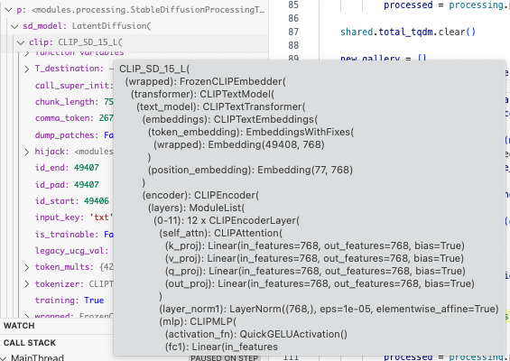
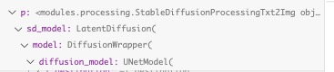
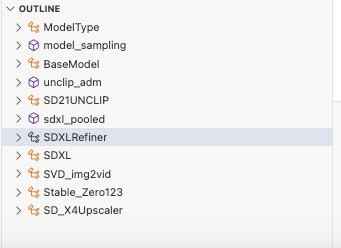
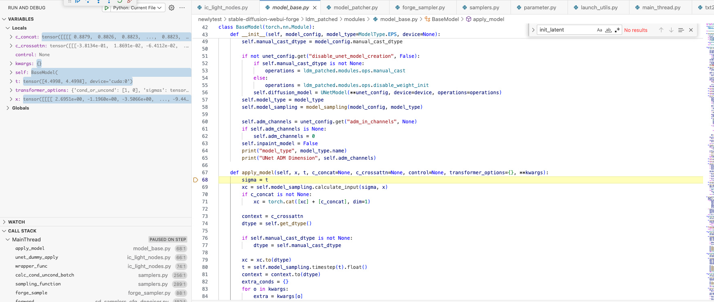
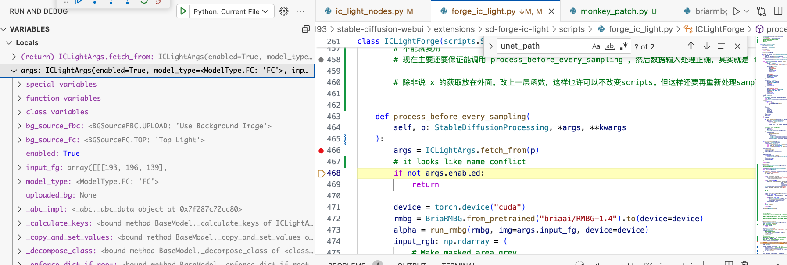
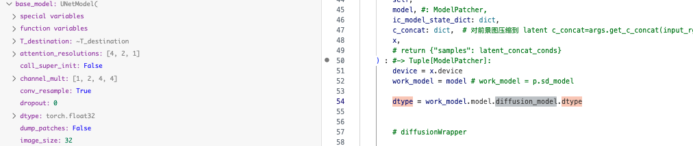
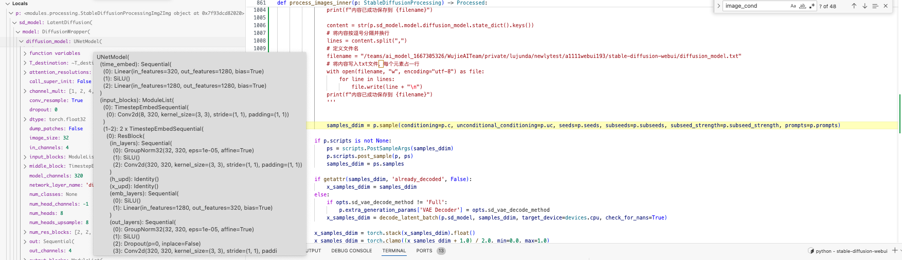
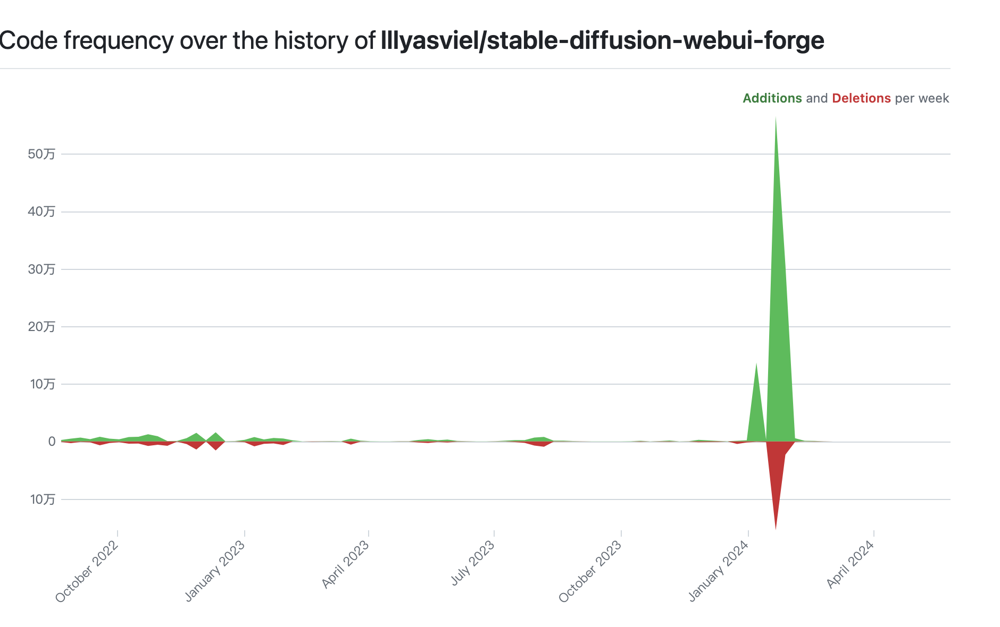

Impose Constant Light

# 论文信息：
controlnet作者

IC-Light 是一个控制图像照明的项目。

“IC-Light”这个名称代表“Impose Constant Light”（我们将在本页末尾简要描述这一点）。

目前，我们发布了两种类型的模型：文本条件重新光照模型和背景条件模型。两种类型都将前景图像作为输入。

Related Work

Also read ...

Total Relighting: Learning to Relight Portraits for Background Replacement

Relightful Harmonization: Lighting-aware Portrait Background Replacement

SwitchLight: Co-design of Physics-driven Architecture and Pre-training Framework for Human Portrait Relighting
About

型号注释 

iclight_sd15_fc.safetensors - 默认的重新照明模型，以文本和前景为条件。您可以使用初始潜伏来影响重新照明。

iclight_sd15_fcon.safetensors - 与“iclight_sd15_fc.safetensors”相同，但使用偏移噪声进行训练。请注意，在用户研究中，默认的“iclight_sd15_fc.safetensors”稍微优于此模型。这就是为什么默认模型是没有偏移噪声的模型的原因。    
Same as "iclight_sd15_fc.safetensors" but trained with offset noise. Note that the default "iclight_sd15_fc.safetensors" outperform this model slightly in a user study. And this is the reason why the default model is the model without offset noise.      
历史经验可以得到更纯的图片颜色

iclight_sd15_fbc.safetensors - 以文本、前景和背景为条件的重新照明模型。

[火]5.13更新   
Currently ComfyUI and Forge versions are available:     
● https://github.com/huchenlei/ComfyUI-IC-Light-Native   
● https://github.com/huchenlei/sd-forge-ic-light    
● https://github.com/kijai/ComfyUI-IC-Light   
I will work on A1111 extension soon.    

fbc比fc多一个图像输入通道，网络的输入输出部分不太一样

    File "/root/miniconda3/envs/comfy/lib/python3.11/site-packages/torch/nn/modules/conv.py", line 456, in _conv_forward
        return F.conv2d(input, weight, bias, self.stride,
            ^^^^^^^^^^^^^^^^^^^^^^^^^^^^^^^^^^^^^^^^^^
    RuntimeError: Given groups=1, weight of size [320, 8, 3, 3], expected input[8, 12, 96, 96] to have 8 channels, but got 12 channels instead

# 原理

换背景，换灯光方向（四个：上下左右）     
控制光照柔和与强烈程度，光种     

## Text-Conditioned Model   
输入：提供人物图片（会被自动提取未前景再输入模型），删去背景获取前景图

(Note that the "Lighting Preference" are just initial latents - eg., if the Lighting Preference is "Left" then initial latent is left white right black.)      

Prompt: beautiful woman, detailed face, warm atmosphere, at home, bedroom

Lighting Preference: Left

## Background-Conditioned Model     
输入：提供人物图片，纯背景图    

背景图可以flip     

来自“外观混合”和“光源混合”的两个图像是一致的（理想情况下，在 HDR 空间中数学上是等效的）。

在训练重新照明模型时，我们强加了这种一致性（在潜在空间中使用 MLP）。

因此，该模型能够产生高度一致的重新光照 -如此一致，甚至可以将不同的重新光照合并为法线贴图！尽管事实上这些模型是潜在扩散的。
As a result, the model is able to produce highly consistent relight - so consistent that different relightings can even be merged as normal maps! Despite the fact that the models are latent diffusion.

从扩散模型的角度实现打光，几十年前的技术复现

从左到右依次是输入、模型输出、重新照明、分割的阴影图像和合并的法线贴图。请注意，该模型未使用任何法线贴图数据进行训练。这个正常的估计来自于重新点亮的一致性。

## 施加一致的光
在 HDR 空间中，照明具有所有光传输都是独立的属性。     
illumination has a property that all light transports are independent.

因此，不同光源的外观混合相当于混合光源的外观：   
the blending of appearances of different light sources is equivalent to the appearance with mixed light sources:

# 代码

## 内部
算法流程：输入参考图 -> RMBG-1.4 前景提取 -> i2i -> i2i

打光方向原理
the "Lighting Preference" are just initial latents - eg., if the Lighting Preference is "Left" then initial latent is left white right black.

模型细节
we release two types of models: text-conditioned relighting model and background-conditioned model. Both types take foreground images as inputs.
作者给了两种unet模型，使用时分别融合到底模中
sd_merged = {k: sd_origin[k] + sd_offset[k] for k in sd_origin.keys()}
unet.load_state_dict(sd_merged, strict=True)
unet模型结构轻微修改

光方向初始latent 线性关系

    if bg_source == BGSource.NONE:
            pass
        elif bg_source == BGSource.LEFT:
            gradient = np.linspace(255, 0, image_width)
            image = np.tile(gradient, (image_height, 1))
            input_bg = np.stack((image,) * 3, axis=-1).astype(np.uint8)
        elif bg_source == BGSource.RIGHT:
            gradient = np.linspace(0, 255, image_width)
            image = np.tile(gradient, (image_height, 1))
            input_bg = np.stack((image,) * 3, axis=-1).astype(np.uint8)
        elif bg_source == BGSource.TOP:
            gradient = np.linspace(255, 0, image_height)[:, None]
            image = np.tile(gradient, (1, image_width))
            input_bg = np.stack((image,) * 3, axis=-1).astype(np.uint8)
        elif bg_source == BGSource.BOTTOM:
            gradient = np.linspace(0, 255, image_height)[:, None]
            image = np.tile(gradient, (1, image_width))
            input_bg = np.stack((image,) * 3, axis=-1).astype(np.uint8)
        else:
            raise 'Wrong initial latent!'

conds, unconds = encode_prompt_pair(positive_prompt=prompt + ', ' + a_prompt, negative_prompt=n_prompt)

    fg = resize_and_center_crop(input_fg, image_width, image_height)

    concat_conds = numpy2pytorch([fg]).to(device=vae.device, dtype=vae.dtype)
    concat_conds = vae.encode(concat_conds).latent_dist.mode() * vae.config.scaling_factor

第一阶段 i2i ：Lighting Preference latent 作为初始化 latent    
第二阶段 i2i ：根据Highres scale放大

第一阶段

    bg = resize_and_center_crop(input_bg, image_width, image_height)
    bg_latent = numpy2pytorch([bg]).to(device=vae.device, dtype=vae.dtype)
    bg_latent = vae.encode(bg_latent).latent_dist.mode() * vae.config.scaling_factor
    latents = i2i_pipe(
        image=bg_latent,
        strength=lowres_denoise,
        prompt_embeds=conds,
        negative_prompt_embeds=unconds,
        width=image_width,
        height=image_height,
        num_inference_steps=int(round(steps / lowres_denoise)),
        整个表达式的作用就是对 steps 除以 lowres_denoise 的结果进行四舍五入，返回最接近的整数值。
        num_images_per_prompt=num_samples,
        generator=rng,
        output_type='latent',
        guidance_scale=cfg,
        cross_attention_kwargs={'concat_conds': concat_conds},
        这个地方类似controlnet     
    ).images.to(vae.dtype) / vae.config.scaling_factor

    pixels = vae.decode(latents).sample
    pixels = pytorch2numpy(pixels)
    pixels = [resize_without_crop(
        image=p,
        target_width=int(round(image_width * highres_scale / 64.0) * 64),
        target_height=int(round(image_height * highres_scale / 64.0) * 64))
    for p in pixels]
    pixel空间进行图片放大，resize    

    pixels = numpy2pytorch(pixels).to(device=vae.device, dtype=vae.dtype)
    latents = vae.encode(pixels).latent_dist.mode() * vae.config.scaling_factor
    latents = latents.to(device=unet.device, dtype=unet.dtype)

    image_height, image_width = latents.shape[2] * 8, latents.shape[3] * 8 
    这个操作不明白      

    fg = resize_and_center_crop(input_fg, image_width, image_height)
    concat_conds = numpy2pytorch([fg]).to(device=vae.device, dtype=vae.dtype)
    concat_conds = vae.encode(concat_conds).latent_dist.mode() * vae.config.scaling_factor

    没有必要做两次

第二阶段

    latents = i2i_pipe(
        image=latents,
        strength=highres_denoise,
        prompt_embeds=conds,
        negative_prompt_embeds=unconds,
        width=image_width,
        height=image_height,
        num_inference_steps=int(round(steps / highres_denoise)),
        num_images_per_prompt=num_samples,
        generator=rng,
        output_type='latent',
        guidance_scale=cfg,
        cross_attention_kwargs={'concat_conds': concat_conds},
    ).images.to(vae.dtype) / vae.config.scaling_factor

    pixels = vae.decode(latents).sample

## gradio运行错误解决

### 第一个错误

    File "/root/miniconda3/envs/iclight/lib/python3.10/site-packages/torch/cuda/__init__.py", line 293, in _lazy_init
        torch._C._cuda_init()
    RuntimeError: The NVIDIA driver on your system is too old (found version 11040). Please update your GPU driver by downloading and installing a new version from the URL: http://www.nvidia.com/Download/index.aspx Alternatively, go to: https://pytorch.org to install a PyTorch version that has been compiled with your version of the CUDA driver.

pip install torch torchvision --index-url https://download.pytorch.org/whl/cu121    

torch                     2.3.0+cu121        
torchvision               0.18.0+cu121

不匹配        
nvcc 11.8         
nvidia-smi CUDA 11.4        

pip install torch==2.2.2 torchvision==0.17.2 torchaudio==2.2.2 --index-url https://download.pytorch.org/whl/cu118

降低torch版本可以了

### 第二次错误
推理时候。    
Segmentation fault (core dumped)     
应该是c++ c层面的错误，空指针，堆栈溢出,tensor问题等      

以前在jetson上使用c++程序也遇到过    

换机器重装

Nvidia-smi CUDA Version: 12.2     
Nvcc 11.8   
pip install torch torchvision --index-url https://download.pytorch.org/whl/cu121     
可以了   

## comfyui 运行

Chilloutmix-Ni-pruned-fp16-fix.safetensors底模     
生图很花     

Photon_v1_fp16.safetensors第一次下载中断续下，读取时header有问题

第二次完整下载

!!! Exception during processing!!! With local_files_only set to False, you must first locally save the configuration in the following path: 'openai/clip-vit-large-patch14'.

Photon_v1_fp16不含clip，需要调用 Chilloutmix-Ni-pruned-fp16-fix.safetensors 的 clip

生成质量较差

插件作者还在修改，打补丁      

# forge
## 报错
推理出现 Segmentation fault (core dumped)

并且这个平台不会返回具体错误信息     

卡在反向推理。中断

    torch                     2.2.2+cu118
    torchaudio                2.2.2+cu118
    torchdiffeq               0.2.3
    torchmetrics              1.4.0
    torchsde                  0.2.6
    torchvision               0.17.2+cu118

pip install torch torchvision --index-url https://download.pytorch.org/whl/cu121     

open-clip-torch 2.20.0 requires protobuf<4, but you have protobuf 4.25.3 which is incompatible.

ile "/teams/ai_model_1667305326/WujieAITeam/private/lujunda/newlytest/stable-diffusion-webui-forge/modules/launch_utils.py", line 431, in prepare_environment
    raise RuntimeError(
RuntimeError: Torch is not able to use GPU; add --skip-torch-cuda-test to COMMANDLINE_ARGS variable to disable this check

pip install -U open-clip-torch

Successfully installed open-clip-torch-2.24.0

还是启动不了launch 

    File "/teams/ai_model_1667305326/WujieAITeam/private/lujunda/newlytest/stable-diffusion-webui-forge/launch.py", line 39, in main
        prepare_environment()
    File "/teams/ai_model_1667305326/WujieAITeam/private/lujunda/newlytest/stable-diffusion-webui-forge/modules/launch_utils.py", line 431, in prepare_environment
        raise RuntimeError(
    RuntimeError: Torch is not able to use GPU; add --skip-torch-cuda-test to COMMANDLINE_ARGS variable to disable this check

File "/root/miniconda3/envs/iclight/lib/python3.10/site-packages/torch/cuda/__init__.py", line 293, in _lazy_init
    torch._C._cuda_init()
RuntimeError: The NVIDIA driver on your system is too old (found version 11040). Please update your GPU driver by downloading and installing a new version from the URL: http://www.nvidia.com/Download/index.aspx Alternatively, go to: https://pytorch.org to install a PyTorch version that has been compiled with your version of the CUDA driver.

nvcc 11.8     
CUDA Version: 11.4    

我给忘记2机是个问题机了            

始终是机子和CUDA和torch的傻逼问题

换机器直接launch一键成功

## 性能
forge闲时加载sd1.5显存2.5g   
     

## 权重
权重使用方式和正常的略有不同   
In order to load it with UnetLoader in Forge, state_dict keys need to convert to ldm format. You can download models with ldm keys here: https://huggingface.co/huchenlei/IC-Light-ldm/tree/main    
There are 2 models:   
● iclight_sd15_fc_unet_ldm: Use this in FG workflows   
● iclight_sd15_fbc_unet_ldm: Use this in BG workflows

## 特点
UNet Patcher    
Note that Forge does not use any other software as backend. The full name of the backend is Stable Diffusion WebUI with Forge backend, or for simplicity, the Forge backend. The API and python symbols are made similar to previous software only for reducing the learning cost of developers.

Now developing an extension is super simple. We finally have a patchable UNet.

Below is using one single file with 80 lines of codes to support FreeU:

extensions-builtin/sd_forge_freeu/scripts/forge_freeu.py

# 同类已有产品比较
Portrait Light on Google Pixel phones

    
     

## 一年前的打光应用
零几年就有 九几年也有      

23年可以使用illimination cn        
https://huggingface.co/latentcat/control_v1u_sd15_illumination_webui      

这个需要提供模糊光源图片 再生成        

23年再早一点 也可以使用cn depth实现       
https://www.youtube.com/watch?v=_xHC3bT5GBU    

光源图片     
https://drive.google.com/file/d/1am7z4CquPJrvz97DGAqMcP35WxEI-Pio/view

先是 png info 获取固定的图片构图任务（文生图创造的）    
seed等一切参数要求一样     
然后启用 sd1.5 cn depth      
处理器 depth leres       
img2img图片是 光源方向黑白图        

iclight的优势在于 前景图保留能力好 可以通过prompt同时控制背景内容生成        
还有自己宣传的什么柔和光 霓虹光 但我没发现有什么特别之处     
他这个训练数据还有一些电影风格的光     

# a1111插件编写
https://github.com/AUTOMATIC1111/stable-diffusion-webui/wiki/Developing-extensions     

## a1111 和 forge
forge根目录多两个文件夹     
ldm_patched和modules_forge   
模型加载可能略不同     
forge   

    from ldm_patched.modules.utils import load_torch_file
    from ldm_patched.modules.model_patcher import ModelPatcher
    from ldm_patched.modules.sd import VAE
a1111

    from modules import images, sd_samplers, processing, sd_models, sd_vae, sd_samplers_kdiffusion, errors
    from modules.processing import process_images, Processed, StableDiffusionProcessingTxt2Img
    from modules.shared import opts, state
    import modules.shared as shared
    import modules.sd_samplers
    import modules.sd_models
    import modules.sd_vae

Stable Diffusion WebUI Forge 是一个基于Stable Diffusion WebUI（基于Gradio）的平台，可简化开发、优化资源管理并加快推理速度。      
stable diffusion webui是基于gradio框架构建，gradio是一个开源的python库，它用于帮助科研与机器学习、深度学习工作者快速的演示应用，使用者仅需要几行代码，就可以快速构造一个简单、丰富的HTML界面，不需要有前端开发基础，仅需要python基础就行。    
https://github.com/gradio-app/gradio     

Forge 带来的另一个非常重要的变化是`Unet Patcher`。使用 Unet Patcher，Self-Attention Guidance、Kohya High Res Fix、FreeU、StyleAlign、Hypertile 等方法都可以在大约 100 行代码中实现。

这个在comfyui也有

感谢 Unet Patcher，许多新的东西现在都可以在 Forge 中实现并得到支持，包括 SVD、Z123、masked Ip-adapter、masked controlnet、photomaker 等。

无需再对 UNet 进行 Monkeypatch 并与其他扩展发生冲突！

我认为谷歌的定义是有用且最通用的：Monkey patching is a technique to add, modify, or suppress the default behavior of a piece of code at runtime without changing its original source code.

MonkeyPatch 是一段 Python 代码，它在运行时（通常在启动时）扩展或修改其他代码。

Forge还添加了一些采样器，包括但不限于DDPM、DDPM Karras、DPM++ 2M Turbo、DPM++ 2M SDE Turbo、LCM Karras、Euler A Turbo等（LCM从1.7.0开始就已经在原始webui中）。

您可以看到 Forge 不会更改 WebUI 结果。安装 Forge 并不是一个重大改变。

即使对于最复杂的提示（例如fantasy landscape with a [mountain:lake:0.25] and [an oak:a christmas tree:0.75][ in foreground::0.6][ in background:0.25] [shoddy:masterful:0.5].

您之前的所有作品仍然可以在 Forge 中使用！

Forge backend removes all WebUI's codes related to resource management and reworked everything. All previous CMD flags like medvram, lowvram, medvram-sdxl, precision full, no half, no half vae, attention_xxx, upcast unet, ... are all REMOVED. Adding these flags will not cause error but they will not do anything now. We highly encourage Forge users to remove all cmd flags and let Forge to decide how to load models.

没有任何 cmd 标志，Forge 可以运行具有 4GB vram 的 SDXL 和具有 2GB vram 的 SD1.5。

再次强调，Forge 不建议用户使用任何 cmd 标志，除非您非常确定确实需要这些标志。

UNet Patcher

新功能（原始 WebUI 中没有的）    
感谢 Unet Patcher，许多新的东西现在都可以在 Forge 中实现并得到支持，包括 SVD、Z123、masked Ip-adapter、masked controlnet、photomaker 等。

然而，如果较新的扩展使用 Forge，它们的代码可能会短得多。

Usually if an old extension rework using Forge's unet patcher, 通常，如果使用 Forge 的unet patcher 对旧扩展进行返工，80% 的代码可以被删除，特别是当它们需要调用controlnet 时。

## 开发对比
comfyui 2023.1.17首次发布     

forge主页好像是两年发布      

但是forge复用了comfyui的代码，有些就是很像      

    # 1st edit by https://github.com/comfyanonymous/ComfyUI
    # 2nd edit by Forge Official

● https://github.com/huchenlei/sd-forge-ic-light   

● https://github.com/kijai/ComfyUI-IC-Light   

已经有作者的gradio     
插件已经有forge和comfyui    
comfyui甚至有两个版本了      

而且comfyui给的example还支持动图，动态修改light preference     
但是forge版本的就差一些，使用体验上还不如gradio。gradio还能选择多种example呢。     

forge和comfyui都有各自的模型patcher。用以节省内存加速？       
gradio基本都是用safetensor.loadfile和diffusers.from_pretrain     
forge大部分在复用gradio代码。因为本一家      

comfyui上没看见前景提取使用RMBG。有点奇怪      
其在使用上是直接将原图resize过vae encoder输入到fg节点    

● https://github.com/kijai/ComfyUI-IC-Light       
输入的包装

    for conditioning in [positive, negative]:
        c = []
        for t in conditioning:
            d = t[1].copy()
            d["concat_latent_image"] = concat_latent * multiplier
            n = [t[0], d]
            c.append(n)
        out.append(c)
    return (out[0], out[1], {"samples": out_latent})

实现方法      
实在是没看懂他的前景是怎么提取的，        
用了ip2p的方法？？？     

        #Patch ComfyUI's LoRA weight application to accept multi-channel inputs. Thanks @huchenlei
        try:
            ModelPatcher.calculate_weight = calculate_weight_adjust_channel(ModelPatcher.calculate_weight)
        except:
            raise Exception("IC-Light: Could not patch calculate_weight")
        # Mimic the existing IP2P class to enable extra_conds
        def bound_extra_conds(self, **kwargs):
                return ICLight.extra_conds(self, **kwargs)
        new_extra_conds = types.MethodType(bound_extra_conds, model_clone.model)
        model_clone.add_object_patch("extra_conds", new_extra_conds)

        return (model_clone, )

    import comfy
    class ICLight:
        def extra_conds(self, **kwargs):
            out = {}
            
            image = kwargs.get("concat_latent_image", None)
            noise = kwargs.get("noise", None)
            device = kwargs["device"]

            if image is None:
                image = torch.zeros_like(noise)

            if image.shape[1:] != noise.shape[1:]:
                image = comfy.utils.common_upscale(image.to(device), noise.shape[-1], noise.shape[-2], "bilinear", "center")

            image = comfy.utils.resize_to_batch_size(image, noise.shape[0])

            process_image_in = lambda image: image
            out['c_concat'] = comfy.conds.CONDNoiseShape(process_image_in(image))
            
            adm = self.encode_adm(**kwargs)
            if adm is not None:
                out['y'] = comfy.conds.CONDRegular(adm)
            return out

## comfyui插件huchenlei
https://github.com/huchenlei/ComfyUI-IC-Light-Native

[Important!] Required nodes     
You MUST install following nodes first for IC light to work properly.

ComfyUI-layerdiffuse: Although not used in the workflow, the patching of weight load in layerdiffuse is a dependency for IC-Light nodes to work properly.

Recommended nodes    

    ComfyUI-KJNodes: Provides various mask nodes to create light map.
    ComfyUI-Easy-Use: A giant node pack of everything. The remove bg node used in workflow comes from this pack.
    ComfyUI_essentials: Many useful tooling nodes. Image resize node used in the workflow comes from this pack.

这个插件倒是使用了RMBG      
原理应该和gradio差不多      

实现上看上去比上一个comfyui方法简洁

## a1111 webui 调试确定过程
webui.py设置了5秒间隔，用处是在程序运行时候每5秒监听一次服务器端的输入，5秒的时间段里面则在跑代码，如推理     
比较蠢的进去具体县城方法是，在跑的那5秒快速暂停，然后到进程那里点下一步。但是这样会每跳一步回到时间监听程序一次     

这样调试太慢了。    
每次只能积累到正好所停步的堆栈查看   

比如这次    
正好停到前向传播的unet的SpatialTransformer    

samples_ddim = p.sample(conditioning=p.c, unconditional_conditioning=p.uc, seeds=p.seeds, subseeds=p.subseeds, subseed_strength=p.subseed_strength, prompts=p.prompts)

具体来说还包装了很多东西。每一层实现一些功能。如cfg dpm++等   
sample_dpmpp_sde    
cfg_denoiser     
epsddpm_denoiser   
latentdiffusion     
diffusionwarpper     

p虽然只有4层包装。但不是进去每一个函数都解开。   

### forge实现 

    work_model: ModelPatcher = p.sd_model.forge_objects.unet.clone()
    它创建了一个名为 work_model 的变量，该变量被赋予了一个值，这个值是使用某种模型库（可能是 PyTorch 或 TensorFlow 等）中的 ModelPatcher 类的方法来创建的。在这个例子中，ModelPatcher 可能是一个用于修改或创建深度学习模型的工具类或函数。

    vae: VAE = p.sd_model.forge_objects.vae.clone()
    unet_path = os.path.join(models_path, "unet", args.model_type.model_name)
    ic_model_state_dict = load_torch_file(unet_path, device=device)
    node = ICLight()

    patched_unet: ModelPatcher = node.apply(
        model=work_model,
        ic_model_state_dict=ic_model_state_dict,
        c_concat=args.get_c_concat(input_rgb, vae, p, device=device),
    )[0]

    p.sd_model.forge_objects.unet = patched_unet

   

调试太方便了。不会跳来跳去

    
        
他与a1111的区别真的太小。不仅repo文件夹只是新增，而且所用的堆栈和变量内部，也只是新增。     
比如 forge_objects: 只是在原本基础上新增了 `forge_objects，unet_patcher, BaseModel`(这个来源于新增ldm模块的 module) 替换了diffusion_wrapper, 

可能得在wrapper这个地方换，然后调用apply方法    

虽然，这种重构还是很厉害的，前后，中间

这个debug实在太方便了     

samples_ddim = p.sample(conditioning=p.c, unconditional_conditioning=p.uc, seeds=p.seeds, subseeds=p.subseeds, subseed_strength=p.subseed_strength, prompts=p.prompts)    
启动运行

进入这里

module的process.py

    class StableDiffusionProcessingTxt2Img(StableDiffusionProcessing):

    def sample(self, conditioning, unconditional_conditioning, seeds, subseeds, subseed_strength, prompts):

        if self.scripts is not None:
                    self.scripts.process_before_every_sampling(self,
                                                            x=x,
                                                            noise=x,
                                                            c=conditioning,
                                                            uc=unconditional_conditioning)

      
插件加载

    samples = self.sampler.sample(self, x, conditioning, unconditional_conditioning, image_conditioning=self.txt2img_image_conditioning(x))

这个的好处还在于它是在主线程推理。

a1111则在主线程进行时间监听。

好像对于cn支持更好      
预先加载    

到这里之后基本是和a1111一致的

### a1111模型包装信息

UnetModel

a1111用来debug确实会在shared_state和推理代码之间跳来跳去   
最差劲的还会回跳回上次运行    
而且还需要打断点在内部才能自己跳进线程里面    

就是会在 main_tread 和 anyio_worker_thread 跳来跳去    

很严重的问题是会卡住很久     

把等待五秒改成0.05秒后连启动界面都很难    
感觉就是很卡很慢   

上百次点击都加载不出界面     

主要还是断点老师在监听位置跳，不会进去推理函数   
代码还没注释    

内部又分出小线程    

取消主线程的断点，只打分支线程断点，就可以在里面看了   

使用了treading包的 _bootstrap     

但是这样调试会卡住      

代码是能进去看但是总是很卡，麻烦，不能流畅de地一步步来  

不在等待时间那里打断点，就会生成一张图片后卡住   
并不是卡住，只是在等待网页端的命令，然后推理执行    
八个线程全都在等待     

执行过程可以点暂停进入查看    

这个时候可以正常运行断点进入一步步查看，这时候是正常使用的，主线程停住，然后程序里面一步步    

这是如果网页点暂停，是没有反应的，好像是因为等待5秒   

好像运行过程中采样的timesteps被转成了sigmas    
取值范围0-15    

所以ays在comfyui使用时候也是专门搞了一个sigmas输出的模块    
为什么要这样抽象化     

sigmas既作为模型输入，也用以在sampler中计算噪声   

    m_sigma_min, m_sigma_max = self.model_wrap.sigmas[0].item(), self.model_wrap.sigmas[-1].item()
    sigma_min, sigma_max = (0.1, 10) if opts.use_old_karras_scheduler_sigmas else (m_sigma_min, m_sigma_max)

运行一次推理后，暂停终于相应了，整个代码显示正运行，但没有堆栈信息    

有时还需要重新刷新界面，才能从网页端传输过服务器    

断点位置最好就打在等待函数前面。     
具体进入就按暂停     

## forge调试
进入网页端没那么麻烦。不需要监听时间就渲染出了界面     

通过调用tread.py的TASK类进行每个功能实现，如加载 推理    

    while True:
        time.sleep(0.01)
        if len(waiting_list) > 0:

监听时间太短      
需要将近十次才反应过来-进入函数：       

## forge插件代码修改过程 

    """ Convert diffusers weight to ldm weight. """

    import os
    import folder_paths
    import safetensors.torch

    from comfy.diffusers_convert import convert_unet_state_dict

    def convert_weight():
        src = "iclight_sd15_fbc.safetensors"
        dest = "iclight_sd15_fbc_unet_ldm.safetensors"

        ic_light_root = os.path.join(folder_paths.models_dir, "ic_light")
        model_path = os.path.join(ic_light_root, src)

        sd_dict = convert_unet_state_dict(safetensors.torch.load_file(model_path))
        sd_dict = {key: sd_dict[key].half() for key in sd_dict.keys()}
        safetensors.torch.save_file(sd_dict, dest)

所以cn作者开源的是diffusers类型的unet，也是从那里训练来的   
cn作者的gradio      
从diffusers.from_pretrain加载底模，直接去除里面的unet  

    unet = UNet2DConditionModel.from_pretrained(sd15_name, subfolder="unet")

    # Change UNet

    with torch.no_grad():
        new_conv_in = torch.nn.Conv2d(8, unet.conv_in.out_channels, unet.conv_in.kernel_size, unet.conv_in.stride, unet.conv_in.padding)
        new_conv_in.weight.zero_()
        new_conv_in.weight[:, :4, :, :].copy_(unet.conv_in.weight)
        new_conv_in.bias = unet.conv_in.bias
        unet.conv_in = new_conv_in

    unet_original_forward = unet.forward

    def hooked_unet_forward(sample, timestep, encoder_hidden_states, **kwargs):
        c_concat = kwargs['cross_attention_kwargs']['concat_conds'].to(sample)
        c_concat = torch.cat([c_concat] * (sample.shape[0] // c_concat.shape[0]), dim=0)
        new_sample = torch.cat([sample, c_concat], dim=1)
        kwargs['cross_attention_kwargs'] = {}
        return unet_original_forward(new_sample, timestep, encoder_hidden_states, **kwargs)

    unet.forward = hooked_unet_forward

    # Load

    model_path = '/teams/ai_model_1667305326/WujieAITeam/private/lujunda/newlytest/ComfyUI/models/unet/iclight_sd15_fc.safetensors'

    if not os.path.exists(model_path):
        download_url_to_file(url='https://huggingface.co/lllyasviel/ic-light/resolve/main/iclight_sd15_fc.safetensors', dst=model_path)

    sd_offset = sf.load_file(model_path)
    sd_origin = unet.state_dict()
    keys = sd_origin.keys()
    sd_merged = {k: sd_origin[k] + sd_offset[k] for k in sd_origin.keys()}
    unet.load_state_dict(sd_merged, strict=True)
    del sd_offset, sd_origin, sd_merged, keys

vae =      p.sd_model.first_stage_model    
clip =     p.sd_model.cond_stage_model   
DiffusionWrapper = p.sd_model.model   
UNet_Model   = p.sd_model.model.diffusion_model   

## forge对比

    def load_checkpoint_guess_config(sd, output_vae=True, output_clip=True, output_clipvision=False, embedding_directory=None, output_model=True):

        sd_keys = sd.keys()

        model_config = model_detection.model_config_from_unet(sd, "model.diffusion_model.", unet_dtype)
        model_config.set_manual_cast(manual_cast_dtype)

        if model_config is None:
            raise RuntimeError("ERROR: Could not detect model type")

        if model_config.clip_vision_prefix is not None:
            if output_clipvision:
                clipvision = ldm_patched.modules.clip_vision.load_clipvision_from_sd(sd, model_config.clip_vision_prefix, True)

        if output_model:
            inital_load_device = model_management.unet_inital_load_device(parameters, unet_dtype)
            offload_device = model_management.unet_offload_device()
            model = model_config.get_model(sd, "model.diffusion_model.", device=inital_load_device)
            model.load_model_weights(sd, "model.diffusion_model.")
            名字一致的

        if output_vae:
            vae_sd = ldm_patched.modules.utils.state_dict_prefix_replace(sd, {"first_stage_model.": ""}, filter_keys=True)
            名字一致的
            vae_sd = model_config.process_vae_state_dict(vae_sd)
            vae = VAE(sd=vae_sd)

        if output_clip:
            w = WeightsLoader()
            clip_target = model_config.clip_target()
            if clip_target is not None:
                clip = CLIP(clip_target, embedding_directory=embedding_directory)
                w.cond_stage_model = clip.cond_stage_model
                sd = model_config.process_clip_state_dict(sd)
                名字一致的
                load_model_weights(w, sd)

        left_over = sd.keys()
        if len(left_over) > 0:
            print("left over keys:", left_over)

        if output_model:
            model_patcher = UnetPatcher(model, load_device=load_device, offload_device=model_management.unet_offload_device(), current_device=inital_load_device)
            if inital_load_device != torch.device("cpu"):
                print("loaded straight to GPU")
                model_management.load_model_gpu(model_patcher)

        return ForgeSD(model_patcher, clip, vae, clipvision)

clipvision这个东西也没有和clip分清   

在a1111没找到sd.keys()    
可能是内置方法    

    class ModelPatcher:
        def __init__(self, model, load_device, offload_device, size=0, current_device=None, weight_inplace_update=False):
            self.size = size
            self.model = model
            self.patches = {}
            self.backup = {}
            self.object_patches = {}
            self.object_patches_backup = {}
            self.model_options = {"transformer_options":{}}
            self.model_size()
            self.load_device = load_device
            self.offload_device = offload_device
            if current_device is None:
                self.current_device = self.offload_device
            else:
                self.current_device = current_device

            self.weight_inplace_update = weight_inplace_update

插件代码 

    existing_wrapper = work_model.model_options.get(
            "model_function_wrapper", unet_dummy_apply
        )

这段代码的作用是从字典 work_model.model_options 中获取键 "model_function_wrapper" 对应的值。如果该键在字典中不存在，则返回默认值 unet_dummy_apply。

forge_objects

    def load_model_for_a1111(timer, checkpoint_info=None, state_dict=None):

    forge_objects = load_checkpoint_guess_config(
            state_dict,
            output_vae=True,
            output_clip=True,
            output_clipvision=True,
            embedding_directory=cmd_opts.embeddings_dir,
            output_model=True
        )
        sd_model.forge_objects = forge_objects
        sd_model.forge_objects_original = forge_objects.shallow_copy()
        sd_model.forge_objects_after_applying_lora = forge_objects.shallow_copy()
        timer.record("forge load real models")

ForgeSD结构     

    class ForgeSD:
        def __init__(self, unet, clip, vae, clipvision):
            self.unet = unet
            self.clip = clip
            self.vae = vae
            self.clipvision = clipvision

        def shallow_copy(self):
            return ForgeSD(
                self.unet,
                self.clip,
                self.vae,
                self.clipvision
            )

关于DiffusionWrapper实现     
modules/models/diffusion/ddpm_edit.py    

    """
    wild mixture of
    https://github.com/lucidrains/denoising-diffusion-pytorch/blob/7706bdfc6f527f58d33f84b7b522e61e6e3164b3/denoising_diffusion_pytorch/denoising_diffusion_pytorch.py
    好像是老代码
    https://github.com/openai/improved-diffusion/blob/e94489283bb876ac1477d5dd7709bbbd2d9902ce/improved_diffusion/gaussian_diffusion.py
    DALLE2经典结构trick，超分 
    https://github.com/CompVis/taming-transformers
    高效transformers
    -- merci
    """

    # File modified by authors of InstructPix2Pix from original (https://github.com/CompVis/stable-diffusion).
    # See more details in LICENSE.

    import pytorch_lightning as pl

    class DiffusionWrapper(pl.LightningModule):
        def __init__(self, diff_model_config, conditioning_key):
            super().__init__()
            self.diffusion_model = instantiate_from_config(diff_model_config)
            self.conditioning_key = conditioning_key
            assert self.conditioning_key in [None, 'concat', 'crossattn', 'hybrid', 'adm']
        前两个就是sd经典模式，最后是unclip模式    
        下面已经写得很清楚了，主要是指定条件注入的一般性方法   

        def forward(self, x, t, c_concat: list = None, c_crossattn: list = None):
            if self.conditioning_key is None:
                out = self.diffusion_model(x, t)
            elif self.conditioning_key == 'concat':
                xc = torch.cat([x] + c_concat, dim=1)
                out = self.diffusion_model(xc, t)
            elif self.conditioning_key == 'crossattn':
                cc = torch.cat(c_crossattn, 1)
                out = self.diffusion_model(x, t, context=cc)
            elif self.conditioning_key == 'hybrid':
                xc = torch.cat([x] + c_concat, dim=1)
                cc = torch.cat(c_crossattn, 1)
                out = self.diffusion_model(xc, t, context=cc)
            elif self.conditioning_key == 'adm':
                cc = c_crossattn[0]
                out = self.diffusion_model(x, t, y=cc)
            else:
                raise NotImplementedError()

            return out

## forge_objects

    class ForgeSD:
        def __init__(self, unet, clip, vae, clipvision):
            self.unet = unet
            self.clip = clip
            self.vae = vae
            self.clipvision = clipvision

        def shallow_copy(self):
            return ForgeSD(
                self.unet,
                self.clip,
                self.vae,
                self.clipvision
            )

    forge_objects = load_checkpoint_guess_config(
        state_dict,
        output_vae=True,
        output_clip=True,
        output_clipvision=True,
        embedding_directory=cmd_opts.embeddings_dir,
        output_model=True
    )

好像是做了一些替换   
名字变了一下   
其他感觉没变？？？    
划分了一下    

    def load_checkpoint_guess_config(sd, output_vae=True, output_clip=True, output_clipvision=False, embedding_directory=None, output_model=True):
        sd_keys = sd.keys()
        clip = None
        clipvision = None
        vae = None
        model = None
        model_patcher = None
        clip_target = None

        parameters = ldm_patched.modules.utils.calculate_parameters(sd, "model.diffusion_model.")
        unet_dtype = model_management.unet_dtype(model_params=parameters)
        load_device = model_management.get_torch_device()
        manual_cast_dtype = model_management.unet_manual_cast(unet_dtype, load_device)

        class WeightsLoader(torch.nn.Module):
            pass

        model_config = model_detection.model_config_from_unet(sd, "model.diffusion_model.", unet_dtype)
        model_config.set_manual_cast(manual_cast_dtype)

        if model_config is None:
            raise RuntimeError("ERROR: Could not detect model type")

        if model_config.clip_vision_prefix is not None:
            if output_clipvision:
                clipvision = ldm_patched.modules.clip_vision.load_clipvision_from_sd(sd, model_config.clip_vision_prefix, True)

        if output_model:
            inital_load_device = model_management.unet_inital_load_device(parameters, unet_dtype)
            offload_device = model_management.unet_offload_device()
            model = model_config.get_model(sd, "model.diffusion_model.", device=inital_load_device)
            model.load_model_weights(sd, "model.diffusion_model.")

        if output_vae:
            vae_sd = ldm_patched.modules.utils.state_dict_prefix_replace(sd, {"first_stage_model.": ""}, filter_keys=True)
            vae_sd = model_config.process_vae_state_dict(vae_sd)
            vae = VAE(sd=vae_sd)

        if output_clip:
            w = WeightsLoader()
            clip_target = model_config.clip_target()
            if clip_target is not None:
                clip = CLIP(clip_target, embedding_directory=embedding_directory)
                w.cond_stage_model = clip.cond_stage_model
                sd = model_config.process_clip_state_dict(sd)
                load_model_weights(w, sd)

        left_over = sd.keys()
        if len(left_over) > 0:
            print("left over keys:", left_over)

        if output_model:
            model_patcher = UnetPatcher(model, load_device=load_device, offload_device=model_management.unet_offload_device(), current_device=inital_load_device)
            if inital_load_device != torch.device("cpu"):
                print("loaded straight to GPU")
                model_management.load_model_gpu(model_patcher)

        return ForgeSD(model_patcher, clip, vae, clipvision)

## 缺少一些patcher组件和函数
不太好搞，模型的patcher不太一样啊，调用也不同     

考虑退回到gradio类似的实现     
但是还需要兼容非diffusers模型的限制     

继续使用已有的patcher代码    
但是需要找到一些属性的实现，以及webui的常用函数设置    

从通用型来讲，后者比较好，迁移性很强，不需要diffusers这种中间件    

内部有这个

    def add_patches(self, patches, strength_patch=1.0, strength_model=1.0):
        p = set()
        for k in patches:
            if k in self.model_keys:
                p.add(k)
                current_patches = self.patches.get(k, [])
                current_patches.append((strength_patch, patches[k], strength_model))
                self.patches[k] = current_patches

        self.patches_uuid = uuid.uuid4()
        return list(p)

    work_model.add_patches(
            patches={
                ("diffusion_model." + key): (value.to(dtype=dtype, device=device),)
                for key, value in ic_model_state_dict.items()
            }
        )

估计在模型加载时候会自动把patch加上去      

这部分自动化比较内置    

另一个comfyui实现直接加载原始模型。     
https://github.com/kijai/ComfyUI-IC-Light/blob/main/nodes.py    
但是也用了patcher    
model_clone.add_patches({key: (iclight_state_dict[key],)}, 1.0, 1.0)     
对模型修改另外写了一个比较长的文件   

## 原始gradio不使用patcher实现
直接就是搭好框架后，   
sd_merged = {k: sd_origin[k] + sd_offset[k] for k in sd_origin.keys()}    
unet.load_state_dict(sd_merged, strict=True)

    unet = UNet2DConditionModel.from_pretrained(sd15_name, subfolder="unet")
    rmbg = BriaRMBG.from_pretrained("/teams/ai_model_1667305326/WujieAITeam/private/lujunda/newlytest/IC-Light/RMBG-1.4")

    # Change UNet

    with torch.no_grad():
        new_conv_in = torch.nn.Conv2d(8, unet.conv_in.out_channels, unet.conv_in.kernel_size, unet.conv_in.stride, unet.conv_in.padding)
        new_conv_in.weight.zero_()
        new_conv_in.weight[:, :4, :, :].copy_(unet.conv_in.weight)
        new_conv_in.bias = unet.conv_in.bias
        unet.conv_in = new_conv_in

    unet_original_forward = unet.forward

    def hooked_unet_forward(sample, timestep, encoder_hidden_states, **kwargs):
        c_concat = kwargs['cross_attention_kwargs']['concat_conds'].to(sample)
        c_concat = torch.cat([c_concat] * (sample.shape[0] // c_concat.shape[0]), dim=0)
        new_sample = torch.cat([sample, c_concat], dim=1)
        kwargs['cross_attention_kwargs'] = {}
        return unet_original_forward(new_sample, timestep, encoder_hidden_states, **kwargs)

    unet.forward = hooked_unet_forward

    # Load

    model_path = '/teams/ai_model_1667305326/WujieAITeam/private/lujunda/newlytest/ComfyUI/models/unet/iclight_sd15_fc.safetensors'

    if not os.path.exists(model_path):
        download_url_to_file(url='https://huggingface.co/lllyasviel/ic-light/resolve/main/iclight_sd15_fc.safetensors', dst=model_path)

    sd_offset = sf.load_file(model_path)
    sd_origin = unet.state_dict()
    keys = sd_origin.keys()
    sd_merged = {k: sd_origin[k] + sd_offset[k] for k in sd_origin.keys()}
    unet.load_state_dict(sd_merged, strict=True)
    del sd_offset, sd_origin, sd_merged, keys

不太一样啊

sd_origin = unet.state_dict()还有这一步

state_dict()应该是torch内置方法吧    
直接读出module    

state_dict()

state_dict() 是 PyTorch

中用于获取模型参数状态的方法。它返回一个包含整个模型状态的字典，其中包含了模型的参数和缓冲区，如运行平均值等。字典的键对应参数和缓冲区的名字，而值则是对应的张量（tensors）。这个字典对象可以作为模型参数的保存和加载的基础。12

具体来说，state_dict() 函数将每一层的参数映射成tensor张量，这些参数通常包括权重

和偏置系数。在包含batchnorm层的网络结构中，如VGG网络，state_dict() 还会包含batchnorm层的running_mean。

此外，state_dict() 不仅限于模型的参数，它还可以包含优化器（如torch.optim模块中的Optimizer对象）的状态。优化器的state_dict() 包含state和param_groups的字典对象，其中param_groups键对应的值是一个包含学习率、动量等参数的字典对象。

由于state_dict()返回的是Python字典对象，它可以很好地进行保存、更新、修改和恢复操作，这为PyTorch模型和优化器提供了模块化。这些操作可以通过Python字典的特性来实现，使得模型和优化器的状态管理更加灵活。

感觉上就是在获取UNet2DConditionModel的_module

   
   

命名不一样   

搞错了，一个是转成ldm的iclight    
对比错误     

还有个hook设置   

   
没少timeembedding   
排序不一样而已    
区别在于输入的通道数    
   

diffusers_ic_model_state_dict = load_torch_file(unet_path, device=device)    
内部是    
sd = safetensors.torch.load_file(ckpt, device=device.type)

p.sd_model.model._modules    
这个是    

p.sd_model.model.diffusion_model._modules     
    

和自己读出来的ldm_iclight还是一致的

   
   

dict结构，而且用,分隔键和值   

## forward需要wrap或适配a1111的封装

    unet_original_forward = unet.forward

    def hooked_unet_forward(sample, timestep, encoder_hidden_states, **kwargs):
        c_concat = kwargs['cross_attention_kwargs']['concat_conds'].to(sample)
        c_concat = torch.cat([c_concat] * (sample.shape[0] // c_concat.shape[0]), dim=0)
        new_sample = torch.cat([sample, c_concat], dim=1)
        kwargs['cross_attention_kwargs'] = {}
        return unet_original_forward(new_sample, timestep, encoder_hidden_states, **kwargs)

    unet.forward = hooked_unet_forward

diffusers和webui的unet很像但不完全命名相同      

webui封装的功能稍微多一些   

    def hooked_unet_forward(sample, timestep, encoder_hidden_states, **kwargs):
    
    这是一个函数定义，它接受四个参数：sample（输入样本），timestep（时间步），encoder_hidden_states（编码器隐藏状态），以及任意数量的关键字参数（**kwargs）。

        c_concat = kwargs['cross_attention_kwargs']['concat_conds'].to(sample)
        这一行代码从关键字参数中提取了一个叫做cross_attention_kwargs的字典，并从中取出了一个键为concat_conds的值，然后将其转换为与sample相同的设备（device）。这个值可能是一个张量（tensor）。
        c_concat = torch.cat([c_concat] * (sample.shape[0] // c_concat.shape[0]), dim=0)
        这一行代码将c_concat张量在维度0上复制，使其与sample具有相同的样本数量。它假定c_concat的样本数量是sample的样本数量的约数。
        new_sample = torch.cat([sample, c_concat], dim=1)
        这一行代码将sample和c_concat张量在维度1上拼接起来，创建一个新的张量new_sample。
        kwargs['cross_attention_kwargs'] = {}
        return unet_original_forward(new_sample, timestep, encoder_hidden_states, **kwargs)

        sample张量的大小为(2, 3, 4)，它包含两个样本，每个样本有三个特征，每个特征由四个元素组成。
        c_concat张量的大小为(2, 2, 4)，它包含两个样本，每个样本有两个附加特征，每个特征由四个元素组成。
        使用torch.cat([sample, c_concat], dim=1)，我们将sample和c_concat在维度1上拼接在一起，得到一个新的张量new_sample，其大小为(2, 5, 4)。

溯源

    fg = resize_and_center_crop(input_fg, image_width, image_height)

    concat_conds = numpy2pytorch([fg]).to(device=vae.device, dtype=vae.dtype)
    concat_conds = vae.encode(concat_conds).latent_dist.mode() * vae.config.scaling_factor

    conds, unconds = encode_prompt_pair(positive_prompt=prompt + ', ' + a_prompt, negative_prompt=n_prompt)

    bg = resize_and_center_crop(input_bg, image_width, image_height)
    bg_latent = numpy2pytorch([bg]).to(device=vae.device, dtype=vae.dtype)
    bg_latent = vae.encode(bg_latent).latent_dist.mode() * vae.config.scaling_factor
    latents = i2i_pipe(
        image=bg_latent,
        strength=lowres_denoise,
        prompt_embeds=conds,
        negative_prompt_embeds=unconds,
        width=image_width,
        height=image_height,
        num_inference_steps=int(round(steps / lowres_denoise)),
        num_images_per_prompt=num_samples,
        generator=rng,
        output_type='latent',
        guidance_scale=cfg,
        cross_attention_kwargs={'concat_conds': concat_conds},
    ).images.to(vae.dtype) / vae.config.scaling_factor

    pixels = vae.decode(latents).sample
    pixels = pytorch2numpy(pixels)
    pixels = [resize_without_crop(
        image=p,
        target_width=int(round(image_width * highres_scale / 64.0) * 64),
        target_height=int(round(image_height * highres_scale / 64.0) * 64))
    for p in pixels]

cn需要改unet的forward吗？    
不用吧    
就是cn的输出连接到交叉注意力     

可能需要设置一下那个啥？写一个cn

## UNetModel
### forge
#### forward参数

    class UNetModel(nn.Module):
    """
    The full UNet model with attention and timestep embedding.
    :param in_channels: channels in the input Tensor.
    :param model_channels: base channel count for the model.
    :param out_channels: channels in the output Tensor.
    :param num_res_blocks: number of residual blocks per downsample.
    :param dropout: the dropout probability.
    :param channel_mult: channel multiplier for each level of the UNet.
    :param conv_resample: if True, use learned convolutions for upsampling and
        downsampling.
    :param dims: determines if the signal is 1D, 2D, or 3D.
    :param num_classes: if specified (as an int), then this model will be
        class-conditional with `num_classes` classes.
    :param use_checkpoint: use gradient checkpointing to reduce memory usage.
    :param num_heads: the number of attention heads in each attention layer.
    :param num_heads_channels: if specified, ignore num_heads and instead use
                               a fixed channel width per attention head.
    :param num_heads_upsample: works with num_heads to set a different number
                               of heads for upsampling. Deprecated.
    :param use_scale_shift_norm: use a FiLM-like conditioning mechanism.
    :param resblock_updown: use residual blocks for up/downsampling.
    :param use_new_attention_order: use a different attention pattern for potentially
                                    increased efficiency.
    """

        def forward(self, x, timesteps=None, context=None, y=None, control=None, transformer_options={}, **kwargs):
        """
        Apply the model to an input batch.
        :param x: an [N x C x ...] Tensor of inputs.
        :param timesteps: a 1-D batch of timesteps.
        :param context: conditioning plugged in via crossattn
        :param y: an [N] Tensor of labels, if class-conditional.
        :return: an [N x C x ...] Tensor of outputs.
        """
        transformer_options["original_shape"] = list(x.shape)
        transformer_options["transformer_index"] = 0
        transformer_patches = transformer_options.get("patches", {})
        block_modifiers = transformer_options.get("block_modifiers", [])

        num_video_frames = kwargs.get("num_video_frames", self.default_num_video_frames)
        image_only_indicator = kwargs.get("image_only_indicator", self.default_image_only_indicator)
        time_context = kwargs.get("time_context", None)

        assert (y is not None) == (
            self.num_classes is not None
        ), "must specify y if and only if the model is class-conditional"
        hs = []
        t_emb = timestep_embedding(timesteps, self.model_channels, repeat_only=False).to(x.dtype)
        emb = self.time_embed(t_emb)

        if self.num_classes is not None:
            assert y.shape[0] == x.shape[0]
            emb = emb + self.label_emb(y)

        h = x
        for id, module in enumerate(self.input_blocks):
            transformer_options["block"] = ("input", id)

            for block_modifier in block_modifiers:
                h = block_modifier(h, 'before', transformer_options)

            h = forward_timestep_embed(module, h, emb, context, transformer_options, time_context=time_context, num_video_frames=num_video_frames, image_only_indicator=image_only_indicator)
            h = apply_control(h, control, 'input')

            for block_modifier in block_modifiers:
                h = block_modifier(h, 'after', transformer_options)

            if "input_block_patch" in transformer_patches:
                patch = transformer_patches["input_block_patch"]
                for p in patch:
                    h = p(h, transformer_options)

            hs.append(h)
            if "input_block_patch_after_skip" in transformer_patches:
                patch = transformer_patches["input_block_patch_after_skip"]
                for p in patch:
                    h = p(h, transformer_options)

        transformer_options["block"] = ("middle", 0)

        for block_modifier in block_modifiers:
            h = block_modifier(h, 'before', transformer_options)

        h = forward_timestep_embed(self.middle_block, h, emb, context, transformer_options, time_context=time_context, num_video_frames=num_video_frames, image_only_indicator=image_only_indicator)
        h = apply_control(h, control, 'middle')

        for block_modifier in block_modifiers:
            h = block_modifier(h, 'after', transformer_options)

        for id, module in enumerate(self.output_blocks):
            transformer_options["block"] = ("output", id)
            hsp = hs.pop()
            hsp = apply_control(hsp, control, 'output')

            if "output_block_patch" in transformer_patches:
                patch = transformer_patches["output_block_patch"]
                for p in patch:
                    h, hsp = p(h, hsp, transformer_options)

            h = th.cat([h, hsp], dim=1)
            del hsp
            if len(hs) > 0:
                output_shape = hs[-1].shape
            else:
                output_shape = None

            for block_modifier in block_modifiers:
                h = block_modifier(h, 'before', transformer_options)

            h = forward_timestep_embed(module, h, emb, context, transformer_options, output_shape, time_context=time_context, num_video_frames=num_video_frames, image_only_indicator=image_only_indicator)

            for block_modifier in block_modifiers:
                h = block_modifier(h, 'after', transformer_options)

        transformer_options["block"] = ("last", 0)

        for block_modifier in block_modifiers:
            h = block_modifier(h, 'before', transformer_options)

        if self.predict_codebook_ids:
            h = self.id_predictor(h)
        else:
            h = self.out(h)

        for block_modifier in block_modifiers:
            h = block_modifier(h, 'after', transformer_options)

        return h.type(x.dtype)

   
    
但是少了一些函数功能    

而且forge本身不建议使用half这种命令行参数   

ldm基本照抄

### webui

         
     

webui直接使用py包的类

    def is_using_v_parameterization_for_sd2(state_dict):
        """
        Detects whether unet in state_dict is using v-parameterization. Returns True if it is. You're welcome.
        """

        import ldm.modules.diffusionmodules.openaimodel

        device = devices.cpu

        with sd_disable_initialization.DisableInitialization():
            unet = ldm.modules.diffusionmodules.openaimodel.UNetModel(
                use_checkpoint=True,
                use_fp16=False,
                image_size=32,
                in_channels=4,
                out_channels=4,
                model_channels=320,
                attention_resolutions=[4, 2, 1],
                num_res_blocks=2,
                channel_mult=[1, 2, 4, 4],
                num_head_channels=64,
                use_spatial_transformer=True,
                use_linear_in_transformer=True,
                transformer_depth=1,
                context_dim=1024,
                legacy=False
            )
            unet.eval()

ldm内部实现

    class UNetModel(nn.Module):
        """
        The full UNet model with attention and timestep embedding.
        :param in_channels: channels in the input Tensor.
        :param model_channels: base channel count for the model.
        :param out_channels: channels in the output Tensor.
        :param num_res_blocks: number of residual blocks per downsample.
        :param attention_resolutions: a collection of downsample rates at which
            attention will take place. May be a set, list, or tuple.
            For example, if this contains 4, then at 4x downsampling, attention
            will be used.
        :param dropout: the dropout probability.
        :param channel_mult: channel multiplier for each level of the UNet.
        :param conv_resample: if True, use learned convolutions for upsampling and
            downsampling.
        :param dims: determines if the signal is 1D, 2D, or 3D.
        :param num_classes: if specified (as an int), then this model will be
            class-conditional with `num_classes` classes.
        :param use_checkpoint: use gradient checkpointing to reduce memory usage.
        :param num_heads: the number of attention heads in each attention layer.
        :param num_heads_channels: if specified, ignore num_heads and instead use
                                a fixed channel width per attention head.
        :param num_heads_upsample: works with num_heads to set a different number
                                of heads for upsampling. Deprecated.
        :param use_scale_shift_norm: use a FiLM-like conditioning mechanism.
        :param resblock_updown: use residual blocks for up/downsampling.
        :param use_new_attention_order: use a different attention pattern for potentially
                                        increased efficiency.
        """

#### forward参数

    def forward(self, x, timesteps=None, context=None, y=None,**kwargs):
        """
        Apply the model to an input batch.
        :param x: an [N x C x ...] Tensor of inputs.
        :param timesteps: a 1-D batch of timesteps.
        :param context: conditioning plugged in via crossattn
        :param y: an [N] Tensor of labels, if class-conditional.
        :return: an [N x C x ...] Tensor of outputs.
        """
        assert (y is not None) == (
            self.num_classes is not None
        ), "must specify y if and only if the model is class-conditional"
        hs = []
        t_emb = timestep_embedding(timesteps, self.model_channels, repeat_only=False)
        emb = self.time_embed(t_emb)

        if self.num_classes is not None:
            assert y.shape[0] == x.shape[0]
            emb = emb + self.label_emb(y)

        h = x.type(self.dtype)
        for module in self.input_blocks:
            h = module(h, emb, context)
            hs.append(h)
        h = self.middle_block(h, emb, context)
        for module in self.output_blocks:
            h = th.cat([h, hs.pop()], dim=1)
            h = module(h, emb, context)
        h = h.type(x.dtype)
        if self.predict_codebook_ids:
            return self.id_predictor(h)
        else:
            return self.out(h)

init是一样的  

forward有很大不同啊

## DiffusionWrapper

forge   

webui     

### forward参数

    class DiffusionWrapper(pl.LightningModule):
    def __init__(self, diff_model_config, conditioning_key):
        super().__init__()
        self.diffusion_model = instantiate_from_config(diff_model_config)
        self.conditioning_key = conditioning_key
        assert self.conditioning_key in [None, 'concat', 'crossattn', 'hybrid', 'adm']

    def forward(self, x, t, c_concat: list = None, c_crossattn: list = None):
        if self.conditioning_key is None:
            out = self.diffusion_model(x, t)
        elif self.conditioning_key == 'concat':
            xc = torch.cat([x] + c_concat, dim=1)
            out = self.diffusion_model(xc, t)
        elif self.conditioning_key == 'crossattn':
            cc = torch.cat(c_crossattn, 1)
            out = self.diffusion_model(x, t, context=cc)
        elif self.conditioning_key == 'hybrid':
            xc = torch.cat([x] + c_concat, dim=1)
            cc = torch.cat(c_crossattn, 1)
            out = self.diffusion_model(xc, t, context=cc)
        elif self.conditioning_key == 'adm':
            cc = c_crossattn[0]
            out = self.diffusion_model(x, t, y=cc)
        else:
            raise NotImplementedError()

        return out

    class LatentDiffusion(DDPM):
    """main class"""
    def __init__(self,
                 first_stage_config,
                 cond_stage_config,
                 num_timesteps_cond=None,
                 cond_stage_key="image",
                 cond_stage_trainable=False,
                 concat_mode=True,
                 cond_stage_forward=None,
                 conditioning_key=None,
                 scale_factor=1.0,
                 scale_by_std=False,
                 load_ema=True,
                 *args, **kwargs):

    def forward(self, x, c, *args, **kwargs):
        t = torch.randint(0, self.num_timesteps, (x.shape[0],), device=self.device).long()
        if self.model.conditioning_key is not None:
            assert c is not None
            if self.cond_stage_trainable:
                c = self.get_learned_conditioning(c)
            if self.shorten_cond_schedule:  # TODO: drop this option
                tc = self.cond_ids[t].to(self.device)
                c = self.q_sample(x_start=c, t=tc, noise=torch.randn_like(c.float()))
        return self.p_losses(x, c, t, *args, **kwargs)

## sgm

a1111webui193/stable-diffusion-webui/repositories/generative-models/sgm/modules/diffusionmodules/wrappers.py

    class OpenAIWrapper(IdentityWrapper):
        def forward(
            self, x: torch.Tensor, t: torch.Tensor, c: dict, **kwargs
        ) -> torch.Tensor:
            x = torch.cat((x, c.get("concat", torch.Tensor([]).type_as(x))), dim=1)
            return self.diffusion_model(
                x,
                timesteps=t,
                context=c.get("crossattn", None),
                y=c.get("vector", None),
                **kwargs,
            )

a1111webui193/stable-diffusion-webui/modules/sd_hijack_unet.py

CondFunc('sgm.modules.diffusionmodules.wrappers.OpenAIWrapper.forward', apply_model, unet_needs_upcast)

## sd_hijack
    ldm_patched_forward = sd_unet.create_unet_forward(ldm.modules.diffusionmodules.openaimodel.UNetModel.forward)
    ldm_original_forward = patches.patch(__file__, ldm.modules.diffusionmodules.openaimodel.UNetModel, "forward", ldm_patched_forward)

sd_unet

    class SdUnet(torch.nn.Module):
        def forward(self, x, timesteps, context, *args, **kwargs):
            raise NotImplementedError()

        def activate(self):
            pass

        def deactivate(self):
            pass

    def create_unet_forward(original_forward):
        def UNetModel_forward(self, x, timesteps=None, context=None, *args, **kwargs):
            if current_unet is not None:
                return current_unet.forward(x, timesteps, context, *args, **kwargs)

            return original_forward(self, x, timesteps, context, *args, **kwargs)

        return UNetModel_forward

## webui 插件 cn forward 写法

    class UnetHook(nn.Module):
        def __init__(self, lowvram=False) -> None:
            super().__init__()
            self.lowvram = lowvram
            self.model = None
            self.sd_ldm = None
            self.control_params = None
            self.attention_auto_machine = AutoMachine.Read
            self.attention_auto_machine_weight = 1.0
            self.gn_auto_machine = AutoMachine.Read
            self.gn_auto_machine_weight = 1.0
            self.current_style_fidelity = 0.0
            self.current_uc_indices = []
            self.current_c_indices = []
            self.is_in_high_res_fix = False

        def hook(self, model, sd_ldm, control_params: List[ControlParams], process, batch_option_uint_separate=False, batch_option_style_align=False):
            self.model = model
            self.sd_ldm = sd_ldm
            self.control_params = control_params

            model_is_sdxl = getattr(self.sd_ldm, 'is_sdxl', False)

            outer = self

            def process_sample(*args, **kwargs):

            def forward(self, x, timesteps=None, context=None, y=None, **kwargs):

## 跳不进插件启动的函数里面
init latent有作用，但是不能根据人物前景生图

forge竟然连webui的module都改了

    

真傻逼

改得有点多       
module的script也改了      

## 目标修改位置
        

后续运行位置    

    def setup_conds(self):
        prompts = prompt_parser.SdConditioning(self.prompts, width=self.width, height=self.height)
        negative_prompts = prompt_parser.SdConditioning(self.negative_prompts, width=self.width, height=self.height, is_negative_prompt=True)

        sampler_config = sd_samplers.find_sampler_config(self.sampler_name)
        total_steps = sampler_config.total_steps(self.steps) if sampler_config else self.steps
        self.step_multiplier = total_steps // self.steps
        self.firstpass_steps = total_steps

        self.uc = self.get_conds_with_caching(prompt_parser.get_learned_conditioning, negative_prompts, total_steps, [self.cached_uc], self.extra_network_data)
        self.c = self.get_conds_with_caching(prompt_parser.get_multicond_learned_conditioning, prompts, total_steps, [self.cached_c], self.extra_network_data)

如果这是定义在一个数据类中，完整的示例可能如下所示：

    from dataclasses import dataclass, field
    from typing import Optional

    @dataclass
    class ExampleClass:
        rng: Optional[rng.ImageRNG] = field(default=None, init=False)
    
在这个例子中：

ExampleClass是一个数据类。   
rng是一个属性，类型是Optional[rng.ImageRNG]，也就是rng.ImageRNG或者None。   
默认值是None，并且不能通过构造函数初始化。    

    @dataclass(repr=False)
    class StableDiffusionProcessing:   
        rng: Optional[rng.ImageRNG] = field(default=None, init=False)   

## script执行原理 和 webui结构

    def process_before_every_sampling(self, p, **kwargs):
        for script in self.alwayson_scripts:
            try:
                script_args = p.script_args[script.args_from:script.args_to]
                script.process_before_every_sampling(p, *script_args, **kwargs)
            except Exception:
                errors.report(f"Error running process_before_every_sampling: {script.filename}", exc_info=True)

外部调用 

    if self.scripts is not None:
        self.scripts.process_before_every_sampling(self,
                        x=self.init_latent,
                        noise=x,
                        c=conditioning,
                        uc=unconditional_conditioning)

再再外部调用是 

    samples_ddim = p.sample(conditioning=p.c, unconditional_conditioning=p.uc, seeds=p.seeds, subseeds=p.subseeds, subseed_strength=p.subseed_strength, prompts=p.prompts)

进入上面的外部调用。self就是p,传入

## 源代码再阅读

    unet_original_forward = unet.forward

    def hooked_unet_forward(sample, timestep, encoder_hidden_states, **kwargs):
        c_concat = kwargs['cross_attention_kwargs']['concat_conds'].to(sample)
        c_concat = torch.cat([c_concat] * (sample.shape[0] // c_concat.shape[0]), dim=0)
        new_sample = torch.cat([sample, c_concat], dim=1)
        kwargs['cross_attention_kwargs'] = {}
        return unet_original_forward(new_sample, timestep, encoder_hidden_states, **kwargs)

    unet.forward = hooked_unet_forward

relight

    input_fg, matting = run_rmbg(input_fg)
    results = process(input_fg, prompt, image_width, image_height, num_samples, seed, steps, a_prompt, n_prompt, cfg, highres_scale, highres_denoise, lowres_denoise, bg_source)

### fg bg代码

    elif bg_source == BGSource.LEFT:
        gradient = np.linspace(255, 0, image_width)
        image = np.tile(gradient, (image_height, 1))
        input_bg = np.stack((image,) * 3, axis=-1).astype(np.uint8)

    fg = resize_and_center_crop(input_fg, image_width, image_height)
    concat_conds = numpy2pytorch([fg]).to(device=vae.device, dtype=vae.dtype)
    concat_conds = vae.encode(concat_conds).latent_dist.mode() * vae.config.scaling_factor

webui只需要一轮生成。可以自己接hires

    if input_bg is None:
        latents = t2i_pipe(
            prompt_embeds=conds,
            negative_prompt_embeds=unconds,
            width=image_width,
            height=image_height,
            num_inference_steps=steps,
            num_images_per_prompt=num_samples,
            generator=rng,
            output_type='latent',
            guidance_scale=cfg,
            cross_attention_kwargs={'concat_conds': concat_conds},
        ).images.to(vae.dtype) / vae.config.scaling_factor
    else:
        bg = resize_and_center_crop(input_bg, image_width, image_height)
        bg_latent = numpy2pytorch([bg]).to(device=vae.device, dtype=vae.dtype)
        bg_latent = vae.encode(bg_latent).latent_dist.mode() * vae.config.scaling_factor
        latents = i2i_pipe(
            image=bg_latent, # 这个是init_latent
            strength=lowres_denoise,
            prompt_embeds=conds,
            negative_prompt_embeds=unconds,
            width=image_width,
            height=image_height,
            num_inference_steps=int(round(steps / lowres_denoise)),
            num_images_per_prompt=num_samples,
            generator=rng,
            output_type='latent',
            guidance_scale=cfg,
            cross_attention_kwargs={'concat_conds': concat_conds},
        ).images.to(vae.dtype) / vae.config.scaling_factor

二阶段

    pixels = vae.decode(latents).sample
    pixels = pytorch2numpy(pixels)
    pixels = [resize_without_crop(
        image=p,
        target_width=int(round(image_width * highres_scale / 64.0) * 64),
        target_height=int(round(image_height * highres_scale / 64.0) * 64))
    for p in pixels]
    # 像素空间做插值扩充

    pixels = numpy2pytorch(pixels).to(device=vae.device, dtype=vae.dtype)
    latents = vae.encode(pixels).latent_dist.mode() * vae.config.scaling_factor
    latents = latents.to(device=unet.device, dtype=unet.dtype)
    #循环往复的经典过程

    image_height, image_width = latents.shape[2] * 8, latents.shape[3] * 8

    fg = resize_and_center_crop(input_fg, image_width, image_height)
    # 前景也被重新处理。有点理解forge插件为什么功能少了
    concat_conds = numpy2pytorch([fg]).to(device=vae.device, dtype=vae.dtype)
    concat_conds = vae.encode(concat_conds).latent_dist.mode() * vae.config.scaling_factor

    latents = i2i_pipe(
        image=latents, # 这个是init_latent
        strength=highres_denoise,
        prompt_embeds=conds,
        negative_prompt_embeds=unconds,
        width=image_width,
        height=image_height,
        num_inference_steps=int(round(steps / highres_denoise)),
        num_images_per_prompt=num_samples,
        generator=rng,
        output_type='latent',
        guidance_scale=cfg,
        cross_attention_kwargs={'concat_conds': concat_conds},
    ).images.to(vae.dtype) / vae.config.scaling_factor

    pixels = vae.decode(latents).sample

    return pytorch2numpy(pixels)

## forge怎么传入init_latent?

### webui结构

    if self.scripts is not None:
        self.scripts.process_before_every_sampling(self,
                x=self.init_latent,
                noise=x,
                c=conditioning,
                uc=unconditional_conditioning)

    if self.modified_noise is not None:
        x = self.modified_noise
        self.modified_noise = None

    samples = self.sampler.sample_img2img(self, self.init_latent, x, conditioning, unconditional_conditioning, image_conditioning=self.image_conditioning)

sample_img2img

    def sample_img2img(self, p, x, noise, conditioning, unconditional_conditioning, steps=None, image_conditioning=None):
        unet_patcher = self.model_wrap.inner_model.forge_objects.unet
        sampling_prepare(self.model_wrap.inner_model.forge_objects.unet, x=x)

        x = x.to(noise)
        xi = x + noise * sigma_sched[0]
        # x=self.init_latent,
        # noise
        # 好像需要concat在noise的位置？？

        samples = self.launch_sampling(t_enc + 1, lambda: self.func(self.model_wrap_cfg, xi, extra_args=self.sampler_extra_args, disable=False, callback=self.callback_state, **extra_params_kwargs))

### 调用方式
    class ICLightForge(scripts.Script):
        DEFAULT_ARGS = ICLightArgs(
            input_fg=np.zeros(shape=[1, 1, 1], dtype=np.uint8),
        )
        a1111_context = A1111Context()

        def ui(self, is_img2img: bool) -> Tuple[gr.components.Component, ...]:

        if is_img2img:

            def update_img2img_input(bg_source_fc: str, height: int, width: int):
                bg_source_fc = BGSourceFC(bg_source_fc)
                if bg_source_fc == BGSourceFC.CUSTOM:
                    return gr.skip()

                return gr.update(
                    value=bg_source_fc.get_bg(image_width=width, image_height=height)
                )

            # FC need to change img2img input.
            for component in (
                bg_source_fc,
                ICLightForge.a1111_context.img2img_h_slider,
                ICLightForge.a1111_context.img2img_w_slider,
            ):
                component.change(
                    fn=update_img2img_input,
                    inputs=[
                        bg_source_fc,
                        ICLightForge.a1111_context.img2img_h_slider,
                        ICLightForge.a1111_context.img2img_w_slider,
                    ],
                    outputs=ICLightForge.a1111_context.img2img_image,
                )

好像在这里就默认改变了init_latent     
是im2im 的基础功能   

结果看上去确实是这样的

## 已有插件缺点
每次运行好想要重新load iclight    
比较费时间    
耗时一秒    
好像还行   
已经放到cache了？   

## patcher加权重
ldm_patched.modules.utils.set_attr(self.model, key, out_weight)   
比较不理解怎么加的    

仍然没看见调用数据包装

这里开始出现

    for modifier in model_options.get('conditioning_modifiers', []):
    这个竟然还不是
        model, x, timestep, uncond, cond, cond_scale, model_options, seed = modifier(model, x, timestep, uncond, cond, cond_scale, model_options, seed)

    denoised = sampling_function(model, x, timestep, uncond, cond, cond_scale, model_options, seed)
    放到这里输入了

前面还有一些无用的参数

    if extra_concat_condition is not None:
        image_cond_in = extra_concat_condition
    else:
        image_cond_in = denoiser_params.image_cond
    置零，和一般cn用法的不太一样
    cn需要image_cond_in配合

    if isinstance(image_cond_in, torch.Tensor):
        if image_cond_in.shape[0] == x.shape[0] \
                and image_cond_in.shape[2] == x.shape[2] \
                and image_cond_in.shape[3] == x.shape[3]:
            for i in range(len(uncond)):
                uncond[i]['model_conds']['c_concat'] = CONDRegular(image_cond_in)
            for i in range(len(cond)):
                cond[i]['model_conds']['c_concat'] = CONDRegular(image_cond_in)

    if control is not None:
        for h in cond + uncond:
            h['control'] = control

cond_pred, uncond_pred = calc_cond_uncond_batch(model, cond, uncond_, x, timestep, model_options)

输入变量和名字确实不一样

model.apply_model     
BaseModel绑定方法    

内部直接自己hybrid默认实现

## basemodel ldm patched 
    def apply_model(self, x, t, c_concat=None, c_crossattn=None, control=None, transformer_options={}, **kwargs):
        sigma = t
        xc = self.model_sampling.calculate_input(sigma, x)
        if c_concat is not None:
            xc = torch.cat([xc] + [c_concat], dim=1)

        context = c_crossattn
        # 文本信息
        dtype = self.get_dtype()

        if self.manual_cast_dtype is not None:
            dtype = self.manual_cast_dtype

        xc = xc.to(dtype)
        t = self.model_sampling.timestep(t).float()
        context = context.to(dtype)
        extra_conds = {}
        for o in kwargs:
            extra = kwargs[o]
            if hasattr(extra, "dtype"):
                if extra.dtype != torch.int and extra.dtype != torch.long:
                    extra = extra.to(dtype)
            extra_conds[o] = extra

        model_output = self.diffusion_model(xc, t, context=context, control=control, transformer_options=transformer_options, **extra_conds).float()
        return self.model_sampling.calculate_denoised(sigma, model_output, x)

## noise参数溯源

好像不是在那里插入

self, self.init_latent, x, conditioning, unconditional_conditioning, image_conditioning=self.image_conditioning

都在module中但不确定是否更改

@dataclass(repr=False)    
class StableDiffusionProcessingImg2Img(StableDiffusionProcessing):

    def sample(self, conditioning, unconditional_conditioning, seeds, subseeds, subseed_strength, prompts):
        x = self.rng.next()

        if self.scripts is not None:
            self.scripts.process_before_every_sampling(self,
                x=self.init_latent,
                noise=x,
                c=conditioning,
                uc=unconditional_conditioning)

        if self.modified_noise is not None:
            x = self.modified_noise
            self.modified_noise = None

        samples = self.sampler.sample_img2img(self, self.init_latent, x, conditioning, unconditional_conditioning, image_conditioning=self.image_conditioning)

xi = x + noise * sigma_sched[0]

稍微有点难以实现啊

self.model_wrap_cfg, xi, extra_args=self.sampler_extra_args, disable=False, callback=self.callback_state, **extra_params_kwargs

### sigmas calculate first time

class KDiffusionSampler(sd_samplers_common.Sampler):

    def sample_img2img(self, p, x, noise, conditioning, unconditional_conditioning, steps=None, image_conditioning=None):
        unet_patcher = self.model_wrap.inner_model.forge_objects.unet
        sampling_prepare(self.model_wrap.inner_model.forge_objects.unet, x=x)

        self.model_wrap.log_sigmas = self.model_wrap.log_sigmas.to(x.device)
        self.model_wrap.sigmas = self.model_wrap.sigmas.to(x.device)

        steps, t_enc = sd_samplers_common.setup_img2img_steps(p, steps)

        sigmas = self.get_sigmas(p, steps).to(x.device)
        sigma_sched = sigmas[steps - t_enc - 1:]

        x = x.to(noise)
        xi = x + noise * sigma_sched[0]

        混合

        self.model_wrap_cfg.init_latent = x
        self.last_latent = x
        self.sampler_extra_args = {
            'cond': conditioning,
            'image_cond': image_conditioning,
            'uncond': unconditional_conditioning,
            'cond_scale': p.cfg_scale,
            's_min_uncond': self.s_min_uncond
        }

        samples = self.launch_sampling(t_enc + 1, lambda: self.func(self.model_wrap_cfg, xi, extra_args=self.sampler_extra_args, disable=False, callback=self.callback_state, **extra_params_kwargs))

x, sigmas[i] * s_in, **extra_args

kdiffusion库

    @torch.no_grad()
    def sample_dpmpp_2m(model, x, sigmas, extra_args=None, callback=None, disable=None):

        """DPM-Solver++(2M)."""
        extra_args = {} if extra_args is None else extra_args
        s_in = x.new_ones([x.shape[0]])
        sigma_fn = lambda t: t.neg().exp()
        t_fn = lambda sigma: sigma.log().neg()
        old_denoised = None

        for i in trange(len(sigmas) - 1, disable=disable):
            denoised = model(x, sigmas[i] * s_in, **extra_args)
            到这里

            if callback is not None:
                callback({'x': x, 'i': i, 'sigma': sigmas[i], 'sigma_hat': sigmas[i], 'denoised': denoised})
            t, t_next = t_fn(sigmas[i]), t_fn(sigmas[i + 1])
            h = t_next - t
            if old_denoised is None or sigmas[i + 1] == 0:
                x = (sigma_fn(t_next) / sigma_fn(t)) * x - (-h).expm1() * denoised
            else:
                h_last = t - t_fn(sigmas[i - 1])
                r = h_last / h
                denoised_d = (1 + 1 / (2 * r)) * denoised - (1 / (2 * r)) * old_denoised
                x = (sigma_fn(t_next) / sigma_fn(t)) * x - (-h).expm1() * denoised_d
            old_denoised = denoised
        return x

x, image_cond, sigma, state.sampling_step, state.sampling_steps, cond, uncond, self

module

class CFGDenoiser(torch.nn.Module):

    def forward(self, x, sigma, uncond, cond, cond_scale, s_min_uncond, image_cond):

        denoiser_params = CFGDenoiserParams(x, image_cond, sigma, state.sampling_step, state.sampling_steps, cond, uncond, self)
        cfg_denoiser_callback(denoiser_params)

        denoised = forge_sampler.forge_sample(self, denoiser_params=denoiser_params,
            cond_scale=cond_scale, cond_composition=cond_composition)
        到这里

        if self.mask is not None:
            denoised = denoised * self.nmask + self.init_latent * self.mask

        preview = self.sampler.last_latent = denoised
        sd_samplers_common.store_latent(preview)

        after_cfg_callback_params = AfterCFGCallbackParams(denoised, state.sampling_step, state.sampling_steps)
        cfg_after_cfg_callback(after_cfg_callback_params)
        denoised = after_cfg_callback_params.x

        self.step += 1

        if self.classic_ddim_eps_estimation:
            eps = (x - denoised) / sigma[:, None, None, None]
            return eps

        return denoised.to(device=original_x_device, dtype=original_x_dtype)

model, x, timestep, uncond, cond, cond_scale, model_options, seed

module forge

    def forge_sample(self, denoiser_params, cond_scale, cond_composition):

        denoised = sampling_function(model, x, timestep, uncond, cond, cond_scale, model_options, seed)
        return denoised

model, cond, uncond_, x, timestep, model_options

ldm patch

#The main sampling function shared by all the samplers    
#Returns denoised

    def sampling_function(model, x, timestep, uncond, cond, cond_scale, model_options={}, seed=None):

        cond_pred, uncond_pred = calc_cond_uncond_batch(model, cond, uncond_, x, timestep, model_options)

"input": input_x, "timestep": timestep_, "c": c (包含两个键), "cond_or_uncond": cond_or_uncond}

ldm patch

    def calc_cond_uncond_batch(model, cond, uncond, x_in, timestep, model_options):

        if 'model_function_wrapper' in model_options:
            output = model_options['model_function_wrapper'](model.apply_model, {"input": input_x, "timestep": timestep_, "c": c, "cond_or_uncond": cond_or_uncond}).chunk(batch_chunks)
        到这里

        else:
            output = model.apply_model(input_x, timestep_, **c).chunk(batch_chunks)
        del input_x

        for o in range(batch_chunks):
            if cond_or_uncond[o] == COND:
                out_cond[:,:,area[o][2]:area[o][0] + area[o][2],area[o][3]:area[o][1] + area[o][3]] += output[o] * mult[o]
                out_count[:,:,area[o][2]:area[o][0] + area[o][2],area[o][3]:area[o][1] + area[o][3]] += mult[o]
            else:
                out_uncond[:,:,area[o][2]:area[o][0] + area[o][2],area[o][3]:area[o][1] + area[o][3]] += output[o] * mult[o]
                out_uncond_count[:,:,area[o][2]:area[o][0] + area[o][2],area[o][3]:area[o][1] + area[o][3]] += mult[o]
        del mult

## call for custom wrapper

x, t, c_concat=None, c_crossattn=None, control=None, transformer_options={}, **kwargs

### why calculate sigma twice??

class BaseModel(torch.nn.Module):

    def apply_model(self, x, t, c_concat=None, c_crossattn=None, control=None, transformer_options={}, **kwargs):
        sigma = t
        xc = self.model_sampling.calculate_input(sigma, x)
        if c_concat is not None:
            xc = torch.cat([xc] + [c_concat], dim=1)
        !!!!!

        context = c_crossattn
        
        model_output = self.diffusion_model(xc, t, context=context, control=control, transformer_options=transformer_options, **extra_conds).float()
        return self.model_sampling.calculate_denoised(sigma, model_output, x)

到这里才实现相加 concat

t = tensor([4.4998, 4.4998], device='cuda:0')       

in a for iterate, pick up 1 t

    class EPS:
        def calculate_input(self, sigma, noise):
            sigma = sigma.view(sigma.shape[:1] + (1,) * (noise.ndim - 1))
            return noise / (sigma ** 2 + self.sigma_data ** 2) ** 0.5

        def calculate_denoised(self, sigma, model_output, model_input):
            sigma = sigma.view(sigma.shape[:1] + (1,) * (model_output.ndim - 1))
            return model_input - model_output * sigma

i am not clear about why calculate it

ldm patch

class UNetModel(nn.Module):

    def forward(self, x, timesteps=None, context=None, y=None, control=None, transformer_options={}, **kwargs):
        """
        Apply the model to an input batch.

        transformer_options["original_shape"] = list(x.shape)
        transformer_options["transformer_index"] = 0
        transformer_patches = transformer_options.get("patches", {})
        block_modifiers = transformer_options.get("block_modifiers", [])

        num_video_frames = kwargs.get("num_video_frames", self.default_num_video_frames)
        image_only_indicator = kwargs.get("image_only_indicator", self.default_image_only_indicator)
        time_context = kwargs.get("time_context", None)

        assert (y is not None) == (
            self.num_classes is not None
        ), "must specify y if and only if the model is class-conditional"
        hs = []
        t_emb = timestep_embedding(timesteps, self.model_channels, repeat_only=False).to(x.dtype)
        emb = self.time_embed(t_emb)

        if self.num_classes is not None:
            assert y.shape[0] == x.shape[0]
            emb = emb + self.label_emb(y)

        h = x
        for id, module in enumerate(self.input_blocks):

        transformer_options["block"] = ("middle", 0)

        for block_modifier in block_modifiers:
            h = block_modifier(h, 'before', transformer_options)

        h = forward_timestep_embed(self.middle_block, h, emb, context, transformer_options, time_context=time_context, num_video_frames=num_video_frames, image_only_indicator=image_only_indicator)
        h = apply_control(h, control, 'middle')

        for block_modifier in block_modifiers:
            h = block_modifier(h, 'after', transformer_options)

        for id, module in enumerate(self.output_blocks):

        for block_modifier in block_modifiers:
            h = block_modifier(h, 'before', transformer_options)

        if self.predict_codebook_ids:
            h = self.id_predictor(h)
        else:
            h = self.out(h)

        for block_modifier in block_modifiers:
            h = block_modifier(h, 'after', transformer_options)

        return h.type(x.dtype)
    
this process cost less than 0.5s

baseModel 

return self.model_sampling.calculate_denoised(sigma, model_output, x)

class EPS:

    def calculate_input(self, sigma, noise):
        sigma = sigma.view(sigma.shape[:1] + (1,) * (noise.ndim - 1))
        return noise / (sigma ** 2 + self.sigma_data ** 2) ** 0.5

    def calculate_denoised(self, sigma, model_output, model_input):
        sigma = sigma.view(sigma.shape[:1] + (1,) * (model_output.ndim - 1))
        return model_input - model_output * sigma

class V_PREDICTION(EPS):

    def calculate_denoised(self, sigma, model_output, model_input):
        sigma = sigma.view(sigma.shape[:1] + (1,) * (model_output.ndim - 1))
        return model_input * self.sigma_data ** 2 / (sigma ** 2 + self.sigma_data ** 2) - model_output * sigma * self.sigma_data / (sigma ** 2 + self.sigma_data ** 2) ** 0.5

## webui code debug
so where to change code in iclight extensions?

it is ridiculous

start from root to leaf

@dataclass(repr=False)   
class StableDiffusionProcessingTxt2Img(StableDiffusionProcessing):

    def sample(self, conditioning, unconditional_conditioning, seeds, subseeds, subseed_strength, prompts):
            
        x = self.rng.next()
        samples = self.sampler.sample(self, x, conditioning, unconditional_conditioning, image_conditioning=self.txt2img_image_conditioning(x))
        del x

class KDiffusionSampler(sd_samplers_common.Sampler):

    samples = self.launch_sampling(steps, lambda: self.func(self.model_wrap_cfg, x, extra_args=self.sampler_extra_args, disable=False, callback=self.callback_state, **extra_params_kwargs))

common

class Sampler:

    return func()

k_diffusion

forge is also iterate in this func

def sample_dpmpp_2m(model, x, sigmas, extra_args=None, callback=None, disable=None):

    """DPM-Solver++(2M)."""
    extra_args = {} if extra_args is None else extra_args
    s_in = x.new_ones([x.shape[0]])
    sigma_fn = lambda t: t.neg().exp()
    t_fn = lambda sigma: sigma.log().neg()
    old_denoised = None

    for i in trange(len(sigmas) - 1, disable=disable):
        denoised = model(x, sigmas[i] * s_in, **extra_args)
        if callback is not None:
            callback({'x': x, 'i': i, 'sigma': sigmas[i], 'sigma_hat': sigmas[i], 'denoised': denoised})
        t, t_next = t_fn(sigmas[i]), t_fn(sigmas[i + 1])
        h = t_next - t
        if old_denoised is None or sigmas[i + 1] == 0:
            x = (sigma_fn(t_next) / sigma_fn(t)) * x - (-h).expm1() * denoised
        else:
            h_last = t - t_fn(sigmas[i - 1])
            r = h_last / h
            denoised_d = (1 + 1 / (2 * r)) * denoised - (1 / (2 * r)) * old_denoised
            x = (sigma_fn(t_next) / sigma_fn(t)) * x - (-h).expm1() * denoised_d
        old_denoised = denoised
    return x

class CFGDenoiser(torch.nn.Module):

    """
    Classifier free guidance denoiser. A wrapper for stable diffusion model (specifically for unet)
    that can take a noisy picture and produce a noise-free picture using two guidances (prompts)
    instead of one. Originally, the second prompt is just an empty string, but we use non-empty
    negative prompt.
    """

    def forward(self, x, sigma, uncond, cond, cond_scale, s_min_uncond, image_cond):

        if not is_edit_model:
            x_in = torch.cat([torch.stack([x[i] for _ in range(n)]) for i, n in enumerate(repeats)] + [x])
            sigma_in = torch.cat([torch.stack([sigma[i] for _ in range(n)]) for i, n in enumerate(repeats)] + [sigma])
            image_cond_in = torch.cat([torch.stack([image_cond[i] for _ in range(n)]) for i, n in enumerate(repeats)] + [image_uncond])
        else:
            x_in = torch.cat([torch.stack([x[i] for _ in range(n)]) for i, n in enumerate(repeats)] + [x] + [x])
            sigma_in = torch.cat([torch.stack([sigma[i] for _ in range(n)]) for i, n in enumerate(repeats)] + [sigma] + [sigma])
            image_cond_in = torch.cat([torch.stack([image_cond[i] for _ in range(n)]) for i, n in enumerate(repeats)] + [image_uncond] + [torch.zeros_like(self.init_latent)])

        denoiser_params = CFGDenoiserParams(x_in, image_cond_in, sigma_in, state.sampling_step, state.sampling_steps, tensor, uncond, self)
        cfg_denoiser_callback(denoiser_params)
        x_in = denoiser_params.x
        image_cond_in = denoiser_params.image_cond
        sigma_in = denoiser_params.sigma
        tensor = denoiser_params.text_cond
        uncond = denoiser_params.text_uncond
        skip_uncond = False

        if shared.opts.batch_cond_uncond:
            x_out = self.inner_model(x_in, sigma_in, cond=make_condition_dict(cond_in, image_cond_in))

        !!!!!!!!!!

class DiscreteEpsDDPMDenoiser(DiscreteSchedule):

    """A wrapper for discrete schedule DDPM models that output eps (the predicted
    noise)."""

    def forward(self, input, sigma, **kwargs):
        c_out, c_in = [utils.append_dims(x, input.ndim) for x in self.get_scalings(sigma)]
        eps = self.get_eps(input * c_in, self.sigma_to_t(sigma), **kwargs)
        return input + eps * c_out

it is hard to understand 

class CompVisDenoiser(DiscreteEpsDDPMDenoiser):

    """A wrapper for CompVis diffusion models."""

    def __init__(self, model, quantize=False, device='cpu'):
        super().__init__(model, model.alphas_cumprod, quantize=quantize)

    def get_eps(self, *args, **kwargs):
        return self.inner_model.apply_model(*args, **kwargs)

class LatentDiffusion(DDPM):

    def apply_model(self, x_noisy, t, cond, return_ids=False):
        if isinstance(cond, dict):
            # hybrid case, cond is expected to be a dict
            pass
        else:
            if not isinstance(cond, list):
                cond = [cond]
            key = 'c_concat' if self.model.conditioning_key == 'concat' else 'c_crossattn'
            cond = {key: cond}

        x_recon = self.model(x_noisy, t, **cond)

        !!!!!!!!!!!

        if isinstance(x_recon, tuple) and not return_ids:
            return x_recon[0]
        else:
            return x_recon

### seem to make change here

class DiffusionWrapper(pl.LightningModule):

    def forward(self, x, t, c_concat: list = None, c_crossattn: list = None, c_adm=None):
        if self.conditioning_key is None:
            out = self.diffusion_model(x, t)
        elif self.conditioning_key == 'concat':
            xc = torch.cat([x] + c_concat, dim=1)
            out = self.diffusion_model(xc, t)
        elif self.conditioning_key == 'crossattn':
            if not self.sequential_cross_attn:
                cc = torch.cat(c_crossattn, 1)
            else:
                cc = c_crossattn
            if hasattr(self, "scripted_diffusion_model"):
                # TorchScript changes names of the arguments
                # with argument cc defined as context=cc scripted model will produce
                # an error: RuntimeError: forward() is missing value for argument 'argument_3'.
                out = self.scripted_diffusion_model(x, t, cc)
            else:
                out = self.diffusion_model(x, t, context=cc)
        !!!!!!!!!!!!!

        elif self.conditioning_key == 'hybrid':
            xc = torch.cat([x] + c_concat, dim=1)
            cc = torch.cat(c_crossattn, 1)
            out = self.diffusion_model(xc, t, context=cc)
        elif self.conditioning_key == 'hybrid-adm':
            assert c_adm is not None
            xc = torch.cat([x] + c_concat, dim=1)
            cc = torch.cat(c_crossattn, 1)
            out = self.diffusion_model(xc, t, context=cc, y=c_adm)
        elif self.conditioning_key == 'crossattn-adm':
            assert c_adm is not None
            cc = torch.cat(c_crossattn, 1)
            out = self.diffusion_model(x, t, context=cc, y=c_adm)
        elif self.conditioning_key == 'adm':
            cc = c_crossattn[0]
            out = self.diffusion_model(x, t, y=cc)
        else:
            raise NotImplementedError()

        return out

def create_unet_forward(original_forward):

    def UNetModel_forward(self, x, timesteps=None, context=None, *args, **kwargs):
        if current_unet is not None:
            return current_unet.forward(x, timesteps, context, *args, **kwargs)

        return original_forward(self, x, timesteps, context, *args, **kwargs)

    return UNetModel_forward

class UNetModel(nn.Module):

    def forward(self, x, timesteps=None, context=None, y=None,**kwargs):
        """
        Apply the model to an input batch.
        :param x: an [N x C x ...] Tensor of inputs.
        :param timesteps: a 1-D batch of timesteps.
        :param context: conditioning plugged in via crossattn
        :param y: an [N] Tensor of labels, if class-conditional.
        :return: an [N x C x ...] Tensor of outputs.
        """
        assert (y is not None) == (
            self.num_classes is not None
        ), "must specify y if and only if the model is class-conditional"
        hs = []
        t_emb = timestep_embedding(timesteps, self.model_channels, repeat_only=False)
        emb = self.time_embed(t_emb)

        if self.num_classes is not None:
            assert y.shape[0] == x.shape[0]
            emb = emb + self.label_emb(y)

        h = x.type(self.dtype)
        for module in self.input_blocks:
            h = module(h, emb, context)
            hs.append(h)
        h = self.middle_block(h, emb, context)
        for module in self.output_blocks:
            h = th.cat([h, hs.pop()], dim=1)
            h = module(h, emb, context)
        h = h.type(x.dtype)
        if self.predict_codebook_ids:
            return self.id_predictor(h)
        else:
            return self.out(h)

code are more clear than forge

## concat_conds 差异.结构分析

### forge 

    if 'model_function_wrapper' in model_options:
        output = model_options['model_function_wrapper'](model.apply_model, {"input": input_x, "timestep": timestep_, "c": c, "cond_or_uncond": cond_or_uncond}).chunk(batch_chunks)

这个做得比较巧妙，直接在进入BaseModel之前有个回调插入c_concat

现对x做了个scale操作，才去concat

concat后不再动

    def apply_model(self, x, t, c_concat=None, c_crossattn=None, control=None, transformer_options={}, **kwargs):
        sigma = t
        xc = self.model_sampling.calculate_input(sigma, x)

        这还计算了个东西，再相加

        if c_concat is not None:
            xc = torch.cat([xc] + [c_concat], dim=1)

sigmas tensor([3.4648, 3.4648], device='cuda:0')

class EPS:

    def calculate_input(self, sigma, noise):
        sigma = sigma.view(sigma.shape[:1] + (1,) * (noise.ndim - 1))
        具体来说，它将 sigma 重新塑造成一个与 noise 具有相同维度的形状。这里的 sigma.shape[:1] 取 sigma 的第一个维度，(1,) * (noise.ndim - 1) 创建一个包含 noise.ndim - 1 个 1 的元组。例如，如果 noise 是一个三维张量，而 sigma 是一个标量，那么 sigma.view 将 sigma 调整为 (sigma.shape[0], 1, 1) 的形状。

        return noise / (sigma ** 2 + self.sigma_data ** 2) ** 0.5

    这个方法属于一个类（因为有 self 参数）

    将 sigma 调整为与 noise 相同的形状。
    计算 sigma 和 self.sigma_data 的平方和的平方根。
    用这个平方根来归一化 noise。
    这段代码通常用于在机器学习或信号处理中的噪声归一化，确保不同尺度的噪声在同一个标准下进行处理。

    def calculate_denoised(self, sigma, model_output, model_input):
        sigma = sigma.view(sigma.shape[:1] + (1,) * (model_output.ndim - 1))
        return model_input - model_output * sigma

        

    调整 sigma 的形状与 model_output 相匹配。
    用 model_output 乘以 sigma，然后从 model_input 中减去这个结果，以实现信号的去噪操作。
    这段代码通常用于信号处理中的去噪过程，以减少模型输出中的噪声成分，提高信号的质量。

x torch.Size([2, 4, 64, 64])   
c_concat torch.Size([2, 4, 64, 64])  
xc torch.Size([2, 8, 64, 64])   

t = self.model_sampling.timestep(t).float()

class ModelSamplingDiscrete(torch.nn.Module):

    def timestep(self, sigma):
        log_sigma = sigma.log()
        dists = log_sigma.to(self.log_sigmas.device) - self.log_sigmas[:, None]
        return dists.abs().argmin(dim=0).view(sigma.shape).to(sigma.device)

    这个方法的目的是找到sigma中的每个元素的对数与self.log_sigmas中的元素对数差值最小的那个索引，并返回这些索引。通过这样的操作，可能是为了在一些离散时间步长或者某个预定义的对数尺度上找到最接近的匹配。

    .argmin(dim=0)在第0维（行）上找到最小值的索引，返回的结果是一个一维张量，形状为(sigma.numel(),)，即与sigma展平后的元素个数相同。
    .view(sigma.shape)将这个一维张量重新变形为与输入sigma相同的形状。

继续 

    model_output = self.diffusion_model(xc, t, context=context, control=control, transformer_options=transformer_options, **extra_conds).float()
    return self.model_sampling.calculate_denoised(sigma, model_output, x)

然后就是进入unet， 对变量只是做emb操作

### webui

concat_conds torch.Size([1, 4, 64, 64])     
params["input"] torch.Size([2, 4, 64, 64])    
params['c']['c_crossattn'] torch.Size([2, 77, 768])     
params['timestep']   tensor([5.7894, 5.7894], device='cuda:0')    

    def apply_c_concat(params: UnetParams) -> UnetParams:
        """Apply c_concat on unet call."""
        sample = params["input"]
        params["c"]["c_concat"] = torch.cat(
            (
                [concat_conds.to(sample.device)]
                * (sample.shape[0] // concat_conds.shape[0])
            ),
            dim=0,
        )
        return params

params['c']['c_concat'] torch.Size([2, 4, 64, 64])

#### 隐患
强行复制一份而已    
但是这样会不会影响到后续batch生成操作？？？   

感觉还是得在这里改   
改key和image_conditioning

但是这时候不知道x的维度？？？

samples = self.sampler.sample_img2img(self, self.init_latent, x, conditioning, unconditional_conditioning, image_conditioning=self.image_conditioning)

x torch.Size([1, 4, 64, 64])

还没有经过cfg真的可以吗？？

@dataclass(repr=False)    
class StableDiffusionProcessingImg2Img(StableDiffusionProcessing):

    def sample(self, conditioning, unconditional_conditioning, seeds, subseeds, subseed_strength, prompts):
        x = self.rng.next()

        if self.initial_noise_multiplier != 1.0:
            self.extra_generation_params["Noise multiplier"] = self.initial_noise_multiplier
            x *= self.initial_noise_multiplier

        samples = self.sampler.sample_img2img(self, self.init_latent, x, conditioning, unconditional_conditioning, image_conditioning=self.image_conditioning)

这个好像自带有了

但是插件逻辑好像不一样     
插件逻辑的self.image_conditioning是init_latent    
需要另外选择image_conditioning

考虑从这里开始修改打断    
在这里有 image_conditioning 生成，又有global

@dataclass(repr=False)    
class StableDiffusionProcessingTxt2Img(StableDiffusionProcessing):

    def txt2img_image_conditioning(self, x, width=None, height=None):
        self.is_using_inpainting_conditioning = self.sd_model.model.conditioning_key in {'hybrid', 'concat'}

        return txt2img_image_conditioning(self.sd_model, x, width or self.width, height or self.height)

    
    def sample(self, conditioning, unconditional_conditioning, seeds, subseeds, subseed_strength, prompts):
        else:
            # here we generate an image normally

            x = self.rng.next()
            samples = self.sampler.sample(self, x, conditioning, unconditional_conditioning, image_conditioning=self.txt2img_image_conditioning(x))
            del x

跳转查看

    def txt2img_image_conditioning(sd_model, x, width, height):
        if sd_model.model.conditioning_key in {'hybrid', 'concat'}: # Inpainting models

            # The "masked-image" in this case will just be all 0.5 since the entire image is masked.
            image_conditioning = torch.ones(x.shape[0], 3, height, width, device=x.device) * 0.5
            image_conditioning = images_tensor_to_samples(image_conditioning, approximation_indexes.get(opts.sd_vae_encode_method))

            # Add the fake full 1s mask to the first dimension.
            image_conditioning = torch.nn.functional.pad(image_conditioning, (0, 0, 0, 0, 1, 0), value=1.0)
            image_conditioning = image_conditioning.to(x.dtype)

            return image_conditioning

        elif sd_model.model.conditioning_key == "crossattn-adm": # UnCLIP models

            return x.new_zeros(x.shape[0], 2*sd_model.noise_augmentor.time_embed.dim, dtype=x.dtype, device=x.device)

        else:
            sd = sd_model.model.state_dict()
            diffusion_model_input = sd.get('diffusion_model.input_blocks.0.0.weight', None)
            if diffusion_model_input is not None:
                if diffusion_model_input.shape[1] == 9:
                    # The "masked-image" in this case will just be all 0.5 since the entire image is masked.
                    image_conditioning = torch.ones(x.shape[0], 3, height, width, device=x.device) * 0.5
                    image_conditioning = images_tensor_to_samples(image_conditioning,
                                                                approximation_indexes.get(opts.sd_vae_encode_method))

                    # Add the fake full 1s mask to the first dimension.
                    image_conditioning = torch.nn.functional.pad(image_conditioning, (0, 0, 0, 0, 1, 0), value=1.0)
                    image_conditioning = image_conditioning.to(x.dtype)

                    return image_conditioning

            # Dummy zero conditioning if we're not using inpainting or unclip models.
            # Still takes up a bit of memory, but no encoder call.
            # Pretty sure we can just make this a 1x1 image since its not going to be used besides its batch size.
            return x.new_zeros(x.shape[0], 5, 1, 1, dtype=x.dtype, device=x.device)

class KDiffusionSampler(sd_samplers_common.Sampler):    
    
修改self.sampler_extra_args   

    self.sampler_extra_args = {
            'cond': conditioning,
            'image_cond': image_conditioning,
            'uncond': unconditional_conditioning,
            'cond_scale': p.cfg_scale,
            's_min_uncond': self.s_min_uncond
        }
    samples = self.launch_sampling(steps, lambda: self.func(self.model_wrap_cfg, x, extra_args=self.sampler_extra_args, disable=False, callback=self.callback_state, **extra_params_kwargs))

    
这个没有global    

def sample_dpmpp_2m(model, x, sigmas, extra_args=None, callback=None, disable=None):

extra_args

#### 难点出现
   
global参数很方便     
难道我需要再global改    
改shared 怎么改

class CFGDenoiser(torch.nn.Module):

    def forward(self, x, sigma, uncond, cond, cond_scale, s_min_uncond, image_cond):

    if shared.sd_model.model.conditioning_key == "crossattn-adm":
        image_uncond = torch.zeros_like(image_cond)
        make_condition_dict = lambda c_crossattn, c_adm: {"c_crossattn": [c_crossattn], "c_adm": c_adm}

    else:
    执行
        image_uncond = image_cond 目前是tensor
        if isinstance(uncond, dict):
            make_condition_dict = lambda c_crossattn, c_concat: {**c_crossattn, "c_concat": [c_concat]}
            如果 uncond 是字典类型，则创建一个字典，继承其中一个参数，并将另一个参数作为新的键值对
            如果 uncond 是字典类型，则创建一个 lambda 函数 make_condition_dict，它接受两个参数 c_crossattn 和 c_concat，并返回一个新的字典，其中 c_concat 的值是 [c_concat]，而其他键-值对从 c_crossattn 中继承。
        else:
        现在是执行这个
            make_condition_dict = lambda c_crossattn, c_concat: {"c_crossattn": [c_crossattn], "c_concat": [c_concat]}
            否则，创建一个新的字典，将两个参数分别作为键值对

    if not is_edit_model:
        x_in = torch.cat([torch.stack([x[i] for _ in range(n)]) for i, n in enumerate(repeats)] + [x])
        sigma_in = torch.cat([torch.stack([sigma[i] for _ in range(n)]) for i, n in enumerate(repeats)] + [sigma])
        image_cond_in = torch.cat([torch.stack([image_cond[i] for _ in range(n)]) for i, n in enumerate(repeats)] + [image_uncond])     
        这行代码的目的似乎是根据每个条件图像的重复次数将条件图像堆叠起来，然后再将无条件图像添加到堆叠的结果中。       
        torch.stack: 这也是 PyTorch 中的一个函数，用于沿着新的轴将张量序列堆叠起来。
        例如，如果有两个张量 tensor1 和 tensor2，它们的形状都是 (3, 4)，那么通过 torch.stack([tensor1, tensor2]) 将创建一个新的张量，形状为 (2, 3, 4)，其中第一个维度是堆叠的维度。
        repeats [1]

    if shared.opts.batch_cond_uncond:
        x_out = self.inner_model(x_in, sigma_in, cond=make_condition_dict(cond_in, image_cond_in))
        使用生成的条件字典作为参数调用了一个内部模型 self.inner_model。
        cond_in 是 c_crossattn
        image_cond_in 是 c_concat

这里也可以修改kwargs

这个应该是对应forge对x scale以及对 t discrete

class DiscreteEpsDDPMDenoiser(DiscreteSchedule):

    """A wrapper for discrete schedule DDPM models that output eps (the predicted
    noise)."""

    def get_eps(self, *args, **kwargs):
        return self.inner_model(*args, **kwargs)

    def forward(self, input, sigma, **kwargs):
        c_out, c_in = [utils.append_dims(x, input.ndim) for x in self.get_scalings(sigma)]
        eps = self.get_eps(input * c_in, self.sigma_to_t(sigma), **kwargs)
        return input + eps * c_out

eps = self.get_eps(input * c_in, self.sigma_to_t(sigma), **kwargs)

def apply_model(self, x_noisy, t, cond, return_ids=False):

#### 这个位置提供了修改空间

这里就不再对x做任何操作

cond已经是dict    
然后改变c_concat    
然后改变 conditioning_key    

class LatentDiffusion(DDPM):

    """main class"""

    def apply_model(self, x_noisy, t, cond, return_ids=False):
        if isinstance(cond, dict):
            # hybrid case, cond is expected to be a dict
            pass
        else:
            if not isinstance(cond, list):
                cond = [cond]
            key = 'c_concat' if self.model.conditioning_key == 'concat' else 'c_crossattn'
            cond = {key: cond}

        x_recon = self.model(x_noisy, t, **cond)

class DiffusionWrapper(pl.LightningModule):

    elif self.conditioning_key == 'hybrid':
        xc = torch.cat([x] + c_concat, dim=1)
        cc = torch.cat(c_crossattn, 1)
        out = self.diffusion_model(xc, t, context=cc)
        进入unet

进去后只做emb操作

## 终版算法逻辑

    def process_images_inner(p: StableDiffusionProcessing) -> Processed:

        p.scripts.process_batch(p, batch_number=n, prompts=p.prompts, seeds=p.seeds, subseeds=p.subseeds)

更改sample方式。下面调用

    samples_ddim = p.sample(conditioning=p.c, unconditional_conditioning=p.uc, seeds=p.seeds, subseeds=p.subseeds, subseed_strength=p.subseed_strength, prompts=p.prompts)

成功进入

### AttributeError: 'NoneType' object has no attribute 'next'
x = self.rng.next()    
    AttributeError: 'NoneType' object has no attribute 'next'

    def __post_init__(self):
        super().__post_init__()

在 Python 中，__post_init__ 是 dataclasses 模块中 dataclass 的一种特殊方法。当你使用 dataclass 装饰一个类时，这个类会自动生成一些初始化代码。__post_init__ 方法可以让你在自动生成的 __init__ 方法之后，添加一些自定义的初始化逻辑。

具体来说，当你定义一个数据类并且希望在初始化之后进行一些额外的操作时，可以定义 __post_init__ 方法。这个方法会在数据类的实例被初始化（即 __init__ 方法完成）之后自动调用。

以下是一个简单的例子，说明 __post_init__ 方法的用法：

    from dataclasses import dataclass

    @dataclass
    class MyClass:
        x: int
        y: int

        def __post_init__(self):
            self.z = self.x + self.y

在这个例子中，当你创建 MyClass 的实例时，__init__ 方法会首先被调用，初始化 x 和 y。然后，__post_init__ 方法会被调用，计算 z 的值。

对于你提供的代码片段：

    def __post_init__(self):
        super().__post_init__()
这个 __post_init__ 方法调用了父类的 __post_init__ 方法。这样做的目的是确保如果父类也定义了 __post_init__ 方法，那么父类的初始化逻辑也会被执行。使用 super() 来调用父类的方法是 Python 实现继承和多态的方式。

通常，这种写法用于子类继承自父类且父类是一个 dataclass，并且你希望在子类中扩展或修改父类的初始化逻辑。

rng总是none

函数上一层还是正常的

在Python中，@dataclass是一个装饰器，用于简化数据类的定义。它自动生成特殊方法，例如__init__, __repr__, __eq__等，使得定义数据类更为方便和简洁。

@dataclass(repr=False)中的repr=False参数具体作用是禁止自动生成__repr__方法。__repr__方法用于返回对象的字符串表示，通常是为了调试和开发时使用的。

具体来说，使用@dataclass(repr=False)时：

不生成__repr__方法：这意味着数据类不会自动生成一个返回对象字符串表示的__repr__方法。
定制化字符串表示：如果需要自定义对象的字符串表示，你可以手动定义__repr__方法。

    from dataclasses import dataclass

    @dataclass(repr=False)
    class Person:
        name: str
        age: int
        
        def __repr__(self):
            return f"Person(name={self.name}, age={self.age})"

    # 创建一个Person对象
    p = Person(name="Alice", age=30)

    # 打印对象
    print(p)  # 输出: Person(name=Alice, age=30)

在这个例子中，即使repr=False，我们还是手动定义了__repr__方法，因此打印对象时仍然能得到我们自定义的字符串表示。如果不手动定义__repr__方法，并且使用了repr=False，那么打印对象将会得到默认的对象内存地址表示，而不是详细的字段信息。

总结来说，@dataclass(repr=False)是为了让你能够控制是否自动生成__repr__方法，并在需要时提供自定义的字符串表示。

在 Python 中，方法的行为通常取决于调用该方法的对象。当你将一个方法赋值给另一个对象时，它失去了原始对象的上下文信息，特别是对于 self 参数。这意味着在新的上下文中调用该方法时，self 参数不再引用原始对象，而是引用了新的对象，因此可能导致 self 中的属性值发生变化。

如果你想保留原始对象的上下文信息，可以考虑使用 functools.partial 或者使用一个 lambda 函数。下面是一个使用 functools.partial 的示例：

from functools import partial

new_instance.sample = partial(original_instance.sample)

不行！！！！！！！！！！

functools.partial 是 Python functools 模块中的一个函数，用于创建部分函数应用。它允许你固定某些参数并返回一个新的可调用对象。当你调用这个新的可调用对象时，它会使用你已经固定的参数加上你传递的新参数。

在你的具体情况下，functools.partial 并不是最合适的解决方案，因为它主要用于固定函数的一部分参数，而不是保留方法的上下文信息。为了正确保留方法的上下文信息（即 self ），你可以使用 types.MethodType。

    from types import MethodType

    # 将原始对象的 sample 方法绑定到新对象的 sample 方法上
    new_instance.sample = MethodType(original_instance.sample, new_instance)

在这个示例中，我们使用 MethodType 将 original_instance.sample 方法绑定到 new_instance，并将 new_instance 作为 self 传递给该方法。这样可以确保 self 的引用是正确的。

但是，如果你希望在调用 p.sample 时仍然保留原始对象 p 的上下文，最简单的方法是直接定义一个新方法来调用 instance.sample，而不是直接覆盖 p.sample。例如

    p = OriginalProcessing()
    instance = ICLightStableDiffusionProcessingImg2Img()

    # 定义一个新方法来调用 instance.sample
    def new_sample_method():
        instance.sample()

    # 替换 p.sample 为新的方法
    p.sample = new_sample_method

    # 调用 p.sample
    p.sample()

TypeError: ICLightForge.process_batch.<locals>.new_sample_method() got an unexpected keyword argument 'conditioning'

    samples_ddim = p.sample(conditioning=p.c, unconditional_conditioning=p.uc, seeds=p.seeds, subseeds=p.subseeds, subseed_strength=p.subseed_strength, prompts=p.prompts)
        TypeError: ICLightStableDiffusionProcessingImg2Img.sample() got multiple values for argument 'conditioning'

这部分终于跑通

#### 解决
原地替换，不使用新class的新方法（导致调用时说无法多参数传入）      
TypeError: ICLightForge.process_batch.<locals>.new_sample_method() got an unexpected keyword argument 'conditioning'

def sample(self, conditioning, unconditional_conditioning, seeds, subseeds, subseed_strength, prompts):

p.sample = MethodType(sample, p)

所有信息正确传入   

### 新问题 RuntimeError: Sizes of tensors must match except in dimension 1.

    ldm/models/diffusion/ddpm.py", line 1337, in forward
    xc = torch.cat([x] + c_concat, dim=1)   
        RuntimeError: Sizes of tensors must match except in dimension 1. Expected size 64 but got size 1 for tensor number 1 in the list.

报错根源     
huggingface_hub.utils._errors.LocalEntryNotFoundError: An error happened while trying to locate the file on the Hub and we cannot find the requested files in the local cache. Please check your connection and try again or make sure your Internet connection is on.     
联网下载模型

    extensions/sd-forge-ic-light/scripts/forge_ic_light.py", line 481, in process_before_every_sampling
    work_model = p.sd_model.model.clone()

    /torch/nn/modules/module.py", line 1695, in __getattr__
            raise AttributeError(f"'{type(self).__name__}' object has no attribute '{name}'")
        AttributeError: 'DiffusionWrapper' object has no attribute 'clone'

p.sd_model.model

DiffusionWrapper object has no attribute 'clone'

p.sd_model.model

p.sd_model.model.diffusion_model

UNetModel object has no attribute 'clone'

forge utitute

work_model: ModelPatcher = p.sd_model.forge_objects.unet.clone()   

this has clone() method

    work_model = model.clone()

    # Apply scale factor.
    base_model: BaseModel = work_model.model

    BaseModel doesn't have clone() method

args is picked out and add some func

the error occur at rmbg sometimes       
but sometimes at 
patched_unet,image_conditioning  = node.apply(
            model=work_model, # 传入大文件是因为需要知道dtype
            ic_model_state_dict=ic_model_state_dict,
            c_concat=args.get_c_concat(input_rgb, vae, p, device=device),
            x = kwargs.get('x'),
            # 可以不改。本文件内实现
        )

but no hint return

it is that because i loop sample in script???

    def forge_numpy2pytorch(img: np.ndarray) -> torch.Tensor:
        """Note: Forge/ComfyUI's VAE accepts 0 ~ 1 tensors."""
        return torch.from_numpy(img.astype(np.float32) / 255.0)

here seem to be problem source

when i try vae encode      
code debug stop at the first layer    

    return F.conv2d(input, weight, bias, self.stride,
    self.padding, self.dilation, self.groups)

the first conv return none      

input is torch tensor [1,512,512,3]

forge  

ldm patch

concat_conds   
input is torch tensor [1,512,512,3]

it wrap func

    def encode(self, pixel_samples):
        wrapper = self.patcher.model_options.get('model_vae_encode_wrapper', None)
        if wrapper is None:
            return self.encode_inner(pixel_samples)
        !!!!!!!!!!! none
        else:
            return wrapper(self.encode_inner, pixel_samples)

class VAE

    def encode_inner(self, pixel_samples):
        if model_management.VAE_ALWAYS_TILED:
            return self.encode_tiled(pixel_samples)

        pixel_samples = pixel_samples.movedim(-1,1)
        !!!!!!!!!!!
        try:
            memory_used = self.memory_used_encode(pixel_samples.shape, self.vae_dtype)
            model_management.load_models_gpu([self.patcher], memory_required=memory_used)
            free_memory = model_management.get_free_memory(self.device)
            batch_number = int(free_memory / memory_used)
            batch_number = max(1, batch_number)
            
            !!calculate most ability
            
            
            samples = torch.empty((pixel_samples.shape[0], self.latent_channels, round(pixel_samples.shape[2] // self.downscale_ratio), round(pixel_samples.shape[3] // self.downscale_ratio)), device=self.output_device)

            !!!samples torch.Size([1, 4, 64, 64])

            for x in range(0, pixel_samples.shape[0], batch_number):
                pixels_in = (2. * pixel_samples[x:x+batch_number] - 1.).to(self.vae_dtype).to(self.device)

                !!! (0,1) -> (-1,1)

                samples[x:x+batch_number] = self.first_stage_model.encode(pixels_in).to(self.output_device).float()

        except model_management.OOM_EXCEPTION as e:
            print("Warning: Ran out of memory when regular VAE encoding, retrying with tiled VAE encoding.")
            samples = self.encode_tiled_(pixel_samples)

        return samples

#### change here
1     
pixel_samples = pixel_samples.movedim(-1,1)   
torch.Size([1, 3, 512, 512])     

2     
pixels_in = (2. * pixel_samples[x:x+batch_number] - 1.).to(self.vae_dtype).to(self.device)

终于通过运行

downscale_ratio 8 

class AutoencodingEngine(AbstractAutoencoder):

class AutoencodingEngineLegacy(AutoencodingEngine):

    def __init__(self, embed_dim: int, **kwargs):
        self.max_batch_size = kwargs.pop("max_batch_size", None)
        ddconfig = kwargs.pop("ddconfig")
        super().__init__(
            encoder_config={
                "target": "ldm_patched.ldm.modules.diffusionmodules.model.Encoder",
                "params": ddconfig,
            },
            decoder_config={
                "target": "ldm_patched.ldm.modules.diffusionmodules.model.Decoder",
                "params": ddconfig,
            },
            **kwargs,
        )

    def encode(
            self, x: torch.Tensor, return_reg_log: bool = False
        ) -> Union[torch.Tensor, Tuple[torch.Tensor, dict]]:
            if self.max_batch_size is None:
        !!!!!!!!!!!!

                z = self.encoder(x)
                z = self.quant_conv(z)
            else:
                N = x.shape[0]
                bs = self.max_batch_size
                n_batches = int(math.ceil(N / bs))
                z = list()
                for i_batch in range(n_batches):
                    z_batch = self.encoder(x[i_batch * bs : (i_batch + 1) * bs])
                    z_batch = self.quant_conv(z_batch)
                    z.append(z_batch)
                z = torch.cat(z, 0)

            z, reg_log = self.regularization(z)
            if return_reg_log:
                return z, reg_log
            return z

class Encoder(nn.Module):

x torch.Size([1, 3, 512, 512])

    def forward(self, x):
        # timestep embedding
        temb = None
        # downsampling
        h = self.conv_in(x)
        for i_level in range(self.num_resolutions):
            for i_block in range(self.num_res_blocks):
                h = self.down[i_level].block[i_block](h, temb)
                if len(self.down[i_level].attn) > 0:
                    h = self.down[i_level].attn[i_block](h)
            if i_level != self.num_resolutions-1:
                h = self.down[i_level].downsample(h)

        # middle
        h = self.mid.block_1(h, temb)
        h = self.mid.attn_1(h)
        h = self.mid.block_2(h, temb)

        # end
        h = self.norm_out(h)
        h = nonlinearity(h)
        h = self.conv_out(h)
        return h

### 新问题，vae返回是分布

forge返回    
torch.Size([1, 4, 64, 64])

解决方法 从class StableDiffusionProcessingImg2Img(StableDiffusionProcessing):分析    
process.py     
从类内其他方法能找到相关实现     

    latent_concat_conds = vae.encode(concat_conds)

    latent_concat_conds = p.sd_model.get_first_stage_encoding(latent_concat_conds)

webui尿性，被forge等优化

输出    
torch.Size([1, 4, 64, 64])

sd-forge-ic-light/libiclight/ic_light_nodes.py", line 59, in apply
        scale_factor = work_model.scale_factor

raise AttributeError(f"'{type(self).__name__}' object has no attribute '{name}'")
    AttributeError: 'DiffusionWrapper' object has no attribute 'scale_factor'

dtype = work_model.model.diffusion_model.dtype
    UnboundLocalError: local variable 'work_model' referenced before assignment

    with torch.no_grad():
        input_block = base_model.input_blocks[0][0]
        #input_block = base_model.input_blocks.static_dict()[0].static_dict()[0]

torch的机制可以通过键名直接取出_module的东西

有个自动化的_getitem操作

不需要再static_dict()

    with torch.no_grad():
        input_block = base_model.input_blocks[0][0]
        #input_block = base_model.input_blocks.static_dict()[0].static_dict()[0]

        # 使用这些属性来创建新的卷积层
        new_conv_in = torch.nn.Conv2d(
            8, 
            input_block.out_channels, 
            input_block.kernel_size, 
            input_block.stride, 
            input_block.padding
        )
        new_conv_in.weight.zero_()
        new_conv_in.weight[:, :4, :, :].copy_(input_block.weight)
        new_conv_in.bias = input_block.bias
        input_block = new_conv_in
    
    

    sd_offset = ic_model_state_dict
    sd_origin = base_model.state_dict()
    sd_merged = {k: sd_origin[k] + sd_offset[k]
                    for k in sd_origin.keys()}
    # 这个方法不知道能不能用
    base_model.load_state_dict(sd_merged, strict=True)

    base_model.to(dtype=dtype, device=device)

    # 每次采样前这样做好像慢了

    return (base_model,image_conditioning) # UNet_Model= p.sd_model.model.diffusion_model  

这样写不能改变 base_model.input_blocks[0][0]     
不像forge默认浅拷贝    
webui默认深拷贝

sd_merged = {k: sd_origin[k] + sd_offset[k]      

RuntimeError: Expected all tensors to be on the same device, but found at least two devices, cuda:0 and cpu!

AttributeError: 'dict' object has no attribute 'to'

出现这个错误是因为你尝试对一个字典对象调用 to 方法，而 to 方法是 PyTorch 中用于将张量（tensor）或模型移动到指定设备（例如 GPU）的，但它不适用于 Python 的字典对象。你可能是想要将模型的权重加载到 GPU 上。

## 权重 相加

### iclight

加载方式

ic_model_state_dict = load_torch_file(unet_path, device=device)

    def load_torch_file(ckpt, safe_load=False, device=None):
        if device is None:
            device = torch.device("cpu")
        if ckpt.lower().endswith(".safetensors"):
            sd = safetensors.torch.load_file(ckpt, device=device.type)
        else:
            raise ValueError("当前仅支持 safetensors 后缀")
        return sd

### base_model.state_dict()
sd_origin = base_model.state_dict()

torch.nn

class Module:

    r"""Base class for all neural network modules.

    Your models should also subclass this class.

    Modules can also contain other Modules, allowing to nest them in
    a tree structure. You can assign the submodules as regular attributes::

        import torch.nn as nn
        import torch.nn.functional as F

        class Model(nn.Module):
            def __init__(self):
                super().__init__()
                self.conv1 = nn.Conv2d(1, 20, 5)
                self.conv2 = nn.Conv2d(20, 20, 5)

            def forward(self, x):
                x = F.relu(self.conv1(x))
                return F.relu(self.conv2(x))

    Submodules assigned in this way will be registered, and will have their
    parameters converted too when you call :meth:`to`, etc.

    .. note::
        As per the example above, an ``__init__()`` call to the parent class
        must be made before assignment on the child.

    :ivar training: Boolean represents whether this module is in training or
                    evaluation mode.
    :vartype training: bool
    """

state_dict

    # TODO: Change `*args` to `*` and remove the corresponding warning in docs when BC allows.
    # Also remove the logic for arg parsing together.
    def state_dict(self, *args, destination=None, prefix='', keep_vars=False):
        r"""Returns a dictionary containing references to the whole state of the module.

        Both parameters and persistent buffers (e.g. running averages) are
        included. Keys are corresponding parameter and buffer names.
        Parameters and buffers set to ``None`` are not included.

        .. note::
            The returned object is a shallow copy. It contains references
            to the module's parameters and buffers.

        .. warning::
            Currently ``state_dict()`` also accepts positional arguments for
            ``destination``, ``prefix`` and ``keep_vars`` in order. However,
            this is being deprecated and keyword arguments will be enforced in
            future releases.

        .. warning::
            Please avoid the use of argument ``destination`` as it is not
            designed for end-users.

        Args:
            destination (dict, optional): If provided, the state of module will
                be updated into the dict and the same object is returned.
                Otherwise, an ``OrderedDict`` will be created and returned.
                Default: ``None``.
            prefix (str, optional): a prefix added to parameter and buffer
                names to compose the keys in state_dict. Default: ``''``.
            keep_vars (bool, optional): by default the :class:`~torch.Tensor` s
                returned in the state dict are detached from autograd. If it's
                set to ``True``, detaching will not be performed.
                Default: ``False``.

        Returns:
            dict:
                a dictionary containing a whole state of the module

        Example::

            >>> # xdoctest: +SKIP("undefined vars")
            >>> module.state_dict().keys()
            ['bias', 'weight']

        """

to 

    @overload
    def to(self: T, device: Optional[Union[int, device]] = ..., dtype: Optional[Union[dtype, str]] = ...,
           non_blocking: bool = ...) -> T:
        ...

    @overload
    def to(self: T, dtype: Union[dtype, str], non_blocking: bool = ...) -> T:
        ...

    @overload
    def to(self: T, tensor: Tensor, non_blocking: bool = ...) -> T:
        ...

    def to(self, *args, **kwargs):
        r"""Moves and/or casts the parameters and buffers.

        This can be called as

        .. function:: to(device=None, dtype=None, non_blocking=False)
           :noindex:

        .. function:: to(dtype, non_blocking=False)
           :noindex:

        .. function:: to(tensor, non_blocking=False)
           :noindex:

        .. function:: to(memory_format=torch.channels_last)
           :noindex:

        Its signature is similar to :meth:`torch.Tensor.to`, but only accepts
        floating point or complex :attr:`dtype`\ s. In addition, this method will
        only cast the floating point or complex parameters and buffers to :attr:`dtype`
        (if given). The integral parameters and buffers will be moved
        :attr:`device`, if that is given, but with dtypes unchanged. When
        :attr:`non_blocking` is set, it tries to convert/move asynchronously
        with respect to the host if possible, e.g., moving CPU Tensors with
        pinned memory to CUDA devices.

        See below for examples.

        .. note::
            This method modifies the module in-place.

        Args:
            device (:class:`torch.device`): the desired device of the parameters
                and buffers in this module
            dtype (:class:`torch.dtype`): the desired floating point or complex dtype of
                the parameters and buffers in this module
            tensor (torch.Tensor): Tensor whose dtype and device are the desired
                dtype and device for all parameters and buffers in this module
            memory_format (:class:`torch.memory_format`): the desired memory
                format for 4D parameters and buffers in this module (keyword
                only argument)

        Returns:
            Module: self

        Examples::

            >>> # xdoctest: +IGNORE_WANT("non-deterministic")
            >>> linear = nn.Linear(2, 2)
            >>> linear.weight
            Parameter containing:
            tensor([[ 0.1913, -0.3420],
                    [-0.5113, -0.2325]])
            >>> linear.to(torch.double)
            Linear(in_features=2, out_features=2, bias=True)
            >>> linear.weight
            Parameter containing:
            tensor([[ 0.1913, -0.3420],
                    [-0.5113, -0.2325]], dtype=torch.float64)
            >>> # xdoctest: +REQUIRES(env:TORCH_DOCTEST_CUDA1)
            >>> gpu1 = torch.device("cuda:1")
            >>> linear.to(gpu1, dtype=torch.half, non_blocking=True)
            Linear(in_features=2, out_features=2, bias=True)
            >>> linear.weight
            Parameter containing:
            tensor([[ 0.1914, -0.3420],
                    [-0.5112, -0.2324]], dtype=torch.float16, device='cuda:1')
            >>> cpu = torch.device("cpu")
            >>> linear.to(cpu)
            Linear(in_features=2, out_features=2, bias=True)
            >>> linear.weight
            Parameter containing:
            tensor([[ 0.1914, -0.3420],
                    [-0.5112, -0.2324]], dtype=torch.float16)

            >>> linear = nn.Linear(2, 2, bias=None).to(torch.cdouble)
            >>> linear.weight
            Parameter containing:
            tensor([[ 0.3741+0.j,  0.2382+0.j],
                    [ 0.5593+0.j, -0.4443+0.j]], dtype=torch.complex128)
            >>> linear(torch.ones(3, 2, dtype=torch.cdouble))
            tensor([[0.6122+0.j, 0.1150+0.j],
                    [0.6122+0.j, 0.1150+0.j],
                    [0.6122+0.j, 0.1150+0.j]], dtype=torch.complex128)

        """

       默认都是none，none一般就是在cpu，dtype不确定 

        device, dtype, non_blocking, convert_to_format = torch._C._nn._parse_to(*args, **kwargs)

        if dtype is not None:
            if not (dtype.is_floating_point or dtype.is_complex):
                raise TypeError('nn.Module.to only accepts floating point or complex '
                                f'dtypes, but got desired dtype={dtype}')
            if dtype.is_complex:
                warnings.warn(
                    "Complex modules are a new feature under active development whose design may change, "
                    "and some modules might not work as expected when using complex tensors as parameters or buffers. "
                    "Please file an issue at https://github.com/pytorch/pytorch/issues/new?template=bug-report.yml "
                    "if a complex module does not work as expected.")

        def convert(t):
            if convert_to_format is not None and t.dim() in (4, 5):
                return t.to(device, dtype if t.is_floating_point() or t.is_complex() else None,
                            non_blocking, memory_format=convert_to_format)
            return t.to(device, dtype if t.is_floating_point() or t.is_complex() else None, non_blocking)

        return self._apply(convert)

这也是在cuda    
以及fp16    

new_conv_in好像是这个没转

是的

模型fp32     
static_dict出来是fp16    

卷积也是fp16

load_static_dict()

    def load_state_dict(self, state_dict: Mapping[str, Any],
                        strict: bool = True, assign: bool = False):
        r"""Copies parameters and buffers from :attr:`state_dict` into
        this module and its descendants. If :attr:`strict` is ``True``, then
        the keys of :attr:`state_dict` must exactly match the keys returned
        by this module's :meth:`~torch.nn.Module.state_dict` function.

        .. warning::
            If :attr:`assign` is ``True`` the optimizer must be created after
            the call to :attr:`load_state_dict`.

        Args:
            state_dict (dict): a dict containing parameters and
                persistent buffers.
            strict (bool, optional): whether to strictly enforce that the keys
                in :attr:`state_dict` match the keys returned by this module's
                :meth:`~torch.nn.Module.state_dict` function. Default: ``True``
            assign (bool, optional): whether to assign items in the state
                dictionary to their corresponding keys in the module instead
                of copying them inplace into the module's current parameters and buffers.
                When ``False``, the properties of the tensors in the current
                module are preserved while when ``True``, the properties of the
                Tensors in the state dict are preserved.
                Default: ``False``

        Returns:
            ``NamedTuple`` with ``missing_keys`` and ``unexpected_keys`` fields:
                * **missing_keys** is a list of str containing the missing keys
                * **unexpected_keys** is a list of str containing the unexpected keys

        Note:
            If a parameter or buffer is registered as ``None`` and its corresponding key
            exists in :attr:`state_dict`, :meth:`load_state_dict` will raise a
            ``RuntimeError``.
        """

_load_from_state_dict

    def _load_from_state_dict(self, state_dict, prefix, local_metadata, strict,
                              missing_keys, unexpected_keys, error_msgs):
        r"""Copies parameters and buffers from :attr:`state_dict` into only
        this module, but not its descendants. This is called on every submodule
        in :meth:`~torch.nn.Module.load_state_dict`. Metadata saved for this
        module in input :attr:`state_dict` is provided as :attr:`local_metadata`.
        For state dicts without metadata, :attr:`local_metadata` is empty.
        Subclasses can achieve class-specific backward compatible loading using
        the version number at `local_metadata.get("version", None)`.
        Additionally, :attr:`local_metadata` can also contain the key
        `assign_to_params_buffers` that indicates whether keys should be
        assigned their corresponding tensor in the state_dict.

        .. note::
            :attr:`state_dict` is not the same object as the input
            :attr:`state_dict` to :meth:`~torch.nn.Module.load_state_dict`. So
            it can be modified.

        Args:
            state_dict (dict): a dict containing parameters and
                persistent buffers.
            prefix (str): the prefix for parameters and buffers used in this
                module
            local_metadata (dict): a dict containing the metadata for this module.
                See
            strict (bool): whether to strictly enforce that the keys in
                :attr:`state_dict` with :attr:`prefix` match the names of
                parameters and buffers in this module
            missing_keys (list of str): if ``strict=True``, add missing keys to
                this list
            unexpected_keys (list of str): if ``strict=True``, add unexpected
                keys to this list
            error_msgs (list of str): error messages should be added to this
                list, and will be reported together in
                :meth:`~torch.nn.Module.load_state_dict`
        """

### 问题
base_model.input_blocks[0][0] = new_conv_in.to(dtype=base_model.input_blocks[0][0].dtype, device=device) #fp16

AttributeError: 'Conv2d' object has no attribute 'dtype'

终于merge成功

有序字典和无序字典调用方式结果第一样 

base_model.to(dtype=dtype, device=device)    
这个多余操作会导致     

变量都转成fp32 同时unetmodel还是没有device键

显存6g增加到9g

@dataclass(repr=False)   
class StableDiffusionProcessing:

    def sd_model(self):
        return shared.sd_model

class Shared(sys.modules[__name__].__class__):

    """
    this class is here to provide sd_model field as a property, so that it can be created and loaded on demand rather than
    at program startup.
    """

    sd_model_val = None

    @property
    def sd_model(self):
        import modules.sd_models

        return modules.sd_models.model_data.get_sd_model()

## 新问题 c_concat
repositories/stable-diffusion-stability-ai/ldm/models/diffusion/ddpm.py", line 1337, in forward    
xc = torch.cat([x] + c_concat, dim=1)     
    RuntimeError: Sizes of tensors must match except in dimension 1. Expected size 2 but got size 3 for tensor number 1 in the list.

    elif self.conditioning_key == 'hybrid':
        xc = torch.cat([x] + c_concat, dim=1)

c_concat到后面竟然变成了 torch.Size([3, 4, 64, 64])

stable-diffusion-webui/modules/sd_samplers_cfg_denoiser.py

class CFGDenoiser(torch.nn.Module):

    else:
        image_uncond = image_cond
        if isinstance(uncond, dict):
            make_condition_dict = lambda c_crossattn, c_concat: {**c_crossattn, "c_concat": [c_concat]}
        else:
            make_condition_dict = lambda c_crossattn, c_concat: {"c_crossattn": [c_crossattn], "c_concat": [c_concat]}

    if not is_edit_model:
        x_in = torch.cat([torch.stack([x[i] for _ in range(n)]) for i, n in enumerate(repeats)] + [x])
        sigma_in = torch.cat([torch.stack([sigma[i] for _ in range(n)]) for i, n in enumerate(repeats)] + [sigma])
        image_cond_in = torch.cat([torch.stack([image_cond[i] for _ in range(n)]) for i, n in enumerate(repeats)] + [image_uncond])

    if shared.opts.batch_cond_uncond:
        x_out = self.inner_model(x_in, sigma_in, cond=make_condition_dict(cond_in, image_cond_in))

这里面被改变     
可能是因为调用逻辑和forge有些差异     

x torch.Size([1, 4, 64, 64])
x_in torch.Size([2, 4, 64, 64])

## 连续第二次运行报错

return F.conv2d(input, weight, bias, self.stride,    
    RuntimeError: Given groups=1, weight of size [320, 8, 3, 3], expected input[2, 9, 64, 64] to have 8 channels, but got 9 channels instead

有时候会

new_conv_in.weight[:, :4, :, :].copy_(input_block.weight)     
    RuntimeError: The size of tensor a (4) must match the size of tensor b (8) at non-singleton dimension 1

可能原因是p的模型已经被改过了

return F.conv2d(input, weight, bias, self.stride,
    RuntimeError: Given groups=1, weight of size [320, 8, 3, 3], expected input[2, 9, 64, 64] to have 8 channels, but got 9 channels instead

这里确实已经被修改

进入这里     

确实已经改过，但现在好像要再改一次      

forge是add_patch方式

也是会每次重新加载模型

但是第二次采样是可以运行的

因为 add_patch 没有直接改变p

我这个不是 add_patch 改    
直接改了p原模型，而且会被反复修改     
最严重的是，文生图都用不了了    

    if self.initial_noise_multiplier != 1.0:
    AttributeError: 'StableDiffusionProcessingTxt2Img' object has no attribute 'initial_noise_multiplier'

连文生图都会跳进重写的i2i的sample函数

严重bug

## bug优先级
1 文生图都会跳进重写的i2i的sample函数     
重复加载模型的问题     
直接修改模型p的问题   

2 效果对齐

3 实现不够原生

现在好像连文生图都无法使用     

确实每次都会跳进
process_batch，连文生图也会    

加入禁用机制后文生图正常能用 

但是使用iclight后会修改原模型，这个问题很大，后续无法再使用

p.image_conditioning 好像也会永久改变

框里的图片被当成 init_latent

在相当早（几乎是第一个）的函数中初始化  init_latent 和 image_conditioning

img2img

def img2img(id_task: str, request: gr.Request, mode: int, prompt: str, negative_prompt: str, prompt_styles, init_img, sketch, init_img_with_mask, inpaint_color_sketch, inpaint_color_sketch_orig, init_img_inpaint, init_mask_inpaint, mask_blur: int, mask_alpha: float, inpainting_fill: int, n_iter: int, batch_size: int, cfg_scale: float, image_cfg_scale: float, denoising_strength: float, selected_scale_tab: int, height: int, width: int, scale_by: float, resize_mode: int, inpaint_full_res: bool, inpaint_full_res_padding: int, inpainting_mask_invert: int, img2img_batch_input_dir: str, img2img_batch_output_dir: str, img2img_batch_inpaint_mask_dir: str, override_settings_texts, img2img_batch_use_png_info: bool, img2img_batch_png_info_props: list, img2img_batch_png_info_dir: str, *args):
   

    if self.sampler.conditioning_key in {'hybrid', 'concat'}:
        return self.inpainting_image_conditioning(source_image, latent_image, image_mask=image_mask, round_image_mask=round_image_mask)

证明后面再修改hybrid不会导致触发传统的inpaint模型

第二次调用还是会重新定义p     
但是加载速度好快     
有什么机制吗    

sd_model=shared.sd_model,

看起来是因为shared才这样，但是我的iclight改了shared的东西    

### bug 二次使用问题

新的sample函数中这样改导致了问题，这会导致初始新建p时候发生覆盖

    shared.sd_model.model.conditioning_key = 'hybrid'
    self.sampler.conditioning_key = 'hybrid' 
    self.sd_model.model.conditioning_key = 'hybrid' #可以省去

conditioning_key后续调用查找      

cfg_denoiser

    if shared.sd_model.model.conditioning_key == "crossattn-adm":
        image_uncond = torch.zeros_like(image_cond)
        make_condition_dict = lambda c_crossattn, c_adm: {"c_crossattn": [c_crossattn], "c_adm": c_adm}
    else:
        image_uncond = image_cond
        if isinstance(uncond, dict):
            make_condition_dict = lambda c_crossattn, c_concat: {**c_crossattn, "c_concat": [c_concat]}
        else:
            make_condition_dict = lambda c_crossattn, c_concat: {"c_crossattn": [c_crossattn], "c_concat": [c_concat]}

可以忽略，但如果原生代码被改变，就会造成冲突     
这样看来，我的新增函数其实算是良性的非原生实现     
这是个未来极小隐患    

class DiffusionWrapper(pl.LightningModule):

    def forward(self, x, t, c_concat: list = None, c_crossattn: list = None, c_adm=None):
        if self.conditioning_key is None:
            out = self.diffusion_model(x, t)
        elif self.conditioning_key == 'concat':
            xc = torch.cat([x] + c_concat, dim=1)
            out = self.diffusion_model(xc, t)
        elif self.conditioning_key == 'crossattn':
            if not self.sequential_cross_attn:
                cc = torch.cat(c_crossattn, 1)
            else:
                cc = c_crossattn
            if hasattr(self, "scripted_diffusion_model"):
                # TorchScript changes names of the arguments
                # with argument cc defined as context=cc scripted model will produce
                # an error: RuntimeError: forward() is missing value for argument 'argument_3'.
                out = self.scripted_diffusion_model(x, t, cc)
            else:
                out = self.diffusion_model(x, t, context=cc)
        elif self.conditioning_key == 'hybrid':
            xc = torch.cat([x] + c_concat, dim=1)
            cc = torch.cat(c_crossattn, 1)
            out = self.diffusion_model(xc, t, context=cc)
        elif self.conditioning_key == 'hybrid-adm':
            assert c_adm is not None
            xc = torch.cat([x] + c_concat, dim=1)
            cc = torch.cat(c_crossattn, 1)
            out = self.diffusion_model(xc, t, context=cc, y=c_adm)
        elif self.conditioning_key == 'crossattn-adm':
            assert c_adm is not None
            cc = torch.cat(c_crossattn, 1)
            out = self.diffusion_model(x, t, context=cc, y=c_adm)
        elif self.conditioning_key == 'adm':
            cc = c_crossattn[0]
            out = self.diffusion_model(x, t, y=cc)
        else:
            raise NotImplementedError()

        return out

好像取消shared还是会出问题

    return F.conv2d(input, weight, bias, self.stride,
    RuntimeError: Given groups=1, weight of size [320, 8, 3, 3], expected input[2, 9, 64, 64] to have 8 channels, but got 9 channels instead

难道结束的时候会自动添加到shared？？？？

t2i   

i2i     

iclight显存每次结束都会被释放

第二次不行

return F.conv2d(input, weight, bias, self.stride,    
    RuntimeError: Given groups=1, weight of size [320, 8, 3, 3], expected input[2, 9, 64, 64] to have 8 channels, but got 9 channels instead

被改变了

都用不了   
ti ii    

shared is vert like shadow copy to p

解决办法难道是 deepcopy一个模型，然后在后续调用？         
或者找到其他插入或wrap方法     

apply没有传入shared

workmodel basemodel在conv改变时同时改变

出来时 p shared 中的也已经改变

改变p就意味着永远改变了

相当难搞        

shared和p不完全一样，可能是选择性同步    
如何实现的？？     

测了unet和condition_key 都是秒同步

ToDO    
查看forge是否也十六步    

神奇的16步     

查看是否能退回SAMPle之外   

sample_img2img    
sigmas torch.Size([21])
sigma_sched torch.Size([17])

    steps, t_enc = sd_samplers_common.setup_img2img_steps(p, steps) 20

    sigmas = self.get_sigmas(p, steps)
    sigma_sched = sigmas[steps - t_enc - 1:]
    20-15-1:

    if 'sigma_sched' in parameters:
        extra_params_kwargs['sigma_sched'] = sigma_sched
    if 'sigmas' in parameters:
        extra_params_kwargs['sigmas'] = sigma_sched

    samples = self.launch_sampling(t_enc + 1, lambda: self.func(self.model_wrap_cfg, xi, extra_args=self.sampler_extra_args, disable=False, callback=self.callback_state, **extra_params_kwargs))

def setup_img2img_steps(p, steps=None):

    if opts.img2img_fix_steps or steps is not None:
        
        requested_steps = (steps or p.steps)
        requested_steps = (20 or 20) or 是一个逻辑运算符，它返回其第一个真值操作数。如果第一个操作数是假值，它返回第二个操作数。在这种情况下，两个操作数都是 20（一个真值），所以它返回第一个 20。
        steps = int(requested_steps / min(p.denoising_strength, 0.999)) if p.denoising_strength > 0 else 0
        denoising_strength 0.75
        t_enc = requested_steps - 1
    else:
        执行
        steps = p.steps
        t_enc = int(min(p.denoising_strength, 0.999) * steps)

        denoise在一般情况下只用作减少推理步数

sample_dpmpp_2m    
sigmas torch.Size([17])      
def sample_dpmpp_2m(model, x, sigmas, extra_args=None, callback=None, disable=None):

samples = self.sampler.sample_img2img(self, self.init_latent, x, conditioning, unconditional_conditioning, image_conditioning=self.image_conditioning)

返回[1,4,64,64]      

@dataclass(repr=False)   
class StableDiffusionProcessing:

    @property
    def sd_model(self):
        return shared.sd_model
        已经是固定从shared这里获取，每次调用都是

    @sd_model.setter
    def sd_model(self, value):
        pass
        禁止直接赋值

p.sd_model.model.diffusion_model = p.ori_sd_model.model.diffusion_model

这样才能还原成功

class Module:

    def __setattr__(self, name: str, value: Union[Tensor, 'Module']) -> None:
        def remove_from(*dicts_or_sets):
            for d in dicts_or_sets:
                if name in d:
                    if isinstance(d, dict):
                        del d[name]
                    else:
                        d.discard(name)

        params = self.__dict__.get('_parameters')

返回sample torch.Size([1, 4, 64, 64])    
返回位置超出我改变的范围    

def process_images_inner(p: StableDiffusionProcessing) -> Processed:

x_samples_ddim = decode_latent_batch(p.sd_model, samples_ddim, target_device=devices.cpu, check_for_nans=True)

def decode_latent_batch(model, batch, target_device=None, check_for_nans=False):

    samples = DecodedSamples()

    for i in range(batch.shape[0]):
        sample = decode_first_stage(model, batch[i:i + 1])[0]

def decode_first_stage(model, x):

    x = x.to(devices.dtype_vae)
    approx_index = approximation_indexes.get(opts.sd_vae_decode_method, 0)
    return samples_to_images_tensor(x, approx_index, model)

但是我看我的sample值域超出-1,1

def samples_to_images_tensor(sample, approximation=None, model=None):

    """Transforms 4-channel latent space images into 3-channel RGB image tensors, with values in range [-1, 1]."""

    if approximation is None or (shared.state.interrupted and opts.live_preview_fast_interrupt):
        approximation = approximation_indexes.get(opts.show_progress_type, 0)

        from modules import lowvram
        if approximation == 0 and lowvram.is_enabled(shared.sd_model) and not shared.opts.live_preview_allow_lowvram_full:
            approximation = 1

    if approximation == 2:
        x_sample = sd_vae_approx.cheap_approximation(sample)
    elif approximation == 1:
        x_sample = sd_vae_approx.model()(sample.to(devices.device, devices.dtype)).detach()
    elif approximation == 3:
        x_sample = sd_vae_taesd.decoder_model()(sample.to(devices.device, devices.dtype)).detach()
        x_sample = x_sample * 2 - 1
    else:
    0 执行
        if model is None:跳过
            model = shared.sd_model
        with devices.without_autocast(): # fixes an issue with unstable VAEs that are flaky even in fp32 易剥落的;易碎成小薄片的;行为古怪的;好忘事的;
            x_sample = model.decode_first_stage(sample.to(model.first_stage_model.dtype)) fp16

    return x_sample

def decode_first_stage(self, z, predict_cids=False, force_not_quantize=False):

        if predict_cids:
        跳过
            if z.dim() == 4:
                z = torch.argmax(z.exp(), dim=1).long()
            z = self.first_stage_model.quantize.get_codebook_entry(z, shape=None)
            z = rearrange(z, 'b h w c -> b c h w').contiguous()
        感觉z已经在-5 5 
        z = 1. / self.scale_factor * z
        return self.first_stage_model.decode(z)

 def decode(self, z):

        z = self.post_quant_conv(z)
        dec = self.decoder(z)
        return dec

extension-builtin lora      
def network_Conv2d_forward(self, input):

    if shared.opts.lora_functional:
    跳过
        return network_forward(self, input, originals.Conv2d_forward)

    network_apply_weights(self)

    return originals.Conv2d_forward(self, input)

好像可以借鉴这个      

def network_apply_weights(self: Union[torch.nn.Conv2d, torch.nn.Linear, torch.nn.GroupNorm, torch.nn.LayerNorm, torch.nn.MultiheadAttention]):
    """
    Applies the currently selected set of networks to the weights of torch layer self.
    If weights already have this particular set of networks applied, does nothing.
    If not, restores original weights from backup and alters weights according to networks.
    """

代码比较长    

class Decoder(nn.Module):

    def forward(self, z):
        #assert z.shape[1:] == self.z_shape[1:]
        self.last_z_shape = z.shape

        # timestep embedding
        temb = None

        # z to block_in
        h = self.conv_in(z)

        # middle
        h = self.mid.block_1(h, temb)
        h = self.mid.attn_1(h)
        h = self.mid.block_2(h, temb)

        # upsampling
        for i_level in reversed(range(self.num_resolutions)):
            for i_block in range(self.num_res_blocks+1):
                h = self.up[i_level].block[i_block](h, temb)
                if len(self.up[i_level].attn) > 0:
                    h = self.up[i_level].attn[i_block](h)
            if i_level != 0:
                h = self.up[i_level].upsample(h)

        # end
        if self.give_pre_end:
            return h

        h = self.norm_out(h)
        h = nonlinearity(h)
        h = self.conv_out(h)
        if self.tanh_out:
            h = torch.tanh(h)
        return h

    x_samples_ddim = torch.stack(x_samples_ddim).float()
    x_samples_ddim = torch.clamp((x_samples_ddim + 1.0) / 2.0, min=0.0, max=1.0)

for i, x_sample in enumerate(x_samples_ddim):

    x_sample = 255. * np.moveaxis(x_sample.cpu().numpy(), 0, 2)
    x_sample = x_sample.astype(np.uint8)

    image = Image.fromarray(x_sample)

anyio包    
class WorkerThread(Thread):

    def run(self) -> None:
        with claim_worker_thread("asyncio"):
            threadlocals.loop = self.loop
            while True:
                item = self.queue.get()
                在这里等待
                if item is None:
                    # Shutdown command received
                    return

                context, func, args, future = item
                if not future.cancelled():
                    result = None
                    exception: BaseException | None = None
                    try:
                        result = context.run(func, *args)
                    except BaseException as exc:
                        exception = exc

                    if not self.loop.is_closed():
                        self.loop.call_soon_threadsafe(
                            self._report_result, future, result, exception
                        )

                self.queue.task_done()

启动位置是比较早的

## webui loop
loop开始执行的地方     

调用仓库k_diffusion    
这是的model是cfg_denoiser   

p外面又包了一层

    @torch.no_grad()
    def sample_dpmpp_2m(model, x, sigmas, extra_args=None, callback=None, disable=None):
        """DPM-Solver++(2M)."""
        extra_args = {} if extra_args is None else extra_args
        s_in = x.new_ones([x.shape[0]])
        sigma_fn = lambda t: t.neg().exp()
        t_fn = lambda sigma: sigma.log().neg()
        old_denoised = None

        for i in trange(len(sigmas) - 1, disable=disable):
            denoised = model(x, sigmas[i] * s_in, **extra_args)
            if callback is not None:
                callback({'x': x, 'i': i, 'sigma': sigmas[i], 'sigma_hat': sigmas[i], 'denoised': denoised})
            t, t_next = t_fn(sigmas[i]), t_fn(sigmas[i + 1])
            h = t_next - t
            if old_denoised is None or sigmas[i + 1] == 0:
                x = (sigma_fn(t_next) / sigma_fn(t)) * x - (-h).expm1() * denoised
            else:
                h_last = t - t_fn(sigmas[i - 1])
                r = h_last / h
                denoised_d = (1 + 1 / (2 * r)) * denoised - (1 / (2 * r)) * old_denoised
                x = (sigma_fn(t_next) / sigma_fn(t)) * x - (-h).expm1() * denoised_d
            old_denoised = denoised
        return x

接下来还要继续包

## torch module 调用

如果模型继承自Module，在forward时都会经历这两个   
第一个看起来像是加速c实现的功能    
第二个。这个torch的hook机制没用过，mm倒是有经常实现    
pp有类似框架   

class Module:

    def _wrapped_call_impl(self, *args, **kwargs):
        if self._compiled_call_impl is not None:
            return self._compiled_call_impl(*args, **kwargs)  # type: ignore[misc]
        else:
        执行
            return self._call_impl(*args, **kwargs)

    def _call_impl(self, *args, **kwargs):
        forward_call = (self._slow_forward if torch._C._get_tracing_state() else self.forward)
        # If we don't have any hooks, we want to skip the rest of the logic in
        # this function, and just call forward.
        if not (self._backward_hooks or self._backward_pre_hooks or self._forward_hooks or self._forward_pre_hooks
                or _global_backward_pre_hooks or _global_backward_hooks
                or _global_forward_hooks or _global_forward_pre_hooks):
            return forward_call(*args, **kwargs)

        try:
            result = None
            called_always_called_hooks = set()

            full_backward_hooks, non_full_backward_hooks = [], []
            backward_pre_hooks = []
            if self._backward_pre_hooks or _global_backward_pre_hooks:
                backward_pre_hooks = self._get_backward_pre_hooks()

            if self._backward_hooks or _global_backward_hooks:
                full_backward_hooks, non_full_backward_hooks = self._get_backward_hooks()

            if _global_forward_pre_hooks or self._forward_pre_hooks:
                for hook_id, hook in (
                    *_global_forward_pre_hooks.items(),
                    *self._forward_pre_hooks.items(),
                ):
                    if hook_id in self._forward_pre_hooks_with_kwargs:
                        args_kwargs_result = hook(self, args, kwargs)  # type: ignore[misc]
                        if args_kwargs_result is not None:
                            if isinstance(args_kwargs_result, tuple) and len(args_kwargs_result) == 2:
                                args, kwargs = args_kwargs_result
                            else:
                                raise RuntimeError(
                                    "forward pre-hook must return None or a tuple "
                                    f"of (new_args, new_kwargs), but got {args_kwargs_result}."
                                )
                    else:
                        args_result = hook(self, args)
                        if args_result is not None:
                            if not isinstance(args_result, tuple):
                                args_result = (args_result,)
                            args = args_result

            bw_hook = None
            if full_backward_hooks or backward_pre_hooks:
                bw_hook = hooks.BackwardHook(self, full_backward_hooks, backward_pre_hooks)
                args = bw_hook.setup_input_hook(args)

            result = forward_call(*args, **kwargs)
            if _global_forward_hooks or self._forward_hooks:
                for hook_id, hook in (
                    *_global_forward_hooks.items(),
                    *self._forward_hooks.items(),
                ):
                    # mark that always called hook is run
                    if hook_id in self._forward_hooks_always_called or hook_id in _global_forward_hooks_always_called:
                        called_always_called_hooks.add(hook_id)

                    if hook_id in self._forward_hooks_with_kwargs:
                        hook_result = hook(self, args, kwargs, result)
                    else:
                        hook_result = hook(self, args, result)

                    if hook_result is not None:
                        result = hook_result

            if bw_hook:
                if not isinstance(result, (torch.Tensor, tuple)):
                    warnings.warn("For backward hooks to be called,"
                                  " module output should be a Tensor or a tuple of Tensors"
                                  f" but received {type(result)}")
                result = bw_hook.setup_output_hook(result)

            # Handle the non-full backward hooks
            if non_full_backward_hooks:
                var = result
                while not isinstance(var, torch.Tensor):
                    if isinstance(var, dict):
                        var = next(v for v in var.values() if isinstance(v, torch.Tensor))
                    else:
                        var = var[0]
                grad_fn = var.grad_fn
                if grad_fn is not None:
                    for hook in non_full_backward_hooks:
                        grad_fn.register_hook(_WrappedHook(hook, self))
                    self._maybe_warn_non_full_backward_hook(args, result, grad_fn)

            return result

        except Exception:
            # run always called hooks if they have not already been run
            # For now only forward hooks have the always_call option but perhaps
            # this functionality should be added to full backward hooks as well.
            for hook_id, hook in _global_forward_hooks.items():
                if hook_id in _global_forward_hooks_always_called and hook_id not in called_always_called_hooks:
                    try:
                        hook_result = hook(self, args, result)
                        if hook_result is not None:
                            result = hook_result
                    except Exception as e:
                        warnings.warn("global module forward hook with ``always_call=True`` raised an exception "
                                      f"that was silenced as another error was raised in forward: {str(e)}")
                        continue

            for hook_id, hook in self._forward_hooks.items():
                if hook_id in self._forward_hooks_always_called and hook_id not in called_always_called_hooks:
                    try:
                        if hook_id in self._forward_hooks_with_kwargs:
                            hook_result = hook(self, args, kwargs, result)
                        else:
                            hook_result = hook(self, args, result)
                        if hook_result is not None:
                            result = hook_result
                    except Exception as e:
                        warnings.warn("module forward hook with ``always_call=True`` raised an exception "
                                      f"that was silenced as another error was raised in forward: {str(e)}")
                        continue
            # raise exception raised in try block
            raise

    __call__ : Callable[..., Any] = _wrapped_call_impl

## 不对齐。好像是vae压缩初始图片不正确

原始 0000    image_conditioning     
创建p的时候   

self.image_conditioning = self.img2img_image_conditioning(image * 2 - 1, self.init_latent, image_mask, self.mask_round)

### forge写法

    rmbg = BriaRMBG.from_pretrained("a1111webui193/stable-diffusion-webui/models/rmbg/RMBG-1.4").to(device=device)

    alpha = run_rmbg(rmbg, img=args.input_fg, device=device)
    input_rgb: np.ndarray = (
        # Make masked area grey.
        (args.input_fg.astype(np.float32) * alpha + (1 - alpha) * 127)
        .astype(np.uint8)
        .clip(0, 255)
    )

    c_concat=args.get_c_concat(input_rgb, vae, p, device=device),

run_rmbg

    @torch.inference_mode()
    def run_rmbg(rmbg, img, device=torch.device("cuda")) -> np.ndarray:
        H, W, C = img.shape
        assert C == 3
        k = (256.0 / float(H * W)) ** 0.5
        feed = resize_without_crop(img, int(64 * round(W * k)), int(64 * round(H * k)))
        feed = numpy2pytorch([feed]).to(device=device, dtype=torch.float32)
        alpha = rmbg(feed)[0][0]
        alpha = torch.nn.functional.interpolate(alpha, size=(H, W), mode="bilinear")
        alpha = alpha.movedim(1, -1)[0]
        alpha = alpha.detach().float().cpu().numpy().clip(0, 1)
        return alpha

get_c_concat 

    concat_conds = forge_numpy2pytorch(np.stack(np_concat, axis=0)).to(
        device=device, dtype=torch.float16
    )
    np_concat (768, 512, 3)
    concat_conds torch.Size([1, 768, 512, 3])

    # Optional: Use mode instead of sample from VAE output.
    # vae.first_stage_model.regularization.sample = False

    concat_conds = concat_conds.movedim(-1,1)
    concat_conds = (2. * concat_conds - 1.).to(device).to(torch.float16)

    latent_concat_conds = vae.encode(concat_conds)

    latent_concat_conds = p.sd_model.get_first_stage_encoding(latent_concat_conds)
    # fg压成latent
    return {"samples": latent_concat_conds}

### 原始gradio

    input_fg, matting = run_rmbg(input_fg)

    results = process(input_fg, prompt, image_width, image_height, num_samples, seed, steps, a_prompt, n_prompt, cfg, highres_scale, highres_denoise, lowres_denoise, bg_source)
    return input_fg, results

run_rmbg

    @torch.inference_mode()
    def run_rmbg(img, sigma=0.0):
    sigma: 这个参数似乎控制着背景移除后前景对象的平滑或模糊程度。如果未指定，默认为0.0。
        H, W, C = img.shape
        assert C == 3
        这行代码确保输入图像具有3个通道，通常表示RGB图像。此函数似乎设计用于RGB图像。
        k = (256.0 / float(H * W)) ** 0.5
        feed = resize_without_crop(img, int(64 * round(W * k)), int(64 * round(H * k)))
        feed = numpy2pytorch([feed]).to(device=device, dtype=torch.float32)
        alpha = rmbg(feed)[0][0]
        alpha = torch.nn.functional.interpolate(alpha, size=(H, W), mode="bilinear")
        预测的 alpha 通道被调整大小以匹配输入图像的原始尺寸。
        alpha = alpha.movedim(1, -1)[0]
        alpha = alpha.detach().float().cpu().numpy().clip(0, 1)
        Alpha通道从PyTorch张量转换为NumPy数组，并截断到范围[0, 1]以确保有效的透明度值。

        # 下面的forge放到外面
        result = 127 + (img.astype(np.float32) - 127 + sigma) * alpha
        return result.clip(0, 255).astype(np.uint8), alpha
        最终结果被截断以确保像素值在有效范围[0, 255]内，并在返回之前转换为uint8数据类型

detach() 是 PyTorch 中的一个方法，用于从计算图中分离张量。在深度学习中，PyTorch会构建一个动态计算图，用于自动计算梯度并执行反向传播算法。detach() 方法允许你从这个计算图中分离出一个张量，使其不再与计算图关联。

具体来说，detach() 方法会返回一个新的张量，其值与原始张量相同，但是不再与计算图相关联。这意味着，对于分离后的张量，梯度将不会通过它们进行反向传播，因为它们不再参与计算图中的计算。

在上下文中，alpha.detach() 是将 PyTorch 的张量 alpha 分离出来，以便后续的操作不会影响到它的梯度计算。

forge操作  

    input_rgb: np.ndarray = (
            # Make masked area grey.
            (args.input_fg.astype(np.float32) * alpha + (1 - alpha) * 127)
            .astype(np.uint8)
            .clip(0, 255)
        )

这是一样的    

resize_and_center_crop      
forge和gradio一样    

    def resize_and_center_crop(image, target_width, target_height):
        pil_image = Image.fromarray(image)
        original_width, original_height = pil_image.size
        scale_factor = max(target_width / original_width, target_height / original_height)
        resized_width = int(round(original_width * scale_factor))
        resized_height = int(round(original_height * scale_factor))
        resized_image = pil_image.resize((resized_width, resized_height), Image.LANCZOS)
        left = (resized_width - target_width) / 2
        top = (resized_height - target_height) / 2
        right = (resized_width + target_width) / 2
        bottom = (resized_height + target_height) / 2
        cropped_image = resized_image.crop((left, top, right, bottom))
        return np.array(cropped_image)
        pil转numpy

numpy2pytorch

    @torch.inference_mode()
    def numpy2pytorch(imgs):
        h = (
            torch.from_numpy(np.stack(imgs, axis=0)).float() / 127.0 - 1.0
        )  # so that 127 must be strictly 0.0
        h = h.movedim(-1, 1)
        return h

        范围-1,1
        diffusers 能直接输入vae然后结果乘scale
        直接得到需要的c_concat给模型

        numpy2pytorch 处理的是一个包含多张图像的列表。
        numpy2pytorch 经过 movedim 操作后，返回的张量形状为 (batch_size, channels, height, width)。

    def forge_numpy2pytorch(img: np.ndarray) -> torch.Tensor:
        """Note: Forge/ComfyUI's VAE accepts 0 ~ 1 tensors."""
        return torch.from_numpy(img.astype(np.float32) / 255.0)

    forge将这个输入vae获取结果
    concat_conds = forge_numpy2pytorch(np.stack(np_concat, axis=0)).to(
            device=device, dtype=torch.float16
        )
    latent_concat_conds = vae.encode(concat_conds)
    
    return {"samples": latent_concat_conds}

    输入前已经做了处理
    concat_conds = forge_numpy2pytorch(np.stack(np_concat, axis=0)).to(
            device=device, dtype=torch.float16
        )

    还有个区别是没做h = h.movedim(-1, 1)操作

无法知道是谁早处理谁后处理     

forge在后续还有操作     

    scale_factor = base_model.model_config.latent_format.scale_factor
    # [B, 4, H, W]
    concat_conds: torch.Tensor = c_concat["samples"] * scale_factor
    # [1, 4 * B, H, W]
    concat_conds = torch.cat([c[None, ...] for c in concat_conds], dim=1)

    还要处理成concat类型

    def apply_c_concat(params: UnetParams) -> UnetParams:
        """Apply c_concat on unet call."""
        sample = params["input"]
        params["c"]["c_concat"] = torch.cat(
            (
                [concat_conds.to(sample.device)]
                * (sample.shape[0] // concat_conds.shape[0])
            ),
            dim=0,
        )
        return params

    def unet_dummy_apply(unet_apply: Callable, params: UnetParams):
        """A dummy unet apply wrapper serving as the endpoint of wrapper
        chain."""
        return unet_apply(x=params["input"], t=params["timestep"], **params["c"])

    # Compose on existing `model_function_wrapper`.
    existing_wrapper = work_model.model_options.get(
        "model_function_wrapper", unet_dummy_apply
    )

    def wrapper_func(unet_apply: Callable, params: UnetParams):
        return existing_wrapper(unet_apply, params=apply_c_concat(params))

process

    fg = resize_and_center_crop(input_fg, image_width, image_height)
    这个次数有点多，经历了几次

    concat_conds = numpy2pytorch([fg]).to(device=vae.device, dtype=vae.dtype)
    这里使用可能不一样，具体看来得到webui亲自对，最好不用forge对

    concat_conds = vae.encode(concat_conds).latent_dist.mode() * vae.config.scaling_factor

    bg = resize_and_center_crop(input_bg, image_width, image_height)
    bg_latent = numpy2pytorch([bg]).to(device=vae.device, dtype=vae.dtype)
    bg_latent = vae.encode(bg_latent).latent_dist.mode() * vae.config.scaling_factor

    latents = i2i_pipe(
        image=bg_latent,
        strength=lowres_denoise,
        prompt_embeds=conds,
        negative_prompt_embeds=unconds,
        width=image_width,
        height=image_height,
        num_inference_steps=int(round(steps / lowres_denoise)),
        num_images_per_prompt=num_samples,
        generator=rng,
        output_type='latent',
        guidance_scale=cfg,
        cross_attention_kwargs={'concat_conds': concat_conds},
    ).images.to(vae.dtype) / vae.config.scaling_factor

    pixels = vae.decode(latents).sample
    pixels = pytorch2numpy(pixels)
    pixels = [resize_without_crop(
        image=p,
        target_width=int(round(image_width * highres_scale / 64.0) * 64),
        target_height=int(round(image_height * highres_scale / 64.0) * 64))
    for p in pixels]

forge

    patched_unet: ModelPatcher = node.apply(
            model=work_model,
            ic_model_state_dict=ic_model_state_dict,
            c_concat=args.get_c_concat(input_rgb, vae, p, device=device),
        )[0]

get_c_concat

    def get_c_concat(
        self,
        processed_fg: np.ndarray,  # fg with bg removed.
        vae: VAE,
        p: StableDiffusionProcessing,
        device: torch.device,
    ) -> dict:
        is_hr_pass = getattr(p, "is_hr_pass", False)
        if is_hr_pass:
            assert isinstance(p, StableDiffusionProcessingTxt2Img)
            # TODO: Move the calculation to Forge main repo.
            if p.hr_resize_x == 0 and p.hr_resize_y == 0:
                hr_x = int(p.width * p.hr_scale)
                hr_y = int(p.height * p.hr_scale)
            else:
                hr_y, hr_x = p.hr_resize_y, p.hr_resize_x
            image_width = align_dim_latent(hr_x)
            image_height = align_dim_latent(hr_y)
        else:
            image_width = p.width
            image_height = p.height

        fg = resize_and_center_crop(processed_fg, image_width, image_height)
        if self.model_type == ModelType.FC:
            np_concat = [fg]
        else:
            assert self.model_type == ModelType.FBC
            bg = resize_and_center_crop(
                self.bg_source_fbc.get_bg(image_width, image_height, self.uploaded_bg),
                image_width,
                image_height,
            )
            np_concat = [fg, bg]

        concat_conds = forge_numpy2pytorch(np.stack(np_concat, axis=0)).to(
            device=device, dtype=torch.float16
        )

        # Optional: Use mode instead of sample from VAE output.
        # vae.first_stage_model.regularization.sample = False
        latent_concat_conds = vae.encode(concat_conds)
        return {"samples": latent_concat_conds}

forge_numpy2pytorch

    def forge_numpy2pytorch(img: np.ndarray) -> torch.Tensor:
        """Note: Forge/ComfyUI's VAE accepts 0 ~ 1 tensors."""
        return torch.from_numpy(img.astype(np.float32) / 255.0)

    @torch.inference_mode()
    def numpy2pytorch(imgs):
    h = (
        torch.from_numpy(np.stack(imgs, axis=0)).float() / 127.0 - 1.0
    )  # so that 127 must be strictly 0.0
    h = h.movedim(-1, 1)
    return h

apply

    scale_factor = base_model.model_config.latent_format.scale_factor
    # [B, 4, H, W]
    concat_conds: torch.Tensor = c_concat["samples"] * scale_factor
    # [1, 4 * B, H, W]
    concat_conds = torch.cat([c[None, ...] for c in concat_conds], dim=1)

    def apply_c_concat(params: UnetParams) -> UnetParams:
        """Apply c_concat on unet call."""
        sample = params["input"]
        params["c"]["c_concat"] = torch.cat(
            (
                [concat_conds.to(sample.device)]
                * (sample.shape[0] // concat_conds.shape[0])
            ),
            dim=0,
        )
        return params

    def unet_dummy_apply(unet_apply: Callable, params: UnetParams):
        """A dummy unet apply wrapper serving as the endpoint of wrapper
        chain."""
        return unet_apply(x=params["input"], t=params["timestep"], **params["c"])

## vae对齐

    concat_conds = forge_numpy2pytorch(np.stack(np_concat, axis=0)).to(
        device=device, dtype=torch.float16
    )
    输入为numpy image
    # 0,1 torch.Size([1, 768, 512, 3]) 确实在0 1 了

    # Optional: Use mode instead of sample from VAE output.
    # vae.first_stage_model.regularization.sample = False

    concat_conds = concat_conds.movedim(-1,1)
    #concat_conds = (2. * concat_conds - 1.).to(device).to(torch.float16) # 这步是否必要？-

    latent_concat_conds = vae.encode(concat_conds)
    这里没有说明需要怎样的输入，但是我感觉forge应该是与webui一样的    
    可能是diffusers有后处理  
    # 这里转出来，那后续好像多余了
    latent_concat_conds = p.sd_model.get_first_stage_encoding(latent_concat_conds)
    # fg压成latent
    return {"samples": latent_concat_conds}

encoder直接接收[0,1]输入，原图大小输入

def encode(self, x):

    h = self.encoder(x)
    moments = self.quant_conv(h)
    posterior = DiagonalGaussianDistribution(moments)
    return posterior

def forward(self, x):

    # timestep embedding
    temb = None

    # downsampling
    hs = [self.conv_in(x)]
    for i_level in range(self.num_resolutions):
        for i_block in range(self.num_res_blocks):
            h = self.down[i_level].block[i_block](hs[-1], temb)
            if len(self.down[i_level].attn) > 0:
                h = self.down[i_level].attn[i_block](h)
            hs.append(h)
        if i_level != self.num_resolutions-1:
            hs.append(self.down[i_level].downsample(hs[-1]))

    # middle
    h = hs[-1]
    h = self.mid.block_1(h, temb)
    h = self.mid.attn_1(h)
    h = self.mid.block_2(h, temb)

    # end
    h = self.norm_out(h)
    h = nonlinearity(h)
    h = self.conv_out(h)
    return h

latent_concat_conds = p.sd_model.get_first_stage_encoding(latent_concat_conds)

    def get_first_stage_encoding(self, encoder_posterior):
        if isinstance(encoder_posterior, DiagonalGaussianDistribution):
        执行
            z = encoder_posterior.sample()
        elif isinstance(encoder_posterior, torch.Tensor):
            z = encoder_posterior
        else:
            raise NotImplementedError(f"encoder_posterior of type '{type(encoder_posterior)}' not yet implemented")
        return self.scale_factor * z

class DiagonalGaussianDistribution(object):

    def sample(self):
        x = self.mean + self.std * torch.randn(self.mean.shape).to(device=self.parameters.device)
        return x

后续直接融合成xc的结果    

torch.Size([1, 4, 96, 64])    

看起来范围-1 2

不好说，因为是前景提取，中间的看不见，只是边缘的

## shared优化切入点
将iclight加入shared，调用也直接提取shared     
重新定一个变量名，直接永久使用，image_condintion是否也存储在这个地方   

#### 显存优化方向
是否释放显存，什么时候释放iclight的显存

## 优化方向

### webui封装调用
可以forge已经优化

二十步采样

没步都会进入cfg_denoiser，重新枞concat cfg相关    
除此之外还会继续进入diffusion_wrapper重新concat xc

### 从process_batch 修改   

def process_images_inner(p: StableDiffusionProcessing) -> Processed:

    if p.scripts is not None:
        p.scripts.process_batch(p, batch_number=n, prompts=p.prompts, seeds=p.seeds, subseeds=p.subseeds)

    ！！！！！确实可以在 这了改p.image_conditioning

    p.setup_conds()

    p.extra_generation_params.update(model_hijack.extra_generation_params)

    # params.txt should be saved after scripts.process_batch, since the
    # infotext could be modified by that callback
    # Example: a wildcard processed by process_batch sets an extra model
    # strength, which is saved as "Model Strength: 1.0" in the infotext
    if n == 0 and not cmd_opts.no_prompt_history:
        with open(os.path.join(paths.data_path, "params.txt"), "w", encoding="utf8") as file:
            processed = Processed(p, [])
            file.write(processed.infotext(p, 0))

    for comment in model_hijack.comments:
        p.comment(comment)

    if p.n_iter > 1:
        shared.state.job = f"Batch {n+1} out of {p.n_iter}"

    sd_models.apply_alpha_schedule_override(p.sd_model, p)

    with devices.without_autocast() if devices.unet_needs_upcast else devices.autocast():

        samples_ddim = p.sample(conditioning=p.c, unconditional_conditioning=p.uc, seeds=p.seeds, subseeds=p.subseeds, subseed_strength=p.subseed_strength, prompts=p.prompts)

现在是直接进来新的img2img

    def sample(self, conditioning, unconditional_conditioning, seeds, subseeds, subseed_strength, prompts):
        print("This is the new method")
        
        x = self.rng.next()

        
        if self.initial_noise_multiplier != 1.0:
            self.extra_generation_params["Noise multiplier"] = self.initial_noise_multiplier
            x *= self.initial_noise_multiplier

        ### add
        if self.scripts is not None:
            self.scripts.process_before_every_sampling(self,
                    x=self.init_latent, #这两个的区别是什么？？现在的主要问题是这个，不敢随便乱加
                    noise=x,
                    c=conditioning,
                    uc=unconditional_conditioning)
        shared.sd_model.model.conditioning_key = 'hybrid'
        self.sampler.conditioning_key = 'hybrid'
        self.sd_model.model.conditioning_key = 'hybrid'
        

        ### add

        
        samples = self.sampler.sample_img2img(self, self.init_latent, x, conditioning, unconditional_conditioning, image_conditioning=self.image_conditioning)

image_conditioning 主要是这个东西

## 隐患
### 显存占用和第二次采样
目前没有用del删去权重     

第二次采样是否可以重新直接自己调用？？？？      

#### 多次运行后峰值可能到12g

#### 每次重新加载模型速度慢

### 无法传回前景图
p.extra_result_images.append(input_rgb)    
    AttributeError: 'StableDiffusionProcessingImg2Img' object has no attribute 'extra_result_images'

### 长图 forge好像报错

model_output = self.diffusion_model(xc, t, context=context, control=control, transformer_options=transformer_options, **extra_conds).float()

return F.conv2d(input, weight, bias, self.stride,
RuntimeError: Given groups=1, weight of size [320, 9, 3, 3], expected input[2, 8, 64, 64] to have 9 channels, but got 8 channels instead
Given groups=1, weight of size [320, 9, 3, 3], expected input[2, 8, 64, 64] to have 9 channels, but got 8 channels instead

原来是因为用了inpaint底模

### 提取前景模型使用huggingface
it is easy to solve by download ahead or use other model

huggingface_hub.utils._errors.LocalEntryNotFoundError: An error happened while trying to locate the file on the Hub and we cannot find the requested files in the local cache. Please check your connection and try again or make sure your Internet connection is on.

### size mismatch 
if USER click button of iclight unintentionlly, it will trigger size mismatch about xc (c_concat) during inference

### every sample will reload iclight model
sometimes it costs 4-5s, sometimes less

## forge comfyui的内部cfg实现 
cfg_result = uncond_pred + (cond_pred - uncond_pred) * cond_scale

其实都是一样的     
当初应该被问的是这个     

但是我答的是正负提示词怎么输入网络里面     

cfg larger, the pos and neg tend to be equal

cfg less, but larger than 1, the pos tend to be dominate

cfg (0, 1). less, the neg tend to dominate  

## script runner
    def process_batch(self, p, **kwargs):
        for script in self.ordered_scripts('process_batch'):
            try:
                script_args = p.script_args[script.args_from:script.args_to]
                script.process_batch(p, *script_args, **kwargs)
            except Exception:
                errors.report(f"Error running process_batch: {script.filename}", exc_info=True)
    
    def process_before_every_sampling(self, p, **kwargs):
        for script in self.alwayson_scripts:
            try:
                script_args = p.script_args[script.args_from:script.args_to]
                script.process_before_every_sampling(p, *script_args, **kwargs)
                调用返回到这里
            except Exception:
                errors.report(f"Error running process_before_every_sampling: {script.filename}", exc_info=True)

iclight

    return image_conditioning
    # 好像return不对,中间还有一个runner
    # 或者放进传递变量里面

加载逻辑

modules/scripts.py", line 516, in load_scripts
        script_module = script_loading.load_module(scriptfile.path)

modules/script_loading.py", line 13, in load_module
        module_spec.loader.exec_module(module)
      File "<frozen importlib._bootstrap_external>", line 883, in exec_module
      File "<frozen importlib._bootstrap>", line 241, in _call_with_frames_removed

from libiclight.monkey_patch import (

from ....modules import devices,scripts,errors,shared
    ImportError: attempted relative import beyond top-level package

## 分析

@dataclass(repr=False)    
class StableDiffusionProcessingImg2Img(StableDiffusionProcessing):

    def sample(self, conditioning, unconditional_conditioning, seeds, subseeds, subseed_strength, prompts):
        x = self.rng.next()

        if self.initial_noise_multiplier != 1.0:
            self.extra_generation_params["Noise multiplier"] = self.initial_noise_multiplier
            x *= self.initial_noise_multiplier

        samples = self.sampler.sample_img2img(self, self.init_latent, x, conditioning, unconditional_conditioning, image_conditioning=self.image_conditioning)

调用

    if self.scripts is not None:
        ICLightForge.process_before_every_sampling(p=self,
                                x=self.init_latent, 初始的框内输入图片
                                noise=x, 随机采样 的高斯噪声
                                c=conditioning,
                                uc=unconditional_conditioning)

iclight将输入图片当成init    
这个东西怎么影响模型？？？     

将iclight内输入图片当成image_condition,即前景图片，直接和噪声concat输入模型     

gradio     

    bg = resize_and_center_crop(input_bg, image_width, image_height)
        bg_latent = numpy2pytorch([bg]).to(device=vae.device, dtype=vae.dtype)
        bg_latent = vae.encode(bg_latent).latent_dist.mode() * vae.config.scaling_factor
        latents = i2i_pipe(
            image=bg_latent,
            strength=lowres_denoise,
            prompt_embeds=conds,
            negative_prompt_embeds=unconds,
            width=image_width,
            height=image_height,
            num_inference_steps=int(round(steps / lowres_denoise)),
            num_images_per_prompt=num_samples,
            generator=rng,
            output_type='latent',
            guidance_scale=cfg,
            cross_attention_kwargs={'concat_conds': concat_conds},
        ).images.to(vae.dtype) / vae.config.scaling_factor

## init_image mechenism

 def sample(self, conditioning, unconditional_conditioning, seeds, subseeds, subseed_strength, prompts):

    samples = self.sampler.sample_img2img(self, self.init_latent, x, conditioning, unconditional_conditioning, image_conditioning=self.image_conditioning)
            

COMMENT: init_latent is added to INIT noise,   
init_latent is like a tweak at begining       
directly add    

noise torch.Size([1, 4, 64, 64])     
init_latent torch.Size([1, 4, 64, 64])   
base on image width height      
xi mean x_init or x1

class KDiffusionSampler(sd_samplers_common.Sampler):

def sample_img2img(self, p, x, noise, conditioning, unconditional_conditioning, steps=None, image_conditioning=None):

    steps, t_enc = sd_samplers_common.setup_img2img_steps(p, steps)

    sigmas = self.get_sigmas(p, steps)
    sigma_sched = sigmas[steps - t_enc - 1:]
    torch.Size([32]) step 30

    xi = x + noise * sigma_sched[0]

    if opts.img2img_extra_noise > 0:
        p.extra_generation_params["Extra noise"] = opts.img2img_extra_noise
        extra_noise_params = ExtraNoiseParams(noise, x, xi)
        extra_noise_callback(extra_noise_params)
        noise = extra_noise_params.noise
        xi += noise * opts.img2img_extra_noise

    extra_params_kwargs = self.initialize(p)
    parameters = inspect.signature(self.func).parameters

    if 'sigmas' in parameters:
        extra_params_kwargs['sigmas'] = sigma_sched

    self.model_wrap_cfg.init_latent = x
    self.last_latent = x
    self.sampler_extra_args = {
        'cond': conditioning,
        'image_cond': image_conditioning,
        'uncond': unconditional_conditioning,
        'cond_scale': p.cfg_scale,
        's_min_uncond': self.s_min_uncond
    }

    samples = self.launch_sampling(t_enc + 1, lambda: self.func(self.model_wrap_cfg, xi, extra_args=self.sampler_extra_args, disable=False, callback=self.callback_state, **extra_params_kwargs))

sigmas, how it be sent to sample_dpmpp_2m

def sample_dpmpp_2m(model, x, sigmas, extra_args=None, callback=None, disable=None):

    """DPM-Solver++(2M)."""
    extra_args = {} if extra_args is None else extra_args
    s_in = x.new_ones([x.shape[0]])
    sigma_fn = lambda t: t.neg().exp()
    t_fn = lambda sigma: sigma.log().neg()
    old_denoised = None

    for i in trange(len(sigmas) - 1, disable=disable):
        denoised = model(x, sigmas[i] * s_in, **extra_args)

    if old_denoised is None or sigmas[i + 1] == 0:
        x = (sigma_fn(t_next) / sigma_fn(t)) * x - (-h).expm1() * denoised
    else:
        h_last = t - t_fn(sigmas[i - 1])
        r = h_last / h
        denoised_d = (1 + 1 / (2 * r)) * denoised - (1 / (2 * r)) * old_denoised
        x = (sigma_fn(t_next) / sigma_fn(t)) * x - (-h).expm1() * denoised_d
    old_denoised = denoised

## todo
0. hires没测试
1. 明确fbc如何使用，
2. 复制保存模型，导致显存消耗比较大
3. 还不能返回前景提取结果
4. 增加forge插件中新出的remove background功能

打光方向不遵循解决方法：    
需要把 Lowres Denoise 和 Highres Denoise 都降低，但是这样生成图片质量稍微降低    
gradio中本质是降低strength     
webui的Denoising strength好像不是一回事？会把推理步数减少

## preload

preload 在哪一个堆栈被调用？？   
如何影响？    
中间换底模   

## 新报错
new_conv_in.weight[:, :4, :, :].copy_(input_block.weight)      
    RuntimeError: The size of tensor a (4) must match the size of tensor b (8) at non-singleton dimension 1

可以复用

但是再换到t2i报错    
return F.conv2d(input, weight, bias, self.stride,    
    RuntimeError: Given groups=1, weight of size [320, 8, 3, 3], expected input[2, 9, 64, 64] to have 8 channels, but got 9 channels instead

我看shared的conditioning_key被修改了成了hybric    

好像也是sampler的问题？？？    
不一定因为前者改了    

t2i到 i2i 第一次点击会报错   

    modules/processing.py", line 845, in process_images
            res = process_images_inner(p)

    extensions/sd-webui-controlnet/scripts/batch_hijack.py", line 59, in processing_process_images_hijack
            return getattr(processing, '__controlnet_original_process_images_inner')(p, *args, **kwargs)

    modules/processing.py", line 915, in process_images_inner
            p.init(p.all_prompts, p.all_seeds, p.all_subseeds)

    modules/processing.py", line 1690, in init
            image = images.flatten(img, opts.img2img_background_color)

    /modules/images.py", line 835, in flatten
            if img.mode == "RGBA":
        AttributeError: 'NoneType' object has no attribute 'mode'

并没有点击cn啊

第二次点击才可以

启动第一次运行

    modules/img2img.py", line 232, in img2img
            processed = process_images(p)

    modules/processing.py", line 845, in process_images
            res = process_images_inner(p)

    extensions/sd-webui-controlnet/scripts/batch_hijack.py", line 59, in processing_process_images_hijack
            return getattr(processing, '__controlnet_original_process_images_inner')(p, *args, **kwargs)

    modules/processing.py", line 1019, in process_images_inner
            samples_ddim = p.sample(conditioning=p.c, unconditional_conditioning=p.uc, seeds=p.seeds, subseeds=p.subseeds, subseed_strength=p.subseed_strength, prompts=p.prompts)

    extensions/sd-webui-ic-light/scripts/forge_ic_light.py", line 438, in sample
            ICLightForge.process_before_every_sampling(p=self,

    extensions/sd-webui-ic-light/scripts/forge_ic_light.py", line 517, in process_before_every_sampling
            alpha = run_rmbg(rmbg, img=args.input_fg, device=device)

    extensions/sd-webui-ic-light/libiclight/utils.py", line 77, in run_rmbg
            H, W, C = img.shape
        AttributeError: 'NoneType' object has no attribute 'shape'

### 隐患 插件冲突吗？？ 和cn

第二次点击还是冲突     

删除

可以了     

很奇怪就是对于没有字典的赋值不报错，其实就是因为会自己创建一个新的，所以不报错    
另外==相当于一个命令返回真假信息而已  

首次复制原模型 运行时间为： 1.94 秒   
首次加载iclight和前景模型 运行时间为：16.5 秒   
merge model 运行时间为： 0.11115479469299316 秒     

更换sd1.5底模耗时
Applying attention optimization: Doggettx... done.    
Weights loaded in 80.6s (send model to cpu: 1.6s, load weights from disk: 7.6s, apply weights to model: 69.9s, apply half(): 0.1s, apply dtype to VAE: 0.1s, move model to device: 1.0s).

Weights loaded in 24.7s (send model to cpu: 1.2s, load weights from disk: 2.2s, apply weights to model: 20.2s, apply half(): 0.1s, apply dtype to VAE: 0.1s, move model to device: 0.6s).

### 隐患：只更换unet

    if hasattr(shared, 'ori_sd_model') and shared.ori_sd_model.sd_model_hash != p.sd_model.sd_model_hash: # 已有或没有原始p,判断是否换底模（iclight时候换底模
        shared.ori_sd_model = copy.deepcopy(p.sd_model)
        shared.ori_image_condition = copy.deepcopy(p.image_conditioning)
    这个操作看起来是正确保存sd_model了
    但是我这样会不会出问题---不会，只是在改变ori

    # 完成iclight后变回原来的底模
    p.sd_model.model = copy.deepcopy(shared.ori_sd_model.model) # 无法修改,里面的定义是pass。需要改这层是因为怕换底模时候变了vae clip unet. # 隐患，非iclight和iclight 换底模
    相当于只是换了unetmodel
    # 这样赋值导致hash一样，后面改conditioning_key被同步。 deepcopy的hash也是一致的，但是不会改变conditioning_key
    self.sd_model.model.conditioning_key = copy.deepcopy(shared.ori_sd_model.model.conditioning_key)
    p.image_conditioning = copy.deepcopy(shared.ori_image_condition) #感觉可以去掉

    这里会不会出错？

非iclight 切换及切换底模    
非iclight 切换。 测试通过   
非iclight 切换底模 退出界面测试 在t2i中更换并推理后切回。通过   

iclight下换模型 通过

## 支持fbc
目前调用和使用了img2img_processing的sample，并做了改变    
如过在tex2img_processing的sample最好加个if判断

forge默认开启ToMe    

p_type = type(p)    
得到一个class

p_type = type(p).__name__ 
        
        if p_type == 'StableDiffusionProcessingImg2Img':

ic_model_type = args.model_type.get('value'),    
    AttributeError: 'ModelType' object has no attribute 'get'

    @classmethod
    def fetch_from(cls, p: StableDiffusionProcessing):
        script_runner: scripts.ScriptRunner = p.scripts
        ic_light_script: scripts.Script = [
            script
            for script in script_runner.alwayson_scripts
            if script.title() == "IC Light"
        ][0]
        args = p.script_args[ic_light_script.args_from : ic_light_script.args_to]
        assert len(args) == 1
        return ICLightArgs(**args[0])

fc    
concat_conds torch.Size([1, 3, 512, 512])
latent_concat_conds torch.Size([1, 4, 64, 64])

fbc   

使用fc text2img报错   
return F.conv2d(input, weight, bias, self.stride,   
RuntimeError: Given groups=1, weight of size [320, 8, 3, 3], expected input[2, 9, 64, 64] to have 8 channels, but got 9 channels instead

conditioning_key     

'hybrid'

new_conv_in.weight[:, :4, :, :].copy_(input_block.weight)     
    RuntimeError: The size of tensor a (4) must match the size of tensor b (8) at non-singleton dimension 1

中断运行后没运行成功，估计是中断了没改回来     

从img2img转text2img报错 

重启直接运行     

shared.ori_image_condition = copy.deepcopy(p.image_conditioning)    
    AttributeError: 'StableDiffusionProcessingTxt2Img' object has no attribute 'image_conditioning'

return F.conv2d(input, weight, bias, self.stride,       
    RuntimeError: Given groups=1, weight of size [320, 8, 3, 3], expected input[2, 9, 64, 64] to have 8 channels, but got 9 channels instead

## fc t2i分析
 concat_conds torch.Size([1, 3, 512, 512])
latent_concat_conds torch.Size([1, 4, 64, 64])

image_conditioning torch.Size([1, 4, 64, 64])

iclight中处理都是正常的

DiffusionWrapper

def forward(self, x, t, c_concat: list = None, c_crossattn: list = None, c_adm=None):

    elif self.conditioning_key == 'hybrid':
        xc = torch.cat([x] + c_concat, dim=1)
        cc = torch.cat(c_crossattn, 1)
        out = self.diffusion_model(xc, t, context=cc)

x torch.Size([2, 4, 64, 64])    
c_concat torch.Size([2, 5, 64, 64])

c_crossattn torch.Size([2, 77, 768])

cfg denoiser    
image_cond_in torch.Size([2, 5, 64, 64])

image_cond_in = torch.cat([torch.stack([image_cond[i] for _ in range(n)]) for i, n in enumerate(repeats)] + [image_uncond])

image_cond torch.Size([1, 5, 64, 64])   
image_uncond torch.Size([1, 5, 64, 64])

    def txt2img_image_conditioning(self, x, width=None, height=None):
        self.is_using_inpainting_conditioning = self.sd_model.model.conditioning_key in {'hybrid', 'concat'}

        return txt2img_image_conditioning(self.sd_model, x, width or self.width, height or self.height)

修改文件中这个函数有问题    
samples = self.sampler.sample(self, x, conditioning, unconditional_conditioning, image_conditioning=self.txt2img_image_conditioning(x))

    def txt2img_image_conditioning(sd_model, x, width, height):
        if sd_model.model.conditioning_key in {'hybrid', 'concat'}: # Inpainting models

            # The "masked-image" in this case will just be all 0.5 since the entire image is masked.
            image_conditioning = torch.ones(x.shape[0], 3, height, width, device=x.device) * 0.5
            这一行创建了一个形状为 [batch_size, 3, height, width] 的全0.5张量
            image_conditioning = images_tensor_to_samples(image_conditioning, approximation_indexes.get(opts.sd_vae_encode_method))

            # Add the fake full 1s mask to the first dimension.
            image_conditioning = torch.nn.functional.pad(image_conditioning, (0, 0, 0, 0, 1, 0), value=1.0)
            这里在 image_conditioning 张量的第一维度前面添加了一个全1的单通道张量
            image_conditioning = image_conditioning.to(x.dtype)

            return image_conditioning

        elif sd_model.model.conditioning_key == "crossattn-adm": # UnCLIP models

            return x.new_zeros(x.shape[0], 2*sd_model.noise_augmentor.time_embed.dim, dtype=x.dtype, device=x.device)

        else:
            sd = sd_model.model.state_dict()
            diffusion_model_input = sd.get('diffusion_model.input_blocks.0.0.weight', None)
            if diffusion_model_input is not None:
                if diffusion_model_input.shape[1] == 9:判断它的形状是否为 [9, ...]。如果是,说明模型支持掩膜条件。
                    # The "masked-image" in this case will just be all 0.5 since the entire image is masked.
                    image_conditioning = torch.ones(x.shape[0], 3, height, width, device=x.device) * 0.5
                    如果支持掩膜条件,它会创建一个全是0.5的张量 image_conditioning,其形状为 [batch_size, 3, height, width]。这表示整个图像都被掩码覆盖了
                    image_conditioning = images_tensor_to_samples(image_conditioning,
                                                                approximation_indexes.get(opts.sd_vae_encode_method))

                    # Add the fake full 1s mask to the first dimension.
                    image_conditioning = torch.nn.functional.pad(image_conditioning, (0, 0, 0, 0, 1, 0), value=1.0)
                    接着在 image_conditioning 的第一维度前面添加一维全1的张量,可能是为了标记这是掩码条件。
                    image_conditioning = image_conditioning.to(x.dtype)

                    return image_conditioning

            # Dummy zero conditioning if we're not using inpainting or unclip models.
            # Still takes up a bit of memory, but no encoder call.
            # Pretty sure we can just make this a 1x1 image since its not going to be used besides its batch size.
            return x.new_zeros(x.shape[0], 5, 1, 1, dtype=x.dtype, device=x.device)
            如果不支持掩膜条件,则直接返回一个全0的张量,其形状为 [batch_size, 5, 1, 1]。

    def images_tensor_to_samples(image, approximation=None, model=None):
        '''image[0, 1] -> latent'''
        if approximation is None:
            approximation = approximation_indexes.get(opts.sd_vae_encode_method, 0)

        if approximation == 3:
            image = image.to(devices.device, devices.dtype)
            x_latent = sd_vae_taesd.encoder_model()(image)
        else:
            if model is None:
                model = shared.sd_model
            model.first_stage_model.to(devices.dtype_vae)

            image = image.to(shared.device, dtype=devices.dtype_vae)
            image = image * 2 - 1
            if len(image) > 1:
                x_latent = torch.stack([
                    model.get_first_stage_encoding(
                        model.encode_first_stage(torch.unsqueeze(img, 0))
                    )[0]
                    for img in image
                ])
            else:
                x_latent = model.get_first_stage_encoding(model.encode_first_stage(image))

        return x_latent

原本的文生图是怎么搞的？     

image_conditioning torch.Size([1, 5, 1, 1])

image_cond_in torch.Size([2, 5, 1, 1])

虽然    
DiffusionWrapper

def forward(self, x, t, c_concat: list = None, c_crossattn: list = None, c_adm=None):

    elif self.conditioning_key == 'crossattn':
        if not self.sequential_cross_attn:
            cc = torch.cat(c_crossattn, 1)
        else:
            cc = c_crossattn
        if hasattr(self, "scripted_diffusion_model"):
            # TorchScript changes names of the arguments
            # with argument cc defined as context=cc scripted model will produce
            # an error: RuntimeError: forward() is missing value for argument 'argument_3'.
            out = self.scripted_diffusion_model(x, t, cc)
        else:
            out = self.diffusion_model(x, t, context=cc)

没用到c_concat

## fbc t2i
concat_conds torch.Size([2, 3, 512, 512])

latent_concat_conds torch.Size([2, 4, 64, 64])

image_conditioning = torch.cat(
    RuntimeError: torch.cat(): expected a non-empty list of Tensors

1//2 导致变0出问题    

### 可能还得去参考forge实现

np_concat = [fg, bg]      
列表形式 索引0 1    

concat_conds torch.Size([2, 512, 512, 3])   
latent_concat_conds torch.Size([2, 4, 64, 64])

    # [B, 4, H, W]
    concat_conds: torch.Tensor = c_concat["samples"] * scale_factor
    # [1, 4 * B, H, W]
    concat_conds = torch.cat([c[None, ...] for c in concat_conds], dim=1)

concat_conds torch.Size([1, 8, 64, 64])    

params["input"] torch.Size([2, 4, 64, 64])    
params["c"]["c_concat"]  torch.Size([2, 8, 64, 64])    

class BaseModel(torch.nn.Module):

    def apply_model(self, x, t, c_concat=None, c_crossattn=None, control=None, transformer_options={}, **kwargs):
        sigma = t
        xc = self.model_sampling.calculate_input(sigma, x)
        torch.Size([2, 4, 64, 64])
        if c_concat is not None:
            xc = torch.cat([xc] + [c_concat], dim=1)
            torch.Size([2, 12, 64, 64])

缺陷也是优点：每一步采样都会跳进这个函数重新concat  
优点在于可拓展性强，甚至可以指定不同阶段不同输入，不同的输入层卷积       

    def apply_c_concat(params: UnetParams) -> UnetParams:
        """Apply c_concat on unet call."""
        sample = params["input"]
        params["c"]["c_concat"] = torch.cat(
            (
                [concat_conds.to(sample.device)]
                * (sample.shape[0] // concat_conds.shape[0])
            ),
            dim=0,
        )
        return params

### A1111    
np_concat = [fg, bg]      
列表形式 索引0 1    

concat_conds torch.Size([2, 512, 512, 3]) 

latent_concat_conds torch.Size([2, 4, 64, 64])

concat_conds = torch.cat([c[None, ...] for c in concat_conds], dim=1)  

实际上会直接调用torch的_iter_方法获取值   
父类是c底层      
确实每次获取torch.Size([4, 64, 64])  

    c[None, ...]
    这是对列表中的每个条件张量c进行处理
    None表示在第一个维度上添加一个大小为1的维度
    ...表示保留原有的其他维度不变
    例如,如果c.shape原来是(3, 4),那么c[None, ...].shape就变成(1, 3, 4)

    [c[None, ...] for c in concat_conds]

    这是一个列表解析(list comprehension)
    它对concat_conds列表中的每个条件张量c进行c[None, ...]操作
    最终得到一个转换后的张量列表

    c[None, ...]的作用是在每个条件张量c的第一个维度前面添加一个维度1。

    因为concat_conds中有2个张量,每个张量的形状为(4, 64, 64)
    所以经过c[None, ...]操作后,两个张量的形状分别变为(1, 4, 64, 64)

    [c[None, ...] for c in concat_conds]生成一个列表,包含这两个(1, 4, 64, 64)形状的张量。

torch.Size([1, 8, 64, 64])

## hires没有调用混合模型，没有输入前景信息等

估计需要修改sample_hr_pass，然后在这之后才变更回原来的信息。       
重点是传入的模型，condition_key，  image_condition 一致。应该是一致的，forge每次就是重新调用混合模型，重新调用原来的 image_condition 做 concat        
所以线上的img2img的hires不能直接使用，也得稍微修改，       

sample_hr_pass还得直接修改整个函数，因为不能传入数据        
就是得禁用里面调用image_condition的生成程序    
而且这是img2img是否合适？   
应该不管txt2img还是i2i模型，condition_key，  image_condition都能保持一致      

sample修改处的结尾   
return self.sample_hr_pass(samples, decoded_samples, seeds, subseeds, subseed_strength, prompts)

class StableDiffusionProcessingTxt2Img(StableDiffusionProcessing):

def sample_hr_pass(self, samples, decoded_samples, seeds, subseeds, subseed_strength, prompts):

    if self.latent_scale_mode is not None:
        for i in range(samples.shape[0]):
            save_intermediate(samples, i)

        samples = torch.nn.functional.interpolate(samples, size=(target_height // opt_f, target_width // opt_f), mode=self.latent_scale_mode["mode"], antialias=self.latent_scale_mode["antialias"])

        image_conditioning = self.txt2img_image_conditioning(samples)

    sd_models.apply_token_merging(self.sd_model, self.get_token_merging_ratio(for_hr=True))

    samples = self.sampler.sample_img2img(self, samples, noise, self.hr_c, self.hr_uc, steps=self.hr_second_pass_steps or self.steps, image_conditioning=image_conditioning)

    sd_models.apply_token_merging(self.sd_model, self.get_token_merging_ratio())

      
这里也用了tome不知道webui正常采样有没有使用

直接到这里 

我的信息早就被还原了

class KDiffusionSampler(sd_samplers_common.Sampler):

    def sample_img2img(self, p, x, noise, conditioning, unconditional_conditioning, steps=None, image_conditioning=None):
        steps, t_enc = sd_samplers_common.setup_img2img_steps(p, steps)

        sigmas = self.get_sigmas(p, steps)
        sigma_sched = sigmas[steps - t_enc - 1:]

        xi = x + noise * sigma_sched[0]

后面七八层才到

class DiffusionWrapper(pl.LightningModule):

    def forward(self, x, t, c_concat: list = None, c_crossattn: list = None, c_adm=None):
        if self.conditioning_key is None:
            out = self.diffusion_model(x, t)
        elif self.conditioning_key == 'concat':
            xc = torch.cat([x] + c_concat, dim=1)
            out = self.diffusion_model(xc, t)
        elif self.conditioning_key == 'crossattn':

### 隐患 get_c_concat is_hr_pass没反应

### 问题 RecursionError: maximum recursion depth exceeded while calling a Python object
shared.ori_sample_hr_pass = copy.deepcopy(self.sample_hr_pass)      

一个方法使用deepcopy会报错    
只有对象或字典才能deepcopy    

这几个函数感觉是不是可以用？

newlytest/a1111webui193/stable-diffusion-webui/modules/sd_models.py

def reload_model_weights(sd_model=None, info=None, forced_reload=False):

def reuse_model_from_already_loaded(sd_model, checkpoint_info, timer):

def load_model(checkpoint_info=None, already_loaded_state_dict=None):

RuntimeError: Given groups=1, weight of size [320, 8, 3, 3], expected input[2, 4, 128, 128] to have 8 channels, but got 4 channels instead

#shared.ori_sample_hr_pass = self.sample_hr_pass # 没有成功赋值     
方法不能直接赋值   

    class _C:
        def _m(self): pass
    MethodType = type(_C()._m)

好像写在c底层了    

## 大概十次连续运行后爆显存
可能还是deepcopy问题    
很多显存没有释放     

在排查问题的过程中，马佬告诉我，其实Pytorch之类的都会有自动回收机制，需要保证的其实是

for循环中的变量，如果是显存上的，尽量不要让他离开for循环范围！    
按照GC的原理，是引用计数的，当某个局部变量不存在引用的时候，会自动回收。因此如果for循环内部/外部有引用，都会导致某些中间变量一直被持有。

    losses = []
    for i in range(233):
        x = Variable(input).to(device)  此时x在GPU上
        output = self.model(x)          此时output也在GPU上
        losses.append(output)           这句话将可能导致存储了output梯度，并由于持有output对象导致他不会在每次for循环后释放
    y = x + ...         这句话在for循环外，等于for循环结束的时候，x仍存在未来的引用可能，此时的x不会被回收

算是动态图的一个坑吧。记录loss信息的时候直接使用了输出的Variable。

    for data, label in trainloader:
        out = model(data)
        loss = criterion(out, label)
        loss_sum += loss     # <--- 这里
运行着就发现显存炸了。观察了一下发现随着每个batch显存消耗在不断增大..    
参考了别人的代码发现那句loss一般是这样写：

loss_sum += loss.data[0]    
这是因为输出的loss的数据类型是Variable。而PyTorch的动态图机制就是通过Variable来构建图。主要是使用Variable计算的时候，会记录下新产生的Variable的运算符号，在反向传播求导的时候进行使用。  
如果这里直接将loss加起来，系统会认为这里也是计算图的一部分，也就是说网络会一直延伸变大，那么消耗的显存也就越来越大  
总之使用Variable的数据时候要非常小心。不是必要的话尽量使用Tensor来进行计算...

在这篇帖子中有提到，Variable和Tensor实际上共用的是一块内存空间。所以在使用了Variable之后，del掉相应的Variable。不会带来明显的内存释放。唯一可能带来一定效果的，是在for循环过程中，如

    for i, (x, y) in enumerate(train_loader):
        x = Variable(x)
        y = Variable(y)
        # compute model and update
        del x, y, output 
x和y本身作为train_loader中内容，会占用一块内存，而循环时，会产生一块临时内存。帖子中回复认为，此处可以节省一点点。需要注意的是，还需要额外删去引用到x和y的变量，否则仍然存在占用。

该回答中描述，当你使用：

    checkpoint = torch.load("checkpoint.pth")
    model.load_state_dict(checkpoint["state_dict"])
这样load一个 pretrained model 的时候，torch.load() 会默认把load进来的数据放到0卡上，这样每个进程全部会在0卡占用一部分显存。解决的方法也很简单，就是把load进来的数据map到cpu上：

    checkpoint = torch.load("checkpoint.pth", map_location=torch.device('cpu'))
    model.load_state_dict(checkpoint["state_dict"])

    # 获取GPU的rank号
    gpu = torch.distributed.get_rank(group=group)  # group是可选参数，返回int，执行该脚本的进程的rank
    # 获取了进程号后
    rank = 'cuda:{}'.format(gpu)
    checkpoint = torch.load(args.resume, map_location=rank)

经观察主要是变量占用了显存     
不是deepcopy问题    

del没用

forge和webui显存管理差异

使用with结构确保推理结束后释放显存

    with torch.no_grad():
        # 推理过程
        pass

### 通用推理过程显存占据解法

实是由于显存泄漏造成的。PyTorch等深度学习框架在运行期间会动态申请和释放显存,但有时候由于一些原因(如对变量的引用、计算图的残留等),导致部分显存无法正确释放,持续累积就会造成显存占用越来越高。
以下是一些建议的解决方案:

在每次推理结束后手动清空缓存

    import torch
    torch.cuda.empty_cache()

设置开始训练/推理前的设备选项,结束后将其设置回None

    device = torch.device("cuda" if torch.cuda.is_available() else "cpu")
    model.to(device)
    # 推理过程
    if device.type == "cuda":
        torch.cuda.empty_cache()
        model.to(torch.device('cpu'))

使用with结构确保推理结束后释放显存

    with torch.no_grad():
        # 推理过程
        pass

定期重启程序。这是一个相对简单但不太理想的方法。  
检查是否有冗余的中间变量占用显存,对不需要的中间变量使用del及时删除。    
遇到复杂模型时,可以采用模型分片或梯度检查点等技术减小单次推理的显存需求。   
升级PyTorch版本,新版本通常会修复一些显存泄漏的问题。   
更改CUDA版本或更换显卡驱动版本,也有助于解决某些特殊情况下的显存泄漏。   

#### del

但需要注意,如果有其他地方仍然引用了该对象,则del不会真正删除该对象。

    # 删除变量
    a = [1, 2, 3]
    del a  # 删除对列表的引用

    # 删除列表元素
    b = [4, 5, 6]
    del b[1]  # 删除第2个元素

    # 删除字典键值对 
    c = {'x': 1, 'y': 2}
    del c['x']  # 删除键'x'及其对应的值

删除对象属性:可以删除类实例的属性。

不完全是。删除对象的引用并不意味着该对象所占用的内存空间会立即被清理。    
Python使用了自动内存管理机制,采用了引用计数(reference counting)来跟踪每个对象的引用数量。当一个对象的引用计数变为0时,该对象所占用的内存空间才会被真正释放。

那么它的引用计数将变为0,Python的垃圾回收器会自动回收该列表占用的内存空间。

    a = [1, 2, 3]
    b = a
    del a
虽然del a删除了a的引用,但是b仍然引用着那个列表对象[1, 2, 3],它的引用计数不为0,所以该列表的内存空间不会被立即释放。    
因此,del本身只是删除了某个特定的引用,真正释放对象占用的内存空间还需要等到对象的引用计数减为0时才会发生。在深度学习等占用大量内存的场景中,要格外注意内存管理,避免内存泄漏。    

#### 梯度检查点

梯度检查点(Gradient Checkpointing)是一种用于节省显存的技术

它主要应用于训练大型深度神经网络模型时。    
在训练深度神经网络时,需要计算每层的前向传播和反向传播,并存储中间层的输出(用于反向传播)和梯度(用于权重更新)。对于深层网络来说,这些中间结果会占用大量的内存。梯度检查点的思想是:在反向传播时,不存储每一层的中间输出,而是重新计算它们。这样做的代价是增加一些计算开销,但可以显著减少内存占用。

具体来说,梯度检查点包含以下几个步骤:

    切分计算图:将神经网络的前向传播划分为几个段(segment),每个段包含一些层。
    前向传播存储输出:在前向传播时,只存储每个段的输出,而不存储中间层的输出。
    反向传播重新计算:在反向传播时,对于每个段,首先重新计算该段的前向传播,得到中间层输出,然后使用这些输出计算梯度。
    缓存段的输入:为了避免在反向传播时重新计算整个前向传播,需要缓存每个段的输入,以用于重新计算该段。

通过这种方式,可以将内存消耗降低到存储每个段输出和输入所需的内存量,而不是存储整个网络的中间层输出和梯度。当然,这种做法增加了一些额外的计算量。   
梯度检查点特别适用于内存较小、参数量极大的模型,可以极大提高内存利用效率。目前主流深度学习框架如PyTorch、TensorFlow等都已经支持自动或手动应用梯度检查点。

在深度学习中,计算图(Computation Graph)是一种用于描述数学运算过程的抽象表示方式。它是由节点(Node)和边(Edge)组成的有向无环图(DAG, Directed Acyclic Graph)。

具体来说:

节点表示某种数学运算或数据,如加法、卷积运算、输入数据等。   
边表示数据依赖关系或数据流向,连接着生产者节点和消费者节点。

引入计算图的主要优点:

    將复杂的数学运算过程模块化,便于构建和管理。
    支持自动微分,根据计算图自动计算各节点的梯度。
    可以方便地进行内存优化,如梯度检查点、内存重复利用等。
    支持分布式并行计算,将计算图切分到不同设备执行。
    支持符号化简,优化计算图结构降低冗余。

#### with torch.no_grad():
class _NoParamDecoratorContextManager(_DecoratorContextManager):

    """Allow a context manager to be used as a decorator without parentheses"""

    def __new__(cls, orig_func=None):
        if orig_func is None:
            return super().__new__(cls)
        return cls()(orig_func)

class no_grad(_NoParamDecoratorContextManager):

    r"""Context-manager that disables gradient calculation.

    Disabling gradient calculation is useful for inference, when you are sure
    that you will not call :meth:`Tensor.backward()`. It will reduce memory
    consumption for computations that would otherwise have `requires_grad=True`.

    In this mode, the result of every computation will have
    `requires_grad=False`, even when the inputs have `requires_grad=True`.
    There is an exception! All factory functions, or functions that create
    a new Tensor and take a requires_grad kwarg, will NOT be affected by
    this mode.

    This context manager is thread local; it will not affect computation
    in other threads.

    Also functions as a decorator.

    .. note::
        No-grad is one of several mechanisms that can enable or
        disable gradients locally see :ref:`locally-disable-grad-doc` for
        more information on how they compare.

    def __init__(self) -> None:
        if not torch._jit_internal.is_scripting():
            super().__init__()
        self.prev = False

    def __enter__(self) -> None:
        self.prev = torch.is_grad_enabled()
        torch.set_grad_enabled(False)

没用

### 可能是shared变量，也可能是Load

多写了几个    
devices.torch_gc()     
全局变量的赋值和调用都是用deepcopy隔离    
基础显存12g    
显存浮动大，这个没解决。一般的文生图并不会显存浮动。          

本质是    

def torch_gc():

    if torch.cuda.is_available():
        with torch.cuda.device(get_cuda_device_string()):
            torch.cuda.empty_cache()
            torch.cuda.ipc_collect()

修改过程：（但是自己没有试到最后，无法知道是否已经见效）      
严格del后释放，deepcp隔离     
手动释放torch.cuda.empty_cache()     

## 显存浮动未解决

极有可能是变量定义转移和释放的问题    

因为垃圾清理方式都一样  

都是在末尾    

forge     

    def soft_empty_cache(force=False):
        global cpu_state
        if cpu_state == CPUState.MPS:
            torch.mps.empty_cache()
        elif is_intel_xpu():
            torch.xpu.empty_cache()
        elif torch.cuda.is_available():
            if force or is_nvidia(): #This seems to make things worse on ROCm so I only do it for cuda
                torch.cuda.empty_cache()
                torch.cuda.ipc_collect()

可以尝试的方案：  
python    

    #手动调用
    gc.collectO函数回收垃圾gc.collect()

可以使用以下指令进行安装：

pip install -U memory_profiler

在想进行分析的函数前面加上@profile，再运行

python -m memory_profiler example.py

### webui历史上的显存泄漏
2022.12    
刚出两个月报告的问题    

我想说这种情况至少已经发生一个多月了。它发生得并不像我想象的那么快，但对我来说也不是那么一致。有时我可以运行 XY 图几个小时，它才会开始泄漏，有时它从一开始就会泄漏。   

使用和切换检查点时发生内存泄漏

重现问题的步骤

    转到 txt2img，生成带有检查点的图像
    更改检查点，生成另一幅图像
    重复 5 次，直到计算机内存不足

我观察到了同样的问题。我目前正在尝试使用一个模型生成 txt2img，然后将其发送到 img2img 并使用另一个模型在其基础上生成。我有 16GB 的 RAM，它很快就崩溃了。所以我又买了 16GB 的 RAM。现在有了 32GB 的 RAM，它仍然会在一段时间后崩溃，但持续时间更长。我对此有点恼火，所以我深入研究了代码并做了一个内存配置文件。

似乎有两个原因导致这种情况，尽管它们都无法始终如一地重现。你只需要重复足够多次：

这里的load_state_dict似乎会不时地消耗越来越多的 RAM。

to(devices.cpu) 和 to(devices.device)似乎并不总是释放内存。同样，并不总是可重现。有时to(devices.cpu)会消耗比to(devices.device)释放更多的 RAM。      
to(devices.cpu) and to(devices.device) doesn't seem to always release memory. Again, not always reproducible. Sometimes to(devices.cpu) will eat up more RAM than to(devices.device) releases.

谷歌搜索显示这可能是一些垃圾收集或缓存问题。因此我尝试将

    if torch.cuda.is_available():
        torch.cuda.empty_cache()
    gc.collect()
    devices.torch_gc()

不，这似乎没有解决根本原因。

stable-diffusion-webui/modules
/sd_models.py

def read_state_dict(checkpoint_file, print_global_state=False, map_location=None):

    else:
        # load from file
        print(f"Loading weights [{sd_model_hash}] from {checkpoint_file}")

        sd = read_state_dict(checkpoint_file)
        model.load_state_dict(sd, strict=False)

https://github.com/AUTOMATIC1111/stable-diffusion-webui/blob/685f9631b56ff8bd43bce24ff5ce0f9a0e9af490/modules/sd_models.py#L346-L356

def reload_model_weights(sd_model=None, info=None):

    else:
        sd_model.to(devices.cpu)

    sd_hijack.model_hijack.undo_hijack(sd_model)

    load_model_weights(sd_model, checkpoint_info)

    sd_hijack.model_hijack.hijack(sd_model)
    script_callbacks.model_loaded_callback(sd_model)

    if not shared.cmd_opts.lowvram and not shared.cmd_opts.medvram:
        sd_model.to(devices.device)

## 隐患 没有输入前景图报错
H, W, C = img.shape     
    AttributeError: 'NoneType' object has no attribute 'shape'

没有修改p模型，还可以复用原模型

try except进行了模型复原操作   
这在Model——patcher是不需要的   
同时还可以少保存模型      
     

## patch 机制是什么？？？？

forge    
ToMe    
return self.token_merging_ratio or opts.token_merging_ratio     
返回 0 0 

    def apply_token_merging(sd_model, token_merging_ratio):
        if token_merging_ratio <= 0:
            return

        print(f'token_merging_ratio = {token_merging_ratio}')

        from ldm_patched.contrib.external_tomesd import TomePatcher

        sd_model.forge_objects.unet = TomePatcher().patch(
            model=sd_model.forge_objects.unet,
            ratio=token_merging_ratio
        )

        return

class TomePatcher:

    def __init__(self):
        self.u = None

    def patch(self, model, ratio):
        def tomesd_m(q, k, v, extra_options):
            m, self.u = get_functions(q, ratio, extra_options["original_shape"])
            return m(q), k, v

        def tomesd_u(n, extra_options):
            return self.u(n)

        m = model.clone()
        m.set_model_attn1_patch(tomesd_m)
        m.set_model_attn1_output_patch(tomesd_u)
        return m

def get_functions(x, ratio, original_shape):

    b, c, original_h, original_w = original_shape
    original_tokens = original_h * original_w
    downsample = int(math.ceil(math.sqrt(original_tokens // x.shape[1])))
    stride_x = 2
    stride_y = 2
    max_downsample = 1

    if downsample <= max_downsample:
        w = int(math.ceil(original_w / downsample))
        h = int(math.ceil(original_h / downsample))
        r = int(x.shape[1] * ratio)
        no_rand = False
        m, u = bipartite_soft_matching_random2d(x, w, h, stride_x, stride_y, r, no_rand)
        return m, u

    nothing = lambda y: y
    return nothing, nothing

### 修复显存泄漏bug

这个代码片段定义了一个数据模型的字段和属性，使用了Python中的Pydantic库。Pydantic是一个用于数据验证和设置管理的库，通常用于定义和验证模型类的数据结构。这个代码片段中有几个关键点需要解释：

Pydantic和Field：

Field是Pydantic中的一个函数，用于定义模型字段的属性，例如默认值和验证规则。在这个代码中，immutable=True意味着这些字段一旦被赋值，就不能再修改。

immutable 不变的

字段定义：

model: ModelType = Field(immutable=True)：   
model字段的类型是ModelType，并且这个字段是不可变的。   
load_device: torch.device = Field(immutable=True)：   
load_device字段的类型是torch.device，用于指定运行推理的设备，同样是不可变的。

weight_inplace_update: bool = Field(immutable=True, default=False)：    
第二个weight_inplace_update字段的类型也是布尔值，默认值为False，并且不可变。

用了一些 .clear() 函数   
这个感觉很难迁移到自己的代码     

huchenlei的webui版本没有hires，没有重新加载权重，这些满足也很麻烦    
但是他的显存管理确实很好     

从进步角度讲两种方法都能学习patcher代码     

但其实huchenlei的就已经还好，直接用他的吧     

改自己的看不懂显存管理逻辑，不好迁移    

## 修改基于model_patcher的版本
先优化iclight模型加载     
rmbg不管     
hires之后应该能改，或者等作者写。     
改hires总比显存浮动bug好修复    

好像第一次切换会有问题，导致第一次切换后生图还是上一个格式     
iclight勾选框勾选与否   
fbc没问题，fc好像有问题    

再次使用没问题，可能是chrome的webui通讯问题    

hires支持        

hires存在的问题       
默认调用的img2img的init图像问题      

process_images_inner中调用

    if p.scripts is not None:
        p.scripts.process(p)

但是我发现debug修代码的速度已经比开源速度低太多了     

用时间去扩展广度好像也是一条路子     

目前forge插件作者对这个插件正在做的事情：     
支持hires     
显存优化，速度优化      
增加细节调整功能      

一个严重的问题是我的广度和深度都还不行     

恍若洪流      

应该说对于文章，对于论文的正确态度是什么    
对于人类知识的正确态度是什么     
我是见效主义，可以明确的是这些所做都不好见效     

对于记录确实要少做，只有涉及思考-有助于思考/以及经常反复调用的才记录，一眼过用不到的就不记    
记录也是有耗时的，时间成本，在现在看来，是很高的     

现在看来，及时是文生图领域，也是相当广阔，很多就是与己无关      
是否感兴趣     

一遍过，走马观花，肯定今后记不住     
那么是否还要继续看     
不说记了，看还要不要呢        

## 6.7最新iclight插件
rembg装这个后4机启动不了      
webui py疯狂输出终端     
launch py卡住

3机测试    

旧huchenlei启动第一次采样可以使用iclight     

这样测新功能优点疲于应对更新了      
后续版本再迭代最新的细节功能      
新的重构比较多，再去理解太慢了      
部分重构比较鸡肋       

6.7左右测新的，第一次无法使用    
当时测旧的也不能用，这是什么自身bug??   
6.9测又能用了？？？

继续用旧huchenlei         
完成hires就能上线         

先上线   

## 修改67之前的版本，增加hires
    new_x = torch.cat([x, c_concat], dim=1)
        RuntimeError: Sizes of tensors must match except in dimension 1. Expected size 128 but got size 64 for tensor number 1 in the list.

解禁后进入hires后会爆这个错

主要是不知道model_patcher工作原理     
这个应该涉及到调用，但 hires 没有调用     
hires没有调用前处理环节          

我的旧方法中是缓存模型，然后更改函数定义       
但这样缺点就是同时有两个模型     
同时我不知道显存泄露的原因       
这是最大的问题，理论上缓存多一个模型也不会有太大的消耗         
deepcopy用错了，应该是     

都在process.py中    

    def process_images_inner(p: StableDiffusionProcessing) -> Processed:

    调用script.process

    然后进入
    class StableDiffusionProcessingTxt2Img(StableDiffusionProcessing):
        def sample(self, conditioning, unconditional_conditioning, seeds, subseeds, subseed_strength, prompts):
        这里面直接调用
            def sample_hr_pass(self, samples, decoded_samples, seeds, subseeds, subseed_strength, prompts):

然后还有个问题可能是如果二次调用script.process，会不会把模型权重加两次       

67前版本已经实现hr计算

forge中方便实现这个功能是因为process_before_every_sampling   

每个推理步都调用 apply_c_concat       

hires 切换正确，调用 model_patcher      

class LatentDiffusion(DDPM):

    def apply_model(self, x_noisy, t, cond, return_ids=False):
            if isinstance(cond, dict):
                # hybrid case, cond is expected to be a dict
                pass
            else:
                if not isinstance(cond, list):
                    cond = [cond]
                key = 'c_concat' if self.model.conditioning_key == 'concat' else 'c_crossattn'
                cond = {key: cond}

            x_recon = self.model(x_noisy, t, **cond)
            从这里进入下面代码

            if isinstance(x_recon, tuple) and not return_ids:
                return x_recon[0]
            else:
                return x_recon

调用model_patcher位置在    
class DiffusionWrapper(pl.LightningModule):

    def forward(self, x, t, c_concat: list = None, c_crossattn: list = None, c_adm=None):
        if self.conditioning_key is None:
            out = self.diffusion_model(x, t)
        elif self.conditioning_key == 'concat':
            xc = torch.cat([x] + c_concat, dim=1)
            out = self.diffusion_model(xc, t)
        elif self.conditioning_key == 'crossattn':
            if not self.sequential_cross_attn:
                cc = torch.cat(c_crossattn, 1)
            else:
                cc = c_crossattn
            if hasattr(self, "scripted_diffusion_model"):
                # TorchScript changes names of the arguments
                # with argument cc defined as context=cc scripted model will produce
                # an error: RuntimeError: forward() is missing value for argument 'argument_3'.
                out = self.scripted_diffusion_model(x, t, cc)
            else:
                out = self.diffusion_model(x, t, context=cc) 
                进入这里  唯一值得担忧的是 c_concat ，还好没有影响
        elif self.conditioning_key == 'hybrid':
            xc = torch.cat([x] + c_concat, dim=1)
            cc = torch.cat(c_crossattn, 1)
            out = self.diffusion_model(xc, t, context=cc)

        elif self.conditioning_key == 'hybrid-adm':
            assert c_adm is not None
            xc = torch.cat([x] + c_concat, dim=1)
            cc = torch.cat(c_crossattn, 1)
            out = self.diffusion_model(xc, t, context=cc, y=c_adm)

patcher   

    def apply_c_concat(unet, old_forward: Callable) -> Callable:
        def new_forward(x, timesteps=None, context=None, **kwargs):
            # Expand according to batch number.

            concat_conds这个好像没有重新计算 torch.Size([1, 4, 64, 64])

            c_concat = torch.cat( # 在这里每次调用
                ([concat_conds.to(x.device)] * (x.shape[0] // concat_conds.shape[0])),
                dim=0,
            )
            new_x = torch.cat([x, c_concat], dim=1)

            x: torch.Size([2, 4, 128, 128])
            c_concat torch.Size([2, 4, 64, 64])

            return old_forward(new_x, timesteps, context, **kwargs)

        return new_forward

    # Patch unet forward.
    p.model_patcher.add_module_patch(
        "diffusion_model", ModulePatch(create_new_forward_func=apply_c_concat)
    )

concat_conds 从哪里传入的没找到       
forge版也不知道在哪里传     

相加不成功，被类似 try机制退出   
比较神奇的是，进入script中定义的函数，竟然还能使用script中的变量    

patcher实现封装

    def _wrapped_call_impl(self, *args, **kwargs):
        if self._compiled_call_impl is not None:
            return self._compiled_call_impl(*args, **kwargs)  # type: ignore[misc]
        else:
            return self._call_impl(*args, **kwargs)

感觉像是被绑定了     
我重新调用了前处理    
前处理结果正确  
但是 传入 apply_c_concat 的还是 torch.Size([1, 4, 64, 64])

model patcher 调用 apply_c_concat 顺序   

def process_images_inner(p: StableDiffusionProcessing) -> Processed:

    samples_ddim = p.sample(conditioning=p.c, unconditional_conditioning=p.uc, seeds=p.seeds, subseeds=p.subseeds, subseed_strength=p.subseed_strength, prompts=p.prompts)

def model_patcher_hook(logger: logging.Logger):

    """Patches StableDiffusionProcessing to add
    - model_patcher
    - hr_model_patcher
    fields to StableDiffusionProcessing classes, and apply patches before
    calling sample methods
    """

    def hook_sample(patcher_field_name: str):
        def decorator(func: Callable) -> Callable:
            @functools.wraps(func)
            def wrapped_sample_func(self, *args, **kwargs):
                patcher: ModelPatcher = getattr(self, patcher_field_name)
                assert isinstance(patcher, ModelPatcher)
                patcher.patch_model() 进入这里
                logger.info(f"Patch p.{patcher_field_name}.")

                try:
                    return func(self, *args, **kwargs)
                finally:
                    patcher.unpatch_model()
                    logger.info(f"Unpatch p.{patcher_field_name}.")

            return wrapped_sample_func

        return decorator

class ModelPatcher(BaseModel, Generic[ModelType]):

    def patch_model(self, patch_weights: bool = True):
        assert not self.is_patched, "Model is already patched."
        self._patch_modules() 进入这里
        if patch_weights:
            self._patch_weights()
        self.is_patched = True
        return self.model

    def _patch_modules(self):
        for key, module_patches in self.module_patches.items():
            module = self.get_attr(key)
            old_forward = module.forward
            self.module_backup[key] = old_forward
            for module_patch in module_patches:
                module.forward = module_patch.create_new_forward_func(
                    module, module.forward
                ) 进入这里

                module ： unet

def apply_ic_light(
    p: StableDiffusionProcessing,
    args: ICLightArgs,
):

    def apply_c_concat(unet, old_forward: Callable) -> Callable:
        def new_forward(x, timesteps=None, context=None, **kwargs):
            # Expand according to batch number.
            c_concat = torch.cat( # 在这里每次调用
                ([concat_conds.to(x.device)] * (x.shape[0] // concat_conds.shape[0])),
                dim=0,
            )
            new_x = torch.cat([x, c_concat], dim=1)
            return old_forward(new_x, timesteps, context, **kwargs)

        return new_forward

最初    
p.model_patcher.add_module_patch(
        "diffusion_model", ModulePatch(create_new_forward_func=apply_c_concat)
    )

def hook_sample(patcher_field_name: str):
        def decorator(func: Callable) -> Callable:
            @functools.wraps(func)
            def wrapped_sample_func(self, *args, **kwargs):
                patcher: ModelPatcher = getattr(self, patcher_field_name)
                assert isinstance(patcher, ModelPatcher)
                patcher.patch_model()
                logger.info(f"Patch p.{patcher_field_name}.")

                try:
                    return func(self, *args, **kwargs) 继续推理

                finally:
                    patcher.unpatch_model()
                    logger.info(f"Unpatch p.{patcher_field_name}.")

            return wrapped_sample_func

        return decorator

return func

class StableDiffusionProcessingTxt2Img(StableDiffusionProcessing):

熟悉的地方

    def sample(self, conditioning, unconditional_conditioning, seeds, subseeds, subseed_strength, prompts):
        进入这里
        self.sampler = sd_samplers.create_sampler(self.sampler_name, self.sd_model)

        else:
            # here we generate an image normally

            x = self.rng.next()
            samples = self.sampler.sample(self, x, conditioning, unconditional_conditioning, image_conditioning=self.txt2img_image_conditioning(x))
            del x

            if not self.enable_hr:
                return samples

            devices.torch_gc()

            if self.latent_scale_mode is None:
                decoded_samples = torch.stack(decode_latent_batch(self.sd_model, samples, target_device=devices.cpu, check_for_nans=True)).to(dtype=torch.float32)
            else:
                decoded_samples = None

        with sd_models.SkipWritingToConfig():
            sd_models.reload_model_weights(info=self.hr_checkpoint_info)

        return self.sample_hr_pass(samples, decoded_samples, seeds, subseeds, subseed_strength, prompts)

这个位置调用hook

def process_images_inner(p: StableDiffusionProcessing) -> Processed:

samples_ddim = p.sample(conditioning=p.c, unconditional_conditioning=p.uc, seeds=p.seeds, subseeds=p.subseeds, subseed_strength=p.subseed_strength, prompts=p.prompts)

hr进入script正确    
concat_conds  torch.Size([1, 4, 128, 128])       

此时    
p.model_patcher    
p.model_patcher.is_patched= True

重新 
def apply_c_concat    
add_module_patch    

self.module_patches  
len(self.module_patches) 1    
self.module_patches['diffusion_model']     
0 ModulePatch(create_new_forward_func=<function apply_ic_light.<locals>.apply_c_concat at 0x7f6e983f7010>)    

self.module_patches[key].append(module_patch)    

self.module_patches['diffusion_model']    
0  
1   

p.model_patcher.add_patches(
        patches={
            "diffusion_model." + key: (value.to(dtype=dtype, device=device),)
            for key, value in ic_model_state_dict.items()
        }
    )

class ModelPatcher(BaseModel, Generic[ModelType]):

    def add_patches(
        self,
        patches: Dict[str, Union[Tuple[torch.Tensor], Tuple[str, torch.Tensor]]],
        strength_patch: float = 1.0,
        strength_model: float = 1.0,
    ):
        """ComfyUI-compatible interface to add weight patches."""

        def parse_value(

        return self.add_weight_patches(
            {
                key: WeightPatch(
                    **parse_value(value),
                    alpha=strength_patch,
                    strength_model=strength_model,
                )
                for key, value in patches.items()
            }
        )

    def add_weight_patches(self, weight_patches: Dict[str, WeightPatch]) -> List[str]:
        return [
            key
            for key, weight_patch in weight_patches.items()
            if self.add_weight_patch(key, weight_patch)
        ]

导致    
self.weight_patches['diffusion_model.input_blocks.0.0.bias']    
               
0  
1    

都是以append相加上去

    def apply_c_concat(unet, old_forward: Callable) -> Callable:
        def new_forward(x, timesteps=None, context=None, **kwargs):
            # Expand according to batch number.
            c_concat = torch.cat( # 在这里每次调用

forward的时候直接调用这里    
好像并没有进入判断是否已经加模型  

还没完全理解这个机制     

def process_images_inner(p: StableDiffusionProcessing) -> Processed:

samples_ddim = p.sample(conditioning=p.c, unconditional_conditioning=p.uc, seeds=p.seeds, subseeds=p.subseeds, subseed_strength=p.subseed_strength, prompts=p.prompts)

在 process_images_inner 会调用 patcher机制    

但是hr中不会触发这个

    StableDiffusionProcessingTxt2Img.sample = hook_sample("model_patcher")(
        StableDiffusionProcessingTxt2Img.sample
    )
    StableDiffusionProcessingImg2Img.sample = hook_sample("model_patcher")(
        StableDiffusionProcessingImg2Img.sample
    )
    StableDiffusionProcessingTxt2Img.sample_hr_pass = hook_sample("hr_model_patcher")(
        StableDiffusionProcessingTxt2Img.sample_hr_pass
    )
    logger.info("sample hooks applied")

按照写法，他是hook到这些位置   
StableDiffusionProcessingTxt2Img.sample    
也就是在 StableDiffusionProcessingTxt2Img.sample 调用之前做hook     
也就是在 process_images_inner 之后做hook    
process_images_inner中启动 p.sample 就是在用 StableDiffusionProcessingTxt2Img.sample    

试一下

StableDiffusionProcessingTxt2Img.sample_hr_pass = hook_sample("hr_model_patcher")(
        sample_hr_pass
    )

from extensions.sd-forge-ic-light.scripts.ic_light_script import sample_hr_pass

我在这个地方改动的位置有     

    try:
        if self.scripts is not None:
            self.scripts.process(self)  

        amples = self.sampler.sample_img2img(self, samples, noise, self.hr_c, self.hr_uc, steps=self.hr_second_pass_steps or self.steps, image_conditioning=image_conditioning)
    except:
        self.sample_hr_pass = StableDiffusionProcessingTxt2Img.sample_hr_pass

同时作还原    

hook 我只修改了 sample部分     

所以安装可能需要我这个版本的 model_patcher 以及 iclight     

from extensions.sd-forge-ic-light.scripts.ic_light_script import sample_hr_pass
                          ^
    SyntaxError: invalid syntax

请注意，Python 模块名不能包含连字符。如果你的模块或目录有连字符，需要将它们重命名为下划线。

from extensions.sd_forge_ic_light.scripts.ic_light_script import sample_hr_pass

    scripts/model_patcher_hook.py", line 14, in <module>
        from extensions.sd_forge_ic_light.scripts.ic_light_script import sample_hr_pass
    extensions/sd_forge_ic_light/scripts/ic_light_script.py", line 11, in <module>
            from libiclight.args import ICLightArgs, BGSourceFC, BGSourceFBC, ModelType
        ModuleNotFoundError: No module named 'libiclight'

from extensions.sd_forge_ic_light.libiclight.args import ICLightArgs, BGSourceFC, BGSourceFBC, ModelType

这些要重写大路径     

libiclight的definition就是__init__.py

整个ic的路径都重写，换种方式可以直接在model patcher定义    

script太乱 直接定义在patcher   

Hook launch_sampling instead of sample   
昨天更新     
这个保证hr能调用patcher机制    
但是还是要重新写个判断对模型的权重操作    

extensions/sd_forge_ic_light/scripts/ic_light_script.py", line 186, in __init__
        from libiclight.forge_backend import apply_ic_light
    ModuleNotFoundError: No module named 'libiclight'

这个不知道什么原因      

变回原始引入方式    
不使用大路径    

    try:
        from lib_modelpatcher.model_patcher import ModulePatch
    except ImportError as e:
        print("Please install sd-webui-model-patcher")
        raise e

引用别的位置的例子       

    from ldm_patched.modules import model_management
    from ldm_patched.modules.model_patcher import ModelPatcher
    from ldm_patched.modules.model_base import BaseModel

有点乱    
快不起来     

切回小路径不再报错        

class KDiffusionSampler(sd_samplers_common.Sampler):

    def sample_img2img(self, p, x, noise, conditioning, unconditional_conditioning, steps=None, image_conditioning=None):

    samples = self.launch_sampling(t_enc + 1, lambda: self.func(self.model_wrap_cfg, xi, extra_args=self.sampler_extra_args, disable=False, callback=self.callback_state, **extra_params_kwargs))

    果然新版在这里调用

hr之后调用 patcher机制      

self.is_patched False   
这里竟然还是 False     
那么就是担心权重的问题      

但是里面的    
self.module_patches defaultdict(<class 'list'>, {})     
self.weight_patches defaultdict(<class 'list'>, {})     

什么都没patch     
但是普通生图是正常的     

    def get_model_patcher(self: StableDiffusionProcessing) -> ModelPatcher:
        if isinstance(self, StableDiffusionProcessingTxt2Img) and self.is_hr_pass:
            return self.hr_model_patcher
        return self.model_patcher

    StableDiffusionProcessing.get_model_patcher = get_model_patcher

class KDiffusionSampler(sd_samplers_common.Sampler):

    def sample(self, p, x, conditioning, unconditional_conditioning, steps=None, image_conditioning=None):

    def sample_img2img(self, p, x, noise, conditioning, unconditional_conditioning, steps=None, image_conditioning=None):

有两个launch路口     

先看普通生图    

前人工作还是很爽的     

但是增加 hr_model_patcher 后普通生图不对？？    

第一次确实有时有问题

    def hook_sample():
        def decorator(func: Callable) -> Callable:
            @functools.wraps(func)
            def wrapped_sample_func(self: Sampler, *args, **kwargs):
                patcher: ModelPatcher = self.p.get_model_patcher()
                重新赋值
                assert isinstance(patcher, ModelPatcher)
                patcher.patch_model()
                logger.info(f"Patch {patcher.name}.")

                try:
                    return func(self, *args, **kwargs)
                finally:
                    patcher.unpatch_model()
                    logger.info(f"Unpatch {patcher.name}.")

            return wrapped_sample_func

        return decorator

patch_model

    def patch_model(self, patch_weights: bool = True):
        assert not self.is_patched, "Model is already patched."
        self._patch_modules()
        if patch_weights:
            self._patch_weights()
        self.is_patched = True
        return self.model

    def _patch_modules(self):
        for key, module_patches in self.module_patches.items():
            module = self.get_attr(key)
            old_forward = module.forward
            self.module_backup[key] = old_forward
            for module_patch in module_patches:
                module.forward = module_patch.create_new_forward_func(
                    module, module.forward
                ) 进入这里

跳进查看   
concat_conds正确    
但是还是不知道怎么传进去的   

    def apply_c_concat(unet, old_forward: Callable) -> Callable:
        def new_forward(x, timesteps=None, context=None, **kwargs):
            # Expand according to batch number.
            c_concat = torch.cat( # 在这里每次调用
                ([concat_conds.to(x.device)] * (x.shape[0] // concat_conds.shape[0])),
                dim=0,
            )
            new_x = torch.cat([x, c_concat], dim=1)
            return old_forward(new_x, timesteps, context, **kwargs)

    def _patch_weights(self):

        for key, weight_patches in self.weight_patches.items():
            assert key in self.model_keys, f"Key {key} not found in model."
            old_weight = self.get_attr(key)
            self.weight_backup[key] = old_weight

            new_weight = old_weight
            for weight_patch in weight_patches:
                new_weight = weight_patch.apply(new_weight, key)

            if self.weight_inplace_update:
                self.copy_to_param(key, new_weight)
            else:
                self.set_attr_param(key, new_weight)

    def apply(
        self, model_weight: torch.Tensor, key: Optional[str] = None
    ) -> torch.Tensor:
        """Apply the patch to model weight."""
        if self.strength_model != 1.0:
            model_weight *= self.strength_model

        try:
            if self.patch_type == PatchType.DIFF:
                assert isinstance(self.weight, torch.Tensor)
                return self._patch_diff(model_weight, key) 
                进入这里    

            elif self.patch_type == PatchType.LORA:
                assert isinstance(self.weight, LoRAWeight)
                return self._patch_lora(model_weight)
            else:
                raise NotImplementedError(
                    f"Patch type {self.patch_type} is not implemented."

return model_weight + self.alpha * self.weight.to(model_weight.device)

model_weight   old         
self.weight   patch     

    def _patch_weights(self):
        for key, weight_patches in self.weight_patches.items():
            assert key in self.model_keys, f"Key {key} not found in model."
            old_weight = self.get_attr(key)
            self.weight_backup[key] = old_weight

            new_weight = old_weight
            for weight_patch in weight_patches:
                new_weight = weight_patch.apply(new_weight, key)
        if self.weight_inplace_update:
            self.copy_to_param(key, new_weight)
        else:
            self.set_attr_param(key, new_weight) 
            进入这个，当初解决了显存泄露    

    def set_attr(obj, attr, value):
        attrs = attr.split(".")
        for name in attrs[:-1]:
            obj = getattr(obj, name)
        prev = getattr(obj, attrs[-1]) 都是nn module的方法 直接调用
        setattr(obj, attrs[-1], value) 原地替换 
        return prev

    class ModelPatcher(BaseModel, Generic[ModelType]):

        def set_attr(self, key: str, value: Any) -> Any:
            if key == ".":
                value = getattr(self.model, key)
                setattr(self.model, key, value)
                return value

            return set_attr(self.model, key, value)
            这种写法会调用类外的同名方法

class PatchType(Enum):

        DIFF = "diff"
        LORA = "lora"
        LOKR = "lokr"
        LOHA = "loha"
        GLORA = "glora"

hr调用concat是
正确的

唯一担心就是权重的问题

但是hr生图结果还是没调用ic模型和初始图像       

我知道了是patcher的问题 没有成功赋值      
普通和hires都用不了    

而且这个问题也可能在中间出现      
那问题就打了     

patcher启动了，但是是空字典     
更像是script process没进去iclight   

610版本model-patcher使用起来感觉比较灵活      
因为把触发机制放在了更加后面    
不会发生定义的问题   
不用改变patcher源码

## todo

- [x] 增加不提取前景选项
- [x] 基于Model_Patcher实现，方便适配hires。同时代码上也相对简洁一些。
- [ ] 缓存rmbg 不过当前的也不大 就一个lora大小
- [ ] 细节恢复模块
- [ ] RMBG采用更原始的rembg实现
- [ ] 设想：可调节的权重混合强度
- [ ] 设想：前景提取使用带有边缘blur效果的模型，过渡更自然

当前版本v1.0.5的可能缺陷:只支持webui 不支持forge

(webui193)git checkout -b dev origin/dev
error: Your local changes to the following files would be overwritten by checkout:
        modules/processing.py
        modules/scripts.py
Please commit your changes or stash them before you switch branches.
Aborting

processing.py

## 读取权重

    with devices.without_autocast() if devices.unet_needs_upcast else devices.autocast():

        ###########自己加的内容
        '''
        content = str(p.sd_model.state_dict().keys())
        # 将内容按逗号分隔并换行
        lines = content.split(",")
        # 定义文件名
        filename = "/teams/ai_model_1667305326/WujieAITeam/private/lujunda/newlytest/a1111webui193/stable-diffusion-webui/sd_model.txt"
        # 将内容写入txt文件，每个元素占一行
        with open(filename, "w", encoding="utf-8") as file:
            for line in lines:
                file.write(line + "\n")
        print(f"内容已成功保存到 {filename}")

        content = str(p.sd_model.model.state_dict().keys())
        # 将内容按逗号分隔并换行
        lines = content.split(",")
        # 定义文件名
        filename = "/teams/ai_model_1667305326/WujieAITeam/private/lujunda/newlytest/a1111webui193/stable-diffusion-webui/model.txt"
        # 将内容写入txt文件，每个元素占一行
        with open(filename, "w", encoding="utf-8") as file:
            for line in lines:
                file.write(line + "\n")
        print(f"内容已成功保存到 {filename}")

        content = str(p.sd_model.model.diffusion_model.state_dict().keys())
        # 将内容按逗号分隔并换行
        lines = content.split(",")
        # 定义文件名
        filename = "/teams/ai_model_1667305326/WujieAITeam/private/lujunda/newlytest/a1111webui193/stable-diffusion-webui/diffusion_model.txt"
        # 将内容写入txt文件，每个元素占一行
        with open(filename, "w", encoding="utf-8") as file:
            for line in lines:
                file.write(line + "\n")
        print(f"内容已成功保存到 {filename}")
        '''

        samples_ddim = p.sample(conditioning=p.c, unconditional_conditioning=p.uc, seeds=p.seeds, subseeds=p.subseeds, subseed_strength=p.subseed_strength, prompts=p.prompts)

    diff --git a/modules/scripts.py b/modules/scripts.py
    index 70ccfbe4..fb316ac0 100644
    --- a/modules/scripts.py
    +++ b/modules/scripts.py
    @@ -200,6 +200,14 @@ class Script:
    
            pass
    
    +    def process_before_every_sampling(self, p, *args, **kwargs):^M
    +        """^M
    +        Similar to process(), called before every sampling.^M
    +        If you use high-res fix, this will be called two times.^M
    +        """^M
    +^M
    +        pass^M
    +^M
        def postprocess_batch(self, p, *args, **kwargs):
            """
            Same as process_batch(), but called for every batch after it has been ge
    nerated.
    @@ -849,6 +857,14 @@ class ScriptRunner:
                    script.process_batch(p, *script_args, **kwargs)
                except Exception:
                    errors.report(f"Error running process_batch: {script.filename}",
    exc_info=True)
    +    ^M
    +    def process_before_every_sampling(self, p, **kwargs):^M
    +        for script in self.alwayson_scripts:^M
    +            try:^M
    +                script_args = p.script_args[script.args_from:script.args_to]^M
    +                script.process_before_every_sampling(p, *script_args, **kwargs)
    ^M
    +            except Exception:^M
    +                errors.report(f"Error running process_before_every_sampling: {sc
    ript.filename}", exc_info=True)^M
    
        def postprocess(self, p, processed):
            for script in self.ordered_scripts('postprocess'):

 git reset --hard     
HEAD is now at 1c0a0c4c Merge branch 'dev'

还可以切分支不会变extensions

## pip install rembg后启动 webui.py 终端会一直闪动

    [2024-06-12 07:51:44,160][DEBUG][numba.core.ssa] - on stmt: $1436build_tuple.36 = build_tuple(items=[Var(y.2, estimate_alpha_sm.py:592), Var(x.2, estimate_alpha_sm.py:592)])
    [2024-06-12 07:51:44,161][DEBUG][numba.core.ssa] - on stmt: final_alpha[$1436build_tuple.36] = $1428binary_add.32
    [2024-06-12 07:51:44,161][DEBUG][numba.core.ssa] - on stmt: jump 1447
    [2024-06-12 07:51:44,161][DEBUG][numba.core.ssa] - ==== SSA block rewrite pass on 1444
    [2024-06-12 07:51:44,161][DEBUG][numba.core.ssa] - Running <numba.core.ssa._FreshVarHandler object at 0x7f69015571f0>
    [2024-06-12 07:51:44,162][DEBUG][numba.core.ssa] - on stmt: $const1444.0 = const(NoneType, None)

开启代理尝试    

还是会跳

不debug

不会跳

但会下载一个东西

    ] - Attempting to acquire lock 140200195635712 on /root/.cache/huggingface/hub/.locks/models--openai--clip-vit-large-patch14/a2bf730a0c7debf160f7a6b50b3aaf3703e7e88ac73de7a314903141db026dcb.lock

    cwd=/teams/ai_model_1667305326/WujieAITeam/private/lujunda/newlytest/a1111webui193/stable-diffusion-webui/extensions/sd-forge-ic-light, stdin=None, shell=False, universal_newlines=False)
    Running on local URL:  http://127.0.0.1:7860
    model.safetensors:   2%|▌                       | 41.9M/1.71G [00:10<07:25, 3.74MB/s]Traceback (most recent call last):
    File "/teams/ai_model_1667305326/WujieAITeam/private/lujunda/newlytest/a1111webui193/stable-diffusion-webui/webui.py", line 162, in <module>
        webui()
    File "/teams/ai_model_1667305326/WujieAITeam/private/lujunda/newlytest/a1111webui193/stable-diffusion-webui/webui.py", line 79, in webui
        app, local_url, share_url = shared.demo.launch(
    File "/root/miniconda3/envs/webui310/lib/python3.10/site-packages/gradio/blocks.py", line 1971, in launch
        raise ValueError(
    ValueError: When localhost is not accessible, a shareable link must be created. Please set share=True or check your proxy settings to allow access to localhost.
    model.safetensors:  16%|███▉                     | 273M/1.71G [01:18<07:35, 3.16MB/

咱这是啥东西    

好像因为装了这个不好用了      

    Failed to create model quickly; will retry using slow method.
    /teams/ai_model_1667305326/WujieAITeam/private/lujunda/newlytest/ComfyUI/models/checkpoints/0307_Rocky_sdxl_PrivateImaging_model.safetensors
    Running on local URL:  http://127.0.0.1:7860
    Traceback (most recent call last):
    File "/teams/ai_model_1667305326/WujieAITeam/private/lujunda/newlytest/a1111webui193/stable-diffusion-webui/webui.py", line 162, in <module>
        webui()
    File "/teams/ai_model_1667305326/WujieAITeam/private/lujunda/newlytest/a1111webui193/stable-diffusion-webui/webui.py", line 79, in webui
        app, local_url, share_url = shared.demo.launch(
    File "/root/miniconda3/envs/webui310/lib/python3.10/site-packages/gradio/blocks.py", line 1971, in launch
        raise ValueError(
    ValueError: When localhost is not accessible, a shareable link must be created. Please set share=True or check your proxy settings to allow access to localhost.

我并没有debug

-R的代理 未关闭     
-L转端口

unset http_proxy https_proxy  all_proxy  

可以使用了

如果使用-R代理，使用export    

会发生    

If this is a private repository, make sure to pass a token having permission to this repo either by logging in with `huggingface-cli login` or by passing `token=<your_token>`

可以试试使用all pocxy的     

## todo
首次启动生成问题

当务之急 ： rmbg加速

v1.0.6    加速优化完成

首次启动生成问题    
不想解决，估计是patcher 和 iclight先后调用的问题，可能是冲突？？？

    # Get input
    input_rgb: np.ndarray = args.get_input_rgb(device=device) #在这里调用 rmbg

    def get_input_rgb(self, device: torch.device) -> np.ndarray:
        """Returns rgb image in format [H, W, C=3]"""
        start_time = time.time()
        if self.remove_bg:
            input_fg = self.input_fg[..., :3]
            alpha = BriarmbgService().run_rmbg(img=input_fg, device=device)

            init的时候就加载模型，run再调用
            勾选会进入init
            BriarmbgService()这个位置开始Init

            input_rgb: np.ndarray = make_masked_area_grey(input_fg, alpha)
        else:
            if self.input_fg.shape[-1] == 4:
                input_rgb = make_masked_area_grey(
                    self.input_fg[..., :3],
                    self.input_fg[..., 3:].astype(np.float32) / 255.0,
                )
            else:
                input_rgb = self.input_fg
        end_time = time.time()
        run_time = end_time - start_time
        print("背景去除整个过程 运行时间为：", run_time, "秒")
        assert input_rgb.shape[-1] == 3, "Input RGB should have 3 channels."
        return input_rgb

rmbg模型首次加载 运行时间为： 8.070481777191162 秒

本地加载      

不使用deepcopy     
 1024 hires 2048    
 A: 17.45 GB, R: 21.63 GB,         

静态2816

1024 hires 1536     
A: 17.36 GB, R: 21.35 GB,    

静态2834

不勾选背景取出不会进入init

## 细节恢复代码

    h, w, c = ic_light_image.shape
    original_image = cv2.resize(original_image, (w, h))

    获取光照图像的高度（h）、宽度（w）和通道数（c），然后将原始图像调整为与光照图像相同的尺寸。

    if len(ic_light_image.shape) == 2:
        ic_light_image = cv2.cvtColor(ic_light_image, cv2.COLOR_GRAY2RGB)
    elif ic_light_image.shape[2] == 4:
        ic_light_image = cv2.cvtColor(ic_light_image, cv2.COLOR_RGBA2RGB)

    处理光照图像的颜色空间

    主要是对用户自定义和代码自动生成的做一个统一

    如果光照图像是灰度图（只有两个维度），将其转换为RGB图像。如果是带有Alpha通道的图像（四个通道），将其转换为RGB图像。

    确保图像都是RGB图像

    assert ic_light_image.shape[2] == 3
    assert original_image.shape[2] == 3

    归一化图像数据
    ic_light_image = ic_light_image.astype(np.float32) / 255.0
    original_image = original_image.astype(np.float32) / 255.0

    对图像进行高斯模糊处理

    blurred_ic_light = cv2.GaussianBlur(ic_light_image, (blur_radius, blur_radius), 0)
    blurred_original = cv2.GaussianBlur(original_image, (blur_radius, blur_radius), 0)

    计算差分高斯（DoG）并恢复细节

    DoG = original_image - blurred_original + blurred_ic_light
    DoG = np.clip(DoG * 255.0, 0, 255).astype(np.uint8)
    计算差分高斯图像（DoG），并将结果重新缩放到0-255范围内，然后转换回uint8类型。

    返回处理后的图像

    return Image.fromarray(DoG)

函数的主要目的是通过对输入的光照图像和原始图像进行高斯模糊和差分高斯处理，恢复图像中的细节，并输出为Pillow的Image对象。

**差分高斯（DoG, Difference of Gaussians）**方法

高斯模糊：   
高斯模糊是一种平滑处理，会模糊掉图像中的细节。对于一幅图像，应用不同半径的高斯模糊能够去除细节并保留图像的整体结构。

差分高斯（DoG）：    
差分高斯是指在不同尺度（模糊程度）的高斯模糊图像之间计算差异，以增强图像的边缘和细节。具体来说，通过原始图像减去模糊后的图像，再加上另一个模糊后的图像，可以强调出细节和边缘。

original_image - blurred_original：原始图像减去模糊后的图像，这一步突出显示了原始图像中的细节和边缘，因为模糊后的图像去除了细节。    
+ blurred_ic_light：再加上光照图像的模糊版本，这一步通过引入光照图像中的细节来补充原始图像中的信息，使得最终图像更为细致和自然。

光照信息本来就可以 blur     

函数能够突出图像中的细节和边缘，使得处理后的图像在视觉上更为清晰和细腻。这个方法的效果尤其明显在具有复杂细节的图像上。

会不会造成人体边缘更加明显？？    

模糊去除平滑细节：高斯模糊去除了图像中的高频成分（即细节和噪声），只保留低频成分（即整体轮廓和大面积的平滑区域）。     
`差分操作增强细节：通过将原始图像减去其模糊版本，可以获取高频成分（即细节）`，然后通过与另一模糊图像的结合，细节得到了进一步增强。

这种方法的一个典型应用是增强图像的对比度和细节，使得边缘和纹理更加明显

## 6.14报错

 x_recon = self.model(x_noisy, t, **cond)
      File "/root/miniconda3/envs/webui310/lib/python3.10/site-packages/torch/nn/modules/module.py", line 1518, in _wrapped_call_impl
        return self._call_impl(*args, **kwargs)
      File "/root/miniconda3/envs/webui310/lib/python3.10/site-packages/torch/nn/modules/module.py", line 1527, in _call_impl
        return forward_call(*args, **kwargs)
      File "/teams/ai_model_1667305326/WujieAITeam/private/lujunda/newlytest/a1111webui193/stable-diffusion-webui/repositories/stable-diffusion-stability-ai/ldm/models/diffusion/ddpm.py", line 1335, in forward
        out = self.diffusion_model(x, t, context=cc)
      File "/root/miniconda3/envs/webui310/lib/python3.10/site-packages/torch/nn/modules/module.py", line 1518, in _wrapped_call_impl
        return self._call_impl(*args, **kwargs)
      File "/root/miniconda3/envs/webui310/lib/python3.10/site-packages/torch/nn/modules/module.py", line 1527, in _call_impl
        return forward_call(*args, **kwargs)
      File "/teams/ai_model_1667305326/WujieAITeam/private/lujunda/newlytest/a1111webui193/stable-diffusion-webui/extensions/sd-webui-ic-light/libiclight/a1111_backend.py", line 95, in new_forward
        return old_forward(new_x, timesteps, context, **kwargs)
      File "/teams/ai_model_1667305326/WujieAITeam/private/lujunda/newlytest/a1111webui193/stable-diffusion-webui/modules/sd_unet.py", line 91, in UNetModel_forward
        return original_forward(self, x, timesteps, context, *args, **kwargs)
      File "/teams/ai_model_1667305326/WujieAITeam/private/lujunda/newlytest/a1111webui193/stable-diffusion-webui/repositories/stable-diffusion-stability-ai/ldm/modules/diffusionmodules/openaimodel.py", line 797, in forward
        h = module(h, emb, context)
      File "/root/miniconda3/envs/webui310/lib/python3.10/site-packages/torch/nn/modules/module.py", line 1518, in _wrapped_call_impl
        return self._call_impl(*args, **kwargs)

 x = layer(x)
      File "/root/miniconda3/envs/webui310/lib/python3.10/site-packages/torch/nn/modules/module.py", line 1518, in _wrapped_call_impl
        return self._call_impl(*args, **kwargs)
      File "/root/miniconda3/envs/webui310/lib/python3.10/site-packages/torch/nn/modules/module.py", line 1527, in _call_impl
        return forward_call(*args, **kwargs)
      File "/teams/ai_model_1667305326/WujieAITeam/private/lujunda/newlytest/a1111webui193/stable-diffusion-webui/extensions-builtin/Lora/networks.py", line 516, in network_Conv2d_forward
        network_apply_weights(self)
      File "/teams/ai_model_1667305326/WujieAITeam/private/lujunda/newlytest/a1111webui193/stable-diffusion-webui/extensions-builtin/Lora/networks.py", line 391, in network_apply_weights
        network_restore_weights_from_backup(self)
      File "/teams/ai_model_1667305326/WujieAITeam/private/lujunda/newlytest/a1111webui193/stable-diffusion-webui/extensions-builtin/Lora/networks.py", line 340, in network_restore_weights_from_backup
        self.weight.copy_(weights_backup)
    RuntimeError: The size of tensor a (8) must match the size of tensor b (4) at non-singleton dimension 1

好像是因为我先启动了   openoutpaint????
inpaint模型？？

python webui.py --xformers --port=8895 --listen --api --cors-allow-origins=https://zero01101.github.io

第二次发现这个问题

## 隐患
    def process(self, p: StableDiffusionProcessing, *args, **kwargs):
        """
        This function is called before processing begins for AlwaysVisible scripts.
        You can modify the processing object (p) here, inject hooks, etc.
        args contains all values returned by components from ui()

        A1111 impl.
        Known issue: Currently does not support hires-fix.
        TODO:
        - process_before_every_sampling hook
        - find a better place to call model_patcher.patch_model()
        """
        #if self.backend_type != BackendType.A1111:   # 像是这几个的问题。设置成a1111私有
        #    return

        args = ICLightArgs.fetch_from(p)
        if not args.enabled:
            return
        
        # 获取当前时间戳
        current_timestamp = time.time()
        # 添加8小时的秒数(8 * 60 * 60)
        new_timestamp = current_timestamp + (8 * 60 * 60)
        # 自定义格式化字符串
        custom_format = "%Y年%m月%d日 %H时%M分%S秒"
        # 格式化修改后的时间戳
        current_time = time.strftime(custom_format, time.localtime(new_timestamp))
        print("当前时间:", current_time)

        if isinstance(p, StableDiffusionProcessingTxt2Img) and p.enable_hr:
            pass#raise NotImplementedError("Hires-fix is not yet supported in A1111.")

            p.sample_hr_pass = MethodType(sample_hr_pass, p) # 有可能会被 interrupt然后出错

            
        self.apply_ic_light(p, args) 

p.sample_hr_pass = MethodType(sample_hr_pass, p) # 有可能会被 interrupt然后出错

隐患有点大？

如果hires     
则赋值新的sample     
在普通生图结束后进入新的hires   
这是如果被打断    
那么后面可能会错        
从赋值一开始就有隐患       

这个最好就放在调用hires之前一点点 进行赋值     
这个需要在插件外部   
那就要改原普通函数了，这可真麻烦

或者是保证插件异常退出能够设置一个恢复
唯一可能可行的        

forge的是实现是      
原hires函数已经适配，     
不需要更改原hires函数       

这有点扯了

我更改原hires函数    
这个在整个过程生效         
即使插件执行结束，还在生效，直至整个代码运行结束    

超巨大bug     

除非能够监听整个采样过程，听到中断则在这里调用一个复原的小东西         

在Python中，你可以使用线程或者异步编程来实现这个监听功能。下面是使用线程的一个简单示例：

    import threading

    # 全局变量
    p = "something"

    # 监听函数
    def interrupt_listener():
        global p
        input("按下 Enter 来中断：")
        p = None
        print("监听函数执行完成")

    # 启动监听线程
    listener_thread = threading.Thread(target=interrupt_listener)
    listener_thread.start()

    # 主程序
    while p is not None:
        # 主程序逻辑
        pass

    print("全局变量 p 被设置为 None")
这个程序会在启动时开始一个线程来监听键盘输入。当用户按下回车键时，监听函数会执行，将全局变量 p 设置为 None。主程序会持续运行，直到 p 被设置为 None。

另外的重要问题是： 我还需要找到interrupt和skip按键的监听，然后看看能不能覆盖，或者短暂覆盖，      
而不是全局覆盖，后续生成不会有多余设置       

这个问题及其容易发生在用户要求多图生成，但是中间打断

## webui skip

    "Denoising strength": "Determines how little respect the algorithm should have for image's content. At 0, nothing will change, and at 1 you'll get an unrelated image. With values below 1.0, processing will take less steps than the Sampling Steps slider specifies.",

    "Skip": "Stop processing current image and continue processing.",

    "Interrupt": "Stop processing images and return any results accumulated so far.",

    "Save": "Write image to a directory (default - log/images) and generation parameters into csv file.",

    "X values": "Separate values for X axis using commas.",
    "Y values": "Separate values for Y axis using commas.",

shared.state.skipped = False   
shared.state.interrupted = False

def process_batch(p, input_dir, output_dir, inpaint_mask_dir, args, to_scale=False, scale_by=1.0, use_png_info=False, png_info_props=None, png_info_dir=None):
   

    for i, image in enumerate(batch_images):
        state.job = f"{i+1} out of {len(batch_images)}"
        if state.skipped:
            state.skipped = False
            这个是怎么跳过的？       
            监听的吗

        if state.interrupted or state.stopping_generation:
            break
    return batch_results

def run_postprocessing(extras_mode, image, image_folder, input_dir, output_dir, show_extras_results, *args, save_output: bool = True):
 
    for image_placeholder, name in data_to_process:
        image_data: Image.Image

        shared.state.nextjob()
        shared.state.textinfo = name
        shared.state.skipped = False
        这样写 觉得有点不合适？？
        我还要去看怎么监听skip按钮的。算了吧，不想找了   

        if shared.state.interrupted:
            break

        ......
        
        if shared.state.skipped:
            continue

    devices.torch_gc()
    shared.state.end()
    return outputs, ui_common.plaintext_to_html(infotext), ''

class ScriptPostprocessingRunner:

    def run(self, pp: PostprocessedImage, args):
        for script, process_args in scripts:
            if shared.state.skipped:
                break

有点太多了

/a1111webui193/stable-diffusion-webui/modules/ui_toprow.py

class Toprow:
    """Creates a top row UI with prompts, generate button, styles, extra little buttons for things, and enables some functionality related to their operation"""

    def create_submit_box(self):
        with gr.Row(elem_id=f"{self.id_part}_generate_box", elem_classes=["generate-box"] + (["generate-box-compact"] if self.is_compact else []), render=not self.is_compact) as submit_box:
            self.submit_box = submit_box

            self.interrupt = gr.Button('Interrupt', elem_id=f"{self.id_part}_interrupt", elem_classes="generate-box-interrupt", tooltip="End generation immediately or after completing current batch")
            self.skip = gr.Button('Skip', elem_id=f"{self.id_part}_skip", elem_classes="generate-box-skip", tooltip="Stop generation of current batch and continues onto next batch")
            self.interrupting = gr.Button('Interrupting...', elem_id=f"{self.id_part}_interrupting", elem_classes="generate-box-interrupting", tooltip="Interrupting generation...")
            self.submit = gr.Button('Generate', elem_id=f"{self.id_part}_generate", variant='primary', tooltip="Right click generate forever menu")

            def interrupt_function():
                if not shared.state.stopping_generation and shared.state.job_count > 1 and shared.opts.interrupt_after_current:
                    shared.state.stop_generating()
                    gr.Info("Generation will stop after finishing this image, click again to stop immediately.")
                else:
                    shared.state.interrupt()

            self.skip.click(fn=shared.state.skip)
            self.interrupt.click(fn=interrupt_function, _js='function(){ showSubmitInterruptingPlaceholder("' + self.id_part + '"); }')
            self.interrupting.click(fn=interrupt_function)

document.addEventListener('keydown', function(e) {
    const isEnter = e.key === 'Enter' || e.keyCode === 13;
    const isCtrlKey = e.metaKey || e.ctrlKey;
    const isAltKey = e.altKey;
    const isEsc = e.key === 'Escape';

    const generateButton = get_uiCurrentTabContent().querySelector('button[id$=_generate]');
    const interruptButton = get_uiCurrentTabContent().querySelector('button[id$=_interrupt]');
    const skipButton = get_uiCurrentTabContent().querySelector('button[id$=_skip]');

    if (isAltKey && isEnter) {
        skipButton.click();
        e.preventDefault();
    }

这应该是gradio涉及的js

程序的这个好像也不是线程监听，只是他会完成一次生图才打断

不会在采样推理中间打断 

所以没事？？？

## 直接鲁棒性 盲盒测试
多试几个       

batch 4 记录      

    Loading weights from local directory
    rmbg模型加载 运行时间为： 9.680121898651123 秒
    rmbg模型处理，不包括普通后处理 运行时间为： 0.5205421447753906 秒
    背景去除整个过程 运行时间为： 10.260671377182007 秒

普通正常

hires

samples_ddim = p.sample(conditioning=p.c, unconditional_conditioning=p.uc, seeds=p.seeds, subseeds=p.subseeds, subseed_strength=p.subseed_strength, prompts=p.prompts)

      stable-diffusion-webui/modules/processing.py", line 1344, in sample
        return self.sample_hr_pass(samples, decoded_samples, seeds, subseeds, subseed_strength, prompts)

TypeError: StableDiffusionProcessingTxt2Img.sample_hr_pass() missing 1 required positional argument: 'prompts'

好像是没有改变      
根据前面普通文生图的过程，只加载一次ic，然后后面batch4都继续使用     
那么我这个hr就会发生第一次结束后就还原了？？？    

完蛋，连中间暂停没测就失败了    

bs 1 可以

bs 2 第二次推理时候，文生图还行，再开始hr图生图就报错

webui1.9.4已经集成   

    if self.scripts is not None:
        self.scripts.process_before_every_sampling(
            p=self,
            x=self.init_latent,
            noise=x,
            c=conditioning,
            uc=unconditional_conditioning
        )

可以直接没问题地使用Huchenlei插件

如果继续使用webui1.9.3    
顺序和可能的插入位置

    if p.scripts is not None:
        p.scripts.process(p)

    infotexts = []
    output_images = []
    with torch.no_grad(), p.sd_model.ema_scope():
        with devices.autocast():
            p.init(p.all_prompts, p.all_seeds, p.all_subseeds)

            # for OSX, loading the model during sampling changes the generated picture, so it is loaded here
            if shared.opts.live_previews_enable and opts.show_progress_type == "Approx NN":
                sd_vae_approx.model()

            sd_unet.apply_unet()

        if state.job_count == -1:
            state.job_count = p.n_iter

        for n in range(p.n_iter):
            if p.scripts is not None:
                p.scripts.before_process_batch(p, batch_number=n, prompts=p.prompts, seeds=p.seeds, subseeds=p.subseeds)
            这个位置可以
            效率会低一些，但是至少hr能在batch count没问题，剩下的可能是Interrupt
        
            with devices.without_autocast() if devices.unet_needs_upcast else devices.autocast():
                samples_ddim = p.sample(conditioning=p.c, unconditional_conditioning=p.uc, seeds=p.seeds, subseeds=p.subseeds, subseed_strength=p.subseed_strength, prompts=p.prompts)

            if p.scripts is not None:
                ps = scripts.PostSampleArgs(samples_ddim)
                p.scripts.post_sample(p, ps)
                samples_ddim = ps.samples
            
            if p.scripts is not None:
                p.scripts.postprocess_batch(p, x_samples_ddim, batch_number=n)

                这个位置也可以

                这里好像也不行，count没有跳出来 

                p.prompts = p.all_prompts[n * p.batch_size:(n + 1) * p.batch_size]
                p.negative_prompts = p.all_negative_prompts[n * p.batch_size:(n + 1) * p.batch_size]

                batch_params = scripts.PostprocessBatchListArgs(list(x_samples_ddim))
                p.scripts.postprocess_batch_list(p, batch_params, batch_number=n)
                x_samples_ddim = batch_params.images

            后处理
            for i, x_sample in enumerate(x_samples_ddim):
                p.batch_index = i

                x_sample = 255. * np.moveaxis(x_sample.cpu().numpy(), 0, 2)
                x_sample = x_sample.astype(np.uint8)

                if p.restore_faces:
                    if save_samples and opts.save_images_before_face_restoration:
                        images.save_image(Image.fromarray(x_sample), p.outpath_samples, "", p.seeds[i], p.prompts[i], opts.samples_format, info=infotext(i), p=p, suffix="-before-face-restoration")

                    devices.torch_gc()

                    x_sample = modules.face_restoration.restore_faces(x_sample)
                    devices.torch_gc()

                image = Image.fromarray(x_sample)

                if p.scripts is not None:
                    pp = scripts.PostprocessImageArgs(image)
                    p.scripts.postprocess_image(p, pp)
                    image = pp.image

            del x_samples_ddim

            devices.torch_gc()

    if not p.disable_extra_networks and p.extra_network_data:
        extra_networks.deactivate(p, p.extra_network_data)

    devices.torch_gc()

    res = Processed(
        p,
        images_list=output_images,
        seed=p.all_seeds[0],
        info=infotexts[0],
        subseed=p.all_subseeds[0],
        index_of_first_image=index_of_first_image,
        infotexts=infotexts,
    )

    if p.scripts is not None:
        p.scripts.postprocess(p, res)
    只能在这里

    return res

## 修改成 before_process_batch

batch count 1

for n in range(p.n_iter):

p.n_iter = 1 

唯一问题是效率慢

但胜在简单修改代码

相当于需要进去四次script

batch count 4

p.n_iter = 4

p.scripts.before_process_batch(p, batch_number=n, prompts=p.prompts, seeds=p.seeds, subseeds=p.subseeds)

是否意味着patcher append 四次？     
会不会有问题 ？    

开启hires      
第二次文生图直接出现问题    

return F.conv2d(input, weight, bias, self.stride,

RuntimeError: Given groups=1, weight of size [320, 8, 3, 3], expected input[2, 12, 64, 64] to have 8 channels, but got 12 channels instead

应该就是因为两次

## 改回process 在其他地方关闭hr

postprocess

找了这个位置退回原来hr

TypeError: StableDiffusionProcessingTxt2Img.sample_hr_pass() missing 1 required positional argument: 'prompts'

    stable-diffusion-webui/modules/processing.py", line 1344, in sample
        return self.sample_hr_pass(samples, decoded_samples, seeds, subseeds, subseed_strength, prompts)
    TypeError: StableDiffusionProcessingTxt2Img.sample_hr_pass() missing 1 required positional argument: 'prompts'

第二次hr时候莫名其妙进入

    except:
        self.sample_hr_pass = StableDiffusionProcessingTxt2Img.sample_hr_pass

try:

        if self.scripts is not None:
            self.scripts.process(self)    #这里
        #if self.scripts is not None:
            #self.scripts.process_batch(self, batch_number=1, prompts=self.prompts, seeds=self.seeds, subseeds=self.subseeds)
            # 写错了
            # batch_number=1 原本是 n ,但我就觉得没影响，因为是循环调用
        samples = self.sampler.sample_img2img(self, samples, noise, self.hr_c, self.hr_uc, steps=self.hr_second_pass_steps or self.steps, image_conditioning=image_conditioning)

这是没结果还是在干什么      

已经有一个原生的

    if self.scripts is not None:
        self.scripts.before_hr(self)

如果不需要还原没必要重写啊      

RuntimeError: Given groups=1, weight of size [320, 8, 3, 3], expected input[2, 12, 128, 128] to have 8 channels, but got 12 channels instead

好像是第二次还是第三次出了问题

好像是model patcher多次add的内在问题

会进入几次     

return self.add_weight_patches(
            {
                key: WeightPatch(
                    **parse_value(value),
                    alpha=strength_patch,
                    strength_model=strength_model,
                )
                for key, value in patches.items()
            }
        )

第二次就失败     
RuntimeError: Given groups=1, weight of size [320, 8, 3, 3], expected input[2, 12, 128, 128] to have 8 channels, but got 12 channels instead

直接不管怎么append

直接就是

    try:
        patcher = p.get_model_patcher()
        patcher.unpatch_model()
    except:
        pass

直接就是运行   

RuntimeError: Given groups=1, weight of size [320, 8, 3, 3], expected input[2, 12, 128, 128] to have 8 channels, but got 12 channels instead

还是

patcher 对hr处理有问题

正常文生图 count 4是没问题的

写的代码都不检查一下

虽然工程量智慧量都达到了          

    当前时间: 2024年06月17日 21时11分47秒
    iclight模型加载 运行时间为： 1.3828277587890625e-05 秒
    rmbg模型加载 运行时间为： 4.291534423828125e-06 秒
    rmbg模型处理，不包括普通后处理 运行时间为： 0.46465373039245605 秒
    背景去除整个过程 运行时间为： 0.5351762771606445 秒
    2024-06-17 13:11:49,120 - model_patcher_hook.py - INFO - Patch model_patcher of StableDiffusionProcessingTxt2Img.
    [2024-06-17 13:11:49,120][INFO][model_patcher_hook.py] - Patch model_patcher of StableDiffusionProcessingTxt2Img.
    100%|█████████████████████████████████████████████████████████████████| 20/20 [00:01<00:00, 12.39it/s]
    2024-06-17 13:11:50,751 - model_patcher_hook.py - INFO - Unpatch model_patcher of StableDiffusionProcessingTxt2Img.
    [2024-06-17 13:11:50,751][INFO][model_patcher_hook.py] - Unpatch model_patcher of StableDiffusionProcessingTxt2Img.
    2024-06-17 13:11:51,432 - model_patcher_hook.py - INFO - Patch model_patcher of StableDiffusionProcessingTxt2Img.
    [2024-06-17 13:11:51,432][INFO][model_patcher_hook.py] - Patch model_patcher of StableDiffusionProcessingTxt2Img.
    100%|█████████████████████████████████████████████████████████████████| 20/20 [00:01<00:00, 13.62it/s]
    2024-06-17 13:11:52,916 - model_patcher_hook.py - INFO - Unpatch model_patcher of StableDiffusionProcessingTxt2Img.
    [2024-06-17 13:11:52,916][INFO][model_patcher_hook.py] - Unpatch model_patcher of StableDiffusionProcessingTxt2Img.
    2024-06-17 13:11:53,592 - model_patcher_hook.py - INFO - Patch model_patcher of StableDiffusionProcessingTxt2Img.
    [2024-06-17 13:11:53,592][INFO][model_patcher_hook.py] - Patch model_patcher of StableDiffusionProcessingTxt2Img.
    100%|█████████████████████████████████████████████████████████████████| 20/20 [00:01<00:00, 13.28it/s]
    2024-06-17 13:11:55,114 - model_patcher_hook.py - INFO - Unpatch model_patcher of StableDiffusionProcessingTxt2Img.
    [2024-06-17 13:11:55,114][INFO][model_patcher_hook.py] - Unpatch model_patcher of StableDiffusionProcessingTxt2Img.
    2024-06-17 13:11:55,781 - model_patcher_hook.py - INFO - Patch model_patcher of StableDiffusionProcessingTxt2Img.
    [2024-06-17 13:11:55,781][INFO][model_patcher_hook.py] - Patch model_patcher of StableDiffusionProcessingTxt2Img.
    100%|█████████████████████████████████████████████████████████████████| 20/20 [00:01<00:00, 13.58it/s]
    2024-06-17 13:11:57,270 - model_patcher_hook.py - INFO - Unpatch model_patcher of StableDiffusionProcessingTxt2Img.
    [2024-06-17 13:11:57,270][INFO][model_patcher_hook.py] - Unpatch model_patcher of StableDiffusionProcessingTxt2Img.
    2024-06-17 13:11:58,478 - model_patcher_hook.py - INFO - Close p.hr_model_patcher.
    [2024-06-17 13:11:58,478][INFO][model_patcher_hook.py] - Close p.hr_model_patcher.
    2024-06-17 13:11:58,487 - model_patcher_hook.py - INFO - Close p.model_patcher.
    [2024-06-17 13:11:58,487][INFO][model_patcher_hook.py] - Close p.model_patcher.
    Total progress:  88%|▉| 140/160 [3:09:19<2

应该就是hr没有unpack

根据我的逻辑 即使interrupt也不怕        
因为没改那个hr sample       

    75230026245117 秒
    2024-06-17 10:02:39,606 - model_patcher_hook.py - INFO - Patch model_patcher of StableDiffusionProcessingTxt2Img.
    [2024-06-17 10:02:39,606][INFO][model_patcher_hook.py] - Patch model_patcher of StableDiffusionProcessingTxt2Img.
    100%|█████| 20/20 [00:01<00:00, 11.21it/s]
    2024-06-17 10:02:41,408 - model_patcher_hook.py - INFO - Unpatch model_patcher of StableDiffusionProcessingTxt2Img.
    [2024-06-17 10:02:41,408][INFO][model_patcher_hook.py] - Unpatch model_patcher of StableDiffusionProcessingTxt2Img.
    当前时间: 2024年06月17日 18时02分41秒
    iclight模型加载 运行时间为： 6.198883056640625e-06 秒
    rmbg模型加载 运行时间为： 2.1457672119140625e-06 秒
    rmbg模型处理，不包括普通后处理 运行时间为： 0.5175995826721191 秒
    背景去除整个过程 运行时间为： 0.5855832099914551 秒
    2024-06-17 10:02:43,184 - model_patcher_hook.py - INFO - Patch hr_model_patcher of StableDiffusionProcessingTxt2Img.
    [2024-06-17 10:02:43,184][INFO][model_patcher_hook.py] - Patch hr_model_patcher of StableDiffusionProcessingTxt2Img.
    100%|█████| 20/20 [00:10<00:00,  1.93it/s]
    2024-06-17 10:02:53,592 - model_patcher_hook.py - INFO - Unpatch hr_model_patcher of StableDiffusionProcessingTxt2Img.
    [2024-06-17 10:02:53,592][INFO][model_patcher_hook.py] - Unpatch hr_model_patcher of StableDiffusionProcessingTxt2Img.
    2024-06-17 10:02:54,950 - model_patcher_hook.py - INFO - Patch model_patcher of StableDiffusionProcessingTxt2Img.
    [2024-06-17 10:02:54,950][INFO][model_patcher_hook.py] - Patch model_patcher of StableDiffusionProcessingTxt2Img.
    100%|█████| 20/20 [00:01<00:00, 12.82it/s]
    2024-06-17 10:02:56,528 - model_patcher_hook.py - INFO - Unpatch model_patcher of StableDiffusionProcessingTxt2Img.
    [2024-06-17 10:02:56,528][INFO][model_patcher_hook.py] - Unpatch model_patcher of StableDiffusionProcessingTxt2Img.
    当前时间: 2024年06月17日 18时02分56秒
    iclight模型加载 运行时间为： 9.059906005859375e-06 秒

看起来是正常的          

会不会是因为        
不可能，得看是哪里返回      

这个就是在调用launch时候进行pack，推理完后，返回又进行unpack再出去

所以进入hr前应该已经unpack干净        
然后hr是独立的         

完成后退出重来，逻辑上应该都是干净的            

## 验证
普通生图

第一次          

难道是因为 普通和hr一起patch了？

    def unpatch_model(self, unpatch_weights=True):
        assert self.is_patched, "Model is not patched."
        if unpatch_weights:
            self._unpatch_weights()
        self.is_patched = False
        self._unpatch_modules()

第二次    

     

当前的这个是count之前就做好process       
之后不再进入

但是before_hr是每次都调用

原因和before_process_batch是一致的，重要是要对其清空        
而不只是unpack        

之前我修改sample的做法其实和before_hr致错原因一致        

    # Patches applied to module weights.
    weight_patches: Dict[str, List[WeightPatch]] = Field(
        default_factory=lambda: defaultdict(list)
    )
    # Store weights before patching.
    weight_backup: Dict[str, torch.Tensor] = Field(default_factory=dict)

    # Patches applied to model's torch modules.
    module_patches: Dict[str, List[ModulePatch]] = Field(
        default_factory=lambda: defaultdict(list)
    )
    # Store modules before patching.
    module_backup: Dict[str, Callable] = Field(default_factory=dict)
    # Whether the model is patched.
    is_patched: bool = False

class MutableMapping(Mapping[_KT, _VT]):

    @abstractmethod
    def __setitem__(self, key: _KT, value: _VT, /) -> None: ...
    @abstractmethod
    def __delitem__(self, key: _KT, /) -> None: ...
    def clear(self) -> None: ...

感觉close不干净，虽然每次推理后都会调用          

哦

其实并没有每次都close          
是每次都unpack         

我什么我看close之前就已经清空了？？

    def hook_close(patcher_field_name: str):
        def decorator(func: Callable) -> Callable:
            @functools.wraps(func)
            def wrapped_close_func(self: StableDiffusionProcessing, *args, **kwargs):
                patcher: ModelPatcher = getattr(self, patcher_field_name)
                assert isinstance(patcher, ModelPatcher)
                patcher.close()
                logger.info(f"Close p.{patcher_field_name}.")
                return func(self, *args, **kwargs)

            return wrapped_close_func

        return decorator

    StableDiffusionProcessingTxt2Img.close = hook_close("model_patcher")(
        StableDiffusionProcessingTxt2Img.close
    )
    StableDiffusionProcessingTxt2Img.close = hook_close("hr_model_patcher")(
        StableDiffusionProcessingTxt2Img.close
    )
    StableDiffusionProcessingImg2Img.close = hook_close("model_patcher")(
        StableDiffusionProcessingImg2Img.close
    )
    logger.info("close hooks applied")

确实神奇   
能够hook上

普通生图 也就第一次process时候调用 add patch        

之后每次都是进入

    def hook_sample():
        def decorator(func: Callable) -> Callable:
            @functools.wraps(func)
            def wrapped_sample_func(self: Sampler, *args, **kwargs):
                patcher: ModelPatcher = self.p.get_model_patcher()
                assert isinstance(patcher, ModelPatcher)
                patcher.patch_model()

修改后   
第一次hr   

第二次    
清理成功    

这样的缺点就是用时有点久

forge就是这个原理 ，理论上用时更久，操作更多        

因为相加的操作重复 多

所以这个问题的原因是什么         
为什么forge没出现      
我觉得是因为forge每一次推理自己内部自己close而不仅仅是unpack    
所以总的来说就是model patcher实现的问题，无法评价好坏 先进或落后   

可以的   
仅仅是关闭不完全         

这将导致即使他合到最新1.9.4也会报错，我可不想提request了         
已经和他大不一样          

除非说他的model patcher 改一下        
unpatch叠加close      
但这会导致现有process报错       
哈哈算了

## 学习点
疑惑点还是他这个hr和普通的module是如何区分变量的         
hook还可以深入了解

patcher = p.get_model_patcher()      
还有这个 是怎么插入一个新函数        

    def get_model_patcher(self: StableDiffusionProcessing) -> ModelPatcher:
        if isinstance(self, StableDiffusionProcessingTxt2Img) and self.is_hr_pass:
            return self.hr_model_patcher
        return self.model_patcher

    StableDiffusionProcessing.get_model_patcher = get_model_patcher

有些生硬

## 重大bug
interrupt和skip绝对有问题

如果直接使用1.9.4不会有interrupt问题   
因为我的问题根源是改变hr     

使用原生插入实现就不会有问题    

不想测 如果这个有问题 forge使用应该也有问题

## todo
细节恢复是稍急     
rembg原生实现还不想管     
而且好像pip装完后容易报错     

https://github.com/AUTOMATIC1111/stable-diffusion-webui-rembg

https://github.com/danielgatis/rembg

所有模型均下载并保存在目录中的用户主文件夹中.u2net。

可用的模型有：

    u2net（下载、来源）：用于一般用例的预训练模型。
    u2netp（下载，来源）：u2net 模型的轻量级版本。
    u2net_human_seg（下载，来源）：用于人体分割的预训练模型。
    u2net_cloth_seg（下载，来源）：用于从人体肖像中解析衣服的预训练模型。这里将衣服解析为 3 类：上身、下身和全身。
    silueta（下载，来源）：与 u2net 相同，但大小减小至 43Mb。
    isnet-general-use（下载，来源）：一种用于一般用例的新型预训练模型。
    isnet-anime（下载，来源）：动漫人物的高精度分割。
    sam（下载编码器，下载解码器，源）：针对任何用例的预训练模型。
如何训练自己的模型
如果你需要更精细的模型，请尝试这个： #193（评论）

总结

    创建自己的数据集，例如DUTS-TR 数据集
    检出并安装U²Net 存储库
    （可选）让它与 DUTS-TR 数据集一起工作，这样你就可以亲眼看到它是如何工作的
    更改硬编码引用和用于 DUTS-TR 数据集的内容以u2net_train.py使用您自己的数据集（文件系统引用等）
    如果你知道自己在做什么，那就改变训练参数和损失函数——我不知道，所以我把它保留原样
    也许可以通过镜像和旋转图像和蒙版来扩展训练数据
    运行python u2net_train.py并保持运行直到自动保存的结果令saved_models您满意
    按照我之前描述的那样将其转换为 onnx
    与 rembg 一起使用:)
长答案（没有深入的指南！）
U²Net -Repository最初是在DUTS-TR 数据集上进行训练的，该数据集是一组图像及其对应的蒙版。因此，您有如下图像

DUTS-TR/DUTS-TR-Image/ILSVRC2012_test_00000022.jpg

之后，您将其转换为.onnx之前描述的形式，并且它可以与 rembg 完美配合。

https://github.com/Jonathunky/rembg-trainer

https://github.com/xuebinqin/U-2-Net

The code for our newly accepted paper in Pattern Recognition 2020: "U^2-Net: Going Deeper with Nested U-Structure for Salient Object Detection."

现在国内显卡自研基本是采用 AMD GPUs, please refer to installation guide of AMD ROCm platform

## 细节恢复

install.py

    import launch
    if not launch.is_installed("rembg"):
        launch.run_pip("install rembg==2.0.50 --no-deps", "rembg")
    for dep in ("onnxruntime", "pymatting", "pooch"):
        if not launch.is_installed(dep):
            launch.run_pip(f"install {dep}", f"{dep} for rembg")

    if not launch.is_installed("pydantic"):
        launch.run_pip("install pydantic~=1.10.11", "pydantic for ic-light")

    if not launch.is_installed("cv2"):
        launch.run_pip("install opencv-python~=4.9.0.80", "cv2 for ic-light")

两个新增功能     

DoG的细节恢复

img2img的fg颜色恢复

    def get_lightmap(self, p: StableDiffusionProcessingImg2Img) -> np.ndarray:
        assert self.model_type == ModelType.FC
        assert isinstance(p, StableDiffusionProcessingImg2Img)
        lightmap = np.asarray(p.init_images[0]).astype(np.uint8)
        if self.reinforce_fg:
            rgb_fg = self.input_fg_rgb
            mask = np.all(rgb_fg == np.array([127, 127, 127]), axis=-1)
            mask = mask[..., None]  # [H, W, 1]
            lightmap = resize_and_center_crop(
                lightmap, target_width=rgb_fg.shape[1], target_height=rgb_fg.shape[0]
            )
            lightmap_rgb = lightmap[..., :3]
            lightmap_alpha = lightmap[..., 3:4]
            lightmap_rgb = rgb_fg * (1 - mask) + lightmap_rgb * mask
            lightmap = np.concatenate([lightmap_rgb, lightmap_alpha], axis=-1).astype(
                np.uint8
            )

        return lightmap

如果self.reinforce_fg为True,代码会执行以下操作:

从self.input_fg_rgb获取前景RGB值。
创建一个掩码,其中像素值等于[127, 127, 127]的像素被标记为True,其余像素为False。
将lightmap调整大小并裁剪为与rgb_fg相同的尺寸。
将lightmap分解为RGB和Alpha通道。
使用掩码将前景rgb_fg和lightmap_rgb合并。
将合并后的RGB和Alpha通道重新组合为lightmap。

最后,该方法返回更新后的lightmapNumPy数组。

总的来说,这个方法似乎是在处理一些与图像相关的操作,可能与稳定扩散模型的图像到图像任务有关。它从输入图像中获取光照信息(lightmap),并可选地使用提供的前景RGB值强化前景区域。

,代码会执行一些额外的操作来加强前景区域的效果

创建一个掩码 mask,其中像素值等于 [127, 127, 127] 的像素被标记为 True,其余像素为 False。这个掩码可能用于标识原始 lightmap 中的前景区域。

具体来说,在掩码为 False 的区域,使用用户提供的 rgb_fg 值;在掩码为 True 的区域,使用原始 lightmap 的 RGB 值。

因此,当 self.reinforce_fg 为 True 时,代码会尝试使用用户提供的前景 RGB 值来加强或替换原始 lightmap 中的前景区域。这可能是为了在生成新图像时,使前景区域的颜色或亮度更加突出或符合用户的期望。

大概都加了一遍 不知道能不能用        

## pydantic 报错

    Error loading script: ic_light_script.py
    Traceback (most recent call last):
      stable-diffusion-webui/modules/scripts.py", line 508, in load_scripts
        script_module = script_loading.load_module(scriptfile.path)
      stable-diffusion-webui/modules/script_loading.py", line 13, in load_module
        module_spec.loader.exec_module(module)
      File "<frozen importlib._bootstrap_external>", line 883, in exec_module
      File "<frozen importlib._bootstrap>", line 241, in _call_with_frames_removed
      stable-diffusion-webui/extensions/sd-webui-ic-light/scripts/ic_light_script.py", line 69, in <module>
        class ICLightScript(scripts.Script):
      stable-diffusion-webui/extensions/sd-webui-ic-light/scripts/ic_light_script.py", line 70, in ICLightScript
        DEFAULT_ARGS = ICLightArgs(
      File "pydantic/main.py", line 341, in pydantic.main.BaseModel.__init__
    pydantic.error_wrappers.ValidationError: 1 validation error for ICLightArgs
    __root__
       (type=assertion_error)

@validator

用于对单个字段进行验证和转换
可以指定应用于哪个具体字段,如@validator("input_fg")
可以指定在实例化前(pre=True)还是实例化后(pre=False)执行
同一字段可以应用多个@validator
通过allow_reuse=True选项允许复用之前定义的验证器

@root_validator

用于对整个模型数据执行全局验证和转换
不针对特定字段,而是作用于所有字段的集合
始终在模型实例化之前执行
一个模型只能有一个@root_validator

你提供的示例@validator("input_fg", pre=True, allow_reuse=True)说明:

这是一个字段验证器,专门应用于input_fg字段
pre=True表示它会在实例化之前执行验证/转换
allow_reuse=True允许复用之前定义的同名验证器

好像会在 inputs 直接处理

        (
            ICLightScript.a1111_context.img2img_submit_button
            if is_img2img
            else ICLightScript.a1111_context.txt2img_submit_button
        ).click(
            fn=lambda *args: dict(
                zip(
                    vars(self.DEFAULT_ARGS).keys(),
                    args,
                )
            ),
            inputs=[
                enabled,
                model_type,
                input_fg,
                uploaded_bg,
                bg_source_fc,
                bg_source_fbc,
                remove_bg,
                reinforce_fg,
                detail_transfer,
                detail_transfer_use_raw_input,
                detail_transfer_blur_radius,
            ],
            outputs=state,
            queue=False,
        )

Pydantic是一个用于数据解析和验证的Python库,它有很多有用的用途:

数据模型定义

可以使用Pydantic定义Python数据模型,类似于在静态类型语言中定义数据类
支持多种数据类型,包括内置类型和自定义数据类型

数据验证

Pydantic可自动验证输入数据,确保它们符合预期的类型和约束条件
支持各种验证器,如值范围、字符串模式、自定义验证规则等
提供有用的验证错误消息,方便调试

数据转换

Pydantic能够在反序列化时自动将输入数据转换为正确的Python数据类型
支持从多种数据格式(JSON、Form数据等)反序列化为模型实例

API输入数据解析

可集成到Web框架(如FastAPI)中,自动解析请求数据为模型实例
极大简化了Web API的输入数据验证和解析逻辑

配置管理

可用于解析和验证配置文件或环境变量中的配置数据

面向对象设计

Pydantic模型支持继承、实例方法等面向对象特性
有助于更好的代码组织和可维护性

总的来说,Pydantic通过提供数据模型定义、验证和转换的功能,极大简化了处理复杂数据结构的复杂性,提高了数据安全性,使代码更加简洁、易维护。它在Web开发、数据处理等多个领域都有广泛应用。

加了 reuse 还是报这个错     

class ICLightScript(scripts.Script):

    try:
        DEFAULT_ARGS = ICLightArgs()
        #input_fg=np.zeros(shape=[1, 1, 1], dtype=np.uint8),
    except ValidationError as e:
        print(e.errors())  # 打印出详细的错误信息
    a1111_context = A1111Context()

    def __init__(self) -> None:
        super().__init__()
        self.args: ICLightArgs = None

pydantic.error_wrappers.ValidationError 表示你正在使用的 pydantic 库在对数据进行模型验证时发现了错误。ValidationError 是在数据不符合预期的模型定义时抛出的。这里的 1 validation error for ICLightArgs 表明在名为 ICLightArgs 的模型中有一个验证失败。

终于能打开了    
就是初始参数输入问题    

应该是和新的这个args冲突

    @root_validator
    def process_input_fg(cls, values: dict) -> dict:
        """Process input fg image into format [H, W, C=3]"""
        input_fg = values.get("input_fg")
        remove_bg: bool = values.get("remove_bg")
        # Default args.
        if input_fg is None:
            return values

        if remove_bg:
            alpha: np.ndarray = BriarmbgService().run_rmbg(input_fg)
            input_fg_rgb: np.ndarray = make_masked_area_grey(input_fg, alpha)
        else:
            if len(input_fg.shape) < 3:
                raise NotImplementedError("Does not support L Images...")
            if input_fg.shape[-1] == 4:
                input_fg_rgb = make_masked_area_grey(
                    input_fg[..., :3],
                    input_fg[..., 3:].astype(np.float32) / 255.0,
                )
            else:
                input_fg_rgb = input_fg

        assert input_fg_rgb.shape[2] == 3, "Input Image should be in RGB channels."
        values["input_fg_rgb"] = input_fg_rgb
        return values

## 运行时候报错 pydantic

    *** Error running process: extensions/sd-webui-ic-light/scripts/ic_light_script.py
    Traceback (most recent call last):
      File "/a1111webui193/stable-diffusion-webui/modules/scripts.py", line 825, in process
        script.process(p, *script_args)
      File "a1111webui193/stable-diffusion-webui/extensions/sd-webui-ic-light/scripts/ic_light_script.py", line 294, in process
        args = ICLightArgs.fetch_from(p)
      File "/a1111webui193/stable-diffusion-webui/extensions/sd-webui-ic-light/libiclight/args.py", line 189, in fetch_from
        return ICLightArgs(**args[0])
      File "pydantic/main.py", line 341, in pydantic.main.BaseModel.__init__
    pydantic.error_wrappers.ValidationError: 1 validation error for ICLightArgs
    __root__
       (type=assertion_error)

    rror running before_process: extensions/sd-webui-ic-light/scripts/ic_light_script.py
    Traceback (most recent call last):
      File "stable-diffusion-webui/modules/scripts.py", line 817, in before_process
        script.before_process(p, *script_args)
      File "stable-diffusion-webui/extensions/sd-webui-ic-light/scripts/ic_light_script.py", line 268, in before_process
        args = ICLightArgs.fetch_from(p)
      File "stable-diffusion-webui/extensions/sd-webui-ic-light/libiclight/args.py", line 189, in fetch_from
        return ICLightArgs(**args[0])
      File "pydantic/main.py", line 341, in pydantic.main.BaseModel.__init__
    pydantic.error_wrappers.ValidationError: 1 validation error for ICLightArgs
    __root__
       (type=assertion_error)

没找到原因      

首先,您可以尝试以下步骤:

检查 ICLightArgs 模型的字段要求,确保您输入的参数符合要求。

更新扩展到最新版本,有可能是bug已被修复。

找不到原因

版本想近

换sd1.5模型 

try打印

还是上面的错误

except ValidationError as e:
    NameError: name 'ValidationError' is not defined

try:
            return ICLightArgs(**args[0])
            #input_fg=np.zeros(shape=[1, 1, 1], dtype=np.uint8),
        except Exception as e:
            print(e.errors())  # 打印出详细的错误信息

好像也不对

[{'loc': ('__root__',), 'msg': '', 'type': 'assertion_error'}]
*** Error running before_process:newlytest/a1111webui193/stable-diffusion-webui/extensions/sd-webui-ic-light/scripts/ic_light_script.py
    Traceback (most recent call last):
      File "newlytest/a1111webui193/stable-diffusion-webui/modules/scripts.py", line 817, in before_process
        script.before_process(p, *script_args)
      File "newlytest/a1111webui193/stable-diffusion-webui/extensions/sd-webui-ic-light/scripts/ic_light_script.py", line 269, in before_process
        if not args.enabled:
    AttributeError: 'NoneType' object has no attribute 'enabled'

return ICLightArgs(**args[0])

这行代码是在Python中创建一个类的实例对象。具体来说:

ICLightArgs是一个类的名称。
**args[0]是一个解包操作。args是一个列表或元组,args[0]获取这个序列的第一个元素。
由于在args[0]前面使用了**操作符,它将args[0]元素(通常是一个字典)解包为关键字参数。
所以**args[0]的作用是将一个字典解包为关键字参数,然后传递给ICLightArgs类的构造函数,创建该类的一个实例对象。

这种编码方式常见于需要用字典来指定类实例化参数的情况。它使代码更加简洁和灵活。 CopyRetry

好像少了最后一个         

## 开源项目
该开源项目已经不可靠      

作者已经去忙别的项目    
以及comfyui的typescript实现   

## 思考
iclight的训练数据怎么收集处理的

其实更像是提供了一个端到端的突破   

开发逻辑

## 上传位置和路径
主要是每次得重新找，    
同时命令也不记得 也不知道    
怎么初始化文件夹？？       

可以直接拉取最新的下来

 1 机 登入组里ssh

git clone git@gitee.com:btc8/sd-webui-ic-light.git

改了再    
git add .     
git commit -m "v1.0.6"   
git push origin base_on_patcher     

注意在新分支修改   

## a1111 webui架构
   

# 原理

算法主要流程

unet权重融合方式，将底模与ic-light模型1:1相加

# 其他

## comfyui webui forge

## 通过 func variables 学习 dict 

还要简洁描述，call可以查看

## Accelerated Diffusers with PyTorch 2.0
### ACCELERATING TRANSFORMER BLOCKS

SDP

PyTorch 2.0 includes a `scaled dot-product attention `function as part of torch.nn.functional. This function encompasses several implementations that can be applied depending on the inputs and the hardware in use. 

    unet.set_attn_processor(AttnProcessor2_0())
    vae.set_attn_processor(AttnProcessor2_0())

Before PyTorch 2.0, you had to search for third-party implementations and install separate packages in order to take advantage of memory optimized algorithms, such as FlashAttention. The available implementations are:

    FlashAttention, from the official FlashAttention project.
    Memory-Efficient Attention, from the xFormers project.
    A native C++ implementation suitable for non-CUDA devices or when high-precision is required.

sdp缺陷在于只对CUDA加速

忽然看见了加速的作用和需求      

The incorporation of Accelerated PyTorch 2.0 Transformer attention to the Diffusers library was achieved through the use of the set_attn_processor method, 

which allows for pluggable attention modules to be configured. In this case, a new attention processor was created, which is enabled by default when PyTorch 2.0 is available. For clarity, this is how you could enable it manually (but it’s usually not necessary since diffusers will automatically take care of it):

会自动启用     

所以xformers在diffusers开启没作用     
用了自动的torch2_0加速     

我们将结果与传统注意力实现diffusers（如下所述vanilla）以及 2.0 之前的 PyTorch 中性能最佳的解决方案进行了比较：安装了 xFormers 软件包（v0.0.16）的 PyTorch 1.13.1。

但是这种加速都太老了       

我们发现，与普通注意力相比，性能有了非常显着的提升，甚至无需使用torch.compile(). PyTorch 2.0 和扩散器的开箱即用安装可在 A100 上实现约 50% 的加速，在 4090 GPU 上实现 35% 到 50% 的加速，具体取决于批量大小。对于 Ada (4090) 或 Ampere (A100) 等现代 CUDA 架构来说，性能改进更为明显，但对于仍在云服务中大量使用的旧架构来说，性能改进仍然非常重要。

不仅torch2_0落后，diffusers也是     

要利用这些速度和内存改进，您所需要做的就是升级到 PyTorch 2.0 并使用扩散器 >= 0.13.0。

PyTorch 2.0 刚刚发布。其旗舰新功能是torch.compile()单行代码更改，有望自动提高跨代码库的性能。我们之前已经在 Hugging Face Transformers 和 TIMM 模型中检查过这一承诺，并深入研究了它的动机、架构和未来的道路。

尽管很重要torch.compile()，PyTorch 2.0 还有更多功能。

值得注意的是，PyTorch 2.0 结合了多种加速 Transformer 模块的策略，这些改进也与扩散模型非常相关。例如， FlashAttention等技术由于能够显着加速稳定扩散并实现更大的批量大小，因此在扩散社区中变得非常流行，并且它们现在已成为 PyTorch 2.0 的一部分。

甚至于flax可能都比torch先进？？？

## flax

Flax：JAX 的神经网络库和生态系统，专为灵活性而设计

Flax 最初由 Google Research Brain 团队的工程师和研究人员发起（与 JAX 团队密切合作），现在与开源社区联合开发。

Flax 是 JAX 的高性能神经网络库和生态系统，旨在实现灵活性：通过分叉示例和修改训练循环来尝试新形式的训练，而不是向框架添加功能。

Flax 是与 JAX 团队密切合作开发的，并配备了开始研究所需的一切，包括：

神经网络 API ( flax.linen)：Dense、Conv、{Batch|Layer|Group} Norm、Attention、Pooling、{LSTM|GRU} Cell、Dropout

实用程序和模式：复制训练、序列化和检查点、指标、设备上预取

开箱即用的教育示例：MNIST、LSTM seq2seq、图神经网络、序列标签

快速、经过调整的大规模端到端示例：CIFAR10、ImageNet 上的 ResNet、Transformer LM1b

抱脸
用于训练和评估用于自然语言处理、计算机视觉和语音识别的各种 Flax 模型的详细示例在🤗 Transformers 存储库中积极维护。

截至 2021 年 10 月， Flax 支持19 个最常用的 Transformer 架构，并且 Flax 中超过 5000 个预训练检查点已上传到🤗 Hub。

Flax是一个开源项目，由Google Research的专门团队维护，但不是Google的官方产品。

Flax是Google开源的一个强大的、灵活且可扩展的神经网络框架，它基于JAX，专门为高性能计算和深度学习研究而设计。本文将深入探讨Flax的基本原理、技术特性，以及如何利用它来进行高效的机器学习开发。

基于JAX

Flax建立在JAX之上，一个用于自动微分、矢量化和并行化计算的库。JAX不仅提供了一种优雅的方式进行数值运算，还通过vmap，pmap和jit等函数实现了自动向量化和并行化，从而提高了计算效率。

和NumPy兼容

Flax的API设计与NumPy类似，因此对于熟悉NumPy的开发者来说，上手Flax非常容易。这种设计使得学习曲线平缓，降低了新用户的入门难度。

JAX 是机器学习 (ML) 领域的新生力量，它有望使 ML 编程更加直观、结构化和简洁。

JAX 的前身是 Autograd，其借助 Autograd 的更新版本，并且结合了 XLA，可对 Python 程序与 NumPy 运算执行自动微分，支持循环、分支、递归、闭包函数求导，也可以求三阶导数；依赖于 XLA，JAX 可以在 GPU 和 TPU 上编译和运行 NumPy 程序；通过 grad，可以支持自动模式反向传播和正向传播，且二者可以任意组合成任何顺序。

开发 JAX 的出发点是什么？说到这，就不得不提 NumPy。NumPy 是 Python 中的一个基础数值运算库，被广泛使用。但是 numpy 不支持 GPU 或其他硬件加速器，也没有对反向传播的内置支持，此外，Python 本身的速度限制阻碍了 NumPy 使用，所以少有研究者在生产环境下直接用 numpy 训练或部署深度学习模型。   
在此情况下，出现了众多的深度学习框架，如 PyTorch、TensorFlow 等。但是 numpy 具有灵活、调试方便、API 稳定等独特的优势。而 JAX 的主要出发点就是将 numpy 的以上优势与硬件加速结合。

## webui组件
GfpGAN, 这个是腾讯推出的一款基于生成对抗网络模型的用于人脸修复的优秀组件

pyngrok, ngrok的python封装库，用于网络通信，可以实现内网穿透    
系统核心功能组件安装，如果已下载，会忽略下载和安装。里面主要涉及到的核心组件有：   
2、taming transformers, 一套用于高分辨率图像合成的Transformer   
3、k-diffusion, 可以理解它是各种扩散模型的包装器   
4、CodeFormer，一套很棒的图像修复，视频去码的Python工具库   

## SD.Next
SD.Next: Advanced Implementation of Stable Diffusion and other Diffusion-based generative image models

制作人员   
主要归功于Automatic1111 WebUI 的原始代码库   
额外学分列于学分中   
模块的许可证在许可证中列出   

https://github.com/vladmandic/automatic

https://github.com/vladmandic/automatic/wiki/Diffusers

SD.Next supports two main backends: Diffusers and Original:

Diffusers: Based on new Huggingface Diffusers implementation   
Supports all models listed below  
This backend is set as default for new installations  
See wiki article for more information  

Original: Based on [LDM](https://github.com/Stability-AI/stablediffusion) reference implementation and significantly expanded on by A1111   
This backend and is fully compatible with most existing functionality and extensions written for A1111 SDWebUI
Supports SD 1.x and SD 2.x models   
All other model types such as SD-XL, LCM, PixArt, Segmind, Kandinsky, etc. require backend Diffusers

## controlnet作者
https://github.com/lllyasviel

张吕敏（LyuminZhang）是一名博士。自2022年起，他在斯坦福大学Maneesh Agrawala教授的指导下攻读计算机科学专业。在此之前，他自2021年起在香港中文大学黄天进教授实验室担任研究助理。他还与教授合作埃德加·西莫-塞拉 (Edgar Simo-Serra)参与了许多有趣的项目。他获得了工程学学士学位。 2021年于苏州大学获得博士学位，导师为季毅教授和 刘春平教授。

闲暇时，吕敏喜欢开发游戏。 Lvmin 是一款名为 YGOPro2 的 Unity 卡牌游戏的作者。如果你在Google或YouTube上搜索这个游戏，你会发现它很受欢迎。该游戏已被翻译成多种语言，在世界各地拥有粉丝。

### PaintingLight

Generating Digital Painting Lighting Effects via RGB-space Geometry (SIGGRAPH2020/TOG2020)

ACM Transactions on Graphics (Presented in ACM SIGGRAPH 2020), January 2020

Lvmin Zhang, Edgar Simo-Serra, Yi Ji, and Chunping Liu

打光方向另一种实现     

ic-light最大的特色是光种，光方向的多样性，充分体现扩散模型的特点，control的特色      
controlnet也可以简单实现打光方向     

旨在寻找一种操纵数字绘画中的照明的方法。该项目于2019年1月左右启动，核心算法于2020年被ACM Transitions on Graphics接受。

由于数字绘画光照数据不易获得，因此该算法没有使用深度学习。核心思想是利用颜色几何来构建一个感知上可行的重新照明系统。这种重新照明可能在物理上不准确，但对于艺术用例来说已经足够好了。     
Because digital painting illumination data is not easy to obtain, this algorithm does not use deep learning. The core idea is to make use of `color geometry to build up a perceptually workable relighting system`. Such relighting may not be physically accurate, but are good enough for artistic use cases.     

Q: It is mentioned that this project does not using 
   deep learning, then why it is still required to install tensorflow?

A: This is because we use SRCNN, a tensorflow neural network, to 
   pre-process input images in order to remove JPEG artifacts. Therefore 
   you still need to install tensorflow with a proper version.

我们提出了一种从单个图像生成数字绘画照明效果的算法。我们的算法基于一个关键的观察：艺术家使用许多重叠的笔画来绘制照明效果，即具有密集笔画历史的像素往往会收集更多的照明笔画。基于这一观察，我们设计了一种算法，既可以使用颜色几何来估计数字绘画中的笔画密度，然后通过模仿艺术家从粗到细的工作流程来生成新颖的灯光效果。首先使用波形变换生成粗略的灯光效果，然后根据原始插图的笔划密度修饰为可用的灯光效果。
我们的算法是内容感知的，生成的灯光效果自然适应图像结构，并且可以用作交互式工具来简化当前为数字和哑光绘画生成灯光效果的劳动密集型工作流程。此外，我们的算法还可以为照片或 3D 渲染图像生成可用的灯光效果。我们通过深入的定性和定量分析（包括感知用户研究）来评估我们的方法。结果表明，我们提出的方法不仅能够相对于现有方法产生良好的照明效果，而且还能够显着减少所需的交互时间。

### Stable Diffusion WebUI Forge

Stable Diffusion WebUI Forge 是一个基于Stable Diffusion WebUI（基于Gradio）的平台，可简化开发、优化资源管理并加快推理速度。

“Forge”这个名字的灵感来自于“Minecraft Forge”。该项目旨在成为 SD WebUI 的 Forge。

与原始 WebUI（针对 1024 像素的 SDXL 推理）相比，您可以期待以下加速：

如果您使用常见的 GPU（如 8GB vram），您可以预期推理速度（it/s）会提高约30~45%，GPU 内存峰值（在任务管理器中）将下降约 700MB 至 1.3GB，最大扩散分辨率（不会 OOM）将增加约 2 倍到 3 倍，最大扩散批量大小（不会 OOM）将增加约 4 倍到 6 倍。

如果您使用功能较弱的 GPU（例如 6GB vram），则预计推理速度（it/s）将提高约 60~75%，GPU 内存峰值（在任务管理器中）将下降约 800MB 至 1.5GB（最大）扩散分辨率（不会 OOM）将增加约 3 倍，最大扩散批量大小（不会 OOM）将增加约 4 倍。

如果您使用像 4090 这样具有 24GB vram 的强大 GPU，您可以预期推理速度 (it/s) 会提高约3~6%，GPU 内存峰值（在任务管理器中）将下降约 1GB 至 1.4GB，最大扩散分辨率（不会 OOM）将增加约 1.6 倍，最大扩散批量大小（不会 OOM）将增加约 2 倍。

如果使用 ControlNet for SDXL，最大 ControlNet 数量（不会 OOM）将增加约 2 倍，使用 SDXL+ControlNet 的速度将加快约 30~45%。

Forge 带来的另一个非常重要的变化是Unet Patcher。使用 Unet Patcher，Self-Attention Guidance、Kohya High Res Fix、FreeU、StyleAlign、Hypertile 等方法都可以在大约 100 行代码中实现。

多亏了 Unet Patcher，许多新的东西现在都可以在 Forge 中实现并得到支持，包括 SVD、Z123、masked Ip-adapter、masked controlnet、photomaker 等。

无需再对 UNet 进行 Monkeypatch 并与其他扩展发生冲突！

Forge 还添加了一些采样器，包括但不限于 DDPM、DDPM Karras、DPM++ 2M Turbo、DPM++ 2M SDE Turbo、LCM Karras、Euler A Turbo 等（LCM 从 1.7.0 开始就已经在原始 webui 中）。

最后，Forge 承诺我们只会做好我们的工作。 Forge 永远不会对用户界面添加不必要的主观更改。您仍在使用 100% 自动 1111 WebUI。

### Style2Paints
sketch + style = paints 🎨 (TOG2018/SIGGRAPH2018ASIA)

非扩散模型    

    2022.08.15 - Lvmin's article is accepted to SIGGRAPH ASIA 2022, journal track.
    2022.06.15 - See some recent announcements of Style2Paints (Project SEPA) here.
    2022.01.09 - See some recent announcements of Style2Paints (Project SEPA) here.
    2021.06.09 - An article on shadow drawing is accepted to ICCV 2021 as Oral.
    2021.06.01 - The Project SEPA is decided to be released before 2022.
    2021.03.22 - The next version of Style2Paints will be called Project SEPA. See also the twitter post.

Help human in their standard coloring workflow!
Most human artists are familiar with this workflow:

sketching -> color filling/flattening -> gradients/details adding -> shading
And the corresponding layers are:

lineart layers + flat color layers + gradient layers + shading layers
Style2paints V4 is designed for this standard coloring workflow! In style2paints V4, you can automatically get separated results from each step!

### fooocus

https://github.com/lllyasviel/Fooocus

About    
Focus on prompting and generating

Fooocus is an image generating software (based on Gradio).

Fooocus is a rethinking of Stable Diffusion and Midjourney’s designs:

Learned from Stable Diffusion, the software is offline, open source, and free.

Learned from Midjourney, the manual tweaking is not needed, and users only need to focus on the prompts and images.

## Swarm UI
alternate comfyui

https://github.com/Stability-AI/StableSwarmUI

StableSwarmUI, A Modular Stable Diffusion Web-User-Interface, with an emphasis on making powertools easily accessible, high performance, and extensibility.

## 早期研究也能控制打光。而且数据集完善

### Acquiring the Reflectance Field of a Human Face
https://www.pauldebevec.com/Research/LS/

https://www.pauldebevec.com/Research/LS/debevec-siggraph2000-high.pdf

获取人脸反射场    
Paul Debevec、Tim Hawkins、Chris Tchou、Haarm-Pieter Duiker、Westley Sarokin 和Mark Sagar      
SIGGRAPH 2000 会议论文集

2004 年 4 月 10 日

摘要：

我们提出了一种获取人脸反射场的方法，并使用这些测量结果在光照和视点的任意变化下渲染人脸。我们首先使用光台在入射照明方向的密集采样下从一小组视点获取面部图像。然后，我们根据照明方向空间上的每个观察到的图像像素的值构建反射函数图像。根据反射率函数，我们可以以任何形式的采样或计算照明从原始视点直接生成面部图像。为了改变视点，我们使用皮肤反射率模型来估计新视点的反射率函数的外观。我们通过在新颖的照明和视点下合成人脸的渲染来演示该技术。

### GeoWizard
GeoWizard: Unleashing the Diffusion Priors for 3D Geometry Estimation from a Single Image    

[Submitted on 18 Mar 2024]     
GeoWizard: Unleashing the Diffusion Priors for 3D Geometry Estimation from a Single Image     

https://github.com/fuxiao0719/GeoWizard

我们引入了 GeoWizard，一种新的生成基础模型，旨在从单个图像估计几何属性，例如深度和法线。尽管该领域已经进行了大量研究，但由于公开数据集的多样性低和质量差，进展受到很大限制。因此，先前的工作要么受限于有限的场景，要么无法捕捉几何细节。在本文中，我们证明生成模型与传统判别模型（例如 CNN 和 Transformer）相反，可以有效解决固有的不适定问题。我们进一步表明，利用扩散先验可以显着提高泛化能力、细节保留和资源使用效率。具体来说，我们扩展了原始的稳定扩散模型来联合预测深度和法线，从而允许两种表示之间的相互信息交换和高度一致性。更重要的是，我们提出了一种简单而有效的策略，将各种场景的复杂数据分布分离成不同的子分布。这种策略使我们的模型能够识别不同的场景布局，以卓越的保真度捕获 3D 几何图形。 GeoWizard 为零镜头深度和法线预测设定了新的基准，显着增强了许多下游应用，例如 3D 重建、2D 内容创建和新颖的视点合成。     

在微调过程中，GeoWizard 将图像、GT 深度和 GT 法线通过冻结的 VAE 编码到潜在空间中，并形成两个串联的几何组。每个组都被输入 U-Net，在几何切换器的指导下生成深度或正常域的输出。此外，还引入了场景提示，以使用三种可能的场景布局（室内/室外/物体）之一生成结果。在推理过程中，给定图像、场景提示、初始深度噪声和法线噪声，GeoWizard 可以联合生成高质量的深度和法线。

### switchlight
https://arxiv.org/pdf/2402.18848

### Total Relighting:
Learning to Relight Portraits for Background Replacement   
https://augmentedperception.github.io/total_relighting/   
SIGGRAPH 2021 技术视频

    
老方法效果已经很好     
包括现在腾讯会议的换背景，就是有时候有点抖。ic-light主打的打光甚至都不能算新颖技术    
可能是对于limit的优化吧      

我们提出了一种用于人像重新照明和背景替换的新颖系统，该系统可保持高频边界细节并准确合成新颖照明下的主体外观，从而为任何所需场景生成逼真的合成图像。我们的技术包括通过 Alpha 抠图、重新照明和合成进行前景估计。我们证明，这些阶段中的每一个都可以在顺序管道中处理，无需使用先验（例如已知背景或已知照明），也无需专门的采集技术，仅使用单个 RGB 肖像图像和新颖的目标 HDR 照明环境作为输入。我们使用在光级计算照明系统中捕获的对象的重照肖像来训练我们的模型，该系统记录了多种照明条件、高质量的几何形状和准确的 alpha 遮罩。为了执行逼真的重新照明以进行合成，我们在深度学习框架中引入了一种新颖的每像素照明表示，它明确地模拟了外观的漫反射和镜面反射分量，生成具有令人信服的渲染非朗伯效果（如镜面高光）的重新照明肖像。多次实验和比较表明了所提出的方法应用于野外图像时的有效性。

### Relightful Harmonization
[Submitted on 11 Dec 2023 (v1), last revised 7 Apr 2024 (this version, v2)]      
Relightful Harmonization: Lighting-aware Portrait Background Replacement

肖像协调旨在将拍摄对象合成到新的背景中，调整其灯光和颜色以确保与背景场景的和谐。现有的协调技术通常只专注于调整前景的全局颜色和亮度，而忽略了背景中的关键照明线索，例如明显的照明方向，从而导致不切实际的构图。我们推出 Relightful Harmonization，这是一种照明感知扩散模型，旨在使用任何背景图像无缝协调前景肖像的复杂照明效果。我们的方法分三个阶段展开。首先，我们引入一个照明表示模块，该模块允许我们的扩散模型对来自目标图像背景的照明信息进行编码。其次，我们引入了一个对齐网络，它将从图像背景中学习到的照明特征与从全景环境地图中学习到的照明特征对齐，这是场景照明的完整表示。最后，为了进一步提高所提出方法的真实感，我们引入了一种新颖的数据模拟管道，该管道可以从各种自然图像中生成合成训练对，用于细化模型。我们的方法在视觉保真度和照明连贯性方面优于现有基准，在现实测试场景中表现出卓越的泛化能力，突出了其多功能性和实用性。

### IntrinsicCompositing

https://github.com/compphoto/IntrinsicCompositing

优化阴影反射    

SIGGRAPH Asia 2023 论文“照明感知合成的内在协调”代码

2024.1

我们提出了一种用于野外图像的照明感知图像协调方法。我们的方法是在固有图像域中制定的。我们使用现成的网络为输入合成图像和背景图像生成反照率、阴影和表面法线。我们首先通过预测图像编辑参数来协调背景和前景的反照率。使用法线和阴影，我们估计了背景照明的简单照明模型。使用此照明模型，我们为前景渲染朗伯阴影，并使用通过自我监督在分割数据集上训练的网络对其进行优化。与之前的工作相比，我们是唯一能够模拟逼真照明效果的方法。

合成是一项重要的图像编辑任务，需要将对象真实地融入新背景中。要实现自然的构图，需要通过称为图像协调的过程调整插入对象的外观。虽然现有文献涉及颜色协调，但同样重要的重新照明方面却经常被忽视，因为在多样化环境中真实地调整对象照明存在挑战。

在这个项目中，我们解决了固有域中的图像协调问题，将图像分解为反射率（反照率）和照明（阴影）。我们采用两步方法：首先，在反照率空间中协调颜色，然后解决阴影域中具有挑战性的重新照明问题。我们的目标是为合成对象生成逼真的阴影，以反映新的照明环境。

## Photon (sd1.5底模)
Photon aims to generate photorealistic and visually appealing images effortlessly.

Recommendation for generating the first image with Photon:

Prompt: A simple sentence in natural language describing the image.

Negative: "cartoon, painting, illustration, (worst quality, low quality, normal quality:2)"

Sampler: DPM++ 2M Karras | Steps: 20 | CFG Scale: 6

Size: 512x768 or 768x512

Hires.fix: R-ESRGAN 4x+ | Steps: 10 | Denoising: 0.45 | Upscale x 2

(avoid using negative embeddings unless absolutely necessary)

### development
The development process was somewhat chaotic but essentially:

It started from an old mix.

LORAs were trained on various topics using AI-generated photorealistic images.

These LORAs were mixed within the model using different weights.

In the midst of this mixing, hand generation broke.

LORAs were generated and remixed in an attempt to fix hand generation (not entirely successful).

### limit
In future versions, I will try to:

Completely eliminate the need for a negative prompt to generate high-quality images.

Fix the hand generation issue to minimize instances of poorly drawn hands.

Explore more automated training processes. I would love to have 5,000 or 50,000 high-quality AI-generated photorealistic images for training purposes.

## mask获取
comfyui sam mask     

## 前景提取工具 briaai/RMBG-1.4 

BRIA Background Removal v1.4 

MBG v1.4 是我们最先进的背景去除模型，旨在有效地将各种类别和图像类型的前景与背景分开。该模型已经在精心挑选的数据集上进行了训练，其中包括：一般库存图像、电子商务、游戏和广告内容，使其适合支持大规模企业内容创建的商业用例。其准确性、效率和多功能性可与目前领先的可用源模型相媲美。当内容安全、合法许可的数据集和偏见缓解至关重要时，它是理想的选择。

Bria-RMBG 模型使用超过 12,000 张高质量、高分辨率、手动标记（像素精度）、完全许可的图像进行训练。我们的基准包括平衡的性别、平衡的种族和不同类型的残疾人。

图片分布：

类别	分配
仅对象	45.11%
有物体/动物的人	25.24%
仅限人	17.35%
带有文字的人/物体/动物	8.52%
纯文本	2.52%
仅限动物	1.89%

类别	分配
逼真	87.70%
非真实感	12.30%

类别	分配
非纯色背景	52.05%
纯色背景	47.95%

类别	分配
单个主要前景对象	51.42%
前景中有多个对象	48.58%

Architecture

RMBG v1.4 is developed on the IS-Net enhanced with our unique training scheme and proprietary dataset. These modifications significantly improve the model’s accuracy and effectiveness in diverse image-processing scenarios.

RMBG v1.4 是在IS-Net上开发的，并通过我们独特的训练方案和专有数据集进行了增强。这些修改显着提高了模型在不同图像处理场景中的准确性和有效性。

### Dichotomous Image Segmentation (DIS)
https://github.com/xuebinqin/DIS

这是我们新项目高精度二分图像分割的存储库

高精度二分图像分割（ECCV 2022）    
秦学斌、戴航、胡晓斌、范邓平*、邵凌、Luc Van Gool。

我们之前的作品：U 2 -Net，BASNet。

## GLIDE

GLIDE

GLIDE[1] 是 OpenAI 在 2021 年底推出的文本引导图像生成的扩散模型。GLIDE 沿用了 ADM[2] 架构，但是更大，有 2.3 billion 参数。

GLIDE 沿用了 ADM[2] 架构，但是更大，有 2.3 billion 参数。为了向其中注入文本条件，作者首先将输入文本通过 BPE tokenizer 编码成了 个 tokens，然后经由一个有 1.2 billion 参数的 Transformer 得到 个 token embeddings，它们被融入了 UNet 的每一个 Attention Block 之中（如下图所示）；另外，取最后一个 token embedding 经过维度映射后与 time embedding 相加，融入 UNet 的每一个 ResBlock 之中，相当于替换了 ADM 中的 class embedding. 

简而言之，除了使用 AdaGN，GLIDE 还在每个注意力层融入了文本条件。另外，上述 3.5 billion 参数（2.3+1.2=3.5）的模型只生成 64x64 图像，作者还构建了另一个类似的、有 1.5 billion 参数的模型把图像上采样至 256x256.

关于文本引导，作者尝试了两种方法——CLIP guidance 和 classifier-free guidance，实验发现后者效果更好。

## unclip
2022.3

虽然有了 GLIDE，但 OpenAI 还不满足，四个月后又推出了另一个文本引导图像生成模型 unCLIP[3]，也称作 DALL·E 2.

DALL·E 2 是一个 two-stage 模型：首先使用一个 prior 从 text embedding 生成对应的 image embedding；然后使用一个 decoder 根据 image embedding 生成图像，如下图虚线以下部分所示：

下面我们分别就 prior 和 decoder 做进一步的说明。

Decoder

Decoder 是一个以 CLIP image embedding 为条件的扩散模型，其融入条件的方式是在 GLIDE 的基础上修改而来：

这里是讲训练过程。非推理

    将 image embedding 投影后与 time embedding 相加；
    将 image embedding 投影为四个额外的 tokens，concatenate 到 GLIDE text encoder 的输出序列之后。作者保留了 GLIDE 的 text conditioning pathway，希望能为模型带来 CLIP 不具备的性质（如 variable binding），但实验发现这并没有发挥作用。

另外，作者也采取了 classifier-free guidance，在训练时以 10% 的概率将 image embedding 置零（或置为一个可学习的 embedding），并以 50% 的概率丢弃 text caption.

为了生成高分辨率图像，作者还用了两个上采样扩散模型，64x64 → 256x256 → 1024x1024. 同 SR3[4] 和 CDM[5] 一样，作者先将低分辨率图略微退化后再给到超分模型。具体而言，作者对第一个上采样阶段使用高斯模糊，对第二个上采样阶段使用更多样的 BSR 退化。值得注意的是，这两个超分模型只用了纯卷积而没用 attention layers，所以训练时可以只对 1/4 大小的 random crops 训练来减小计算量并保证数值稳定性，推断时改用完整大小。

意义？？

由于 decoder 可以看作是从 image embedding 得到图像，和 CLIP 从图像得到 image embedding 正好是相反的过程，所以作者将整个文生图模型命名为 unCLIP.

不太敢确定这个的训练方式。把原图输入？？？      

Prior

用户输入文本（text caption）后，我们可以通过 pretrained CLIP 得到 text embedding，但是由于 decoder 的输入是 image embedding，所以我们需要训练一个 prior 模型从 text embedding 预测 image embedding.
作者尝试了两种方案：

    自回归模型：将 image embedding 转换为一列离散编码，然后用自回归的方式逐个预测；
    扩散模型：以 text embedding 为条件，用扩散模型对 image embedding 建模。

实验发现使用扩散模型效果更佳。关于如何融入条件的具体细节有亿些繁琐，感兴趣的读者直接看论文吧。

一个自然的问题是，prior 是否是必要的？我们为什么不直接把 CLIP text embedding、甚至是 text caption 给到 decoder 做生成呢？其实这样做也没毛病，不过作者做了一个 ablation study，发现用 prior 来预测 image embedding 效果更好。

好像有后人评价过会确实一些复杂逻辑语义     

操作manipulations 

最后，作者也发现 DALL·E 2 的一些问题，比如在物体-属性的对应关系上往往不如 GLIDE. 例如，输入文本为“一个红色方块在一个蓝色方块之上”，DALL·E 2 生成的结果不是把位置搞错，就是把颜色搞错，但 GLIDE 就靠谱很多。作者推测这与 CLIP embedding 本身没有显式地绑定物体与属性有关。

## Stable unCLIP 2.1
2023.3

分辨率为768x768，基于SD2.1-768。

这个模型允许图像变化，以及混合操作。

由于其模块化，可以与其他模型，如KARLO，进行结合。这里面有两个变体：Stable unCLIP-L和Stable unCLIP-H，它们分别以CLIP ViT-L和ViT-H图像嵌入为条件。

## StableStudio
自从Stable Diffusion发布以来，DreamStudio就是StabilityAI最主要的应用，用来展示最新的模型和功能。     
追溯起DreamStudio的起源，它最初是Disco Diffusion下的一个动画工作室。随着去年夏天Stable Diffusion的发布，Disco Diffusion的重点也从动画转到了图像生成。    

## Imagen
https://www.assemblyai.com/blog/how-imagen-actually-works/    

2022.5

看到 OpenAI 又是 GLIDE 又是 DALL·E 2 的，Google 这边终于坐不住了，推出了更强的文本生成图像大模型——Imagen    

现在已经有image fx和 veo

相比 DALL·E 2，Imagen 的整体思路更简单一些：先用一个大语言模型将输入文本编码为 text embedding，然后以此为条件并利用 classifier-free guidance 指导一个扩散模型生成 64x64 大小的图像，随后用两个上采样扩散模型（也加入了文本条件并使用了 classifier-free guidance）将图像上采样至 256x256 和 1024x1024，如下图所示：

Pretrained text encoders

与 GLIDE 不同的是，Imagen 采用预训练好且固定不动的文本编码器而非从头训练。常见的 LLM，包括 BERT、CLIP、T5 都是可行的选择，作者发现 T5 效果最佳。有趣的是，作者发现扩大 text encoder 的规模比扩大 image diffusion model 的规模显著更有效。

Cascaded diffusion models

同 SR3、CDM、DALL·E 2 等一样，Imagen 作者也发现对超分模型而言，将低分辨率图像做一定的增强（高斯噪声）后作为超分模型的条件，能让模型更鲁棒。

Network architecture

对于第一个扩散模型，作者除了将 text embedding 与 time embedding 相加来融入条件，还采用了 cross attention.

对于两个上采样扩散模型，作者提出了更简单、收敛更快、更 memory efficient 的 Efficient U-Net. 相比常用的 U-Net，Efficient U-Net 做了如下改变：

与 DALL·E 2 类似，第二个超分模型是在 image crops 上训练的，因此没有使用 self-attention layers，但是保留了 text cross-attention layers. 更多细节可以在论文的 Appendix F 中找到。

以上就是 Imagen 的基本内容，更多细节请参阅原论文。事实上，作者还在论文中还提出了 DrawBench 评测指标，这里按下不表。

## eDiff-I
在 OpenAI 和 Google 打得有来有回之际，NVIDIA 终于也参与了进来，推出了 eDiff-I. 

通过分析文生图模型的去噪过程，作者发现：在去噪前期，模型非常依赖于文本条件来生成符合描述的图像；而在去噪后期，模型会几乎忽略文本，关注于生成高质量图像。

tgate以及社区的技巧    

因此，现有的方法在不同去噪阶段都使用同一个 UNet 模型也许并不好（尽管 time embedding 指示了去噪时间步）。于是，eDiff-I 对不同去噪阶段采用了多个专家去噪模型。

英伟达这两年好像都在关注效率的事情，在加速上做工作，分析去噪加噪过程，没有特别高质量生成的模型     
如ays，tensorrt     
包括微软，都在研究一些基建架构加速，cnn层间高效通信什么的，结果是没有什么大突破

MoE

为了训练效率的考虑，作者先只训练一个模型，然后逐渐将其分解为各个阶段的专家模型。值得注意的是，尽管模型多了，但推理时间还是不变的。   
包括现在的分阶段lora也是这种思想     
那么训练是不是麻烦，加载模型多，转换又需要时间    

另外，作者还研究了不同条件的作用，包括 T5 text embedding、CLIP text embedding 和 CLIP image embedding. 其中，CLIP image embedding 可以用来迁移参考图像的风格。最后，作者还展示了 “paint-with-words” 功能，即在画布上标注区域和文字，那么模型能在指定区域上依照对应文字作图。

现在老喜欢画这个噪声流，至今没看懂    
意思是正常高斯噪声采样出各种高斯组合吗？？？    

如图所示，eDiff-I 由一个基础模型和两个超分模型构成，这一点与 Imagen 完全一致。每个分辨率下的模型都由多个专家模型组成。

多个text_encoder的方法也早期就流行起来了啊。应该都有论文分析的。     

这种还是取决于公司水平，才能支撑员工去关注什么。

由于文本并不好描述物体的位置，作者提出了 “paint-with-words” 技术，通过指定区域和对应文本来控制位置。这个方法并不需要训练，主要思路是修改 attention map，这其实与很多图像编辑工作（如 Prompt-to-Prompt）的做法相同，具体如下图所示：

## DeepFloyd IF
DeepFloyd IF 是 DeepFloyd Lab 和 StabilityAI 开源的文生图大模型，整体沿用 Imagen 的技术路线，可以看作是 Imagen 的开源版本。因此本身没有什么值得多说的。

DeepFloyd IF是一款像素级AI文生图扩散模型。该模型解决了准确绘制文字、准确理解空间关系等AI文生图难题，支持非商业、研究用途。

可以看到确实与 Imagen 是差不多的，不过 DeepFloyd IF 在每个阶段都有不同大小的模型可以选择。

编辑于 2023-11-09 20:54

### 模型list

图生图与图像恢复
xyfJASON：扩散模型应用·图生图与图像恢复45 赞同 · 1 评论文章

    SR3
    SDEdit
    ILVR
    Palette
    RePaint
    DDRM
    DDIB
    DDNM

文生图大模型
xyfJASON：扩散模型应用·文生图大模型5 赞同 · 0 评论文章

    GLIDE
    DALL·E 2 (unCLIP)
    Imagen
    Stable Diffusion
    eDiff-I
    RAPHAEL
    DeepFloyd IF
    DALL·E 3

基于文本的图像编辑
xyfJASON：扩散模型应用·基于文本的图像编辑23 赞同 · 3 评论文章

    DiffusionCLIP
    Blended Diffusion
    SDG (Semantic Diffusion Guidance)
    Prompt-to-Prompt
    DiffuseIT
    Imagic
    DiffEdit
    Null-text Inversion
    InstructPix2Pix
    Pix2pix-zero

寻找语义空间

    Diffusion Autoencoders
    Asyrp

个性化生成
xyfJASON：扩散模型应用·个性化生成8 赞同 · 0 评论文章

    Textual Inversion
    DreamBooth
    DreamBooth + LoRA
    Custom Diffusion
    SuTI
    HyperDreamBooth

可控生成

    ControlNet
    T2I-Adapter
    Mixture of Diffusers
    MultiDiffusion
    Composer

## Daemon线程 JVM

什么是Daemon线程

Daemon线程也是守护线程，它是一种支持型的线程，主要用在程序的后台调度以及一些支持性（服务性）的工作，常见的例子：JVM中垃圾回收线程就是典型的守护线程

二、守护线程和用户线程的区别

守护线程与用户线程的区别发生在JVM的离开：

    可以说JVM想要运行，用户线程也必须运行
    守护线程是服务于用户线程的，如果用户线程不在了，那么守护线程的存在是没有意义的，此时该程序（进程）就没有运行的必要了，JVM也就退出了
    守护线程的优先级是低于用户线程的

JVM是Java Virtual Machine(Java虚拟机)的缩写，JVM是一种用于计算设备的规范，它是一个虚构出来的计算机，是通过在实际的计算机上仿真模拟各种计算机功能来实现的。

Java语言的一个非常重要的特点就是与平台的无关性。而使用Java虚拟机是实现这一特点的关键。一般的高级语言如果要在不同的平台上运行，至少需要编译成不同的目标代码。而引入Java语言虚拟机后，Java语言在不同平台上运行时不需要重新编译。Java语言使用Java虚拟机屏蔽了与具体平台相关的信息，使得Java语言编译程序只需生成在Java虚拟机上运行的目标代码(字节码)，就可以在多种平台上不加修改地运行。Java虚拟机在执行字节码时，把字节码解释成具体平台上的机器指令执行。这就是Java的能够"一次编译，到处运行"的原因。

# 结尾