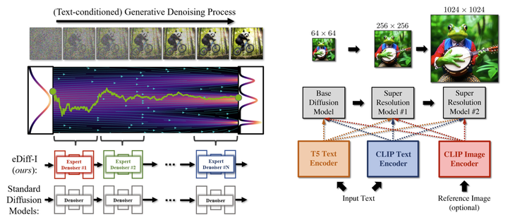

Impose Constant Light

# 论文信息：
controlnet作者

IC-Light 是一个控制图像照明的项目。

“IC-Light”这个名称代表“Impose Constant Light”（我们将在本页末尾简要描述这一点）。

目前，我们发布了两种类型的模型：文本条件重新光照模型和背景条件模型。两种类型都将前景图像作为输入。

Related Work

Also read ...

Total Relighting: Learning to Relight Portraits for Background Replacement

Relightful Harmonization: Lighting-aware Portrait Background Replacement

SwitchLight: Co-design of Physics-driven Architecture and Pre-training Framework for Human Portrait Relighting
About

型号注释 

iclight_sd15_fc.safetensors - 默认的重新照明模型，以文本和前景为条件。您可以使用初始潜伏来影响重新照明。

iclight_sd15_fcon.safetensors - 与“iclight_sd15_fc.safetensors”相同，但使用偏移噪声进行训练。请注意，在用户研究中，默认的“iclight_sd15_fc.safetensors”稍微优于此模型。这就是为什么默认模型是没有偏移噪声的模型的原因。    
Same as "iclight_sd15_fc.safetensors" but trained with offset noise. Note that the default "iclight_sd15_fc.safetensors" outperform this model slightly in a user study. And this is the reason why the default model is the model without offset noise.      
历史经验可以得到更纯的图片颜色

iclight_sd15_fbc.safetensors - 以文本、前景和背景为条件的重新照明模型。

[火]5.13更新   
Currently ComfyUI and Forge versions are available:     
● https://github.com/huchenlei/ComfyUI-IC-Light-Native   
● https://github.com/huchenlei/sd-forge-ic-light    
● https://github.com/kijai/ComfyUI-IC-Light   
I will work on A1111 extension soon.    

fbc比fc多一个图像输入通道，网络的输入输出部分不太一样

    File "/root/miniconda3/envs/comfy/lib/python3.11/site-packages/torch/nn/modules/conv.py", line 456, in _conv_forward
        return F.conv2d(input, weight, bias, self.stride,
            ^^^^^^^^^^^^^^^^^^^^^^^^^^^^^^^^^^^^^^^^^^
    RuntimeError: Given groups=1, weight of size [320, 8, 3, 3], expected input[8, 12, 96, 96] to have 8 channels, but got 12 channels instead

# 原理

换背景，换灯光方向（四个：上下左右）     
控制光照柔和与强烈程度，光种     

## Text-Conditioned Model   
输入：提供人物图片（会被自动提取未前景再输入模型），删去背景获取前景图

(Note that the "Lighting Preference" are just initial latents - eg., if the Lighting Preference is "Left" then initial latent is left white right black.)      

Prompt: beautiful woman, detailed face, warm atmosphere, at home, bedroom

Lighting Preference: Left

## Background-Conditioned Model     
输入：提供人物图片，纯背景图    

背景图可以flip     

来自“外观混合”和“光源混合”的两个图像是一致的（理想情况下，在 HDR 空间中数学上是等效的）。

在训练重新照明模型时，我们强加了这种一致性（在潜在空间中使用 MLP）。

因此，该模型能够产生高度一致的重新光照 -如此一致，甚至可以将不同的重新光照合并为法线贴图！尽管事实上这些模型是潜在扩散的。
As a result, the model is able to produce highly consistent relight - so consistent that different relightings can even be merged as normal maps! Despite the fact that the models are latent diffusion.

从扩散模型的角度实现打光，几十年前的技术复现

从左到右依次是输入、模型输出、重新照明、分割的阴影图像和合并的法线贴图。请注意，该模型未使用任何法线贴图数据进行训练。这个正常的估计来自于重新点亮的一致性。

## 施加一致的光
在 HDR 空间中，照明具有所有光传输都是独立的属性。     
illumination has a property that all light transports are independent.

因此，不同光源的外观混合相当于混合光源的外观：   
the blending of appearances of different light sources is equivalent to the appearance with mixed light sources:

# 代码

## 内部
算法流程：输入参考图 -> RMBG-1.4 前景提取 -> i2i -> i2i

打光方向原理
the "Lighting Preference" are just initial latents - eg., if the Lighting Preference is "Left" then initial latent is left white right black.

模型细节
we release two types of models: text-conditioned relighting model and background-conditioned model. Both types take foreground images as inputs.
作者给了两种unet模型，使用时分别融合到底模中
sd_merged = {k: sd_origin[k] + sd_offset[k] for k in sd_origin.keys()}
unet.load_state_dict(sd_merged, strict=True)
unet模型结构轻微修改

光方向初始latent 线性关系

    if bg_source == BGSource.NONE:
            pass
        elif bg_source == BGSource.LEFT:
            gradient = np.linspace(255, 0, image_width)
            image = np.tile(gradient, (image_height, 1))
            input_bg = np.stack((image,) * 3, axis=-1).astype(np.uint8)
        elif bg_source == BGSource.RIGHT:
            gradient = np.linspace(0, 255, image_width)
            image = np.tile(gradient, (image_height, 1))
            input_bg = np.stack((image,) * 3, axis=-1).astype(np.uint8)
        elif bg_source == BGSource.TOP:
            gradient = np.linspace(255, 0, image_height)[:, None]
            image = np.tile(gradient, (1, image_width))
            input_bg = np.stack((image,) * 3, axis=-1).astype(np.uint8)
        elif bg_source == BGSource.BOTTOM:
            gradient = np.linspace(0, 255, image_height)[:, None]
            image = np.tile(gradient, (1, image_width))
            input_bg = np.stack((image,) * 3, axis=-1).astype(np.uint8)
        else:
            raise 'Wrong initial latent!'

conds, unconds = encode_prompt_pair(positive_prompt=prompt + ', ' + a_prompt, negative_prompt=n_prompt)

    fg = resize_and_center_crop(input_fg, image_width, image_height)

    concat_conds = numpy2pytorch([fg]).to(device=vae.device, dtype=vae.dtype)
    concat_conds = vae.encode(concat_conds).latent_dist.mode() * vae.config.scaling_factor

第一阶段 i2i ：Lighting Preference latent 作为初始化 latent    
第二阶段 i2i ：根据Highres scale放大

第一阶段

    bg = resize_and_center_crop(input_bg, image_width, image_height)
    bg_latent = numpy2pytorch([bg]).to(device=vae.device, dtype=vae.dtype)
    bg_latent = vae.encode(bg_latent).latent_dist.mode() * vae.config.scaling_factor
    latents = i2i_pipe(
        image=bg_latent,
        strength=lowres_denoise,
        prompt_embeds=conds,
        negative_prompt_embeds=unconds,
        width=image_width,
        height=image_height,
        num_inference_steps=int(round(steps / lowres_denoise)),
        整个表达式的作用就是对 steps 除以 lowres_denoise 的结果进行四舍五入，返回最接近的整数值。
        num_images_per_prompt=num_samples,
        generator=rng,
        output_type='latent',
        guidance_scale=cfg,
        cross_attention_kwargs={'concat_conds': concat_conds},
        这个地方类似controlnet     
    ).images.to(vae.dtype) / vae.config.scaling_factor

    pixels = vae.decode(latents).sample
    pixels = pytorch2numpy(pixels)
    pixels = [resize_without_crop(
        image=p,
        target_width=int(round(image_width * highres_scale / 64.0) * 64),
        target_height=int(round(image_height * highres_scale / 64.0) * 64))
    for p in pixels]
    pixel空间进行图片放大，resize    

    pixels = numpy2pytorch(pixels).to(device=vae.device, dtype=vae.dtype)
    latents = vae.encode(pixels).latent_dist.mode() * vae.config.scaling_factor
    latents = latents.to(device=unet.device, dtype=unet.dtype)

    image_height, image_width = latents.shape[2] * 8, latents.shape[3] * 8 
    这个操作不明白      

    fg = resize_and_center_crop(input_fg, image_width, image_height)
    concat_conds = numpy2pytorch([fg]).to(device=vae.device, dtype=vae.dtype)
    concat_conds = vae.encode(concat_conds).latent_dist.mode() * vae.config.scaling_factor

    没有必要做两次

第二阶段

    latents = i2i_pipe(
        image=latents,
        strength=highres_denoise,
        prompt_embeds=conds,
        negative_prompt_embeds=unconds,
        width=image_width,
        height=image_height,
        num_inference_steps=int(round(steps / highres_denoise)),
        num_images_per_prompt=num_samples,
        generator=rng,
        output_type='latent',
        guidance_scale=cfg,
        cross_attention_kwargs={'concat_conds': concat_conds},
    ).images.to(vae.dtype) / vae.config.scaling_factor

    pixels = vae.decode(latents).sample

## gradio运行错误解决

### 第一个错误

    File "/root/miniconda3/envs/iclight/lib/python3.10/site-packages/torch/cuda/__init__.py", line 293, in _lazy_init
        torch._C._cuda_init()
    RuntimeError: The NVIDIA driver on your system is too old (found version 11040). Please update your GPU driver by downloading and installing a new version from the URL: http://www.nvidia.com/Download/index.aspx Alternatively, go to: https://pytorch.org to install a PyTorch version that has been compiled with your version of the CUDA driver.

pip install torch torchvision --index-url https://download.pytorch.org/whl/cu121    

torch                     2.3.0+cu121        
torchvision               0.18.0+cu121

不匹配        
nvcc 11.8         
nvidia-smi CUDA 11.4        

pip install torch==2.2.2 torchvision==0.17.2 torchaudio==2.2.2 --index-url https://download.pytorch.org/whl/cu118

降低torch版本可以了

### 第二次错误
推理时候。    
Segmentation fault (core dumped)     
应该是c++ c层面的错误，空指针，堆栈溢出,tensor问题等      

以前在jetson上使用c++程序也遇到过    

换机器重装

Nvidia-smi CUDA Version: 12.2     
Nvcc 11.8   
pip install torch torchvision --index-url https://download.pytorch.org/whl/cu121     
可以了   

## comfyui 运行

Chilloutmix-Ni-pruned-fp16-fix.safetensors底模     
生图很花     

Photon_v1_fp16.safetensors第一次下载中断续下，读取时header有问题

第二次完整下载

!!! Exception during processing!!! With local_files_only set to False, you must first locally save the configuration in the following path: 'openai/clip-vit-large-patch14'.

Photon_v1_fp16不含clip，需要调用 Chilloutmix-Ni-pruned-fp16-fix.safetensors 的 clip

生成质量较差

插件作者还在修改，打补丁      

# forge
## 报错
推理出现 Segmentation fault (core dumped)

并且这个平台不会返回具体错误信息     

卡在反向推理。中断

    torch                     2.2.2+cu118
    torchaudio                2.2.2+cu118
    torchdiffeq               0.2.3
    torchmetrics              1.4.0
    torchsde                  0.2.6
    torchvision               0.17.2+cu118

pip install torch torchvision --index-url https://download.pytorch.org/whl/cu121     

open-clip-torch 2.20.0 requires protobuf<4, but you have protobuf 4.25.3 which is incompatible.

ile "/teams/ai_model_1667305326/WujieAITeam/private/lujunda/newlytest/stable-diffusion-webui-forge/modules/launch_utils.py", line 431, in prepare_environment
    raise RuntimeError(
RuntimeError: Torch is not able to use GPU; add --skip-torch-cuda-test to COMMANDLINE_ARGS variable to disable this check

pip install -U open-clip-torch

Successfully installed open-clip-torch-2.24.0

还是启动不了launch 

    File "/teams/ai_model_1667305326/WujieAITeam/private/lujunda/newlytest/stable-diffusion-webui-forge/launch.py", line 39, in main
        prepare_environment()
    File "/teams/ai_model_1667305326/WujieAITeam/private/lujunda/newlytest/stable-diffusion-webui-forge/modules/launch_utils.py", line 431, in prepare_environment
        raise RuntimeError(
    RuntimeError: Torch is not able to use GPU; add --skip-torch-cuda-test to COMMANDLINE_ARGS variable to disable this check

File "/root/miniconda3/envs/iclight/lib/python3.10/site-packages/torch/cuda/__init__.py", line 293, in _lazy_init
    torch._C._cuda_init()
RuntimeError: The NVIDIA driver on your system is too old (found version 11040). Please update your GPU driver by downloading and installing a new version from the URL: http://www.nvidia.com/Download/index.aspx Alternatively, go to: https://pytorch.org to install a PyTorch version that has been compiled with your version of the CUDA driver.

nvcc 11.8     
CUDA Version: 11.4    

我给忘记2机是个问题机了            

始终是机子和CUDA和torch的傻逼问题

换机器直接launch一键成功

## 性能
forge闲时加载sd1.5显存2.5g   
     

## 权重
权重使用方式和正常的略有不同   
In order to load it with UnetLoader in Forge, state_dict keys need to convert to ldm format. You can download models with ldm keys here: https://huggingface.co/huchenlei/IC-Light-ldm/tree/main    
There are 2 models:   
● iclight_sd15_fc_unet_ldm: Use this in FG workflows   
● iclight_sd15_fbc_unet_ldm: Use this in BG workflows

## 特点
UNet Patcher    
Note that Forge does not use any other software as backend. The full name of the backend is Stable Diffusion WebUI with Forge backend, or for simplicity, the Forge backend. The API and python symbols are made similar to previous software only for reducing the learning cost of developers.

Now developing an extension is super simple. We finally have a patchable UNet.

Below is using one single file with 80 lines of codes to support FreeU:

extensions-builtin/sd_forge_freeu/scripts/forge_freeu.py

# 同类已有产品比较
Portrait Light on Google Pixel phones

    
     

# a1111插件编写
https://github.com/AUTOMATIC1111/stable-diffusion-webui/wiki/Developing-extensions     

## a1111 和 forge
forge根目录多两个文件夹     
ldm_patched和modules_forge   
模型加载可能略不同     
forge   

    from ldm_patched.modules.utils import load_torch_file
    from ldm_patched.modules.model_patcher import ModelPatcher
    from ldm_patched.modules.sd import VAE
a1111

    from modules import images, sd_samplers, processing, sd_models, sd_vae, sd_samplers_kdiffusion, errors
    from modules.processing import process_images, Processed, StableDiffusionProcessingTxt2Img
    from modules.shared import opts, state
    import modules.shared as shared
    import modules.sd_samplers
    import modules.sd_models
    import modules.sd_vae

Stable Diffusion WebUI Forge 是一个基于Stable Diffusion WebUI（基于Gradio）的平台，可简化开发、优化资源管理并加快推理速度。      
stable diffusion webui是基于gradio框架构建，gradio是一个开源的python库，它用于帮助科研与机器学习、深度学习工作者快速的演示应用，使用者仅需要几行代码，就可以快速构造一个简单、丰富的HTML界面，不需要有前端开发基础，仅需要python基础就行。    
https://github.com/gradio-app/gradio     

Forge 带来的另一个非常重要的变化是Unet Patcher。使用 Unet Patcher，Self-Attention Guidance、Kohya High Res Fix、FreeU、StyleAlign、Hypertile 等方法都可以在大约 100 行代码中实现。

这个在comfyui也有

感谢 Unet Patcher，许多新的东西现在都可以在 Forge 中实现并得到支持，包括 SVD、Z123、masked Ip-adapter、masked controlnet、photomaker 等。

无需再对 UNet 进行 Monkeypatch 并与其他扩展发生冲突！

Forge还添加了一些采样器，包括但不限于DDPM、DDPM Karras、DPM++ 2M Turbo、DPM++ 2M SDE Turbo、LCM Karras、Euler A Turbo等（LCM从1.7.0开始就已经在原始webui中）。

您可以看到 Forge 不会更改 WebUI 结果。安装 Forge 并不是一个重大改变。

即使对于最复杂的提示（例如fantasy landscape with a [mountain:lake:0.25] and [an oak:a christmas tree:0.75][ in foreground::0.6][ in background:0.25] [shoddy:masterful:0.5].

您之前的所有作品仍然可以在 Forge 中使用！

Forge backend removes all WebUI's codes related to resource management and reworked everything. All previous CMD flags like medvram, lowvram, medvram-sdxl, precision full, no half, no half vae, attention_xxx, upcast unet, ... are all REMOVED. Adding these flags will not cause error but they will not do anything now. We highly encourage Forge users to remove all cmd flags and let Forge to decide how to load models.

没有任何 cmd 标志，Forge 可以运行具有 4GB vram 的 SDXL 和具有 2GB vram 的 SD1.5。

再次强调，Forge 不建议用户使用任何 cmd 标志，除非您非常确定确实需要这些标志。

UNet Patcher

新功能（原始 WebUI 中没有的）    
感谢 Unet Patcher，许多新的东西现在都可以在 Forge 中实现并得到支持，包括 SVD、Z123、masked Ip-adapter、masked controlnet、photomaker 等。

然而，如果较新的扩展使用 Forge，它们的代码可能会短得多。

Usually if an old extension rework using Forge's unet patcher, 通常，如果使用 Forge 的unet patcher 对旧扩展进行返工，80% 的代码可以被删除，特别是当它们需要调用controlnet 时。

## 开发对比
comfyui 2023.1.17首次发布     

forge主页好像是两年发布      

但是forge复用了comfyui的代码，有些就是很像      

    # 1st edit by https://github.com/comfyanonymous/ComfyUI
    # 2nd edit by Forge Official

● https://github.com/huchenlei/sd-forge-ic-light   

● https://github.com/kijai/ComfyUI-IC-Light   

已经有作者的gradio     
插件已经有forge和comfyui    
comfyui甚至有两个版本了      

而且comfyui给的example还支持动图，动态修改light preference     
但是forge版本的就差一些，使用体验上还不如gradio。gradio还能选择多种example呢。     

forge和comfyui都有各自的模型patcher。用以节省内存加速？       
gradio基本都是用safetensor.loadfile和diffusers.from_pretrain     
forge大部分在复用gradio代码。因为本一家      

comfyui上没看见前景提取使用RMBG。有点奇怪      
其在使用上是直接将原图resize过vae encoder输入到fg节点    

● https://github.com/kijai/ComfyUI-IC-Light       
输入的包装

    for conditioning in [positive, negative]:
        c = []
        for t in conditioning:
            d = t[1].copy()
            d["concat_latent_image"] = concat_latent * multiplier
            n = [t[0], d]
            c.append(n)
        out.append(c)
    return (out[0], out[1], {"samples": out_latent})

实现方法      
实在是没看懂他的前景是怎么提取的，        
用了ip2p的方法？？？     

        #Patch ComfyUI's LoRA weight application to accept multi-channel inputs. Thanks @huchenlei
        try:
            ModelPatcher.calculate_weight = calculate_weight_adjust_channel(ModelPatcher.calculate_weight)
        except:
            raise Exception("IC-Light: Could not patch calculate_weight")
        # Mimic the existing IP2P class to enable extra_conds
        def bound_extra_conds(self, **kwargs):
                return ICLight.extra_conds(self, **kwargs)
        new_extra_conds = types.MethodType(bound_extra_conds, model_clone.model)
        model_clone.add_object_patch("extra_conds", new_extra_conds)

        return (model_clone, )

    import comfy
    class ICLight:
        def extra_conds(self, **kwargs):
            out = {}
            
            image = kwargs.get("concat_latent_image", None)
            noise = kwargs.get("noise", None)
            device = kwargs["device"]

            if image is None:
                image = torch.zeros_like(noise)

            if image.shape[1:] != noise.shape[1:]:
                image = comfy.utils.common_upscale(image.to(device), noise.shape[-1], noise.shape[-2], "bilinear", "center")

            image = comfy.utils.resize_to_batch_size(image, noise.shape[0])

            process_image_in = lambda image: image
            out['c_concat'] = comfy.conds.CONDNoiseShape(process_image_in(image))
            
            adm = self.encode_adm(**kwargs)
            if adm is not None:
                out['y'] = comfy.conds.CONDRegular(adm)
            return out

## comfyui插件huchenlei
https://github.com/huchenlei/ComfyUI-IC-Light-Native

[Important!] Required nodes     
You MUST install following nodes first for IC light to work properly.

ComfyUI-layerdiffuse: Although not used in the workflow, the patching of weight load in layerdiffuse is a dependency for IC-Light nodes to work properly.

Recommended nodes    

    ComfyUI-KJNodes: Provides various mask nodes to create light map.
    ComfyUI-Easy-Use: A giant node pack of everything. The remove bg node used in workflow comes from this pack.
    ComfyUI_essentials: Many useful tooling nodes. Image resize node used in the workflow comes from this pack.

这个插件倒是使用了RMBG      
原理应该和gradio差不多      

实现上看上去比上一个comfyui方法简洁

## a1111 webui 调试确定过程
webui.py设置了5秒间隔，用处是在程序运行时候每5秒监听一次服务器端的输入，5秒的时间段里面则在跑代码，如推理     
比较蠢的进去具体县城方法是，在跑的那5秒快速暂停，然后到进程那里点下一步。但是这样会每跳一步回到时间监听程序一次     

这样调试太慢了。    
每次只能积累到正好所停步的堆栈查看   

比如这次    
正好停到前向传播的unet的SpatialTransformer    

samples_ddim = p.sample(conditioning=p.c, unconditional_conditioning=p.uc, seeds=p.seeds, subseeds=p.subseeds, subseed_strength=p.subseed_strength, prompts=p.prompts)

具体来说还包装了很多东西。每一层实现一些功能。如cfg dpm++等   
sample_dpmpp_sde    
cfg_denoiser     
epsddpm_denoiser   
latentdiffusion     
diffusionwarpper     

p虽然只有4层包装。但不是进去每一个函数都解开。   

### forge实现 

    work_model: ModelPatcher = p.sd_model.forge_objects.unet.clone()
    它创建了一个名为 work_model 的变量，该变量被赋予了一个值，这个值是使用某种模型库（可能是 PyTorch 或 TensorFlow 等）中的 ModelPatcher 类的方法来创建的。在这个例子中，ModelPatcher 可能是一个用于修改或创建深度学习模型的工具类或函数。

    vae: VAE = p.sd_model.forge_objects.vae.clone()
    unet_path = os.path.join(models_path, "unet", args.model_type.model_name)
    ic_model_state_dict = load_torch_file(unet_path, device=device)
    node = ICLight()

    patched_unet: ModelPatcher = node.apply(
        model=work_model,
        ic_model_state_dict=ic_model_state_dict,
        c_concat=args.get_c_concat(input_rgb, vae, p, device=device),
    )[0]

    p.sd_model.forge_objects.unet = patched_unet

   

调试太方便了。不会跳来跳去

    

他与a1111的区别真的太小。不仅repo文件夹只是新增，而且所用的堆栈和变量内部，也只是新增。     
比如 forge_objects: 只是在原本基础上新增了 `forge_objects，unet_patcher, BaseModel`(这个来源于新增ldm模块的 module) 替换了diffusion_wrapper, 

可能得在wrapper这个地方换，然后调用apply方法    

虽然，这种重构还是很厉害的，前后，中间

这个debug实在太方便了     

samples_ddim = p.sample(conditioning=p.c, unconditional_conditioning=p.uc, seeds=p.seeds, subseeds=p.subseeds, subseed_strength=p.subseed_strength, prompts=p.prompts)    
启动运行

进入这里

module的process.py

    class StableDiffusionProcessingTxt2Img(StableDiffusionProcessing):

    def sample(self, conditioning, unconditional_conditioning, seeds, subseeds, subseed_strength, prompts):

        if self.scripts is not None:
                    self.scripts.process_before_every_sampling(self,
                                                            x=x,
                                                            noise=x,
                                                            c=conditioning,
                                                            uc=unconditional_conditioning)

      
插件加载

    samples = self.sampler.sample(self, x, conditioning, unconditional_conditioning, image_conditioning=self.txt2img_image_conditioning(x))

这个的好处还在于它是在主线程推理。

a1111则在主线程进行时间监听。

好像对于cn支持更好      
预先加载    

到这里之后基本是和a1111一致的

### a1111

UnetModel

a1111用来debug确实会在shared_state和推理代码之间跳来跳去   
最差劲的还会回跳回上次运行    
而且还需要打断点在内部才能自己跳进线程里面    

就是会在 main_tread 和 anyio_worker_thread 跳来跳去    

很严重的问题是会卡住很久     

把等待五秒改成0.05秒后连启动界面都很难    
感觉就是很卡很慢   

上百次点击都加载不出界面     

主要还是断点老师在监听位置跳，不会进去推理函数   
代码还没注释    

内部又分出小线程    

取消主线程的断点，只打分支线程断点，就可以在里面看了   

使用了treading包的 _bootstrap     

但是这样调试会卡住      

代码是能进去看但是总是很卡，麻烦，不能流畅de地一步步来  

不在等待时间那里打断点，就会生成一张图片后卡住   
并不是卡住，只是在等待网页端的命令，然后推理执行    
八个线程全都在等待     

执行过程可以点暂停进入查看    

这个时候可以正常运行断点进入一步步查看，这时候是正常使用的，主线程停住，然后程序里面一步步    

这是如果网页点暂停，是没有反应的，好像是因为等待5秒   

好像运行过程中采样的timesteps被转成了sigmas    
取值范围0-15    

所以ays在comfyui使用时候也是专门搞了一个sigmas输出的模块    
为什么要这样抽象化     

sigmas既作为模型输入，也用以在sampler中计算噪声   

    m_sigma_min, m_sigma_max = self.model_wrap.sigmas[0].item(), self.model_wrap.sigmas[-1].item()
    sigma_min, sigma_max = (0.1, 10) if opts.use_old_karras_scheduler_sigmas else (m_sigma_min, m_sigma_max)

运行一次推理后，暂停终于相应了，整个代码显示正运行，但没有堆栈信息    

有时还需要重新刷新界面，才能从网页端传输过服务器    

断点位置最好就打在等待函数前面。     
具体进入就按暂停     

## forge调试
进入网页端没那么麻烦。不需要监听时间就渲染出了界面     

通过调用tread.py的TASK类进行每个功能实现，如加载 推理    

    while True:
        time.sleep(0.01)
        if len(waiting_list) > 0:

监听时间太短      
需要将近十次才反应过来-进入函数：       

## forge插件代码修改过程 

    """ Convert diffusers weight to ldm weight. """

    import os
    import folder_paths
    import safetensors.torch

    from comfy.diffusers_convert import convert_unet_state_dict

    def convert_weight():
        src = "iclight_sd15_fbc.safetensors"
        dest = "iclight_sd15_fbc_unet_ldm.safetensors"

        ic_light_root = os.path.join(folder_paths.models_dir, "ic_light")
        model_path = os.path.join(ic_light_root, src)

        sd_dict = convert_unet_state_dict(safetensors.torch.load_file(model_path))
        sd_dict = {key: sd_dict[key].half() for key in sd_dict.keys()}
        safetensors.torch.save_file(sd_dict, dest)

所以cn作者开源的是diffusers类型的unet，也是从那里训练来的   
cn作者的gradio      
从diffusers.from_pretrain加载底模，直接去除里面的unet  

    unet = UNet2DConditionModel.from_pretrained(sd15_name, subfolder="unet")

    # Change UNet

    with torch.no_grad():
        new_conv_in = torch.nn.Conv2d(8, unet.conv_in.out_channels, unet.conv_in.kernel_size, unet.conv_in.stride, unet.conv_in.padding)
        new_conv_in.weight.zero_()
        new_conv_in.weight[:, :4, :, :].copy_(unet.conv_in.weight)
        new_conv_in.bias = unet.conv_in.bias
        unet.conv_in = new_conv_in

    unet_original_forward = unet.forward

    def hooked_unet_forward(sample, timestep, encoder_hidden_states, **kwargs):
        c_concat = kwargs['cross_attention_kwargs']['concat_conds'].to(sample)
        c_concat = torch.cat([c_concat] * (sample.shape[0] // c_concat.shape[0]), dim=0)
        new_sample = torch.cat([sample, c_concat], dim=1)
        kwargs['cross_attention_kwargs'] = {}
        return unet_original_forward(new_sample, timestep, encoder_hidden_states, **kwargs)

    unet.forward = hooked_unet_forward

    # Load

    model_path = '/teams/ai_model_1667305326/WujieAITeam/private/lujunda/newlytest/ComfyUI/models/unet/iclight_sd15_fc.safetensors'

    if not os.path.exists(model_path):
        download_url_to_file(url='https://huggingface.co/lllyasviel/ic-light/resolve/main/iclight_sd15_fc.safetensors', dst=model_path)

    sd_offset = sf.load_file(model_path)
    sd_origin = unet.state_dict()
    keys = sd_origin.keys()
    sd_merged = {k: sd_origin[k] + sd_offset[k] for k in sd_origin.keys()}
    unet.load_state_dict(sd_merged, strict=True)
    del sd_offset, sd_origin, sd_merged, keys

vae =      p.sd_model.p.sd_model.first_stage_model    
clip =     p.sd_model.cond_stage_model   
warpper_unet = p.sd_model.model   

关于DiffusionWrapper实现     
modules/models/diffusion/ddpm_edit.py    

    """
    wild mixture of
    https://github.com/lucidrains/denoising-diffusion-pytorch/blob/7706bdfc6f527f58d33f84b7b522e61e6e3164b3/denoising_diffusion_pytorch/denoising_diffusion_pytorch.py
    好像是老代码
    https://github.com/openai/improved-diffusion/blob/e94489283bb876ac1477d5dd7709bbbd2d9902ce/improved_diffusion/gaussian_diffusion.py
    DALLE2经典结构trick，超分 
    https://github.com/CompVis/taming-transformers
    高效transformers
    -- merci
    """

    # File modified by authors of InstructPix2Pix from original (https://github.com/CompVis/stable-diffusion).
    # See more details in LICENSE.

    import pytorch_lightning as pl

    class DiffusionWrapper(pl.LightningModule):
        def __init__(self, diff_model_config, conditioning_key):
            super().__init__()
            self.diffusion_model = instantiate_from_config(diff_model_config)
            self.conditioning_key = conditioning_key
            assert self.conditioning_key in [None, 'concat', 'crossattn', 'hybrid', 'adm']
        前两个就是sd经典模式，最后是unclip模式    
        下面已经写得很清楚了，主要是指定条件注入的一般性方法   

        def forward(self, x, t, c_concat: list = None, c_crossattn: list = None):
            if self.conditioning_key is None:
                out = self.diffusion_model(x, t)
            elif self.conditioning_key == 'concat':
                xc = torch.cat([x] + c_concat, dim=1)
                out = self.diffusion_model(xc, t)
            elif self.conditioning_key == 'crossattn':
                cc = torch.cat(c_crossattn, 1)
                out = self.diffusion_model(x, t, context=cc)
            elif self.conditioning_key == 'hybrid':
                xc = torch.cat([x] + c_concat, dim=1)
                cc = torch.cat(c_crossattn, 1)
                out = self.diffusion_model(xc, t, context=cc)
            elif self.conditioning_key == 'adm':
                cc = c_crossattn[0]
                out = self.diffusion_model(x, t, y=cc)
            else:
                raise NotImplementedError()

            return out

## forge_objects

    class ForgeSD:
        def __init__(self, unet, clip, vae, clipvision):
            self.unet = unet
            self.clip = clip
            self.vae = vae
            self.clipvision = clipvision

        def shallow_copy(self):
            return ForgeSD(
                self.unet,
                self.clip,
                self.vae,
                self.clipvision
            )

    forge_objects = load_checkpoint_guess_config(
        state_dict,
        output_vae=True,
        output_clip=True,
        output_clipvision=True,
        embedding_directory=cmd_opts.embeddings_dir,
        output_model=True
    )

好像是做了一些替换   
名字变了一下   
其他感觉没变？？？    
划分了一下    

    def load_checkpoint_guess_config(sd, output_vae=True, output_clip=True, output_clipvision=False, embedding_directory=None, output_model=True):
        sd_keys = sd.keys()
        clip = None
        clipvision = None
        vae = None
        model = None
        model_patcher = None
        clip_target = None

        parameters = ldm_patched.modules.utils.calculate_parameters(sd, "model.diffusion_model.")
        unet_dtype = model_management.unet_dtype(model_params=parameters)
        load_device = model_management.get_torch_device()
        manual_cast_dtype = model_management.unet_manual_cast(unet_dtype, load_device)

        class WeightsLoader(torch.nn.Module):
            pass

        model_config = model_detection.model_config_from_unet(sd, "model.diffusion_model.", unet_dtype)
        model_config.set_manual_cast(manual_cast_dtype)

        if model_config is None:
            raise RuntimeError("ERROR: Could not detect model type")

        if model_config.clip_vision_prefix is not None:
            if output_clipvision:
                clipvision = ldm_patched.modules.clip_vision.load_clipvision_from_sd(sd, model_config.clip_vision_prefix, True)

        if output_model:
            inital_load_device = model_management.unet_inital_load_device(parameters, unet_dtype)
            offload_device = model_management.unet_offload_device()
            model = model_config.get_model(sd, "model.diffusion_model.", device=inital_load_device)
            model.load_model_weights(sd, "model.diffusion_model.")

        if output_vae:
            vae_sd = ldm_patched.modules.utils.state_dict_prefix_replace(sd, {"first_stage_model.": ""}, filter_keys=True)
            vae_sd = model_config.process_vae_state_dict(vae_sd)
            vae = VAE(sd=vae_sd)

        if output_clip:
            w = WeightsLoader()
            clip_target = model_config.clip_target()
            if clip_target is not None:
                clip = CLIP(clip_target, embedding_directory=embedding_directory)
                w.cond_stage_model = clip.cond_stage_model
                sd = model_config.process_clip_state_dict(sd)
                load_model_weights(w, sd)

        left_over = sd.keys()
        if len(left_over) > 0:
            print("left over keys:", left_over)

        if output_model:
            model_patcher = UnetPatcher(model, load_device=load_device, offload_device=model_management.unet_offload_device(), current_device=inital_load_device)
            if inital_load_device != torch.device("cpu"):
                print("loaded straight to GPU")
                model_management.load_model_gpu(model_patcher)

        return ForgeSD(model_patcher, clip, vae, clipvision)

## a1111 webui架构

# 其他

## webui组件
GfpGAN, 这个是腾讯推出的一款基于生成对抗网络模型的用于人脸修复的优秀组件

pyngrok, ngrok的python封装库，用于网络通信，可以实现内网穿透    
系统核心功能组件安装，如果已下载，会忽略下载和安装。里面主要涉及到的核心组件有：   
2、taming transformers, 一套用于高分辨率图像合成的Transformer   
3、k-diffusion, 可以理解它是各种扩散模型的包装器   
4、CodeFormer，一套很棒的图像修复，视频去码的Python工具库   

## SD.Next
SD.Next: Advanced Implementation of Stable Diffusion and other Diffusion-based generative image models

制作人员   
主要归功于Automatic1111 WebUI 的原始代码库   
额外学分列于学分中   
模块的许可证在许可证中列出   

https://github.com/vladmandic/automatic

https://github.com/vladmandic/automatic/wiki/Diffusers

SD.Next supports two main backends: Diffusers and Original:

Diffusers: Based on new Huggingface Diffusers implementation   
Supports all models listed below  
This backend is set as default for new installations  
See wiki article for more information  

Original: Based on [LDM](https://github.com/Stability-AI/stablediffusion) reference implementation and significantly expanded on by A1111   
This backend and is fully compatible with most existing functionality and extensions written for A1111 SDWebUI
Supports SD 1.x and SD 2.x models   
All other model types such as SD-XL, LCM, PixArt, Segmind, Kandinsky, etc. require backend Diffusers

## controlnet作者
https://github.com/lllyasviel

张吕敏（LyuminZhang）是一名博士。自2022年起，他在斯坦福大学Maneesh Agrawala教授的指导下攻读计算机科学专业。在此之前，他自2021年起在香港中文大学黄天进教授实验室担任研究助理。他还与教授合作埃德加·西莫-塞拉 (Edgar Simo-Serra)参与了许多有趣的项目。他获得了工程学学士学位。 2021年于苏州大学获得博士学位，导师为季毅教授和 刘春平教授。

闲暇时，吕敏喜欢开发游戏。 Lvmin 是一款名为 YGOPro2 的 Unity 卡牌游戏的作者。如果你在Google或YouTube上搜索这个游戏，你会发现它很受欢迎。该游戏已被翻译成多种语言，在世界各地拥有粉丝。

### PaintingLight

Generating Digital Painting Lighting Effects via RGB-space Geometry (SIGGRAPH2020/TOG2020)

ACM Transactions on Graphics (Presented in ACM SIGGRAPH 2020), January 2020

Lvmin Zhang, Edgar Simo-Serra, Yi Ji, and Chunping Liu

打光方向另一种实现     

ic-light最大的特色是光种，光方向的多样性，充分体现扩散模型的特点，control的特色      
controlnet也可以简单实现打光方向     

旨在寻找一种操纵数字绘画中的照明的方法。该项目于2019年1月左右启动，核心算法于2020年被ACM Transitions on Graphics接受。

由于数字绘画光照数据不易获得，因此该算法没有使用深度学习。核心思想是利用颜色几何来构建一个感知上可行的重新照明系统。这种重新照明可能在物理上不准确，但对于艺术用例来说已经足够好了。     
Because digital painting illumination data is not easy to obtain, this algorithm does not use deep learning. The core idea is to make use of `color geometry to build up a perceptually workable relighting system`. Such relighting may not be physically accurate, but are good enough for artistic use cases.     

Q: It is mentioned that this project does not using 
   deep learning, then why it is still required to install tensorflow?

A: This is because we use SRCNN, a tensorflow neural network, to 
   pre-process input images in order to remove JPEG artifacts. Therefore 
   you still need to install tensorflow with a proper version.

我们提出了一种从单个图像生成数字绘画照明效果的算法。我们的算法基于一个关键的观察：艺术家使用许多重叠的笔画来绘制照明效果，即具有密集笔画历史的像素往往会收集更多的照明笔画。基于这一观察，我们设计了一种算法，既可以使用颜色几何来估计数字绘画中的笔画密度，然后通过模仿艺术家从粗到细的工作流程来生成新颖的灯光效果。首先使用波形变换生成粗略的灯光效果，然后根据原始插图的笔划密度修饰为可用的灯光效果。
我们的算法是内容感知的，生成的灯光效果自然适应图像结构，并且可以用作交互式工具来简化当前为数字和哑光绘画生成灯光效果的劳动密集型工作流程。此外，我们的算法还可以为照片或 3D 渲染图像生成可用的灯光效果。我们通过深入的定性和定量分析（包括感知用户研究）来评估我们的方法。结果表明，我们提出的方法不仅能够相对于现有方法产生良好的照明效果，而且还能够显着减少所需的交互时间。

### Stable Diffusion WebUI Forge

Stable Diffusion WebUI Forge 是一个基于Stable Diffusion WebUI（基于Gradio）的平台，可简化开发、优化资源管理并加快推理速度。

“Forge”这个名字的灵感来自于“Minecraft Forge”。该项目旨在成为 SD WebUI 的 Forge。

与原始 WebUI（针对 1024 像素的 SDXL 推理）相比，您可以期待以下加速：

如果您使用常见的 GPU（如 8GB vram），您可以预期推理速度（it/s）会提高约30~45%，GPU 内存峰值（在任务管理器中）将下降约 700MB 至 1.3GB，最大扩散分辨率（不会 OOM）将增加约 2 倍到 3 倍，最大扩散批量大小（不会 OOM）将增加约 4 倍到 6 倍。

如果您使用功能较弱的 GPU（例如 6GB vram），则预计推理速度（it/s）将提高约 60~75%，GPU 内存峰值（在任务管理器中）将下降约 800MB 至 1.5GB（最大）扩散分辨率（不会 OOM）将增加约 3 倍，最大扩散批量大小（不会 OOM）将增加约 4 倍。

如果您使用像 4090 这样具有 24GB vram 的强大 GPU，您可以预期推理速度 (it/s) 会提高约3~6%，GPU 内存峰值（在任务管理器中）将下降约 1GB 至 1.4GB，最大扩散分辨率（不会 OOM）将增加约 1.6 倍，最大扩散批量大小（不会 OOM）将增加约 2 倍。

如果使用 ControlNet for SDXL，最大 ControlNet 数量（不会 OOM）将增加约 2 倍，使用 SDXL+ControlNet 的速度将加快约 30~45%。

Forge 带来的另一个非常重要的变化是Unet Patcher。使用 Unet Patcher，Self-Attention Guidance、Kohya High Res Fix、FreeU、StyleAlign、Hypertile 等方法都可以在大约 100 行代码中实现。

多亏了 Unet Patcher，许多新的东西现在都可以在 Forge 中实现并得到支持，包括 SVD、Z123、masked Ip-adapter、masked controlnet、photomaker 等。

无需再对 UNet 进行 Monkeypatch 并与其他扩展发生冲突！

Forge 还添加了一些采样器，包括但不限于 DDPM、DDPM Karras、DPM++ 2M Turbo、DPM++ 2M SDE Turbo、LCM Karras、Euler A Turbo 等（LCM 从 1.7.0 开始就已经在原始 webui 中）。

最后，Forge 承诺我们只会做好我们的工作。 Forge 永远不会对用户界面添加不必要的主观更改。您仍在使用 100% 自动 1111 WebUI。

### Style2Paints
sketch + style = paints 🎨 (TOG2018/SIGGRAPH2018ASIA)

非扩散模型    

    2022.08.15 - Lvmin's article is accepted to SIGGRAPH ASIA 2022, journal track.
    2022.06.15 - See some recent announcements of Style2Paints (Project SEPA) here.
    2022.01.09 - See some recent announcements of Style2Paints (Project SEPA) here.
    2021.06.09 - An article on shadow drawing is accepted to ICCV 2021 as Oral.
    2021.06.01 - The Project SEPA is decided to be released before 2022.
    2021.03.22 - The next version of Style2Paints will be called Project SEPA. See also the twitter post.

Help human in their standard coloring workflow!
Most human artists are familiar with this workflow:

sketching -> color filling/flattening -> gradients/details adding -> shading
And the corresponding layers are:

lineart layers + flat color layers + gradient layers + shading layers
Style2paints V4 is designed for this standard coloring workflow! In style2paints V4, you can automatically get separated results from each step!

### fooocus

https://github.com/lllyasviel/Fooocus

About    
Focus on prompting and generating

Fooocus is an image generating software (based on Gradio).

Fooocus is a rethinking of Stable Diffusion and Midjourney’s designs:

Learned from Stable Diffusion, the software is offline, open source, and free.

Learned from Midjourney, the manual tweaking is not needed, and users only need to focus on the prompts and images.

## Swarm UI
alternate comfyui

https://github.com/Stability-AI/StableSwarmUI

StableSwarmUI, A Modular Stable Diffusion Web-User-Interface, with an emphasis on making powertools easily accessible, high performance, and extensibility.

## 早期研究也能控制打光。而且数据集完善

### Acquiring the Reflectance Field of a Human Face
https://www.pauldebevec.com/Research/LS/

https://www.pauldebevec.com/Research/LS/debevec-siggraph2000-high.pdf

获取人脸反射场    
Paul Debevec、Tim Hawkins、Chris Tchou、Haarm-Pieter Duiker、Westley Sarokin 和Mark Sagar      
SIGGRAPH 2000 会议论文集

2004 年 4 月 10 日

摘要：

我们提出了一种获取人脸反射场的方法，并使用这些测量结果在光照和视点的任意变化下渲染人脸。我们首先使用光台在入射照明方向的密集采样下从一小组视点获取面部图像。然后，我们根据照明方向空间上的每个观察到的图像像素的值构建反射函数图像。根据反射率函数，我们可以以任何形式的采样或计算照明从原始视点直接生成面部图像。为了改变视点，我们使用皮肤反射率模型来估计新视点的反射率函数的外观。我们通过在新颖的照明和视点下合成人脸的渲染来演示该技术。

### GeoWizard
GeoWizard: Unleashing the Diffusion Priors for 3D Geometry Estimation from a Single Image    

[Submitted on 18 Mar 2024]     
GeoWizard: Unleashing the Diffusion Priors for 3D Geometry Estimation from a Single Image     

https://github.com/fuxiao0719/GeoWizard

我们引入了 GeoWizard，一种新的生成基础模型，旨在从单个图像估计几何属性，例如深度和法线。尽管该领域已经进行了大量研究，但由于公开数据集的多样性低和质量差，进展受到很大限制。因此，先前的工作要么受限于有限的场景，要么无法捕捉几何细节。在本文中，我们证明生成模型与传统判别模型（例如 CNN 和 Transformer）相反，可以有效解决固有的不适定问题。我们进一步表明，利用扩散先验可以显着提高泛化能力、细节保留和资源使用效率。具体来说，我们扩展了原始的稳定扩散模型来联合预测深度和法线，从而允许两种表示之间的相互信息交换和高度一致性。更重要的是，我们提出了一种简单而有效的策略，将各种场景的复杂数据分布分离成不同的子分布。这种策略使我们的模型能够识别不同的场景布局，以卓越的保真度捕获 3D 几何图形。 GeoWizard 为零镜头深度和法线预测设定了新的基准，显着增强了许多下游应用，例如 3D 重建、2D 内容创建和新颖的视点合成。     

在微调过程中，GeoWizard 将图像、GT 深度和 GT 法线通过冻结的 VAE 编码到潜在空间中，并形成两个串联的几何组。每个组都被输入 U-Net，在几何切换器的指导下生成深度或正常域的输出。此外，还引入了场景提示，以使用三种可能的场景布局（室内/室外/物体）之一生成结果。在推理过程中，给定图像、场景提示、初始深度噪声和法线噪声，GeoWizard 可以联合生成高质量的深度和法线。

### switchlight
https://arxiv.org/pdf/2402.18848

### Total Relighting:
Learning to Relight Portraits for Background Replacement   
https://augmentedperception.github.io/total_relighting/   
SIGGRAPH 2021 技术视频

    
老方法效果已经很好     
包括现在腾讯会议的换背景，就是有时候有点抖。ic-light主打的打光甚至都不能算新颖技术    
可能是对于limit的优化吧      

我们提出了一种用于人像重新照明和背景替换的新颖系统，该系统可保持高频边界细节并准确合成新颖照明下的主体外观，从而为任何所需场景生成逼真的合成图像。我们的技术包括通过 Alpha 抠图、重新照明和合成进行前景估计。我们证明，这些阶段中的每一个都可以在顺序管道中处理，无需使用先验（例如已知背景或已知照明），也无需专门的采集技术，仅使用单个 RGB 肖像图像和新颖的目标 HDR 照明环境作为输入。我们使用在光级计算照明系统中捕获的对象的重照肖像来训练我们的模型，该系统记录了多种照明条件、高质量的几何形状和准确的 alpha 遮罩。为了执行逼真的重新照明以进行合成，我们在深度学习框架中引入了一种新颖的每像素照明表示，它明确地模拟了外观的漫反射和镜面反射分量，生成具有令人信服的渲染非朗伯效果（如镜面高光）的重新照明肖像。多次实验和比较表明了所提出的方法应用于野外图像时的有效性。

### Relightful Harmonization
[Submitted on 11 Dec 2023 (v1), last revised 7 Apr 2024 (this version, v2)]      
Relightful Harmonization: Lighting-aware Portrait Background Replacement

肖像协调旨在将拍摄对象合成到新的背景中，调整其灯光和颜色以确保与背景场景的和谐。现有的协调技术通常只专注于调整前景的全局颜色和亮度，而忽略了背景中的关键照明线索，例如明显的照明方向，从而导致不切实际的构图。我们推出 Relightful Harmonization，这是一种照明感知扩散模型，旨在使用任何背景图像无缝协调前景肖像的复杂照明效果。我们的方法分三个阶段展开。首先，我们引入一个照明表示模块，该模块允许我们的扩散模型对来自目标图像背景的照明信息进行编码。其次，我们引入了一个对齐网络，它将从图像背景中学习到的照明特征与从全景环境地图中学习到的照明特征对齐，这是场景照明的完整表示。最后，为了进一步提高所提出方法的真实感，我们引入了一种新颖的数据模拟管道，该管道可以从各种自然图像中生成合成训练对，用于细化模型。我们的方法在视觉保真度和照明连贯性方面优于现有基准，在现实测试场景中表现出卓越的泛化能力，突出了其多功能性和实用性。

## Photon (sd1.5底模)
Photon aims to generate photorealistic and visually appealing images effortlessly.

Recommendation for generating the first image with Photon:

Prompt: A simple sentence in natural language describing the image.

Negative: "cartoon, painting, illustration, (worst quality, low quality, normal quality:2)"

Sampler: DPM++ 2M Karras | Steps: 20 | CFG Scale: 6

Size: 512x768 or 768x512

Hires.fix: R-ESRGAN 4x+ | Steps: 10 | Denoising: 0.45 | Upscale x 2

(avoid using negative embeddings unless absolutely necessary)

### development
The development process was somewhat chaotic but essentially:

It started from an old mix.

LORAs were trained on various topics using AI-generated photorealistic images.

These LORAs were mixed within the model using different weights.

In the midst of this mixing, hand generation broke.

LORAs were generated and remixed in an attempt to fix hand generation (not entirely successful).

### limit
In future versions, I will try to:

Completely eliminate the need for a negative prompt to generate high-quality images.

Fix the hand generation issue to minimize instances of poorly drawn hands.

Explore more automated training processes. I would love to have 5,000 or 50,000 high-quality AI-generated photorealistic images for training purposes.

## mask获取
comfyui sam mask     

## 前景提取工具 briaai/RMBG-1.4 

BRIA Background Removal v1.4 

MBG v1.4 是我们最先进的背景去除模型，旨在有效地将各种类别和图像类型的前景与背景分开。该模型已经在精心挑选的数据集上进行了训练，其中包括：一般库存图像、电子商务、游戏和广告内容，使其适合支持大规模企业内容创建的商业用例。其准确性、效率和多功能性可与目前领先的可用源模型相媲美。当内容安全、合法许可的数据集和偏见缓解至关重要时，它是理想的选择。

Bria-RMBG 模型使用超过 12,000 张高质量、高分辨率、手动标记（像素精度）、完全许可的图像进行训练。我们的基准包括平衡的性别、平衡的种族和不同类型的残疾人。

图片分布：

类别	分配
仅对象	45.11%
有物体/动物的人	25.24%
仅限人	17.35%
带有文字的人/物体/动物	8.52%
纯文本	2.52%
仅限动物	1.89%

类别	分配
逼真	87.70%
非真实感	12.30%

类别	分配
非纯色背景	52.05%
纯色背景	47.95%

类别	分配
单个主要前景对象	51.42%
前景中有多个对象	48.58%

Architecture

RMBG v1.4 is developed on the IS-Net enhanced with our unique training scheme and proprietary dataset. These modifications significantly improve the model’s accuracy and effectiveness in diverse image-processing scenarios.

RMBG v1.4 是在IS-Net上开发的，并通过我们独特的训练方案和专有数据集进行了增强。这些修改显着提高了模型在不同图像处理场景中的准确性和有效性。

### Dichotomous Image Segmentation (DIS)
https://github.com/xuebinqin/DIS

这是我们新项目高精度二分图像分割的存储库

高精度二分图像分割（ECCV 2022）    
秦学斌、戴航、胡晓斌、范邓平*、邵凌、Luc Van Gool。

我们之前的作品：U 2 -Net，BASNet。

## GLIDE

GLIDE

GLIDE[1] 是 OpenAI 在 2021 年底推出的文本引导图像生成的扩散模型。GLIDE 沿用了 ADM[2] 架构，但是更大，有 2.3 billion 参数。

GLIDE 沿用了 ADM[2] 架构，但是更大，有 2.3 billion 参数。为了向其中注入文本条件，作者首先将输入文本通过 BPE tokenizer 编码成了 个 tokens，然后经由一个有 1.2 billion 参数的 Transformer 得到 个 token embeddings，它们被融入了 UNet 的每一个 Attention Block 之中（如下图所示）；另外，取最后一个 token embedding 经过维度映射后与 time embedding 相加，融入 UNet 的每一个 ResBlock 之中，相当于替换了 ADM 中的 class embedding. 

简而言之，除了使用 AdaGN，GLIDE 还在每个注意力层融入了文本条件。另外，上述 3.5 billion 参数（2.3+1.2=3.5）的模型只生成 64x64 图像，作者还构建了另一个类似的、有 1.5 billion 参数的模型把图像上采样至 256x256.

关于文本引导，作者尝试了两种方法——CLIP guidance 和 classifier-free guidance，实验发现后者效果更好。

## unclip
2022.3

虽然有了 GLIDE，但 OpenAI 还不满足，四个月后又推出了另一个文本引导图像生成模型 unCLIP[3]，也称作 DALL·E 2.

DALL·E 2 是一个 two-stage 模型：首先使用一个 prior 从 text embedding 生成对应的 image embedding；然后使用一个 decoder 根据 image embedding 生成图像，如下图虚线以下部分所示：

下面我们分别就 prior 和 decoder 做进一步的说明。

Decoder

Decoder 是一个以 CLIP image embedding 为条件的扩散模型，其融入条件的方式是在 GLIDE 的基础上修改而来：

这里是讲训练过程。非推理

    将 image embedding 投影后与 time embedding 相加；
    将 image embedding 投影为四个额外的 tokens，concatenate 到 GLIDE text encoder 的输出序列之后。作者保留了 GLIDE 的 text conditioning pathway，希望能为模型带来 CLIP 不具备的性质（如 variable binding），但实验发现这并没有发挥作用。

另外，作者也采取了 classifier-free guidance，在训练时以 10% 的概率将 image embedding 置零（或置为一个可学习的 embedding），并以 50% 的概率丢弃 text caption.

为了生成高分辨率图像，作者还用了两个上采样扩散模型，64x64 → 256x256 → 1024x1024. 同 SR3[4] 和 CDM[5] 一样，作者先将低分辨率图略微退化后再给到超分模型。具体而言，作者对第一个上采样阶段使用高斯模糊，对第二个上采样阶段使用更多样的 BSR 退化。值得注意的是，这两个超分模型只用了纯卷积而没用 attention layers，所以训练时可以只对 1/4 大小的 random crops 训练来减小计算量并保证数值稳定性，推断时改用完整大小。

意义？？

由于 decoder 可以看作是从 image embedding 得到图像，和 CLIP 从图像得到 image embedding 正好是相反的过程，所以作者将整个文生图模型命名为 unCLIP.

不太敢确定这个的训练方式。把原图输入？？？      

Prior

用户输入文本（text caption）后，我们可以通过 pretrained CLIP 得到 text embedding，但是由于 decoder 的输入是 image embedding，所以我们需要训练一个 prior 模型从 text embedding 预测 image embedding.
作者尝试了两种方案：

    自回归模型：将 image embedding 转换为一列离散编码，然后用自回归的方式逐个预测；
    扩散模型：以 text embedding 为条件，用扩散模型对 image embedding 建模。

实验发现使用扩散模型效果更佳。关于如何融入条件的具体细节有亿些繁琐，感兴趣的读者直接看论文吧。

一个自然的问题是，prior 是否是必要的？我们为什么不直接把 CLIP text embedding、甚至是 text caption 给到 decoder 做生成呢？其实这样做也没毛病，不过作者做了一个 ablation study，发现用 prior 来预测 image embedding 效果更好。

好像有后人评价过会确实一些复杂逻辑语义     

操作manipulations 

最后，作者也发现 DALL·E 2 的一些问题，比如在物体-属性的对应关系上往往不如 GLIDE. 例如，输入文本为“一个红色方块在一个蓝色方块之上”，DALL·E 2 生成的结果不是把位置搞错，就是把颜色搞错，但 GLIDE 就靠谱很多。作者推测这与 CLIP embedding 本身没有显式地绑定物体与属性有关。

## Stable unCLIP 2.1
2023.3

分辨率为768x768，基于SD2.1-768。

这个模型允许图像变化，以及混合操作。

由于其模块化，可以与其他模型，如KARLO，进行结合。这里面有两个变体：Stable unCLIP-L和Stable unCLIP-H，它们分别以CLIP ViT-L和ViT-H图像嵌入为条件。

## StableStudio
自从Stable Diffusion发布以来，DreamStudio就是StabilityAI最主要的应用，用来展示最新的模型和功能。     
追溯起DreamStudio的起源，它最初是Disco Diffusion下的一个动画工作室。随着去年夏天Stable Diffusion的发布，Disco Diffusion的重点也从动画转到了图像生成。    

## Imagen
https://www.assemblyai.com/blog/how-imagen-actually-works/    

2022.5

看到 OpenAI 又是 GLIDE 又是 DALL·E 2 的，Google 这边终于坐不住了，推出了更强的文本生成图像大模型——Imagen    

现在已经有image fx和 veo

相比 DALL·E 2，Imagen 的整体思路更简单一些：先用一个大语言模型将输入文本编码为 text embedding，然后以此为条件并利用 classifier-free guidance 指导一个扩散模型生成 64x64 大小的图像，随后用两个上采样扩散模型（也加入了文本条件并使用了 classifier-free guidance）将图像上采样至 256x256 和 1024x1024，如下图所示：

Pretrained text encoders

与 GLIDE 不同的是，Imagen 采用预训练好且固定不动的文本编码器而非从头训练。常见的 LLM，包括 BERT、CLIP、T5 都是可行的选择，作者发现 T5 效果最佳。有趣的是，作者发现扩大 text encoder 的规模比扩大 image diffusion model 的规模显著更有效。

Cascaded diffusion models

同 SR3、CDM、DALL·E 2 等一样，Imagen 作者也发现对超分模型而言，将低分辨率图像做一定的增强（高斯噪声）后作为超分模型的条件，能让模型更鲁棒。

Network architecture

对于第一个扩散模型，作者除了将 text embedding 与 time embedding 相加来融入条件，还采用了 cross attention.

对于两个上采样扩散模型，作者提出了更简单、收敛更快、更 memory efficient 的 Efficient U-Net. 相比常用的 U-Net，Efficient U-Net 做了如下改变：

与 DALL·E 2 类似，第二个超分模型是在 image crops 上训练的，因此没有使用 self-attention layers，但是保留了 text cross-attention layers. 更多细节可以在论文的 Appendix F 中找到。

以上就是 Imagen 的基本内容，更多细节请参阅原论文。事实上，作者还在论文中还提出了 DrawBench 评测指标，这里按下不表。

## eDiff-I
在 OpenAI 和 Google 打得有来有回之际，NVIDIA 终于也参与了进来，推出了 eDiff-I. 

通过分析文生图模型的去噪过程，作者发现：在去噪前期，模型非常依赖于文本条件来生成符合描述的图像；而在去噪后期，模型会几乎忽略文本，关注于生成高质量图像。

tgate以及社区的技巧    

因此，现有的方法在不同去噪阶段都使用同一个 UNet 模型也许并不好（尽管 time embedding 指示了去噪时间步）。于是，eDiff-I 对不同去噪阶段采用了多个专家去噪模型。

英伟达这两年好像都在关注效率的事情，在加速上做工作，分析去噪加噪过程，没有特别高质量生成的模型     
如ays，tensorrt     
包括微软，都在研究一些基建架构加速，cnn层间高效通信什么的，结果是没有什么大突破

MoE

为了训练效率的考虑，作者先只训练一个模型，然后逐渐将其分解为各个阶段的专家模型。值得注意的是，尽管模型多了，但推理时间还是不变的。   
包括现在的分阶段lora也是这种思想     
那么训练是不是麻烦，加载模型多，转换又需要时间    

另外，作者还研究了不同条件的作用，包括 T5 text embedding、CLIP text embedding 和 CLIP image embedding. 其中，CLIP image embedding 可以用来迁移参考图像的风格。最后，作者还展示了 “paint-with-words” 功能，即在画布上标注区域和文字，那么模型能在指定区域上依照对应文字作图。

现在老喜欢画这个噪声流，至今没看懂    
意思是正常高斯噪声采样出各种高斯组合吗？？？    

如图所示，eDiff-I 由一个基础模型和两个超分模型构成，这一点与 Imagen 完全一致。每个分辨率下的模型都由多个专家模型组成。

多个text_encoder的方法也早期就流行起来了啊。应该都有论文分析的。     

这种还是取决于公司水平，才能支撑员工去关注什么。

由于文本并不好描述物体的位置，作者提出了 “paint-with-words” 技术，通过指定区域和对应文本来控制位置。这个方法并不需要训练，主要思路是修改 attention map，这其实与很多图像编辑工作（如 Prompt-to-Prompt）的做法相同，具体如下图所示：

## DeepFloyd IF
DeepFloyd IF 是 DeepFloyd Lab 和 StabilityAI 开源的文生图大模型，整体沿用 Imagen 的技术路线，可以看作是 Imagen 的开源版本。因此本身没有什么值得多说的。

DeepFloyd IF是一款像素级AI文生图扩散模型。该模型解决了准确绘制文字、准确理解空间关系等AI文生图难题，支持非商业、研究用途。

可以看到确实与 Imagen 是差不多的，不过 DeepFloyd IF 在每个阶段都有不同大小的模型可以选择。

编辑于 2023-11-09 20:54

### 模型list

图生图与图像恢复
xyfJASON：扩散模型应用·图生图与图像恢复45 赞同 · 1 评论文章

    SR3
    SDEdit
    ILVR
    Palette
    RePaint
    DDRM
    DDIB
    DDNM

文生图大模型
xyfJASON：扩散模型应用·文生图大模型5 赞同 · 0 评论文章

    GLIDE
    DALL·E 2 (unCLIP)
    Imagen
    Stable Diffusion
    eDiff-I
    RAPHAEL
    DeepFloyd IF
    DALL·E 3

基于文本的图像编辑
xyfJASON：扩散模型应用·基于文本的图像编辑23 赞同 · 3 评论文章

    DiffusionCLIP
    Blended Diffusion
    SDG (Semantic Diffusion Guidance)
    Prompt-to-Prompt
    DiffuseIT
    Imagic
    DiffEdit
    Null-text Inversion
    InstructPix2Pix
    Pix2pix-zero

寻找语义空间

    Diffusion Autoencoders
    Asyrp

个性化生成
xyfJASON：扩散模型应用·个性化生成8 赞同 · 0 评论文章

    Textual Inversion
    DreamBooth
    DreamBooth + LoRA
    Custom Diffusion
    SuTI
    HyperDreamBooth

可控生成

    ControlNet
    T2I-Adapter
    Mixture of Diffusers
    MultiDiffusion
    Composer

## Daemon线程 JVM

什么是Daemon线程

Daemon线程也是守护线程，它是一种支持型的线程，主要用在程序的后台调度以及一些支持性（服务性）的工作，常见的例子：JVM中垃圾回收线程就是典型的守护线程

二、守护线程和用户线程的区别

守护线程与用户线程的区别发生在JVM的离开：

    可以说JVM想要运行，用户线程也必须运行
    守护线程是服务于用户线程的，如果用户线程不在了，那么守护线程的存在是没有意义的，此时该程序（进程）就没有运行的必要了，JVM也就退出了
    守护线程的优先级是低于用户线程的

JVM是Java Virtual Machine(Java虚拟机)的缩写，JVM是一种用于计算设备的规范，它是一个虚构出来的计算机，是通过在实际的计算机上仿真模拟各种计算机功能来实现的。

Java语言的一个非常重要的特点就是与平台的无关性。而使用Java虚拟机是实现这一特点的关键。一般的高级语言如果要在不同的平台上运行，至少需要编译成不同的目标代码。而引入Java语言虚拟机后，Java语言在不同平台上运行时不需要重新编译。Java语言使用Java虚拟机屏蔽了与具体平台相关的信息，使得Java语言编译程序只需生成在Java虚拟机上运行的目标代码(字节码)，就可以在多种平台上不加修改地运行。Java虚拟机在执行字节码时，把字节码解释成具体平台上的机器指令执行。这就是Java的能够"一次编译，到处运行"的原因。

# 结尾