MoMA: Multimodal LLM Adapter for Fast Personalized Image Generation     
MoMA：用于快速生成个性化图像的多模态 LLM 适配器    

即插即用适配器    
我们的模型是一个通用适配器，因为我们在训练阶段冻结了原始扩散模型。它可以推广到从同一基本模型微调的自定义模型检查点。在下图中，我们在 HuggingFace 和 CivitAi 的社区模型上验证了这一点，包括 Realistic Vision V4.0、ReV-Animated、Anything v4 和 Esthetic Retro Anime。这些模型都是从 `SD v1.5` 开始进行微调的。 MoMA可以直接应用于这些社区模型，无需任何修改。      

和ipadapter对比     
和直接修改背景对比？？    

# 论文信息
字节   
罗格斯大学(美国公立大学系统)    

[Submitted on 8 Apr 2024]   
MoMA: Multimodal LLM Adapter for Fast Personalized Image Generation     
https://arxiv.org/abs/2404.05674    

项目地址    
https://github.com/bytedance/MoMA     
https://moma-adapter.github.io/    

https://huggingface.co/KunpengSong/MoMA_llava_7b

发布    
[2024/04/20] 🔥 我们在 GitHub 上发布了模型代码。   
[2024/04/22] 🔥 我们添加 HuggingFace 存储库并发布检查点。   

模型类型： MoMA 是一个开源图像个性化模型。它具有新的注意力层和从 LLaVA-7B 微调的多模态大语言模型。

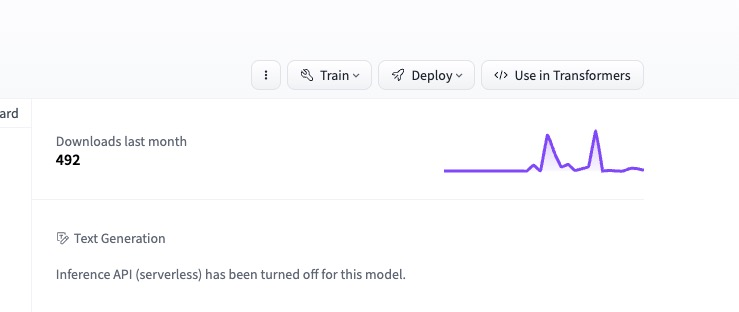

没有issue     
结果应该不好    

# 原理

`SD v1.5`模型   

我们推出 MoMA：一种开放词汇、免训练的个性化图像模型，拥有灵活的零样本功能。随着基础文本到图像模型的快速发展，对强大的图像到图像转换的需求不断增长。为了满足这一需求，`MoMA 专门研究主题驱动的个性化图像生成`。利用开源的多模态大语言模型 (MLLM)，我们`训练 MoMA 充当特征提取器和生成器`的双重角色。该方法有效地协同参考图像和文本提示信息以产生有价值的图像特征，促进图像扩散模型。为了更好地利用生成的特征，我们进一步`引入了一种新颖的自注意力捷径方法，该方法可以有效地将图像特征转移到图像扩散模型，从而提高生成图像中目标对象的相似度`。值得注意的是，作为一个免调整的`即插即用`模块，我们的模型`仅需要单个参考图像`，并且在生成具有高细节保真度、增强的身份保留和即时忠实度的图像方面优于现有方法。我们致力于将我们的工作开源，从而让所有人都能获得这些进步。

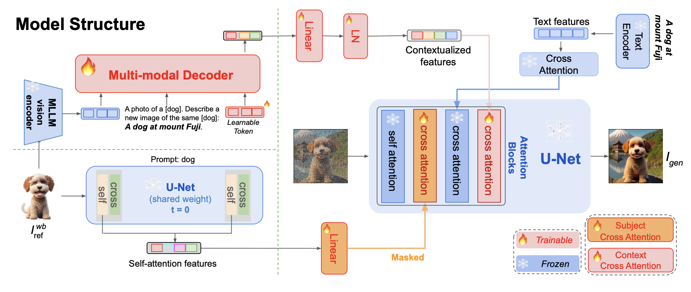    
我们推出了 MoMA，这是一种通过细粒度特征传输增强的多模式 LLM 适配器。整体架构如下图所示。我们的方法由三个部分组成：（1）利用生成多模态解码器`从参考图像中提取图像特征，并根据目标提示对其进行编辑，产生上下文化图像特征`； （2）我们将原始图像的背景替换为白色，`只留下目标像素，并利用原始UNet的自注意力层来提取目标图像特征`； (3)最后，在新图像生成过程中，我们分别`使用专门训练的上下文交叉注意层和对象交叉注意层将上下文图像特征和对象图像特征注入`到UNet扩散模型中。    

为了实现最佳模型性能，我们提出了两阶段预训练策略。首先，我们提出了一个多模态生成学习阶段，我们对多模态图像特征解码器进行预训练，使其学习根据目标提示组合主题的图像特征，并输出目标图像的 CLIP 嵌入。其次，训练主题和上下文交叉注意层来注入这种嵌入。为了进一步增强细节的真实度，我们涉及图像自注意力特征转移并应用掩蔽机制

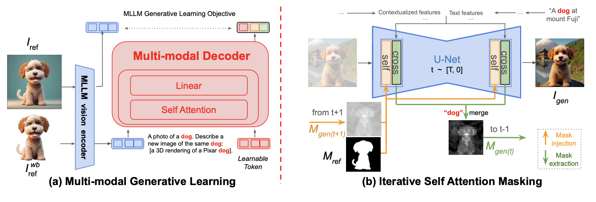

与其他方法比较    
零样本定性比较。我们在上面板中共享重新上下文化，在下面板中共享纹理编辑。我们的结果为上下文编辑提供了明显更准确的细节，并在纹理编辑中的提示和图像保真度之间实现了更好的平衡。    

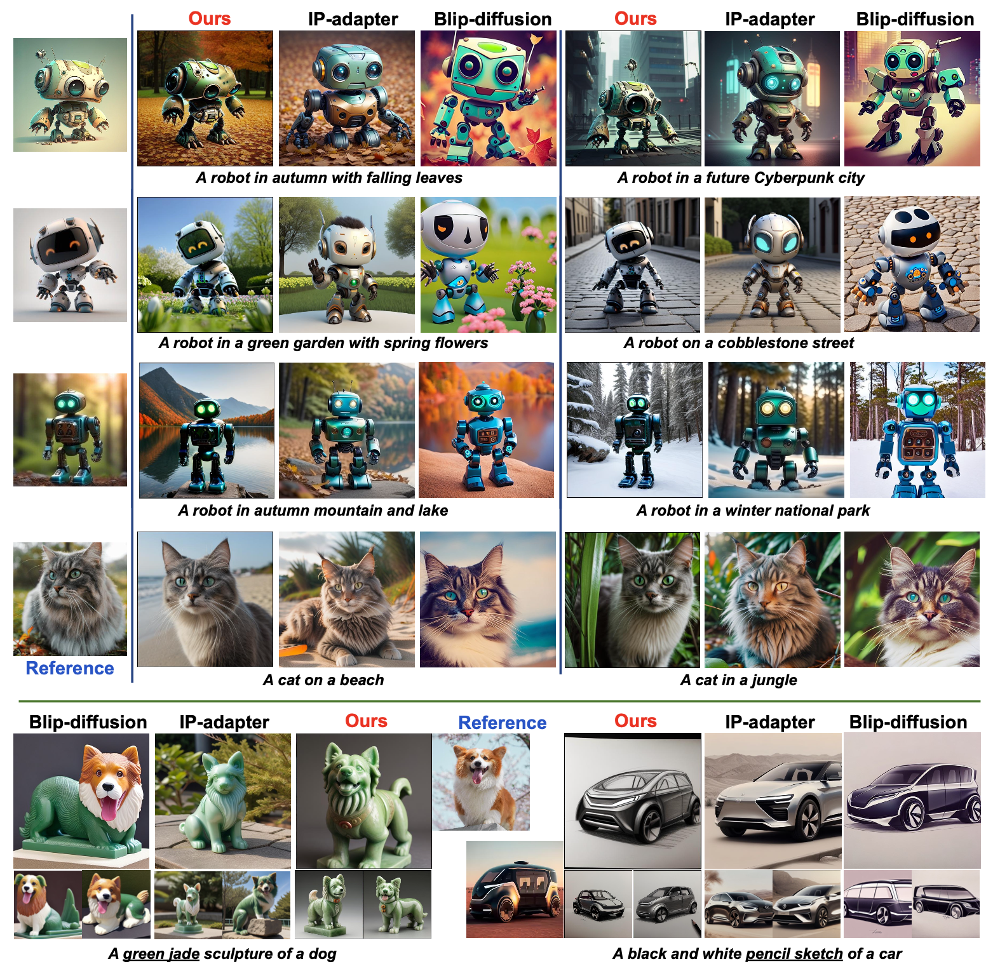

即插即用适配器    
我们的模型是一个通用适配器，因为我们在训练阶段冻结了原始扩散模型。它可以推广到从同一基本模型微调的自定义模型检查点。在下图中，我们在 HuggingFace 和 CivitAi 的社区模型上验证了这一点，包括 Realistic Vision V4.0、ReV-Animated、Anything v4 和 Esthetic Retro Anime。这些模型都是从 `SD v1.5` 开始进行微调的。 MoMA可以直接应用于这些社区模型，无需任何修改。      

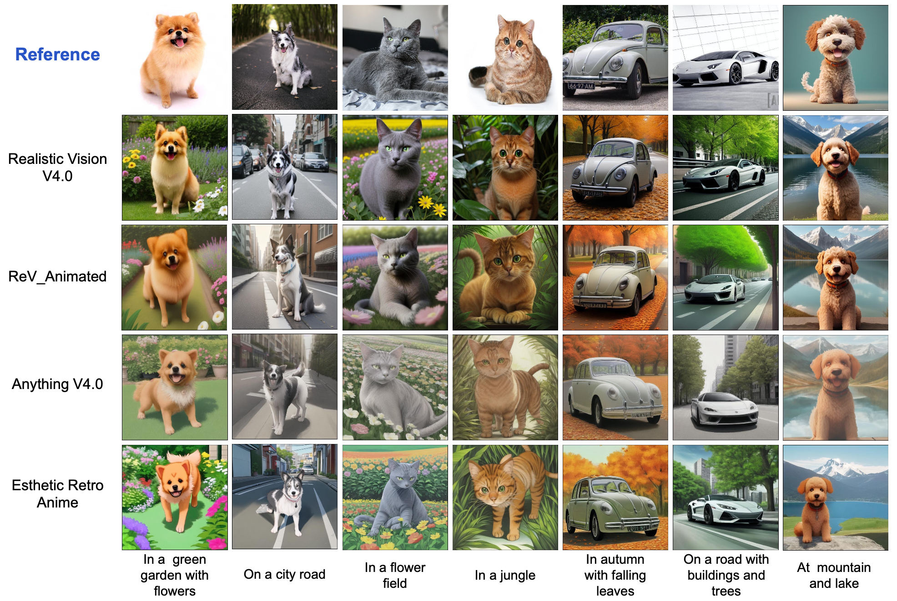    

# 使用

新上下文：    
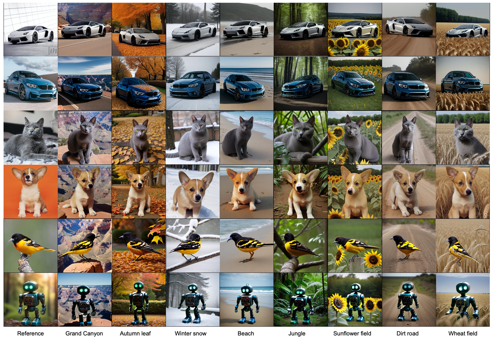

新纹理：   
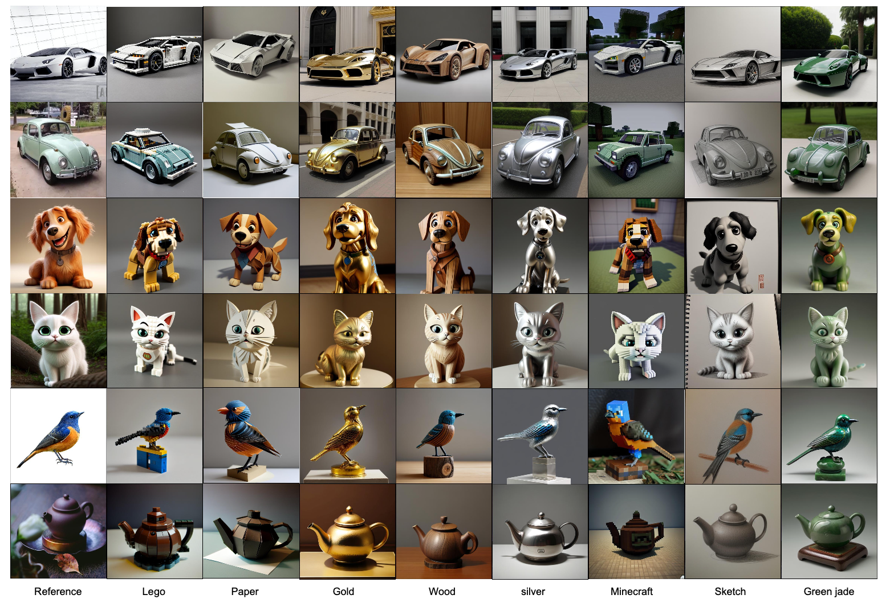    

超参数：

在“更改上下文”中，您可以增加strength以获得更准确的详细信息。大多数情况下，strength=1.0是最好的。建议strength不大于1.2。

在“更改纹理”中，您可以更改strength细节精度和提示保真度之间的平衡。为了获得更好的提示保真度，只需减少strength。大多数情况下，strength=0.4是最好的。建议strength不大于0.6。

diffusers加载扩散模型      

    VAE: stabilityai--sd-vae-ft-mse
    StableDiffusion: Realistic_Vision_V4.0_noVAE
    MoMA: 
        Multi-modal LLM: MoMA_llava_7b (13 GB)
        Attentions and mappings: attn_adapters_projectors.th (151 Mb)

输入正方形的商品图报错

1.
permute(sparse_coo): number of dimensions in the tensor input does not match the length of the desired ordering of dimensions i.e. input.dim() = 2 is not equal to len(dims) = 3

2.

    img,mask = self.moMA_generator.generate_with_MoMA(batch,llava_emb=llava_emb,seed=sample_id+seed,device=self.args.device)                            
        152     self.reset()
        153     ###

    File ~/miniconda3/envs/llava/lib/python3.10/site-packages/torch/utils/_contextlib.py:115, in context_decorator.<locals>.decorate_context(*args, **kwargs)
        112 @functools.wraps(func)
        113 def decorate_context(*args, **kwargs):
        114     with ctx_factory():
    --> 115         return func(*args, **kwargs)

    File /teams/ai_model_1667305326/WujieAITeam/private/lujunda/newlytest/MoMA/model_lib/moMA_generator.py:201, in MoMA_generator.generate_with_MoMA(self, batch, llava_emb, seed, device)
    ...
        455                     _pair(0), self.dilation, self.groups)
    --> 456 return F.conv2d(input, weight, bias, self.stride,
        457                 self.padding, self.dilation, self.groups)

    RuntimeError: Given groups=1, weight of size [128, 3, 3, 3], expected input[1, 4, 512, 512] to have 3 channels, but got 4 channels instead

# 代码

## 初始化 加载

    class MoMA_generator:
        def __init__(self, device,args):
            self.args = args
            self.device = device
            
            noise_scheduler = DDIMScheduler(num_train_timesteps=1000,beta_start=0.00085,beta_end=0.012,beta_schedule="scaled_linear",clip_sample=False,set_alpha_to_one=False,steps_offset=1,)
            
            print('Loading VAE: stabilityai--sd-vae-ft-mse...')
            vae = AutoencoderKL.from_pretrained("stabilityai/sd-vae-ft-mse")
            
            print('Loading StableDiffusion: Realistic_Vision...')
            self.pipe = StableDiffusionPipeline.from_pretrained(
                "SG161222/Realistic_Vision_V4.0_noVAE",
                torch_dtype=torch.bfloat16,
                scheduler=noise_scheduler,
                vae=vae,
                feature_extractor=None,
                safety_checker=None,
            ).to(self.device)

            self.unet = self.pipe.unet
            add_function(self.pipe)
            self.pipe.moMA_generator = self

            self.set_ip_adapter()
            self.image_proj_model = self.init_proj()

## ip_adapter

    def set_ip_adapter(self):
        unet = self.unet
        attn_procs = {}
        for name in unet.attn_processors.keys():
            cross_attention_dim = None if name.endswith("attn1.processor") else unet.config.cross_attention_dim
            if name.startswith("mid_block"):
                hidden_size = unet.config.block_out_channels[-1]
            elif name.startswith("up_blocks"):
                block_id = int(name[len("up_blocks.")])
                hidden_size = list(reversed(unet.config.block_out_channels))[block_id]
            elif name.startswith("down_blocks"):
                block_id = int(name[len("down_blocks.")])
                hidden_size = unet.config.block_out_channels[block_id]
            if cross_attention_dim is None:
                attn_procs[name] = IPAttnProcessor_Self(hidden_size=hidden_size, cross_attention_dim=cross_attention_dim,scale=1.0,num_tokens=4).to(self.device, dtype=torch.float16)
            else:
                attn_procs[name] = IPAttnProcessor(hidden_size=hidden_size, cross_attention_dim=cross_attention_dim,scale=1.0,num_tokens=4).to(self.device, dtype=torch.float16)
        unet.set_attn_processor(attn_procs)

这是什么意思 用了ipadapter?

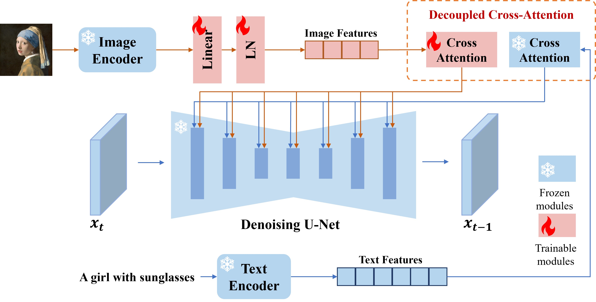

### IPAttnProcessor_Self

    class IPAttnProcessor_Self(nn.Module):
        r"""
        Attention processor for IP-Adapater. (But for self attention)

### IPAttnProcessor

    class IPAttnProcessor(nn.Module):
        r"""
        Attention processor for IP-Adapater.
        Args:
            hidden_size (`int`):
                The hidden size of the attention layer.
            cross_attention_dim (`int`):
                The number of channels in the `encoder_hidden_states`.
            scale (`float`, defaults to 1.0):
                the weight scale of image prompt.
            num_tokens (`int`, defaults to 4 when do ip_adapter_plus it should be 16):
                The context length of the image features.
        """

        self.to_k_ip = nn.Linear(cross_attention_dim or hidden_size, hidden_size, bias=False)
        self.to_v_ip = nn.Linear(cross_attention_dim or hidden_size, hidden_size, bias=False)

call 

        query = attn.to_q(hidden_states)
        
        if encoder_hidden_states is None:
            encoder_hidden_states = hidden_states
        else:
            # get encoder_hidden_states, ip_hidden_states
            end_pos = encoder_hidden_states.shape[1] - self.num_tokens
            encoder_hidden_states, ip_hidden_states = encoder_hidden_states[:, :end_pos, :], encoder_hidden_states[:, end_pos:, :]
            if attn.norm_cross:
                encoder_hidden_states = attn.norm_encoder_hidden_states(encoder_hidden_states)

        key = attn.to_k(encoder_hidden_states)
        value = attn.to_v(encoder_hidden_states)

        query = attn.head_to_batch_dim(query)
        key = attn.head_to_batch_dim(key)
        value = attn.head_to_batch_dim(value)

        attention_probs = attn.get_attention_scores(query, key, attention_mask)
        hidden_states = torch.bmm(attention_probs, value)
        hidden_states = attn.batch_to_head_dim(hidden_states)

        # for ip-adapter
        if self.enabled:
            if self.mode == 'inject' or self.mode == 'masked_generation':
                ip_key = self.to_k_ip(ip_hidden_states.to(torch.float16))
                ip_value = self.to_v_ip(ip_hidden_states.to(torch.float16))
                ip_key = attn.head_to_batch_dim(ip_key)
                ip_value = attn.head_to_batch_dim(ip_value)
                ip_attention_probs = attn.get_attention_scores(query, ip_key.to(torch.float32), None)
                ip_hidden_states = torch.bmm(ip_attention_probs, ip_value.to(torch.float32))
                ip_hidden_states = attn.batch_to_head_dim(ip_hidden_states)
                if (self.mask_ig_prev is not None) and self.mode == 'masked_generation': 
                    mask_ig_prev = rearrange(F.interpolate(self.mask_ig_prev,size=int(math.sqrt(query.shape[1]))),"b c h w -> b (h w) c")
                    if not mask_ig_prev.shape[0]==ip_hidden_states.shape[0]: mask_ig_prev = mask_ig_prev.repeat(2,1,1)
                    ip_hidden_states = ip_hidden_states * mask_ig_prev
                hidden_states = hidden_states + self.scale * ip_hidden_states
                !!!!!!!!!!!!!!!!!!1

            if self.mode == 'extract' or self.mode == 'masked_generation':
                subject_idxs = self.subject_idxs*2 if not (hidden_states.shape[0] == len(self.subject_idxs)) else self.subject_idxs
                assert (hidden_states.shape[0] == len(subject_idxs))
                attentions = rearrange(attention_probs, '(b h) n d -> b h n d', h=8).mean(1)
                attn_extracted = [attentions[i, :, subject_idxs[i]].sum(-1) for i in range(hidden_states.shape[0])]  
                attn_extracted = [(atn-atn.min())/(atn.max()-atn.min()) for atn in attn_extracted]
                attn_extracted = torch.stack(attn_extracted, dim=0)
                attn_extracted = rearrange(attn_extracted, 'b (h w) -> b h w', h=int(math.sqrt(attention_probs.shape[1])))
                attn_extracted = torch.clamp(F.interpolate(attn_extracted.unsqueeze(1),size=512),min=0,max=1)
                self.mask_i = attn_extracted

        # linear proj
        hidden_states = attn.to_out[0](hidden_states)
        # dropout
        hidden_states = attn.to_out[1](hidden_states)

        if input_ndim == 4:
            hidden_states = hidden_states.transpose(-1, -2).reshape(batch_size, channel, height, width)

        return hidden_states

## 推理

    @torch.no_grad()
    def generate_with_MoMA(
        self,
        batch,
        llava_emb=None,
        seed=None,
        device='cuda',
    ):
        self.reset_all()
        img_ig,mask_id,subject,prompt = batch['image'].half().to(device),batch['mask'].half().to(device),batch['label'][0],batch['text'][0]

        prompt = [f"photo of a {subject}. "+ prompt]

        prompt注入方式     

        subject_idx = get_subject_idx(self.pipe,prompt,[subject],self.device)
        negative_prompt = None 
            
        # get context-cross-attention feature (from MLLM decoder)
        cond_llava_embeds, uncond_llava_embeds = self.get_image_crossAttn_feature(llava_emb,num_samples=1)
        # get subject-cross-attention feature (from Unet)
        self.get_image_selfAttn_feature(img_ig,subject) # features are stored in attn_processors

        获取 上下文 和 目标物体 特征

        with torch.inference_mode():
            prompt_embeds = self.pipe._encode_prompt(
                prompt, device=self.device, num_images_per_prompt=1, do_classifier_free_guidance=True, negative_prompt=negative_prompt)
            negative_prompt_embeds_, prompt_embeds_ = prompt_embeds.chunk(2)
            prompt_embeds = torch.cat([prompt_embeds_, cond_llava_embeds], dim=1)
            negative_prompt_embeds = torch.cat([negative_prompt_embeds_, uncond_llava_embeds], dim=1)
            prompt_embeds = torch.cat([negative_prompt_embeds, prompt_embeds])

        generator = torch.Generator(self.device).manual_seed(seed) if seed is not None else None
        
        self.set_self_mask('eraseAll')
        self.toggle_enable_flag('all')
        self.toggle_extract_inject_flag('all','masked_generation')
        self.set_self_mask('self','id',mask_id) 
        self.set_cross_subject_idxs(subject_idx)
        
        images, mask = self.pipe.generate_with_adapters(
            self.pipe,
            prompt_embeds,
            50,
            generator,
        )
        images = torch.clip((images+1)/2.0,min=0.0,max=1.0)

        return images.cpu(), mask.cpu()

## get_subject_idx

注入subject信息二次验证后获得

    def get_subject_idx(model,prompt,src_subject,device):
        tokenized_prompt = model.tokenizer(prompt,padding="max_length",max_length=model.tokenizer.model_max_length,truncation=True,return_tensors="pt",).to(device)
        input_ids = tokenized_prompt['input_ids']
        src_subject_idxs = []
        for subject,input_id in zip(src_subject,input_ids):
            src_subject_token_id = [model.tokenizer.encode(i, add_special_tokens=False)[0] for i in subject.split(' ')]
            src_subject_idxs = [i for i, x in enumerate(input_id.tolist()) if x in src_subject_token_id]
        return [src_subject_idxs]

## 分析
内部开启ip_adapter

# 其他
## DeepFloyd IF
新的生图模型DeepFloyd IF来了，可以拳打Stable Diffusion，脚踢Dall-E？

2023.05    
https://github.com/deep-floyd/IF    

Stability AI与它的多模式AI研究实验室DeepFloyd共同宣布研究版本DeepFloyd IF的发布,这是一款强大的文text-to-image级联像素扩散模型（cascaded pixel diffusion model），复现了Google的Imagen（Text-to-Image Diffusion Models）。

对比Stable Diffusion（可以看我以前的文章：北方的郎：深入浅出讲解Stable Diffusion原理，新手也能看明白），Imagen也依赖于一个冻结的文本编码器：先将文本提示转换为嵌入，然后由扩散模型解码成图像。但不同的是，Imagen并没有使用多模态训练的CLIP，而是使用了大型T5-XXL语言模型。而StabilityAI推出的DeepFloyd IF复刻的正是这一架构。同时DeepFloyd IF在像素空间工作，与Stable Diffusion不同，扩散是在像素级实现的。

这些特点使它可以更精确的生成图像，例如生成带有特定文本的图片。在测试中，DeepFloyd IF直接超越了谷歌的Imagen，以及一众竞品（包括兄弟产品Stable Diffusion）。

DeepFloyd IF，具有高度的照片级真实感和语言理解。DeepFloyd IF 是一个由冻结的文本编码器和三个级联像素扩散模块组成的模块：

一个基于文本提示（Text Prompt）生成 64x64 像素图像的基本模型和两个超分辨率模型，每个模型都旨在生成分辨率不断提高的图像：256x256 像素和 1024x1024 像素。该模型的所有阶段都利用基于 T5 转换器的冻结文本编码器来提取文本嵌入，然后将其馈送到通过交叉注意力和注意力池增强的 UNet 架构中。

结果是一个高效的模型，优于当前最先进的模型，在COCO数据集上实现了6.66的 zero-shot FID分数。研究者的工作体现了更大的UNet架构在级联扩散模型第一阶段的潜力，并描绘了文本到图像合成的光明未来。
描述和特征

•深度文本提示(text prompt)理解:

利用大型语言模型T5-XXL-1.1作为文本编码器。大量的文本-图像交叉注意力层(text-image cross-attention layers)也提供了更好的提示和图像联盟。

•将文本描述应用于图像:

结合T5模型的智能性,DeepFloyd IF生成连贯清晰的文本以及出现在各种空间关系中的不同属性的对象。到目前为止,这些用例对大多数文本到图像模型来说都是具有挑战性的。

•高度写真性:

这一特点反映在令人印象深刻的 zero-shot FID得分6.66上,该得分是在COCO dataset上获得的(FID是评估文本到图像模型性能的主要指标;分数越低,性能越好)。

•宽高比转换:

生成非标准宽高比的图像的能力,垂直或水平的,以及标准的方形宽高比。

•级联:

DeepFloyd IF以级联方式对高分辨率数据进行建模,使用不同分辨率下单独训练的一系列模型。该过程从生成唯一低分辨率样本的基本模型(“player”)开始,然后由连续的超分辨率模型(“amplifiers”)上采样以产生高分辨率图像。

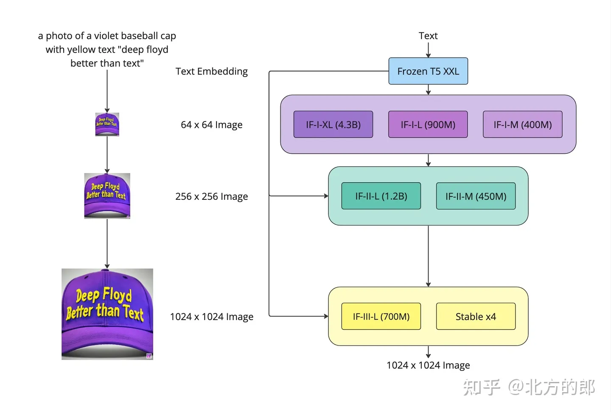

这幅生成流程图代表三个阶段的工作：文本提示通过冻结的T5-XXL语言模型传递,将其转换为定性文本表示。

第一阶段:基本扩散模型将定性文本转换为64x64图像。DeepFloyd团队已训练三个版本的基本模型,每个模型的参数都不同:IF-I 400M、IF-I 900M和IF-I 4.3B。

第二阶段:为了“放大”图像,应用两个文本条件超分辨率模型(Efficient U-Net)对基本模型的输出。第一个模型将64x64图像放大到256x256图像。同样,该模型也有几个版本可用:IF-II 400M和IF-II 1.2B。

第三阶段:应用第二个超分辨率扩散模型产生生动的1024x1024图像。最终的第三阶段模型IF-III有700M个参数。注意:研究者还没有发布这个第三阶段模型;然而,IF模型的模块化特性允许他们在第三阶段使用其他放大模型 - 如Stable Diffusion x4 Upscaler。

数据集训练

DeepFloyd IF在定制的LAION-A数据集上训练,该数据集由10亿对高质量图像和文本组成。LAION-A是LAION-5B数据集英语部分的优化后的子集，包括基于相似性哈希进行去重、额外清理以及对原始数据集的其他修改。DeepFloyd的定制过滤器用于删除带水印的、不适合工作环境的和其他不恰当的内容。

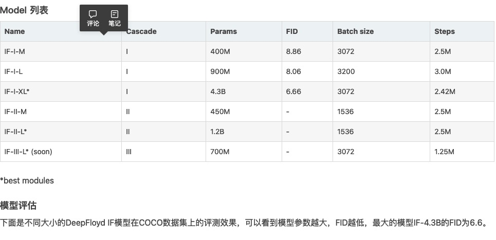

这个实验只有DeepFloyd IF正确显示了文字。   
这个实验只有DeepFloyd IF比较正确显示了文字（4张图就1张图多了一个t）。   
Prompt: a neon sign says "It's Saturday"   
不正确     

运行

目前DeepFloyd IF模型也已经集成到了diffusers库

I. Dream

Dream is the text-to-image mode of the IF model

II. Zero-shot Image-to-Image Translation

III. Super Resolution

For super-resolution, users can run IF-II and IF-III or 'Stable x4' on an image that was not necessarely generated by IF (two cascades):=

IV. Zero-shot Inpainting

## Kohya Trainer
https://github.com/Linaqruf/kohya-trainer

page太乱     

## sd script
训练

## llava
LLaVA（Large Language and Vision Assistant）

    LLaVA 是一种新颖的端到端训练的大型多模态模型，将 CLIP 的开放式视觉编码器与 LLaMA 的语言解码器相连接，并在生成的视觉-语言数据上进行端到端的微调
### 论文信息

[Submitted on 5 Oct 2023]     
Improved Baselines with Visual Instruction Tuning

[NeurIPS'23 Oral] Visual Instruction Tuning (LLaVA) built towards GPT-4V level capabilities and beyond.

Improved Baselines with Visual Instruction Tuning [Paper] [HF]
Haotian Liu, Chunyuan Li, Yuheng Li, Yong Jae Lee

Visual Instruction Tuning (NeurIPS 2023, Oral) [Paper] [HF]
Haotian Liu*, Chunyuan Li*, Qingyang Wu, Yong Jae Lee (*Equal Contribution)

Acknowledgement     
Vicuna: the codebase we built upon, and our base model Vicuna-13B that has the amazing language capabilities!

Related Projects     

    Instruction Tuning with GPT-4
    LLaVA-Med: Training a Large Language-and-Vision Assistant for Biomedicine in One Day
    Otter: In-Context Multi-Modal Instruction Tuning
For future project ideas, please check out:

    SEEM: Segment Everything Everywhere All at Once
    Grounded-Segment-Anything to detect, segment, and generate anything by marrying Grounding DINO and Segment-Anything.

### 原理

文章主要贡献：
1. 多模态指令跟踪数据（多模态指令数据）：提出了一种数据重塑的视角和流程，使用GPT-4将图像-文本对转换为适当的指令格式；

为了将图像编码为其视觉特征以提示纯文本GPT，使用两种符号表示： （i）标题通常从各种角度描述视觉场景。 （ii）边界框通常定位场景中的对象，每个框编码对象概念及其空间位置

2. 视觉指令训练(Visual Instruction Tuning)模型    
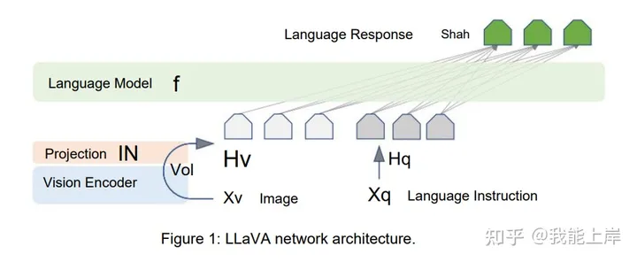

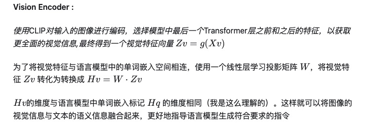

Traning :

Step1-特征对齐预训练

1. 数据转换： 为每个图像生成一个简单的问题,请求助手简要描述图像内容。将图像-文本对转换为问题(指令)-回答(描述) 格式

2. 模型构建： 使用预训练的CLIP视觉编码器和LLaMA语言模型,加入一个线性投影层W将图像特征映射到语言特征空间（参照上述Vision Encoder模型）

3. 训练目标： 最大化回答的生成似然概率,仅优化投影层W的参数,冻结视觉编码器和语言模型

4. 训练效果：

学会将图像特征转换为语言模型可理解的表示,实现两者的对齐。

Step2-端到端微调

1. 数据转换： 将3种类型(对话、详细描述、复杂推理)组织成统一的指令-回答序列格式

2. 模型构建： 冻结CLIP视觉编码器,解冻LLaMA参数及投影层W

3. 训练效果： 提高模型遵循指令的能力,实现视觉问答
tags: 两次训练的不同之处在于预训练阶段仅优化投影层,是为了先获得图像特征与语言特征的对齐,而不破坏语言模型的先验知识；两阶段训练方式利用不同类型的数据。 

## Vicuna-13B
An open platform for training, serving, and evaluating large language models. Release repo for Vicuna and Chatbot Arena.

https://github.com/lm-sys/FastChat

    [2024/03] 🔥 We released Chatbot Arena technical report.
    [2023/09] We released LMSYS-Chat-1M, a large-scale real-world LLM conversation dataset. Read the report.
    [2023/08] We released Vicuna v1.5 based on Llama 2 with 4K and 16K context lengths. Download weights.
    [2023/07] We released Chatbot Arena Conversations, a dataset containing 33k conversations with human preferences. Download it here.

## mermaid
关于 Mermaid

Mermaid 是一个基于 Javascript 的图表绘制工具，通过解析类 Markdown 的文本语法来实现图表的创建和动态修改。Mermaid 诞生的主要目的是让文档的更新能够及时跟上开发进度。

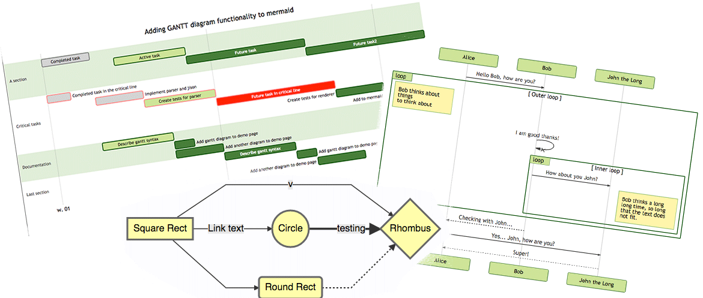

    Mermaid 致力于解决 Doc-Rot 这个令人头疼的问题。

绘图和编写文档花费了开发者宝贵的开发时间，而且随着业务的变更，它很快就会过期。 但是如果缺少了图表或文档，对于生产力和团队新人的业务学习都会产生巨大的阻碍。

Mermaid 通过减少创建可修改的图表所需要的时间、精力和工具来解决这一难题，从而提高了内容的智能化和可重用性。 作为一个基于文本的绘图工具， Mermaid 天生就易于维护和更新，它也可以作为生产脚本（或其他代码）的一部分，使得文档编写变得更加简单。 有了它之后，开发者可以从维护文档这个与开发割离且麻烦的任务中解放出来。 

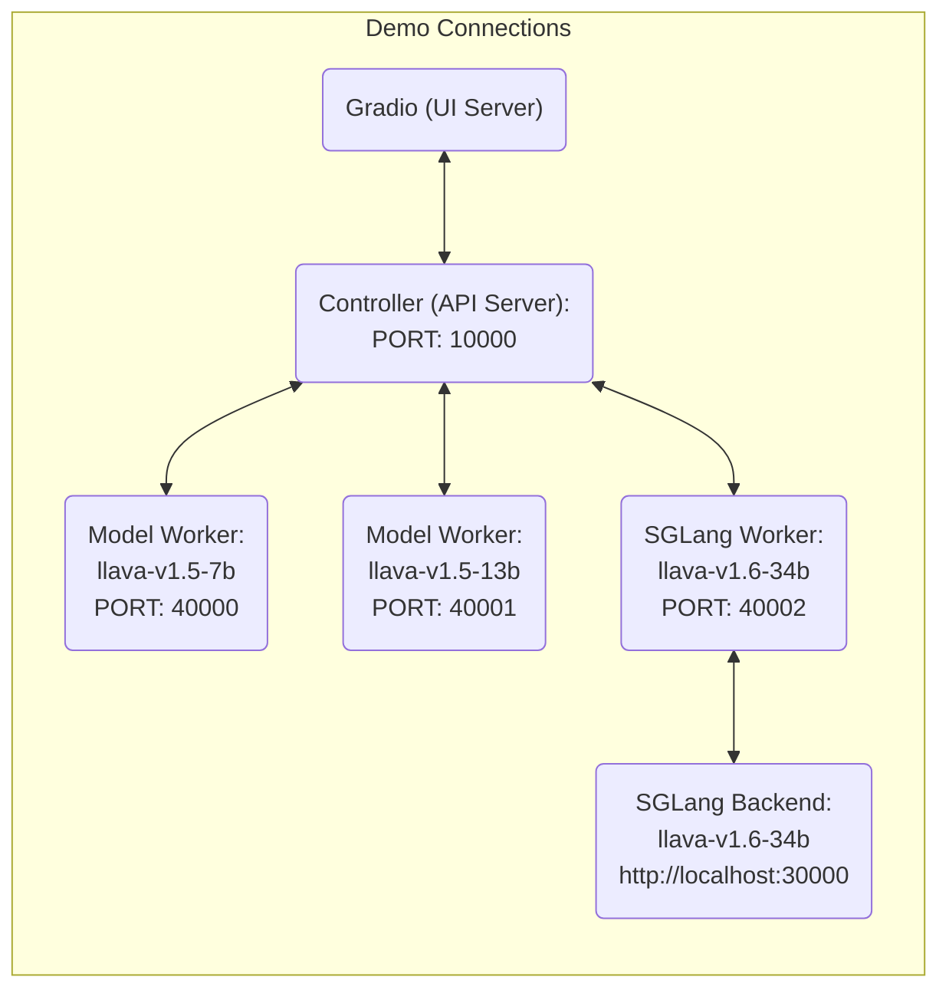

# 结尾