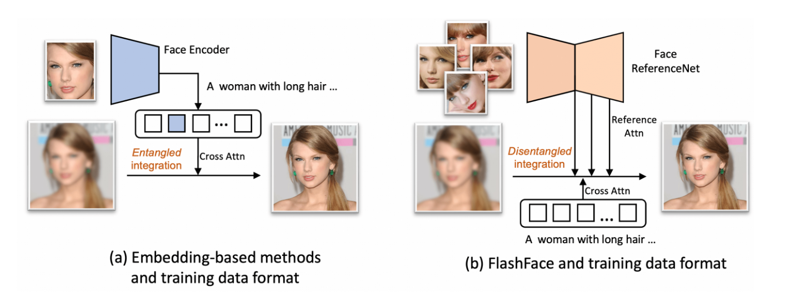
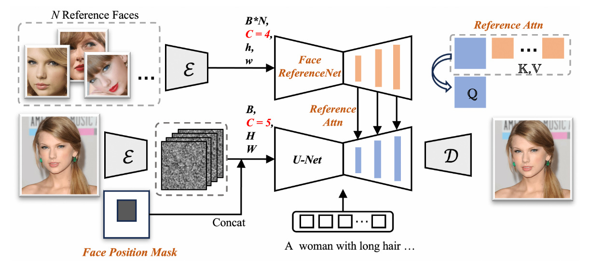
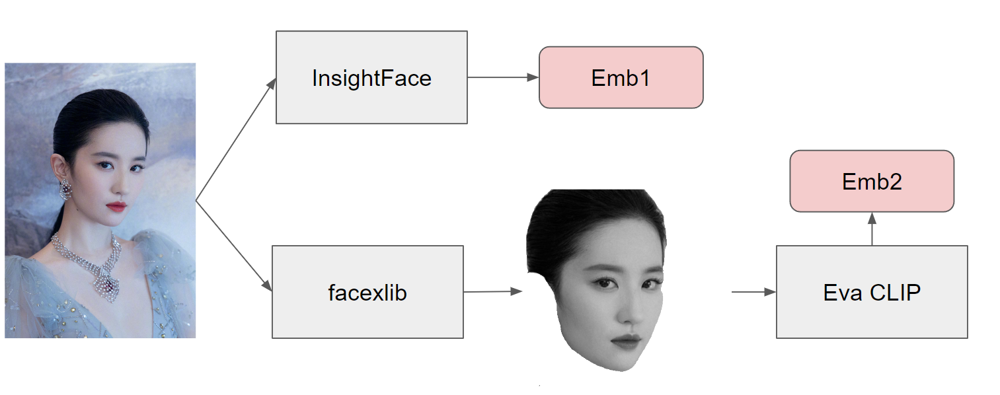

# Flashface

flashface-sd1.5模型本身的质量不好，生成的图片质量低    
相似度也没有比instantID高

本文针对以前的zero-shot工作提出了几个问题
● 过去的工作难以保持面部的形状和细节，这主要是因为在将参考面孔编码成一个或几个标记时，空间表征可能会丢失。
● 其次，在实现精确的语言控制方面面临挑战，例如在使用年轻参考图像生成老年人面部时，往往不能很好地遵循语言提示。
● 这些问题的原因在于面部标记和文本标记被平等对待并集成到U-Net的同一位置，导致控制信号纠缠。
● 此外，数据构建流程中的目标图像裁剪也使得模型倾向于复制参考图像而非遵循语言提示。
总结就是，部分细节丢失、对于提示词的控制不够准确

(a) 基于embedding的方法   （b）FlashFace

方法的新颖之处在于：
● 将面部编码为一系列特征图而不是多个token  （以保留更精细的细节）
● 使用单独的参考层和文本控制层进行解耦集成  （增强文本控制能力，缺点是导致模型过大~10GB)

# PuLID
PuLID的推理速度比InstantID快一些     
PuLID耗时：7s，InstantID耗时：10s    
PuLID的效果更自然     
无法控制人脸的方向    
眼镜很少能保留，表情也不能控制    

## 原理

PuLID是一种类似于 ip 适配器的方法来恢复面部身份。它使用 Insightface 嵌入和 CLIP 嵌入，类似于 ip-adapterfaceid plus 模型的做法。然而，在将图像传递到 CLIP 之前，有一个额外的过程，即使用 Facexlib 从背景环境中屏蔽脸部。 PuLID 还使用 Eva CLIP 代替普通 CLIP。在 attn 覆盖中，PuLID 还比 IPAdapter 做更多的事情，因为它对张量进行零填充并添加到隐藏状态的正交。如果您有兴趣，可以阅读他们关于如何处理此问题的论文。   

PuLID is an ip-adapter alike method to restore facial identity. It uses both insightface embedding and CLIP embedding similar to what ip-adapter faceid plus model does. However, there is an extra process of masking out the face from background environment using facexlib before passing image to CLIP. PuLID also uses Eva CLIP instead of normal CLIP. In the attn overrides, PuLID also does something more than IPAdapter, as it zero pads the tensor and adds to ortho of hidden states. If you are interested you can read their paper on how this is handled.

# 结尾