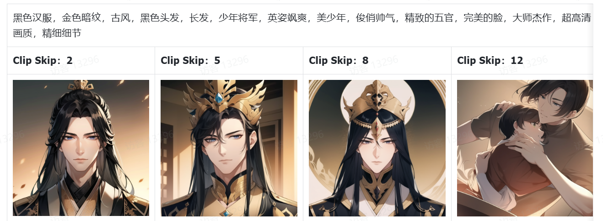
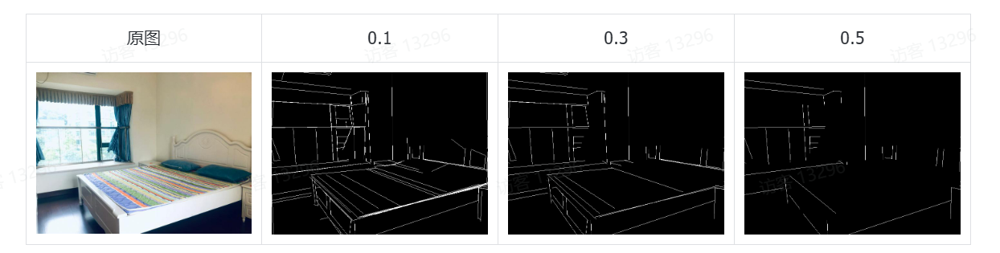
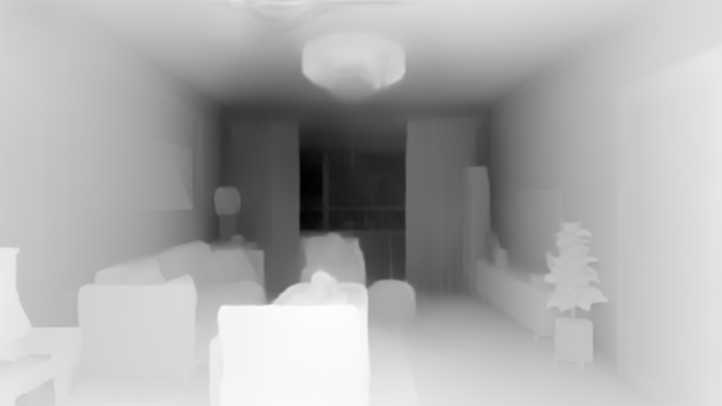
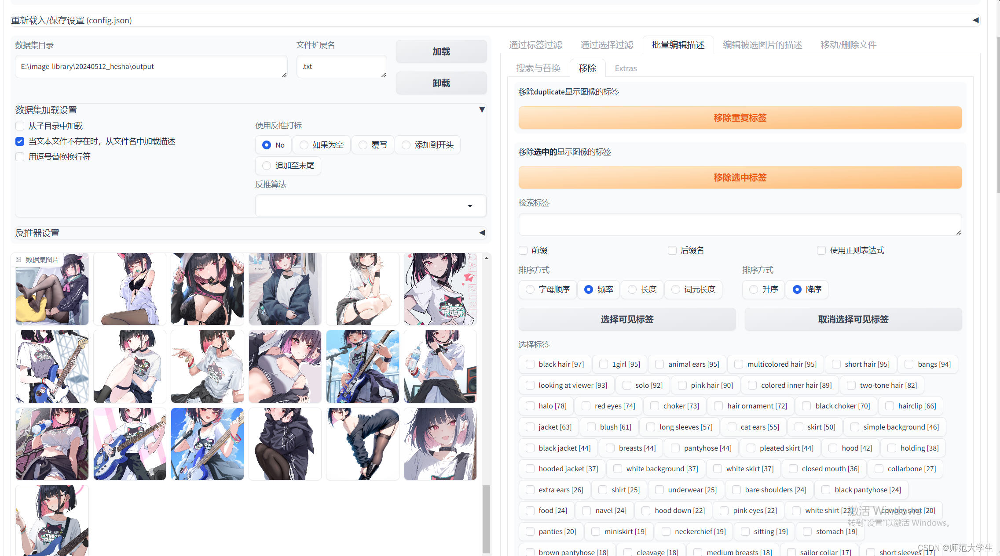
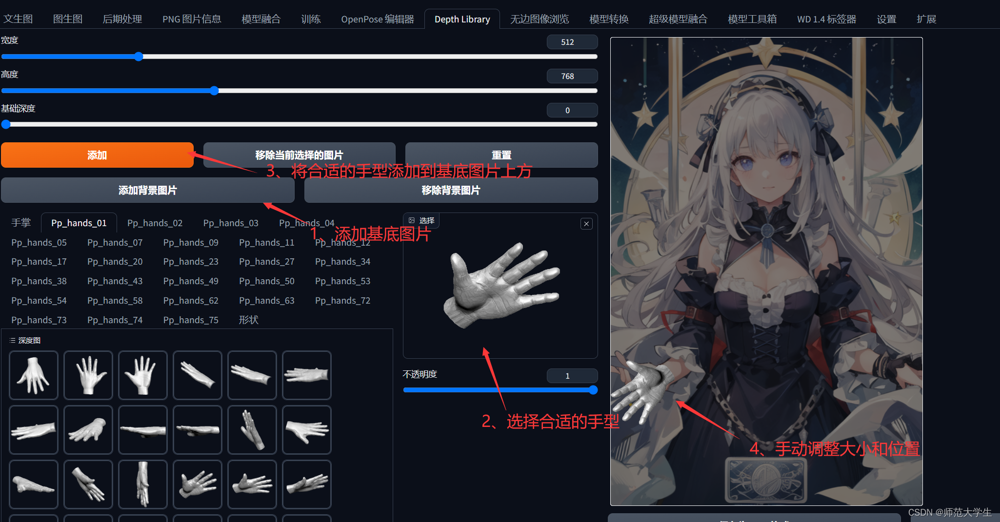

# 矢量图
又称矢量图形（Vector Graphic），是一种面向对象的图像或绘图图像。  
与通常的位图图像（Pixel Graphic）不同，矢量图矢量图是根据几何特性来绘制的，只能靠软件生成。

矢量图具备以下显著特点：   
1、无限缩放性： 与位图图像不同，矢量图可以在任何尺寸下无损缩放，无需担心像素失真或图像质量下降。这是因为矢量图由数学公式生成，可以轻松适应各种输出设备的不同分辨率。

2、小文件体积： 矢量图文件通常较小，因为它们仅包含图像的数学描述，而不存储每个像素的颜色信息。这使得它们在网络传输速度更快，并且占用更少的存储空间。

3、高度可编辑： 矢量图易于编辑和修改，因为它们由一系列路径、线条和形状组成，可以通过图形设计软件进行精确编辑。

4、透明背景： 矢量图可以具有透明背景，这意味着可以轻松叠加到其他图像或背景上，无需复杂的抠图过程。

5、多用途性： 矢量图通常用于创建图标、标志、矢量艺术、图表、地图等各种图形元素。它们在印刷品、网站设计、动画制作和多媒体项目中都有广泛的应用。

矢量图，也称为面向对象的图像或绘图图像，在数学上定义为一系列由点连接的线。矢量文件中的图形元素称为对象。每个对象都是一个自成一体的实体，它具有颜色、形状、轮廓、大小和屏幕位置等属性。

# Clip Skip
描述画面的准确程度与数值的大小成反比，数值越小表示对图像的控制度越高。最佳使用区间是1-2。

感觉有点cfg控制的意思。      
但是其实是文本输入不准确     

类似lora的几个参数一起控制强度

# sampler
DPM adaptive是个例外，在高CFG Scale下能够稳定出图。

DPM++ SDE Karras采样器，风格独特，出图与其他采样器在相同参数下，完全不一样。

Euler、Heun、DPM2、DPM++ 2M、LMS Karras、DPM2 Karras、DPM++ 2M Karras，以及Euler a、DPM2 a、DPM adaptive*、DPM++ 2S a、DPM++ 2S a Karras在相同参数下，从整体布局，到人物动作及衣物细节等存在相同或者相似的情况。

Heun、DPM adaptive、LMS几种采样器，出图细节比较稳定，不随着迭代步数增加而发生细节变化。

# 宽高
1:1头像图，1:2手机屏幕，4:3文章配图，3:4社交媒体，16:9电脑壁纸，9:16宣传海报

# cn
## openpose
OpenPose_face 预处理器是 OpenPose 预处理器的基础上增加脸部关键点的检测与标识，效果如下所示：

OpenPose_faceonly 预处理器仅检测脸部的关键点信息，如果我们想要固定脸部，改变其他部位的特征的话

.png>)

openpose_hand 预处理器能够识别图像中人物的整体骨架+手部关键点，

.png>)

openpose_full 预处理器能够识别图像中人物的整体骨架+脸部关键点+手部关键点

dw_openpose_full 预处理器是目前 OpenPose 算法中最强的预处理器，其不但能够人物的整体骨架+脸部关键点+手部关键点，而且精细程度也比 openpose_full 预处理器更好，其效果如下图所示：

## 边缘检测-Canny
，硬边缘检测。
Canny 的预处理可以对图片内的所有元素通过类似 PS 中的硬笔工具进行勾勒出轮廓和细节
再通过 Canny 模型作用于绘图中，让我们生成类似于原图轮廓和细节的图片。如下图示例：这里需要注意 canny 所提取的图片看起来很像是线稿，但其实和线稿完全不一样。

invert (from white bg & black line)则是对白色背景黑色线条的图片进行反转

特殊参数   
canny中有两个特殊的参数最低阈值和最高阈值两个参数。它们决定了哪些边缘可以被视为强边缘，哪些可以被视为弱边缘，以及哪些应该被完全忽略。

下面是这两个参数的具体作用：   
1. 最低阈值: 这个参数用来决定哪些边缘是不重要的，可以直接被舍弃的。边缘强度小于最低阈值的部分会被认为是噪声或颜色变化不明显的区域，因此在边缘检测的最后结果中不予显示。100   
2. 最高阈值: 这个参数用来确定哪些边缘是显著的，应该被保留的。边缘强度高于最高阈值的区域会被当作真正的边缘。这部分通常代表了图像中亮度变化最大的地方，反映了明显的边界。200  

当使用双阈值时，对于边缘强度介于这两个阈值之间的边缘像素，如果它们与已标记的强边缘像素相邻，则被认为是弱边缘，可以保留；否则，为了降低误报，这些部分也会被舍弃。   

## 轮廓识别-softedge      
Canny（硬边缘检测）预处理器和模型，但相对 Canny 我们发现其线条太过于严格，让 AI 绘画发挥的空间比较小。
如果我们需要让 AI 更多的发挥空间，让线条更宽松一些，这里我们就引入了 SoftEdge（软边缘）预处理及模型。
这是 softedge 的效果

边缘检测可以理解为用铅笔提取边缘，而轮廓识别则是用毛笔

预处理质量 HED 最高也最常用：HED>PiDiNet>HEDSafe>PiDiNetSafe      
质量越高消耗显存越多，所以效率方面：PiDiNetSafe>HEDSafe>PiDiNet>HED

## 涂鸦上色-Scribble
Canny（硬边缘检测）和 SoftEdge (软边缘检测)线条类 ControlNet 模型，更多的区别在于对线条的宽松度，让 AI 发挥空间的大小，如果我们需要更宽松的空间让 AI 发挥，这里就引入了 Scribble 。
涂鸦上色能够提取图片中曝光对比度比较明显的区域，生成黑白稿，涂鸦成图，其比其他的轮廓控制更加自由，也可以用于对手绘线稿进行着色处理。
涂鸦上色非常适合进行创意绘画和儿童绘画，你只需要用画笔简单画一些图案交给 AI，它就可以生成精美得分图片。

预处理器
涂鸦上色的预处理器有四个：Scribble-hed, Scribble-pidinet, Scribble-xdog，t2ia_sketch_pidi

这里我们可以把这 4 种预处理器分为 2 类：   
第一类：HED、PiDiNet、Sketh_PiDi   
第二类：Xdog   
从下图中可以看出，第一类质量由大到小为：HED > Sketh_PiDi > PiDiNet，同时消耗显存会增加。

相比前两个预处理器控制程度较高。阈值越小精细程度就越高，阈值越高精细程度就越低。

## 线稿提取-lineart
线稿提取是专门提取线稿的功能，可以针对不同类型的图片进行不同的处理。     
lineart 是一个专门提取线稿的模型，可以针对不同类型的图片进行不同的处理，主要可以处理一下几种图片类型：动漫图片提取线稿，真实照片提取线稿，素描图片提取线稿，黑白线稿提取

1. lineart_coarse 是素描线稿预处理器，它比较适用于简单线条的场景，比如肖像与静物画，但对线条非常复杂的场景就很不适用，会出现非常多的错误。
2. lineart_anime 专为处理动漫风格的图像设计。通常动漫风格的线稿有清晰的轮廓线和特定的风格特征，这种预处理器会优化这些特定的线条特点。它的优点是，擅长处理浅色图片能够较为完整的保留图片的线稿；缺点则是对深色图片的线稿可能会发生错误，图片会保留许多干扰信息。
3. lineart_anime_denoise 是上述 lineart_anime 预处理器的一个变体，它不仅进行常规的优化，而且可包含去除图片噪声的功能。这对于提取从非专业的或低质量的源图像中提取线条特别有用。它的优点则是，可以处理深色图片通过去噪保留正确的线稿；缺点则是因为去噪所以可能会消除原图中许多的线段。
4. lineart_realistic 预处理器可能是用来处理更为真实主义风格的线稿，其中的线条可能要表现出不同的质感和深度，以及真实世界的细节和阴影。优点则是适用于现实生活中的图片，或者复杂场景的图片，缺点则是细节捕捉太多，可能造成不必要的麻烦。

## 直线检测-mlsd
MLSD 模型是一个专门检测直线的模型   
基于 MLSD 模型的特性，MLSD 模型在建筑、室内方向的处理上是比较好的选择   
可以很好的检测出原图的直线线条   
举个例子若原图室内环境中有人物出现，但是新生成的图片中不希望有人物，那么使用 MLSD 模型就可以很好的避开人物线条的检测。

看看预处理出来的图，都只有直线，有弧度的线条都会被忽略掉。

其中，价值阈是对输入图片中直线进行打分，我们可以通过提高价值阈的数值来屏蔽一些混乱的直线。

## 深度检测-depth

深度图也被称为距离影像，指的是图像采集器采集到图像中各个场景区域的距离，深度图会使用灰阶数值 0~255 组成图像，灰阶数值为 0 的区域表示图像中最远的区域，灰阶数值 255 表示图像中最近的区域，所以我们在深度图中可以看到不同灰度的区域组成的图像。
    
depth_leres   
depth_leres 预处理器的成像焦点在中间景深层，这样的好处是能有更远的景深，且中距离物品边缘成像会更清晰，但近景图像的边缘会比较模糊。

`depth_leres++`预处理器在 depth_leres 预处理器的基础上做了优化，能够有更多的细节，但处理速度相对更慢。   

depth_midas 预处理器是经典的深度估计器，也是最常用的深度估计器，处理速度最快。   

depth_zoe 预处理器的参数量是最大的，所以处理速度比较慢，实际效果上更倾向于强化前后景深对比，更适合处理复杂场景。

## 语义分割-segment

预处理器
预处理器：seg_ofcoco，seg_ofade20k，seg_ufade20k
预处理器功能：生成图片的物品分割图
模型功能：依据标注的分割图进行精准控图    
注意：推荐使用 of 开头的预处理器，coco 代表 coco 数据集标记方法，ade20k 也是一个标记方法

## 法线贴图-normal
NormalMap 算法根据图片生成一张记录凹凸纹理信息的法线贴图，通过提取输入图片中的 3D 物体的法线向量，以法线为参考绘制出一副新图，同时给图片内容进行更好的光影处理。

法线贴图有 Bae 和 Midas 两种预处理器，默认 Bae 预处理器，Midas是比较早期的版本，一般不再使用。

## 参考生图-Reference 
Reference 模型是一种预处理器，可以根据导入的素材图片，参考图片的配色、色调、画风、画中的事物创建出新图片，使画中事物仍然和原图的相似性。这个模型在涂鸦或线稿生成等场景中应用较广，能产生与参考图风格类似但细节不同、元素多样的图片。

Reference算法可以直接将SD模型的注意力机制与图像进行映射，这样SD模型就可以将输入的图像作为参考（图像提示词）。   
参考生图一共有三种预处理器，Reference adain、Reference only、Reference adain+attn，一般选择reference only，模型选择为none

Reference 中有一个特殊参数：Style Fidelity (only for "Balanced" mode)
风格保真度，值越大生成的图片风格和参考图的差异就越小，反之亦然。    
Reference 出图更依赖于大模型，对于一些大模型，Style Fidelity 值太大，会导致崩图，所以我们出图需要更接近参考图的时，可以设置 0.5-0.9 之间，如果需要更多风格的改变，Style Fidelity 值调整为 0.5 以下。

reference_adain    
在具体使用过程中发现该预处理器保持原画面的相似性较差，主要是将参考图的风格/纹理迁移到结果图中，以生成模型为主，参考图为辅的形式进行。  
reference_only   
固定参考图特征，在这个基础之上进行发散，基本上保留原图的风格   
reference_adain+attn   
Reference_adain+attn 预处理器是 reference_adain 一种高级的预处理器   
它融合了 reference_adain 和 reference_only 两个算法，在具体使用过程中发现该预处理器保持原画面的相似性最好。  

魔法色子

## 风格迁移-shuffle
Shuffle将图片进行随机打乱，经过训练可以重组图片，同时可以将其他图片的画风快速转移到自己的照片上。
注意这里风格转移和一些大模型无关，这是一个纯 ControlNet    
可以理解为，我将漫画图片的动漫风格转移到真实照片上，即使大模型选择的是真实模型而不是动漫模型，也不影响结果成为动漫风格。

## 局部修图-inpaint

inpaint_global_harmonious     
是整张图进行重绘，重绘之后整体融合比较好，但是重绘之后的整个图片都会有轻微的改变

inpaint_only    
只重绘涂绘区，其他地方不作任何改变

inpaint_only+lama    
这个预处理器是新增的一个预处理器，看起来与 inpaint_only 类似，但有点“干净”：更简单、更一致、随机对象更少。这使得 inpaint_only+lama 适合图像修复延展或对象移除

## 稳定像素-ip2p

给照片加特效，比如让房子变成冬天、让房子着火  
这里需要输入的关键词比较特殊   
需要在关键词里面输入：make it.... （让它变成...）
比如让大厦着火，就输入：make it fire

## 细节增强-tile
Tile 模型具备增补图片细节的能力。简单来说，它能将解析度较低的图片放大到高解析度，并在放大过程中保持图片的细节和清晰度，从而使放大后的图片看起来非常逼真。

Tile 模型的关键优势在于，它可以生成新的细节，并且忽略现有的图像细节。因此，你可以使用该模型删除不适合的细节，比如调整图像大小导致的模糊，并添加更精细的细节。

需要注意的是，Tile 模型并不是创建超高解析度图像的模型，而是专注于忽略图像中的细节并`生成新的细节`。这意味着`即使图像本身已有良好的细节，你仍然可以使用此模型进行内容替换或优化。`

如果你希望将图片放大到高解析度，你可以将 Tile 模型与 Tiled Upscaling 工具（如 Ultimate SD Upscale）配合使用。

在绘图过程中，Tile 模型会忽略全局提示词。换句话说，绘图的主要内容会依据图片内的物体为主，即使收到提示词的指示，只要图片里没有这样的物体，提示词就会失效。

预处理器   
tile有none，tile_resample，tile_colorfix，tile_colorfix+sharp   
不选择预处理器直接 tile

tile_resample   
tile_resample 的作用是缩小原图片，缩小后的图片更有利于模型产生更加多样化的结构。   
tile_resample 中有一个特殊参数：最低采样率

最低采样率是缩小倍率，数值越大图片被缩的越小
比如原图分辨率为 1024*1024

    数值为 1 时，图片大小不变，仍然为 1024*1024
    数值为 2 时，图片缩小 2 倍，变为 512*512
    数值为 4 时，图片缩小 4 倍，变为 256*256
理论上数值越大，生成的图像被补充的细节越多，和原图的差距越大，所以我们在修复图片细节的时候尽量不要把数值调太大，正常保持 1-2 即可。

tile_colorfix   
tile_colorfix 可以很好的保留原图片的色彩。

变化可以控制区块颜色的变化，数值越大区块颜色变化越大，这里不宜将数值调太大，容易导致颜色不可控

tile_colorfix+sharp   
tile_colorfix+sharp 是 tile_colorfix 的升级版，可以消除 tile_colorfix 的模糊效果。   
tile_colorfix+sharp 预处理器其实就是对 tile_colorfix 预处理器的改良。改良的关键就是 sharp，翻译过来就是锐化，是防止 Tile 模型在生成图片时出现的模糊问题。

Sharpness：就是锐化度  
数值越大锐化程度越高，建议数值控制在 0.7~1 之间

blur_gaussian    
blur_gaussian 预处理器主要作用是向图像增加一个高斯模糊，然后将模糊后的图片交给 Tile 模型去添加更多的细节，这样我们生成的图片就带有景深了。

## 光影控制-brightness
光影控制与其他条件生图不同，在界面上并没有预处理器，只有两个模型选择，分别是：

control_v1p_sd15_brightness，control_v1p_sd15_illumination；

仿佛是iclight

一般会用control_v1p_sd15_brightness，control_v1p_sd15_brightness，control_v1p_sd15_illumination的区别在于：

光影控制的玩法多种多样，比如你可以用光影控制来将照片或者文字隐藏在图片中

当然还可以直接将你想要的光线放入到光影控制中进行图片的生成。

      

fbc

在使用光影控制中时，权重建议0.4-0.65，这里数值越大，光线图案就会越明显，但相对的，光线和图片的融合度也会越差。      
同时可以调整开始与结束控制步数，结束步数参数建议0.6-0.75，代表着条件生图什么时候停止介入，数值越大后面留给模型处理融合的时间就越少，融合度就会变差，数值越小模型介入过早就会破坏已有的结构导致光线无法出现。

## 二维码控制-qrcode
创意二维码设计主要解决营销活动二维码问题，可以制作出富有创意的营销二维码。
流程：
1. 二维码控制+光影控制，配合模型风格做创意二维码
2. 发送到条件生图，选择细节增强-底图

修改参数，权重：0.9-1.15
开始控制步数：0.2-0.4
结束控制步数：0.6-0.8

光影控制       
修改参数，权重：0.3-0.55
开始控制步数：0.3-0.4
结束控制步数：0.7-0.85

fbc也可以

## 元素融合-ip-adapter
IP Adapter 它的作用是将你输入的图像作为图像提示词，本质上就像 MJ 的垫图功能。   
这个功能与 Reference (参考生图)有些类似，但 IP Adapter 比 reference 的效果要好，而且会快很多，适配于各种 stable diffusion 模型，还能和 controlnet 一起用。

有时候v2只是增加功能，并不能优化质量     
甚至有些只是加速，减少显存等     

# 蒙版

## 蒙版模糊度
类似 PS 这种绘图工具中的“羽化”功能。
““羽化”（Feather）是指在选中区域的边缘添加一层透明的、渐变式的效果，使得选中区域的边缘更加柔和自然。 

蒙版模糊度越高，那么重绘区域和未被重绘的区域会形成一种丝滑的过度，如果我们将蒙版模糊拉到最低，那么就相当于没有设置羽化值，重绘区域和未被重绘的区域交界处会显得非常生硬。    
一般保持在10以下，根据区域的大小选择相应的数值，蒙版较大可以选择较大的数值，较小的区域则选择较小的数值。

## 蒙版模式
inpaint masked是重绘蒙版内容，就是把蒙版中白色部分重新画一遍。   
就如下面这张图，我们选择inpaint masked模式，杯子将会发生重绘

inpaint not masked是重绘非蒙版内容，就是把蒙版中黑色部分重绘

## 蒙版内容
填充、原图、潜变量噪声、潜变量数值零等四个是通过四个不同的算法去进行重绘的。不过根据实际的操作来看，四个生成的图片区别不大，通常认为填充和原图会更稳定。

特别在一个大图中，人物脸部分辨率比较小，人物脸部崩掉的情况，可以通过仅蒙版模式来加大脸部的像素进行高清修复，可以说又是一个高清修复的利器！

# 分块绘图

【分块绘图（Multi Diffusion + Tiled VAE）】图生图、条件生图支持使用分块绘图的功能

备注：需关闭图像精绘模型，采样器建议使用DDIM，可适当提高CFG参数

分块宽度与高度的调整即：将所生成的图片切割的尺寸。数值越高切割越大，生成速度越快。数值越低切割越小，生成速度越慢。    
采样模式：二次元建议使用R-ESRGAN 4x+ Anime6B，真人建议使用R-ESRGAN 4x+ 

如果需要AI生成更多的细节，可不开启画面稳定选项

小图看上去没什么区别   
只是在放大的时候能看出模糊与否

飞书的500倍放大，看来可以把分块结果再扩大十倍

# 多区域控制
多区域绘制，支持使用融合模型生成图像，扩展用法支持多人多融合模型。    
    
    

# 插件
分别为脸部修复，无损放大，表情修复，手部修复与超分辨。

# 工作流
第一步：选择分割一切制作模版   
第二步：选择法线贴图制作特效    

# 图生视频
1.生成时长可以选择2秒与4秒，直接图生视频，并不需要输入描述词。   
2.运动幅度可以进行调整，范围在1-255，数值越大，运动幅度越大   
3 .
噪点强度影响着添加到输入图像的噪声量，较高的噪声会降低视频与输入图像的相似度，提高数值会产生更大
的运动效果。

# 透明图  
生成透明图像   
透明图功能可以轻松生成单个透明图像或者多个透明图层，且支持前后景的图片融合和图层拆分

不仅能生成透明玻璃杯，就连“凌乱的发丝”这样平时很难抠图的复杂图像也能完美生成。这几乎为设计工作者提供了无限的商用素材，同时还省去了一些P图的时间。

在专业版使用“透明图”时，有多种模式可供选择。其中"Only Generate Transparent lmage (AttentionInjection)"和"Only Generate Transparentlmage(Conv Injection)"都是直接生成透明图像的，两者功能-样，只是处理方式有所不同。    
"From Foreground to Blending”可以设置前景，固定前景的图像不变，生成背景后和前景融合成一张新的图片。

# 训练素材获取
## 人物素材    
训练人物lora时，需要同一个人物的不同角度的素材至少20-30张。     
确实字节的星绘强一些，人脸相似度也很高     
而且只是引流到抖音

(1)制作动漫同人lora时，可寻找某个动漫角色的素材，图片素材尽量高清无遮挡。    
(2)制作真人lora时，可寻找某个人的照片素材，图片素材尽量高清无遮挡无曝光。注意：训练真人lora时，避免纠纷，素材图片需寻找不侵权的照片，如：公开自己形象授权的人物、明星等。    
(3)制作AI人lora时，可先使用无界的人脸lora搭配真人模型出图，使用人脸lora可以保持AI人的脸保持一致。图片素材尽量不要有缺陷。      

## 风格素材
训练画风、风格lora时，需要同一种风格的素材至少70-100张。
风格虽无版权与侵权的说法，但是为了避免纠纷，建议使用国外或作者声明开放免费使用的素材训练风格。

## 点击增加标签
首先需要熟悉并观察上传的素材图片，找到素材中同一特征，并将其作为标签。标签的可以起到特征隔离、增加模型泛化性等作用。   
如：一组素材中， 同一个角色身着不同颜色的衣服。可以通过增加标签，将不同颜色衣服隔离分类。增加“黑色西装”数据标签，将符合黑色西装特征的图片增加至标签下，增加“红色卫衣”标签，将符合红色卫衣特征的图片增加至标签下，增加“白色衬衫”标签，将符合白色衬衫特征的图片增加至标签下。以此类推，可增加“黑色肌肤”、“白色长发”、“黑色束发”等等特征词并增加数据。这些标签训练完成后可通过输入提示词触发模型效果。标签支持中文标注。

分类模型

选择训练尺寸（选填）   
可选择512*512或768*768，尺寸越大训练时间越长，效果越好   
4.选择训练的基础模型（选填）   
当前支持SD1.5的训练，后续更新会开放支持SDXL的训练

参数设置   
1.学习率（可不调整）    
参数影响：学习率越高，学习速度越快，但是有可能导致矫枉过正，对于素材训练学习失败。学习率低可以让AI更细致的学习，但过低的学习率可能导致不拟合，与素材图片不相似，并且消耗更长的时间。（建议新手使用默认参数）   
2*10-6

2.训练轮数（可不调整）    
训练轮数的含义为：数据集内所有素材学习一遍为一轮，20轮即是训练集中的素材图片每一张训练20遍。   
理论上，训练轮数越高，AI就能更好的读懂与训练素材。   
但是在实际训练过程中，训练轮数过高会导致过拟合，让AI对图片的认知固化，失去泛化性能力。   

1.数据重复次数（可不调整）   
数据重复次数的含义为：重复训练轮数。如：上方设置训练20轮，数据重复次数为5，即是20轮重复5次，最终素材训练为100轮。

2.Unet LR（可不调整）  
默认即可   
5*10-5

3.Clip skip（可不调整）    
Clip skip（跳过层）指的是控制图像生成过程中CLIP模型的使用频率的参数，它影响了图像生成的过程中
使用的CLIP模型的次数。

Clip skip的取值范围是1到12   
值越小，生成的图像就越接近原始图像或输入图像 。   
值越大，生成的图像就越偏离原始图像或输入图像，甚至可能出现黑屏或无关的人物 。  
一般设为2，出图效果最佳。    

这个应该是收到CLIP训练损失设置的影响，相当于对vgg,resnet特征提取能力的调用      

4.Network Dim（可不调整）   
Dim表示神经网络的维度，维度越大，模型的生成表现能力越强，模型的体积越大

Network Dim并不是越高越好，4个参数为四个维度，维度提升有助于学习更多的细节，但是模型训练收敛速度会变慢，需要更长的训练时间，更容易过拟合。

训练集素材的分辨率越高，需要的Dim维度越高

Dim维度与LoRa模型输出文件大小有关联    
Network Dim 128，训练的lora大小约140MB+   
Network Dim 64，训练的lora大小约70MB+   
Network Dim 32，训练的lora大小约40MB+   
Network Dim 16，训练的lora大小约20MB+   
建议：   
训练二次元时，Network Dim维度选择32或64   
训练人物时，Network Dim维度选择32或64或128   
训练实物、风景时，Network Dim维度选择128    

5.Network Alpha（可不调整）   
Alpha的数值小于或等于Dim，一般设置与Dim相同或者是Dim的一半   
如：Dim设置128，Alpha可设置128或64

使用分层控制的效果会更加接近于动画电影模型的效果，未使用

# 融合模型 Lora

# onediff
https://github.com/siliconflow/onediff

OneDiff: An out-of-the-box acceleration library for diffusion models.

OneDiff：一个开箱即用的扩散模型加速库。

OneDiff向上对接各种前端sd框架，向下使用自定义虚拟机与PyTorch混合作为推理引擎。

onediff在webui上支持的模型插件很少，而且有很多BUG，例如不支持非32倍分辨率，int8推理报错

支持的常用插件有：  
❏ InstantID  (推理速度提升大约一倍)    
❏ AnimateDiff  (速度提升大约35%，显存占用比刚开始减少了，但是不支持动态batch_size，即更改batch_size会出花图)   
❏ IPAdapter (包含InstantStyle)     

# SUPIR
扩展至卓越：在野外实践模型扩展以实现照片般逼真的图像恢复

和tile哪个强      
原理上有什么区别        

https://github.com/kijai/ComfyUI-SUPIR      
两个月前有，上星期更新

我们介绍了 SUPIR（Scaling-UP 图像恢复），这是一种突破性的图像恢复方法，它利用了生成先验和模型扩展的能力。利用多模态技术和先进的生成先验，SUPIR 标志着智能和逼真的图像恢复的重大进步。作为 SUPIR 中的关键催化剂，模型扩展极大地增强了其功能并展示了图像恢复的新潜力。我们收集了一个包含 2000 万张高分辨率、高质量图像的数据集用于模型训练，每张图像都附有描述性文本注释。SUPIR 提供了通过文本提示引导恢复图像的能力，拓宽了其应用范围和潜力。此外，我们引入了负质量提示以进一步提高感知质量。我们还开发了一种恢复引导采样方法来抑制基于生成恢复中遇到的保真度问题。实验证明了 SUPIR 卓越的恢复效果及其通过文本提示操纵恢复的新颖能力。

# StableCascade
2024.1发布

https://github.com/Stability-AI/StableCascade

该模型建立在 Würstchen 架构及其主要 与其他模型（如Stable Diffusion）的不同之处在于，它的工作在更小的潜在空间上。为什么会这样 重要？`潜在空间越小，推理运行速度就越快，训练成本就越低`。 潜空间有多小？Stable Diffusion 使用 8 的压缩系数，因此 1024x1024 的图像是 编码为 128x128。Stable Cascade 实现了 42 的压缩因子，这意味着可以对 将 1024x1024 图像转换为 24x24，同时保持清晰的重建。然后，在 高度压缩的潜在空间。此架构的早期版本比 Stable 降低了 16 倍的成本 扩散 1.5.

因此，这种模型非常适合效率重要的用途。此外，所有已知的扩展 像微调一样，LoRA、ControlNet、IP-Adapter、LCM 等也可以使用这种方法。其中一些是 已经在训练和推理部分提供（微调、ControlNet、LoRA）。

具体说来 将 Stable Cascade（30 个推理步骤）与 Playground v2（50 个推理步骤）、SDXL（50 个推理步骤）、 SDXL Turbo（1 个推理步骤）和 Würstchen v2（30 个推理步骤）。

Stable Cascade 对效率的关注体现在其架构和更高的压缩潜在空间上。 尽管最大的模型比 Stable Diffusion XL 包含 14 亿个参数，但它仍然具有更快的特性 推理时间，如下图所示。

稳定级联由三个模型组成：阶段 A、阶段 B 和阶段 C，代表用于生成图像的级联， 因此得名“Stable Cascade”。 A阶段和B阶段用于压缩图像，类似于VAE在稳定扩散中的工作。 但是，如前所述，通过此设置，可以实现更高的图像压缩。此外，阶段 C 负责在给定文本提示的情况下生成小的 24 x 24 潜伏。下图直观地显示了这一点。 请注意，阶段A是VAE，阶段B和C都是扩散模型。

不能兼容SDXL的LoRA和ControlNet，应该需要自行训练

Stable Cascade是两个latent diffusion模型加一个小的VQGAN模型，其中一个latent diffusion起到生成的作用，而另外一个latent diffusion加VQGAN起到重建的作用。

推理速度和显存消耗方面同样的steps下相差不大

质量稍好于sdxl base      
某些提示词不行   
 

# Stable UnCLIP 2.1
March 24, 2023

基于 SD2.1-768 的全新稳定扩散微调（Stable unCLIP 2.1，Hugging Face），分辨率为 768x768。该模型允许图像变化和混合操作，如使用 CLIP Latents 的分层文本条件图像生成中所述，并且由于其模块化，可以与其他模型（如 KARLO）结合使用。有两种变体：Stable unCLIP-L 和 Stable unCLIP-H，它们分别以 CLIP ViT-L 和 ViT-H 图像嵌入为条件。此处提供了说明。

image variations and mixing operations

# 训练打标

自动打标识别出的角色词要删除，比如“野比大雄”这种。保留自动打标的角色词会导致生成图片的时候，会触发大模型（底模型）里的提示词，进而调用大模型里面的特征。    
不想让模型训练到的特征建议保留。比如一个角色在很多图片里面都握着一把剑，但是我不想生成图片时该角色默认拥有“持剑”的特征，所以，类似于“holding weapon”,“sword”这种提示词建议保留。

希望让模型训练到的特征建议删除。比如一个角色是黑头发，戴着眼镜。我希望生成图片时该角色默认就是黑头发和戴眼镜，我不会调整他的发色或者不戴眼镜。所以，“black hair”，“wearing glasses”这种提示词建议删除。当然这样的操作有优点也有缺点。优点是减少了必要的提示词数量；缺点是降低了模型的泛化性，在上文提到的场景中，如果我在生成图片时额外设置提示词“green hair”，可能效果不明显，因为“黑头发”这个特征已经被该模型学习到了。

比如这次训练的一个角色，我将她的固有特征TAG进行删除，这样就可以让模型学习到这些特征，比如“短发”，“兽耳”，“红眼”。因为这些特征希望生成图片时默认存在。

衣服，动作，表情之类的TAG全部进行了保留，这样用提示词为人物更换衣服，动作，表情效果会更明显。

在预处理图片时会打上背景Tag和特征Tag，这是为了加强被训练模型的泛化性。

首先确定你的训练主题，比如某个人物、某种物品、某种画风等。以下我就以训练这种大手大脚的画风主题为例进行讲解。 

确定好画风后，就需要准备用于训练的素材图片，素材图的质量直接决定了模型的质量，好的训练集有以下要求：

不少于 15 张的高质量图片，一般可以准备 20-50 张图；

图片主体内容清晰可辨、特征明显，图片构图简单，避免其它杂乱元素；

如果是人物照，尽可能以脸部特写为主（多角度、多表情），再放几张全身像（不同姿势、不同服装）；

   
    素材图准备完毕后，需要对图片做进一步处理：

    对于低像素的素材图，可以用 Stable Diffusion 的 Extra 功能进行高清处理；

    统一素材图分辨率，注意分辨率为 64 的倍数，显存低的可裁切为 512x512，显存高的可裁切为 768x768，可以通过 birme 网站进行批量裁切。

2. 图像预处理

这一步的关键是对训练素材进行打标签，从而辅助 AI 学习。这里介绍两种打标签的方法：

方法一：把训练素材文件夹路径填写到 Stable Diffusion 训练模块中的图像预处理功能，勾选生成 DeepBooru，进行 tags 打标签。 

方法二：安装 tagger 标签器插件，进行 tags 打标签。

网址：https://github.com/toriato/stable-diffusion-webui-wd14-tagger

选择批量处理, 输入目录填写处理好的图片目录，设置标签文件输出目录，阈值设置为 0.3（生成尽可能多的标签来描述图片内容），开始打标签。 

3. 打标优化

预处理生成 tags 打标文件后，就需要对文件中的标签再进行优化，一般有两种优化方法：

方法一：保留全部标签

就是对这些标签不做删标处理, 直接用于训练。一般在训练画风，或想省事快速训练人物模型时使用。

优点：不用处理 tags 省时省力，过拟合的出现情况低。

缺点：风格变化大，需要输入大量 tag 来调用、训练时需要把 epoch 训练轮次调高，导致训练时间变长。 

方法二：删除部分特征标签

比如训练某个特定角色，要保留蓝眼睛作为其自带特征，那么就要将 blue eyes 标签删除，以防止将基础模型中的 blue eyes 引导到训练的 LoRA 上。简单来说删除标签即将特征与 LoRA 做绑定，保留的话画面可调范围就大。

一般需要删掉的标签：如人物特征 long hair，blue eyes 这类。

不需要删掉的标签：如人物动作 stand，run 这类，人物表情 smile，open mouth 这类，背景 simple background，white background 这类，画幅位置等 full body，upper body，close up 这类。

优点：调用方便，更精准还原特征。

缺点：容易导致过拟合，泛化性降低。

什么是过拟合：过拟合会导致画面细节丢失、画面模糊、画面发灰、边缘不齐、无法做出指定动作、在一些大模型上表现不佳等情况。 

批量打标：有时要优化等标签会比较多，可以尝试使用批量打标工具

BooruDatasetTagManager：https://github.com/starik222/BooruDatasetTagManager 

材准备有以下几个需要注意的点：

    通常训练二次元角色需要30张以上的图片，训练三次元角色需要50张以上的图片。原因是三次元图像里面包含的细节更多。
    训练集最关键的是“质”而不是“量”。单纯堆图片数量并不能保证好的训练效果。
    训练集图片需要保证图片中仅包含训练角色一个人物，其他人物需要裁剪掉。
    训练集图片中人物尽可能包含不同的角度，动作，服饰，风格。
    训练集图片中一些有负面影响的元素需要适当删改掉，比如文字，水印等。不好处理可以涂抹掉。

素材打标

素材打标通常是先自动打标，再根据一定的规则进行手动删改。
自动打标

自动打标可以使用WD1.4反推工具。

简单介绍WD1.4的用法

单次处理和批量处理的原理是一样的。这里主要涉及两个概念，反推模型与阈值。

反推模型：反推模型的作用是将一幅图片的提示词推理出来，推荐反推模型中的wd14-vit-v2-git、wd14-convnextv2-v2-git和wd14-swinv2-v2-git，其中wd14-vit-v2-git最快，wd14-swinv2-v2-git最准确。

阈值：低于阈值则删除这个关键词，三次元建议0.35，二次元动漫人物建议0.5。

自动打标识别出的角色词要删除，比如“野比大雄”这种。保留自动打标的角色词会导致生成图片的时候，会触发大模型（底模型）里的提示词，进而调用大模型里面的特征。    
不想让模型训练到的特征建议保留。比如一个角色在很多图片里面都握着一把剑，但是我不想生成图片时该角色默认拥有“持剑”的特征，所以，类似于“holding weapon”,“sword”这种提示词建议保留。

希望让模型训练到的特征建议删除。比如一个角色是黑头发，戴着眼镜。我希望生成图片时该角色默认就是黑头发和戴眼镜，我不会调整他的发色或者不戴眼镜。所以，“black hair”，“wearing glasses”这种提示词建议删除。当然这样的操作有优点也有缺点。优点是减少了必要的提示词数量；缺点是降低了模型的泛化性，在上文提到的场景中，如果我在生成图片时额外设置提示词“green hair”，可能效果不明显，因为“黑头发”这个特征已经被该模型学习到了。

比如这次训练的一个角色，我将她的固有特征TAG进行删除，这样就可以让模型学习到这些特征，比如“短发”，“兽耳”，“红眼”。因为这些特征希望生成图片时默认存在。

衣服，动作，表情之类的TAG全部进行了保留，这样用提示词为人物更换衣服，动作，表情效果会更明显。

# stable diffusion学习笔记 手部修复

某张图片在生成后，仅有手部表现不符合预期（多指，畸形等）。这种情况下我们通常使用【局部重绘】的方式对该图片的手部进行【图生图】操作，重新绘制手部区域。

但是仅采用重绘的方式也很难保证生成的手没有问题。因此这里我们采用【contorlNet】进行辅助，定向生成某种手部的形状。

Depth Library

depth library是stable diffusion里的一个拓展插件。

该插件的主要作用是生成一张包含特定深度图的PNG图片，方便在controlNet中使用。

具体的操作方式如下图所示

 局部重绘

在局部重绘工具栏我们先通过画笔的方式建立重绘区域（蒙版）。

注意这里采用canny控制类型，将控制权重提高到1.5，并将控制模式修改为更偏向controlNet。

在提示词中无关的正向提示词删除，仅保留【hand】(手部相关提示词)和画质提示词（best quality）等，负向提示词通常不需要改动。

在Depth library中选择手型，尽量选择5根手指能够明确区分的图片（比如手掌全部张开）。这样可以提升controlNet识别轮廓/深度的准确度，进而在重绘中提高手型的还原度。

# FunClip
⚡ 开源、精准、方便的视频切片工具

🧠 通过FunClip探索基于大语言模型的视频剪辑

阿里巴巴

通过调用阿里巴巴通义实验室开源的FunASR Paraformer系列模型进行视频的语音识别，随后用户可以自由选择识别结果中的文本片段或说话人，点击裁剪按钮即可获取对应片段的视频

    🔥FunClip集成了多种大语言模型调用方式并提供了prompt配置接口，尝试通过大语言模型进行视频裁剪~
    FunClip集成了阿里巴巴开源的工业级模型Paraformer-Large，是当前识别效果最优的开源中文ASR模型之一，Modelscope下载量1300w+次，并且能够一体化的准确预测时间戳。
    FunClip集成了SeACo-Paraformer的热词定制化功能，在ASR过程中可以指定一些实体词、人名等作为热词，提升识别效果。
    FunClip集成了CAM++说话人识别模型，用户可以将自动识别出的说话人ID作为裁剪目标，将某一说话人的段落裁剪出来。
    通过Gradio交互实现上述功能，安装简单使用方便，并且可以在服务端搭建服务通过浏览器使用。
    FunClip支持多段自由剪辑，并且会自动返回全视频SRT字幕、目标段落SRT字幕，使用简单方便

近期更新🚀

    🔥2024/05/13 FunClip v2.0.0加入大语言模型智能裁剪功能，集成qwen系列，gpt系列等模型，提供默认prompt，您也可以探索并分享prompt的设置技巧，使用方法如下：
    在进行识别之后，选择大模型名称，配置你自己的apikey；
    点击'LLM智能段落选择'按钮，FunClip将自动组合两个prompt与视频的srt字幕；
    点击'LLM智能裁剪'按钮，基于前一步的大语言模型输出结果，FunClip将提取其中的时间戳进行裁剪；
    您可以尝试改变prompt来借助大语言模型的能力来获取您想要的结果；
    2024/05/09 FunClip更新至v1.1.0，包含如下更新与修复：
    支持配置输出文件目录，保存ASR中间结果与视频裁剪中间文件；
    UI升级（见下方演示图例），视频与音频裁剪功能在同一页，按钮位置调整；
    修复了由于FunASR接口升级引入的bug，该bug曾导致一些严重的剪辑错误；
    支持为每一个段落配置不同的起止时间偏移；
    代码优化等；

    2024/03/06 命令行调用方式更新与问题修复，相关功能可以正常使用。
    2024/02/28 FunClip升级到FunASR1.0模型调用方式，通过FunASR开源的SeACo-Paraformer模型在视频剪辑中进一步支持热词定制化功能。
    2024/02/28 原FunASR-APP/ClipVideo更名为FunClip。

施工中🌵

    FunClip将会集成Whisper模型，以提供英文视频剪辑能力。
    集成大语言模型的能力，提供智能视频剪辑相关功能。大家可以基于FunClip探索使用大语言模型的视频剪辑~
    给定文本段落，反向选取其他段落。
    删除视频中无人说话的片段。

通过FunASR了解语音识别相关技术     
FunASR是阿里巴巴通义实验室开源的端到端语音识别工具包，目前已经成为主流ASR工具包之一。其主要包括Python pipeline，SDK部署与海量开源工业ASR模型等。

# 手推显存占用

    显存占用 = 参数数量 x 该参数精度占用的 bytes 数
    换算关系：Int8 需1 bytes, fp16 / bf16 数需 2 bytes, fp32 需要 4 bytes 

1 训练过程

训练中的显存占用分两块，分别是：

    模型状态，参数、梯度和优化器状态
    剩余状态， 中间激活值、临时buffer、显存碎片等

https://zhuanlan.zhihu.com/p/648924115

这部分比较固定，主要和参数量有关，和输入大小无关。   
在整个训练过程中都要存在显存中。 模型参数一般只能通过并行切分（Tensor Parallelism/Pipeline Parallism）能减少。优化器状态一般通过ZeRO 来减少。   
不同优化器的 K 值不同，算法的中间变量、框架的实现都有可能有一定区别。复旦 LOMO 的方法也是基于类似的思路重新改进 SGD 来减少 K 值和梯度部分显存。

激活（activations）指的是前向传递过程中计算得到的，并在后向传递过程中需要用到的所有张量。

    这部分比较灵活，激活值与输入数据的大小（批次大小 b 和序列长度 ）成正相关。
    在训练过程中是变化值，特别是 batch size 大的时候成倍增长很容易导致 OOM。
    可以通过重计算、并行切分策略减少。

下面是 GPT-3 和 LLaMA 为例计算的模型显存和中间激活值显存占用比例。

# 结尾