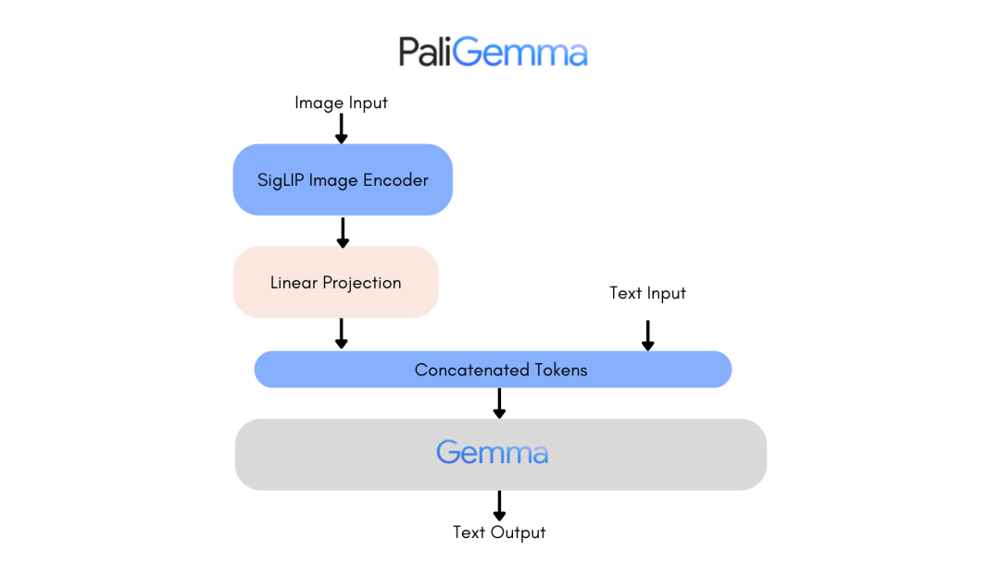
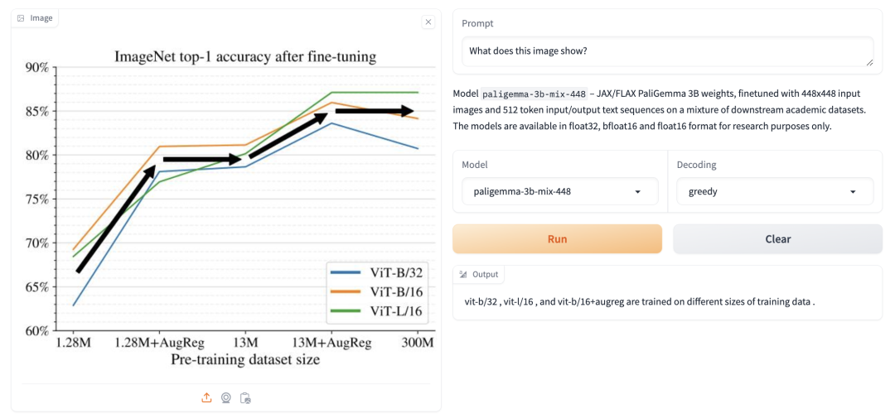
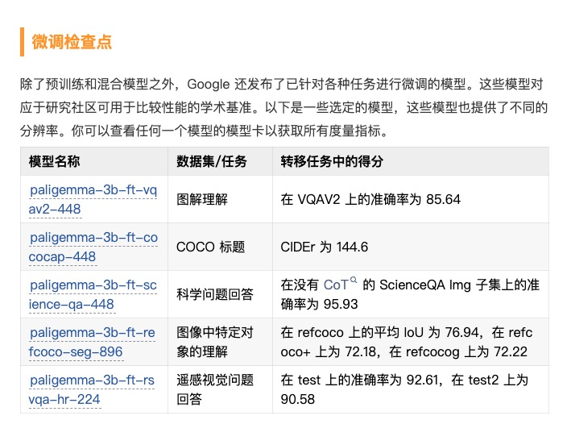
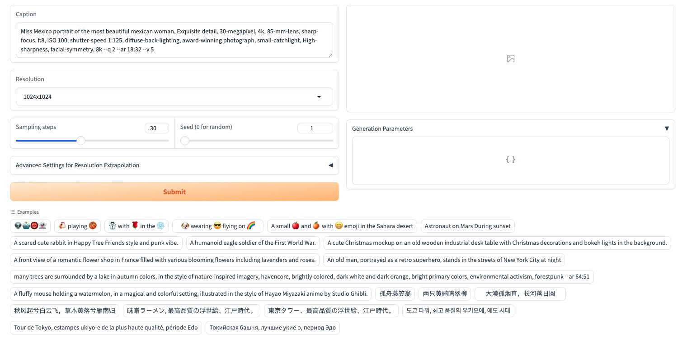

# PaliGemma

PaliGemma 是 Google 推出的新一代视觉语言模型家族，能够接收图像与文本输入并生成文本输出。

Google 团队已推出三种类型的模型：预训练 (PT) 模型、混合模型和微调 (FT) 模型，这些模型分辨率各异，提供多种精度以便使用。

PaliGemma (Github) 是一系列具有视觉和语言处理能力的模型，由SigLIP-So400m作为图像编码器和Gemma-2B作为文本解码器构成。

SigLIP 是一个顶尖的模型，可以同时解析图像和文本。它的工作方式类似于 CLIP，包括图像和文本编码器的联合训练。与PaLI-3相似，PaliGemma 模型在图像-文本数据上进行预训练后，可轻松针对下游任务 (如图像标题生成或指代分割) 进行微调。

Gemma是一个专为文本生成设计的解码器模型。通过线性适配器将 SigLIP 的图像编码功能与 Gemma 结合，使 PaliGemma 成为一个功能强大的视觉语言模型。

    Github
    https://github.com/google-research/bigvision/blob/main/bigvision/configs/proj/paligemma/README.md
    SigLIP-So400m
    https://hf.co/google/siglip-so400m-patch14-384
    Gemma-2B
    https://hf.co/google/gemma-2b
    PaLI-3
    https://arxiv.org/abs/2310.09199
    Gemma
    https://hf.co/blog/gemma

PaliGemma 的发布包括三种模型类型：

    PT 检查点：预训练模型，可用于下游任务的微调；
    混合检查点：已针对任务混合进行微调的 PT 模型，适合使用自由文本提示进行通用推理，仅限研究使用；
    FT 检查点：针对不同学术基准进行微调的模型，提供多种分辨率，仅限研究使用。
这些模型提供三种分辨率 (224x224、448x448、896x896) 和三种精度 (bfloat16、float16、float32) 。每个版本都包含给定分辨率和任务的检查点，每种精度有三个版本。每个版本的main分支包含float32检查点，而bfloat16和float16版本则包含相应精度的检查点。同时提供了与 transformers 兼容的模型，以及原始 JAX 实现的版本。

正如后续详细说明的，高分辨率模型因输入序列较长而需要更多内存。虽然它们可能有助于执行细粒度任务，如 OCR，但对大多数任务的质量提升较小。224 版本已足够应对大多数场景。

PaliGemma 是一个单轮视觉语言模型，不适用于对话场景，最佳应用是针对特定用例进行微调。

图像标题生成   
当被提示时，PaliGemma 能够为图像生成标题。你可以尝试使用混合检查点进行各种标题生成提示，看看它们如何反应。

视觉问题回答   
PaliGemma 能够回答关于图像的问题，只需将你的问题连同图像一起传入即可。

检测   
PaliGemma 可以使用detect [entity]提示来检测图像中的实体。它会以特殊的<loc[value]>令牌形式输出边界框坐标的位置，其中value是一个表示归一化坐标的数字。每次检测都由四个位置坐标代表——ymin, xmin, ymax, xmax，后跟检测到的框中的标签。要将这些值转换为坐标，你需要首先将数字除以 1024，然后将y乘以图像高度，x乘以宽度。这将给你提供相对于原始图像大小的边界框坐标。

指代表达分割   
PaliGemma 混合检查点也能够在给定 segment [entity] 提示时对图像中的实体进行分割。这称为指代表达分割，因为我们使用自然语言描述来引用感兴趣的实体。输出是位置和分割标记的序列。位置标记代表如上所述的一个边界框。分割标记可以进一步处理，生成分割掩模。

文档理解   
PaliGemma 混合检查点具备出色的文档理解与推理能力。   

混合了ocr在里面    
甚至有这种图标的检测解析，再一起训练？     
空间方位上下这种的训练我没接触过     

    Space 应用
    https://hf.co/spaces/google/paligemma
    bigvision 仓库
    https://github.com/google-research/bigvision

使用 Transformers   
你可以使用PaliGemmaForConditionalGeneration类来推断任何已发布的模型。只需使用内置的处理器预处理提示和图像，然后传递预处理输入进行生成。

    from transformers import AutoProcessor, PaliGemmaForConditionalGeneration

    model_id = "google/paligemma-3b-mix-224"
    model = PaliGemmaForConditionalGeneration.from_pretrained(model_id)
    processor = AutoProcessor.from_pretrained(model_id)

    prompt = "What is on the flower?"
    image_file = "https://huggingface.co/datasets/huggingface/documentation-images/resolve/main/bee.jpg?download=true"
    raw_image = Image.open(requests.get(image_file, stream=True).raw)
    inputs = processor(prompt, raw_image, return_tensors="pt")
    output = model.generate(**inputs, max_new_tokens=20)

    print(processor.decode(output[0], skip_special_tokens=True)[len(prompt):])

生成在自回归模式下正常工作，对整个输入 (image + bos + prompt + \n) 使用完整块注意力，并对生成的文本使用因果注意力掩码。

使用 bigvision    
PaliGemma 是在bigvision代码库中训练的。该代码库已用于开发如 BiT、原始 ViT、LiT、CapPa、SigLIP 等模型。

bigvision
https://github.com/google-research/bigvision

# Lumina Next Text-to-Image
经典的paliGemma替换实现        

Lumina-Next-T2I is a 2B 
Next-DiT
 model with 
Gemma-2B
 text encoder.

多语言    
搭一个现有的DiT    

经典的paliGemma替换实现     
和clip诞生到文生图应用路线一致    
多模态大模型的利用点就在这里   
相当于文生图是另外的下游任务，从另一种角度理解    
文生图对于文本编码器往往只是微调      
文生图的vae只是用作压缩，不具备生成和与文本交互能力，故对于此的diffusion中研究不多，只是用来压缩和复原的，能正常完成这两个任务就算是好的vae     
正常的vae对图像质量不会有影响，    

# 结尾