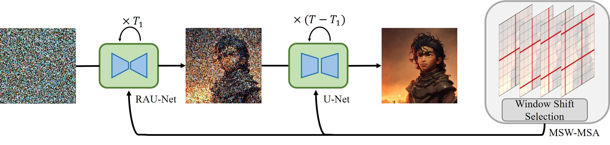
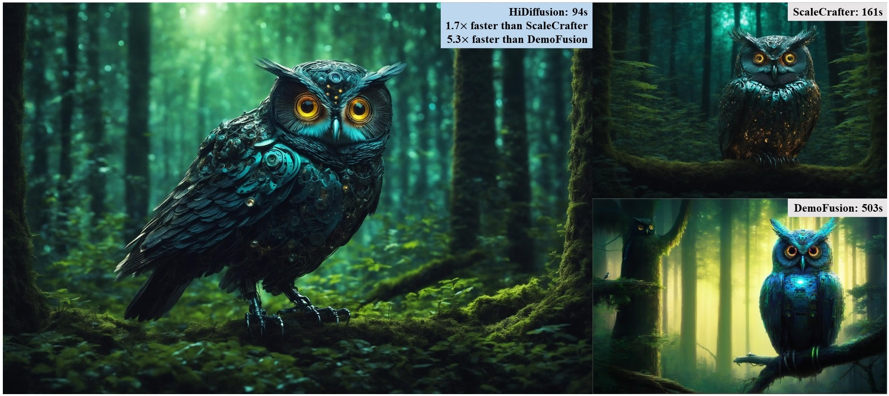
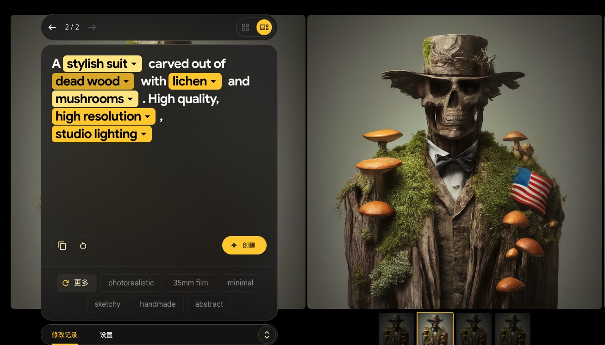
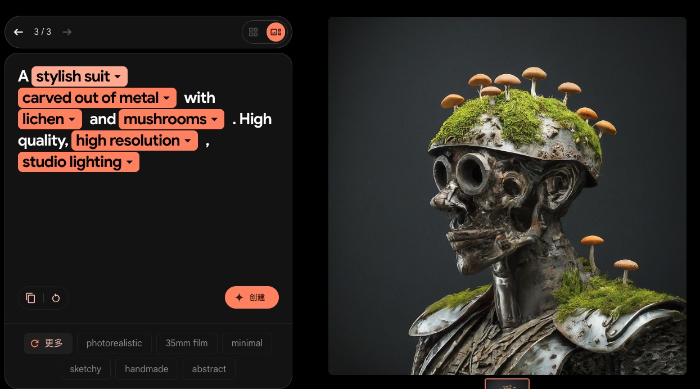
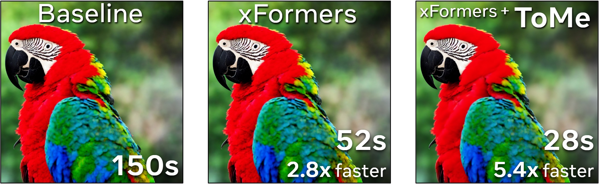
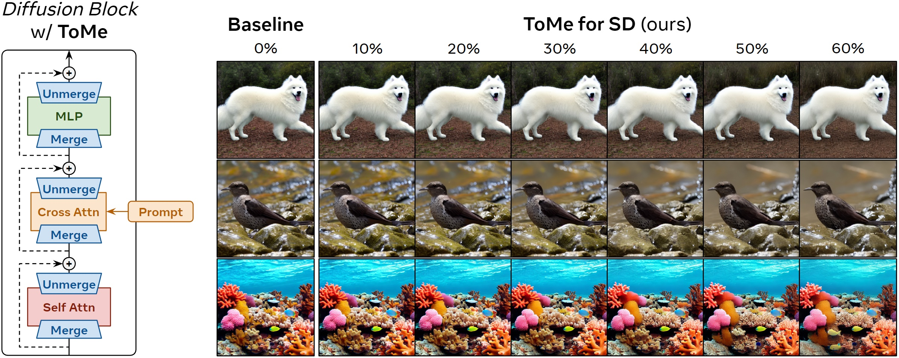

HiDiffusion能使得推理速度能有40%的提升    
HiDiffusion(SDXL base 1.0)能在2048分辨率下有很好的效果，HiDiffusion(SD1.5或SD2.1)在1024的分辨率下有较好效果     
4096用不了     

💡 HiDiffusion: Unlocking Higher-Resolution Creativity and Efficiency in Pretrained Diffusion Models

# 和精绘比有什么优势？
速度优势？   
质量呢？    

# 论文信息
旷视   
MEGVII Technology   

[Submitted on 29 Nov 2023 (v1), last revised 29 Apr 2024 (this version, v2)]    
HiDiffusion: Unlocking Higher-Resolution Creativity and Efficiency in Pretrained Diffusion Models    

2024.5.7 - 💥 支持图像到图像任务，请参见此处。

2024.4.16 - 💥 发布源代码。

📢 支持的型号
✅稳定扩散 XL
✅稳定扩散 XL Turbo
✅稳定扩散 v2
✅稳定扩散 v1
注意：HiDiffusion 还支持基于这些存储库的下游扩散模型，例如Ghibli-Diffusion、Playground等。

# 原理
直接从预训练的扩散模型生成更高分辨率的图像会遇到不合理的对象重复并成倍增加生成时间。在本文中，我们发现对象重复源于 U-Net 深层块中的特征重复。同时，我们确定了 U-Net 顶部块中自注意力冗余的延长生成时间。为了解决这些问题，我们提出了一个名为 HiDiffusion 的免调整高分辨率框架。具体来说，HiDiffusion 包含分辨率感知 U-Net (RAU-Net)，可动态调整特征图大小以解决对象重复问题，并采用改进的移动窗口多头自注意力 (MSW-MSA)，利用优化的窗口注意力来减少计算量。我们可以将 HiDiffusion 集成到各种预训练的扩散模型中，将图像生成分辨率甚至扩展到 4096x4096，推理速度是以前方法的 1.5-6 倍。大量的实验表明，我们的方法可以解决对象重复和繁重的计算问题，在更高分辨率的图像合成任务上实现最先进的性能。

# 使用
为什么选择 HiDiffusion    
一种 免训练方法，可提高预训练扩散模型的分辨率和速度。   
设计为即插即用实施。只需添加一行代码即可将其集成到扩散管道中！   
支持各种任务，包括文本到图像、图像到图像、修复。   

# 效果

# 其他
## Ghibli-Diffusion
nitrosocke/Ghibli-Diffusion

这是经过微调的稳定扩散模型，根据吉卜力工作室的现代动画故事片中的图像进行训练。在提示中使用标记ghibli 风格来达到效果。

hibli style beautiful Caribbean beach tropical (sunset) - Negative prompt: soft blurry

该模型由 ShivamShrirao 使用基于扩散器的 dreambooth 训练进行训练，使用先验保留损失和训练文本编码器标志，分 15,000 个步骤。

一年前的

## image3 imageFX
    
    

## ToDo 
大约提升40%的速度    
不支持论文说的1536和2048的分辨率   
但是感觉细节没那么好，如头发阴影      

https://github.com/feffy380/sd-webui-token-downsampling

[Submitted on 21 Feb 2024 (v1), last revised 8 May 2024 (this version, v3)]    
ToDo: Token Downsampling for Efficient Generation of High-Resolution Images

https://arxiv.org/abs/2402.13573

标记下采样以高效生成高分辨率图像     
伊桑·史密斯、纳扬·萨克塞纳、阿宁达·萨哈    
注意力机制对于图像扩散模型至关重要，然而，它们的二次计算复杂度限制  their quadratic computational complexity limits 了我们可以在合理的时间和内存约束内处理的图像大小。本文探讨了密集注意力在生成图像模型中的重要性，这些模型通常包含冗余特征，因此适合使用稀疏注意力机制。我们提出了一种新的无需训练的方法 ToDo，该方法依赖于键和值标记的标记下采样，以将稳定扩散推理速度提高 2 倍（常见尺寸），将 2048x2048 等高分辨率提高 4.5 倍或更多。我们证明，我们的方法在平衡高效吞吐量和保真度方面优于以前的方法。

https://github.com/kohya-ss/sd-scripts/pull/1151

标记下采样是一种有损优化，可显著加快推理和训练速度。它试图通过仅在注意操作中对 K 和 V 进行下采样（Q 被保留）来避免标记合并    
的质量损失，并用简单的下采样代替昂贵的标记相似度计算。 在训练期间应用优化似乎比推理时质量损失要小，因此我能够大幅增加下采样量而不会产生负面影响。

lora

我使用的是 AMD GPU。根据一些用户报告，使用 xformers 的 Nvidia 上的加速效果不那么显著(20%)。ToDo 可能只是在我的情况下缩小差距，您可能无法实现下面报告的相同加速。我欢迎 Nvidia 用户提供基准测试）

使用 2 的下采样因子和 768px 的分辨率，我获得了 2 倍的 SD1.x LoRA 训练加速。    
使用 max_downsample=2 的下采样因子 4 让我获得了更大的 3.2 倍加速，基本上没有质量损失。SDXL
的好处较少，因为它的架构已经更高效，但我仍然看到在 1024px 下采样因子 2 时加速约 1.3 倍，使用因子 4 时加速 1.7 倍。     
在更高的分辨率下，潜在的加速更大。

--todo_factor：（浮点数）token 下采样因子 > 1。unet 的自注意力层的输入会以此因子缩小。建议 2-4。可以指定多个值来覆盖不同深度的因子。    
--todo_max_depth：（[1, 2, 3, 4]）应用 ToDo 的最大深度。SDXL 的最大深度为 2。建议使用 1 或 2。默认值根据传递给 的值的数量自动检测todo_factor。

示例用法：    
--todo_factor 4 --todo_max_depth 2
与    
--todo_factor 4 4

加载模型时会修补 unet，因此优化应该会自动与所有训练脚本配合使用，但我只测试了 train_network.py 和 sdxl_train_network.py。     
下采样操作是使用 pytorch hooks 实现的，因此模型保存应该不受影响。

    token downsampling对训练速度有20%左右的提升
    使用token downsampling后出图效果没有很大的影响
    参数设置上分为todo_factor(一般设为2或者4)和todo_max_depth（一般设为2，sdxl模型不能超过2）

token downsampling是对token merging的改进

## ToMe

构图改变

https://github.com/SLAPaper/a1111-sd-webui-tome    

Token Merging for Stable Diffusion

Using nothing but pure python and pytorch, ToMe for SD speeds up diffusion by merging redundant tokens.

[Submitted on 30 Mar 2023]    
Token Merging for Fast Stable Diffusion

开放词汇扩散模型永远改变了图像生成的格局。然而，这些模型的核心是使用变换器，这会使生成速度变慢。虽然已经出现了更好的实现来提高这些变换器的吞吐量，但它们仍然要评估整个模型。在本文中，我们通过合并冗余标记来利用生成图像中的自然冗余，从而加快扩散模型的速度。在对标记合并 (ToMe) 进行一些针对扩散的改进后，我们的稳定扩散 ToMe 可以将现有稳定扩散模型中的标记数量减少多达 60%，同时仍能生成高质量图像而无需任何额外训练。在此过程中，我们将图像生成速度提高了 2 倍，并将内存消耗降低了 5.6 倍。此外，这种加速与 xFormers 等高效实现相结合，对质量的影响最小，同时对于大图像的速度提高了 5.4 倍。代码可在此 https URL处获得。

[Submitted on 17 Oct 2022 (v1), last revised 1 Mar 2023 (this version, v3)]    
Token Merging: Your ViT But Faster
Daniel Bolya, Cheng-Yang Fu, Xiaoliang Dai, Peizhao Zhang, Christoph Feichtenhofer, Judy Hoffman

我们引入了标记合并 (ToMe)，这是一种无需训练即可提高现有 ViT 模型吞吐量的简单方法。ToMe 使用通用的轻量级匹配算法在 Transformer 中逐渐组合相似的标记，该算法与剪枝一样快，但更准确。现成的 ToMe 可以在图像上将最先进的 ViT-L @ 512 和 ViT-H @ 518 模型的吞吐量提高 2 倍，在视频上将 ViT-L 的吞吐量提高 2.2 倍，而每种情况下准确度仅下降 0.2-0.3%。ToMe 还可以在训练期间轻松应用，在实践中将视频 MAE 微调的训练速度提高 2 倍。使用 ToMe 进行训练进一步最大限度地减少了准确度下降，导致音频上的 ViT-B 吞吐量提高 2 倍，而 mAP 仅下降 0.4%。定性地讲，我们发现 ToMe 将物体各个部分合并为一个标记，即使是在多帧视频中也是如此。总体而言，ToMe 的准确性和速度在图像、视频和音频方面可与最先进的技术相媲美。

Token Merging ( ToMe ) 通过合并冗余 token来加速 transformer ，这意味着 transformer 需要做更少的工作。我们巧妙地将其应用于 Stable Diffusion 中的底层 transformer 块，以最大限度地减少质量损失，同时保留大部分加速和内存优势。SD 的 ToMe不需要训练，对于任何 Stable Diffusion 模型来说，它应该是开箱即用的。

注意：这是一个有损过程，因此图像会发生变化，理想情况下变化不大。以下是使用 Stable Diffusion v1.5 在 4090 GPU 上使用 fp16 以 50 PLMS 步骤生成 ImageNet-1k 类的 512x512 图像时FID分数与时间和内存使用情况（越低越好）的结果：

即使合并了超过一半的 token（60%！），SD 版 ToMe 仍能生成接近原始图像，同时速度提高2 倍，内存占用减少约 5.7 倍。此外，ToMe 并不是另一种高效的转换器模块重新实现。相反，它实际上减少了生成图像所需的总工作量，因此它可以与高效的实现配合使用（参见用法）。

    [2023.04.02] ToMe for SD 现在可以通过 pip 作为tomesd获得。感谢 @mkshing！
    [2023.03.31] ToMe for SD 现已支持扩散器。感谢@JunnYu 和@ExponentialML！
    [2023.03.30]首次发布。

此 repo 包含修补现有 Stable Diffusion 环境的代码。目前，我们支持以下实现：

    稳定扩散 v2
    稳定扩散 v1
    潜伏扩散
    扩散器
    可能还有其他
注意：这也支持大多数使用这些存储库的下游 UI。

tomesd.apply_patch(model, ratio=0.5)

tomesd.apply_patch(model, ratio=0.9, sx=4, sy=4, max_downsample=2) 

tomesd.remove_patch(model)

## CutDiffusion

[提交日期：2024 年 4 月 23 日]     
CutDiffusion：一种简单、快速、廉价且强大的扩散外推方法

CutDiffusion: A Simple, Fast, Cheap, and Strong Diffusion Extrapolation Method

将大型预训练的低分辨率扩散模型转换为更高分辨率的需求，即扩散外推，可显著提高扩散的适应性。我们提出了无需调整的 CutDiffusion，旨在简化和加速扩散外推过程，使其更经济实惠并提高性能。CutDiffusion 遵循现有的逐块外推，但将标准块扩散过程分为专注于全面结构去噪的初始阶段和专注于特定细节细化的后续阶段。全面的实验凸显了 CutDiffusion 的众多强大优势：（1）简单的方法构建，无需第三方参与即可实现简洁的高分辨率扩散过程；（2）通过单步高分辨率扩散过程实现快速的推理速度，并且需要更少的推理块；（3）由于逐块推理和全面结构去噪期间的块数更少，GPU 成本低廉；（4）强大的生成性能，源于对特定细节细化

林明宝，林志航，詹文懿，曹柳娟，季蓉蓉

https://github.com/lmbxmu/CutDiffusion

# 结尾