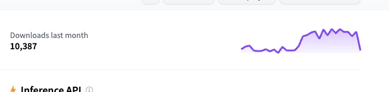

HiDiffusion能使得推理速度能有40%的提升    
HiDiffusion(SDXL base 1.0)能在2048分辨率下有很好的效果，HiDiffusion(SD1.5或SD2.1)在1024的分辨率下有较好效果     
4096用不了     

💡 HiDiffusion: Unlocking Higher-Resolution Creativity and Efficiency in Pretrained Diffusion Models

# 和精绘比有什么优势？
速度优势？   
质量呢？    

# 论文信息
旷视   
MEGVII Technology   

[Submitted on 29 Nov 2023 (v1), last revised 29 Apr 2024 (this version, v2)]    
HiDiffusion: Unlocking Higher-Resolution Creativity and Efficiency in Pretrained Diffusion Models    

2024.5.7 - 💥 支持图像到图像任务，请参见此处。

2024.4.16 - 💥 发布源代码。

📢 支持的型号
✅稳定扩散 XL
✅稳定扩散 XL Turbo
✅稳定扩散 v2
✅稳定扩散 v1
注意：HiDiffusion 还支持基于这些存储库的下游扩散模型，例如Ghibli-Diffusion、Playground等。

# 原理
直接从预训练的扩散模型生成更高分辨率的图像会遇到不合理的对象重复并成倍增加生成时间。在本文中，我们发现对象重复源于 U-Net 深层块中的特征重复。同时，我们确定了 U-Net 顶部块中自注意力冗余的延长生成时间。为了解决这些问题，我们提出了一个名为 HiDiffusion 的免调整高分辨率框架。具体来说，HiDiffusion 包含分辨率感知 U-Net (RAU-Net)，可动态调整特征图大小以解决对象重复问题，并采用改进的移动窗口多头自注意力 (MSW-MSA)，利用优化的窗口注意力来减少计算量。我们可以将 HiDiffusion 集成到各种预训练的扩散模型中，将图像生成分辨率甚至扩展到 4096x4096，推理速度是以前方法的 1.5-6 倍。大量的实验表明，我们的方法可以解决对象重复和繁重的计算问题，在更高分辨率的图像合成任务上实现最先进的性能。

# 使用
为什么选择 HiDiffusion    
一种 免训练方法，可提高预训练扩散模型的分辨率和速度。   
设计为即插即用实施。只需添加一行代码即可将其集成到扩散管道中！   
支持各种任务，包括文本到图像、图像到图像、修复。   

# 效果

# 其他
## Ghibli-Diffusion
nitrosocke/Ghibli-Diffusion

这是经过微调的稳定扩散模型，根据吉卜力工作室的现代动画故事片中的图像进行训练。在提示中使用标记ghibli 风格来达到效果。

hibli style beautiful Caribbean beach tropical (sunset) - Negative prompt: soft blurry

该模型由 ShivamShrirao 使用基于扩散器的 dreambooth 训练进行训练，使用先验保留损失和训练文本编码器标志，分 15,000 个步骤。

一年前的

# 结尾