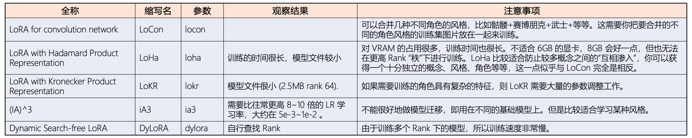
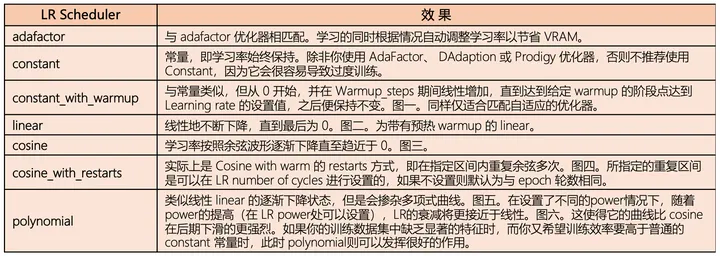
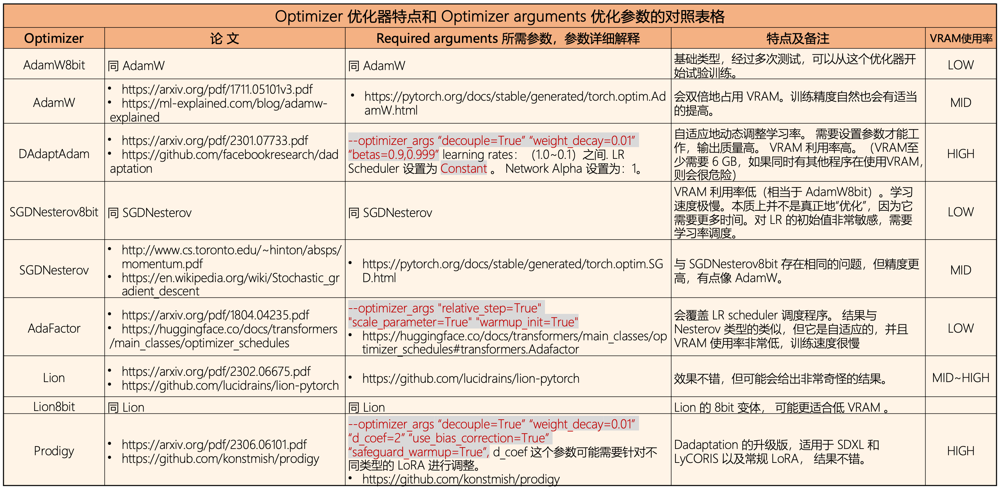
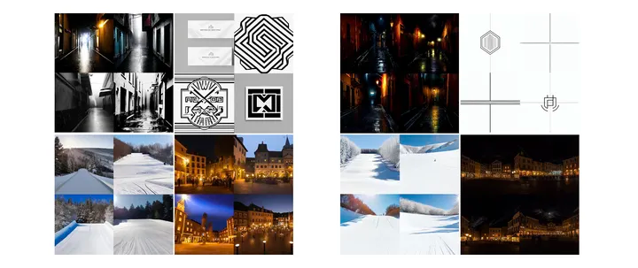

This repository contains the scripts for:

    DreamBooth training, including U-Net and Text Encoder
    Fine-tuning (native training), including U-Net and Text Encoder
    LoRA training
    Textual Inversion training
    Image generation
    Model conversion (supports 1.x and 2.x, Stable Diffision ckpt/safetensors and Diffusers)

native training   
这是最方便的。     
相当于直接使用sd原版仓库训练    

# DreamBooth training
这里的不能lora

# Fine-tuning 

https://github.com/kohya-ss/sd-scripts/blob/main/docs/train_README-zh.md

https://github.com/kohya-ss/sd-scripts/blob/main/docs/fine_tune_README_ja.md

微调兼容NovelAI提出的学习方法、自动字幕、标签、Windows + VRAM 12GB（用于SD v1.x）环境等。这里，微调是指使用图像和字幕学习模型（不包括 LoRA、文本反转或超网络）

最后更新说明文档去年这个时候5.7     
训练脚本最后更新上个月    

使用扩散器对稳定扩散的 U-Net 进行微调。对应NovelAI文章中的以下改进（我使用NovelAI的代码作为Aspect Ratio Bucketing的参考，但最终代码都是原创的）。

    使用 CLIP（文本编码器）倒数第二层的输出而不是最后一层。
    以非方形分辨率学习（纵横比分桶）。
    将令牌长度从 75 扩展到 225。
    使用 BLIP（自动创建字幕）添加字幕，使用 DeepDanbooru 或 WD14Tagger 自动标记。
    它还支持超网络学习。
    与稳定扩散 v2.0（基础版和 768/v）兼容。
    通过提前获取 VAE 输出并将其保存到磁盘，我们的目标是节省内存并加快学习速度。
    默认情况下不执行文本编码器学习。仅学习 U-Net 来微调整个模型似乎很常见（NovelAI 似乎也这样做）。文本编码器也可以作为一个选项来学习。

diffusers好像并不分桶    
至少对于sd1.5是不分的   
去年八九月份的比赛其实也能这样搞，但是用了diffusers的   

CLIP（文本编码器）将文本转换为特征，以便在图像中反映提示。稳定扩散使用 CLIP 最后一层的输出，但您可以将其更改为使用倒数第二层的输出。据NovelAI称，这将更准确地反映提示。也可以按原样使用最后一层的输出。

*稳定扩散 2.0 默认使用倒数第二层。不要指定clip_skip 选项。

非方形分辨率进行训练    
稳定扩散在 512*512 下进行训练，但它也在 256*1024 和 384*640 等分辨率下进行训练。预计这将减少被裁剪的部分数量，并且将更准确地了解提示和图像之间的关系。学习分辨率是通过在不超过作为参数给出的分辨率（=内存使用）面积的范围内以 64 像素为单位垂直和水平调整而创建的。      
现在好像可以32     

在机器学习中，让所有输入大小相同是很常见的，但没有特别的限制，实际上只要在同一批中使它们相同就可以了。 NovelAI的“分桶”似乎是指通过根据长宽比学习分辨率来对训练数据进行预分类。然后，通过将每个桶中的图像创建一个批次，从而统一批次图像的大小。

令牌长度从 75 扩展到 225    
稳定扩散最多有 75 个令牌（77 个令牌，包括开始和结束），但我们将其扩展到 225 个令牌。但是，CLIP 接受的最大长度是 75 个令牌，因此在 225 个令牌的情况下，只需将其分为三部分，调用 CLIP，然后连接结果即可。

*我不确定这是否是一个理想的实现。目前看来是有效的。尤其是2.0中，没有实现可以参考，所以我自己实现了。

*Automatic1111 的 Web UI 似乎在划分时考虑了逗号，但就我而言，我不这样做，只是进行简单的划分。

关于学习率   
1e-6到5e-6似乎很常见。还可以查看其他微调示例。    
--learning_rate=5e-6 

train_text_encoder   
还将研究文本编码器。内存使用量会略有增加。

在正常的微调中，Text Encoder 不是学习目标（可能是因为 U-Net 被训练为跟随 Text Encoder 的输出），但是当训练数据数量较少时，Text Encoder 端会像 DreamBooth 中那样进行训练看来也有效。

# SDXL train

sdxl_train.py 现在支持每个 U-Net 块的不同学习率。用--block_lr选项指定。指定 23 个以逗号分隔的值，例如--block_lr 1e-3,1e-3 ... 1e-3.    
23 个值对应于0: time/label embed, 1-9: input blocks 0-8, 10-12: mid blocks 0-2, 13-21: output blocks 0-8, 22: out.

prepare_buckets_latents.py现在支持 SDXL 微调。

sdxl_train_network.py是 SDXL 的 LoRA 训练脚本。用法几乎和 一样train_network.py。

--cache_text_encoder_outputs和--cache_text_encoder_outputs_to_disk：缓存文本编码器的输出。此选项对于减少 GPU 内存使用很有用。此选项不能与随机排列或删除字幕的选项一起使用。    
--no_half_vae：禁用半精度（混合精度）VAE。 SDXL 的 VAE 在某些情况下似乎会产生 NaN。此选项对于避免 NaN 很有用。   

--min_timestep并将--max_timestep选项添加到每个训练脚本中。这些选项可用于以不同时间步长训练 U-Net。默认值为 0 和 1000。

sdxl_train_textual_inversion.py是 SDXL 文本反转训练的脚本。用法几乎和 一样train_textual_inversion.py。

--cache_text_encoder_outputs不支持。   
字幕有两种选择：   
带字幕的训练。所有标题必须包含标记字符串。令牌字符串被多个令牌替换。   
使用--use_object_template或--use_style_template选项。标题是从模板生成的。现有的标题将被忽略。    

SDXL 实用程序脚本
tools/cache_latents.py被添加。该脚本可用于将潜在变量提前缓存到磁盘。

这些选项几乎与“sdxl_train.py”相同。使用方法请参见帮助信息。
请按如下方式启动脚本： accelerate launch  --num_cpu_threads_per_process 1 tools/cache_latents.py ...    
该脚本应该适用于多 GPU，但尚未在我的环境中进行测试。
tools/cache_text_encoder_outputs.py被添加。该脚本可用于提前将文本编码器输出缓存到磁盘。    

选项与cache_latents.py和几乎相同sdxl_train.py。使用方法请参见帮助信息。   
sdxl_gen_img.py被添加。该脚本可用于使用 SDXL 生成图像，包括 LoRA、Textual Inversion 和 ControlNet-LLLite。使用方法请参见帮助信息。

SDXL 的默认分辨率为 1024x1024。    
可以使用 24GB GPU 内存、批量大小为 1 进行微调。对于 24GB GPU，建议使用以下选项来使用 24GB GPU 内存进行微调：

    仅训练 U-Net。
    使用梯度检查点。
    使用--cache_text_encoder_outputs选项和缓存潜在变量。
    使用 Adafactor 优化器。 RMSprop 8bit 或 Adagrad 8bit 可能有效。 AdamW 8bit 似乎不起作用。

LoRA 训练可以使用 8GB GPU 内存（推荐 10GB）完成。为了减少 GPU 内存使用，建议使用以下选项：   

    仅训练 U-Net。
    使用梯度检查点。
    使用--cache_text_encoder_outputs选项和缓存潜在变量。
    使用 8 位优化器或 Adafactor 优化器之一。
    使用较低的暗度（8GB GPU 为 4 到 8）。

--network_train_unet_only强烈建议选择 SDXL LoRA。由于SDXL有两个文本编码器，因此训练的结果将是意想不到的。   
PyTorch 2 使用的 GPU 内存似乎比 PyTorch 1 略少。   
--bucket_reso_steps可以设置为 32 而不是默认值 64。小于 32 的值将不适用于 SDXL 训练。    

原来是sdxl的改进     

虽然他们不是自己写的    
但是知道这个消息还是因为他们    
所以还是强的    
就是说信息差的力量已经产生了远大于代码coding能力的影响   

ControlNet-LLLite    
添加了 ControlNet-LLLite，这是一种使用 SDXL 进行 ControlNet 的新颖方法。有关详细信息，请参阅文档。

SDXL 的文本反转嵌入格式    

    from safetensors.torch import save_file

    state_dict = {"clip_g": embs_for_text_encoder_1280, "clip_l": embs_for_text_encoder_768}
    save_file(state_dict, file)

具有固定学习率的 Adafactor 优化器设置示例：

    optimizer_type = "adafactor"
    optimizer_args = [ "scale_parameter=False", "relative_step=False", "warmup_init=False" ]
    lr_scheduler = "constant_with_warmup"
    lr_warmup_steps = 100
    learning_rate = 4e-7 # SDXL original learning rate

# ControlNet-LLLite

ControlNet-LLLite 是ControlNet的轻量级版本。它是受 LoRA 启发、具有轻量级结构的“LoRA Like Lite”。目前仅支持 SDXL。

示例权重文件可在此处获取：https://huggingface.co/kohya-ss/controlnet-lllite

ComfyUI 的自定义节点可用：https://github.com/kohya-ss/ControlNet-LLLite-ComfyUI

示例图像位于本页末尾。

模型结构        
单个 LLLite 模块由将调节图像映射到潜在空间的调节图像嵌入和结构类似于 LoRA 的小型网络组成。 LLLite模块以与LoRA相同的方式添加到U-Net的Linear和Conv中。详细请参考源码。    
A single LLLite module consists of a conditioning image `embedding` that maps a conditioning image to a `latent space` and a small network with a structure similar to LoRA.

由于推理环境的限制，目前仅添加了CrossAttention（attn1 q/k/v，attn2 q）。

准备数据集     
除了正常的DreamBooth方法数据集外，请将调理图像存储在指定的目录中conditioning_data_dir。调节图像必须与训练图像具有相同的基本名称。调节图像将自动调整为与训练图像相同的大小。调节图像不需要字幕文件。

目前，random_crop 无法使用。    

对于训练数据，最简单的方法是使用合成数据集，其中原始模型生成的图像作为训练图像，处理后的图像作为条件图像（数据集的质量可能有问题）。合成数据集的具体方法见下文。    

请注意，如果您使用与原始模型具有不同艺术风格的图像作为训练图像，则模型不仅必须学习控件，还必须学习艺术风格。 ControlNet-LLLite容量较小，不适合学习艺术风格。在这种情况下，请按如下所述增加维度数。

跑步sdxl_train_control_net_lllite.py。您可以使用 指定调节图像嵌入的尺寸--cond_emb_dim。您可以使用 指定类 LoRA 模块的等级--network_dim。其他选项与 相同sdxl_train_network.py，但--network_module不是必需的。

由于训练过程中会使用大量内存，因此请启用缓存和梯度检查点等节省内存的选项。将 BFloat16 与选项一起使用也很有效--full_bf16（需要 RTX 30 系列或更高版本的 GPU）。它已被证实可与 24GB VRAM 配合使用。

对于示例 Canny，调节图像嵌入的维度为 32。类 LoRA 模块的等级也是 64。根据您所针对的调节图像的特征进行调整。

（Canny 示例可能相当困难。出于深度等原因，将其减少到大约一半可能会更好。）

以下是 .toml 配置的示例。

    pretrained_model_name_or_path = "/path/to/model_trained_on.safetensors"
    max_train_epochs = 12
    max_data_loader_n_workers = 4
    persistent_data_loader_workers = true
    seed = 42
    gradient_checkpointing = true
    mixed_precision = "bf16"
    save_precision = "bf16"
    full_bf16 = true
    optimizer_type = "adamw8bit"
    learning_rate = 2e-4
    xformers = true
    output_dir = "/path/to/output/dir"
    output_name = "output_name"
    save_every_n_epochs = 1
    save_model_as = "safetensors"
    vae_batch_size = 4
    cache_latents = true
    cache_latents_to_disk = true
    cache_text_encoder_outputs = true
    cache_text_encoder_outputs_to_disk = true
    network_dim = 64
    cond_emb_dim = 32
    dataset_config = "/path/to/dataset.toml"

推理   
如果您想使用脚本生成图像，请运行sdxl_gen_img.py.您可以指定 LLLite 模型文件--control_net_lllite_models。尺寸是从模型文件中自动获取的。

使用 指定用于推理的调节图像--guide_image_path。由于不进行预处理，因此如果是Canny，则指定经过Canny处理的图像（黑底白线）。--control_net_preps、--control_net_weights、 和--control_net_ratios不受支持。

https://github.com/kohya-ss/sd-scripts/blob/main/docs/train_lllite_README.md

# LoRA training
通常情況下，LoRA只适用于Linear和Kernel大小为1x1的Conv2d，但也可以將其擴展到Kernel大小为3x3的Conv2d。

支持以下两种类型。以下是本仓库中自定义的名称。

LoRA-LierLa：(用于 Li n e a r La yers 的 LoRA，读作 "Liela")

适用于 Linear 和卷积层 Conv2d 的 1x1 Kernel 的 LoRA

LoRA-C3Lier：(用于具有 3x3 Kernel 的卷积层和 Li n e a r 层的 LoRA，读作 "Seria")

除了第一种类型外，还适用于 3x3 Kernel 的 Conv2d 的 LoRA

与 LoRA-LierLa 相比，LoRA-C3Lier 可能会获得更高的准确性，因为它适用于更多的层。

在训练时，也可以使用 DyLoRA（将在后面介绍）。

LoRA-LierLa可以用于AUTOMATIC1111先生的Web UI LoRA功能。

要使用LoRA-C3Liar并在Web UI中生成，请使用此处的WebUI用extension。

在此存储库的脚本中，您还可以预先将经过训练的LoRA模型合并到Stable Diffusion模型中。

请注意，学习率应该比通常的DreamBooth或fine tuning要高，建议指定为1e-4至1e-3左右。

--network_train_unet_only     
仅启用与U-Net相关的LoRA模块。在类似fine tuning的学习中指定此选项可能会很有用。

--network_train_text_encoder_only    
仅启用与Text Encoder相关的LoRA模块。可能会期望Textual Inversion效果。

## 训练比较

locon细节优于lora优于loha优于lokr   
也有可能是超参数设置问题   

loha和lokr效果都比较好，基本都能学习到人物的特点，但是lokr会比loha训练速度更快，参数量更小

Dylora出图的效果最差    
IA^ 3的训练速度非常快，得到的模型小（不到1MB），但是出图在人物细节上稍差些

lokr    
Kronecker乘积   

Dylora不再使用单一的秩来训练lora块（Dynamic），而是使用秩的区间r\in\text{Range}[r_{min},r_{max}]，同时可以避免对选择最优秩搜索的消耗（search-free）

dora   
对原来的权重矩阵分解为幅度和方向上的分量然后进行微调    
dora在低秩上提升更明显些   
8秩时候对上述所有都有提升，构图和畸形上   

## 风格训练
    "--resolution=1024,1024",
        "--max_train_epochs=40",
        "--learning_rate=2e-5",
        "--lr_scheduler=constant_with_warmup",

    "--max_token_length=225",
        "--caption_extension=.txt",

    "--vae_batch_size=4",
        "--bucket_reso_steps=32",

    "--clip_skip=2",
        "--prior_loss_weight=0",
        "--network_dim=128",
        "--network_alpha=64",

    "--shuffle_caption",
        "--noise_offset=0.1",
        "--adaptive_noise_scale=0.0375",
        "--noise_offset_random_strength",
    "conv_dim=1",
        "conv_alpha=1",
        "use_tucker=True",
        "dora_wd=True",
        "bypass_mode=True",

    "--use_8bit_adam",
        "--network_train_unet_only",
        "--unet_lr=2e-5",
        "--text_encoder_lr=1e-6",

    "--lr_scheduler_num_cycles=1",
        "--enable_bucket",
        "--min_bucket_reso=512",
        "--max_bucket_reso=1536",
        "--mixed_precision=bf16",
        "--network_module=lycoris.kohya",
        "--gradient_accumulation_steps=1",
        "--lr_warmup_steps=100",
        "--caption_dropout_every_n_epochs=0",
        "--caption_dropout_rate=0",
        "--caption_tag_dropout_rate=0.1",
        "--xformers"

## lycoris
LyCORIS：英文全称 LoRA beyond Conventional methods, Other Rank adaptation Implementations for Stable diffusion. ，可以翻译为：用另一种超越常规的 Rank adaptation “秩自适应”的方法来实现稳定扩散。

2023.12

可以说 LyCORIS 是 LoRA 的思路的进一步扩展，是升级换代的 LoRA，通常比 LoRA 更有表现力，可以捕捉更多的训练图像的细节。LyCORIS 属于一系列类 LoRA 方法的总称，目前至少分为以下几种：

    LoCon：LoRA for convolution network：将 LoRA 用于卷积网络的方法 。最初的 LoRA 在提出时是针对大语言模型中的 Attention layer “注意力层”的，相比之下 LoCon 是将 LoRA 的方法拓展到了扩散模型的 convolutional “卷积层” 。因为在扩散模型中卷积层也起着十分重要作用。LoCon 方法的提出是基于一种思维模式，即在模型微调过程中能使更多的层参与进来，其生成的图像的质量和保真度等性能应该会更好。因此 LoCon 比传统的 LoRA 更强大，尤其是在合并角色风格方面做得更好，LoCon 将不同的角色风格地转化为单个主题，而且非常灵活。

    LoHa：LoRA with Hadamard Product Representation：其中的 Hadamard Product 为阿达玛积（又译为哈达玛积、舒尔积（Schur product）或逐项积（entrywise product）），是一个逐项二元的运算。其输入为两个相同形状的矩阵，输出是具有同样形状的、各个位置的元素等于两个输入矩阵相同位置元素的乘积的矩阵，如下图例。此乘积归功于法国数学家雅克·阿达马与德国数学家伊赛·舒尔，并以其命名。LoHa 则基于阿达玛乘积的原理，把一个大矩阵分解为两个 LoRA，即四个低秩矩阵（如下图）。LoHa 与 LoRA 有类似的低参数优越性。（ 论文：https://arxiv.org/pdf/2108.06098.pdf）

    LoKR：LoRA with Kronecker Product：LokR 与 LoHA 几乎相同，只是使用了克罗内克积的原理。其中的 Kronecker Product 为克罗内克积，或叫矩阵直接积（ matrix direct product ），是对两个任意大小的矩阵进行运算，生成块矩阵的方法。其运算时的结构为：如果 A 是 m × n 矩阵，B 是 p × q 矩阵，则克罗内克积 A 点乘 B 是 pm × qn 分块矩阵，如下图例。

    DyLoRA：Dynamic Search-free LoRA： LoRA 的 Rank 秩数并不是越高越好，而是需要根据模型、数据集、任务目标等因素来寻找合适的 Rank。但寻找合适的 Rank 不是意见容易的事情。虽然 LoRA 具有参数的高效性 parameter-efficient, ，但它存在两个主要问题：首先，LoRA 文件的大小是固定的，在训练后无法修改，如果我们需要更改其中的 Rank 秩数，那么只能从头开始训练，在训练过程中调整 Rank 秩数然后再次生成新的模型。另外，优化并找寻到不同 Rank 秩数下的最优模型也是一个繁琐的过程。于是，一种称为 dynamic low-rank adaptation（DyLoRA） “动态低秩适应”的技术被提出来。DyLoRA 可以同时学习低于你指定的 Rank 的各个 Rank 的 LoRA，这便导致训练好的 DyLoRA 模型文件的 Rank 是可轻易调整的，因此当你想要选择最佳 Rank 秩时它非常有用且高效。同时，你还可以从 DyLoRA中提取出低于指定 Rank 的各个 Rank 的 LoRA 模型。在训练 DyLoRa 时对应的 Alpha 可以设置为 Rank/4~Rank/2，比如：Rank=128, Alpha=64 。并且原论文中建议设置 batch size = 1 。（论文： https://arxiv.org/pdf/2210.07558.pdf）

    LoRA-FA：一种 memory-efficient fine-tuning 内存高效的微调方法，可以减少激活内存，而不会降低模型性能。具体方法是，（定义用于更新 LoRA 分解出的两个低秩矩阵 A 和 B）。在微调过程中，冻结低秩矩阵 A 的权重，仅仅更新低秩矩阵 B 的权重，以此减少对 VRAM 占用的（单个 GPU 平均节省 VRAM 在 2~7G 之间），提高训练学习效率，并且不会降低性能。 LoRA-FA 的名称也因此而来，即 LoRA with Frozen-A （冻结低秩 A 矩阵的 LoRA）。（ http://export.arxiv.org/pdf/2308.03303）

    Kohya DyLoRA：一种专门用于 Kohya-ss Additional Network 插件的 DyLoRA 模型。它可以在 SD-WebUI 中通过该插件进行图像生成。目前该插件还不支持其他 LoRA。

    Kohya LoCon：一种专门用于 Kohya-ss Additional Network 插件的 LoCon 模型。它可以在 SD-WebUI 中通过该插件进行图像生成。目前该插件还不支持其他 LoRA。

在 Stable Diffusion 的模型训练领域，目前专门训练LoRA模型的有两种工具：

    Kohya_ss 是目前比较主流的产生 LoRA 的工具。 Kohya_ss GUI 是一个独立于 Stable Diffusion WebUI 的开源的程序。它可以帮助训练 LoRA、Dreambooth 和 Textual inversion 模型。（Github地址： https://github.com/bmaltais/kohya_ss）
    另一个方法是 Dreambooth 扩展插件。它在 Stable Diffusion WebUI 的 Extension 标签下可以找到直接安装的按钮，也可以去 Github 上安装（Github地址： https://github.com/d8ahazard/sd_dreambooth_extension）。

本文，主要以 Kohya_ss GUI 的界面设置为基础来讲解 LoRA 的训练过程。

https://github.com/bmaltais/kohya_ss

## lycoris-diag-oft
它通过训练应用于每层输出的正交变换来保持超球面能量。
根据原论文，该算法比LoRA收敛速度快，但仍需实验验证。

## 参数

在 Stable Diffusion 的模型训练领域，目前专门训练LoRA模型的有两种工具：

    Kohya_ss 是目前比较主流的产生 LoRA 的工具。 Kohya_ss GUI 是一个独立于 Stable Diffusion WebUI 的开源的程序。它可以帮助训练 LoRA、Dreambooth 和 Textual inversion 模型。（Github地址： https://github.com/bmaltais/kohya_ss）
    另一个方法是 Dreambooth 扩展插件。它在 Stable Diffusion WebUI 的 Extension 标签下可以找到直接安装的按钮，也可以去 Github 上安装（Github地址： https://github.com/d8ahazard/sd_dreambooth_extension）。

本文，主要以 Kohya_ss GUI 的界面设置为基础来讲解 LoRA 的训练过程。

2023.12已经很详细

https://github.com/bmaltais/kohya_ss

### Network Alpha（alpha for LoRA weight scaling）滑块

Network Alpha（alpha for LoRA weight scaling）滑块：0.1~1024数值选择。（实际上是 1~1024 取值）这一参数的引入是为了防止保存 LoRA 时权重四舍五入为 0，即下溢。由于 LoRA 的特殊结构，神经网络的权重值往往很小，如果变得太小，可能会变得与零无法区分，这则与没有学习到任何东西的结果是一样的。 因此，提出了这种方法，以使 LoRA 保持较大的权重值。在学习过程中，系统总是以恒定的速率将权重削弱一定的百分比，以使权重适当变小，但是削弱的步伐太激进则会下溢。Network Alpha 则决定了这个“权重削弱率”（ weight weakening rate ）。 权重削弱率是通过公式“Network_Alpha/Network_Rank”来表达的，值在 0 到 1 之间。 Network Alpha 值越小， “权重削弱率” 则越小，导致 LoRA 神经网络的权重值就会保存越大，训练的 LoRA 模型越有创造力。但是太小也不好，当到达了 Alpha 的默认值 1 时，则会与训练集风格差距太远。如果 LoRA 训练学习后的准确率不令人满意，则有可能是权重太小以至于崩溃为 0。在这种情况下，可以选择尝试降低 Alpha 值，以降低削弱率，从而增加权重值来解决。Alpha 的值应该设置得比 Rank 值小，如 Rank 的一半（适合训练人物 LoRA 模型），即 Rank 若为 64，Network Alpha 设置为 32 ，此时的情况下所使用的权重削弱率为 32/64 = 0.5 。如果 Network Alpha 和 Rank 具有相同的值，则该效果自动关闭。Alpha 不能高于 Rank 值，虽然可以指定更高的数字，但很可能会导致意外的 LoRA。另外，在设置 Network Alpha 时，需要考虑到对 LR 的影响。比如，权重削弱率为 0.5（设置 Alpha 为 32，DIM 为 64），这意味着实际 LR 仅为 LR 设置值的一半效果。

一般在网络上普遍的建议是 Alpha 的值是 Rank 的一半，且尽量都为 16 的倍数；

### buckets
    Enable buckets 复选框： “桶”，顾名思义就是“一个桶的容器”。 LoRA 的训练集图像不必具有统一的尺寸，但不同尺寸的图像不能同时进行训练。 因此，在学习之前，需要将图像按照大小分类到不同的“桶”中。尺寸一样图片放在同一个桶中，尺寸不同的图片放在不同的桶中。默认为勾选开启，即系统会自动把不同尺寸的图片放在不同的“桶”中。如果训练集的图像原本尺寸相同，你便可以关闭此选项，但保持打开状态并不会有任何影响；

    此选项，使得在准备训练集阶段特地将图片尺寸手动剪裁为 512*512、或 512*768 等等这样的工作变得毫无意义。因为，通过bucket “桶”这个概念可以很好地保留不同尺寸的图像，节省了事先准备的时间，更重要的是保留了图片中应有的细节。

    Minimum bucket resolution 最小桶分辨率滑块, Minimum size in pixel a bucket can be (>= 64)：64~4090数值选择。 桶最小分辨率，一般为 320，或 256；

    Maximum bucket resolution 最大桶分辨率滑块, Maximum size in pixel a bucket can be (>= 64)：64~4090 数值选择。 桶最大分辨率。一般为设定为 768 至 1024 。如果你有 1280 或 2048 或更大的图片，也可以，但不建议用超大图，最好之前用 PS 把图片手动降低分辨率；

### Keep n tokens
Keep n tokens 前n个token被保留滑块：0~32 数值。如果你的训练图像有描述文本文件，你可以通过 Shuffle caption 来随机打乱描述文本文件中以逗号分隔的“词组”（Shuffle caption “随机打乱描述词”会在后面详细解释）。 但是，如果在打乱时你想保留最靠前的几个“词组”不被打乱（因为开头的“词组”往往被视为此次训练的模型的特征词、触发词），此时则可以使用此选项指定将前几个“词组”保留在开头。

但实际上，无论你是否指定此项，文本文件的前 4 个 token 都将被保留不动，即不被随机打乱。

此项默认值为 0，即不保留任何“词组”固定在最前。

如果 Shuffle caption “随机打乱文本”选项为关闭状态，则此处的设置无效，即不打乱的情况下，所有描述文本文件的所有词组的位置都是固定的，此选项自然无效。

注意：此处所指的“词组”是指用逗号分隔开的单词、词组或句子。 即，无论逗号分隔的文本包含多少个单词，它都算作一个词组。例如： “black cat, eating, sitting”，则“black cat” 在此处为一个词。

### Clip skip
0~12 数值。Stable Diffusion 使用 “CLIP” 来进行提示词的文本的数字化编码。CLIP 也是一种深度神经网络，它由 12 个相似的层组成。文本（实际上是 token）最初通过这 12 个层转换为数字序列的表达，即向量形式的表达。在第 12 层，即最后一层输出出来的向量则被发送到 U-Net 网络中的 Attention 块进行处理。

然而，Novel AI 公司独立开发了一个模型，俗称 NAI，即”Novel AI 模型”，它采用了独特的架构，可以使向量在 CLIP 的第二层到最后一层的所有层都可以输出，而不仅仅是在最后一层处理后才输出。这种创新的机制也被 Stable Diffusion 所利用。

因此，“Clip skip”滑块在此处设置的数值，指定“从倒数第 几 层” skip 跳过后续层的处理，而直接输出向量给 U-Net。比如：此处设置为 2 ，则将 CLIP 的倒数第二层的输出向量发送到 U-Net。 如果为 1，则使用最后一层的输出向量，即视同为不指定。

如果用于训练的基础模型使用 NAI 模型，即 Novel AI 的模型（或 NAI 的混合模型），最好将此处设置为 2，因为 NAI 模型训练时是在 Clip skip= 2 的情况下进行的。

另外，根据经验：如果你选择基础模型是真实质感的，最好选择 Clip skip= 1，如果选择的基础模型是绘画与动漫质感的，最好选择 Clip skip= 2。

### Persistent data loader 
每个 epoch 轮训练时加载的所需数据将在本 epoch 轮后被丢弃，并在下一轮 epoch 前重新加载。 勾选此项则保留本 epoch 轮加载的数据。 很明显，勾选此选项将加快学习新一轮 epoch 的开始速度，但会消耗更多内存来临时保存数据（此功能仅限在 Windows 环境中有效）。

此选项默认为不勾选，即关闭。

### Noise offset type 
下拉菜单：Original/Multires。噪点偏移类型。此处用于指定在向训练图像添加额外噪点时使用哪种 offset 偏移方法。默认为 Original。 Multires 则以稍微复杂的方式添加噪点。复杂一点的噪声将更有利于训练出能生成整体更明亮或更昏暗的图像的模型。

Stable Diffusion 有一个大多数人都没有注意到的有趣的小瑕疵。如果你试图让它生成特别暗或特别亮的图像时，它几乎总是生成总亮度的平均值相对接近于 0.5 的图像（一个完全黑色的图像是 0，一个完全白色的图像是 1）。这是由 Stable Diffusion 模型的噪点预测器的本质所决定的。所以接近办法也自然地是在噪点预测环节进行调整，即添加某些额外的噪点，即 Noise offset 噪点偏移。

左侧四组与右侧四组为添加 Noise offset 之前和之后的情况生成的图像，分别为： A dark alleyway in a rainstorm (亮度均值，之前 0.301，之后 0.032); Top right: Monochrome line-art logo on a white background (亮度均值，之前 0.709，之后 0.974); Bottom left: A snow-covered ski slope on a sunny day (亮度均值，之前 0.641，之后 0.858); Bottom right: A town square lit only by torchlight (亮度均值，之前 0.452，之后 0.031); 

Noise offset 滑块 recommended values are 0.05~0.15 ：这是当噪点补偿类型选择为 Original “原始”时的附加选项。 如果你在此处输入大于 0 的值，则会添加额外的噪点。 设置为 0 ，根本不添加噪声。设置为 1 增加了强烈的噪音。

有报道称，添加约 0.1 的噪声可以使 LoRA 的颜色更加鲜艳。 默认值为 0。

### Dropout caption every n epochs 
输入框：通常，图像和描述文本是成对训练的，但也可以设置在特定的 epoch 轮中，仅训练图像，而放弃掉描述文本。此选项允许你指定每几轮学习开启一次没有描述文本图像的学习，即 dropout caption 放弃描述文本。

例如，如果你在此处设定 2，则将在每 2 个 epoch 时（第 2 个 epoch、第 4 个 epoch、第 6 个 epoch...）执行一次不使用说明的图像学习。

当学习没有字幕的图像时，LoRA 有可能学习到更全面的图像特征，并防止过多的图像特征与特定单词的过分关联。 但是，请注意不要放弃太多描述文本，因为 LoRA 可能最终不会与任何提示词相关联。

默认值为 0，这意味着不执行放弃描述文本。

## 其他功能
合并多个维度不同的LoRA模型

将两个模型（例如微调原始模型和微调后的模型）的差异近似为LoRA。

与cloneofsimo的代码库的区别    
截至2022年12月25日，本代码库将LoRA应用扩展到了Text Encoder的MLP、U-Net的FFN以及Transformer的输入/输出投影中，从而增强了表现力。但是，内存使用量增加了，接近了8GB的限制。

此外，模块交换机制也完全不同。

# 打标
wd-v1-4-moat-tagger-v2

https://huggingface.co/SmilingWolf/wd-v1-4-moat-tagger-v2

一年前出的

    Trained on Danbooru images with IDs modulo 0000-0899.
    Validated on images with IDs modulo 0950-0999.
    Images with less than 10 general tags were filtered out.
    Tags with less than 600 images were filtered out.

https://arxiv.org/abs/2210.01820

[Submitted on 4 Oct 2022 (v1), last revised 30 Jan 2023 (this version, v2)]   
MOAT: Alternating Mobile Convolution and Attention Brings Strong Vision Models    
Chenglin Yang, Siyuan Qiao, Qihang Yu, Xiaoding Yuan, Yukun Zhu, Alan Yuille, Hartwig Adam, Liang-Chieh Chen

本文介绍了 MOAT，这是一个建立在 MObile 卷积（即反向残差块）和 ATtention 之上的神经网络家族。与当前堆叠单独的移动卷积和转换器块的工作不同，我们有效地将它们合并到 MOAT 块中。从标准 Transformer 块开始，我们用移动卷积块替换其多层感知器，并在自注意力操作之前进一步对其进行重新排序。移动卷积块不仅增强了网络表示能力，而且产生了更好的下采样特征。我们概念上简单的 MOAT 网络非常有效，在使用 ImageNet22​​K 预训练的 ImageNet-1K / ImageNet-1K-V2 上实现了 89.1% / 81.5% top-1 准确率。此外，通过简单地将全局注意力转换为窗口注意力，MOAT 可以无缝地应用于需要大分辨率输入的下游任务。由于移动卷积可以有效地在像素之间（从而跨窗口）交换局部信息，MOAT 不需要额外的窗口移动机制。结果，在 COCO 目标检测上，MOAT 在 227M 模型参数（单尺度推理和硬 NMS）下实现了 59.2% 的 box AP，在 ADE20K 语义分割上，MOAT 在 496M 模型参数（单尺度推理）下实现了 57.6% mIoU ）。最后，通过简单地减小通道大小而获得的tiny-MOAT 系列也令人惊讶地优于 ImageNet 上的几种基于移动专用 Transformer 的模型。 tiny-MOAT家族还以下游任务为基准，作为社区的基准。我们希望我们简单而有效的 MOAT 能够激发卷积和自注意力的更无缝集成。代码是公开的。

# 结尾
难以言喻，待遇可能不是很好，房价也高，公司实力不算强，知名度不高      
虽然，员工某种程度还是很强，受益良多，员工关系还不错      
上帝视角不可取    
对自己的认识误解，偏差过大    