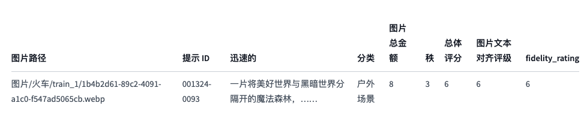

# 项目仓库
https://github.com/discus0434/comfyui-aesthetic-predictor-v2-5     

https://github.com/discus0434/aesthetic-predictor-v2-5

信息     
5.25左右开源

# 运行
pip install aesthetic-predictor-v2-5

[!] torchaudio 2.1.2+cu118 requires torch==2.1.2, but you have torch 2.3.0 which is incompatible.    
[!] xformers 0.0.23.post1+cu118 requires torch==2.1.2, but you have torch 2.3.0 which is incompatible.

pip install -U xformers

Successfully uninstalled xformers-0.0.23.post1+cu118   
Successfully installed xformers-0.0.26.post1

本地部署     

python main.py --port 8895 --listen 0.0.0.0    
然后就能使用公网链接   

# 模型信息
没有与 Aesthetic Predictor 相关的论文，但是有LAION 的文章。

本研究涉及图像美学评估领域。

Aesthetic Predictor V2.5 is a SigLIP-based predictor that evaluates the aesthetics of an image on a scale from 1 to 10.

Compared to Aesthetic Predictor V2, it has been improved to evaluate a wider range of image domains such as illustrations.插图

This app predicts the aesthetic score of input images such as paintings, photographs, and illustrations.

The aesthetic score is a floating-point number between 1 and 10.

https://github.com/discus0434/aesthetic-predictor-v2-5

# 数据集
https://huggingface.co/datasets/THUDM/ImageRewardDB/tree/main

training predictors using clip embeddings too,

as the final val_loss, I got 0.27 in MSE.

I trained MLP with 326,318 images, 200,000 of which are from AVA, and 25,000 of which are from ImageRewardDB.

并用 RankGauss 进行预处理，使数据集易于学习。

## ImageRewardDB

ImageRewardDB 是一个全面的文本到图像比较数据集，专注于文本到图像的人类偏好。它包含 137k 对专家比较，基于文本提示和来自 DiffusionDB 的相应模型输出。为了构建 ImageRewadDB，我们为其设计了一个量身定制的管道，建立了定量评估和注释器培训的标准，优化了标记体验，并确保了质量验证

注意：ImageRewardDB 中的所有图像均从 DiffusionDB 收集，此外，我们还收集了与同一提示相对应的图像。

语言
数据集中的文本全部是英文。

数据字段

    图像：图像对象
    prompt_id：对应提示的id
    prompt：相应提示的文本
    分类：对应提示的分类
    image_amount_in_total：与提示相关的图像总量
    排名：该图像在所有相关图像中的相对排名
    总体评分：此图像的总体得分
    image_text_alignment_rating：生成的图像与给定文本的匹配程度的分数
    fidelity_rating：输出图像是否符合物体应有的形状和特征的分数

数据分割   
正如我们上面提到的，我们提供的所有子集尺度都有“训练”、“验证”和“测试”三个分割。并且所有子集共享相同的验证和测试分割。

您可以使用 Hugging Face Datasets库轻松加载    ImageRewardDB。如前所述，我们提供了 1k、2k、4k 和 8k 四个子集。您可以使用以下方式加载它们：

    from datasets import load_dataset

    # Load the 1K-scale dataset
    dataset = load_dataset("THUDM/ImageRewardDB", "1k")

考虑到 ImageRewardDB 包含大量图像，我们提供了四个不同规模的子集来支持不同的需求。对于所有子集，验证和测试拆分保持不变。验证拆分（1.10GB）包含 412 个提示和 2.6K 幅图像（7.32K 对），测试拆分（1.16GB）包含 466 个提示和 2.7K 幅图像（7.23K 对）。不同规模的训练拆分信息如下：

ImageRewardDB 中的 62.6K 幅图像被分成几个文件夹，并根据其拆分存储在“./images”下的相应目录中。每个文件夹包含大约 500 个提示、它们对应的图像和一个 JSON 文件。JSON 文件将图像与其对应的提示和注释链接起来。文件结构如下：

# 其他
## playground
https://playground.com/

edit

换背景，inpaint     

open-outpaint

inpaint消除无关的人物      

好像华为还是哪家手机公司给相册嵌入了      

## SigLIP
Submitted on 27 Mar 2023 (v1), last revised 27 Sep 2023 (this version, v4)]     
Sigmoid Loss for Language Image Pre-Training

我们提出了一种简单的成对 Sigmoid 损失函数，用于语言-图像预训练 (SigLIP)。与使用 softmax 正则化的标准对比学习不同，Sigmoid 损失函数仅对图像-文本对进行操作，不需要全局查看成对相似性来进行正则化。Sigmoid 损失函数同时允许进一步扩大批量大小，同时在较小的批量大小下也表现更好。结合 Locked-image Tuning，仅使用四个 TPUv4 芯片，我们训练了一个 SigLiT 模型，该模型在两天内实现了 84.5% 的 ImageNet 零样本准确率。将批量大小与损失函数分离开来，让我们能够进一步研究示例与成对以及负样本与正样本比率的影响。最后，我们将批量大小推到极限，高达一百万，并发现增加批量大小的好处迅速消失，更合理的 32k 批量大小就足够了。我们在此 https URL上发布我们的模型，并希望我们的研究能够激发进一步探索，以提高语言-图像预训练的质量和效率。

### google-research/big_vision
Official codebase used to develop Vision Transformer, SigLIP, MLP-Mixer, LiT and more.

该代码库旨在使用Cloud TPU VM或 GPU 机器训练大规模视觉模型 。它基于Jax / Flax 库，并使用tf.data和 TensorFlow 数据集作为可扩展且可重现的输入管道。

## laion
为了创建 LAION-Aesthetics，我们训练了几个轻量级模型，这些模型可以预测人们在被问到“从 1 到 10 的范围内，您对这张图片的喜欢程度是多少？”时给出的评分。

### LAION-美学 V1

我们首先对SAC数据集（当时仅包含 5000 个样本）中的 5000 个图像评级对进行线性模型训练。

Simulacra Aesthetic Captions 是一个包含超过 238000 张合成图像的数据集，这些图像使用 CompVis latent GLIDE 和 Stable Diffusion 等 AI 模型从超过四万个用户提交的提示中生成。

该模型使用的输入不是图像本身，而是使用 Open AI CLIP VIT L 14 模型生成的 CLIP 图像嵌入。我们将该模型称为 LAION-Aesthetics_Predictor V1。

它的结果非常令人鼓舞，因此我们决定对包含英文文本的 LAION 5B 图像生成 8M 和 120M 个预测分数最高的样本子集。

我们将由这两个子集组成的数据集称为LAION-Aesthetics V1。

### LAION-美学 V2    
https://github.com/christophschuhmann/improved-aesthetic-predictor    

CLIP+MLP Aesthetic Score Predictor

Train, use and visualize an aesthetic score predictor ( how much people like on average an image ) based on a simple neural net that takes CLIP embeddings as inputs.

在获得这些非常令人鼓舞的结果之后，我们继续进行实验并收集以下数据以训练更多改进的 MLP（多层感知器）模型：

    来自 SAC 数据集的更多样本，该数据集目前已增长至 176000 个图像 - 评分对
    LAION-Logos 是一个包含 15,000 个徽标图像-文本对的数据集，美学评级从 1 到 10。我们收集这个数据集是为了提高模型评估图像中含有或多或少美学文本的能力。
    美学视觉分析 (AVA) 数据集，是一个用于美学视觉分析的大型数据库，包含来自 dpchallenge.com 的 250000 张照片，大多数图像都有 1 到 10 的美学评级。
    在训练了具有不同层数和参数以及不同激活函数的多个 MLP 之后，我们发现，在 CLIP ViT/14 之上的简单线性模型在用于对 LAION-5B 图像进行排序时，在我们主观看来产生了视觉上最吸引人的结果。（尽管其他具有 Relu 函数的 MLP 产生的 MSE 和 MAE 损失值略低。）我们将在 SAC、LAION-Logos 和 AVA LAION-Aesthetics_Predictor V2 上训练的结果模型称为。
    您可以在此处找到使用 LAION-Aesthetics_Predictor V2 将来自 LAION 5B 的所有 23.7 亿张带有英文字幕的图像分类到 40 个存储桶中的可视化效果。

使用 LAION-Aesthetics_Predictor V2，我们创建了带有英文字幕的 LAION 5B 样本的以下子集：

    1,2B 预测美学分数为 4.5 或更高的图像-文本对：浏览 huggingface
    939M 个图像-文本对，预测美学得分为 4.75 或更高：浏览 huggingface
    600M 幅图像-文本对，预测美学分数为 5 或更高：浏览 huggingface
    1200 万个图像-文本对，预测美学分数为 6 或更高：浏览 huggingface
    300 万个预测美学分数为 6.25 或更高的图像-文本对：浏览 huggingface
    625K 个图像-文本对，预测美学分数为 6.5 或更高：浏览 huggingface
    这些子集相互重叠。5 完全包括 6，而 6 又包括 6.25，以此类推。我们将这些子集的集合称为 LAION-Aesthetics V2。

我们将数据集提供给Robin Rombach 和 Patrick Esser 领导的CompViz团队。他们使用 5+ 子集来训练稳定扩散 V1模型。

下一步是什么？     

目前，我们正在使用 1,2B 参数M2M-100模型将多语言子集 LAION 5B 中的所有 2,15B 样本翻译成英语。

这将使我们能够将 V2 的大小大致增加一倍。

此外，我们已经在研究新的多模式大规模数据集，这次是网页级别的，类似于 Deepmind 用于Flamingo的交错图像文本数据集，但还包含音频和视频文件......而且要大得多。:)

# 结尾
