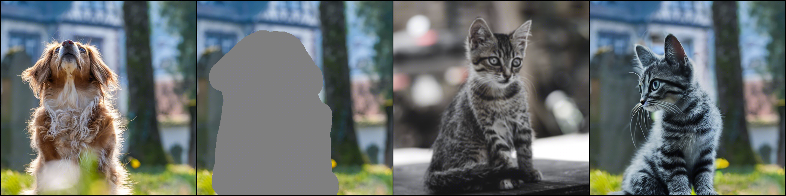
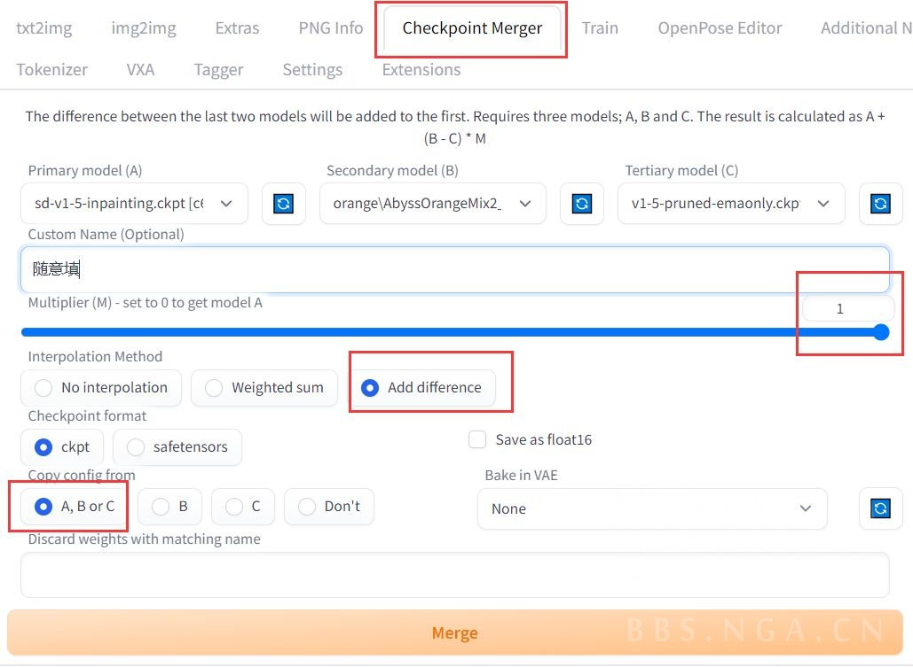
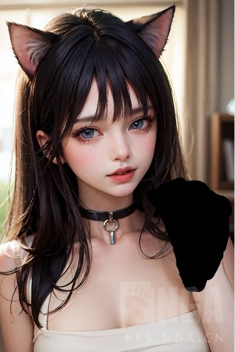
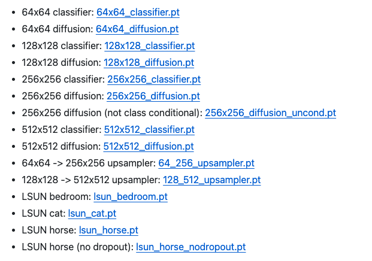

# Paint by Example

https://github.com/Fantasy-Studio/Paint-by-Example

Paint by Example: Exemplar-based Image Editing with Diffusion Models

在本文中，我们首次研究了样本引导的图像编辑以实现更精确的控制。我们通过利用自监督训练来解开和重新组织源图像和样本来实现这一目标。然而，这种简单的方法会导致明显的融合伪影。我们仔细分析了它，并提出了一个信息瓶颈和强大的增强，以避免直接复制和粘贴样本图像的简单解决方案。同时，为了确保编辑过程的可控性，我们为样本图像设计了一个任意形状的蒙版，并利用无分类器的指导来增加与样本图像的相似性。整个框架涉及扩散模型的单次前向传播，无需任何迭代优化。我们证明了我们的方法实现了令人印象深刻的性能，并且能够对高保真度的自然图像进行可控编辑。

    2023-11-28近期工作 Asymmetric VQGAN 提升了非遮罩区域细节的保留，详细内容请参考相关论文，github。
    2023-05-13发布定量结果代码。
    2023-03-03发布测试基准。
    2023-02-23 ModelScope（中文最大的模型社区）支持非官方第三方应用程序。
    2022-12-07在Hugging Face Spaces上发布Gradio演示。
    2022-11-29上传代码。

数据准备

    从CVDF 的网站下载 Open-Images 数据集的单独打包文件并将其解压到目录中dataset/open-images/images。
    从Open-Images官方网站下载Open-Images数据集的bbox注释并将其保存到目录中dataset/open-images/annotations。
    以 txt 格式生成每个图像的 bbox 注释。
    python scripts/read_bbox.py

下载稳定扩散的预训练模型   
我们利用预训练的 Stable Diffusion v1-4 作为初始化，请从Hugging Face下载预训练模型并将模型保存到目录pretrained_models。然后运行以下脚本为 UNet 的 5 个额外输入通道添加零初始化权重（4 个用于编码的掩码图像，1 个用于掩码本身）。

(4 for the encoded masked-image and `1 for the mask itself).`

这是什么意思     

inpaint模型的本质    
9通道输入   

其实iclight模型改变的方法也是一样的     

## inpaint

C站上有些模型是会提供 inpainting 模型的，如：    

只需要微调，训练脚本变一下。    
基本就是输入conv训练一下     

非训练制作方法 ：    

    1. 在模型融合界面中，model A 选择官方的 inpainting 模型，model B 选择你想要增加 inpainting 功能的模型，model C 选择官方原版模型
    2. Multiplier (M) 设为 1
    3. 融合方法选 Add difference
    4. 从 A,B或C 复制配置

A + B - C

A - C 只保留inpaint的性质     

(观察 mask 边缘，你会发现 inpainting 会与背景融合的更好)

下面的对比图中，右边的模型是 inpainting 模型，左边是普通模型。参数一致，且双方都使用了 controlnet

(观察重绘内容，普通模型经常漏了肩膀)

# 其他

## guided-diffusion
 OpenAI's ADM codebase a

This is the codebase for Diffusion Models Beat GANS on Image Synthesis.

This repository is based on openai/improved-diffusion, with modifications for classifier conditioning and architecture improvements.

https://github.com/openai/guided-diffusion?tab=readme-ov-file

### improved-diffusion

https://github.com/openai/improved-diffusion

This is the codebase for Improved Denoising Diffusion Probabilistic Models.

## denoising-diffusion-pytorch

Denoising Diffusion Probabilistic Model, in Pytorch     
Implementation of Denoising Diffusion Probabilistic Model in Pytorch. It is a new approach to generative modeling that may have the potential to rival GANs. It uses denoising score matching to estimate the gradient of the data distribution, followed by Langevin sampling to sample from the true distribution.

https://github.com/lucidrains/denoising-diffusion-pytorch

# 结尾