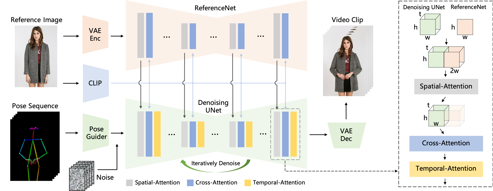
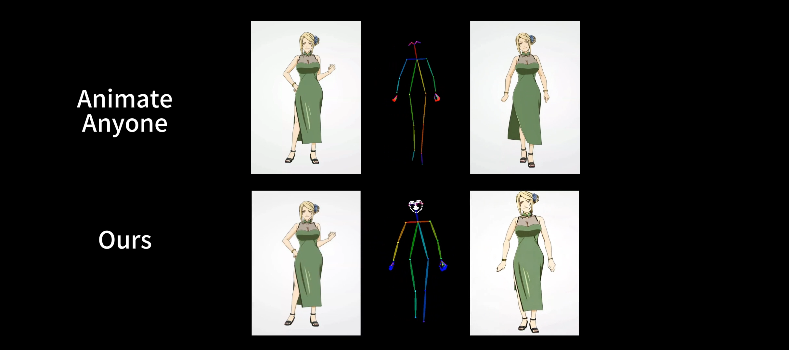
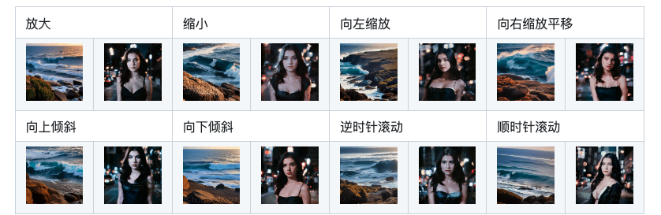
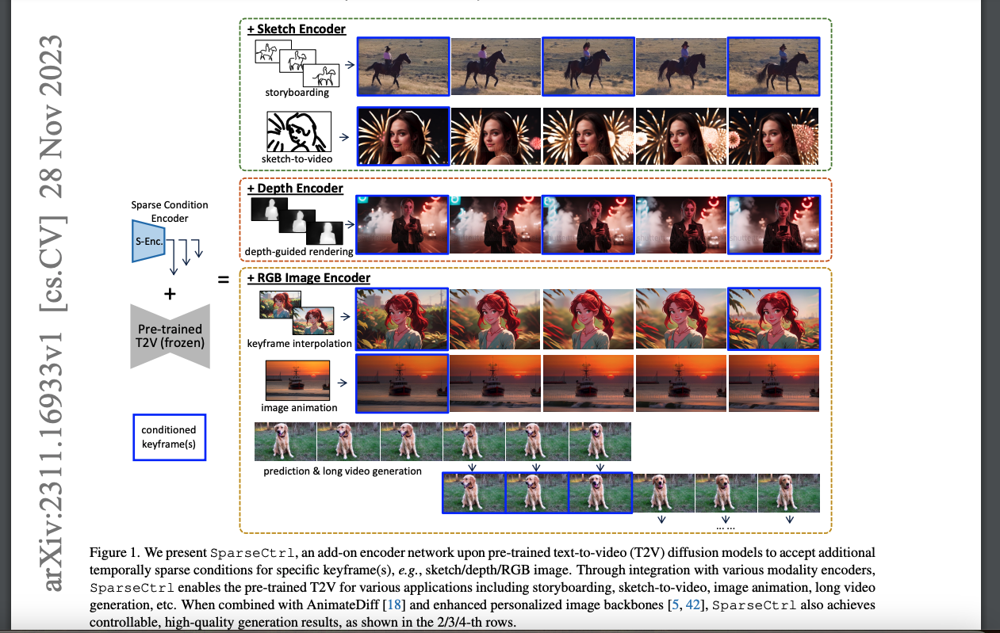
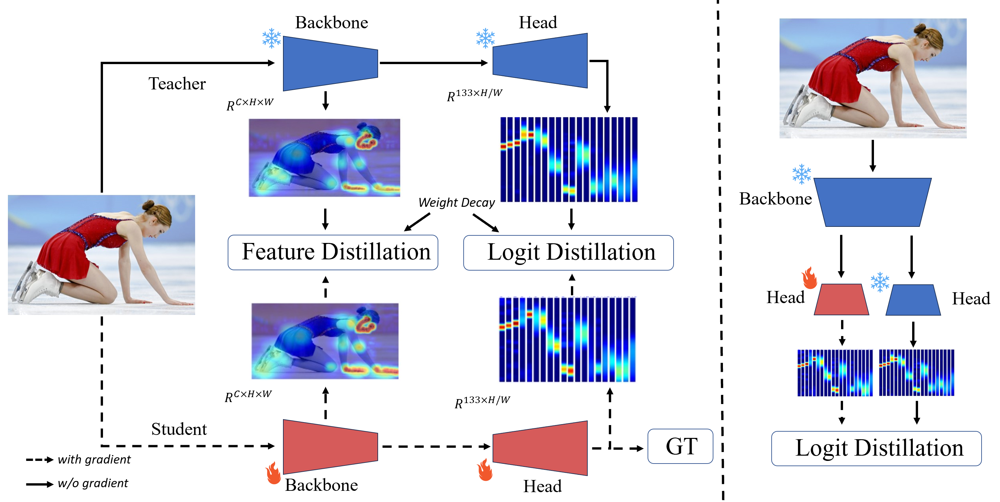
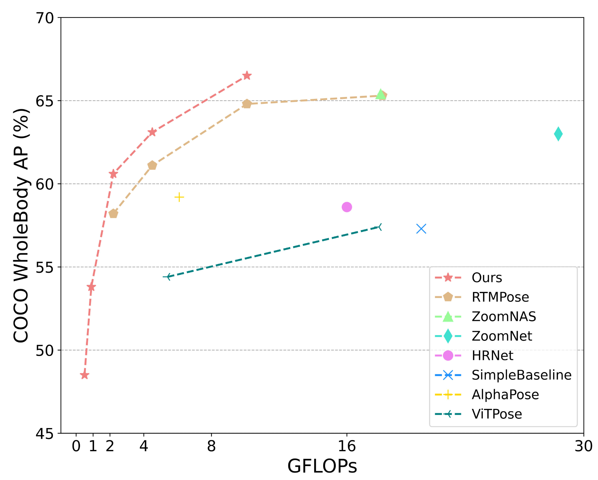
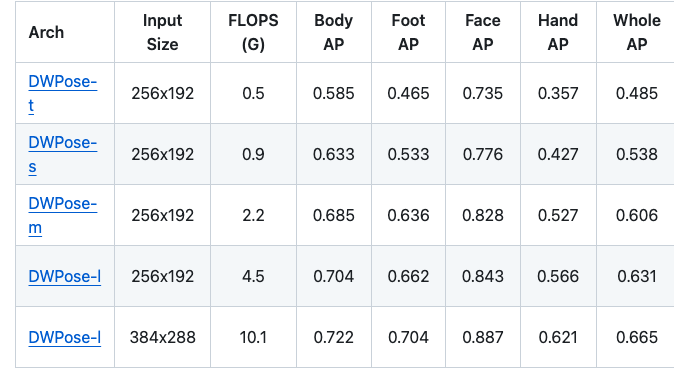
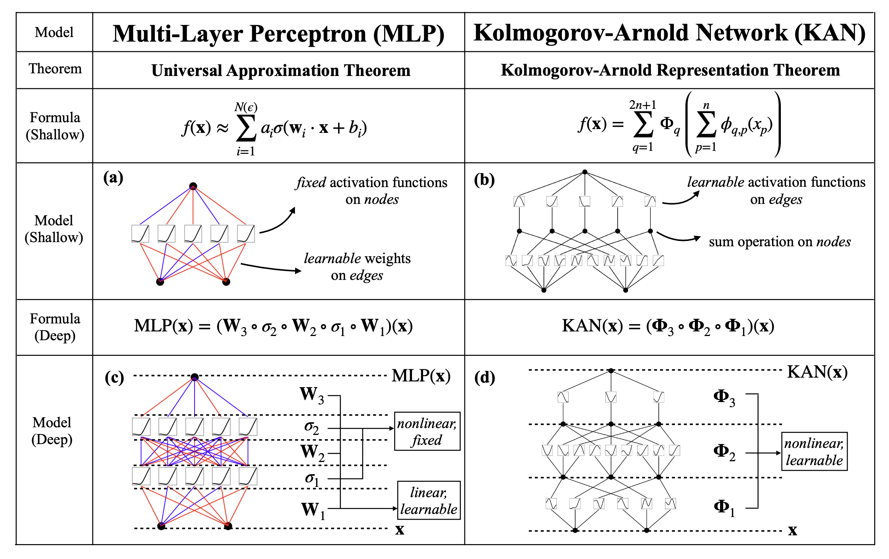

ToonCrafter: Generative Cartoon Interpolation

🤗 ToonCrafter 可以利用预先训练的图像到视频扩散先验来插入两幅卡通图像。

# 📝 更新日志

添加素描控制和着色功能。    
[2024.05.29]：🔥🔥 发布代码和模型权重。   
[2024.05.28]：启动项目页面并更新 arXiv 预印本。    

模型    
ToonCrafter_512	320x512     

相当于其他的一个demo

目前我们的 ToonCrafter 可以支持生成高达 16 帧、分辨率为 512x320 的视频。使用更少的 DDIM 步骤可以减少推理时间。

目前似乎需要 27GB VRAM

# 使用方法
1.1输入起始帧	输入结束帧

1.2 稀疏草图指导

很强，控制信息是起止帧颜色和状态，只需要草图控制中间动作   
进一步的，接入文本生成草图动作     
进一步的，起止帧加详细文本直接控制     

更进一步的，超详细文本控制

2.1 卡通素描插值

2.2 基于参考的草图着色

# 其他
## 基于起始帧和pose生成视频

### MusePose 

https://github.com/TMElyralab/MusePose 

You can download weights manually as follows:

Download our trained weights.

Download the weights of other components:

    sd-image-variations-diffusers
    sd-vae-ft-mse
    dwpose
    yolox - Make sure to rename to yolox_l_8x8_300e_coco.pth
    image_encoder

    ./pretrained_weights/
    |-- MusePose
    |   |-- denoising_unet.pth
    |   |-- motion_module.pth
    |   |-- pose_guider.pth
    |   └── reference_unet.pth
    |-- dwpose
    |   |-- dw-ll_ucoco_384.pth
    |   └── yolox_l_8x8_300e_coco.pth
    |-- sd-image-variations-diffusers
    |   └── unet
    |       |-- config.json
    |       └── diffusion_pytorch_model.bin
    |-- image_encoder
    |   |-- config.json
    |   └── pytorch_model.bin
    └── sd-vae-ft-mse
        |-- config.json
        └── diffusion_pytorch_model.bin

We thank AnimateAnyone for their technical report, and have refer much to Moore-AnimateAnyone and diffusers.     
We thank open-source components like AnimateDiff, dwpose, Stable Diffusion, etc..

Limitations    
Detail consitency: some details of the original character are not well preserved (e.g. face region and complex clothing).    
Noise and flickering: we observe noise and flicking in complex background.

### AnimateAnyone   
这两天

https://github.com/novitalabs/AnimateAnyone    

Unofficial Implementation of Animate Anyone by Novita AI

Animate Anyone: Consistent and Controllable Image-to-Video Synthesis for Character Animation   
Li Hu, Xin Gao, Peng Zhang, Ke Sun, Bang Zhang, Liefeng Bo    
Institute for Intelligent Computing，Alibaba Group  

五个月前

角色动画旨在通过驱动信号从静止图像生成角色视频。目前，扩散模型凭借其强大的生成能力已成为视觉生成研究的主流。然而，在图像到视频领域，尤其是在角色动画领域，仍然存在挑战，在时间上保持与角色详细信息的一致性仍然是一个艰巨的问题。在本文中，我们利用扩散模型的强大功能，提出了一个专为角色动画量身定制的新框架。为了保持参考图像中复杂外观特征的一致性，我们设计了 ReferenceNet 以通过空间注意合并细节特征。为了确保可控性和连续性，我们引入了一个高效的姿势引导器来引导角色的动作，并采用有效的时间建模方法来确保视频帧之间的平滑帧间过渡。通过扩展训练数据，我们的方法可以为任意角色制作动画，与其他图像到视频方法相比，在角色动画方面取得了更好的效果。此外，我们在时尚视频和人体舞蹈合成的基准上评估了我们的方法，取得了最先进的结果。

我们的方法概述。首先使用 Pose Guider 对姿势序列进行编码并与多帧噪声融合，然后由 Denoising UNet 进行去噪过程以生成视频。Denoising UNet 的计算块由 Spatial-Attention、Cross-Attention 和 Temporal-Attention 组成，如右侧虚线框所示。参考图像的集成涉及两个方面。首先，通过 ReferenceNet 提取详细特征并用于 Spatial-Attention。其次，通过 CLIP 图像编码器提取语义特征以进行 Cross-Attention。Temporal-Attention 在时间维度上运行。最后，VAE 解码器将结果解码为视频片段。

图像转视频（类似 Gen2）+ 说话头部生成（基于VividTalk的内部项目）

#### VividTalk
: One-Shot Audio-Driven Talking Head Generation Based on 3D Hybrid Prior

1Nanjing University, 2Alibaba Group, 3ByteDance, 4Nankai University

VividTalk can generate realistic and lip-sync talking head videos with expressive facial expression, natural head poses.

2023。12

近年来，音频驱动的说话头部生成引起了广泛关注，并且在口型同步、富有表现力的面部表情、自然头部姿势生成和高视频质量方面做出了许多努力。然而，由于音频和运动之间的一对多映射，还没有一个模型在所有这些指标上处于领先地位或与之挂钩。在本文中，我们提出了 VividTalk，这是一个两阶段通用框架，支持生成具有上述所有属性的高视觉质量说话头部视频。具体而言，`在第一阶段，我们通过学习两种运动将音频映射到网格，包括非刚性表情运动和刚性头部运动。对于表情运动，采用混合形状和顶点作为中间表示，以最大化模型的表示能力。对于自然头部运动，提出了一种具有两阶段训练机制的新型可学习头部姿势码本。在第二阶段，我们提出了一个双分支运动向量流和一个生成器，将网格转换为密集运动并逐帧合成高质量视频`。大量实验表明，提出的 VividTalk 可以生成高视觉质量的说话头视频，口型同步和真实感大大增强，并且在客观和主观比较中优于以前的最先进作品。代码将在发布后公开发布。

#### Open-AnimateAnyone
https://github.com/guoqincode/Open-AnimateAnyone

五月前

我们只在小规模数据集上进行训练（例如TikTok，UBC），在数据规模和质量不足的情况下很难取得官方成果。出于时间和成本的考虑，我们不打算收集和筛选大量高质量数据。如果有人有一个在大量高质量数据上训练出来的鲁棒模型，愿意分享出来，可以发起pull request。

该项目基于magic-animate和AnimateDiff构建。该实现最初由Qin Guo开发，随后由Zhenzhi Wang协助开发。

培训指导
虽然我们无法使用大规模数据来训练模型，但我们可以提供几点训练建议：

    在我们的实验中，AnimateAnyone 原论文中的 poseguider 很难控制 pose，无论我们使用什么激活函数（如 ReLU，SiLU），但将输出通道放大到 320 并添加在 conv_in 之后（如 model.hack_poseguider ）非常有效，同时相比于 controlnet，这种方案更加轻量级（<1M para vs 400M para）。但我们仍然认为 Controlnet 是一个不错的选择。Poseguider 依赖于同时经过微调的 unet，不能立即使用。即插即用。
    在小规模数据集（少于2000个视频）上，stage1可以很好的工作（包括泛化），但是stage2是数据饥渴症，数据量少的时候容易出现伪影、闪烁等问题。因为我们在第一阶段重新训练了unet，导致原有的animatediff的checkpoint失去了作用，所以这一阶段需要大量高质量的数据集来重新训练animatediff的运动模块。
    冻结 unet 不是一个好的选择，因为它会丢失参考图像的纹理信息。
    这是一项需要大量数据的任务。我们认为，扩大数据质量和规模往往比修改模型的微小结构更有价值。数据数量和质量非常重要！
    高分辨率训练非常重要，影响细节的学习和重建，训练分辨率不应该大于推理分辨率。

去做

 发布训练代码。
 发布推理代码。
 发布非官方的预训练权重。
 发布 Gradio Demo。

##### DiT 可视化

https://github.com/guoqincode/DiT-Visualization

本项目旨在探索基于 DiT 的扩散模型与基于 Unet 的扩散模型在特征方面的差异。我们发现基于 DiT 的扩散模型在不同层上具有一致的特征尺度，而 Unet 模型在不同层上表现出特征尺度和分辨率的显著变化。

#### MagicAnimate:
Temporally Consistent Human Image Animation using Diffusion Model    
Zhongcong Xu1, Jianfeng Zhang2, Jun Hao Liew2, Hanshu Yan2, Jia-Wei Liu1, Chenxu Zhang2, Jiashi Feng2, Mike Zheng Shou1     
  1Show Lab, National University of Singapore   2Bytedance

### Moore-AnimateAnyone
https://github.com/MooreThreads/Moore-AnimateAnyone

我们提出了一种基于 AnimateAnyone 管道的面部重现方法：使用驾驶视频的面部标志来控制给定源图像的姿势，并保持源图像的身份。具体来说，我们从驾驶视频的标志中分离出头部姿势（包括眨眼）和嘴部运动，它可以精确控制源面部的表情和动作。我们发布了面部重现的推理代码和预训练模型！！

更加抖

值得注意的是，这是一个非常初步的版本，旨在接近AnimateAnyone中所展示的性能（在我们的测试中大约为 80％）

📝 发布计划

    AnimateAnyone 的推理代码和预训练权重
    AnimateAnyone 的训练脚本
    面部重现的推理代码和预训练权重
    人脸重现训练脚本
    音频驱动肖像视频生成的推理脚本
    音频驱动肖像视频生成的训练脚本

局限性：我们观察到当前版本存在以下缺点：

    当参考图像具有干净的背景时，背景可能会出现一些伪影
    当参考图像和关键点之间存在尺度不匹配时，可能会产生次优结果。我们尚未实施论文中提到的预处理技术。
    当运动序列细微或场景静态时，可能会出现一些闪烁和抖动。

面部重现     
口型对器    

### champ
https://github.com/fudan-generative-vision/champ

    2024/05/05：🎉🎉🎉发布了HuggingFace 上的样本训练数据。

    2024/05/02：🌟🌟🌟训练源代码发布#99。

    2024/04/28：👏👏👏Blender 中的平滑 SMPL 方法发布#96。

    2024/04/26：🚁适用于各种 SMPL 流程的出色 Blender 插件CEB Studios ！

    2024/04/12：✨✨✨SMPL 和渲染脚本已发布！现在就为您的舞蹈视频锦上添花💃🤸‍♂️🕺。查看文档。

    2024/03/30：🚀🚀🚀社区提供的超棒ComfyUI Wrapper 。这是视频教程。感谢@kijai 🥳

    2024/03/27：关于复制的精彩演示🌟。感谢@ camenduru👏

    2024/03/27：访问我们的路线图🕒来预览Champ的未来。

支持blender

[Submitted on 21 Mar 2024]    
Champ: Controllable and Consistent Human Image Animation with 3D Parametric Guidance

在本研究中，我们介绍了一种人体图像动画方法，该方法利用潜在扩散框架内的 3D 人体参数模型来增强当前人体生成技术中的形状对齐和运动引导。该方法利用 SMPL（带皮肤多人线性）模型作为 3D 人体参数模型来建立身体形状和姿势的统一表示。这有助于从源视频中准确捕捉复杂的人体几何和运动特征。具体来说，我们结合了从 SMPL 序列获得的渲染深度图像、法线图和语义图以及基于骨架的运动引导，以丰富潜在扩散模型的条件，使其具有全面的 3D 形状和详细的姿势属性。采用集成自注意机制的多层运动融合模块来融合空间域中的形状和运动潜在表示。通过将 3D 人体参数模型表示为运动引导，我们可以在参考图像和源视频运动之间执行人体的参数形状对齐。在基准数据集上进行的实验评估表明，该方法能够生成高质量的人体动画，准确捕捉姿势和形状变化。此外，我们的方法还在所提出的野生数据集上表现出卓越的泛化能力

## AnimateDiff
: Animate Your Personalized Text-to-Image Diffusion Models without Specific Tuning  (ICLR'24 spotlight)

https://github.com/guoyww/animatediff/

[Submitted on 10 Jul 2023 (v1), last revised 8 Feb 2024 (this version, v2)]    
AnimateDiff: Animate Your Personalized Text-to-Image Diffusion Models without Specific Tuning

AnimateDiff：无需特殊调整即可为您的个性化文本到图像传播模型制作动画

随着文本到图像 (T2I) 扩散模型（例如稳定扩散）和相应的个性化技术（例如 DreamBooth 和 LoRA）的进步，每个人都可以以可承受的成本将他们的想象力转化为高质量的图像。然而，为现有的高质量个性化 T2I 添加运动动态并使其生成动画仍然是一个悬而未决的挑战。在本文中，我们提出了 AnimateDiff，这是一个实用的框架，`用于为个性化 T2I 模型制作动画，而无需特定于模型的调整。我们框架的核心是一个即插即用的运动模块`，它可以训练一次并无缝集成到任何来自同一基础 T2I 的个性化 T2I 中。通过我们提出的训练策略，运动模块可以有效地从真实世界视频中学习可转移的运动先验。训练完成后，运动模块可以插入到个性化 T2I 模型中以形成个性化动画生成器。我们进一步提出了 `MotionLoRA`，这是 AnimateDiff 的一种轻量级微调技术，它使预训练的运动模块能够以较低的训练和数据收集成本适应新的运动模式，例如不同的镜头类型。我们在从社区收集的几个公共代表性个性化 T2I 模型上评估了 AnimateDiff 和 MotionLoRA。结果表明，我们的方法可帮助这些模型生成时间上流畅的动画剪辑，同时保持视觉质量和运动多样性。代码和预训练权重可在此 https URL上找到。

下一个

    更新至最新的扩散器版本
    更新 Gradio 演示
    发布训练脚本
    发布 AnimateDiff v3 和 SparseCtrl

我们开发了四个版本的 AnimateDiff：v1、v2以及v3用于Stable Diffusion V1.5的 ；sdxl-beta用于Stable Diffusion XL 的。

[2023.12] AnimateDiff v3 和 SparseCtrl    
在这个版本中，我们通过Domain Adapter LoRA对图像模型进行了微调，以便在推理时获得更大的灵活性。

此外，我们实现了两个（RGB 图像/涂鸦）SparseCtrl编码器，它们可以采用任意数量的条件图来控制生成过程。

解释：域适配器是一个在训练视频数据集的静态帧上训练的 LoRA 模块。此过程在训练运动模块之前完成，并帮助运动模块专注于运动建模，如下图所示。在推理时，通过调整域适配器的 LoRA 比例，可以删除训练视频的一些视觉属性，例如水印。要使用 SparseCtrl 编码器，必须在管道中使用完整的域适配器。

限制

    轻微抖动很明显。将在后续版本中解决；
    为了与社区模型兼容，没有针对通用 T2V 进行特定的优化，导致在此设置下的视觉质量有限；
    （风格对齐）对于图像动画/插值等用途，建议使用由同一社区模型生成的图像。

[2023.11] AnimateDiff SDXL-测试版
在 SDXL 上发布运动模块（测试版），可在Google Drive / HuggingFace / CivitAI上获取。可以使用/不使用个性化模型制作高分辨率视频（即具有各种宽高比的 1024x1024x16 帧）。推理通常需要 ~13GB VRAM 和调整后的超参数（例如 #sampling 步骤），具体取决于所选的个性化模型。

签出分支sdxl以获取有关推理的更多详细信息。更多质量更高的检查点即将推出。敬请期待。以下示例是手动下采样的，以便快速加载。

    

这个效果甚至不如常规视频加放大镜     
稍微好一些    
动的地方多一些   

社区贡献

由社区开发的用户界面：

    A1111 扩展sd-webui-animatediff (由@continue-revolution提供)
    ComfyUI 扩展ComfyUI-AnimateDiff-Evolved (由@Kosinkadink提供)

目前，我们建议用户生成与我们的训练设置一致的 16 帧、512 分辨率的动画。值得注意的是，不同的分辨率/帧数可能会或多或少地影响质量。

致谢   
基于Tune-a-Video构建的代码库。

### Tune-A-Video
https://github.com/showlab/Tune-A-Video

[ICCV 2023] Tune-A-Video：用于文本到视频生成的图像扩散模型的一次性调整

[Submitted on 22 Dec 2022 (v1), last revised 17 Mar 2023 (this version, v2)]   
Tune-A-Video: One-Shot Tuning of Image Diffusion Models for Text-to-Video Generation

为了复制文本转图像 (T2I) 生成的成功，最近的研究采用大规模视频数据集来训练文本转视频 (T2V) 生成器。尽管结果令人鼓舞，但这种范式计算成本高昂。在这项研究中，我们提出了一种新的 T2V 生成设置—单次视频调整，其中仅呈现一个文本-视频对。我们的模型建立在对海量图像数据进行预训练的最先进的 T2I 扩散模型之上。我们做了两个关键观察：1) T2I 模型可以生成表示动词术语的静态图像；2) 扩展 T2I 模型以同时生成多个图像表现出令人惊讶的良好内容一致性。为了进一步学习连续运动，我们引入了 Tune-A-Video，它涉及量身定制的时空注意机制和有效的单次调整策略。在推理时，我们采用 DDIM 反演来为采样提供结构指导。大量的定性和数值实验证明了我们的方法在各种应用中的卓越能力。

效果不错     
可能比我自己现在用最新方法训练的还好   

### SparseCtrl

[Submitted on 28 Nov 2023]    
SparseCtrl: Adding Sparse Controls to Text-to-Video Diffusion Models

向文本到视频传播模型添加稀疏控制

然而，由于空间不确定性，仅依靠文本提示通常会导致模糊的帧构成。因此，`研究界利用密集的结构信号（例如每帧深度/边缘序列）来增强可控性，而这些信号的收集相应地增加了推理的负担。`在这项工作中，我们提出了 SparseCtrl，`以使用时间稀疏信号实现灵活的结构控制，只需要一个或几个输入`，如图 1 所示。它结合了一个额外的条件编码器来处理这些稀疏信号，同时保持预训练的 T2V 模型不变。所提出的方法与各种模态兼容，包括草图、深度图和 RGB 图像，为视频生成提供更实用的控制，并促进故事板、深度渲染、关键帧动画和插值等应用。大量实验证明了 SparseCtrl 在原始和个性化 T2V 生成器上的泛化。

意思是只使用关键帧或起始帧控制       

### WIP fork for AnimateDiff

原始是直接文生视频   

with an initial reference image

https://github.com/talesofai/AnimateDiff

## DWPose
https://github.com/IDEA-Research/DWPose

https://github.com/IDEA-Research/DWPose

“通过两阶段蒸馏实现有效的全身姿势估计”（ICCV 2023，CV4Metaverse 研讨会）

Effective Whole-body Pose Estimation with Two-stages Distillation

全身姿态估计可定位图像中的人体、手、脸和脚的关键点。由于多尺度身体部位、低分辨率区域的细粒度定位以及数据稀缺，这项任务具有挑战性。同时，将高效准确的姿态估计器应用于以人为中心的广泛理解和生成任务迫在眉睫。在这项工作中，我们提出了一种用于 \textbf{W} 全身 \textbf{P}ose 估计器的两阶段姿态 \textbf{D} 蒸馏，称为 \textbf{DWPose}，以提高其有效性和效率。第一阶段蒸馏设计了一种权重衰减策略，同时利用老师的中间特征和具有可见和不可见关键点的最终逻辑来从头开始监督学生。第二阶段蒸馏学生模型本身以进一步提高性能。与之前的自我知识蒸馏不同，此阶段仅用 20% 的训练时间对学生的头部进行微调，作为即插即用的训练策略。由于数据限制，我们探索了包含各种面部表情和手势的 UBody 数据集，以用于实际应用。全面的实验表明，我们提出的简单而有效的方法具有优越性。我们在 COCO-WholeBody 上实现了新的最佳性能，将 RTMPose-l 的全身 AP 从 64.8% 显著提升至 66.5%，甚至以 65.3% 的 AP 超越了 RTMPose-x teacher。我们发布了一系列不同尺寸的模型，从小到大，以满足各种下游任务。我们的代码和模型可在此 https URL上找到。

⚔️ 我们发布了一系列不同尺寸的 DWPose 模型，用于人体全身姿态估计，从微型到大型。此外，我们还将 ControlNet 的 Openpose 替换为 DWPose，以获得更好的生成图像。

[Submitted on 29 Jul 2023 (v1), last revised 25 Aug 2023 (this version, v2)] 

https://arxiv.org/abs/2307.15880

2023/12/03：DWPose支持角色动画的一致且可控的图像到视频合成。

2023/08/17：我们的论文《基于两阶段蒸馏的有效全身姿势估计》已被 ICCV 2023、CV4Metaverse 研讨会接受。🎉 🎉 🎉

2023/08/09：您现在就可以尝试使用sd-webui-controlnet的 DWPose ！只需更新您的 sd-webui-controlnet >= v1.1237，然后选择 dw_openpose_full 作为预处理器。

2023/08/09：我们支持使用 cv2 运行 onnx 模型。您可以避免安装 onnxruntime。请参阅分支opencv_onnx。

2023/08/07：我们将所有DWPose模型上传至huggingface，现在您可以从百度网盘、谷歌网盘和huggingface下载它们。

2023/08/07：我们发布了一款带有 onnx 的新 DWPose。您可以通过此方法避免安装 mmcv。请参阅onnx分支。

2023/08/01：感谢MMPose 。您可以通过选择全身来尝试我们的 DWPose ！

## KAN: Kolmogorov-Arnold Networks

[Submitted on 30 Apr 2024 (v1), last revised 24 May 2024 (this version, v3)]   
KAN: Kolmogorov-Arnold Networks

受柯尔莫哥洛夫-阿诺德表示定理的启发，我们提出柯尔莫哥洛夫-阿诺德网络 (KAN) 作为多层感知器 (MLP) 的有前途的替代方案。虽然 MLP 在节点（“神经元”）上具有固定的激活函数，但 KAN 在边缘（“权重”）上具有可学习的激活函数。KAN 根本没有线性权重——每个权重参数都被参数化为样条函数的单变量函数所取代。我们表明，这种看似简单的变化使 KAN 在准确性和可解释性方面优于 MLP。就准确性而言，在数据拟合和 PDE 求解方面，小得多的 KAN 可以实现与大得多的 MLP 相当或更好的准确性。从理论上和经验上讲，KAN 拥有比 MLP 更快的神经缩放定律。就可解释性而言，KAN 可以直观地可视化，并且可以轻松地与人类用户交互。通过数学和物理学中的两个例子，KAN 被证明是帮助科学家（重新）发现数学和物理定律的有用合作者。总之，KAN 是 MLP 的有前途的替代品，为进一步改进当今严重依赖 MLP 的深度学习模型提供了机会。

https://github.com/KindXiaoming/pykan

柯尔莫哥洛夫-阿诺德网络 (KAN) 是多层感知器 (MLP) 的有前途的替代品。与 MLP 一样，KAN 具有强大的数学基础：MLP 基于通用近似定理，而 KAN 基于柯尔莫哥洛夫-阿诺德表示定理。KAN 和 MLP 是双重的：KAN 在边上有激活函数，而 MLP 在节点上有激活函数。这个简单的变化使 KAN 在模型准确性和可解释性方面比 MLP 更好（有时好很多！）。这里有KAN 的快速介绍。

可解释性   
KAN 可以直观地可视化。KAN 提供 MLP 无法提供的可解释性和交互性。我们可以使用 KAN 来潜在地发现新的科学定律。

Accuracy   
KANs have faster scaling than MLPs. KANs have better accuracy than MLPs with fewer parameters.

我想感谢所有对 KAN 感兴趣的人。当我设计 KAN 并编写代码时，我考虑的是数学和物理示例（规模相当小！），因此没有考虑效率或可重用性方面的优化。很荣幸能得到这种不必要的关注，这远远超出了我的预期。因此，我接受人们对代码效率和可重用性的任何批评，我深表歉意。我唯一的希望是你能从model.plot()中得到乐趣 :)。

最近我被问到最多的问题是 KAN 是否会成为下一代 LLM。我对此没有很好的直觉。KAN 是为关注高精度和/或可解释性的应用而设计的。我们当然关心 LLM 的可解释性，但可解释性对 LLM 和科学来说可能意味着截然不同的事情。我们关心 LLM 的高精度吗？我不知道，缩放定律似乎意味着如此，但可能不会太高的精度。

据我所知，KAN 和 MLP 不能互相取代；它们在某些情况下各有优势，在其他情况下也有局限性。如果一个理论框架能涵盖两者，甚至可以提出新的替代方案，我会很感兴趣（物理学家喜欢统一理论，抱歉 :)。

三周前

FCN-KAN    
修改了激活函数的 Kolmogorov–Arnold 网络（使用 FCN + 位置编码来表示激活函数）。代码用于torch.vmap加速和简化该过程。

# 结尾