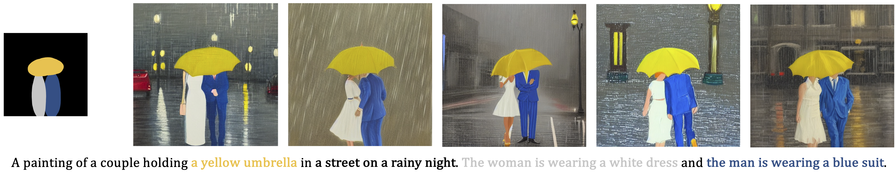
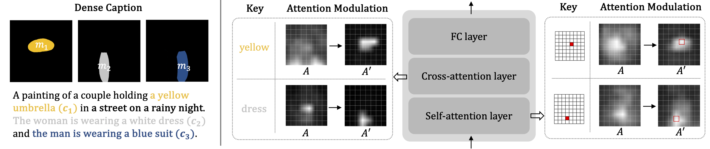
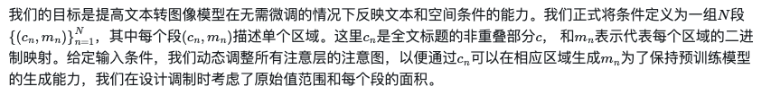
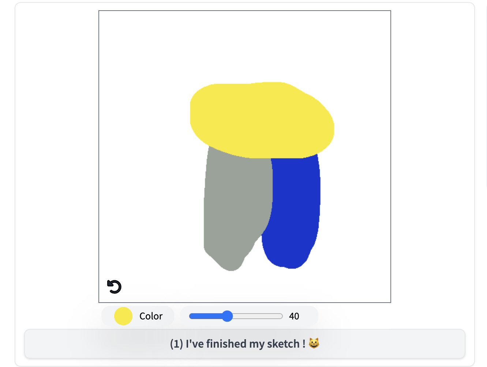
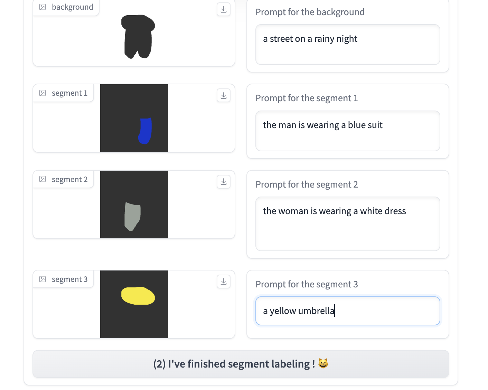
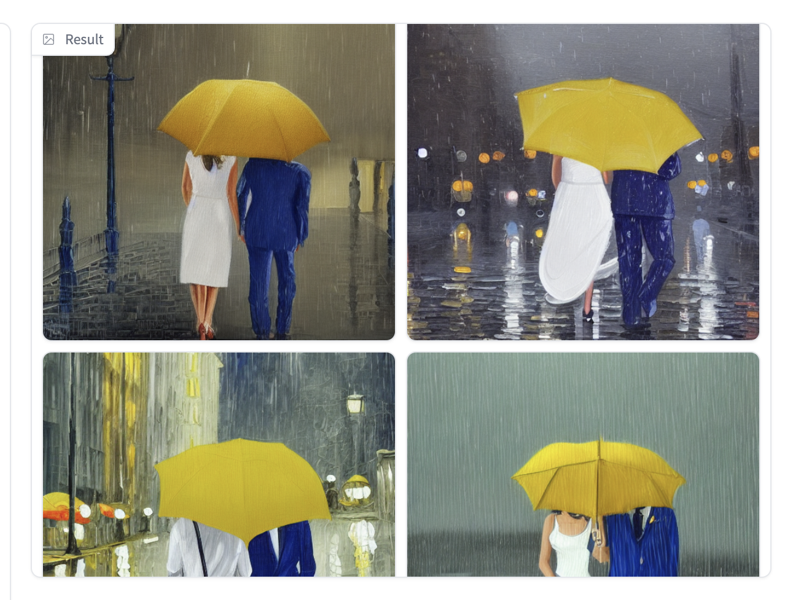
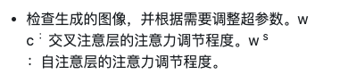
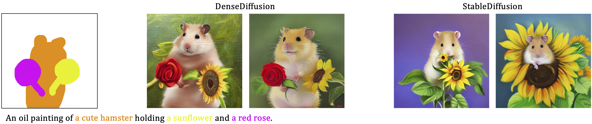
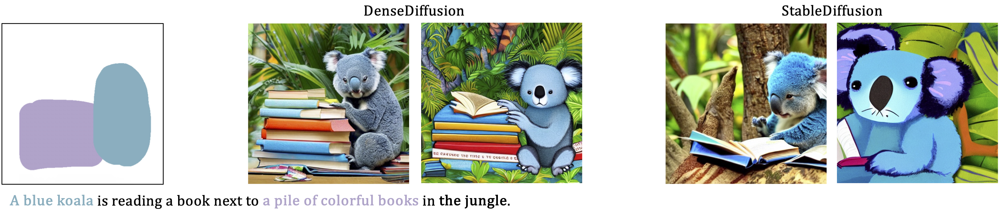
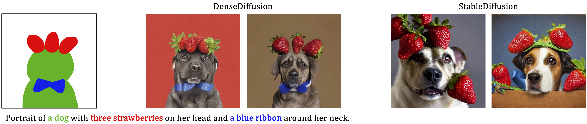

# 论文信息 

(ICCV 2023)

[Submitted on 24 Aug 2023]     
Dense Text-to-Image Generation with Attention Modulation

通过注意力调节实现密集文本到图像的生成

现有的文本到图像扩散模型很难在密集字幕的情况下合成逼真的图像，其中每个文本提示都为特定图像区域提供了详细描述。为了解决这个问题，我们提出了 DenseDiffusion，这是一种无需训练的方法，它采用预先训练的文本到图像模型来处理这种密集字幕，同时提供对场景布局的控制。我们首先分析生成的图像的布局与预训练模型的中间注意力图之间的关系。接下来，我们开发了一种注意力调节方法，该方法根据布局指导引导对象出现在特定区域。无需额外的微调或数据集，我们就可以提高在密集字幕的情况下关于自动和人工评估分数的图像生成性能。此外，我们使用专门针对布局条件训练的模型实现了类似质量的视觉结果。

https://arxiv.org/abs/2308.12964

https://github.com/naver-ai/DenseDiffusion

https://github.com/huchenlei/ComfyUI_densediffusion

NAVER AI 实验室，2卡内基梅隆大学

# 原理

# 使用

# 效果

有点 cutoff的感觉

但是超越了，不只是颜色，还有数量和，可能还有空间关系

手动画图，有点手动 mask 的感觉

# 结尾