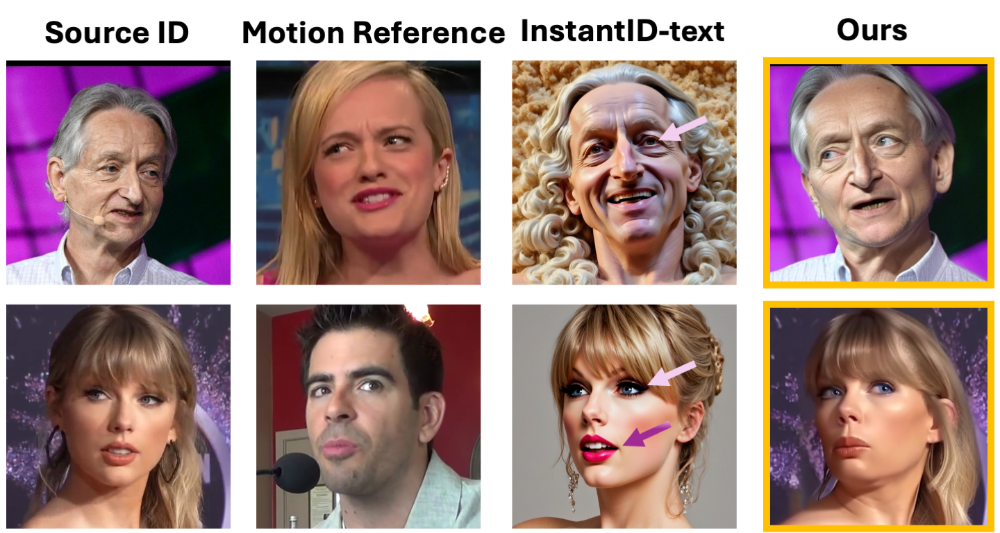
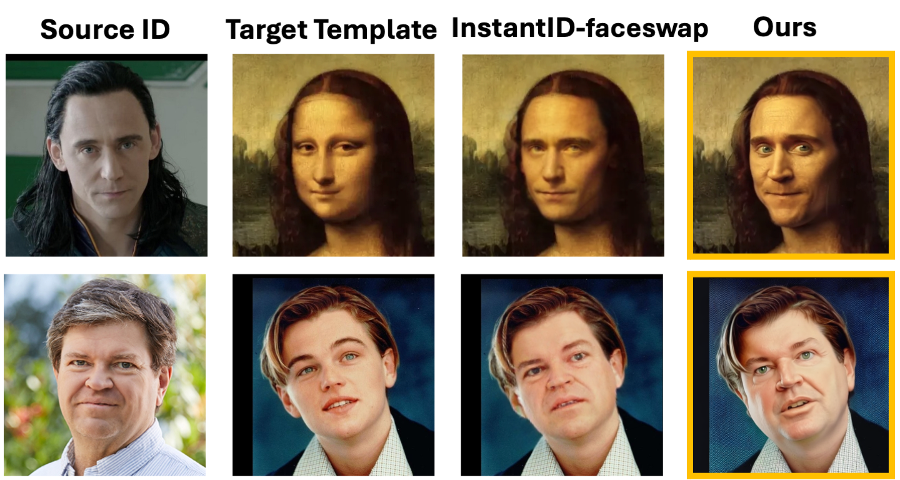

# 论文信息
[Submitted on 21 May 2024]     
Face Adapter for Pre-Trained Diffusion Models with Fine-Grained ID and Attribute Control

Face Adapter for Pre-Trained Diffusion Models with Fine-Grained ID and Attribute Control

具有细粒度 ID 和属性控制的预训练扩散模型的人脸适配器

目前的人脸重现和交换方法主要依赖于 GAN 框架，但最近的焦点已转向预训练的扩散模型，因为它们具有出色的生成能力。然而，训练这些模型需要大量资源，而且结果尚未达到令人满意的性能水平。为了解决这个问题，我们引入了 Face-Adapter，这是一种高效且有效的适配器，专为预训练的扩散模型的高精度和高保真人脸编辑而设计。我们观察到，这两个人脸重现/交换任务本质上都涉及目标结构、ID 和属性的组合。我们的目标是充分解耦这些因素的控制，以便在一个模型中实现这两个任务。具体来说，我们的方法包含：1）提供精确地标和背景的空间条件生成器；2）即插即用的身份编码器，通过转换器解码器将人脸嵌入传输到文本空间。3）集成空间条件和详细属性的属性控制器。与完全微调的人脸重现/交换模型相比，Face-Adapter 在运动控制精度、ID 保留能力和生成质量方面实现了相当甚至更好的性能。此外，Face-Adapter 与各种 StableDiffusion 模型无缝集成。

发布

[2024/5/25] 🔥 我们发布了gradio 演示版。     
[2024/5/24] 🔥 我们发布代码和模型。

# 效果
Face-Adapter 旨在解决当前 SD 适配器     
在执行人脸重现/交换时性能不令人满意的问题。

面部重现    
当前用于脸部编辑的 SD 适配器难以通过基于文本的属性控制 来遵循细粒度的目标结构。

换脸    
当前用于脸部编辑的 SD 适配器难以生成脸部细节并处理脸部交换中的 脸部形状变化。

适配器设计    
            ⭐ 完全解开 ID、目标结构和属性控制，实现“一个模型两个任务”。⭐    
            解决被忽视的问题。⭐   
            简单而有效，即插即用。

https://faceadapter.github.io/face-adapter.github.io/

# 结尾 