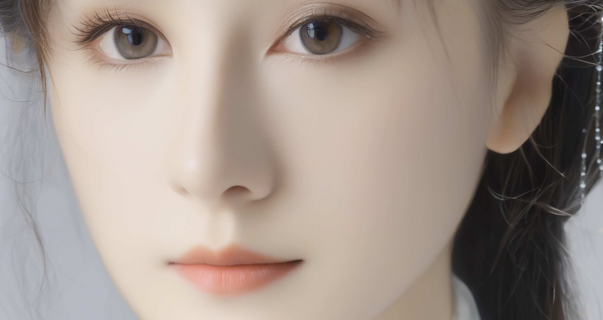

# webui环境运行报错
1 机       

    File "/root/miniconda3/envs/webui310/lib/python3.10/site-packages/transformers/models/clip/modeling_clip.py", line 229, in forward
        position_embeddings = self.position_embedding(position_ids)

    File "/root/miniconda3/envs/webui310/lib/python3.10/site-packages/torch/nn/modules/sparse.py", line 162, in forward
        return F.embedding(
    File "/root/miniconda3/envs/webui310/lib/python3.10/site-packages/torch/nn/functional.py", line 2233, in embedding

    RuntimeError: Expected tensor for argument #1 'indices' to have one of the following scalar types: Long, Int; but got torch.cuda.HalfTensor instead (while checking arguments for embedding)

网上说需要改变量数值类型，太蠢了     
转成long类型才能作为nn.embedding的输入      

3 机

    RuntimeError: Failed to import transformers.models.clip.modeling_clip because of the following error (look up to see its traceback):

        CUDA Setup failed despite GPU being available. Please run the following command to get more information:

        python -m bitsandbytes

        Inspect the output of the command and see if you can locate CUDA libraries. You might need to add them
        to your LD_LIBRARY_PATH. If you suspect a bug, please take the information from python -m bitsandbytes
        and open an issue at: https://github.com/TimDettmers/bitsandbytes/issues

网上解决方法：

pip install transformers -U

依旧

RuntimeError: Failed to import transformers.models.clip.modeling_clip because of the following error (look up to see its traceback):
Failed to import transformers.generation.utils because of the following error (look up to see its traceback):

 pip install bitsandbytes -U

# 论文信息

[提交日期：2024 年 4 月 23 日]     
CutDiffusion：一种简单、快速、廉价且强大的扩散外推方法

CutDiffusion: A Simple, Fast, Cheap, and Strong Diffusion Extrapolation Method

将大型预训练的低分辨率扩散模型转换为更高分辨率的需求，即扩散外推，可显著提高扩散的适应性。我们提出了无需调整的 CutDiffusion，旨在简化和加速扩散外推过程，使其更经济实惠并提高性能。CutDiffusion 遵循现有的逐块外推，但将标准块扩散过程分为专注于全面结构去噪的初始阶段和专注于特定细节细化的后续阶段。全面的实验凸显了 CutDiffusion 的众多强大优势：（1）简单的方法构建，无需第三方参与即可实现简洁的高分辨率扩散过程；（2）通过单步高分辨率扩散过程实现快速的推理速度，并且需要更少的推理块；（3）由于逐块推理和全面结构去噪期间的块数更少，GPU 成本低廉；（4）强大的生成性能，源于对特定细节细化

林明宝，林志航，詹文懿，曹柳娟，季蓉蓉

https://github.com/lmbxmu/CutDiffusion

1Skywork AI
2Xiamen University

昆仑天工的

1024         

整个十秒钟     

还是不太懂      
还打乱顺序      
从demo看确实都是1024倍率    

# 按照readme重装环境

diffusers                 0.21.4

    Traceback (most recent call last):
    File "/teams/ai_model_1667305326/WujieAITeam/private/lujunda/newlytest/CutDiffusion/cutdiffusion.py", line 1304, in <module>
        pipe = CutDiffusionSDXLPipeline.from_single_file(args.model_ckpt, torch_dtype=torch.float16).to("cuda")
    File "/root/miniconda3/envs/CutDiffusion/lib/python3.9/site-packages/diffusers/loaders.py", line 2268, in from_single_file
        raise ValueError(f"Unhandled pipeline class: {pipeline_name}")
    ValueError: Unhandled pipeline class: CutDiffusionSDXLPipeline

Successfully installed diffusers-0.28.2 huggingface-hub-0.23.3

tokenizers 0.14.1 requires huggingface_hub<0.18,>=0.16.4, but you have huggingface-hub 0.23.3 which is incompatible.

transformers 4.34.1 requires tokenizers<0.15,>=0.14, but you have tokenizers 0.19.1 which is incompatible.

全部升级

    deprecate("Transformer2DModelOutput", "1.0.0", deprecation_message)
    text_encoder/config.json: 100%|████████████████████████████████████████| 565/565 [00:00<00:00, 26.1kB/s]
    scheduler/scheduler_config.json: 100%|█████████████████████████████████| 479/479 [00:00<00:00, 39.2kB/s]
    tokenizer/tokenizer_config.json: 100%|█████████████████████████████████| 737/737 [00:00<00:00, 20.8kB/s]
    model_index.json: 100%|████████████████████████████████████████████████| 609/609 [00:00<00:00, 22.7kB/s]
    text_encoder_2/config.json: 100%|██████████████████████████████████████| 575/575 [00:00<00:00, 24.6kB/s]
    tokenizer/special_tokens_map.json: 100%|███████████████████████████████| 472/472 [00:00<00:00, 37.5kB/s]
    tokenizer/vocab.json: 100%|████████████████████████████████████████| 1.06M/1.06M [00:00<00:00, 2.68MB/s]
    tokenizer/merges.txt: 100%|███████████████████████████████████████████| 525k/525k [00:00<00:00, 961kB/s]
    tokenizer_2/special_tokens_map.json: 100%|██████████████████████████████| 460/460 [00:00<00:00, 274kB/s]
    tokenizer_2/tokenizer_config.json: 100%|████████████████████████████████| 725/725 [00:00<00:00, 342kB/s]
    vae/config.json: 100%|██████████████████████████████████████████████████| 642/642 [00:00<00:00, 338kB/s]
    unet/config.json: 100%|█████████████████████████████████████████████| 1.68k/1.68k [00:00<00:00, 841kB/s]
    vae_1_0/config.json: 100%|██████████████████████████████████████████████| 607/607 [00:00<00:00, 278kB/s]
    Fetching 17 files: 100%|████████████████████████████████████████████████| 17/17 [00:01<00:00,  9.21it/s]
    Loading pipeline components...:   0%|                                             | 0/7 [00:00<?, ?it/s]Some weights of the model checkpoint were not used when initializing CLIPTextModel: 
    ['text_model.embeddings.position_ids']
    Loading pipeline components...: 100%|█████████████████████████████████████| 7/7 [00:04<00:

FutureWarning: `Transformer2DModelOutput` is deprecated and will be removed in version 1.0.0. Importing `Transformer2DModelOutput` from `diffusers.models.transformer_2d` is deprecated and this will be removed in a future version. Please use `from diffusers.models.modeling_outputs import Transformer2DModelOutput`, instead.

终于可以了       

    #pipe = CutDiffusionSDXLPipeline.from_pretrained(args.model_ckpt, torch_dtype=torch.float16).to("cuda")
    pipe = CutDiffusionSDXLPipeline.from_single_file(args.model_ckpt, torch_dtype=torch.float16).to("cuda")

scheduler

    EulerDiscreteScheduler {
    "_class_name": "EulerDiscreteScheduler",
    "_diffusers_version": "0.28.2",
    "beta_end": 0.012,
    "beta_schedule": "scaled_linear",
    "beta_start": 0.00085,
    "clip_sample": false,
    "final_sigmas_type": "zero",
    "interpolation_type": "linear",
    "num_train_timesteps": 1000,
    "prediction_type": "epsilon",
    "rescale_betas_zero_snr": false,
    "sample_max_value": 1.0,
    "set_alpha_to_one": false,
    "sigma_max": null,
    "sigma_min": null,
    "skip_prk_steps": true,
    "steps_offset": 1,
    "timestep_spacing": "leading",
    "timestep_type": "discrete",
    "trained_betas": null,
    "use_karras_sigmas": false
    }

# gradio demo编写

部署位置：    
/mnt/    
lujunda/CutDiffusion/cutdiffusion2.py       

    model_type = gr.Dropdown(
        label="Model",
        choices=model_type_choices,
        value=ModelType.FC.value,
        interactive=True,
    )

类

    from enum import Enum
    class ModelType(Enum):
        FC = ""
        FBC = ""

        @property
        def model_name(self) -> str:
            if self == ModelType.FC:
                return ".safetensors"
            else:
                assert self == ModelType.FBC
                return ".safetensors"
            
    model_type_choices = [ModelType.FC.value, ModelType.FBC.value]

调用设置

    selected_model_type = ModelType(model_type.value)
            print(selected_model_type.model_name)
            #ips = [prompt, image_width, image_height, num_samples, seed, steps, a_prompt, n_prompt, cfg, selected_model_type.model_name]

            不能直接字符串

            ips = [prompt, image_width, image_height, num_samples, seed, steps, a_prompt, n_prompt, cfg, model_type]
            relight_button.click(fn=process_cutdiffusion, inputs=ips, outputs=[result_gallery])

            input 放入这种类型

这个错误发生时,Gradio库(用于在Stable Diffusion网络UI中创建用户界面)遇到了输入类型的问题。错误消息表示Gradio期望一个带有_id属性的对象,但实际上收到了一个字符串。     
gradio/blocks.py文件中的这一行"inputs": [block._id for block in inputs],试图迭代inputs列表并收集列表中每个对象的_id属性。然而,它似乎inputs列表中有一个或多个元素是字符串,而不是带有_id属性的对象。

模型传参时候再转字符串输入模型

    #selected_model_type = ModelType(model_type.value)
    这个报错是str

    selected_model_type = ModelType(model_type)
    print(selected_model_type.model_name)

    results = process(prompt, image_width, image_height, num_samples, seed, steps, a_prompt, n_prompt, cfg, selected_model_type.model_name)

或者使用arg传入     
类似iclight

    args = ICLightArgs.fetch_from(p)
    if not args.enabled:
        return

    if isinstance(p, StableDiffusionProcessingTxt2Img) and p.enable_hr:
        raise NotImplementedError("Hires-fix is not yet supported in A1111.")

    self.apply_ic_light(p, args)

    def apply_ic_light(
        p: StableDiffusionProcessing,
        args: ICLightArgs,
    ):
        device = devices.get_device_for("ic_light")
        dtype = devices.dtype_unet

        # Load model
        unet_path = os.path.join(models_path, "unet", args.model_type.model_name)

## 清除ui_config

File "/teams/ai_model_1667305326/WujieAITeam/private/lujunda/newlytest/a1111webui193/stable-diffusion-webui/extensions/IC-Light-sd-webui/cutdiffusion.py", line 499, in check_inputs
    raise ValueError(f"the larger one of `height` and `width` has to be divisible by 1024 but are {height} and {width}.")
ValueError: the larger one of `height` and `width` has to be divisible by 1024 but are 640 and 512.

同时只能大分辨率生成

你可以像这样使用它：

    obj = gr.Checkbox(label="Some label",value=True)
    setattr(obj,"do_not_save_to_config",True)
唯一需要注意的是，您需要手动删除 ui-config.json 中该元素的任何现有条目。但以后不会再写入该条目。

 ui-config.json 在根目录

## webui环境报错
逐个对py包     

pip install omegaconf~=2.3.0

    Attempting uninstall: omegaconf
        Found existing installation: omegaconf 2.2.3
        Uninstalling omegaconf-2.2.3:
        Successfully uninstalled omegaconf-2.2.3
    Successfully installed omegaconf-2.3.0

    Installing collected packages: accelerate
    Attempting uninstall: accelerate
        Found existing installation: accelerate 0.21.0
        Uninstalling accelerate-0.21.0:
        Successfully uninstalled accelerate-0.21.0
    Successfully installed accelerate-0.23.0

pip install transformers~=4.34.0

diffusers 0.27.2 requires huggingface-hub>=0.20.2, but you have huggingface-hub 0.17.3 which is incompatible.

tokenizers 0.14.1 requires huggingface_hub<0.18,>=0.16.4, but you have huggingface-hub 0.23.3 which is incompatible.

pip install tokenizers -U

pip install transformers -U

后面这些没对

    tqdm
    einops
    matplotlib
    gradio
    gradio_imageslider
    opencv-python

运行到一半报错

    noise_pred = self.unet(

    File "/root/miniconda3/envs/webui310/lib/python3.10/site-packages/diffusers/models/unets/unet_2d_condition.py", line 1159, in forward
        emb = emb + aug_emb if aug_emb is not None else emb
    RuntimeError: The size of tensor a (8) must match the size of tensor b (2) at non-singleton dimension 0

## 从webui搬到原生gradio

    gradio/queueing.py", line 161, in attach_data
        raise ValueError("Event not found", event_id)
    ValueError: ('Event not found', '8a56c3f2dbf646c2ae2b7dd8aeaf9104')

    blocks._queue.attach_data(body)
    Fsite-packages/gradio/queueing.py", line 161, in attach_data
        raise ValueError("Event not found", event_id)
    ValueError: ('Event not found', '4fbbf417b6be478286ac55239c868dfd')
    ERROR:    Exception in ASGI application

@AntroSafin我降级到“gradio<4.0”（最新版本是 3.50.2）并且我不再看到这个问题，即使没有通过enable_queue=False。

After hours of debug, it turns out I was just missing proxy_buffering off; in location /

设置share并不行       

unset http_proxy     
unset https_proxy

unset all_proxy

降级？    

gradio                    4.8.0

pip install gradio==3.50.2

IMPORTANT: You are using gradio version 3.50.2, however version 4.29.0 is available, please upgrade.----------

终于运行进去了     

## 还是运行到一半报错

noise_pred = self.unet(

emb = emb + aug_emb if aug_emb is not None else emb
RuntimeError: The size of tensor a (8) must match the size of tensor b (2) at non-singleton dimension 0

和webui环境一样的错误     

尝试终端测试    

不会有问题    

返回运行gradio

image[0].save(f'{result_path}/{prompt}_{0}.png')
AttributeError: 'numpy.ndarray' object has no attribute 'save'

推理完了20步

有些奇怪，运行了一次源码就能用了    

emb = emb + aug_emb if aug_emb is not None else emb
RuntimeError: The size of tensor a (8) must match the size of tensor b (2) at non-singleton dimension 0

又有错？

cfg小数，step20         

好像是因为multiple cfg的特殊设置

    Image.fromarray(image[0]).save(f'{result_path}/{prompt}_{0}.png')
    File "/root/miniconda3/envs/CutDiffusion/lib/python3.9/site-packages/PIL/Image.py", line 3134, in fromarray
        raise TypeError(msg) from e
    TypeError: Cannot handle this data type: (1, 1, 3), <f4

该成pil     

 data = self.postprocess_data(fn_index, result["prediction"], state)
  File "/root/miniconda3/envs/CutDiffusion/lib/python3.9/site-packages/gradio/blocks.py", line 1447, in postprocess_data
    prediction_value = block.postprocess(prediction_value)
  File "/root/miniconda3/envs/CutDiffusion/lib/python3.9/site-packages/gradio/components/gallery.py", line 181, in postprocess
    for img in y:
TypeError: 'Image' object is not iterable

修改返回的np变量的维度

否则生成多张空白图

改batch view???

## 实现
参考webui的iclight diffusers加载版本    
再参考iclight源码，

显存缓存机制被claude优化了一点

    if not 'global_ckpt' in globals():
        global global_ckpt
        global_ckpt = {}
    if model_name in global_ckpt:  # 如果保存有，而且同名，复用
        pipe = global_ckpt[model_name]
    else: # 加载新的，或者不存在
        global_ckpt = {}
        torch.cuda.empty_cache()
        torch.cuda.ipc_collect()
        global_ckpt[model_name] = CutDiffusionSDXLPipeline.from_single_file(model_name, torch_dtype=torch.float16).to("cuda")
        pipe = global_ckpt[model_name]

## 写文件

    class StreamTee(object):
        """
        将输出重定向到多个流,例如sys.stdout到终端和日志文件。
        """
        def __init__(self, *streams):
            self.streams = streams
            
        def write(self, data):
            for stream in self.streams:
                stream.write(data)
                
        def flush(self):
            for stream in self.streams:
                stream.flush()

    log_file = open("output.txt", "a+")
    # 重定向标准输出到两个地方
    sys.stdout = StreamTee(sys.stdout, log_file)

    selected_model_type = ModelType(model_type)
    print(selected_model_type.model_name)
    print(scheduler_type)

    results = process(prompt, image_width, image_height, num_samples, seed, steps, a_prompt, n_prompt, float(cfg), selected_model_type.model_name,scheduler_type)
    # 关闭日志文件
    log_file.close()

stream.write(data)
ValueError: I/O operation on closed file.

    # StreamTee类的定义
    class StreamTee(object):
        """
        将输出重定向到多个流,例如sys.stdout到终端和日志文件。
        """
        def __init__(self, *streams):
            self.streams = streams
            
        def write(self, data):
            for stream in self.streams:
                stream.write(data)
                stream.flush()  # 及时将缓冲区数据写入文件
                
        def flush(self):
            pass  # 不需要执行任何操作

在这个版本中,我们没有显式地关闭日志文件,而是依赖Python在程序退出时自动关闭所有打开的文件。另外,我们在StreamTee的write方法中添加了stream.flush()语句,这样可以确保每次写入操作后,缓冲区的数据都会及时刷新到文件中,避免数据丢失。

通过这种方式,我们可以避免在关闭文件后继续向其写入数据,从而规避ValueError: I/O operation on closed file.错误的发生。

刚才你写的程序执行后，比如，
当前时间:当前时间:  2024年06月07日 14时51分40秒2024年06月07日 14时51分40秒

Edit
看起来是由于多线程或多进程同时向文件写入导致的乱序问题。在你之前的代码中,我们重定向了sys.stdout,这意味着所有的print语句都会通过多个流(终端和文件)输出。由于多个线程或进程同时向文件写入,可能会导致写入操作交错,从而出现乱序的情况。

为了解决这个问题,我们可以使用线程安全的队列来确保记录的有序性。下面是修改后的代码:

    python

    Copy code
    import sys
    import threading
    import queue

    # 创建一个线程安全的队列
    log_queue = queue.Queue()

    # 以追加模式打开文件,如果文件不存在则创建
    log_file = open("output.txt", "a+")

    # 定义一个线程,从队列中取出消息并写入文件
    def log_worker():
        while True:
            record = log_queue.get()
            if record is None:
                break
            log_file.write(record + '\n')
            log_file.flush()
            log_queue.task_done()

    # 启动日志记录线程
    log_thread = threading.Thread(target=log_worker, daemon=True)
    log_thread.start()

    # 重定向标准输出到队列
    sys.stdout = StreamTeeQueue(sys.stdout, log_queue)

    # 现在所有的print语句都会输出到终端和文件
    print("Hello, World!")
    print(f"当前时间: {datetime.datetime.now()}")

    # 等待队列中的消息全部写入文件
    log_queue.join()
    # 发送结束信号
    log_queue.put(None)
    # 等待日志线程结束
    log_thread.join()

    # 关闭日志文件
    log_file.close()

    # StreamTeeQueue类的定义
    class StreamTeeQueue(object):
        """
        将输出重定向到多个流,包括sys.stdout到终端和日志队列。
        """
        def __init__(self, stream, queue):
            self.stream = stream
            self.queue = queue

        def write(self, data):
            self.stream.write(data)
            self.queue.put(data)

        def flush(self):
            self.stream.flush()
在这个版本中,我们创建了一个线程安全的队列log_queue。所有的print语句将通过StreamTeeQueue类的write方法将消息写入终端和队列。我们启动了一个单独的线程log_worker,它会从队列中取出消息并顺序地写入文件。

在程序退出之前,我们需要等待队列中的所有消息都被写入文件。我们首先调用log_queue.join()等待队列中的所有任务完成,然后发送None作为结束信号,最后等待日志线程结束。

通过这种方式,我们将写入文件的操作从主线程中分离出来,由单独的线程顺序处理,从而避免了多线程同时写入导致的乱序问题。

执行这个程序,你应该能看到日志文件中的记录是有序的,即使在终端上可能由于多线程输出而出现乱序。

### 解决
不如写个logger

或者就是终端输入命令时候做下改变

如果你还想捕获错误输出,可以使用:

python main.py 2>&1 | tee -a log.txt

,你想要追加内容而不是覆盖文件。我们可以使用 tee 命令的 -a 选项来实现这一点。这里是修改后的命令:

为什么我运行这个命令后程序启动很慢，python gradio_demo.py 2>&1 | tee -a log.txt。当我只运行python gradio_demo.py 时，启动很快

启动变慢的可能原因:

I/O操作: tee命令正在将所有输出写入文件,这涉及磁盘I/O,可能会减慢程序的启动速度。
缓冲问题: 管道和重定向可能会改变输出的缓冲行为,导致看起来启动较慢。
额外进程: 使用管道创建了额外的进程(tee),这需要一些额外的系统资源和时间来设置。
日志记录开销: 如果程序在启动时产生大量输出,记录所有这些信息可能会导致明显的延迟。

建议:
如果您需要记录输出但又想保持快速启动,可以考虑:

在程序内部实现日志记录
使用后台任务来记录输出
仅在需要调试时使用完整的命令

测试tee命令:
尝试一个简单的命令来测试tee是否正常工作:
Copyecho "test" | tee -a log.txt

检查Python脚本:
脚本可能使用了不标准的输出方法。确保它使用print()或logging模块输出信息。
尝试不使用2>&1:
Copypython gradio_demo.py | tee -a log.txt

### log最终解决

好像是tmux问题

缓冲问题:
Python的输出可能被缓冲了。尝试添加 -u 参数来禁用缓冲:
python -u gradio_demo.py | tee -a log.txt

以下没试过    

stdbuf 命令:
使用 stdbuf 来强制立即刷新输出:
Copystdbuf -oL python gradio_demo.py | tee -a log.txt

重定向标准错误:
可能输出被发送到标准错误。尝试:
Copypython gradio_demo.py 2>&1 | tee -a log.txt

gradio 特定设置:
如果这是一个 gradio 应用,确保没有设置 quiet=True 或类似的参数来抑制输出。
检查 tmux 配置:
查看您的 tmux 配置文件 (~/.tmux.conf),确保没有影响输出的设置。

### huchenlei patcher logging写法
    import logging
    def model_patcher_hook(logger: logging.Logger):

        logger.info("__init__ hooks applied")
        logger.info("close hooks applied")
        def hook_sample():
        def decorator(func: Callable) -> Callable:
            @functools.wraps(func)
            def wrapped_sample_func(self: Sampler, *args, **kwargs):
                patcher: ModelPatcher = self.p.get_model_patcher()
                assert isinstance(patcher, ModelPatcher)
                patcher.patch_model()
                logger.info(f"Patch {patcher.name}.")

                try:
                    return func(self, *args, **kwargs)
                finally:
                    patcher.unpatch_model()
                    logger.info(f"Unpatch {patcher.name}.")

            return wrapped_sample_func

        return decorator

    Sampler.launch_sampling = hook_sample()(Sampler.launch_sampling)
    logger.info("sample hooks applied")

    在后续每次使用都会启用logging

    def create_logger():
        logger = logging.getLogger(__name__)
        logger.setLevel(logging.INFO)
        if not logger.handlers:
            handler = logging.StreamHandler(sys.stdout)
            handler.setFormatter(
                logging.Formatter("%(asctime)s - %(name)s - %(levelname)s - %(message)s")
            )
            logger.addHandler(handler)
        return logger

    model_patcher_hook(create_logger())

把返回的logger作为参数传入使用

效果   

2024-06-25 03:42:08,294 - model_patcher_hook.py - INFO - Unpatch hr_model_patcher of StableDiffusionProcessingTxt2Img.

message    
就是info 

打时间 简单好用

好像内部每个函数调用都会启用logging     

在后续每次使用都会启用logging     
这个没看明白    

因为函数内部有
logger.info(f"Patch {patcher.name}.")

还不错    

#### 修改 双流输出

要让你的日志输出同时写入终端和 log.txt 文件，可以修改 create_logger 函数，添加一个 FileHandler 来实现这一点。以下是修改后的代码：

    import logging
    import sys

    def create_logger():
        logger = logging.getLogger(__name__)
        logger.setLevel(logging.INFO)
        
        # 清除现有的处理程序，避免重复添加
        logger.handlers = []
        
        # 添加 StreamHandler 处理终端输出
        stream_handler = logging.StreamHandler(sys.stdout)
        stream_handler.setFormatter(
            logging.Formatter("%(asctime)s - %(name)s - %(levelname)s - %(message)s")
        )
        logger.addHandler(stream_handler)
        

        #主要加了下面
        # 添加 FileHandler 处理文件输出
        file_handler = logging.FileHandler("log.txt")
        file_handler.setFormatter(
            logging.Formatter("%(asctime)s - %(name)s - %(levelname)s - %(message)s")
        )
        logger.addHandler(file_handler)
        
        return logger

    # 假设 model_patcher_hook 是你需要调用的函数
    model_patcher_hook(create_logger())

## 5机装环境
from cutdiffusion2 import process_cutdiffusion                                                n
ImportError: cannot import name 'process_cutdiffussion' from partially initialized module 'cutdiffuision2' (most likely due to a circular import) (/cutdiffusion/cutdisffusion2.py)

这个错误的主要原因可能是:

循环导入: 如果 cutdiffusion2.py 文件和另一个文件相互导入,可能会导致这个问题。
拼写错误: 注意到错误信息中的文件名是 'cutdisffusion2.py',而不是 'cutdiffusion2.py'。这可能是个拼写错误。
部分初始化: 错误提示模块是"部分初始化的",这通常与循环导入有关。

CutDiffusion/lib/pyth
on3.9/site-packages/gradio/queueing.py", line 161, 
in attach_data                                     
    raise ValueError("Event not found", event_id)  
ValueError: ('Event not found', 'a2e6eff3739549ad8d
16baa9818b5870')                                   
ERROR:    Exception in ASGI application            
Traceback (most recent call last):

不打印日志为什么这么卡？？？      

 blocks._queue.attach_data(body)
  File "/root/miniconda3/envs/CutDiffusion/lib/python3.9/site-packages/gradio/queueing.py", line 161, in attach_data
    raise ValueError("Event not found", event_id)
ValueError: ('Event not found', '39f80d6391944b8ab5f595932f10c8e6')

@AntroSafin I downgraded to "gradio<4.0" (which the last version is 3.50.2) and I am not longer seeing this issue, even without passing enable_queue=False

gradio                    4.8.0

pip install gradio==3.50.2

竟然是之前的错

site-packages/diffusers/loaders.py", line 2268, in from_single_file
    raise ValueError(f"Unhandled pipeline class: {pipeline_name}")
ValueError: Unhandled pipeline class: CutDiffusionSDXLPipeline

diffusers                 0.21.4

pip install -U diffusers tokenizers transformers -i https://pypi.mirrors.ustc.edu.cn/simple/

Successfully installed diffusers-0.29.1 huggingface-hub-0.23.4 tokenizers-0.19.1 transformers-4.41.2

又可以了

首次用还需要代理才行

pip install httpx[socks]

新机子真麻烦

tokenizer/special_tokens_map.json: 100%|█| 472
tokenizer/tokenizer_config.json: 100%|█| 737/7
scheduler/scheduler_config.json: 100%|█| 479/4
text_encoder_2/config.json: 100%|█| 575/575 [0
model_index.json: 100%|█| 609/609 [00:00<00:00
text_encoder/config.json: 100%|█| 565/565 [00:
tokenizer/merges.txt: 100%|█| 525k/525k [00:00
tokenizer_2/tokenizer_config.json: 100%|█| 725
tokenizer_2/special_tokens_map.json: 100%|█| 4
vae/config.json: 100%|█| 642/642 [00:00<00:00,
vae_1_0/config.json: 100%|█| 607/607 [00:00<00
unet/config.json: 100%|█| 1.68k/1.68k [00:00<0
tokenizer/vocab.json: 100%|█| 1.06M/1.06M [00:
Fetching 17 files: 100%|█| 17/17 [00:02<00:00,
Loading pipeline components...: 100%|█| 7/7 [0

大概就几m 东西

五区机器3090加载模型竟然快很多，cpu的问题吗    
1分钟 vs 10分钟

好像不是采样器 底模的问题      
提示词不一样就很花    

还有房子背景的关系    
这时候就很花    

## 关于deepcopy和全局变量的正确赋值和正确释放

原来是切换是命名错误没跳进if    

依然是正确的    

    if not 'global_ckpt' in globals():
        global global_ckpt
        global_ckpt = {}
        global global_scheduler
        global_scheduler = {}
    if model_name in global_ckpt:  # 如果保存有，而且同名，复用
        pipe = global_ckpt[model_name]
    else: # 加载新的，或者不存在
        global_ckpt = {}
        torch.cuda.empty_cache()
        torch.cuda.ipc_collect()
        global_ckpt[model_name] = CutDiffusionSDXLPipeline.from_single_file(model_name, torch_dtype=torch.float16).to("cuda")
        pipe = global_ckpt[model_name]
        global_scheduler[model_name] = copy.deepcopy(pipe.scheduler)

果然啊        

## 采样器不太支持
dpm类好像就是用不了       

diffusers采样器没去研究 有时间 有想法再说吧

## diffuses输出np保存

pil_image = Image.fromarray(images)
  File "/root/miniconda3/envs/CutDiffusion/lib/python3.9/site-packages/PIL/Image.py", line 3134, in fromarray
    raise TypeError(msg) from e
TypeError: Cannot handle this data type: (1, 1, 2048, 3), <f4

错误原因：
PIL的Image.fromarray()函数无法处理形状为(1, 1, 2048, 3)的4维浮点数（<f4）数组。PIL通常期望2D或3D数组，其中：

2D数组表示灰度图像
3D数组表示彩色图像，形状为(height, width, channels)

(1, 2048, 2048, 3)

但是我看shape是这样的       

前面的报错有点奇特 type error?

    except Exception as e:
        print("too large")
        print(f"ERROR: {e}")

不加f没法识别

ERROR: Cannot handle this data type: (1, 1, 3), <f4

还是存不了

images (1, 2048, 2048, 3)

images[0] (2048, 2048, 3)

难道还要旋转通道？

    def fromarray(obj, mode=None):
        """
        Creates an image memory from an object exporting the array interface
        (using the buffer protocol)::

pil_image = Image.fromarray(images[0])

竟然是这里 不是save报错

return none

好像是因为值在0 1 无法

    # 数组的值在 0 到 255 之间，类型为 uint8

    images[0] = (images[0] * 255).astype(np.uint8)

不知道 Gr 里面是如何操作的       
直接就拿这种np数据     

只能说pil不够智能

这种竖纹原因不明

后面没试

大图像的限制：

内存限制：PIL将整个图像加载到内存中。对于非常大的图像，可能会耗尽系统内存。
文件大小限制：某些文件格式（如JPEG）可能有最大文件大小限制。

处理大图像的策略：
a. 使用分块处理：

    pythonCopyfrom PIL import Image

    def save_large_image(input_path, output_path, max_size=(65000, 65000)):
        with Image.open(input_path) as img:
            width, height = img.size
            for i in range(0, width, max_size[0]):
                for j in range(0, height, max_size[1]):
                    box = (i, j, min(i+max_size[0], width), min(j+max_size[1], height))
                    chunk = img.crop(box)
                    chunk.save(f"{output_path}_{i}_{j}.jpg")

    save_large_image("very_large_image.tif", "output_chunk")
b. 使用专门的库：
对于特别大的图像，考虑使用如GDAL（Geospatial Data Abstraction Library）这样的专门库。
c. 降低分辨率或压缩：

    pythonCopylarge_image = Image.open("large_image.jpg")
    large_image.thumbnail((4000, 4000))  # 调整大小
    large_image.save("compressed_large_image.jpg", quality=85)  # 压缩

注意事项：

确保有足够的磁盘空间。
保存大图像可能需要较长时间，考虑添加进度指示。
对于超大图像，可能需要考虑使用其他格式，如TIFF或专门的大图像格式。

内存效率：
使用Image.open()时加上with语句可以确保文件正确关闭：
pythonCopywith Image.open("large_image.jpg") as img:
    # 处理图像
    img.save("processed_large_image.jpg")

# 启动
python -u gradio_demo.py | tee -a log.txt

五区或一区

# pipeline原理

    # Copied from diffusers.pipelines.stable_diffusion.pipeline_stable_diffusion.StableDiffusionPipeline.enable_vae_slicing
    def enable_vae_slicing(self):
    r"""
        Enable sliced VAE decoding. When this option is enabled, the VAE will split the input tensor in slices to
        compute decoding in several steps. This is useful to save some memory and allow larger batch sizes.
        """
    self.vae.enable_slicing(）

区别？

    # Copied from diffusers.pipelines.stable_diffusion.pipeline_stable_diffusion.StableDiffusionPipeline.enable_vae_tiling
    def enable_vae_tiling(self):
        r"""
        Enable tiled VAE decoding. When this option is enabled, the VAE will split the input tensor into tiles to
        compute decoding and encoding in several steps. This is useful for saving a large amount of memory and to allow
        processing larger images.
        """
        self.vae.enable_tiling()

Sliced VAE   
Sliced VAE enables decoding large batches of images with limited VRAM or batches with 32 images or more by decoding the batches of latents one image at a time. You’ll likely want to couple this with enable_xformers_memory_efficient_attention() to reduce memory use further if you have xFormers installed.

vae分解batch处理进diffusion再合？

You may see a small performance boost in VAE decoding on multi-image batches, and there should be no performance impact on single-image batches.

Tiled VAE   
Tiled VAE processing also enables working with large images on limited VRAM (for example, generating 4k images on 8GB of VRAM) by splitting the image into overlapping tiles, decoding the tiles, and then blending the outputs together to compose the final image. You should also used tiled VAE with enable_xformers_memory_efficient_attention() to reduce memory use further if you have xFormers installed.

理论上没有区别?        
可能有 因为残缺            

The output image has some tile-to-tile tone variation because the tiles are decoded separately, but you shouldn’t see any sharp and obvious seams between the tiles. Tiling is turned off for images that are 512x512 or smaller.

理论上和upscale一样 继承自 diffusionpipeline

upscale

    def check_inputs(
        self,
        prompt,
        image,
        noise_level,
        callback_steps,
        negative_prompt=None,
        prompt_embeds=None,
        negative_prompt_embeds=None,
    ):

cutdiffusion

    def check_inputs(
        self,
        prompt,
        prompt_2, 这个特殊
        height,
        width,
        callback_steps,
        negative_prompt=None,
        negative_prompt_2=None,
        prompt_embeds=None,
        negative_prompt_embeds=None,
        pooled_prompt_embeds=None,
        negative_pooled_prompt_embeds=None,
        num_images_per_prompt=None,
    ):

输入倒是没有多的

sdxl

    def check_inputs(
        self,
        prompt,
        prompt_2,
        height,
        width,
        callback_steps,
        negative_prompt=None,
        negative_prompt_2=None,
        prompt_embeds=None,
        negative_prompt_embeds=None,
        pooled_prompt_embeds=None,
        negative_pooled_prompt_embeds=None,
        ip_adapter_image=None,
        ip_adapter_image_embeds=None,
        callback_on_step_end_tensor_inputs=None,
    ):

prompt_2 (`str` or `List[str]`, *optional*):
    The prompt or prompts to be sent to the `tokenizer_2` and `text_encoder_2`. If not defined, `prompt` is
    used in both text-encoders

## 差异

    def get_views(self, height, width, window_size=128, stride=64, random_jitter=False):
        # Here, we define the mappings F_i (see Eq. 7 in the MultiDiffusion paper https://arxiv.org/abs/2302.08113)
        # if panorama's height/width < window_size, num_blocks of height/width should return 1

        height //= self.vae_scale_factor
        width //= self.vae_scale_factor
        num_blocks_height = int((height - window_size) / stride - 1e-6) + 2 if height > window_size else 1
        num_blocks_width = int((width - window_size) / stride - 1e-6) + 2 if width > window_size else 1
        total_num_blocks = int(num_blocks_height * num_blocks_width)

@torch.no_grad()
    @replace_example_docstring(EXAMPLE_DOC_STRING)
    def __call__(

    self,
    prompt: Union[str, List[str]] = None,
    prompt_2: Optional[Union[str, List[str]]] = None,
    height: Optional[int] = None,
    width: Optional[int] = None,
    num_inference_steps: int = 50,
    denoising_end: Optional[float] = None,
    guidance_scale: float = 5.0,
    negative_prompt: Optional[Union[str, List[str]]] = None,
    negative_prompt_2: Optional[Union[str, List[str]]] = None,
    num_images_per_prompt: Optional[int] = 1,
    eta: float = 0.0,
    generator: Optional[Union[torch.Generator, List[torch.Generator]]] = None,
    latents: Optional[torch.FloatTensor] = None,
    prompt_embeds: Optional[torch.FloatTensor] = None,
    negative_prompt_embeds: Optional[torch.FloatTensor] = None,
    pooled_prompt_embeds: Optional[torch.FloatTensor] = None,
    negative_pooled_prompt_embeds: Optional[torch.FloatTensor] = None,
    output_type: Optional[str] = "pil",
    return_dict: bool = False,
    callback: Optional[Callable[[int, int, torch.FloatTensor], None]] = None,
    callback_steps: int = 1,
    cross_attention_kwargs: Optional[Dict[str, Any]] = None,
    guidance_rescale: float = 0.0,
    original_size: Optional[Tuple[int, int]] = None,
    crops_coords_top_left: Tuple[int, int] = (0, 0),
    target_size: Optional[Tuple[int, int]] = None,
    negative_original_size: Optional[Tuple[int, int]] = None,
    negative_crops_coords_top_left: Tuple[int, int] = (0, 0),
    negative_target_size: Optional[Tuple[int, int]] = None,
    ################### CutDiffusion specific parameters ####################
    view_batch_size: int = 16,
    stride: Optional[int] = 64,
    multi_guidance_scale: Optional[float] = 7.5,
    shuffle: bool = False,
    result_path: str = './output/ours',
    debug: bool = False,
    proportion: Optional[float] = 0.5,
    ):

说明

    prompt_embeds (`torch.FloatTensor`, *optional*):
        Pre-generated text embeddings. Can be used to easily tweak text inputs, *e.g.* prompt weighting. If not
        provided, text embeddings will be generated from `prompt` input argument.
    negative_prompt_embeds (`torch.FloatTensor`, *optional*):
        Pre-generated negative text embeddings. Can be used to easily tweak text inputs, *e.g.* prompt
        weighting. If not provided, negative_prompt_embeds will be generated from `negative_prompt` input
        argument.
    pooled_prompt_embeds (`torch.FloatTensor`, *optional*):
        Pre-generated pooled text embeddings. Can be used to easily tweak text inputs, *e.g.* prompt weighting.
        If not provided, pooled text embeddings will be generated from `prompt` input argument.
    negative_pooled_prompt_embeds (`torch.FloatTensor`, *optional*):

    callback (`Callable`, *optional*):
        A function that will be called every `callback_steps` steps during inference. The function will be
        called with the following arguments: `callback(step: int, timestep: int, latents: torch.FloatTensor)`.
    callback_steps (`int`, *optional*, defaults to 1):
        The frequency at which the `callback` function will be called. If not specified, the callback will be
                called at every step.

    guidance_rescale (`float`, *optional*, defaults to 0.7):
        Guidance rescale factor proposed by [Common Diffusion Noise Schedules and Sample Steps are
        Flawed](https://arxiv.org/pdf/2305.08891.pdf) `guidance_scale` is defined as `φ` in equation 16. of
        [Common Diffusion Noise Schedules and Sample Steps are Flawed](https://arxiv.org/pdf/2305.08891.pdf).
        Guidance rescale factor should fix overexposure when using zero terminal SNR.
    original_size (`Tuple[int]`, *optional*, defaults to (1024, 1024)):
        If `original_size` is not the same as `target_size` the image will appear to be down- or upsampled.
        `original_size` defaults to `(width, height)` if not specified. Part of SDXL's micro-conditioning as
        explained in section 2.2 of
        [https://huggingface.co/papers/2307.01952](https://huggingface.co/papers/2307.01952).
    crops_coords_top_left (`Tuple[int]`, *optional*, defaults to (0, 0)):
        `crops_coords_top_left` can be used to generate an image that appears to be "cropped" from the position
        `crops_coords_top_left` downwards. Favorable, well-centered images are usually achieved by setting
        `crops_coords_top_left` to (0, 0). Part of SDXL's micro-conditioning as explained in section 2.2 of
        [https://huggingface.co/papers/2307.01952](https://huggingface.co/papers/2307.01952).

    target_size (`Tuple[int]`, *optional*, defaults to (1024, 1024)):
        For most cases, `target_size` should be set to the desired height and width of the generated image. If
        not specified it will default to `(width, height)`. Part of SDXL's micro-conditioning as explained in
        section 2.2 of [https://huggingface.co/papers/2307.01952](https://huggingface.co/papers/2307.01952).
    negative_original_size (`Tuple[int]`, *optional*, defaults to (1024, 1024)):
        To negatively condition the generation process based on a specific image resolution. Part of SDXL's
        micro-conditioning as explained in section 2.2 of
        [https://huggingface.co/papers/2307.01952](https://huggingface.co/papers/2307.01952). For more
        information, refer to this issue thread: https://github.com/huggingface/diffusers/issues/4208.
    negative_crops_coords_top_left (`Tuple[int]`, *optional*, defaults to (0, 0)):
        To negatively condition the generation process based on a specific crop coordinates. Part of SDXL's
        micro-conditioning as explained in section 2.2 of
        [https://huggingface.co/papers/2307.01952](https://huggingface.co/papers/2307.01952). For more
        information, refer to this issue thread: https://github.com/huggingface/diffusers/issues/4208.
    negative_target_size (`Tuple[int]`, *optional*, defaults to (1024, 1024)):
        To negatively condition the generation process based on a target image resolution. It should be as same
        as the `target_size` for most cases. Part of SDXL's micro-conditioning as explained in section 2.2 of
        [https://huggingface.co/papers/2307.01952](https://huggingface.co/papers/2307.01952). For more
        information, refer to this issue thread: https://github.com/huggingface/diffusers/issues/4208.

## 核心差异 denoise

之前单步报错的原因也在这      

stride

view_batch_size

这两个参数不知道是否影响大图效果    
到是可以搞个for循环

2048新机子 加载到推理一分半

确实有一些细节处理      
denoise 过程分别调用不同的细节增强方法

最后vae tile

应该是在每几步开启一回细节增强，所以每步速度不同，显存占用差距500m

4096大约五分钟

历史

内置最大4096？？

私人

还可以

8min

就是多了两个人脸

16384

110min

可能需要挑一些参数

8192

30min

    output_images = []
    ############################################# denoise #############################################
    with self.progress_bar(total=num_inference_steps) as progress_bar:

        for i, t in enumerate(timesteps):
            torch.cuda.empty_cache()
            if i < len(timesteps) * proportion:
                Structure_Denoising = True
                Detail_Refinement =  False
            elif i == len(timesteps) * proportion:
                height_scale_num = int(height / (self.unet.config.sample_size * self.vae_scale_factor)) 
                width_scale_num = int(width / (self.unet.config.sample_size * self.vae_scale_factor)) 
                latents_temp = torch.zeros_like(latents)
                latents_temp = latents_temp.reshape(1, 4, height // self.vae_scale_factor, width // self.vae_scale_factor)
                views2 = [[h, w] for h in range(height_scale_num) for w in range(width_scale_num)]
                for latents_view, (h, w) in zip(
                    latents.chunk(height_scale_num * width_scale_num), views2
                ):  
                    latents_temp[:, :, h::height_scale_num, w::width_scale_num] += latents_view
                latents = latents_temp
                Detail_Refinement =  True
                Structure_Denoising = False
            else:
                Structure_Denoising = False
                Detail_Refinement =  True

            count = torch.zeros_like(latents)
            value = torch.zeros_like(latents)

            
            ############################################# Comprehensive Structure Denoising #############################################
            if Structure_Denoising:
                latents_for_view = latents
                if shuffle:
                    ######## Pixel interaction ########
                    shape = latents_for_view.shape
                    shuffle_index = torch.stack([torch.randperm(shape[0]) for _ in range(latents_for_view.reshape(-1).shape[0]//shape[0])])

                    shuffle_index = shuffle_index.view(shape[1],shape[2],shape[3],shape[0])
                    original_index = torch.zeros_like(shuffle_index).scatter_(3, shuffle_index, torch.arange(shape[0]).repeat(shape[1], shape[2], shape[3], 1))

                    shuffle_index = shuffle_index.permute(3,0,1,2).to(device)
                    original_index = original_index.permute(3,0,1,2).to(device)
                    latents_for_view_ = latents_for_view.gather(0, shuffle_index)

                                    # expand the latents if we are doing classifier free guidance
                if shuffle:
                    latent_model_input = latents_for_view_
                else:
                    latent_model_input = latents_for_view

                views_batch = [latent_model_input[i : i + view_batch_size] for i in range(0, len(latent_model_input), view_batch_size)]
                latent_temp = []
                for j, batch_view in enumerate(views_batch):
                    vb_size = len(batch_view)
                    # get the latents corresponding to the current view coordinates
                    latent_model_input = torch.cat(
                        [batch_view]
                    )

                    latent_model_input = (
                        latent_model_input.repeat_interleave(2, dim=0)
                        if do_classifier_free_guidance
                        else latent_model_input
                    )

                    latent_model_input = self.scheduler.scale_model_input(latent_model_input, t)

                    prompt_embeds_input = torch.cat([prompt_embeds] * vb_size)
                    add_text_embeds_input = torch.cat([add_text_embeds] * vb_size)
                    add_time_ids_input = torch.cat([add_time_ids] * vb_size)

                    # predict the noise residual
                    added_cond_kwargs = {"text_embeds": add_text_embeds_input, "time_ids": add_time_ids_input}
                    noise_pred = self.unet(
                        latent_model_input,
                        t,
                        encoder_hidden_states=prompt_embeds_input,
                        cross_attention_kwargs=cross_attention_kwargs,
                        added_cond_kwargs=added_cond_kwargs,
                        return_dict=False,
                    )[0]

                    if do_classifier_free_guidance:
                        noise_pred_uncond, noise_pred_text = noise_pred[::2], noise_pred[1::2]
                        noise_pred = noise_pred_uncond + guidance_scale * (noise_pred_text - noise_pred_uncond)

                    if do_classifier_free_guidance and guidance_rescale > 0.0:
                        # Based on 3.4. in https://arxiv.org/pdf/2305.08891.pdf
                        noise_pred = rescale_noise_cfg(noise_pred, noise_pred_text, guidance_rescale=guidance_rescale)
                    latent_temp.append(noise_pred)

                noise_pred = torch.cat(latent_temp)
                if shuffle:
                    noise_pred = noise_pred.gather(0, original_index)
                
                # compute the previous noisy sample x_t -> x_t-1
                self.scheduler._init_step_index(t)
                latents_denoised_batch = self.scheduler.step(noise_pred, t, latents_for_view, **extra_step_kwargs, return_dict=False)[0]
                    
                latents = latents_denoised_batch
            

            ############################################# Specific Detail Refinement #############################################
            if Detail_Refinement:
                random_jitter = True
                window_size = self.unet.config.sample_size
                views = self.get_views(height, width, stride=stride, window_size=window_size, random_jitter=random_jitter)
                views_batch = [views[i : i + view_batch_size] for i in range(0, len(views), view_batch_size)]
                
                if random_jitter:
                    jitter_range = int((window_size - stride) // 4)
                    latents_ = F.pad(latents, (jitter_range, jitter_range, jitter_range, jitter_range), 'constant', 0)
                else:
                    latents_ = latents

                count_local = torch.zeros_like(latents_)
                value_local = torch.zeros_like(latents_)

                for j, batch_view in enumerate(views_batch):
                    vb_size = len(batch_view)
                    # get the latents corresponding to the current view coordinates
                    latents_for_view = torch.cat(
                        [
                            latents_[:, :, h_start:h_end, w_start:w_end]
                            for h_start, h_end, w_start, w_end in batch_view
                        ]
                    )

                    # expand the latents if we are doing classifier free guidance
                    latent_model_input = latents_for_view
                    latent_model_input = (
                        latent_model_input.repeat_interleave(2, dim=0)
                        if do_classifier_free_guidance
                        else latent_model_input
                    )
                    latent_model_input = self.scheduler.scale_model_input(latent_model_input, t)

                    add_time_ids_input = []
                    for h_start, h_end, w_start, w_end in batch_view:
                        add_time_ids_ = add_time_ids.clone()
                        add_time_ids_[:, 2] = h_start * self.vae_scale_factor
                        add_time_ids_[:, 3] = w_start * self.vae_scale_factor
                        add_time_ids_input.append(add_time_ids_)
                    add_time_ids_input = torch.cat(add_time_ids_input)

                    prompt_embeds_input = torch.cat([prompt_embeds] * vb_size)
                    add_text_embeds_input = torch.cat([add_text_embeds] * vb_size)
                    # predict the noise residual
                    added_cond_kwargs = {"text_embeds": add_text_embeds_input, "time_ids": add_time_ids_input}
                    noise_pred = self.unet(
                        latent_model_input,
                        t,
                        encoder_hidden_states=prompt_embeds_input,
                        cross_attention_kwargs=cross_attention_kwargs,
                        added_cond_kwargs=added_cond_kwargs,
                        return_dict=False,
                    )[0]

                    if do_classifier_free_guidance:
                        noise_pred_uncond, noise_pred_text = noise_pred[::2], noise_pred[1::2]
                        noise_pred = noise_pred_uncond + multi_guidance_scale * (noise_pred_text - noise_pred_uncond)

                    if do_classifier_free_guidance and guidance_rescale > 0.0:
                        # Based on 3.4. in https://arxiv.org/pdf/2305.08891.pdf
                        noise_pred = rescale_noise_cfg(noise_pred, noise_pred_text, guidance_rescale=guidance_rescale)

                    # compute the previous noisy sample x_t -> x_t-1
                    self.scheduler._init_step_index(t)
                    latents_denoised_batch = self.scheduler.step(
                        noise_pred, t, latents_for_view, **extra_step_kwargs, return_dict=False)[0]
                    
                    # extract value from batch
                    for latents_view_denoised, (h_start, h_end, w_start, w_end) in zip(
                        latents_denoised_batch.chunk(vb_size), batch_view
                    ):
                        value_local[:, :, h_start:h_end, w_start:w_end] += latents_view_denoised
                        count_local[:, :, h_start:h_end, w_start:w_end] += 1

                if random_jitter:
                    value_local = value_local[: ,:, jitter_range: jitter_range + height // self.vae_scale_factor, jitter_range: jitter_range + width // self.vae_scale_factor]
                    count_local = count_local[: ,:, jitter_range: jitter_range + height // self.vae_scale_factor, jitter_range: jitter_range + width // self.vae_scale_factor]

                value += value_local / count_local
                count += torch.ones_like(value_local) 
                latents = torch.where(count > 0, value / count, value)
            ###################################################################################   
            
            # call the callback, if provided
            if i == len(timesteps) - 1 or ((i + 1) > num_warmup_steps and (i + 1) % self.scheduler.order == 0):
                progress_bar.update()
                if callback is not None and i % callback_steps == 0:
                    step_idx = i // getattr(self.scheduler, "order", 1)
                    callback(step_idx, t, latents)

        ###########################################################################################################################
        if not output_type == "latent":
            # make sure the VAE is in float32 mode, as it overflows in float16
            needs_upcasting = self.vae.dtype == torch.float16 and self.vae.config.force_upcast
            
            if needs_upcasting:
                self.upcast_vae()
                latents = latents.to(next(iter(self.vae.post_quant_conv.parameters())).dtype)

            print("###Decoding###")
            if height > 2048 or width > 2048:
                self.enable_vae_tiling()
                image = self.vae.decode(latents / self.vae.config.scaling_factor, return_dict=False)[0]
            else:
                image = self.vae.decode(latents / self.vae.config.scaling_factor, return_dict=False)[0]

            image = self.image_processor.postprocess(image, output_type=output_type)

            """
            if os.path.exists(result_path) == False:
                os.makedirs(result_path)
            Image.fromarray(image[0]).save(f'{result_path}/{prompt}_{0}.png')
            """

            output_images.append(image[0])

            # cast back to fp16 if needed
            if needs_upcasting:
                self.vae.to(dtype=torch.float16)
        else:
            image = latents

    # Offload all models
    self.maybe_free_model_hooks()

    #return output_images

## 原理再阅读   
Detail_Refinement     
比较好奇如果设置好windows size 是不是可以用来生产 16384

估计还会在学习一周    

cut mixdq     

github上当前有的   

复习

# 结尾
