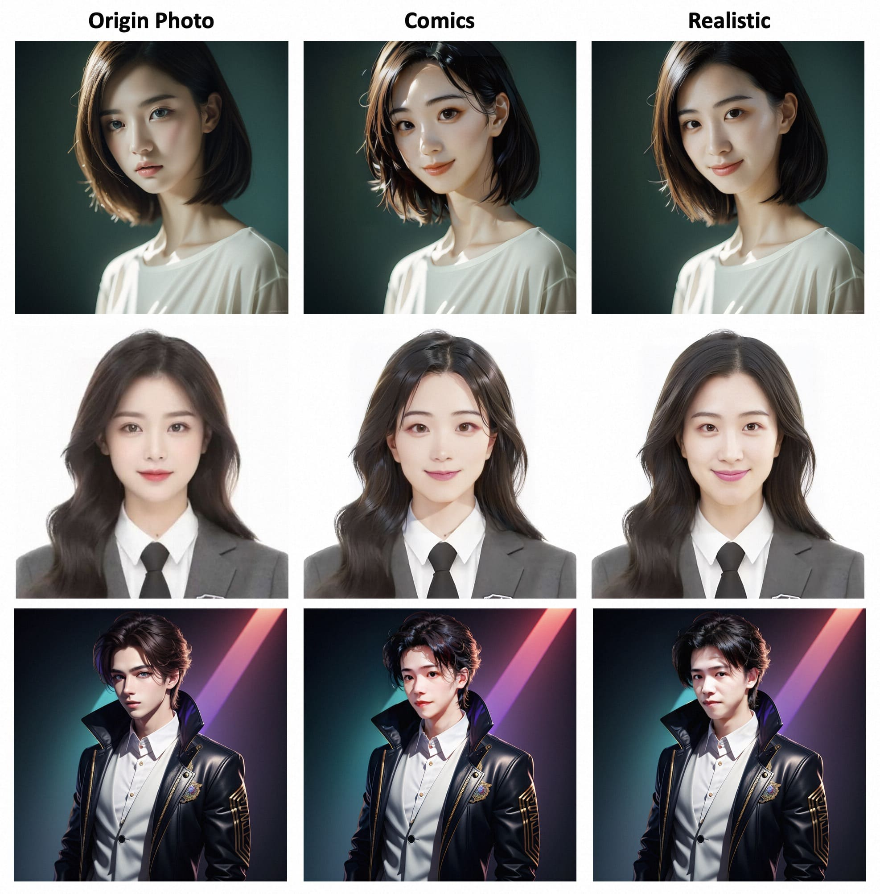
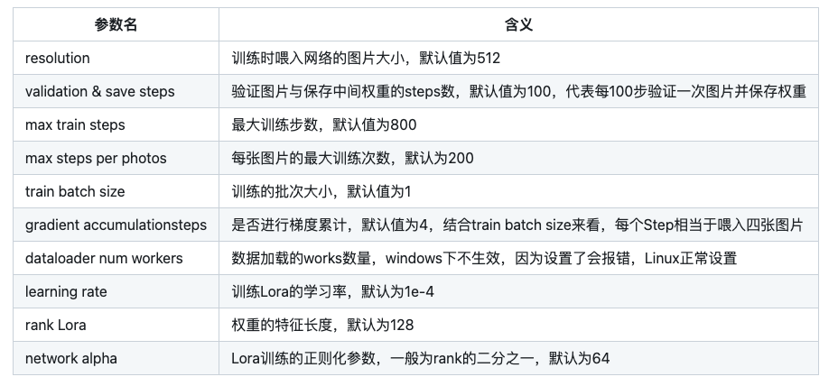
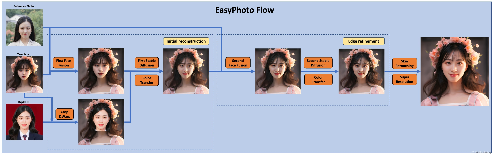
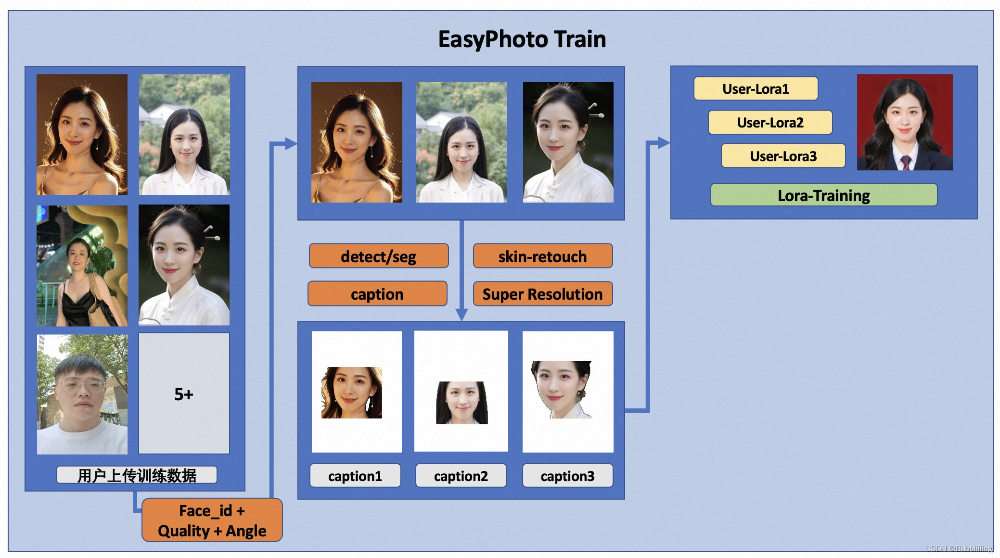

# webui安装插件      
https://github.com/s0md3v/sd-webui-roop    
报错   
 POST git-upload-pack (304 bytes) fatal: unable to access 'https://github.com/s0md3v/sd-webui-roop/': gnutls_handshake() failed: The TLS connection was non-properly terminated. warning: Clone succeeded, but checkout failed. You can inspect what was checked out with 'git status' and retry with 'git restore --source=HEAD :/' '

再运行一次

# stable-diffusion-webui-vectorstudio

SVG（Scalable Vector Graphics）

https://github.com/GeorgLegato/stable-diffusion-webui-vectorstudio

readme中写的是win用法

linux没写

用法：     
script中选择    
生图     
可发送到extension编辑

安装可用方案是      

sudo apt-get install potrace 安装 potrace    

extension相关bin/potrace rm

extension相关bin/potrace软连接到/usr/bin/potr
ace      
或者直接复制过来

## Pytorch-SVGRender

根据文本内容生成各种风格的SVG，支持六种基本的矢量元，包括Iconography, Sketch, Pixel Art, Low-Poly, Painting和 Ink and Wash

# EasyPhoto
https://github.com/aigc-apps/sd-webui-EasyPhoto/tree/main

EasyPhoto | Your Smart AI Photo Generator.

    支持基于LCM-Lora的采样加速，现在您只需要进行12个steps(vs 50steps)来生成图像和视频, 并支持了场景化（风格化） Lora的训练和大量内置的模型。[🔥 🔥 🔥 🔥 2023.12.09]
    支持基于Concepts-Sliders的属性编辑和虚拟试穿，请参考sliders-wiki , tryon-wiki获取更多详细信息。[🔥 🔥 🔥 🔥 2023.12.08]
    感谢揽睿星舟 提供了内置EasyPhoto的SDWebUI官方镜像，并承诺每两周更新一次。亲自测试，可以在2分钟内拉起资源，并在5分钟内完成启动。[🔥 🔥 🔥 🔥 2023.11.20]
    ComfyUI 支持 repo, 感谢THtianhao的精彩工作![🔥 🔥 🔥 2023.10.17]
    EasyPhoto 论文地址 arxiv[🔥 🔥 🔥 2023.10.10]
    支持使用SDXL模型和一定的选项直接生成高清大图，不再需要上传模板，需要16GB显存。具体细节可以前往这里[🔥 🔥 🔥 2023.09.26]
    我们同样支持Diffusers版本。 [🔥 2023.09.25]
    支持对背景进行微调，并计算生成的图像与用户之间的相似度得分。 [🔥🔥 2023.09.15]
    支持不同预测基础模型。 [🔥🔥 2023.09.08]
    支持多人生成！添加缓存选项以优化推理速度。在UI上添加日志刷新。 [🔥🔥 2023.09.06]
    创建代码！现在支持 Windows 和 Linux。[🔥 2023.09.02]

通过docker
使用docker的情况下，请保证机器中已经正确安装显卡驱动与CUDA环境，然后以此执行以下命令：

    # 拉取镜像
    docker pull registry.cn-beijing.aliyuncs.com/mybigpai/sd-webui-easyphoto:0.0.3

    # 进入镜像
    docker run -it -p 7860:7860 --network host --gpus all registry.cn-beijing.aliyuncs.com/mybigpai/sd-webui-easyphoto:0.0.3

    # 启动webui
    python3 launch.py --port 7860

b. 相关资料库和权重下载

i. Controlnet    
我们需要使用 Controlnet 进行推理。相关软件源是Mikubill/sd-webui-controlnet。在使用 EasyPhoto 之前，您需要安装这个软件源。

此外，我们至少需要三个 Controlnets 用于推理。因此，您需要设置 Multi ControlNet: Max models amount (requires restart)。

点击上传照片后，我们可以开始上传图像这里最好上传5到20张图像，包括不同的角度和光照。最好有一些不包括眼镜的图像。如果所有图片都包含眼镜眼镜，则生成的结果可以容易地生成眼镜。

b. 多人模板

    步骤1：转到EasyPhoto的设置页面，设置num_of_Faceid大于1。
    步骤2：应用设置。
    步骤3：重新启动webui的ui界面。
    步骤4：返回EasyPhoto并上传多人模板。
    步骤5：选择两个人的用户ID。
    步骤6：单击“生成”按钮。执行图像生成。

我们希望模型生成的图像逼真且与用户相似，而传统方法会引入不真实的光照（如人脸融合或roop）。为了解决这种不真实的问题，我们引入了稳定扩散模型的图像到图像功能。生成完美的个人肖像需要考虑所需的生成场景和用户的数字分身。我们使用一个预先准备好的模板作为所需的生成场景，并使用一个在线训练的人脸 LoRA 模型作为用户的数字分身，这是一种流行的稳定扩散微调模型。我们使用少量用户图像来训练用户的稳定数字分身，并在推理过程中根据人脸 LoRA 模型和预期生成场景生成个人肖像图像。

首先，我们对输入的用户图像进行人脸检测，确定人脸位置后，按照一定比例截取输入图像。然后，我们使用显著性检测模型和皮肤美化模型获得干净的人脸训练图像，该图像基本上只包含人脸。然后，我们为每张图像贴上一个固定标签。这里不需要使用标签器，而且效果很好。最后，我们对稳定扩散模型进行微调，得到用户的数字分身。

在训练过程中，我们会利用模板图像进行实时验证，在训练结束后，我们会计算验证图像与用户图像之间的人脸 ID 差距，从而实现 Lora 融合，确保我们的 Lora 是用户的完美数字分 身。

此外，我们将选择验证中与用户最相似的图像作为 face_id 图像，用于推理。

推理细节   
a. 第一次扩散：     
首先，我们将对接收到的模板图像进行人脸检测，以确定为实现稳定扩散而需要涂抹的遮罩。然后，我们将使用模板图像与最佳用户图像进行人脸融合。人脸融合完成后，我们将使用上述遮罩对融合后的人脸图像进行内绘（fusion_image）。此外，我们还将通过仿射变换（replace_image）把训练中获得的最佳 face_id 图像贴到模板图像上。然后，我们将对其应用 Controlnets，在融合图像中使用带有颜色的 canny 提取特征，在替换图像中使用 openpose 提取特征，以确保图像的相似性和稳定性。然后，我们将使用稳定扩散（Stable Diffusion）结合用户的数字分割进行生成。

b. 第二次扩散：     
在得到第一次扩散的结果后，我们将把该结果与最佳用户图像进行人脸融合，然后再次使用稳定扩散与用户的数字分身进行生成。第二次生成将使用更高的分辨率。

参考文献

    insightface：https://github.com/deepinsight/insightface
    cv_resnet50_face：https://www.modelscope.cn/models/damo/cv_resnet50_face-detection_retinaface/summary
    cv_u2net_salient：https://www.modelscope.cn/models/damo/cv_u2net_salient-detection/summary
    cv_unet_skin_retouching_torch：https://www.modelscope.cn/models/damo/cv_unet_skin_retouching_torch/summary
    cv_unet-image-face-fusion：https://www.modelscope.cn/models/damo/cv_unet-image-face-fusion_damo/summary
    kohya：https://github.com/bmaltais/kohya_ss
    controlnet-webui：https://github.com/Mikubill/sd-webui-controlnet

相关项目    
我们还列出了一些很棒的开源项目以及任何你可能会感兴趣的扩展项目：

    ModelScope.
    FaceChain.
    sd-webui-controlnet.
    sd-webui-roop.
    roop.
    sd-webui-deforum.
    sd-webui-additional-networks.
    a1111-sd-webui-tagcomplete.
    sd-webui-segment-anything.
    sd-webui-tunnels.
    sd-webui-mov2mov.

# 结尾