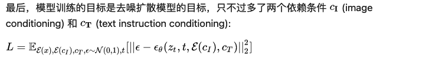
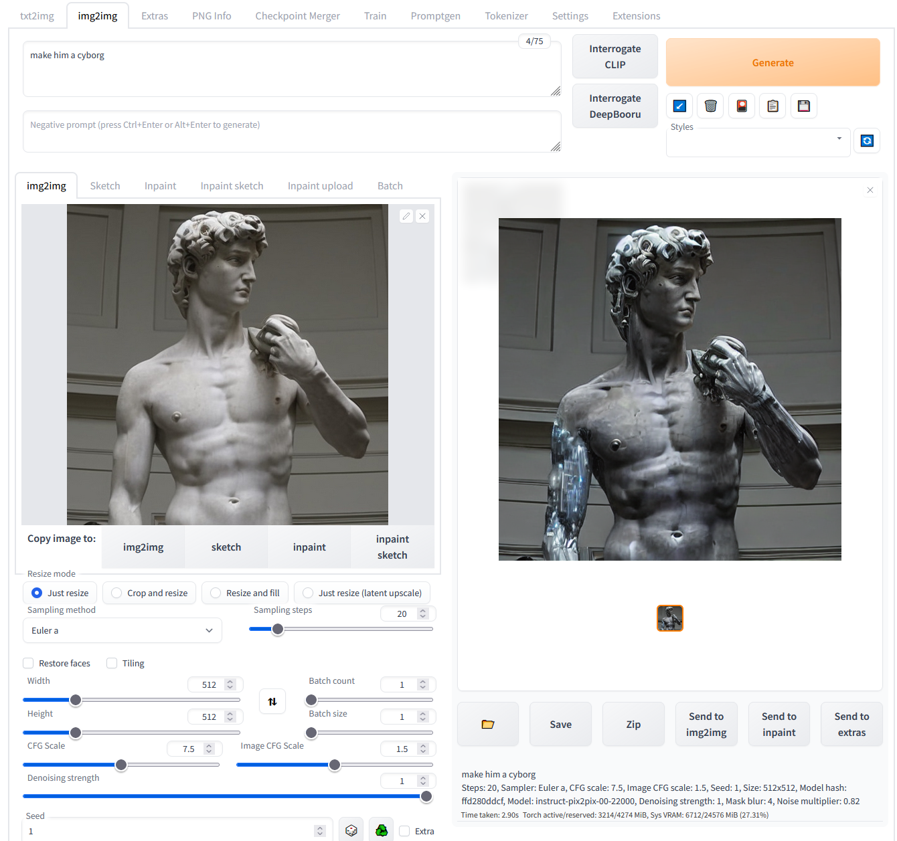
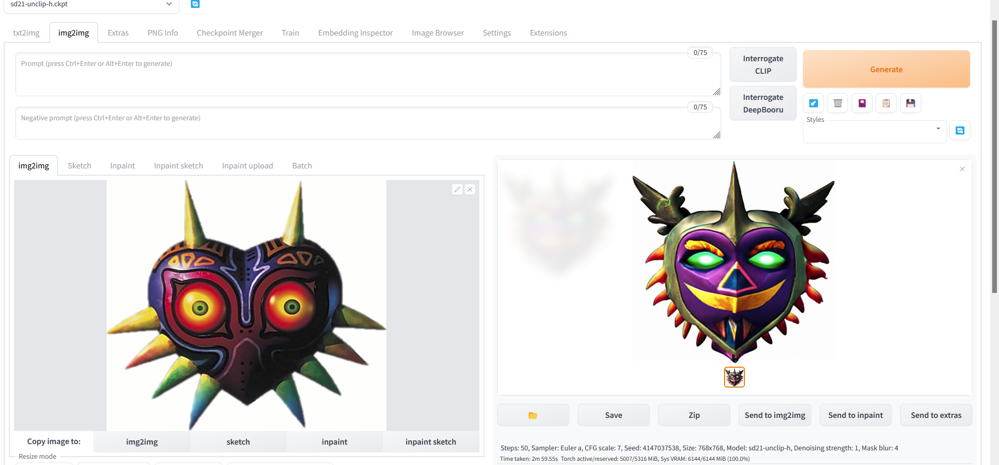
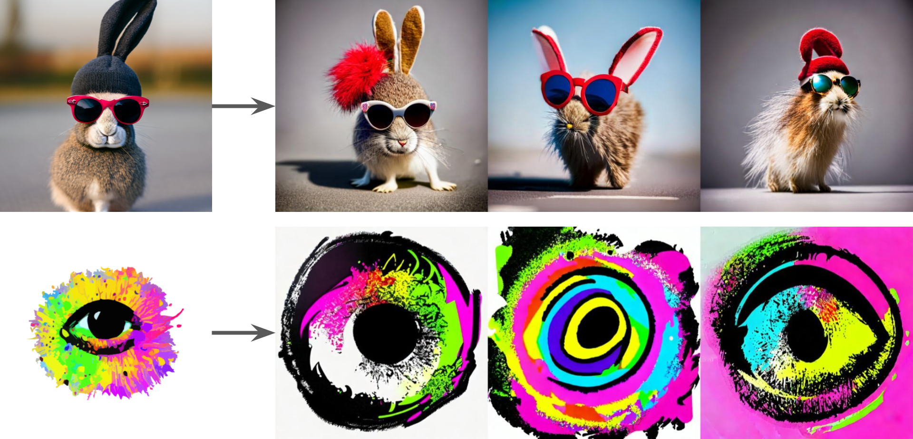
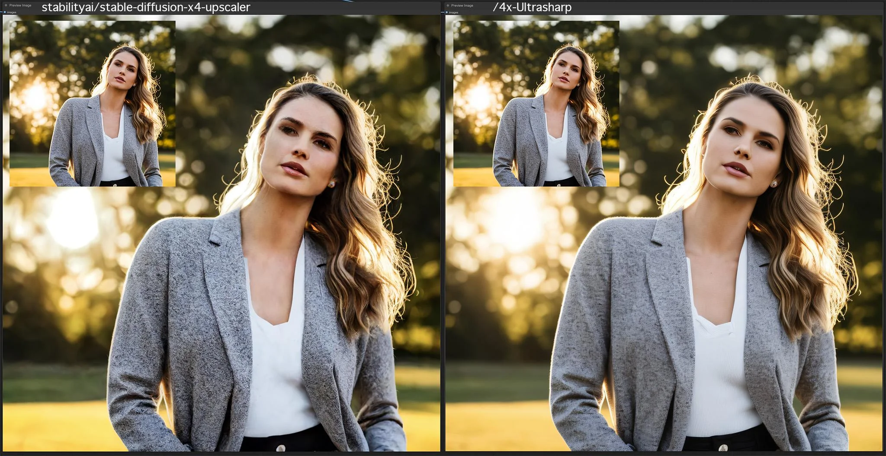
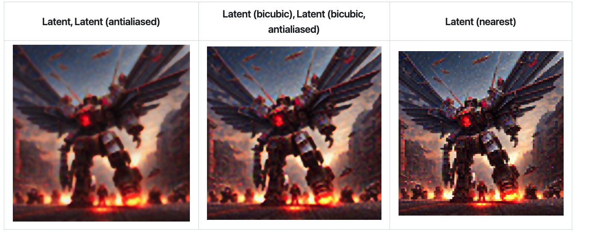

# Inpaint anything 
https://github.com/geekyutao/Inpaint-Anything

最近修改八个月前

Inpaint anything using Segment Anything and inpainting models.

感觉已经被webui 插件平替

Inpaint Anything 可以修复图像、视频和3D 场景中的任何内容！

[2023/9/15] Remove Anything 3D代码可用！
[2023/4/30] Remove Anything 视频可用！您可以从视频中删除任何对象！
[2023/4/24]支持本地 Web UI！您可以在本地运行演示网站！
[2023/4/22]网站可用！您可以通过界面体验 Inpaint Anything！
[2023/4/22] Remove Anything 3D可用！您可以从 3D 场景中删除任何 3D 对象！
[2023/4/13] arXiv 上的技术报告可用！

 移除任何内容
 填充任意内容
 替换任何内容
 删除任何3D内容（🔥新功能）

 删除任何视频（🔥新功能）

未实现
 填充任意3D内容
替换任何3D内容
填充任何视频
替换任何视频

点击一个对象；
分割任何模型（SAM）将对象分割出来；
修复模型（例如，LaMa）填补了“空洞”。

Acknowledgments    
Segment Anything
LaMa
Stable Diffusion
OSTrack
STTN
Other Interesting Repositories
Awesome Anything
Composable AI
Grounded SAM

## LaMa

https://advimman.github.io/lama-project/

WACV 2022

https://github.com/advimman/lama

最近修改上个月

🦙 LaMa Image Inpainting, Resolution-robust Large Mask Inpainting with Fourier Convolutions, WACV 2022

LaMa 的推广效果出奇地好，可以达到比训练期间（256x256）更高的分辨率（~2k❗️），即使在具有挑战性的场景中也能实现出色的性能，例如完成周期性结构。

致谢
如果形成CSAILVision ，则分割代码和模型。
LPIPS 指标来自richzhang
SSIM 来自Po-Hsun-Su
FID 来自mseitzer

尽管现代图像修复系统取得了重大进展，但通常仍难以处理大面积缺失、复杂的几何结构和高分辨率图像。我们发现，其中一个主要原因是修复网络和损失函数中都缺乏有效的感受野。为了缓解这个问题，我们提出了一种称为大掩模修复（LaMa）的新方法。LaM 基于：
一种新的修复网络架构，使用快速傅里叶卷积，具有图像范围的感受野
高度感受野知觉损失；
大型训练面罩，释放前两个组件的潜力。
我们的修复网络在一系列数据集上提升了最先进的水平，即使在具有挑战性的场景中也能实现出色的性能，例如完成周期性结构。我们的模型对高于训练时的分辨率的泛化效果令人惊讶，并且以比竞争基线更低的参数和计算成本实现了这一点。

# DemoFusion
[Submitted on 24 Nov 2023 (v1), last revised 15 Dec 2023 (this version, v2)]    
DemoFusion: Democratising High-Resolution Image Generation With No $$$

https://github.com/ttulttul/ComfyUI-Iterative-Mixer

使用生成式人工智能 (GenAI) 生成高分辨率图像具有巨大的潜力，但由于培训需要巨额资本投入，它越来越集中于少数几家大公司，并且隐藏在付费墙后面。本文旨在通过推进高分辨率生成的前沿，同时保持广大受众的可访问性，使高分辨率 GenAI 民主化。我们证明现有的潜在扩散模型 (LDM) 在高分辨率图像生成方面具有尚未开发的潜力。我们新颖的 DemoFusion 框架无缝扩展了开源 GenAI 模型，采用渐进式升级、跳过残差和扩张采样机制来实现更高分辨率的图像生成。DemoFusion 的渐进性需要更多次传递，但中间结果可以作为“预览”，促进快速及时迭代。

# Stable Diffusion Infinity Grid Generator

https://github.com/mcmonkeyprojects/sd-infinity-grid-generator-script

Infinite-Axis Grid Generator for Stable Diffusion!

相当于一个webui   

最近更新两个月前

致谢
这个设计部分受到“xrypgame”的“XYZ Plot”脚本的启发（不要与 Auto WebUI 中的“XYZ Plot”脚本混淆，后者实际上只是“X/Y Plot”脚本，但他们添加了一个“Z”哈哈）
代码部分引用自 WebUI 本身及其默认的“X/Y Plot”脚本（后来重命名为“XYZ Plot”）。
一些代码段引用自其他各种相关来源，例如，d8ahazard 的 Dreambooth 扩展被引用用于 JavaScript 代码技巧（标题覆盖）。
有些代码部分引用自 StackOverflow 上的随机答案以及各种其他谷歌文档和答案网站。我没有跟踪它们，但我很高兴生活在这样一个世界里，有这么多开发人员都很高兴并渴望帮助彼此学习和成长。所以，感谢 FOSS 社区的所有成员！
感谢所有合并 PR的作者。
感谢所有标记为“已完成”的问题的作者。
感谢 StabilityAI、RunwayML、CompVis for Stable Diffusion 以及其工作被纳入其中的研究人员。
感谢 AUTOMATIC1111 和 WebUI 的众多贡献者。

# ELLA

Enhanced Semantic Alignment is a Second Life for SD 1.5 Models, Allows Complex Compositions with SDXL-like Prompting

两三个月前

ELLA: Equip Diffusion Models with LLM for Enhanced Semantic Alignment

https://github.com/TencentQQGYLab/ELLA

ELLA
Paper: ELLA: Equip Diffusion Models with LLM for Enhanced Semantic Alignment

Project Website: ELLA

EMMA
Paper: EMMA: Your Text-to-Image Diffusion Model Can Secretly Accept Multi-Modal Prompts

Project Website: EMMA

[2024.6.14] 🔥🔥 EMMA: Technical Report, Project Website
[2024.5.13] EMMA is coming soon. Let's first preview the results of EMMA: 中文版, English Version
[2024.4.19] We provide ELLA’s ComfyUI plugin: TencentQQGYLab/ComfyUI-ELLA
[2024.4.11] Add some results of EMMA(Efficient Multi-Modal Adapter)
[2024.4.9] 🔥🔥🔥 Release ELLA-SD1.5 Checkpoint! Welcome to try!
[2024.3.11] 🔥 Release DPG-Bench! Welcome to try!
[2024.3.7] Initial update

ELLA 仍处于早期研究阶段，我们尚未对 ELLA 的所有潜在应用进行全面测试。我们欢迎社区提出建设性和友好的建议。

在这里，我们分享迄今为止发现的一些关于如何更好地利用 ELLA 的技巧：

1. 标题高档
ELLA 是使用 MLLM 注释的合成字幕进行训练的。如使用更好的字幕改进图像生成中所述，在使用 ELLA 之前对输入字幕进行“上采样”可以发挥其最大潜力。

我们发现，利用 LLM 的上下文学习 (ICL) 功能可以实现简单的字幕上采样：

Please generate the long prompt version of the short one according to the given examples. Long prompt version should consist of 3 to 5 sentences. Long prompt version must sepcify the color, shape, texture or spatial relation of the included objects. DO NOT generate sentences that describe any atmosphere!!!

Short: A calico cat with eyes closed is perched upon a Mercedes.
Long: a multicolored cat perched atop a shiny black car. the car is parked in front of a building with wooden walls and a green fence. the reflection of the car and the surrounding environment can be seen on the car's glossy surface.

Short: A boys sitting on a chair holding a video game remote.
Long: a young boy sitting on a chair, wearing a blue shirt and a baseball cap with the letter 'm'. he has a red medal around his neck and is holding a white game controller. behind him, there are two other individuals, one of whom is wearing a backpack. to the right of the boy, there's a blue trash bin with a sign that reads 'automatic party'.

Short: A man is on the bank of the water fishing.
Long: a serene waterscape where a person, dressed in a blue jacket and a red beanie, stands in shallow waters, fishing with a long rod. the calm waters are dotted with several sailboats anchored at a distance, and a mountain range can be seen in the background under a cloudy sky.

Short: A kitchen with a cluttered counter and wooden cabinets.
Long: a well-lit kitchen with wooden cabinets, a black and white checkered floor, and a refrigerator adorned with a floral decal on its side. the kitchen countertop holds various items, including a coffee maker, jars, and fruits.

Short: a racoon holding a shiny red apple over its head

using: https://huggingface.co/spaces/Qwen/Qwen-72B-Chat-Demo

we got:

a mischievous raccoon standing on its hind legs, holding a bright red apple aloft in its furry paws. the apple shines brightly against the backdrop of a dense forest, with leaves rustling in the gentle breeze. a few scattered rocks can be seen on the ground beneath the raccoon's feet, while a gnarled tree trunk stands nearby.

灵活的 token 长度
在 ELLA 的训练过程中，使用了较长的合成字幕，最大标记数设置为 128。在使用短字幕测试 ELLA 时，除了前面提到的字幕上采样技术外，还可以使用“flexible_token_length”技巧。这涉及将标记器设置max_length为None，从而消除任何文本标记填充或截断。我们已经观察到，此技巧可以帮助提高与短字幕相对应的生成图像的质量。

3. ELLA+CLIP 社区模型
我们的测试表明，一些严重依赖触发词的社区模型在使用 ELLA 时可能会遭遇严重的风格损失，这主要是因为在 ELLA 推理过程中根本没有使用 CLIP。

尽管在训练过程中未使用 CLIP，但我们发现仍然可以在推理过程中将 ELLA 的输入与 CLIP 的输出连接起来（Bx77x768 + Bx64x768 -> Bx141x768），作为 UNet 的条件。我们预计，将 ELLA 与 CLIP 结合使用将更好地融入现有的社区生态系统，尤其是与 CLIP 特定的技术（例如文本反转和触发词）结合使用。

我们的目标是确保与更广泛的社区模型更好地兼容；但是，我们目前还没有一套完整的经验可以分享。如果您有任何建议，我们将非常感激您能在问题中分享它们。

4.FlanT5必须在fp16模式下运行。
如issue#23中所述，我们绝大多数实验是在V100上进行的，不支持bf16，所以只能使用fp16 T5进行训练。经过测试发现，fp16 T5和bf16 T5的输出差异不可忽略，导致生成的图像存在明显差异。因此，建议使用fp16 T5进行推理。

🚧 EMMA - 高效的多模式适配器（正在进行中）

ELLA（高效大型语言模型适配器）为文本到图像的扩散模型配备了强大的大型语言模型（LLM），从而无需训练 U-Net 或 LLM 即可增强文本对齐。

模型描述
扩散模型在文本到图像生成领域表现出色。然而，这些模型中的大多数仍然使用 CLIP 作为文本编码器，这限制了它们理解密集提示的能力，这些提示包含多个对象、详细属性、复杂关系、长文本对齐等。在本文中，我们介绍了一种高效的大型语言模型适配器，称为 ELLA，它为文本到图像扩散模型配备了强大的大型语言模型 (LLM)，以增强文本对齐，而无需训练 U-Net 或 LLM。为了无缝连接两个预训练模型，我们研究了一系列语义对齐连接器设计，并提出了一个新模块，即时间步感知语义连接器 (TSC)，它可以从 LLM 中动态提取与时间步相关的条件。我们的方法在去噪过程的不同阶段调整语义特征，帮助扩散模型在采样时间步上解释冗长而复杂的提示。此外，ELLA 可以很容易地与社区模型和工具结合起来，以提高它们的提示跟踪能力。为了评估文本转图像模型在密集提示跟踪中的表现，我们引入了密集提示图基准 (DPG-Bench)，这是一个由 1K 密集提示组成的具有挑战性的基准。大量实验表明，ELLA 在密集提示跟踪方面优于最先进的方法，特别是在涉及多种属性和关系的多对象组合中。

RESEARCH
ELLA: Leveraging LLMs for Enhanced Semantic Alignment in SD 1.5
DANIEL SANDNER APRIL 14, 2024

其他
我们还发现了另一项独立但相似的工作LaVi-Bridge，这项工作几乎同时完成，提供了 ELLA 未涵盖的额外见解。ELLA 和 LaVi-Bridge 之间的差异可以在第 13 期中找到。我们很高兴欢迎其他研究人员和社区用户推动该领域的发展。

[提交日期：2024 年 3 月 12 日]
连接不同的语言模型和生成视觉模型以实现文本到图像的生成
赵世豪、郝少哲、子伯嘉、徐怀哲、黄君仪
随着文本到图像扩散模型的引入，文本到图像生成取得了重大进展。这些模型通常由解释用户提示的语言模型和生成相应图像的视觉模型组成。随着语言和视觉模型在各自领域的不断进步，探索用更先进的模型替换文本到图像扩散模型中的组件具有巨大的潜力。因此，更广泛的研究目标是研究将任何两个不相关的语言和生成视觉模型集成到文本到图像生成中。在本文中，我们探索了这一目标并提出了 LaVi-Bridge，这是一种能够将各种预训练语言模型和生成视觉模型集成到文本到图像生成的管道。通过利用 LoRA 和适配器，LaVi-Bridge 提供了一种灵活的即插即用方法，而无需修改语言和视觉模型的原始权重。我们的管道与各种语言模型和生成视觉模型兼容，可适应不同的结构。在这个框架中，我们证明了结合更高级的模块（例如更高级的语言模型或生成视觉模型）可以显著提高文本对齐或图像质量等功能。已经进行了广泛的评估以验证 LaVi-Bridge 的有效性。代码可在此 https URL上找到。

# HDR
高动态范围 (HDR)的目标是重现场景中明暗区域细节更丰富的场景，从而呈现更真实、更醒目的视觉效果。它旨在以某种方式模仿我们眼睛的色调范围。我们的目标是避免因曝光不足或过度曝光而导致图像出现大量极暗或极亮区域。HDR可使图像看起来更自然，并在后期处理过程中为颜色或色调风格化提供更多自由。这种技术通常用于专业摄影。

使用脚本扩展动态范围
我们将使用 VectorscopeCC 来解决这个问题。此扩展通过调整颜色、亮度和对比度（如偏移噪声）来修改扩散。此外，它还包含一个具有欺骗性名称“高动态范围”的脚本，该脚本实际上输出的就是高动态范围。

您可以从 Extensions/Avalable/Load 中安装 VectorscopeCC扩展。在列表中找到它并安装。重新启动 A1111。您将在 txt2img 和 img2img 折叠底部的脚本列表下找到该脚本。

重要提示
一次仅生成 1 个批次数量/尺寸
如上所述，在升级图像/包围时保持低去噪
提示中定义的阴影非常锐利的图像不会从脚本中受益
您可以在img2img中有效地使用该脚本，只需插入图像，设置大小和低去噪强度并设置脚本
VAE 能解决动态范围吗？
有可能。我不知道有哪个 VAE 解决方案可以在不平坦范围的情况下工作，只给出 RAW 外观的输出，但没有所需的函数。

其他方法
您可以使用相同的种子和不同的亮度手动生成 HDR“包围”图像，然后使用专用的 HDR 合并工具（通常是商业或史前工具）将它们合并。Darktable 不会合并非 RAW，但您可以在 GIMP 中进行曝光混合：

在 GIMP 中手动混合曝光

# Photorealism

Basic Scene Setup for Photorealism
You may use photographic terms or descriptions of visual features. The most photorealistic models should react to general or specific tokens like:

    matte beige sphere, dramatic lighting, camera f1.6 lens ,rich colors ,hyper realistic ,lifelike texture
    matte beige sphere, (hard sharp spotlight light:1.4), camera f1.6 lens ,rich colors ,hyper realistic ,lifelike texture
    matte beige sphere, (three point studio light:1.4), camera f1.6 lens ,rich colors ,hyper realistic ,lifelike texture

插图：无负面提示，  Dangerhawk，FastNegativeV2

将嵌入下载到stable-diffusion-webui\embeddings文件夹中，然后通过生成按钮下方的显示/隐藏额外网络按钮将其插入到负面提示中（首先刷新列表）。尝试其中几个（Civitai 上的 NE 列表），并尝试组合。您也可以从实际的工作流程开始，主要基于负面提示，这是一个起点：

负面提示：(semi-realistic, cgi, 3d, render, sketch, cartoon, drawing, anime:1.4) 

区域提词员
您可以使用 Regional Prompter 快速将作品划分为区域。您将使用 BREAK 来划分提示中的区域（您需要在开头再使用一个 BREAK 来分隔基本或通用提示）。提示模式会尝试根据提示检测区域段，而矩阵模式将以几何方式划分区域：

本例的结构为：基本提示 BREAK 字符 BREAK 构建。

(background inside dark, moody:1.3) , POV, nikon d850, film stock photograph ,4 kodak portra 400 ,camera f1.6 lens ,rich colors ,hyper realistic ,lifelike texture, dramatic lighting , cinestill 800 rimlight (editorial photograph) BREAK
sfw (1woman:1.1),, (winter clothes:1.2), scarf, winter coat, view from back, (highly detailed face:1.4) (smile:0.7) BREAK
snowy house, cracked wall, decrepit

使用 CD Tuner 和 VectorscopeCC 进行色彩处理
CD（颜色/细节）调谐器和 VectorscopeCC是 A1111 扩展，可在潜在空间（偏移噪声方式）中修改颜色和色调。借助这些工具，您可以修改颜色组合或调整图像，创建包围效果和高动态范围 HDR 近似值。

Upscaling
Upscaling is a technique needed in all worklows. Explore upscaler models on upscale wiki https://openmodeldb.info/. Explote the classic ones or new DAT upscalers. See a list of interesting classic upscaler models here.

Stylistic Workflows
These workflows use extensions or LoRA-type models to modify diffusion and influence the results. We have already discussed some extensions, so here are some tips:

Dynamic Thresholding: Mimics CFG scale. We can use it for some effects too. Use higher Sampling steps (40+) to retain some color and shape information.
Latent Mirroring: Tends to create balanced or symmetrical compositions.
Anti-Burn: Can help with overtrained LoRAs or models.

潜在空间和变化中的噪声技巧
通过调整 sigma 噪声，您可以实现有趣的相机效果。有关此内容的更多信息，请参阅有关Sigma 和 Eta参数的单独文章。我在此颜色分级教程 中提到了颜色和亮度调整。一些 LoRA 和扩展也会影响扩散解码。 

添加雇佣修复的详细信息
与 ADetailer 和类似扩展类似，您可以在其中添加其他提示，您可以在Hires 修复阶段添加照片细节（也可以在提示中使用 LoRA）。尝试 SwinIR_4x、4x-UltraSharp 或 4x_RealisticRescaler 升级器。

提示工程实验和通配符
通配符是向场景中添加视觉噪音和道具的好方法。您还可以使用随机通配符测试模型。您需要安装Dynamic Prompts 扩展才能将通配符管理器放入选项卡中。 

您可以将通配符放入文本文件（仅将通配符列表放在单独的行中），然后将文件复制到\stable-diffusion-webui\extensions\sd-dynamic-prompts\wildcards文件夹中。您可以创建文件夹结构并嵌入其他通配符文件。您可以在提示中使用两个下划线语法处理通配符__wildcard__，文件名不带 .txt。 

# 数据

https://aigc.latentcat.com/resources/image-datasets

https://aigc.latentcat.com/resources/awesome-aigc

数据爬取
二次元：https://deepghs.github.io/waifuc/main/tutorials-CN/installation/index.html

数据集下载
下载器
img2dataset：https://github.com/rom1504/img2dataset
HF Datasets
HF 镜像：https://hf-mirror.com

一篇教程：https://zhuanlan.zhihu.com/p/663712983

使用 hf api 下载（使用 cli 同理，这就是 cli 的内部实现）

数据标注
多模态模型标注

LLaVA：https://llava-vl.github.io/
CogVLM：https://huggingface.co/spaces/THUDM/CogVLM-CogAgent
打标

WD1.4：https://gist.github.com/harubaru/8581e780a1cf61352a739f2ec2eef09b
WD1.5：https://saltacc.notion.site/saltacc/WD-1-5-Beta-3-Release-Notes-1e35a0ed1bb24c5b93ec79c45c217f63
美学评分

20 万动漫：https://huggingface.co/spaces/Laxhar/anime-thetic

友商

https://github.com/steven2358/awesome-generative-ai

https://huggingface.co/spaces/sczhou/CodeFormer

# outpainting-differential-diffusion
https://huggingface.co/blog/OzzyGT/outpainting-differential-diffusion

 raise HTTPError(http_error_msg, response=self)
requests.exceptions.HTTPError: 404 Client Error: Not Found for url: https://huggingface.co/datasets/diffusers/community-pipelines-mirror/resolve/main/v0.29.1/pipeline_stable_diffusion_xl_differential_img2img.py

raise EntryNotFoundError(message, response) from e
huggingface_hub.utils._errors.EntryNotFoundError: 404 Client Error. (Request ID: Root=1-66754f9f-3a2993354103c03c2837e594;6430dfdf-d5a4-4fda-8c89-1f2875a72d6d)

Entry Not Found for url: https://huggingface.co/datasets/diffusers/community-pipelines-mirror/resolve/main/v0.29.1/pipeline_stable_diffusion_xl_differential_img2img.py.

curl 是可以的     
但是好像这台机链接hug有问题吗？？

这个网站确实被ban了

然后直接采用

    pipeline = StableDiffusionXLPipeline.from_pretrained(
        "SG161222/RealVisXL_V4.0",
        torch_dtype=torch.float16,
        variant="fp16",
        custom_pipeline="newlytest/diffusers/examples/community/pipeline_stable_diffusion_xl_differential_img2img.py",
        #custom_pipeline="newlytest/outpaint/differiential",
        这样竟然不可以，mixdq就是这样加载的

        #custom_pipeline="pipeline_stable_diffusion_xl_differential_img2img",
    ).to("cuda")

# 模型输入层维度决定的模型类型
    def switchAssumption(channelCount):
        return {
            4: "traditional",
            5: "sdv2 depth2img",
            7: "sdv2 upscale 4x",
            8: "instruct-pix2pix",
            9: "inpainting"
        }.get(channelCount, "¯\_(ツ)_/¯")

怎么感觉iclight很像 instruct 

    5: "sdv2 depth2img",
    7: "sdv2 upscale 4x",

这两个比较好奇

## instruct-pix2pix
instructPix2Pix文字编辑图片是一种纯文本编辑图像的方法，用户提供一张图片和文本编辑指令，告诉模型要做什么，模型根据编辑指令编辑输入的图像，最终输出用户想要的图像。

它可以让你通过简单的语言描述来生成符合要求的图片，而不需要手动编写代码或进行复杂的操作，这使得图像生成更加高效和便捷。例如，如果你想将一张天空照片转换为夜晚照片，你只需要输入指令：“将天空替换为黑暗的夜晚”，然后模型就会自动将天空替换为星星和月亮，并将颜色和光线调整为夜晚的感觉。

instructPix2Pix 和Stable Diffusion的不同

1.instructPix2Pix会多出一个图像输入，在输入的时候将原图拼接到噪声图，会需要额外的channel，这些额外的channel会被初始化为0，其他的权重会使用预训练的Stable Diffusion初始化。

2.在训练中增加了随机的条件Dropout来平衡模型的生成的样本的多样性。

3.推理的过程中加入了参数可以调节原始图像所占的比例。

所以iclight就是这个原理

iclight fc 初始噪声和光源 + ，再concat前景图

fbc再多一个背景4通道

ip2p concat 参考图

InstructPix2Pix 由 2 个模型：一个自然语言模型（GPT-3）和一个文字转图像模型（SD）拼接起来 作者：刹那-Ksana- https://www.bilibili.com/read/cv24644846/ 出处：bilibili

模型的训练难度在于，符合条件的数据集基本不存在。为了解决这个问题，研究团队将训练分成两个部分

    Fine-Tuning GPT-3

    将前后两个指令生成其各自对应的图像

首先，研究团队利用一个人工输入的数据集作为 fine-tuning GPT-3 的训练集，这个训练集的格式为输入描述（Input Caption），编辑指令（Edit Instruction）和编辑后描述（Editted Caption） 

这个输入的文本做了特殊处理     

Prompt-to-Prompt

为了使编辑前和编辑后的图像具有一致性 (即结构、构图上的一致)，模型采用了 prompt-to-prompt 

prompt-to-prompt 的巧妙之处在于，团队发现，文字和图像像素关联对应的 cross-attention 层包含了大量的结构性息 

例如，替换文字（将一部分 attention map 替换为新的 map），加入新的文字（在原有的 map 基础上加入新的 map） ，以及改变重点（改变原有 map 的比重）

所以，根据 prompt-to-prompt，可以生成大量的配对的图像作为训练素材。 

prompt-to-prompt 的巧妙之处在于，团队发现，文字和图像像素关联对应的 cross-attention 层包含了大量的结构性息 

InstructPix2Pix
Learning to Follow Image Editing Instructions
Tim Brooks*, Aleksander Holynski*, Alexei A. Efros
University of California, Berkeley
*Denotes equal contribution

CVPR 2023 (Highlight)

webui

The checkpoint is fully supported in img2img tab. No additional actions are required. Previously an extension by a contributor was required to generate pictures: it's no longer required, but should still work. Most of img2img implementation is by the same person.

To reproduce results of the original repo, use denoising of 1.0, Euler a sampler, and edit the config in configs/instruct-pix2pix.yaml to say:

    use_ema: true
    load_ema: true
instead of:

    use_ema: false

位置不太一样

理论上可以利用       

估计webui直接判断8通道为ip2p 导致写死   
再多一个光源+ 的操作其实就能用了    
+ 相当于加噪提升质量了       

https://github.com/Klace/stable-diffusion-webui-instruct-pix2pix

按理说webui也可以原生支持iclight

已弃用：此扩展不再需要。我已将代码集成到 Automatic1111 img2img 管道中，并且 WebUI 现在已将用于 instruct-pix2pix 模型的图像 CFG 比例内置到 img2img 界面中。此扩展已过时。

如果此扩展中缺少 img2img 中您想要的任何内容，请告诉我（即随机 CFG），我可以制作单独的扩展来扩展 webui img2img。

他这个直接改了cfg denoiser

    class CFGDenoiser(nn.Module):
        def __init__(self, model):
            super().__init__()
            self.inner_model = model

        def forward(self, z, sigma, cond, uncond, text_cfg_scale, image_cfg_scale):
            cfg_z = einops.repeat(z, "1 ... -> n ...", n=3)
            cfg_sigma = einops.repeat(sigma, "1 ... -> n ...", n=3)
            cfg_cond = {
                "c_crossattn": [torch.cat([cond["c_crossattn"][0], uncond["c_crossattn"][0], uncond["c_crossattn"][0]])],
                "c_concat": [torch.cat([cond["c_concat"][0], cond["c_concat"][0], uncond["c_concat"][0]])],
            }
            out_cond, out_img_cond, out_uncond = self.inner_model(cfg_z, cfg_sigma, cond=cfg_cond).chunk(3)
            return out_uncond + text_cfg_scale * (out_cond - out_img_cond) + image_cfg_scale * (out_img_cond - out_uncond)

这样很容易和新版本不兼容

 318 stars
Watchers
 6 watching
Forks
 20 forks

一年前

Iclight的model patcher 仿佛不会      
但是仍要要求有launch函数     
稳定性好一些

## SD2 Variation Models

reimagen

support for stable-diffusion-2-1-unclip checkpoints that are used for generating image variations.

It works in the same way as the current support for the SD2.0 depth model, in that you run it from the img2img tab, it extracts information from the input image (in this case, CLIP or OpenCLIP embeddings), and feeds those into the model in addition to the text prompt. Normally you would do this with denoising strength set to 1.0, since you don't actually want the normal img2img behaviour to have any influence on the generated image.

SD2.0 depth model 难道也是将 depth 图转成embedding吗

Stable unCLIP    
unCLIP is the approach behind OpenAI's DALL·E 2, trained to invert CLIP image embeddings. We finetuned SD 2.1 to accept a CLIP ViT-L/14 image embedding in addition to the text encodings. This means that the model can be used to produce image variations, but can also be combined with a text-to-image embedding prior to yield a full text-to-image model at 768x768 resolution.

We provide two models, trained on OpenAI CLIP-L and OpenCLIP-H image embeddings, respectively, available from https://huggingface.co/stabilityai/stable-diffusion-2-1-unclip. 

    #Start the StableUnCLIP Image variations pipeline
    pipe = StableUnCLIPImg2ImgPipeline.from_pretrained(
        "stabilityai/stable-diffusion-2-1-unclip", torch_dtype=torch.float16, variation="fp16"
    )
    pipe = pipe.to("cuda")

    #Get image from URL
    url = "https://huggingface.co/datasets/hf-internal-testing/diffusers-images/resolve/main/stable_unclip/tarsila_do_amaral.png"
    response = requests.get(url)
    init_image = Image.open(BytesIO(response.content)).convert("RGB")

    #Pipe to make the variation
    images = pipe(init_image).images
    images[0].save("tarsila_variation.png")

to launch a streamlit script than can be used to make image variations with both models (CLIP-L and OpenCLIP-H). These models can process a noise_level, which specifies an amount of Gaussian noise added to the CLIP embeddings. This can be used to increase output variance as in the following examples.

Recently, KakaoBrain openly released Karlo, a pretrained, large-scale replication of unCLIP. We introduce Stable Karlo, a combination of the Karlo CLIP image embedding prior, and Stable Diffusion v2.1-768.

## SD2.0 depth model

This stable-diffusion-2-depth model is resumed from stable-diffusion-2-base (512-base-ema.ckpt) and finetuned for 200k steps. Added an extra input channel to process the (relative) depth prediction produced by MiDaS (dpt_hybrid) which is used as an additional conditioning.

Stable Diffusion v1 

Hardware Type: A100 PCIe 40GB
Hours used: 200000
Cloud Provider: AWS

## sdv2 upscale 4x

x4-upscaling-ema.ckpt: Trained for 1.25M steps on a 10M subset of LAION containing images >2048x2048. The model was trained on crops of size 512x512 and is a text-guided latent upscaling diffusion model. In addition to the textual input, it receives a noise_level as an input parameter, which can be used to add noise to the low-resolution input according to a predefined diffusion schedule.

Hardware: 32 x 8 x A100 GPUs

SD_4X 升级器更胜一筹（在我看来），因为它会考虑你的条件，从而根据你的预期构图细化细节。如果原始图像是使用 SD 检查点生成的，那么具有相同条件的 4X 升级器应该会产生更一致的升级效果。

https://huggingface.co/stabilityai/stable-diffusion-x4-upscaler

7: "sdv2 upscale 4x",

, it receives a noise_level as an input parameter, which can be used to add noise to the low-resolution input according to a predefined diffusion schedule.

    import requests
    from PIL import Image
    from io import BytesIO
    from diffusers import StableDiffusionUpscalePipeline
    import torch

    # load model and scheduler
    model_id = "stabilityai/stable-diffusion-x4-upscaler"
    pipeline = StableDiffusionUpscalePipeline.from_pretrained(model_id, torch_dtype=torch.float16)
    pipeline = pipeline.to("cuda")

    # let's download an  image
    url = "https://huggingface.co/datasets/hf-internal-testing/diffusers-images/resolve/main/sd2-upscale/low_res_cat.png"
    response = requests.get(url)
    low_res_img = Image.open(BytesIO(response.content)).convert("RGB")
    low_res_img = low_res_img.resize((128, 128))

    prompt = "a white cat"

    upscaled_image = pipeline(prompt=prompt, image=low_res_img).images[0]
    upscaled_image.save("upsampled_cat.png")

脸部没那么好    
衣服仿佛好一些

对于钻石很好

我已经尝试过它，既有常规升级，也有 Ultimate SD Upscale，TBH 我发现 Ultimate SD Upscale 更好，它允许您轻松地将模型与使用的图像交换，并且您可以设置比例，另外我发现使用 SD_4X 时，即使使用 3090，我也经常耗尽内存

Stable-diffusion-4x-upscaler

Stable Diffusion 4x upscaler is a text-conditioned latent diffusion model capable of upscaling images to 4x resolution.

"in_channels": 7,

确实是7 但我好奇是把什么东西加进去了         
三通道能是什么东西？     

upscaled_image = pipeline(prompt=prompt, image=low_res_img).images[0]

主要想这 low_res_img 如何使用， 过vae结果也不对        

diffuser

A method for increasing the inpainting image quality is to use the [`padding_mask_crop`](https://huggingface.co/docs/diffusers/v0.25.0/en/api/pipelines/stable_diffusion/inpaint#diffusers.StableDiffusionInpaintPipeline.__call__.padding_mask_crop) parameter. When enabled, this option crops the masked area with some user-specified padding and it'll also crop the same area from the original image. Both the image and mask are upscaled to a higher resolution for inpainting, and then overlaid on the original image. This is a quick and easy way to improve image quality without using a separate pipeline like [`StableDiffusionUpscalePipeline`].

Add the `padding_mask_crop` parameter to the pipeline call and set it to the desired padding value.

   
image = pipeline("boat", image=base, mask_image=mask, strength=0.75, generator=generator, padding_mask_crop=32).images[0]

upscale

    def check_inputs(
        self,
        prompt,
        image,
        noise_level, 这个比较特殊
        callback_steps,
        negative_prompt=None,
        prompt_embeds=None,
        negative_prompt_embeds=None,
    ):

        # check noise level
        if noise_level > self.config.max_noise_level:
            raise ValueError(f"`noise_level` has to be <= {self.config.max_noise_level} but is {noise_level}")

init

max_noise_level: int = 350,

call init

        num_inference_steps: int = 75,
        guidance_scale: float = 9.0,
        noise_level: int = 20,
        negative_prompt: Optional[Union[str, List[str]]] = None,
        num_images_per_prompt: Optional[int] = 1,
        eta: float = 0.0,
        callback_steps: int = 1,
        这个不知道是什么

callback_steps (`int`, *optional*, defaults to 1):
    The frequency at which the `callback` function is called. If not specified, the callback is called at
    every step.

eta (`float`, *optional*, defaults to 0.0):
    Corresponds to parameter eta (η) from the [DDIM](https://arxiv.org/abs/2010.02502) paper. Only applies
    to the [`~schedulers.DDIMScheduler`], and is ignored in other schedulers.

img2img

    def check_inputs(
        self,
        prompt,
        strength,
        callback_steps,
        negative_prompt=None,
        prompt_embeds=None,
        negative_prompt_embeds=None,
        ip_adapter_image=None,
        ip_adapter_image_embeds=None,
        callback_on_step_end_tensor_inputs=None,
    ):

txt2img

    def check_inputs(
        self,
        prompt,
        height,
        width,
        callback_steps,
        negative_prompt=None,
        prompt_embeds=None,
        negative_prompt_embeds=None,
        ip_adapter_image=None,
        ip_adapter_image_embeds=None,
        callback_on_step_end_tensor_inputs=None,
    ):

upscale

call

    # 5. set timesteps
    self.scheduler.set_timesteps(num_inference_steps, device=device)
    timesteps = self.scheduler.timesteps

    # 5. Add noise to image
    noise_level = torch.tensor([noise_level], dtype=torch.long, device=device)
    noise = randn_tensor(image.shape, generator=generator, device=device, dtype=prompt_embeds.dtype)
    创建一个原图形状的随机噪声
    image = self.low_res_scheduler.add_noise(image, noise, noise_level)
    加噪水平350 他这个训练有点特殊 加噪350 就能获取高分辨率？ 好像说是tile机制 相当于每部分重新去噪   
    但还是很有意思，不过vae 直接这样搞？      
    通道数也不对称

    batch_multiplier = 2 if do_classifier_free_guidance else 1
    image = torch.cat([image] * batch_multiplier * num_images_per_prompt)
    
    cfg翻倍 laten在后面再翻倍
    
    noise_level = torch.cat([noise_level] * image.shape[0])

    # 6. Prepare latent variables
    height, width = image.shape[2:]
    num_channels_latents = self.vae.config.latent_channels
    latents = self.prepare_latents(
        batch_size * num_images_per_prompt,
        num_channels_latents,
        height,
        width,
        prompt_embeds.dtype,
        device,
        generator,
        latents,
    )

这样看和iclight依旧很接近

他们这种concat的创新之处最大在于数据处理方式和训练方式

    with self.progress_bar(total=num_inference_steps) as progress_bar:
        for i, t in enumerate(timesteps):
            # expand the latents if we are doing classifier free guidance
            latent_model_input = torch.cat([latents] * 2) if do_classifier_free_guidance else latents

            # concat latents, mask, masked_image_latents in the channel dimension

            latent_model_input = self.scheduler.scale_model_input(latent_model_input, t)

            latent_model_input = torch.cat([latent_model_input, image], dim=1)

终于合了

但是维度不一样，这个模型内部自己处理了吗？

            # predict the noise residual
            noise_pred = self.unet(
                latent_model_input,
                t,
                encoder_hidden_states=prompt_embeds,
                cross_attention_kwargs=cross_attention_kwargs,
                class_labels=noise_level,
                确实特殊
                return_dict=False,
            )[0]

好像用了标签？

i2i

            # predict the noise residual
            noise_pred = self.unet(
                latent_model_input,
                t,
                encoder_hidden_states=prompt_embeds,
                timestep_cond=timestep_cond,
                cross_attention_kwargs=self.cross_attention_kwargs,
                added_cond_kwargs=added_cond_kwargs,
                return_dict=False,
            )[0]

### sd upscale
What's the implementation difference between highres fix and SD upscale?

According to the docs they both split into tiles and then use SD on the upscaled tiles, but they behave very differently.

tiles 图块    

交叉淡入淡出

SD Upscale can leave obvious areas where it's crossfading between the tiles, which I never really notice in Highres fix.

Highres fix tends to duplicate faces across the whole image, whereas SD Upscale seems to, at a minimum, generate different faces in each tile.

hires的大图好像是因为vae tile的原因，总体感觉还可以吧   
至今24g用起来还好        
个人没遇到过bad case    
除非直接生图   

SD Upscale ：对每个图块执行 img2img，然后将它们重新混合在一起，因此它可以处理任意大小的图像（只是更多独立的图块），但去噪强度必须非常低，否则图块不会对齐。

 If you enable the live preview in settings it's more obvious that the SD upscaler script upscales in tiles.

 感觉很像poor man outpaint

据我个人了解hires是对latent放大再upscale 当然其它upscaler我没尝试过   
如果是gan是不是不经过img2img?        

至今我仍然不知道bounding在哪里 一直感觉这些gan hires tilediffusion 就很好        
好像没必要hidiffusion等     

Really the only point in using SD upscale or Ultimate SD upscaler is if you're VRAM limited or upscaling something huge (also due to VRAM), because it performs worse at a higher denoise value since the prompt then no longer directly correlates to a full image but instead individual tiles.

Technically all the GAN upscalers should be directly upscaling the full image to 2x/4x as well (this is why the filenames usually contain these), but they're done as tiles by default instead to also save VRAM. This can be changed in settings under Upscaling.

内置默认开启tile       
比较智能    
torch实现判断     

Txt2Img Highrez fix performs the Upscaling in latent space without converting to pixel space.

GAN upscalers works in pixel space.

This is only true if you choose a latent upscaler. Latent upscalers actually perform worse because upscaling in the latent space is incredibly noisy and requires a higher denoise to clean up, which eventually diverges off from the original image, so it's better to use anything else, such as a GAN-based upscaler.

所以iclight gradio中 diffusers实现的功能 你也能说不好吗?            

 To see what each latent space upscaler does, you can set Denoising strength to 0 and Hires steps to 1 - you'll get a very good approximation of what stable diffusion would be working with on upscaled image.

没讲gan

所以我如果要写hidiffusion 应该也要准备Gan的知识

# 结尾