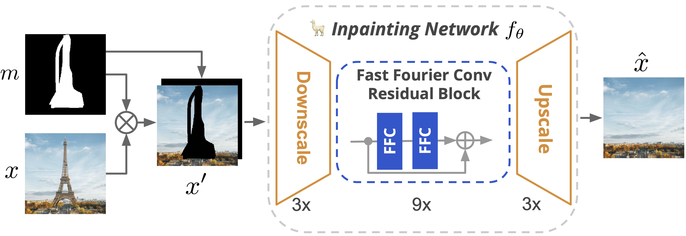
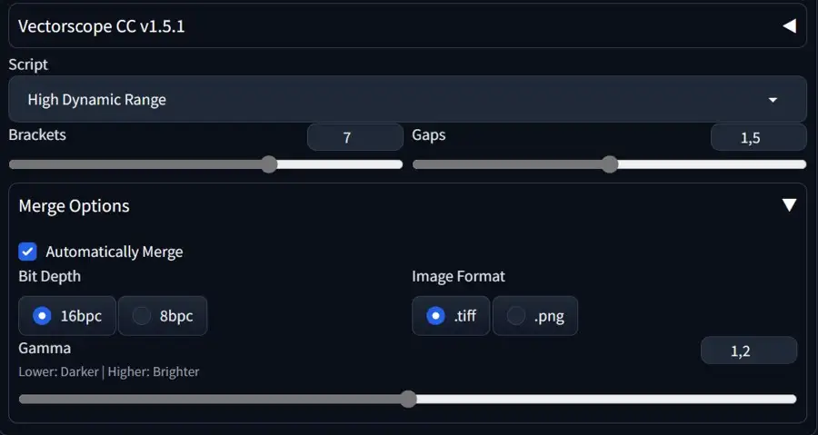
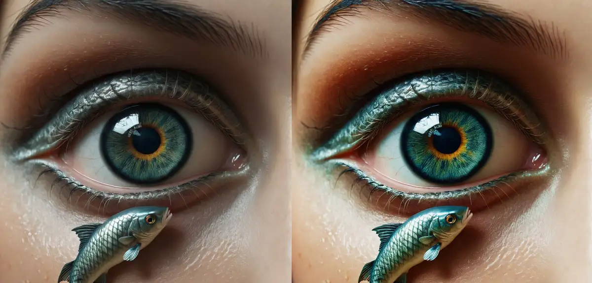
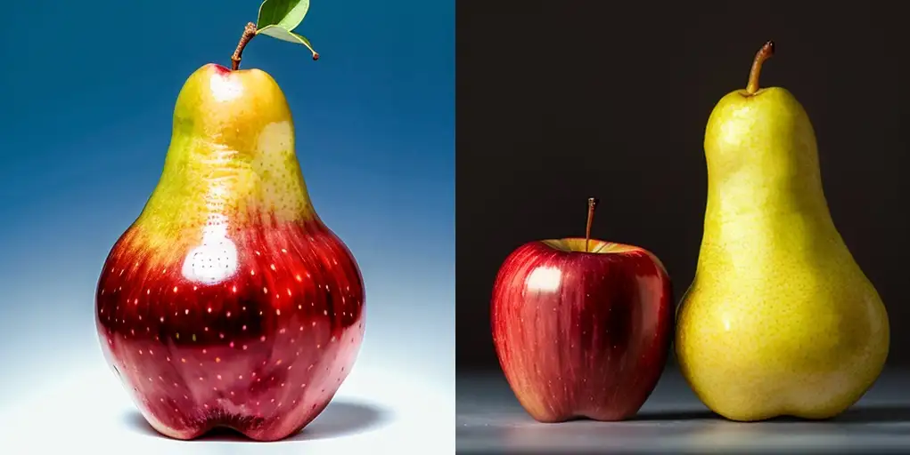
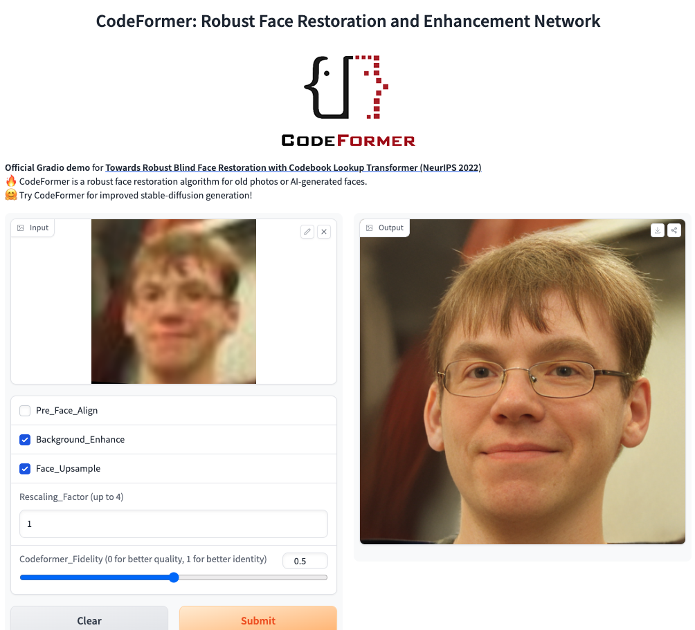

# Inpaint anything 
https://github.com/geekyutao/Inpaint-Anything

最近修改八个月前

Inpaint anything using Segment Anything and inpainting models.

感觉已经被webui 插件平替

Inpaint Anything 可以修复图像、视频和3D 场景中的任何内容！

[2023/9/15] Remove Anything 3D代码可用！
[2023/4/30] Remove Anything 视频可用！您可以从视频中删除任何对象！
[2023/4/24]支持本地 Web UI！您可以在本地运行演示网站！
[2023/4/22]网站可用！您可以通过界面体验 Inpaint Anything！
[2023/4/22] Remove Anything 3D可用！您可以从 3D 场景中删除任何 3D 对象！
[2023/4/13] arXiv 上的技术报告可用！

 移除任何内容
 填充任意内容
 替换任何内容
 删除任何3D内容（🔥新功能）

 删除任何视频（🔥新功能）

未实现
 填充任意3D内容
替换任何3D内容
填充任何视频
替换任何视频

点击一个对象；
分割任何模型（SAM）将对象分割出来；
修复模型（例如，LaMa）填补了“空洞”。

Acknowledgments    
Segment Anything
LaMa
Stable Diffusion
OSTrack
STTN
Other Interesting Repositories
Awesome Anything
Composable AI
Grounded SAM

## LaMa

https://advimman.github.io/lama-project/

WACV 2022

https://github.com/advimman/lama

最近修改上个月

🦙 LaMa Image Inpainting, Resolution-robust Large Mask Inpainting with Fourier Convolutions, WACV 2022

LaMa 的推广效果出奇地好，可以达到比训练期间（256x256）更高的分辨率（~2k❗️），即使在具有挑战性的场景中也能实现出色的性能，例如完成周期性结构。

致谢
如果形成CSAILVision ，则分割代码和模型。
LPIPS 指标来自richzhang
SSIM 来自Po-Hsun-Su
FID 来自mseitzer

尽管现代图像修复系统取得了重大进展，但通常仍难以处理大面积缺失、复杂的几何结构和高分辨率图像。我们发现，其中一个主要原因是修复网络和损失函数中都缺乏有效的感受野。为了缓解这个问题，我们提出了一种称为大掩模修复（LaMa）的新方法。LaM 基于：
一种新的修复网络架构，使用快速傅里叶卷积，具有图像范围的感受野
高度感受野知觉损失；
大型训练面罩，释放前两个组件的潜力。
我们的修复网络在一系列数据集上提升了最先进的水平，即使在具有挑战性的场景中也能实现出色的性能，例如完成周期性结构。我们的模型对高于训练时的分辨率的泛化效果令人惊讶，并且以比竞争基线更低的参数和计算成本实现了这一点。

# DemoFusion
[Submitted on 24 Nov 2023 (v1), last revised 15 Dec 2023 (this version, v2)]    
DemoFusion: Democratising High-Resolution Image Generation With No $$$

https://github.com/ttulttul/ComfyUI-Iterative-Mixer

使用生成式人工智能 (GenAI) 生成高分辨率图像具有巨大的潜力，但由于培训需要巨额资本投入，它越来越集中于少数几家大公司，并且隐藏在付费墙后面。本文旨在通过推进高分辨率生成的前沿，同时保持广大受众的可访问性，使高分辨率 GenAI 民主化。我们证明现有的潜在扩散模型 (LDM) 在高分辨率图像生成方面具有尚未开发的潜力。我们新颖的 DemoFusion 框架无缝扩展了开源 GenAI 模型，采用渐进式升级、跳过残差和扩张采样机制来实现更高分辨率的图像生成。DemoFusion 的渐进性需要更多次传递，但中间结果可以作为“预览”，促进快速及时迭代。

# Stable Diffusion Infinity Grid Generator

https://github.com/mcmonkeyprojects/sd-infinity-grid-generator-script

Infinite-Axis Grid Generator for Stable Diffusion!

相当于一个webui   

最近更新两个月前

致谢
这个设计部分受到“xrypgame”的“XYZ Plot”脚本的启发（不要与 Auto WebUI 中的“XYZ Plot”脚本混淆，后者实际上只是“X/Y Plot”脚本，但他们添加了一个“Z”哈哈）
代码部分引用自 WebUI 本身及其默认的“X/Y Plot”脚本（后来重命名为“XYZ Plot”）。
一些代码段引用自其他各种相关来源，例如，d8ahazard 的 Dreambooth 扩展被引用用于 JavaScript 代码技巧（标题覆盖）。
有些代码部分引用自 StackOverflow 上的随机答案以及各种其他谷歌文档和答案网站。我没有跟踪它们，但我很高兴生活在这样一个世界里，有这么多开发人员都很高兴并渴望帮助彼此学习和成长。所以，感谢 FOSS 社区的所有成员！
感谢所有合并 PR的作者。
感谢所有标记为“已完成”的问题的作者。
感谢 StabilityAI、RunwayML、CompVis for Stable Diffusion 以及其工作被纳入其中的研究人员。
感谢 AUTOMATIC1111 和 WebUI 的众多贡献者。

# ELLA

Enhanced Semantic Alignment is a Second Life for SD 1.5 Models, Allows Complex Compositions with SDXL-like Prompting

两三个月前

ELLA: Equip Diffusion Models with LLM for Enhanced Semantic Alignment

https://github.com/TencentQQGYLab/ELLA

ELLA
Paper: ELLA: Equip Diffusion Models with LLM for Enhanced Semantic Alignment

Project Website: ELLA

EMMA
Paper: EMMA: Your Text-to-Image Diffusion Model Can Secretly Accept Multi-Modal Prompts

Project Website: EMMA

[2024.6.14] 🔥🔥 EMMA: Technical Report, Project Website
[2024.5.13] EMMA is coming soon. Let's first preview the results of EMMA: 中文版, English Version
[2024.4.19] We provide ELLA’s ComfyUI plugin: TencentQQGYLab/ComfyUI-ELLA
[2024.4.11] Add some results of EMMA(Efficient Multi-Modal Adapter)
[2024.4.9] 🔥🔥🔥 Release ELLA-SD1.5 Checkpoint! Welcome to try!
[2024.3.11] 🔥 Release DPG-Bench! Welcome to try!
[2024.3.7] Initial update

ELLA 仍处于早期研究阶段，我们尚未对 ELLA 的所有潜在应用进行全面测试。我们欢迎社区提出建设性和友好的建议。

在这里，我们分享迄今为止发现的一些关于如何更好地利用 ELLA 的技巧：

1. 标题高档
ELLA 是使用 MLLM 注释的合成字幕进行训练的。如使用更好的字幕改进图像生成中所述，在使用 ELLA 之前对输入字幕进行“上采样”可以发挥其最大潜力。

我们发现，利用 LLM 的上下文学习 (ICL) 功能可以实现简单的字幕上采样：

Please generate the long prompt version of the short one according to the given examples. Long prompt version should consist of 3 to 5 sentences. Long prompt version must sepcify the color, shape, texture or spatial relation of the included objects. DO NOT generate sentences that describe any atmosphere!!!

Short: A calico cat with eyes closed is perched upon a Mercedes.
Long: a multicolored cat perched atop a shiny black car. the car is parked in front of a building with wooden walls and a green fence. the reflection of the car and the surrounding environment can be seen on the car's glossy surface.

Short: A boys sitting on a chair holding a video game remote.
Long: a young boy sitting on a chair, wearing a blue shirt and a baseball cap with the letter 'm'. he has a red medal around his neck and is holding a white game controller. behind him, there are two other individuals, one of whom is wearing a backpack. to the right of the boy, there's a blue trash bin with a sign that reads 'automatic party'.

Short: A man is on the bank of the water fishing.
Long: a serene waterscape where a person, dressed in a blue jacket and a red beanie, stands in shallow waters, fishing with a long rod. the calm waters are dotted with several sailboats anchored at a distance, and a mountain range can be seen in the background under a cloudy sky.

Short: A kitchen with a cluttered counter and wooden cabinets.
Long: a well-lit kitchen with wooden cabinets, a black and white checkered floor, and a refrigerator adorned with a floral decal on its side. the kitchen countertop holds various items, including a coffee maker, jars, and fruits.

Short: a racoon holding a shiny red apple over its head

using: https://huggingface.co/spaces/Qwen/Qwen-72B-Chat-Demo

we got:

a mischievous raccoon standing on its hind legs, holding a bright red apple aloft in its furry paws. the apple shines brightly against the backdrop of a dense forest, with leaves rustling in the gentle breeze. a few scattered rocks can be seen on the ground beneath the raccoon's feet, while a gnarled tree trunk stands nearby.

灵活的 token 长度
在 ELLA 的训练过程中，使用了较长的合成字幕，最大标记数设置为 128。在使用短字幕测试 ELLA 时，除了前面提到的字幕上采样技术外，还可以使用“flexible_token_length”技巧。这涉及将标记器设置max_length为None，从而消除任何文本标记填充或截断。我们已经观察到，此技巧可以帮助提高与短字幕相对应的生成图像的质量。

3. ELLA+CLIP 社区模型
我们的测试表明，一些严重依赖触发词的社区模型在使用 ELLA 时可能会遭遇严重的风格损失，这主要是因为在 ELLA 推理过程中根本没有使用 CLIP。

尽管在训练过程中未使用 CLIP，但我们发现仍然可以在推理过程中将 ELLA 的输入与 CLIP 的输出连接起来（Bx77x768 + Bx64x768 -> Bx141x768），作为 UNet 的条件。我们预计，将 ELLA 与 CLIP 结合使用将更好地融入现有的社区生态系统，尤其是与 CLIP 特定的技术（例如文本反转和触发词）结合使用。

我们的目标是确保与更广泛的社区模型更好地兼容；但是，我们目前还没有一套完整的经验可以分享。如果您有任何建议，我们将非常感激您能在问题中分享它们。

4.FlanT5必须在fp16模式下运行。
如issue#23中所述，我们绝大多数实验是在V100上进行的，不支持bf16，所以只能使用fp16 T5进行训练。经过测试发现，fp16 T5和bf16 T5的输出差异不可忽略，导致生成的图像存在明显差异。因此，建议使用fp16 T5进行推理。

🚧 EMMA - 高效的多模式适配器（正在进行中）

ELLA（高效大型语言模型适配器）为文本到图像的扩散模型配备了强大的大型语言模型（LLM），从而无需训练 U-Net 或 LLM 即可增强文本对齐。

模型描述
扩散模型在文本到图像生成领域表现出色。然而，这些模型中的大多数仍然使用 CLIP 作为文本编码器，这限制了它们理解密集提示的能力，这些提示包含多个对象、详细属性、复杂关系、长文本对齐等。在本文中，我们介绍了一种高效的大型语言模型适配器，称为 ELLA，它为文本到图像扩散模型配备了强大的大型语言模型 (LLM)，以增强文本对齐，而无需训练 U-Net 或 LLM。为了无缝连接两个预训练模型，我们研究了一系列语义对齐连接器设计，并提出了一个新模块，即时间步感知语义连接器 (TSC)，它可以从 LLM 中动态提取与时间步相关的条件。我们的方法在去噪过程的不同阶段调整语义特征，帮助扩散模型在采样时间步上解释冗长而复杂的提示。此外，ELLA 可以很容易地与社区模型和工具结合起来，以提高它们的提示跟踪能力。为了评估文本转图像模型在密集提示跟踪中的表现，我们引入了密集提示图基准 (DPG-Bench)，这是一个由 1K 密集提示组成的具有挑战性的基准。大量实验表明，ELLA 在密集提示跟踪方面优于最先进的方法，特别是在涉及多种属性和关系的多对象组合中。

RESEARCH
ELLA: Leveraging LLMs for Enhanced Semantic Alignment in SD 1.5
DANIEL SANDNER APRIL 14, 2024

其他
我们还发现了另一项独立但相似的工作LaVi-Bridge，这项工作几乎同时完成，提供了 ELLA 未涵盖的额外见解。ELLA 和 LaVi-Bridge 之间的差异可以在第 13 期中找到。我们很高兴欢迎其他研究人员和社区用户推动该领域的发展。

[提交日期：2024 年 3 月 12 日]
连接不同的语言模型和生成视觉模型以实现文本到图像的生成
赵世豪、郝少哲、子伯嘉、徐怀哲、黄君仪
随着文本到图像扩散模型的引入，文本到图像生成取得了重大进展。这些模型通常由解释用户提示的语言模型和生成相应图像的视觉模型组成。随着语言和视觉模型在各自领域的不断进步，探索用更先进的模型替换文本到图像扩散模型中的组件具有巨大的潜力。因此，更广泛的研究目标是研究将任何两个不相关的语言和生成视觉模型集成到文本到图像生成中。在本文中，我们探索了这一目标并提出了 LaVi-Bridge，这是一种能够将各种预训练语言模型和生成视觉模型集成到文本到图像生成的管道。通过利用 LoRA 和适配器，LaVi-Bridge 提供了一种灵活的即插即用方法，而无需修改语言和视觉模型的原始权重。我们的管道与各种语言模型和生成视觉模型兼容，可适应不同的结构。在这个框架中，我们证明了结合更高级的模块（例如更高级的语言模型或生成视觉模型）可以显著提高文本对齐或图像质量等功能。已经进行了广泛的评估以验证 LaVi-Bridge 的有效性。代码可在此 https URL上找到。

# HDR
高动态范围 (HDR)的目标是重现场景中明暗区域细节更丰富的场景，从而呈现更真实、更醒目的视觉效果。它旨在以某种方式模仿我们眼睛的色调范围。我们的目标是避免因曝光不足或过度曝光而导致图像出现大量极暗或极亮区域。HDR可使图像看起来更自然，并在后期处理过程中为颜色或色调风格化提供更多自由。这种技术通常用于专业摄影。

使用脚本扩展动态范围
我们将使用 VectorscopeCC 来解决这个问题。此扩展通过调整颜色、亮度和对比度（如偏移噪声）来修改扩散。此外，它还包含一个具有欺骗性名称“高动态范围”的脚本，该脚本实际上输出的就是高动态范围。

您可以从 Extensions/Avalable/Load 中安装 VectorscopeCC扩展。在列表中找到它并安装。重新启动 A1111。您将在 txt2img 和 img2img 折叠底部的脚本列表下找到该脚本。

重要提示
一次仅生成 1 个批次数量/尺寸
如上所述，在升级图像/包围时保持低去噪
提示中定义的阴影非常锐利的图像不会从脚本中受益
您可以在img2img中有效地使用该脚本，只需插入图像，设置大小和低去噪强度并设置脚本
VAE 能解决动态范围吗？
有可能。我不知道有哪个 VAE 解决方案可以在不平坦范围的情况下工作，只给出 RAW 外观的输出，但没有所需的函数。

其他方法
您可以使用相同的种子和不同的亮度手动生成 HDR“包围”图像，然后使用专用的 HDR 合并工具（通常是商业或史前工具）将它们合并。Darktable 不会合并非 RAW，但您可以在 GIMP 中进行曝光混合：

在 GIMP 中手动混合曝光

# Photorealism

Basic Scene Setup for Photorealism
You may use photographic terms or descriptions of visual features. The most photorealistic models should react to general or specific tokens like:

    matte beige sphere, dramatic lighting, camera f1.6 lens ,rich colors ,hyper realistic ,lifelike texture
    matte beige sphere, (hard sharp spotlight light:1.4), camera f1.6 lens ,rich colors ,hyper realistic ,lifelike texture
    matte beige sphere, (three point studio light:1.4), camera f1.6 lens ,rich colors ,hyper realistic ,lifelike texture

插图：无负面提示，  Dangerhawk，FastNegativeV2

将嵌入下载到stable-diffusion-webui\embeddings文件夹中，然后通过生成按钮下方的显示/隐藏额外网络按钮将其插入到负面提示中（首先刷新列表）。尝试其中几个（Civitai 上的 NE 列表），并尝试组合。您也可以从实际的工作流程开始，主要基于负面提示，这是一个起点：

负面提示：(semi-realistic, cgi, 3d, render, sketch, cartoon, drawing, anime:1.4) 

区域提词员
您可以使用 Regional Prompter 快速将作品划分为区域。您将使用 BREAK 来划分提示中的区域（您需要在开头再使用一个 BREAK 来分隔基本或通用提示）。提示模式会尝试根据提示检测区域段，而矩阵模式将以几何方式划分区域：

本例的结构为：基本提示 BREAK 字符 BREAK 构建。

(background inside dark, moody:1.3) , POV, nikon d850, film stock photograph ,4 kodak portra 400 ,camera f1.6 lens ,rich colors ,hyper realistic ,lifelike texture, dramatic lighting , cinestill 800 rimlight (editorial photograph) BREAK
sfw (1woman:1.1),, (winter clothes:1.2), scarf, winter coat, view from back, (highly detailed face:1.4) (smile:0.7) BREAK
snowy house, cracked wall, decrepit

使用 CD Tuner 和 VectorscopeCC 进行色彩处理
CD（颜色/细节）调谐器和 VectorscopeCC是 A1111 扩展，可在潜在空间（偏移噪声方式）中修改颜色和色调。借助这些工具，您可以修改颜色组合或调整图像，创建包围效果和高动态范围 HDR 近似值。

Upscaling
Upscaling is a technique needed in all worklows. Explore upscaler models on upscale wiki https://openmodeldb.info/. Explote the classic ones or new DAT upscalers. See a list of interesting classic upscaler models here.

Stylistic Workflows
These workflows use extensions or LoRA-type models to modify diffusion and influence the results. We have already discussed some extensions, so here are some tips:

Dynamic Thresholding: Mimics CFG scale. We can use it for some effects too. Use higher Sampling steps (40+) to retain some color and shape information.
Latent Mirroring: Tends to create balanced or symmetrical compositions.
Anti-Burn: Can help with overtrained LoRAs or models.

潜在空间和变化中的噪声技巧
通过调整 sigma 噪声，您可以实现有趣的相机效果。有关此内容的更多信息，请参阅有关Sigma 和 Eta参数的单独文章。我在此颜色分级教程 中提到了颜色和亮度调整。一些 LoRA 和扩展也会影响扩散解码。 

添加雇佣修复的详细信息
与 ADetailer 和类似扩展类似，您可以在其中添加其他提示，您可以在Hires 修复阶段添加照片细节（也可以在提示中使用 LoRA）。尝试 SwinIR_4x、4x-UltraSharp 或 4x_RealisticRescaler 升级器。

提示工程实验和通配符
通配符是向场景中添加视觉噪音和道具的好方法。您还可以使用随机通配符测试模型。您需要安装Dynamic Prompts 扩展才能将通配符管理器放入选项卡中。 

您可以将通配符放入文本文件（仅将通配符列表放在单独的行中），然后将文件复制到\stable-diffusion-webui\extensions\sd-dynamic-prompts\wildcards文件夹中。您可以创建文件夹结构并嵌入其他通配符文件。您可以在提示中使用两个下划线语法处理通配符__wildcard__，文件名不带 .txt。 

# 数据

https://aigc.latentcat.com/resources/image-datasets

https://aigc.latentcat.com/resources/awesome-aigc

数据爬取
二次元：https://deepghs.github.io/waifuc/main/tutorials-CN/installation/index.html

数据集下载
下载器
img2dataset：https://github.com/rom1504/img2dataset
HF Datasets
HF 镜像：https://hf-mirror.com

一篇教程：https://zhuanlan.zhihu.com/p/663712983

使用 hf api 下载（使用 cli 同理，这就是 cli 的内部实现）

数据标注
多模态模型标注

LLaVA：https://llava-vl.github.io/
CogVLM：https://huggingface.co/spaces/THUDM/CogVLM-CogAgent
打标

WD1.4：https://gist.github.com/harubaru/8581e780a1cf61352a739f2ec2eef09b
WD1.5：https://saltacc.notion.site/saltacc/WD-1-5-Beta-3-Release-Notes-1e35a0ed1bb24c5b93ec79c45c217f63
美学评分

20 万动漫：https://huggingface.co/spaces/Laxhar/anime-thetic

友商

https://github.com/steven2358/awesome-generative-ai

https://huggingface.co/spaces/sczhou/CodeFormer

# 结尾