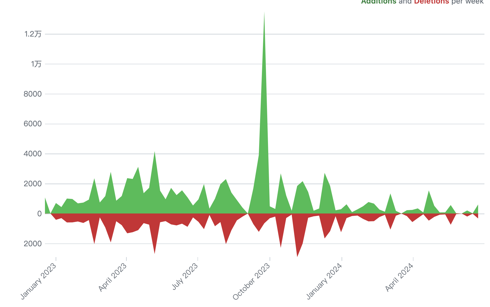
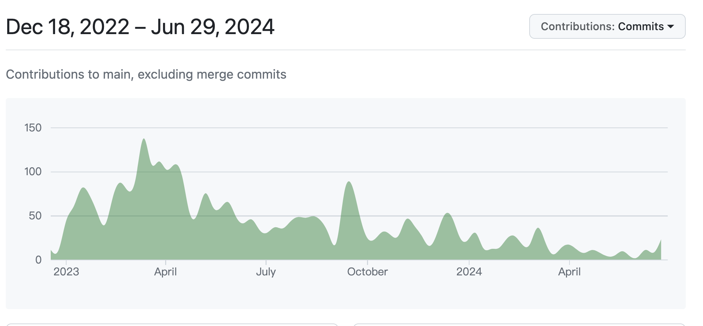
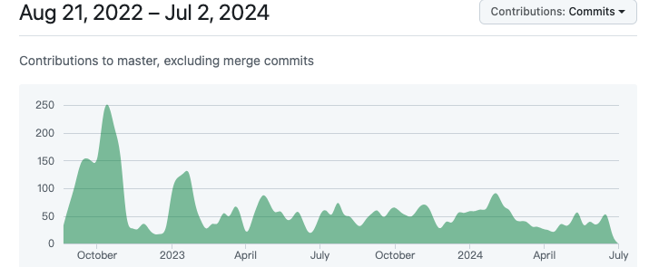
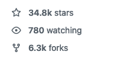
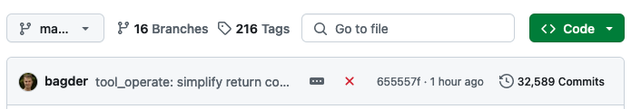
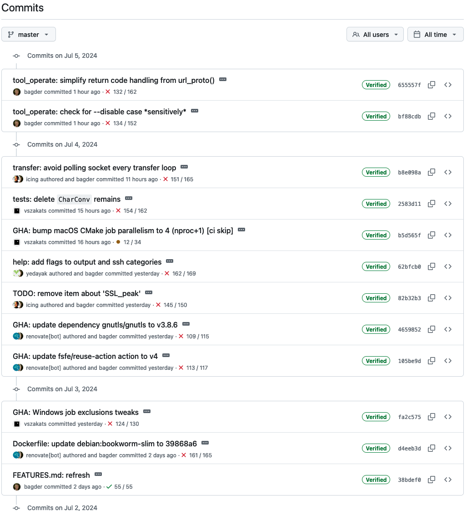
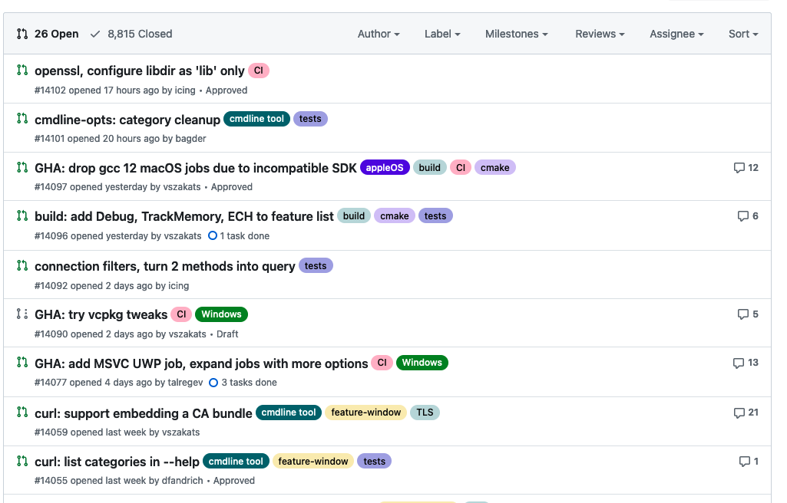
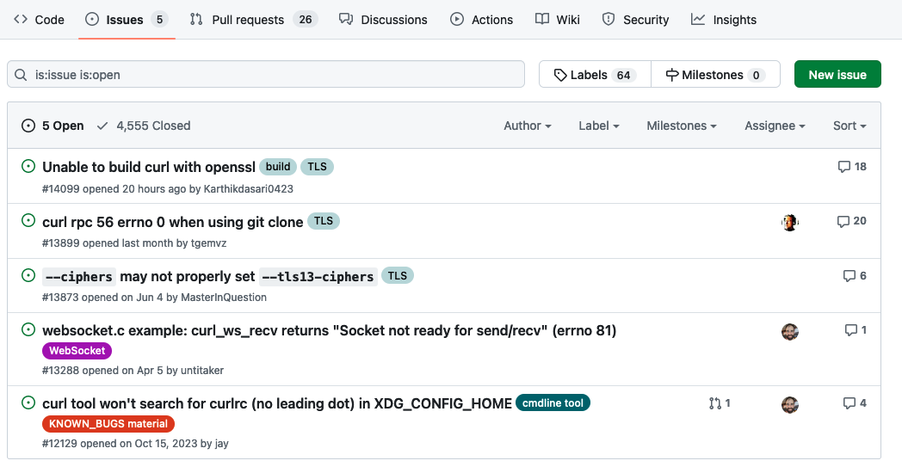
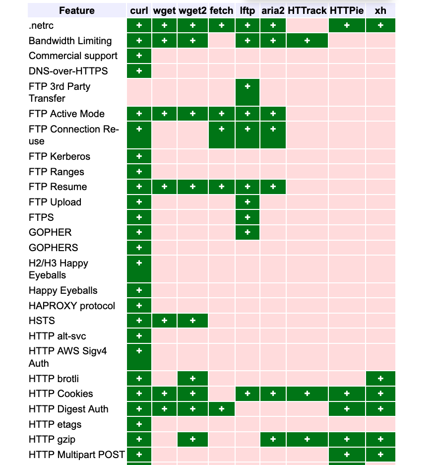

# InvokeAI
ts py 写的，感觉上是webui和comfyui结合    
这像是huchenlei在忙的    
痛陈js缺点     

https://github.com/invoke-ai/InvokeAI

## comfyui
py js

## webui
py js

## text-generation-webui
py

## sd.next

挺早的

https://github.com/vladmandic/automatic

main更新很快 每天        

SD.Next：稳定扩散和其他基于扩散的生成图像模型的高级实现

SD.Next: Advanced Implementation of Stable Diffusion and other Diffusion-based generative image models

    Multiple backends!
    ▹ Diffusers | Original
    Multiple UIs!
    ▹ Standard | Modern
    Multiple diffusion models!
    ▹ Stable Diffusion 1.5/2.1/XL/3.0 | LCM | Lightning | Segmind | Kandinsky | Pixart-α | Pixart-Σ | Stable Cascade | Würstchen | aMUSEd | DeepFloyd IF | UniDiffusion | SD-Distilled | BLiP Diffusion | KOALA | SDXS | Hyper-SD | HunyuanDiT | etc.
    Built-in Control for Text, Image, Batch and video processing!
    ▹ ControlNet | ControlNet XS | Control LLLite | T2I Adapters | IP Adapters
    Multiplatform!
    ▹ Windows | Linux | MacOS with CPU | nVidia | AMD | IntelArc/IPEX | DirectML | OpenVINO | ONNX+Olive | ZLUDA
    Platform specific autodetection and tuning performed on install
    Optimized processing with latest torch developments with built-in support for torch.compile
    and multiple compile backends: Triton, ZLUDA, StableFast, DeepCache, OpenVINO, NNCF, IPEX, OneDiff
    Improved prompt parser
    Enhanced Lora/LoCon/Lyco code supporting latest trends in training
    Built-in queue management
    Enterprise level logging and hardened API
    Built in installer with automatic updates and dependency management
    Modernized UI with theme support and number of built-in themes (dark and light)
    Mobile compatible

## curl

command line tool and library
for transferring data with URLs
(since 1998)

https://github.com/curl/curl

A command line tool and library for transferring data with URL syntax, supporting DICT, FILE, FTP, FTPS, GOPHER, GOPHERS, HTTP, HTTPS, IMAP, IMAPS, LDAP, LDAPS, MQTT, POP3, POP3S, RTMP, RTMPS, RTSP, SCP, SFTP, SMB, SMBS, SMTP, SMTPS, TELNET, TFTP, WS and WSS. libcurl offers a myriad of powerful features 

curl is used in command lines or scripts to transfer data. curl is also libcurl, used in cars, television sets, routers, printers, audio equipment, mobile phones, tablets, medical devices, settop boxes, computer games, media players and is the Internet transfer engine for countless software applications in over twenty billion installations. 

 Who makes curl?

curl is free and open source software and exists thanks to thousands of contributors and our awesome sponsors. The curl project follows well established open source best practices. You too can help us improve! 

 What is the latest curl?

The most recent stable version is 8.8.0, released on 2024-05-22. Currently, 125 of the listed downloads are of the latest version. 

Notice
Curl contains pieces of source code that is Copyright (c) 1998, 1999 Kungliga Tekniska Högskolan. This notice is included here to comply with the distribution terms.

# CosmicMan
：人类的文本到图像基础模型

https://huggingface.co/cosmicman/CosmicMan-SDXL

我们提出了 CosmicMan，一种专门用于生成高保真人体图像的文本到图像基础模型。与目前陷入人类图像质量低下和文本与图像错位困境的通用基础模型不同，CosmicMan 能够生成具有细致外观、合理结构和精确文本与图像对齐以及详细密集描述的照片般逼真的人体图像。CosmicMan 成功的核心是对数据和模型的新思考和新视角：(1) 我们发现数据质量和可扩展的数据生产流程对于经过训练的模型的最终结果至关重要。因此，我们提出了一种新的数据生产范式 Annotate Everyone，它充当永久的数据飞轮，随着时间的推移，可以生成具有准确且经济高效的注释的高质量数据。在此基础上，我们构建了一个大规模数据集 CosmicMan-HQ 1.0，其中包含 600 万张高质量真实人体图像，平均分辨率为 1488x1255，并附有来自 1.15 亿个不同粒度属性的精确文本注释。（2）我们认为，专门针对人类的文本到图像基础模型必须实用——易于集成到下游任务中，同时有效生成高质量的人体图像。因此，我们提出以分解的方式建模密集文本描述和图像像素之间的关系，并提出分解注意力重新聚焦（Daring）训练框架。它无缝分解现有文本到图像扩散模型中的交叉注意特征，并强制注意力重新聚焦而无需添加额外的模块。通过 Daring，我们表明将连续文本空间明确地离散化为几个与人体结构相一致的基本组是轻松解决错位问题的关键。

在此基础上，我们构建了一个大规模数据集 CosmicMan-HQ 1.0，其中包含 600 万张高质量真实人体图像，平均分辨率为 1488x1255，

attached with precise text annotations deriving from 115 Million attributes in diverse granularities

# 网页验证方法实现训练
早期 选出符合的图   
现在 选出aigc生成的 符合文本的图    
选择艺术字      
移动拼图    
openai 也可能接了api 3d模型方向给出8方向图，选出与箭头一致方向的图    
每一次文本生成 先让人类做这个任务， 手机数据？     
但他的label应该就有正确的 这样才能验证 所以并不好训练

Gradle

Gradle是一个开源构建自动化工具，专为大型项目设计。它基于DSL（领域特定语言）编写，该语言是用Groovy编写的，使得构建脚本更加简洁和强大。Gradle不仅可以构建Java应用程序，还支持多种语言和技术，例如C++、Python、Android等。

在安装Gradle之前，你需要确保满足以下前提条件：

    一个有效的Java Development Kit (JDK)安装。Gradle 7.0及以上版本需要JDK版本为8到16。
    `JAVA_HOME` 环境变量已正确设置，指向JDK的安装目录。

# eta这些东西我至今没搞懂是什么
sd 原理是否要重新复习     
数学公式哪些    

ensd相同 拥有一样的eta

# 结尾