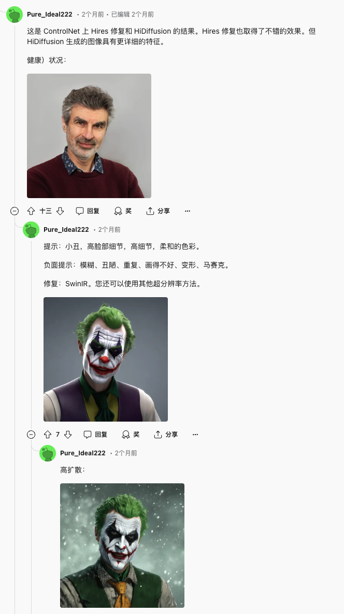

# hidiffusion
关注comfyui插件原生实现

sd.next已经支持    
4.29   
估计是直接使用diffusers    

优先级应该是hidiffusion 然后cfg++     
或者cfg设法hook过去 已有一些代码     
但我感觉效果没那么好       

文生图功能 sdxl优先支持

Update

2024.6.19 - 💥 Integrated into OpenBayes, see the demo. Thank OpenBayes team!

2024.6.16 - 💥 Support PyTorch 2.X.

2024.6.16 - 💥 Fix non-square generation issue. Now HiDiffusion supports more image sizes and aspect ratios.

2024.5.7 - 💥 Support image-to-image task, see here.

2024.4.16 - 💥 Release source code.

如何在 Automatic1111 Stable Diffusion Web UI 中使用它（适用于 SD 1.5、XL 等） #8    
这个讨论太早 5.11最晚      

ComfyUI 支持吗？ #1     
这个也很早 5.22最晚

https://github.com/blepping/comfyui_jankhidiffusion#use-with-controlnet     
这个原生插件更新于 5.21最晚 难以适用     

https://github.com/florestefano1975/ComfyUI-HiDiffusion    
这个diffusers包装插件zuiwangeng信誉5.4 也太早

Supported Tasks
✅ Text-to-image
✅ ControlNet, including text-to-image, image-to-image
✅ Inpainting

Supported Models
✅ Stable Diffusion XL
✅ Stable Diffusion XL Turbo
✅ Stable Diffusion v2
✅ Stable Diffusion v1
Note: HiDiffusion also supports the downstream diffusion models based on these repositories, such as Ghibli-Diffusion, Playground, etc.

高分辨类似      
Kohya Deep Shrink     
ScaleCrafter    

https://arxiv.org/abs/2311.17528

[Submitted on 29 Nov 2023 (v1), last revised 29 Apr 2024 (this version, v2)]

HiDiffusion: Unlocking Higher-Resolution Creativity and Efficiency in Pretrained Diffusion Models

扩散模型已成为高分辨率图像合成的主流方法。然而，直接从预训练的扩散模型生成更高分辨率的图像会遇到不合理的对象重复并成倍增加生成时间。在本文中，我们发现对象重复源于 U-Net 深层块中的特征重复。同时，我们将生成时间的延长归因于 U-Net 顶部块中的自注意力冗余。为了解决这些问题，我们提出了一个无需调整的高分辨率框架 HiDiffusion。具体来说，HiDiffusion 包含分辨率感知 U-Net (RAU-Net)，它可以动态调整特征图大小来解决对象重复问题，并使用改进的移位窗口多头自注意力 (MSW-MSA)，利用优化的窗口注意力来减少计算。我们可以将 HiDiffusion 集成到各种预训练的扩散模型中，以将图像生成分辨率扩展到 4096x4096，推理速度是以前方法的 1.5-6 倍。大量实验表明，我们的方法可以解决对象重复和计算量大的问题，在高分辨率图像合成任务上实现最先进的性能。

## 原理

    def apply_hidiffusion(
            model: torch.nn.Module,
            apply_raunet: bool = True,
            apply_window_attn: bool = True):
        """
        model: diffusers model. We support SD 1.5, 2.1, XL, XL Turbo.
        
        apply_raunet: whether to apply RAU-Net
        
        apply_window_attn: whether to apply MSW-MSA.
        '''
        # Make sure the module is not currently patched
        remove_hidiffusion(model)

Diffusion models have become a mainstream approach for high-resolution image synthesis. However, directly generating higherresolution images from pretrained diffusion models will encounter unreasonable object duplication and exponentially increase the generation time. In this paper, we discover that object duplication arises from feature duplication in the deep blocks of the U-Net. Concurrently, We pinpoint the extended generation times to self-attention redundancy in U-Net’s top blocks. To address these issues, we propose a tuning-free higher-resolution framework named HiDiffusion. Specifically, HiDiffusion contains Resolution-Aware U-Net (RAU-Net) that dynamically adjusts the feature map size to resolve object duplication and engages Modified Shifted Window Multi-head Self-Attention (MSW-MSA) that utilizes optimized window attention to reduce computations. we can integrate HiDiffusion into various pretrained diffusion models to scale image generation resolutions even to 4096×4096 at 1.5-6× the inference speed of previous methods. Extensive experiments demonstrate that our approach can address object duplication and heavy computation issues, achieving state-of-the-art performance on higher-resolution image synthesis tasks.

他这个竟然不用训练 不用权重 就能这样该结构

如果说cut属于patch找规律 那这个就有点硬核

## 代码
看起来主要是换了模型结构去推理      
有一些阈值

    # T1_ratio: see T1 introduced in the main paper. T1 = number_inference_step * T1_ratio. A higher T1_ratio can better mitigate object duplication. We set T1_ratio=0.4 by default. You'd better adjust it to fit your prompt. Only active when apply_raunet=True.
    # T2_ratio: see T2 introduced in the appendix, used in extreme resolution image generation. T2 = number_inference_step * T2_ratio. A higher T2_ratio can better mitigate object duplication. Only active when apply_raunet=True
    switching_threshold_ratio_dict = {
        'sd15_1024': {'T1_ratio': 0.4, 'T2_ratio': 0.0},
        'sd15_2048': {'T1_ratio': 0.7, 'T2_ratio': 0.3},
        'sdxl_2048': {'T1_ratio': 0.4, 'T2_ratio': 0.0},
        'sdxl_4096': {'T1_ratio': 0.7, 'T2_ratio': 0.3},
        'sdxl_turbo_1024': {'T1_ratio': 0.5, 'T2_ratio': 0.0},
    }

mitigate object duplication.

    is_aggressive_raunet = True
    aggressive_step = 8

    def make_diffusers_cross_attn_down_block(block_class: Type[torch.nn.Module]) -> Type[torch.nn.Module]:
        # replace conventional downsampler with resolution-aware downsampler

    def make_diffusers_downsampler_block(block_class: Type[torch.nn.Module]) -> Type[torch.nn.Module]:
        # replace conventional downsampler with resolution-aware downsampler

也使用unpack

    diffusion_model.info = {
        'size': None, 
        'upsample_size': None,
        'hooks': [], 
        'text_to_img_controlnet': hasattr(model, 'controlnet'),
        'is_inpainting_task': 'inpainting' in name_or_path, 
        'is_playground': 'playground' in name_or_path,
        'pipeline': model}
    model.info = diffusion_model.info
    hook_diffusion_model(diffusion_model)

def hook_diffusion_model(model: torch.nn.Module):

    """ Adds a forward pre hook to get the image size. This hook can be removed with remove_hidiffusion. """
    def hook(module, args):
        module.info["size"] = (args[0].shape[2], args[0].shape[3])
        return None

    model.info["hooks"].append(model.register_forward_pre_hook(hook))

args怎么来的

主要需要改模型结构     
其实就是调用的输入输出做变化     

直接改模型结构也方便些 就是哪些步有哪种输入

如果改模型结构就是要改kdiffusion

非方形分辨率 问题解决在    

num_upsamplers

cross_attn_up_block

cross_attn_down_block

make_diffusers_transformer_block

如果改能怎么改

script 怎么修改模型结构      
其实也不是修改模型结构     
每一小块的输入输出做调整      

能插入吗       
结束后需要复原

以patch形式吗

他这个不是改采样器     

    def sdxl_hidiffusion_key():
        modified_key = dict()
        modified_key['down_module_key'] = ['down_blocks.1']
        modified_key['down_module_key_extra'] = ['down_blocks.1.downsamplers.0.conv']
        modified_key['up_module_key'] = ['up_blocks.1']
        modified_key['up_module_key_extra'] = ['up_blocks.0.upsamplers.0.conv']
        modified_key['windown_attn_module_key'] = ['down_blocks.1.attentions.0.transformer_blocks.0', 
        'down_blocks.1.attentions.0.transformer_blocks.1', 
        'down_blocks.1.attentions.1.transformer_blocks.0',
        'down_blocks.1.attentions.1.transformer_blocks.1',
        'up_blocks.1.attentions.0.transformer_blocks.0', 
        'up_blocks.1.attentions.0.transformer_blocks.1',
        'up_blocks.1.attentions.1.transformer_blocks.0', 
        'up_blocks.1.attentions.1.transformer_blocks.1', 
        'up_blocks.1.attentions.2.transformer_blocks.0', 
        'up_blocks.1.attentions.2.transformer_blocks.1']
        
        return modified_key

改模型只能是pacth hook过去

单纯script改不了 改模型保存模型显存代价过大

https://github.com/kijai/ComfyUI-ELLA-wrapper/blob/main/nodes.py

这个插件只是

    from diffusers.loaders.single_file_utils import (
            convert_ldm_vae_checkpoint, 
            convert_ldm_unet_checkpoint, 
            create_vae_diffusers_config, 
            create_unet_diffusers_config,
            create_text_encoder_from_ldm_clip_checkpoint
        )         

https://github.com/invoke-ai/InvokeAI/issues/6309

它的开源代码是基于扩散器的，因此添加此功能一定相当容易。

我们在扩散器周围有很多自定义逻辑，而“只需添加一行！”并不一定适用于我们的实现。

@RyanJDick @lstein您能就实施这项功能的努力提出建议吗？它将取代 HRO 功能（自动第二遍 img2img）。

TLDR：我认为HiDiffusion 可以以与我们所有其他功能兼容的方式得到支持。但是，这肯定会比他们宣传的单行代码付出更多努力。我们应该进行更多测试，以确保此功能值得实施/维护（论文中的示例看起来很棒）。

HiDiffusion 以两种方式修改了 UNet：RAU-Net（分辨率感知 U-Net）和 MSW-MSA（改进的移位窗口多头自注意力）。这些都是对 UNet 的无需调整的修改，即不需要新的权重。

RAU-Net 旨在避免高分辨率下的主题重复。它通过改变 UNet 层的下采样/上采样模式来实现这一点，这样深层就可以以更接近其训练时的分辨率运行。     
核心还是这个东西    

MSW-MSA 修改通过对顶部 UNet 块的自注意层应用窗口来改善高分辨率的生成时间。

A lot of code in RAU-Net are directly copied from diffusers impl (That is why I do not like diffuers). The main logic seem to be further increase compression / decompression by 2.

对的。从我弄明白的情况来看，除了 MSW-MSA 注意部分之外，它几乎与 Kohya Deep Shrink 完全一样。

交叉注意部分使用 Torchavg_pool2d而不是双三次。
RAU 降采样器部分使用转换步幅/扩张来缩小规模，而不是双三次。

对于第二个，缩小发生的位置可能很重要。转换方法确实似乎比深度缩小产生更好的结果（包括我尝试过的其他缩小方法）。

据我所知，RAU-Net 部分本质上是 Kohya Deep Shrink（又名PatchModelAddDownscale）：其概念是在生成开始时缩小图像，让模型设置主要细节，例如角色有多少条腿，然后允许模型在缩放效果结束后细化和添加细节。该部分的主要区别在于缩小方法 - 它使用卷积与步幅/扩张和池平均来缩小尺寸，而 Deep Shrink 通常使用双三次缩小尺寸。缩放发生的位置也可能很重要 - 它似乎确实比 Deep Shrink 效果好得多，至少对于 SD 1.5 来说是这样。

    def process(self, p, enable, only_one_pass, d1, d2, s1, s2, scaler, downscale, upscale, smooth_scaling, early_out):
        self.config = DictConfig({name: var for name, var in locals().items() if name not in ['self', 'p']})
        if not enable or self.disable:
            script_callbacks.remove_current_script_callbacks()
            return
        model = p.sd_model.model.diffusion_model
        if s1 > s2: self.config.s2 = s1
        self.p1 = (s1, d1 - 1)
        self.p2 = (s2, d2 - 1)
        self.step_limit = 0
        
        def denoiser_callback(params: script_callbacks.CFGDenoiserParams):
            if params.sampling_step < self.step_limit: return
            for s, d in [self.p1, self.p2]:
                out_d = d if self.config.early_out else -(d + 1)
                if params.sampling_step < params.total_sampling_steps * s:
                    if not isinstance(model.input_blocks[d], Scaler):
                        model.input_blocks[d] = Scaler(self.config.downscale, model.input_blocks[d], self.config.scaler)
                        model.output_blocks[out_d] = Scaler(self.config.upscale, model.output_blocks[out_d], self.config.scaler)
                    elif self.config.smooth_scaling:
                        scale_ratio = params.sampling_step / (params.total_sampling_steps * s)
                        downscale = min((1 - self.config.downscale) * scale_ratio + self.config.downscale, 1.0)
                        model.input_blocks[d].scale = downscale
                        model.output_blocks[out_d].scale = self.config.upscale * (self.config.downscale / downscale)
                    return
                elif isinstance(model.input_blocks[d], Scaler) and (self.p1[1] != self.p2[1] or s == self.p2[0]):
                    model.input_blocks[d] = model.input_blocks[d].block
                    model.output_blocks[out_d] = model.output_blocks[out_d].block
            self.step_limit = params.sampling_step if self.config.only_one_pass else 0

        script_callbacks.on_cfg_denoiser(denoiser_callback)

这个直接改cfg denoiser感觉受版本影响大

    检查当前采样步骤是否达到处理条件。
    根据条件对模型的输入和输出块进行缩放处理。
    如果启用平滑缩放，会根据当前步骤动态调整缩放比例。
    在特定条件下，恢复原始的输入和输出块。

注册回调:   
pythonCopyscript_callbacks.on_cfg_denoiser(denoiser_callback)     
将定义的回调函数注册到去噪器中。

这段代码的主要目的似乎是在图像生成或处理过程中，根据不同的采样阶段动态调整模型的某些层的缩放行为。这可能用于提高生成质量或优化处理效率。

    步骤限制检查：
    pythonCopyif params.sampling_step < self.step_limit: return
    如果当前采样步骤小于 step_limit，函数直接返回。这可能是为了避免重复处理或限制处理频率。
    主循环：
    pythonCopyfor s, d in [self.p1, self.p2]:
    这个循环遍历两组参数 p1 和 p2，它们分别代表不同的处理阶段或条件。

    输出层索引计算：
    pythonCopyout_d = d if self.config.early_out else -(d + 1)
    根据是否启用 early_out，计算输出层的索引。
    主要处理逻辑：
    pythonCopyif params.sampling_step < params.total_sampling_steps * s:
    这个条件检查当前是否处于需要进行缩放处理的采样阶段。
    缩放器替换：
    pythonCopyif not isinstance(model.input_blocks[d], Scaler):
        model.input_blocks[d] = Scaler(self.config.downscale, model.input_blocks[d], self.config.scaler)
        model.output_blocks[out_d] = Scaler(self.config.upscale, model.output_blocks[out_d], self.config.scaler)
    如果当前输入块不是 Scaler 类型，则用 Scaler 对象替换输入和输出块。这实现了动态缩放功能。

    平滑缩放：
    pythonCopyelif self.config.smooth_scaling:
        scale_ratio = params.sampling_step / (params.total_sampling_steps * s)
        downscale = min((1 - self.config.downscale) * scale_ratio + self.config.downscale, 1.0)
        model.input_blocks[d].scale = downscale
        model.output_blocks[out_d].scale = self.config.upscale * (self.config.downscale / downscale)
    如果启用了平滑缩放，根据当前步骤动态计算缩放比例，并应用到输入和输出块。
    恢复原始块：
    pythonCopyelif isinstance(model.input_blocks[d], Scaler) and (self.p1[1] != self.p2[1] or s == self.p2[0]):
        model.input_blocks[d] = model.input_blocks[d].block
        model.output_blocks[out_d] = model.output_blocks[out_d].block
    在特定条件下（比如处理阶段结束），将被 Scaler 替换的块恢复为原始块。

    更新步骤限制：
    pythonCopyself.step_limit = params.sampling_step if self.config.only_one_pass else 0
    如果配置为只处理一次，更新 step_limit 以防止重复处理。

需要注意的是，这个函数假设模型结构中有 input_blocks 和 output_blocks，并且可以动态替换这些块的实现。这表明它可能是针对特定类型的生成模型（如某些扩散模型）设计的。

    class Scaler(torch.nn.Module):
        def __init__(self, scale, block, scaler):
            super().__init__()
            self.scale = scale
            self.block = block
            self.scaler = scaler
            
        def forward(self, x, *args):
            x = torch.nn.functional.interpolate(x, scale_factor=self.scale, mode=self.scaler)
            return self.block(x, *args)

先缩放 再进入模块？？

这个 Scaler 类的主要目的是在神经网络的某个块之前添加一个缩放操作。它可以用来调整特征图的大小，可能用于上采样或下采样。
使用这个类的好处包括：

灵活性：可以轻松地在网络的任何部分添加缩放操作。
可配置：缩放因子和方法可以在初始化时指定。
透明性：原始的网络块仍然被保留和使用。

在实际应用中，这个 Scaler 类可能被用于动态调整网络某些层的输入大小，这在图像生成或处理任务中可能很有用，例如在不同分辨率下保持或调整特征的表示。

    初始化方法：
    pythonCopydef __init__(self, scale, block, scaler):
        super().__init__()
        self.scale = scale
        self.block = block
        self.scaler = scaler

scale: 缩放因子
block: 要包装的原始神经网络块
scaler: 缩放方法（如 'bilinear', 'nearest' 等）

直接替换BLOCK

class Scaler(torch.nn.Module):

这里面保存了属性一个block

或者像 cn一样hijack??      
cn是大层改变输入

hidiffusion其实就是压缩方式改变了 数据的压缩方式      

先尝试只实现raunet

# onediff
软连失败

ln: failed to create symbolic link '/m': Function not implemented

未知原因错误

mnt内

team内

team到mnt都不行

mnt到teams也不行

在Linux命令行中，可以使用 find 命令来搜索一个文件夹内的所有软连接。下面是具体的命令：

    bash
    复制代码
    find /path/to/directory -type l

直接不软连接    
复制过去    
但是好像没有运行install.py

手装 pip install git+https://github.com/siliconflow/onediff.git

Successfully installed onediff-1.2.0.dev1

可以了

但是我在1区 5区都没有看见软连接

推理报错

手装

pip install --pre oneflow -f https://oneflow-pro.oss-cn-beijing.aliyuncs.com/branch/community/cu118

oneflow已经被阿里收购

再建onediff

Collecting oneflow    
Downloading https://oneflow-pro.oss-cn-beijing.aliyuncs.com/branch/community/cu118/ec7b682e30831cc0eb30d7cc07d4dcb366c588cd/oneflow-0.9.1.dev20240703%2Bcu118-cp310-cp310-manylinux_2_17_x86_64.manylinux2014_x86_64.whl (1422.5 MB)

Collecting nvidia-cudnn-cu11 (from oneflow)
  Downloading https://pypi.tuna.tsinghua.edu.cn/packages/40/8e/111f88f108cbad7b8fd293fdeb2a7a251205feb48adb504c6caecd0e20e3/nvidia_cudnn_cu11-9.2.0.82-py3-none-manylinux2014_x86_64.whl (572.1 MB)

Collecting nvidia-cublas-cu11 (from oneflow)
  Downloading https://pypi.tuna.tsinghua.edu.cn/packages/46/be/c222e33e60d28ecd496a46fc4d78ccae0ee28e1fd7dc705b6288b4cad27e/nvidia_cublas_cu11-11.11.3.6-py3-none-manylinux1_x86_64.whl (417.9 MB)

Successfully installed nvidia-cublas-cu11-11.11.3.6 nvidia-cudnn-cu11-9.2.0.82 nvidia-cufft-cu11-10.9.0.58 nvidia-cusparse-cu11-11.7.5.86 nvidia-nccl-cu11-2.21.5 oneflow-0.9.1.dev20240703+cu118

软连只存在于服务启动

# cfg++

https://github.com/invoke-ai/InvokeAI/issues/6516    
两周前到四天前

https://github.com/invoke-ai/InvokeAI/pull/4335     
Nov 30, 2023    
cfg rescale 已经merge

https://github.com/dunkeroni/InvokeAI_ModularDenoiseNodes

https://gitlab.com/keturn/invert_denoise_invoke/-/tree/invoke-v3.5

CFG++ 与 CFG Rescale 一样，试图解决线性无分类器引导函数容易产生分布外值的方式。

CFG++, like CFG Rescale, is an attempt to address the way the linear Classifier-Free Guidance function is prone to producing out-of-distribution values.

据我了解，数学很简单。但它以一种可怕的方式与调度器在扩散器中的抽象方式（以及 Invoke）发生冲突。我已经创建了这个问题，所以有一个地方可以记录它。

But it clashes in an awful way with how Schedulers are abstracted in diffusers (and thus Invoke). I've created this issue so there's a place to keep notes about that.

Invoke 基于 diffusers构建？?

无分类器引导 (CFG)是现代扩散模型中用于文本引导生成的基本工具。尽管 CFG 很有效，但它需要较高的引导规模，这有明显的缺点：

模式崩溃和饱和
可逆性较差
不自然、弯曲的 PF-ODE 轨迹

我们针对这个看似固有的限制提出了一个简单的解决方案，并提出了 CFG++，它纠正了 CFG 的流形外问题。观察到以下优点

样本质量更好，更符合原文要求
更平滑、更直的 PF-ODE 轨迹
增强可逆性

实验结果证实，我们的方法显著提高了文本到图像生成、DDIM 反转、编辑和解决逆问题的性能，表明在利用文本指导的各个领域具有广泛的影响和潜在的应用。

> [!note]
> This work is currently in the preprint stage, and there may be some changes to the code.

这应该是一个失败项目

CFG++: Manifold-constrained Classifier Free Guidance For Diffusion Models
Hyungjin Chung*, Jeongsol Kim*, Geon Yeong Park*, Hyelin Nam*, Jong Chul Ye
KAIST

官方仅有ddim支持

image edit 论文上看起来效果比较好

文生图比较不稳定

edit如何用？

# Be-Your-Outpainter 
耗时四个月开源

https://github.com/G-U-N/Be-Your-Outpainter 

训练17386MB
每个视频基于预训练lora再训练800步 lora   
推理9496mb

800步 耗时 20分钟

# MultiDiffusion

方法

我们的主要思想是在预先训练的参考扩散模型上定义一个新的生成过程。从噪声图像开始，在每个生成步骤中，我们解决一个优化任务，其目标是使每个裁剪图像尽可能接近其去噪版本。

请注意，虽然每个去噪步骤可能会拉向不同的方向，但我们的流程将这些不一致的方向融合到全局去噪步骤中，从而产生高质量的无缝图像。

感觉这个用来outpaint会比传统好一些

# 结尾