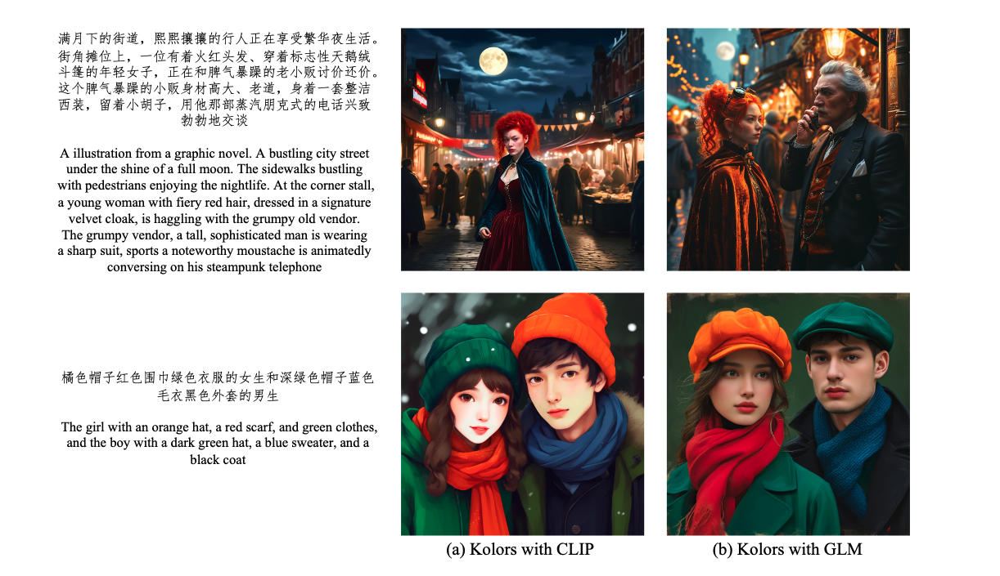

# hidiffusion
关注comfyui插件原生实现

sd.next已经支持    
4.29   
估计是直接使用diffusers    

优先级应该是hidiffusion 然后cfg++     
或者cfg设法hook过去 已有一些代码     
但我感觉效果没那么好       

文生图功能 sdxl优先支持

Update

2024.6.19 - 💥 Integrated into OpenBayes, see the demo. Thank OpenBayes team!

2024.6.16 - 💥 Support PyTorch 2.X.

2024.6.16 - 💥 Fix non-square generation issue. Now HiDiffusion supports more image sizes and aspect ratios.

2024.5.7 - 💥 Support image-to-image task, see here.

2024.4.16 - 💥 Release source code.

如何在 Automatic1111 Stable Diffusion Web UI 中使用它（适用于 SD 1.5、XL 等） #8    
这个讨论太早 5.11最晚      

ComfyUI 支持吗？ #1     
这个也很早 5.22最晚

https://github.com/blepping/comfyui_jankhidiffusion#use-with-controlnet     
这个原生插件更新于 5.21最晚 难以适用     

https://github.com/florestefano1975/ComfyUI-HiDiffusion    
这个diffusers包装插件zuiwangeng信誉5.4 也太早

Supported Tasks
✅ Text-to-image
✅ ControlNet, including text-to-image, image-to-image
✅ Inpainting

Supported Models
✅ Stable Diffusion XL
✅ Stable Diffusion XL Turbo
✅ Stable Diffusion v2
✅ Stable Diffusion v1
Note: HiDiffusion also supports the downstream diffusion models based on these repositories, such as Ghibli-Diffusion, Playground, etc.

高分辨类似      
Kohya Deep Shrink     
ScaleCrafter    

https://arxiv.org/abs/2311.17528

[Submitted on 29 Nov 2023 (v1), last revised 29 Apr 2024 (this version, v2)]

HiDiffusion: Unlocking Higher-Resolution Creativity and Efficiency in Pretrained Diffusion Models

扩散模型已成为高分辨率图像合成的主流方法。然而，直接从预训练的扩散模型生成更高分辨率的图像会遇到不合理的对象重复并成倍增加生成时间。在本文中，我们发现对象重复源于 U-Net 深层块中的特征重复。同时，我们将生成时间的延长归因于 U-Net 顶部块中的自注意力冗余。为了解决这些问题，我们提出了一个无需调整的高分辨率框架 HiDiffusion。具体来说，HiDiffusion 包含分辨率感知 U-Net (RAU-Net)，它可以动态调整特征图大小来解决对象重复问题，并使用改进的移位窗口多头自注意力 (MSW-MSA)，利用优化的窗口注意力来减少计算。我们可以将 HiDiffusion 集成到各种预训练的扩散模型中，以将图像生成分辨率扩展到 4096x4096，推理速度是以前方法的 1.5-6 倍。大量实验表明，我们的方法可以解决对象重复和计算量大的问题，在高分辨率图像合成任务上实现最先进的性能。

## 原理

    def apply_hidiffusion(
            model: torch.nn.Module,
            apply_raunet: bool = True,
            apply_window_attn: bool = True):
        """
        model: diffusers model. We support SD 1.5, 2.1, XL, XL Turbo.
        
        apply_raunet: whether to apply RAU-Net
        
        apply_window_attn: whether to apply MSW-MSA.
        '''
        # Make sure the module is not currently patched
        remove_hidiffusion(model)

Diffusion models have become a mainstream approach for high-resolution image synthesis. However, directly generating higherresolution images from pretrained diffusion models will encounter unreasonable object duplication and exponentially increase the generation time. In this paper, we discover that object duplication arises from feature duplication in the deep blocks of the U-Net. Concurrently, We pinpoint the extended generation times to self-attention redundancy in U-Net’s top blocks. To address these issues, we propose a tuning-free higher-resolution framework named HiDiffusion. Specifically, HiDiffusion contains Resolution-Aware U-Net (RAU-Net) that dynamically adjusts the feature map size to resolve object duplication and engages Modified Shifted Window Multi-head Self-Attention (MSW-MSA) that utilizes optimized window attention to reduce computations. we can integrate HiDiffusion into various pretrained diffusion models to scale image generation resolutions even to 4096×4096 at 1.5-6× the inference speed of previous methods. Extensive experiments demonstrate that our approach can address object duplication and heavy computation issues, achieving state-of-the-art performance on higher-resolution image synthesis tasks.

他这个竟然不用训练 不用权重 就能这样该结构

如果说cut属于patch找规律 那这个就有点硬核

## 代码
看起来主要是换了模型结构去推理      
有一些阈值

    # T1_ratio: see T1 introduced in the main paper. T1 = number_inference_step * T1_ratio. A higher T1_ratio can better mitigate object duplication. We set T1_ratio=0.4 by default. You'd better adjust it to fit your prompt. Only active when apply_raunet=True.
    # T2_ratio: see T2 introduced in the appendix, used in extreme resolution image generation. T2 = number_inference_step * T2_ratio. A higher T2_ratio can better mitigate object duplication. Only active when apply_raunet=True
    switching_threshold_ratio_dict = {
        'sd15_1024': {'T1_ratio': 0.4, 'T2_ratio': 0.0},
        'sd15_2048': {'T1_ratio': 0.7, 'T2_ratio': 0.3},
        'sdxl_2048': {'T1_ratio': 0.4, 'T2_ratio': 0.0},
        'sdxl_4096': {'T1_ratio': 0.7, 'T2_ratio': 0.3},
        'sdxl_turbo_1024': {'T1_ratio': 0.5, 'T2_ratio': 0.0},
    }

mitigate object duplication.

    is_aggressive_raunet = True
    aggressive_step = 8

    def make_diffusers_cross_attn_down_block(block_class: Type[torch.nn.Module]) -> Type[torch.nn.Module]:
        # replace conventional downsampler with resolution-aware downsampler

    def make_diffusers_downsampler_block(block_class: Type[torch.nn.Module]) -> Type[torch.nn.Module]:
        # replace conventional downsampler with resolution-aware downsampler

也使用unpack

    diffusion_model.info = {
        'size': None, 
        'upsample_size': None,
        'hooks': [], 
        'text_to_img_controlnet': hasattr(model, 'controlnet'),
        'is_inpainting_task': 'inpainting' in name_or_path, 
        'is_playground': 'playground' in name_or_path,
        'pipeline': model}
    model.info = diffusion_model.info
    hook_diffusion_model(diffusion_model)

def hook_diffusion_model(model: torch.nn.Module):

    """ Adds a forward pre hook to get the image size. This hook can be removed with remove_hidiffusion. """
    def hook(module, args):
        module.info["size"] = (args[0].shape[2], args[0].shape[3])
        return None

    model.info["hooks"].append(model.register_forward_pre_hook(hook))

args怎么来的

主要需要改模型结构     
其实就是调用的输入输出做变化     

直接改模型结构也方便些 就是哪些步有哪种输入

如果改模型结构就是要改kdiffusion

非方形分辨率 问题解决在    

num_upsamplers

cross_attn_up_block

cross_attn_down_block

make_diffusers_transformer_block

如果改能怎么改

script 怎么修改模型结构      
其实也不是修改模型结构     
每一小块的输入输出做调整      

能插入吗       
结束后需要复原

以patch形式吗

他这个不是改采样器     

    def sdxl_hidiffusion_key():
        modified_key = dict()
        modified_key['down_module_key'] = ['down_blocks.1']
        modified_key['down_module_key_extra'] = ['down_blocks.1.downsamplers.0.conv']
        modified_key['up_module_key'] = ['up_blocks.1']
        modified_key['up_module_key_extra'] = ['up_blocks.0.upsamplers.0.conv']
        modified_key['windown_attn_module_key'] = ['down_blocks.1.attentions.0.transformer_blocks.0', 
        'down_blocks.1.attentions.0.transformer_blocks.1', 
        'down_blocks.1.attentions.1.transformer_blocks.0',
        'down_blocks.1.attentions.1.transformer_blocks.1',
        'up_blocks.1.attentions.0.transformer_blocks.0', 
        'up_blocks.1.attentions.0.transformer_blocks.1',
        'up_blocks.1.attentions.1.transformer_blocks.0', 
        'up_blocks.1.attentions.1.transformer_blocks.1', 
        'up_blocks.1.attentions.2.transformer_blocks.0', 
        'up_blocks.1.attentions.2.transformer_blocks.1']
        
        return modified_key

改模型只能是pacth hook过去

单纯script改不了 改模型保存模型显存代价过大

https://github.com/kijai/ComfyUI-ELLA-wrapper/blob/main/nodes.py

这个插件只是

    from diffusers.loaders.single_file_utils import (
            convert_ldm_vae_checkpoint, 
            convert_ldm_unet_checkpoint, 
            create_vae_diffusers_config, 
            create_unet_diffusers_config,
            create_text_encoder_from_ldm_clip_checkpoint
        )         

https://github.com/invoke-ai/InvokeAI/issues/6309

它的开源代码是基于扩散器的，因此添加此功能一定相当容易。

我们在扩散器周围有很多自定义逻辑，而“只需添加一行！”并不一定适用于我们的实现。

@RyanJDick @lstein您能就实施这项功能的努力提出建议吗？它将取代 HRO 功能（自动第二遍 img2img）。

TLDR：我认为HiDiffusion 可以以与我们所有其他功能兼容的方式得到支持。但是，这肯定会比他们宣传的单行代码付出更多努力。我们应该进行更多测试，以确保此功能值得实施/维护（论文中的示例看起来很棒）。

HiDiffusion 以两种方式修改了 UNet：RAU-Net（分辨率感知 U-Net）和 MSW-MSA（改进的移位窗口多头自注意力）。这些都是对 UNet 的无需调整的修改，即不需要新的权重。

RAU-Net 旨在避免高分辨率下的主题重复。它通过改变 UNet 层的下采样/上采样模式来实现这一点，这样深层就可以以更接近其训练时的分辨率运行。     
核心还是这个东西    

MSW-MSA 修改通过对顶部 UNet 块的自注意层应用窗口来改善高分辨率的生成时间。

A lot of code in RAU-Net are directly copied from diffusers impl (That is why I do not like diffuers). The main logic seem to be further increase compression / decompression by 2.

对的。从我弄明白的情况来看，除了 MSW-MSA 注意部分之外，它几乎与 Kohya Deep Shrink 完全一样。

交叉注意部分使用 Torchavg_pool2d而不是双三次。
RAU 降采样器部分使用转换步幅/扩张来缩小规模，而不是双三次。

对于第二个，缩小发生的位置可能很重要。转换方法确实似乎比深度缩小产生更好的结果（包括我尝试过的其他缩小方法）。

据我所知，RAU-Net 部分本质上是 Kohya Deep Shrink（又名PatchModelAddDownscale）：其概念是在生成开始时缩小图像，让模型设置主要细节，例如角色有多少条腿，然后允许模型在缩放效果结束后细化和添加细节。该部分的主要区别在于缩小方法 - 它使用卷积与步幅/扩张和池平均来缩小尺寸，而 Deep Shrink 通常使用双三次缩小尺寸。缩放发生的位置也可能很重要 - 它似乎确实比 Deep Shrink 效果好得多，至少对于 SD 1.5 来说是这样。

    def process(self, p, enable, only_one_pass, d1, d2, s1, s2, scaler, downscale, upscale, smooth_scaling, early_out):
        self.config = DictConfig({name: var for name, var in locals().items() if name not in ['self', 'p']})
        if not enable or self.disable:
            script_callbacks.remove_current_script_callbacks()
            return
        model = p.sd_model.model.diffusion_model
        if s1 > s2: self.config.s2 = s1
        self.p1 = (s1, d1 - 1)
        self.p2 = (s2, d2 - 1)
        self.step_limit = 0
        
        def denoiser_callback(params: script_callbacks.CFGDenoiserParams):
            if params.sampling_step < self.step_limit: return
            for s, d in [self.p1, self.p2]:
                out_d = d if self.config.early_out else -(d + 1)
                if params.sampling_step < params.total_sampling_steps * s:
                    if not isinstance(model.input_blocks[d], Scaler):
                        model.input_blocks[d] = Scaler(self.config.downscale, model.input_blocks[d], self.config.scaler)
                        model.output_blocks[out_d] = Scaler(self.config.upscale, model.output_blocks[out_d], self.config.scaler)
                    elif self.config.smooth_scaling:
                        scale_ratio = params.sampling_step / (params.total_sampling_steps * s)
                        downscale = min((1 - self.config.downscale) * scale_ratio + self.config.downscale, 1.0)
                        model.input_blocks[d].scale = downscale
                        model.output_blocks[out_d].scale = self.config.upscale * (self.config.downscale / downscale)
                    return
                elif isinstance(model.input_blocks[d], Scaler) and (self.p1[1] != self.p2[1] or s == self.p2[0]):
                    model.input_blocks[d] = model.input_blocks[d].block
                    model.output_blocks[out_d] = model.output_blocks[out_d].block
            self.step_limit = params.sampling_step if self.config.only_one_pass else 0

        script_callbacks.on_cfg_denoiser(denoiser_callback)

这个直接改cfg denoiser感觉受版本影响大

    检查当前采样步骤是否达到处理条件。
    根据条件对模型的输入和输出块进行缩放处理。
    如果启用平滑缩放，会根据当前步骤动态调整缩放比例。
    在特定条件下，恢复原始的输入和输出块。

注册回调:   
pythonCopyscript_callbacks.on_cfg_denoiser(denoiser_callback)     
将定义的回调函数注册到去噪器中。

这段代码的主要目的似乎是在图像生成或处理过程中，根据不同的采样阶段动态调整模型的某些层的缩放行为。这可能用于提高生成质量或优化处理效率。

    步骤限制检查：
    pythonCopyif params.sampling_step < self.step_limit: return
    如果当前采样步骤小于 step_limit，函数直接返回。这可能是为了避免重复处理或限制处理频率。
    主循环：
    pythonCopyfor s, d in [self.p1, self.p2]:
    这个循环遍历两组参数 p1 和 p2，它们分别代表不同的处理阶段或条件。

    输出层索引计算：
    pythonCopyout_d = d if self.config.early_out else -(d + 1)
    根据是否启用 early_out，计算输出层的索引。
    主要处理逻辑：
    pythonCopyif params.sampling_step < params.total_sampling_steps * s:
    这个条件检查当前是否处于需要进行缩放处理的采样阶段。
    缩放器替换：
    pythonCopyif not isinstance(model.input_blocks[d], Scaler):
        model.input_blocks[d] = Scaler(self.config.downscale, model.input_blocks[d], self.config.scaler)
        model.output_blocks[out_d] = Scaler(self.config.upscale, model.output_blocks[out_d], self.config.scaler)
    如果当前输入块不是 Scaler 类型，则用 Scaler 对象替换输入和输出块。这实现了动态缩放功能。

    平滑缩放：
    pythonCopyelif self.config.smooth_scaling:
        scale_ratio = params.sampling_step / (params.total_sampling_steps * s)
        downscale = min((1 - self.config.downscale) * scale_ratio + self.config.downscale, 1.0)
        model.input_blocks[d].scale = downscale
        model.output_blocks[out_d].scale = self.config.upscale * (self.config.downscale / downscale)
    如果启用了平滑缩放，根据当前步骤动态计算缩放比例，并应用到输入和输出块。
    恢复原始块：
    pythonCopyelif isinstance(model.input_blocks[d], Scaler) and (self.p1[1] != self.p2[1] or s == self.p2[0]):
        model.input_blocks[d] = model.input_blocks[d].block
        model.output_blocks[out_d] = model.output_blocks[out_d].block
    在特定条件下（比如处理阶段结束），将被 Scaler 替换的块恢复为原始块。

    更新步骤限制：
    pythonCopyself.step_limit = params.sampling_step if self.config.only_one_pass else 0
    如果配置为只处理一次，更新 step_limit 以防止重复处理。

需要注意的是，这个函数假设模型结构中有 input_blocks 和 output_blocks，并且可以动态替换这些块的实现。这表明它可能是针对特定类型的生成模型（如某些扩散模型）设计的。

    class Scaler(torch.nn.Module):
        def __init__(self, scale, block, scaler):
            super().__init__()
            self.scale = scale
            self.block = block
            self.scaler = scaler
            
        def forward(self, x, *args):
            x = torch.nn.functional.interpolate(x, scale_factor=self.scale, mode=self.scaler)
            return self.block(x, *args)

先缩放 再进入模块？？

这个 Scaler 类的主要目的是在神经网络的某个块之前添加一个缩放操作。它可以用来调整特征图的大小，可能用于上采样或下采样。
使用这个类的好处包括：

灵活性：可以轻松地在网络的任何部分添加缩放操作。
可配置：缩放因子和方法可以在初始化时指定。
透明性：原始的网络块仍然被保留和使用。

在实际应用中，这个 Scaler 类可能被用于动态调整网络某些层的输入大小，这在图像生成或处理任务中可能很有用，例如在不同分辨率下保持或调整特征的表示。

    初始化方法：
    pythonCopydef __init__(self, scale, block, scaler):
        super().__init__()
        self.scale = scale
        self.block = block
        self.scaler = scaler

scale: 缩放因子
block: 要包装的原始神经网络块
scaler: 缩放方法（如 'bilinear', 'nearest' 等）

直接替换BLOCK

class Scaler(torch.nn.Module):

这里面保存了属性一个block

或者像 cn一样hijack??      
cn是大层改变输入

hidiffusion其实就是压缩方式改变了 数据的压缩方式      

先尝试只实现raunet

## 插入方式

scripts.script_callbacks.on_cfg_denoiser(self.guidance_schedule_handler)

onediff的cn

# onediff
软连失败

ln: failed to create symbolic link '/m': Function not implemented

未知原因错误

mnt内

team内

team到mnt都不行

mnt到teams也不行

在Linux命令行中，可以使用 find 命令来搜索一个文件夹内的所有软连接。下面是具体的命令：

    bash
    复制代码
    find /path/to/directory -type l

直接不软连接    
复制过去    
但是好像没有运行install.py

手装 pip install git+https://github.com/siliconflow/onediff.git

Successfully installed onediff-1.2.0.dev1

可以了

但是我在1区 5区都没有看见软连接

推理报错

手装

pip install --pre oneflow -f https://oneflow-pro.oss-cn-beijing.aliyuncs.com/branch/community/cu118

oneflow已经被阿里收购

再建onediff

Collecting oneflow    
Downloading https://oneflow-pro.oss-cn-beijing.aliyuncs.com/branch/community/cu118/ec7b682e30831cc0eb30d7cc07d4dcb366c588cd/oneflow-0.9.1.dev20240703%2Bcu118-cp310-cp310-manylinux_2_17_x86_64.manylinux2014_x86_64.whl (1422.5 MB)

Collecting nvidia-cudnn-cu11 (from oneflow)
  Downloading https://pypi.tuna.tsinghua.edu.cn/packages/40/8e/111f88f108cbad7b8fd293fdeb2a7a251205feb48adb504c6caecd0e20e3/nvidia_cudnn_cu11-9.2.0.82-py3-none-manylinux2014_x86_64.whl (572.1 MB)

Collecting nvidia-cublas-cu11 (from oneflow)
  Downloading https://pypi.tuna.tsinghua.edu.cn/packages/46/be/c222e33e60d28ecd496a46fc4d78ccae0ee28e1fd7dc705b6288b4cad27e/nvidia_cublas_cu11-11.11.3.6-py3-none-manylinux1_x86_64.whl (417.9 MB)

Successfully installed nvidia-cublas-cu11-11.11.3.6 nvidia-cudnn-cu11-9.2.0.82 nvidia-cufft-cu11-10.9.0.58 nvidia-cusparse-cu11-11.7.5.86 nvidia-nccl-cu11-2.21.5 oneflow-0.9.1.dev20240703+cu118

软连只存在于服务启动

加多余命令 启动很慢？？

还是说因为我把所有cn输入进去他要一个个编译？这个不是

去掉一些参数确实可以

# cfg++

## 基本信息
https://github.com/invoke-ai/InvokeAI/issues/6516    
两周前到四天前

https://github.com/invoke-ai/InvokeAI/pull/4335     
Nov 30, 2023    
cfg rescale 已经merge

https://github.com/dunkeroni/InvokeAI_ModularDenoiseNodes

https://gitlab.com/keturn/invert_denoise_invoke/-/tree/invoke-v3.5

CFG++ 与 CFG Rescale 一样，试图解决线性无分类器引导函数容易产生分布外值的方式。

CFG++, like CFG Rescale, is an attempt to address the way the linear Classifier-Free Guidance function is prone to producing out-of-distribution values.

据我了解，数学很简单。但它以一种可怕的方式与调度器在扩散器中的抽象方式（以及 Invoke）发生冲突。我已经创建了这个问题，所以有一个地方可以记录它。

But it clashes in an awful way with how Schedulers are abstracted in diffusers (and thus Invoke). I've created this issue so there's a place to keep notes about that.

Invoke 基于 diffusers构建？?

无分类器引导 (CFG)是现代扩散模型中用于文本引导生成的基本工具。尽管 CFG 很有效，但它需要较高的引导规模，这有明显的缺点：

模式崩溃和饱和
可逆性较差
不自然、弯曲的 PF-ODE 轨迹

我们针对这个看似固有的限制提出了一个简单的解决方案，并提出了 CFG++，它纠正了 CFG 的流形外问题。观察到以下优点

样本质量更好，更符合原文要求
更平滑、更直的 PF-ODE 轨迹
增强可逆性

实验结果证实，我们的方法显著提高了文本到图像生成、DDIM 反转、编辑和解决逆问题的性能，表明在利用文本指导的各个领域具有广泛的影响和潜在的应用。

> [!note]
> This work is currently in the preprint stage, and there may be some changes to the code.

这应该是一个失败项目

CFG++: Manifold-constrained Classifier Free Guidance For Diffusion Models
Hyungjin Chung*, Jeongsol Kim*, Geon Yeong Park*, Hyelin Nam*, Jong Chul Ye
KAIST

官方仅有ddim支持

image edit 论文上看起来效果比较好

文生图比较不稳定

edit如何用？

## 已经merge到dev
文生图之前commit自测效果不好

    git pull
    Updating 663a4d80..1da49079
    Fast-forward
    .github/ISSUE_TEMPLATE/bug_report.yml          |   2 +-
    README.md                                      |   2 +-
    configs/sd3-inference.yaml                     |   5 +
    extensions-builtin/LDSR/sd_hijack_ddpm_v1.py   |   2 +-
    extensions-builtin/Lora/extra_networks_lora.py |  23 +-
    extensions-builtin/Lora/network.py             |   4 +-
    extensions-builtin/Lora/networks.py            |   4 +-
    javascript/imageviewer.js                      |  17 ++
    javascript/ui.js                               |   8 +
    modules/api/api.py                             |   4 +-
    modules/cmd_args.py                            |   2 +-
    modules/deepbooru.py                           |   2 +-
    modules/devices.py                             |   2 +-
    modules/gfpgan_model.py                        |   4 +-
    modules/lowvram.py                             |  28 ++-
    modules/modelloader.py                         |  32 ++-
    modules/models/diffusion/uni_pc/uni_pc.py      |   2 +-
    modules/models/sd3/mmdit.py                    | 619 ++++++++++++++++++++++++++++++++++++++++++++++
    modules/models/sd3/other_impls.py              | 508 +++++++++++++++++++++++++++++++++++++
    modules/models/sd3/sd3_cond.py                 | 218 ++++++++++++++++
    modules/models/sd3/sd3_impls.py                | 373 ++++++++++++++++++++++++++++
    modules/models/sd3/sd3_model.py                |  84 +++++++
    modules/postprocessing.py                      |   2 +-
    modules/processing.py                          |  12 +-
    modules/prompt_parser.py                       |   2 +-
    modules/sd_hijack.py                           |   5 +-
    modules/sd_hijack_clip.py                      |  59 +++--
    modules/sd_models.py                           | 101 ++++++--
    modules/sd_models_config.py                    |  14 +-
    modules/sd_models_types.py                     |   6 +
    modules/sd_samplers.py                         |   6 +-
    modules/sd_samplers_cfg_denoiser.py            |  16 +-
    modules/sd_samplers_common.py                  |   6 +-
    modules/sd_samplers_kdiffusion.py              |  16 +-
    modules/sd_samplers_timesteps_impl.py          |   3 +
    modules/sd_schedulers.py                       |  41 +++
    modules/sd_vae_approx.py                       |  27 +-
    modules/sd_vae_taesd.py                        |  40 ++-
    modules/shared.py                              |   2 +-
    modules/shared_gradio_themes.py                |  41 +++
    modules/shared_options.py                      |   5 +-
    modules/torch_utils.py                         |   5 +-
    modules/ui_extra_networks_user_metadata.py     |   2 +-
    modules/ui_gradio_extensions.py                |   5 +
    modules/util.py                                |   2 +-
    requirements.txt                               |   1 +
    requirements_versions.txt                      |   4 +-
    scripts/xyz_grid.py                            |   1 -
    webui-macos-env.sh                             |   7 +-
    webui.sh                                       |   8 +-
    50 files changed, 2252 insertions(+), 132 deletions(-)
    create mode 100644 configs/sd3-inference.yaml
    create mode 100644 modules/models/sd3/mmdit.py
    create mode 100644 modules/models/sd3/other_impls.py
    create mode 100644 modules/models/sd3/sd3_cond.py
    create mode 100644 modules/models/sd3/sd3_impls.py
    create mode 100644 modules/models/sd3/sd3_model.py

## 基于1.10.0 rc 开发插件

与ddim差异

    e_t = model(x, timesteps[index].item() * s_in, **extra_args)
    last_noise_uncond = model.last_noise_uncond 新增行

    dir_xt = (1. - a_prev - sigma_t ** 2).sqrt() * e_t 原ddim

    dir_xt = (1. - a_prev - sigma_t ** 2).sqrt() * last_noise_uncond 新ddim

疑惑是 为什么last_noise定义在sample之后 那怎么输入信息？

    if is_cfg_pp:
        self.last_noise_uncond = x_out[-uncond.shape[0]:]
        self.last_noise_uncond = torch.clone(self.last_noise_uncond)

    if is_edit_model:
        denoised = self.combine_denoised_for_edit_model(x_out, cond_scale)
    elif skip_uncond:
        denoised = self.combine_denoised(x_out, conds_list, uncond, 1.0)
    elif is_cfg_pp:
        denoised = self.combine_denoised(x_out, conds_list, uncond, cond_scale/12.5) # CFG++ scale of (0, 1) maps to (1.0, 12.5)

## 代码顺序

modules/processing.py

## def process_images(p: StableDiffusionProcessing) -> Processed:

res = process_images_inner(p)

## def process_images_inner(p: StableDiffusionProcessing) -> Processed:

samples_ddim = p.sample(conditioning=p.c, unconditional_conditioning=p.uc, seeds=p.seeds, subseeds=p.subseeds, subseed_strength=p.subseed_strength, prompts=p.prompts)

## class StableDiffusionProcessingTxt2Img(StableDiffusionProcessing):

def sample(self, conditioning, unconditional_conditioning, seeds, subseeds, subseed_strength, prompts):

samples = self.sampler.sample(self, x, conditioning, unconditional_conditioning, image_conditioning=self.txt2img_image_conditioning(x))

## class CompVisSampler(sd_samplers_common.Sampler):

modules/sd_samplers_timesteps.py

def sample(self, p, x, conditioning, unconditional_conditioning, steps=None, image_conditioning=None):

samples = self.launch_sampling(steps, lambda: self.func(self.model_wrap_cfg, x, extra_args=self.sampler_extra_args, disable=False, callback=self.callback_state, **extra_params_kwargs))

## class Sampler:
modules/sd_samplers_common.py

def launch_sampling(self, steps, func):
        self.model_wrap_cfg.steps = steps
        self.model_wrap_cfg.total_steps = self.config.total_steps(steps)
        state.sampling_steps = steps
        state.sampling_step = 0

        try:
            return func()

## samples = self.launch_sampling(steps, lambda: self.func(self.model_wrap_cfg, x, extra_args=self.sampler_extra_args, disable=False, callback=self.callback_state, **extra_params_kwargs))

modules/sd_samplers_timesteps.py

## context

    @functools.wraps(func)
    def decorate_context(*args, **kwargs):
        with ctx_factory():
            return func(*args, **kwargs)

    return decorate_context

## modules/sd_samplers_timesteps_impl.py

def ddim_cfgpp(model, x, timesteps, extra_args=None, callback=None, disable=None, eta=0.0):

e_t = model(x, timesteps[index].item() * s_in, **extra_args)

## class CFGDenoiser(torch.nn.Module):
modules/sd_samplers_cfg_denoiser.py

def forward(self, x, sigma, uncond, cond, cond_scale, s_min_uncond, image_cond):

    if tensor.shape[1] == uncond.shape[1] or skip_uncond:
        if shared.opts.batch_cond_uncond:
            x_out = self.inner_model(x_in, sigma_in, cond=make_condition_dict(cond_in, image_cond_in))

    if self.need_last_noise_uncond:
        self.last_noise_uncond = torch.clone(x_out[-uncond.shape[0]:])

    if is_edit_model:
        denoised = self.combine_denoised_for_edit_model(x_out, cond_scale * self.cond_scale_miltiplier)
    elif skip_uncond:
        denoised = self.combine_denoised(x_out, conds_list, uncond, 1.0)
    else:
        denoised = self.combine_denoised(x_out, conds_list, uncond, cond_scale * self.cond_scale_miltiplier)

再进入这个inner 出来后做cfg 这时需要插入一些判断

里面还有好几层

模型名还是一致  就是进去的时候hook又包了

感觉重写cfg_denoisers不太现实？     
或者只是在ddimcfgpp使用时候重写 之后还原

# Be-Your-Outpainter 
耗时四个月开源

https://github.com/G-U-N/Be-Your-Outpainter 

训练17386MB
每个视频基于预训练lora再训练800步 lora   
推理9496mb

800步 耗时 20分钟

难道市面上都这个套路吗        
如果只有16帧应该很快

768    
144帧 11min 50步    
这么多帧其实算快的了      
但是才6s 24fps   
正常生图速度    

MOTIA 包括两个主要阶段：输入特定适应和模式感知修复。输入特定适应阶段涉及对单次源视频进行高效且有效的伪修复学习。此过程鼓励模型识别和学习源视频中的模式，并弥合标准生成过程和修复之间的差距。后续阶段，模式感知修复，致力于概括这些学习到的模式以生成修复结果。提出了包括空间感知插入和噪声传播在内的其他策略，以更好地利用扩散模型的生成先验和从源视频中获取的视频模式。

结论：耗时较长，效果不错，稳定且结构合理，偶尔还是能发现较明显分割线。

这就是motion_lora以及时间块的强大作用

结论：耗时较长，效果不错，可以通过调整 平滑超参数k 获得较好的输出，偶尔还是能发现较明显分割线。
目前只支持比较短的视频。

    架构：
    sd1.5 
    control_v11p_sd15_inpaint 
    temporal_blocks/mm_sd_v15_v2.ckpt
    adjust_motion_lora 

diffusers结构

脚本未保存lora

## 代码

    min_distance = min(min_vertical, min_horizontal)

    max_range = max(expand_t, expand_b, expand_l, expand_r)

    # Decrease the mask value based on the distance
    mask[i, j] = np.exp(
        -min_distance / (k * max_range)

这段代码似乎是在计算某种衰减的掩码值

min_distance = min(min_vertical, min_horizontal)
这行代码计算了垂直和水平方向上的最小距离。它选择了min_vertical和min_horizontal中的较小值。

max_range = max(expand_t, expand_b, expand_l, expand_r)
这行代码计算了最大范围。它从expand_t（顶部扩展）、expand_b（底部扩展）、expand_l（左侧扩展）和expand_r（右侧扩展）中选择最大值。

mask[i, j] = np.exp(-min_distance / (k * max_range))
这行代码计算掩码数组中 [i, j] 位置的值。它使用了指数衰减函数:

np.exp() 是自然指数函数（e的幂）。
-min_distance / (k * max_range) 是指数的参数。

k 是一个可能用于控制衰减速率的常数。
距离越大，指数的负值越大，结果越接近0。
max_range 用于归一化距离。

这个公式的效果是:

    当 min_distance 为0时，掩码值为1（e^0 = 1）。
    随着距离增加，掩码值呈指数衰减，接近但永不达到0。
    k 和 max_range 共同控制了衰减的速率。

这种类型的掩码通常用于图像处理、计算机视觉或机器学习中，可能用于创建平滑的边缘、权重或注意力机制。

主要控制衰减速率

时间模块[9]。 为了给模型配备额外的时间先验，我们使用在大规模文本视频数据集上预训练的普通转换器架构来初始化额外的时间注意层。 请注意，我们已经表明，如果没有我们提出的特定于输入的适应过程，直接应用此时间先验进行视频绘制会导致较差的结果。

Note that, we have shown that directly applying this temporal prior for video outpainting leads to poor results without our proposed input-specific adaptation process.

洛拉[13]。  LoRA 是为了对大型模型进行高效微调而提出的。 它已广泛应用于各种基于扩散的应用程序，包括视频编辑和操作。 因此，我们也选择LoRA作为基础学习组件。 此外，与之前直接插入训练好的LoRA的工作不同，我们提出了一种有效的策略，根据给定特征的空间位置调整LoRA的插入权重，从而在预训练模型的学习模式和生成先验之间实现更好的平衡。

控制网[34]。  ControlNet 作为稳定扩散的即插即用模块，允许其接受额外的输入以更好地控制去噪结果。 我们在图像修复任务上应用预训练的 ControlNet，接受掩模图像来指导整个去噪过程。

blip[14]。 请注意，我们的方法基于稳定扩散，这是一种条件降噪器，需要适当的文本条件才能获得良好的结果。 我们使用 Blip 自动提供字幕以避免人为影响。

. We apply Blip to automatically provide the captions to avoid manmade influence.

) SDM [7]：SDM 将序列的初始帧和终止帧视为条件输入，与初始网络层的上下文合并。 它在视频数据集上进行训练，包括 WebVid [3] 和电子商务 [7]。  3）M3DDM [7]：M3DDM 是视频外绘的创新管道。 它采用屏蔽技术，允许原始源视频作为屏蔽条件。 此外，它使用全局框架特征进行交叉注意机制，使模型能够实现全局和远程信息传递。 它经过了海量视频数据（包括 WebVid 和电子商务）的强化训练，并具有专门用于视频绘制的架构设计。 这样，SDM 可以被视为 M3DDM 的简化版本，但它也经过类似的强化训练。

K is set to 1/2 by default.

Setting K small will reduce the copying phenomena in the outpainting results, especially for the challenging setting with ratio 0.66.

## 目前最大容量
32 frames, 4s (fps=8).

I noticed that currently, the inference does not support long video outpainting. The window size and stride parameters are not used in the inference pipeline.

41帧进去

sqrt_alpha_prod * original_samples + sqrt_one_minus_alpha_prod * noise
RuntimeError: The size of tensor a (41) must match the size of tensor b (16) at non-singleton dimension 2
Steps:   0%|          | 0/800 [00:03<?, ?it/s]

with accelerator.accumulate(unet, loras):

save

    -rw-r--r-- 0 root 2000  40M Jul 10 03:29 optimizer.bin
    -rw-r--r-- 0 root 2000 6.3G Jul 10 03:29 pytorch_model.bin
    -rw-r--r-- 0 root 2000  31M Jul 10 03:29 pytorch_model_1.bin
    -rw-r--r-- 0 root 2000  15K Jul 10 03:29 random_states_0.pkl
    -rw-r--r-- 0 root 2000  557 Jul 10 03:29 scaler.pt
    -rw-r--r-- 0 root 2000  563 Jul 10 03:29 scheduler.bin

blip没看到在哪里使用

还有i3d

# UltraPixel

https://jingjingrenabc.github.io/ultrapixel/#paper-info?ref=top.aibase.com

UltraPixel: Advancing Ultra-High-Resolution Image Synthesis to New Peaks
Jingjing Ren1 *, Wenbo Li2 *, Haoyu Chen1, Renjing Pei2, Bin Shao2, Yong Guo3, Long Peng2, Fenglong Song2, Lei Zhu1, 4 #

1 The Hong Kong University of Science and Technology (Guangzhou), 2 Huawei Noah's Ark Lab, 3 Max Planck Institute for Informatics, 4 The Hong Kong University of Science and Technology

Paper (Full ver.)

Arxiv (Compressed ver.)

GitHub (Coming soon)

# MultiDiffusion

方法

我们的主要思想是在预先训练的参考扩散模型上定义一个新的生成过程。从噪声图像开始，在每个生成步骤中，我们解决一个优化任务，其目标是使每个裁剪图像尽可能接近其去噪版本。

请注意，虽然每个去噪步骤可能会拉向不同的方向，但我们的流程将这些不一致的方向融合到全局去噪步骤中，从而产生高质量的无缝图像。

感觉这个用来outpaint会比传统好一些

# 其他

## github gist

Gist（https://gist.github.com/），中文要点，/dʒɪst/，是Github提供的一个子服务，可以在线分享比较小的代码片段，同样的代码如果用传统创建仓库的方式分享可能就显得笨重了。Gist就是一个精简版的Repository。

Gists 可以是代码片段、笔记、配置或任何其他形式的文本数据，使其成为开发人员在项目中快速捕获和共享想法的宝贵工具。

2.1 代码片段共享与协作

GitHub Gists 是一项强大的工具，可用于共享和协作处理代码片段。它提供了一个平台，让开发人员可以轻松地与他人分享代码片段，而无需创建完整的存储库。

代码片段共享

要共享代码片段，用户只需创建一个新的 Gist，输入代码并添加描述。然后，他们可以生成一个唯一的 URL，该 URL 可用于与他人共享。收件人可以查看代码片段，并可以选择将其克隆到自己的本地计算机或创建副本。

Gist是一款简单的Web应用程序，常被开发者们用来共享示例代码和错误信息。
Gist最大的特点是可以与其他人轻松分享示例代码。

# kolors

## 部署
5机 myconda

python -u gradio_demo.py | tee -a log.txt

python -u gradio_demo.py 2>&1 | tee -a log.txt

set_seed(seed)
  File "/root/miniconda3/envs/myconda/lib/python3.10/site-packages/accelerate/utils/random.py", line 44, in set_seed
    np.random.seed(seed)
  File "numpy/random/mtrand.pyx", line 4805, in numpy.random.mtrand.seed
  File "numpy/random/mtrand.pyx", line 250, in numpy.random.mtrand.RandomState.seed
  File "_mt19937.pyx", line 168, in numpy.random._mt19937.MT19937._legacy_seeding
  File "_mt19937.pyx", line 182, in numpy.random._mt19937.MT19937._legacy_seeding
ValueError: Seed must be between 0 and 2**32 - 1

diffusers问题？？

而且为什么gradio返回都用np形式？       
然后多batch有效吗？？？        

pil好像不行

cut的np在这里用不了？？？？？

用sd3

 gr.on(
AttributeError: module 'gradio' has no attribute 'on'
IMPORTANT: You are using gradio version 3.41.2, however version 4.29.0 is available, please upgrade.

输出np

沿用click 但是不用gallary 用gr image 返回正常

results = process(prompt, image_width, image_height, num_samples=1, seed, steps, n_prompt, float(cfg), scheduler_type)
                                                                                                                         ^
SyntaxError: positional argument follows keyword argument

## 技术报告

与Imagen和Stable Diffusion 3中使用的大型语言模型T5不同，Kolors是建立在通用语言模型（GLM）之上的，这增强了其英语和汉语的理解能力。此外，我们采用多模态大语言模型来重现广泛的训练数据集，以实现细粒度的文本理解。这些策略显着提高了 Kolors 理解复杂语义（尤其是涉及多个实体的语义）的能力，并启用了其高级文本渲染功能。其次，我们将Kolors的训练分为两个阶段：广泛知识的概念学习阶段和专门策划的高审美数据的质量提升阶段。此外，我们研究了噪声调度的关键作用，并引入了一种新颖的调度来优化高分辨率图像生成。这些策略共同增强了生成的高分辨率图像的视觉吸引力。最后，我们提出了一个类别平衡的基准 KolorsPrompts，作为 Kolors 培训和评估的指南。因此，即使采用常用的 U-Net 主干网，Kolors 在人类评估中也表现出了出色的性能，超越了现有的开源模型，达到了 Midjourney-v6 级别的性能，尤其是在视觉吸引力方面。

为了提高对中文提示的理解，引入了几种模型，包括 AltDiffusion [45]、PAI-Diffusion [39]、Taiyi-XL [42] 和 Hunyuan-DiT [19]。这些方法仍然依赖 CLIP 进行中文文本编码。尽管如此，这些模型的中文文本依从性和图像美学质量仍有很大的提升空间。

Kolors 采用两阶段方法进行培训，包括概念学习阶段（利用广泛的知识）和质量改进阶段（利用精心策划的高美学数据）。此外，我们引入了一种新颖的时间表来优化高分辨率

经典方法，例如 SD1.5 [32] 和 DALL-E 2 [30]，采用 CLIP 模型的文本分支进行文本表示。然而，由于 CLIP 接受了对比损失训练，以将整个图像与文本描述对齐，因此它很难理解涉及多个主题、位置或颜色的详细图像描述。

. However, since CLIP is trained with a contrastive loss to align entire images with text descriptions, it struggles to understand detailed image descriptions involving multiple subjects, positions, or colors.

一些方法从编码器-解码器 Transformer T5 中提取文本嵌入，它携带更细粒度的本地信息，例如 Imagen [34] 和 PixArt-α [5]。此外，其他方法利用多个文本编码器来增强文本理解。例如，eDiff-I [2] 提出了一种结合 CLIP 和 T5 的集成文本编码器，用于全局和局部文本表示。 SDXL [27] 采用两个 CLIP 编码器，并在开源社区中取得了有希望的结果。 Stable Diffusion 3 [9] 进一步将 T5-XXL 文本编码器纳入其模型架构中，这对于处理复杂的提示至关重要。最近，LuminaT2X 提出了一个统一的框架，通过利用预训练的 LLM 模型 LLama2 [38] 将文本转换为任何模态。

Recently, LuminaT2X proposes a unified framework to transform text into any modality by leveraging the pre-trained LLM model LLama2 [

 HunyuanDiT [19] 通过采用双语 CLIP 和多语言 T5 [43] 编码器来生成中文文本到图像来解决这个问题。然而，中文文本的训练语料仅占多语言T5数据集的不到2%，并且双语CLIP产生的文本嵌入仍然不足以处理复杂的文本提示。

为了解决这些限制，我们选择通用语言模型（GLM）[8] 作为 Kolors 中的文本编码器。 GLM 是一种基于自回归填空目标的双语（英语和中文）预训练语言模型，在自然语言理解和生成任务中显着优于 BERT 和 T5。我们认为预训练的 ChatGLM3-6B-Base 模型更适合文本表示，而经过人类偏好对齐训练的聊天模型 ChatGLM3-6B 在文本渲染方面表现出色。因此，在Kolors中，我们使用开源的ChatGLM3-6B-Base作为文本编码器，它已经过超过1.4万亿个双语标记的预训练，从而产生了强大的中文理解能力。

与 CLIP 的 77 个 token 相比，我们直接将 ChatGLM3 的文本长度设置为 256，以实现详细的复杂文本理解。请注意，由于 ChatGLM3 的长文本处理能力，很容易支持长文本。，ChatGLM3 的倒数第二个输出用于文本表示。

训练文本-图像对通常来自互联网，并且随附的图像标题不可避免地存在噪声且不准确。  DALL-E 3 [36] 通过重新字幕解决了这个问题 使用专门的图像字幕器。 为了增强 Kolors 的提示跟随能力，我们采用了与 DALL-E 3 类似的方法，用多模态大语言模型 (MLLM) 重新描述文本-图像对。

这个很正常吧 微调都这样做

我们建议根据以下五个标准来评估文本描述的质量：
 
长度：汉字总数。  •       
 完整性：文本描述包含整个图像的程度。 如果文本描述了图像中的所有对象，则评分为 5；如果文本描述了少于 30% 的对象，则评分为 1。  •      
这个如何做？多模型互评？

 相关性：文本描述在表示图像前景元素方面的准确性。 如果文本描述了所有前景对象，则评分为 5；如果文本覆盖的前景对象少于 30%，则评分为 1。  •       
 人工？    

 幻觉：文本中提到的细节或实体在图像中不存在的比例。  5 分表示文本中没有幻觉，如果超过 50% 的文本是幻觉，则分配 1 分。  •        
 主观性：文本偏离描述图像视觉内容而是传达主观印象的程度。 例如，“给人一种轻松、宁静的感觉，让人感觉舒服”这样的句子被认为是主观的。 如果没有主观文本，则得分为 5；如果超过 50% 的文本由主观句子组成，则得分为 1。  •   
 这就是一些打标模型    

 平均值：根据完整性、相关性、幻觉和主观性得出的平均分数。

都是眼睛看的吧

我们选择了 5 个著名的 MLLM 模型，并聘请了 10 名评估员来评估 500 张图像。 值得注意的是，LLaVA1.5 [22]、CogAgent [14] 和 CogVLM [40] 支持中文文本。 然而，我们发现生成的中文字幕不如英文字幕。 因此，我们首先生成英文图像标题，然后将其翻译成中文。 相比之下，我们直接使用 InternLM-XComposer-7B [49] 和 GPT-4V 的中文提示。

这会有一些问题

表 2 总结了五个模型的字幕性能。很明显，GPT4V 实现了最高的性能。 然而，使用 GPT-4V 处理数亿张图像的成本高昂且耗时。 在剩下的四个开源模型中，与 CogAgent-VQA 和 CogVLM-1.1-chat 相比，LLaVA1.5 和 InternLM-XComposer 在完整性和相关性方面表现出明显较差的性能，表明高度详细的描述质量较低。 此外，CogVLM-1.1chat 生成的字幕显示出较少的幻觉和主观性实例。 基于这些评估，我们选择了最先进的视觉语言模型 CogVLM-1.1-chat 来生成综合详细的

我们广泛的训练数据集的标题。 考虑到 MLLM 可能无法识别图像中不存在于其知识库中的特定概念，我们采用了使用 50% 原始文本与 50% 合成字幕比例的策略。 这与稳定扩散 3 的配置一致。

Considering that MLLMs may fail to identify specific concepts in images that are not present in their knowledge corpus, we employ a strategy of using a 50% original text to 50% synthetic captions ratio.

具体怎么做 是短边为标准裁剪长边？   
还是两个drop一半？？？   
还是1+1》？？？

通过利用细粒度的合成字幕，Kolors 展示了理解复杂中文文本的强大能力。 如图 2 所示，我们展示了 Kolors 在复杂提示上使用不同文本编码器的结果。 我们观察到，Kolors 在使用 GLM 时，在多个主题和详细属性上表现良好。 相比之下，带有 CLIP 的 Kolors 无法在顶部提示中生成供应商和电话，并且底部提示中的颜色也存在混乱。

### 2.1.3 中文文本渲染能力增强。
 文本渲染长期以来一直是文本到图像生成领域的一个具有挑战性的问题。  DALL-E 3 [3]和Stable Diffusion 3 [9]等先进方法在渲染英文文本方面表现出了出色的能力。 然而，当前的模型在准确渲染中文文本方面遇到了重大挑战。 造成这些困难的根本原因如下：

与英文相比，大量的汉字和这些字符的复杂纹理本质上使得中文文本的渲染更具挑战性。 

 2.缺乏足够的包括中文文本和相关图像的训练数据，导致模型训练和拟合能力不足。

为了解决这个问题，我们从两个角度来解决。 首先，对于中文语料库，我们选取​​最常用的5万个单词，构建千万级的训练数据集

通过数据合成进行图像-文本对。 为了确保有效的学习，这些综合数据仅在概念学习阶段纳入。 其次，为了增强生成图像的真实感，我们利用 OCR 和多模态语言模型为现实世界图像（例如海报和场景文本）生成新的描述，从而产生大约数百万个样本。

Secondly, to enhance the realism of the generated images, we utilize OCR and multimodal language models to generate new descriptions for real-world images, such as posters and scene texts, resulting in approximately millions samples.

我们观察到，虽然训练数据集中的合成数据最初缺乏真实感，但将真实数据和高质量文本图像纳入训练过程后，生成的文本图像的真实感显着提高。 即使某些字符仅出现在合成数据中，这种增强也是显而易见的。 图 3 提供了其他可视化效果。

通过整合合成数据和真实数据来系统地解决训练数据的局限性，我们的方法显着提高了中文文本渲染的质量，从而为中文文本图像生成的新进展铺平了道路。

提高视觉吸引力    
虽然潜在扩散模型（LDM）已被普通用户和专业设计师广泛采用，但其图像生成质量通常需要额外的后处理步骤，例如图像放大和面部恢复。 提高 LDM 的视觉质量仍然是一项重大挑战。 在这项工作中，我们通过改进数据和培训方法来解决这个问题。

高质量数据       

Kolors 的培训分为两个不同的阶段：概念学习阶段和质量改进阶段。 在概念学习阶段，模型主要从包含数十亿图文对的大规模数据集中获取全面的知识和概念。 此阶段的数据来自公共数据集（例如，LAION [35]、DataComp [11]、JourneyDB [37]）以及专有数据集。 通过采用类别平衡策略，该数据集确保广泛覆盖各种视觉概念。 

By employing a category-balanced strategy, this dataset ensures extensive coverage of a wide range of visual concepts. In the

在质量改进阶段，重点转向增强高分辨率下的图像细节和美感。 之前的工作 [6, 18] 也强调了这一阶段数据质量的至关重要性。

为了获取高质量的图像文本对，我们首先将传统的过滤器（例如分辨率、OCR 准确性、人脸计数、清晰度和美观评分）应用于我们的数据集，从而将其减少到大约数千万张图像。 随后对这些图像进行手动注释，注释分为五个不同的级别。 为了减轻主观偏见，每个图像都会被注释三次，并通过投票过程确定最终级别。 不同级别图像的特征如下：

. These images are subsequently subjected to manual annotation, with the annotations categorized into five distinct levels.

• 1 级：被视为不安全的内容包括描绘色情、暴力、血腥或恐怖的图像。   
• 级别 2：存在人工合成迹象的图像，例如存在徽标、水印、黑白边框、拼接图像等。   

• 级别 3：存在参数错误的图像，例如模糊、曝光过度、曝光不足或缺乏细节。 一个明确的主题。    
• 4 级：不起眼的照片，类似于未经太多考虑而拍摄的快照。     
• 5级：具有较高审美价值的照片，这意味着图像不仅应具有适当的曝光、对比度、色调平衡和色彩饱和度，而且还应具有叙事感。

该方法最终产生数百万张 5 级高美观图像，用于质量增强阶段。

高分辨率训练    

由于在前向扩散过程中图像破坏不充分，扩散模型在高分辨率下通常表现不佳。 如图 4 所示，当按照 SDXL [27] 中提供的时间表添加噪声时，低分辨率图像会退化为几乎纯噪声，而高分辨率图像往往会在最终阶段保留低频分量。          
由于模型在推理过程中必须从纯高斯噪声开始，因此这种差异可能会导致高分辨率下训练和推理之间的不一致。 最近的研究 [20, 15] 提出了解决这个问题的方法。

Diffusion models often underperform at high resolutions due to inadequate disruption of the image during the forward diffusion process. As illustrated in Figure 4, when noise is added following the schedule provided in SDXL [27], low-resolution images degrade into nearly pure noise, whereas highresolution images tend to retain low-frequency components at the terminal stage. Since the model must start from pure Gaussian noise during inference, this discrepancy can cause inconsistencies between training and inference at high resolutions. Recent studies [20, 15] have proposed methods to address this issue.

[15] Emiel Hoogeboom, Jonathan Heek, and Tim Salimans. simple diffusion: End-to-end diffusion for high resolution images. In International Conference on Machine Learning, pages 13213–13232. PMLR, 2023.

[15] 埃米尔·胡格博姆、乔纳森·希克和蒂姆·萨利曼。 简单扩散：高分辨率图像的端到端扩散。 国际机器学习会议，第 13213-13232 页。  PMLR，2023。

[20] Shanchuan Lin, Bingchen Liu, Jiashi Li, and Xiao Yang. Common diffusion noise schedules and sample steps are flawed, 2024.

在 Kolors，我们采用基于 DDPM 的训练方法 [13] 和 epsilon 预测目标。 在概念学习的低分辨率训练阶段，我们采用与 SDXL [27] 相同的噪声方案。 

In Kolors, we adopt a DDPM-based training approach [13] with an epsilon prediction objective.

对于高分辨率训练，我们引入了一种新的调度，简单地将步数从原来的 1000 扩展到 1100，使模型能够实现更低的终端信噪比。 

achieve a lower terminal signal-to-noise ratio.

此外，我们调整 β 的值以保持 αt 曲线的形状，其中 αt 确定 xt = √αtx0 + √1 − αtε。 如图 5 所示，我们的 αt 轨迹完全包含了基本调度的轨迹，    

而其他方法的轨迹则表现出显着的偏差。 这表明，当从低分辨率使用的基本时间表转换时，与其他时间表相比，新时间表的适应和学习难度降低了。

如图 6 所示，通过将高质量训练数据与优化的高分辨率训练技术相结合 (Improving Visual Appeal
)，生成图像的质量得到了显着提高。 此外，

Improving Visual Appeal

为了使模型能够生成具有不同长宽比的图像，我们在训练过程中采用了NovelAI的分桶采样方法[25]。 为了节省训练资源，该策略仅在高分辨率训练期间应用。 图 1 和图 9 显示了不同分辨率的图像示例。

为了准确评估 Kolors 的生成能力，我们建立了三个基本评估指标。 首先，我们引入一个新的基准 KolorsPrompts，这是一个包含多个类别和不同挑战的提示集。 然后我们使用 KolorsPrompts 根据人类偏好进行综合评估。 此外，我们计算两个自动评估指标：(a) 多维偏好得分 (MPS) [50] 和 (b) 众所周知的图像质量评估指标 FID。 我们将 Kolors 与市场上可用的开源模型和专有系统进行比较。

Human Evaluation 

We provide three human evaluation metrics to assess the model’s performance:

视觉吸引力。 视觉吸引力是指生成图像的整体美学质量，包括颜色、形状、纹理和构图等各种视觉元素，以创造令人愉悦和引人入胜的外观。 在本次评测中，我们使用相同的提示向用户展示不同模型生成的图像，而不显示相应的文字描述。 这种方法允许用户专注于图像的视觉吸引力。 每位评估员对一张图像进行评分，评分范围为 1 到 5，其中 5 表示完美，1 表示质量最低。    

• 文本忠实度。 文本忠实度衡量生成的图像与其随附提示的对应程度。 评估人员被要求忽略图像质量，只关注文本描述和图像之间的相关性。 评分范围为 1 到 5。    

• 总体满意度。 总体满意度代表对图像的整体评估。 在此评估中，提示将显示在图像旁边。 评估者根据图像的质量、视觉吸引力以及提示与图像之间的一致性来评估图像，并按 1 到 5 的等级进行评分。

正在评估的模型每个提示生成四个图像。 我们聘请了大约 50 名专业评审员，根据指定的指南对每张图像进行了五次评估。 图像的最终分数计算为这五次评估的平均评分。 因此，每张图像都会在视觉吸引力、文本忠实度和整体满意度方面获得三个不同的分数。 所有图像均以 1024×1024 像素的分辨率渲染。

自动评估基准 

3.3.1 多维人类偏好评分（MPS） 

当前文本到图像模型的评估指标主要依赖于单一测量（例如，FID、CLIP 评分 [28]），这不足以捕捉人类偏好。 多维人类偏好评分（MPS）[50]被提出来从人类偏好的多个维度评估文本到图像模型，并证明了其在文本到图像评估中的有效性。 因此，我们使用 MPS 在 KolorsPrompts 基准上评估上述文本到图像模型。

MPS 的结果如表 3 所示。据观察，Kolors 实现了最高性能，与人类评估一致。 这种一致性表明人类偏好与 KolorsPrompts 基准上的 MPS 分数之间存在很强的相关性。

MPS 的结果如表 3 所示。据观察，Kolors 实现了最高性能，与人类评估一致。 这种一致性表明人类偏好与 KolorsPrompts 基准上的 MPS 分数之间存在很强的相关性。

COCO 数据集的保真度评估 

我们还使用文本到图像生成任务的标准评估指标（即 MS-COCO 256 × 256 [21] 验证数据集上的零样本 FID-30K）评估 Kolors。 表 4 显示了 Kolors 与其他现有模型之间的比较。  Kolors 获得了略高的 FID 分数，这可能不会被视为具有高度竞争力的结果。 

然而，我们认为 FID 可能不是一个完全适合评估图像质量的指标，因为较高的分数并不一定与生成的图像质量较高相关。

大量研究[5,7,27,17,50]表明COCO上的零样本FID与视觉美观负相关，并且人类评估者比人工评估者更准确地评估文本到图像模型的生成性能 统计指标。 这些发现强调了建立符合人类真实偏好的自动评估系统的必要性，例如 MPS [21]。

在这项工作中，我们介绍了 Kolors，一种基于经典 U-Net 架构构建的潜在扩散模型 [27]。 通过利用通用语言模型 (GLM) 和 CogVLM 生成的细粒度标题，Kolors 擅长理解复杂的语义，特别是涉及多个实体的语义，并展示了卓越的文本渲染功能。 此外，Kolors 的培训经历了两个不同的阶段：概念学习阶段和质量改进阶段。 通过利用高美学数据并采用新的高分辨率图像生成方案，所得高分辨率图像的视觉吸引力显着增强。 此外，我们提出了一个新的类别平衡基准 KolorsPrompts 来全面评估文本到图像生成模型。  Kolors 在人类评估中取得了出色的表现，超越了大多数开源和专有模型，例如 Stable Diffusion 3、Playground-v2.5 和 DALL-E 3，并表现出与 Midjourney-v6 相当的性能。

我们很高兴地宣布公开发布 Kolors 的模型权重和代码。 在未来的工作中，我们的目标是逐步发布 Kolors 的各种应用程序和插件，包括 ControlNet [48]、IP-Adapter [46] 和 LCM [23] 等。 此外，我们打算发布一个基于 Transformer 架构的新的专有扩散模型 [26]。 我们的目标是让 Kolors 推动文本到图像合成社区的进步，并致力于为开源生态系统做出重大贡献。

cn为什么不能适配  维度吗

不都是unet???

## 结构

### text_encoder

    "_name_or_path": "THUDM/chatglm3-6b-base",

    "architectures": [
        "ChatGLMModel"
    ],
    
    "padded_vocab_size": 65024,
    "post_layer_norm": true,
    "rmsnorm": true,
    "seq_length": 32768,

    "ffn_hidden_size": 13696,
    "fp32_residual_connection": false,
    "hidden_dropout": 0.0,
    "hidden_size": 4096,
    "kv_channels": 128,

sdxl     
text_encoder1 

    "architectures": [
        "CLIPTextModel"
    ],
    hidden_size": 768,
    "initializer_factor": 1.0,
    "initializer_range": 0.02,
    "intermediate_size": 3072,
    "layer_norm_eps": 1e-05,
    "max_position_embeddings": 77,

    "num_attention_heads": 12,
    "num_hidden_layers": 12,
    "pad_token_id": 1,
    "projection_dim": 768,

text_encoder2

    "architectures": [
        "CLIPTextModelWithProjection"
    ],

    "hidden_size": 1280,

    "intermediate_size": 5120,
    "layer_norm_eps": 1e-05,
    "max_position_embeddings": 77,

    "num_attention_heads": 20,
    "num_hidden_layers": 32,
    "pad_token_id": 1,
    "projection_dim": 1280,
    "torch_dtype": "float16",
    "transformers_version": "4.32.0.dev0",
    "vocab_size": 49408

### scheduler

    "_class_name": "EulerDiscreteScheduler",
    "_diffusers_version": "0.18.0.dev0",
    "beta_schedule": "scaled_linear",
    "beta_start": 0.00085,
    "beta_end": 0.014,
    "clip_sample": false,
    "clip_sample_range": 1.0,
    "dynamic_thresholding_ratio": 0.995,
    "interpolation_type": "linear",
    "num_train_timesteps": 1100,
    "prediction_type": "epsilon",

sdxl

    "_class_name": "EulerDiscreteScheduler",
    "_diffusers_version": "0.19.0.dev0",
    "beta_end": 0.012,
    "beta_schedule": "scaled_linear",
    "beta_start": 0.00085,
    "clip_sample": false,
    "interpolation_type": "linear",
    "num_train_timesteps": 1000,
    "prediction_type": "epsilon",
    "sample_max_value": 1.0,
    "set_alpha_to_one": false,
    "skip_prk_steps": true,
    "steps_offset": 1,
    "timestep_spacing": "leading",
    "trained_betas": null,
    "use_karras_sigmas": false

找不到edm论文中的对应

playground

    "_class_name": "EDMDPMSolverMultistepScheduler",
    "_diffusers_version": "0.27.0.dev0",
    "algorithm_type": "dpmsolver++",
    "dynamic_thresholding_ratio": 0.995,
    "euler_at_final": false,
    "final_sigmas_type": "zero",
    "lower_order_final": true,
    "num_train_timesteps": 1000,
    "prediction_type": "epsilon",
    "rho": 7.0,
    "sample_max_value": 1.0,
    "sigma_data": 0.5,
    "sigma_max": 80.0,
    "sigma_min": 0.002,
    "solver_order": 2,
    "solver_type": "midpoint",
    "thresholding": false

确实对应了

edm预测类型也是eps

我们的模型优于 SDXL、Playground v2、PixArt-α、DALL-E 3 和 Midjourney 5.2。

此模型根据文本提示生成图像。它是一个潜在扩散模型，使用两个固定的、预训练的文本编码器（OpenCLIP-ViT/G 和 CLIP-ViT/L）。它遵循与 Stable Diffusion XL 相同的架构。

默认情况下，管道使用计划程序，以获得更清晰、更精细的细节。它是 DPM++ 2M Karras 调度器的 EDM 公式。 是此调度程序的良好默认值。

EDMDPMSolverMultistepSchedulerguidance_scale=3.0

管道还支持计划程序。它是 Euler 调度器的 EDM 公式。 是此调度程序的良好默认值。EDMEulerSchedulerguidance_scale=5.0

# lllyasviel/Paints-UNDO

该模型是 SD1.5 的改进架构，在不同的 beta 调度器、剪辑跳过和上述条件下进行训练。具体来说，该模型使用以下 beta 进行训练：operation step

betas = torch.linspace(0.00085, 0.020, 1000, dtype=torch.float64)

相比之下，原始 SD1.5 使用以下 beta 进行训练：

betas = torch.linspace(0.00085 ** 0.5, 0.012 ** 0.5, 1000, dtype=torch.float64) ** 2

您可以注意到结束 beta 和已删除方块的差异。此调度器的选择基于我们的内部用户研究。

文本编码器 CLIP ViT-L/14 的最后一层被永久移除。现在，始终将 CLIP Skip 设置为 2（如果您使用扩散器），这在数学上是一致的。

该条件以类似于 SDXL 的额外嵌入的方式添加到层嵌入中。operation step

## 模型架构 （paints_undo_multi_frame）
该模型是通过从 VideoCrafter 系列中恢复来训练的，但未使用原始的 Crafter，所有训练/推理代码都完全从头开始实现。（顺便说一句，现在代码基于现代扩散器。虽然从VideoCrafter恢复了最初的权重，但神经网络的拓扑结构进行了大量修改，现在的网络行为在经过大量训练后与原始Crafter有很大不同。lvdm

整体架构就像 Crafter，有 5 个组件，3D-UNet、VAE、CLIP、CLIP-Vision、Image Projection。

VAE：VAE 是从 ToonCrafter 中提取的完全相同的动漫 VAE。非常感谢 ToonCrafter 为 Crafters 提供出色的动漫 Temporal VAE。

3D-UNet：3D-UNet 是从 Crafters 修改而来的，但对注意力模块进行了修订。除了代码中的一些微小变化外，主要的变化是现在UNet已经过训练，并支持空间自我注意层中的时间窗口。您可以更改 和 激活三种类型的注意窗口中的代码：lvdmdiffusers_vdm.attention.CrossAttention.temporal_window_for_spatial_self_attentiontemporal_window_type

    “PRV”模式：每帧的空间自注意力也关注其前一帧的全部空间上下文。第一帧只参与自身。
    “first”：每一帧的空间自注意也关注整个序列的第一帧的全部空间上下文。第一帧只关注它自己。
    “roll”：根据 的顺序，每个帧的空间自注意也关注其前一帧和下一帧的完整空间上下文。torch.roll
请注意，默认情况下，此功能在推理中处于禁用状态，以节省 GPU 内存。

CLIP：SD2.1的剪辑。

CLIP-Vision：我们的 Clip Vision （ViT/H） 实现，通过插值位置嵌入来支持任意纵横比。在尝试了线性插值、最近邻和旋转位置编码 （RoPE） 之后，我们的最终选择是最近邻。请注意，这与将图像大小调整或居中裁剪为 224x224 的 Crafter 方法不同。

图像投影：我们实现了一个微型转换器，该转换器将两帧作为输入，并为每帧输出 16 个图像嵌入。请注意，这与仅使用一个图像的 Crafter 方法不同。

进入Gradio界面后：

第 0 步：上传图片或直接单击页面底部的示例图片。

步骤1：在标题为“步骤1”的UI中，点击生成提示，获取全局提示。

步骤2：在标题为“步骤2”的UI中，单击“生成关键帧”。您可以在左侧更改种子或其他参数。

步骤3： 在标题为“步骤3”的UI中，单击“生成视频”。您可以在左侧更改种子或其他参数。

10小时前 7.9

我用它来对第一方的提案进行灵感分析，因为第一方的绝大多数都无法清楚地表达他们的需求，例如徽标和建筑设计等。这没有太多的艺术内容，但我认为这对第一方和第二方之间的沟通非常有帮助

Understand Human Behavior to Align True Needs

I use it for an inspiration analysis of the first party's proposal, as the vast majority of the first party cannot express their needs clearly, such as logo and architectural design, etc. This does not have much artistic content, but I think it is very helpful for communication between the first and second parties

# 结尾