# sd3部署
写法一般直接采用hug space上的     
或者关注一个人，经常写jupyter实现comfyui和webui的采样，或者直接用他的，他一般都会去实现        

部署位置    
teams     
/newlytest/stable-diffusion-3-medium/app.py

diffusers from_pretrained     
默认 cache_dir none     
PosixPath('/root/.cache/huggingface/hub/models--stabilityai--stable-diffusion-3-medium-diffusers/snapshots/b1148b4028b9ec56ebd36444c193d56aeff7ab56')

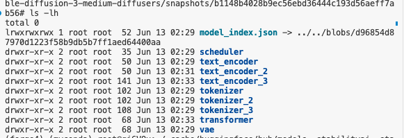    
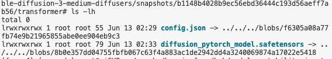

都是软连接    

repo = "stabilityai/stable-diffusion-3-medium-diffusers"
pipe = StableDiffusion3Pipeline.from_pretrained(repo, torch_dtype=torch.float16, token='').to(device)

功能有：监控时间和输入信息    
简单改写scheduler    

gradio

模型下载完后运行，tokenizer不匹配     
很多包要最新的      
手动装，最后request包还是不匹配     

huggingface token下载      

20g 1024*1024

直接使用 huggingface space的 gradio部署

Passing `scale` via `joint_attention_kwargs` when not using the PEFT backend is ineffective.

dpmpp 2m 直接配置还是黑图     
出不了正常图    
diffusers采样器不知道如何改

为什么iclight能使用？？？？

普通生图手指畸形

a green sign that says "Very Deep learning" and is at the edge of the Grand Canyon

A portrait photo of a kangaroo wearing an orange hoodie
and blue sunglasses standing on the grass in front of the Sydney
Opera House holding a sign on the chest that says "WUJIE"!

A portrait photo of a kangaroo wearing an orange hoodie and blue sunglasses standing on the grass in front of the Sydney Opera House holding a sign on the chest that says "陆"!

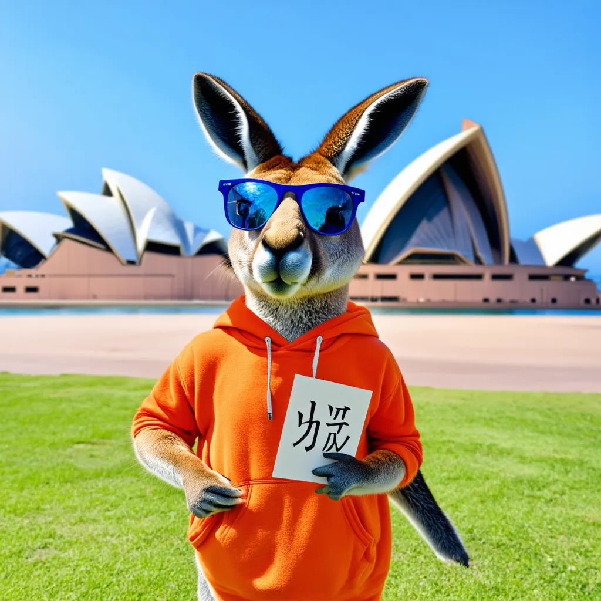

如果是comfyui也许会好一些    

## webui sd3分支测试

启动时候

a1111webui193/stable-diffusion-webui/modules/sd_disable_initialization.py", line 68, in CLIPTextModel_from_pretrained
res = self.CLIPTextModel_from_pretrained(None, *model_args, config=pretrained_model_name_or_path, state_dict={}, **kwargs)
File "/root/miniconda3/envs/webui310/lib/python3.10/site-packages/transformers/modeling_utils.py", line 3051, in from_pretrained
resolved_config_file = cached_file(
File "/root/miniconda3/envs/webui310/lib/python3.10/site-packages/transformers/utils/hub.py", line 422, in cached_file
raise EnvironmentError(
OSError: None is not a local folder and is not a valid model identifier listed on 'https://huggingface.co/models'
If this is a private repository, make sure to pass a token having permission to this repo either by logging in with huggingface-cli login or by passing token=<your_token>

Failed to create model quickly; will retry using slow method

这个不知道有没有影响     

加载模型时候

Creating model from config: /teams/ai_model_1667305326/WujieAITeam/private/lujunda/newlytest/a1111webui193/stable-diffusion-webui/configs/sd3-inference.yaml
mmdit initializing with: input_size=None, patch_size=2, in_channels=16, depth=24, mlp_ratio=4.0, learn_sigma=False, adm_in_channels=2048, context_embedder_config={'target': 'torch.nn.Linear', 'params': {'in_features': 4096, 'out_features': 1536}}, register_length=0, attn_mode='torch', rmsnorm=False, scale_mod_only=False, swiglu=False, out_channels=None, pos_embed_scaling_factor=None, pos_embed_offset=None, pos_embed_max_size=192, num_patches=36864, qk_norm=None, qkv_bias=True, dtype=torch.float16, device='cpu'
[2024-06-17 06:46:03,468][DEBUG][filelock] - Attempting to acquire lock 140004667105552 on /root/.cache/huggingface/hub/.locks/models--google--t5-v1_1-xxl/b114c318caf72f6e89ea92e0755c41327a453198.lock
[2024-06-17 06:46:03,469][DEBUG][filelock] - Lock 140004667105552 acquired on /root/.cache/huggingface/hub/.locks/models--google--t5-v1_1-xxl/b114c318caf72f6e89ea92e0755c41327a453198.lock
tokenizer_config.json: 100%|█| 1.86k/1.86k [00:00<00:00, 6.9
[2024-06-17 06:46:03,763][DEBUG][filelock] - Attempting to release lock 140004667105552 on /root/.cache/huggingface/hub/.locks/models--google--t5-v1_1-xxl/b114c318caf72f6e89ea92e0755c41327a453198.lock
[2024-06-17 06:46:03,763][DEBUG][filelock] - Lock 140004667105552 released on /root/.cache/huggingface/hub/.locks/models--google--t5-v1_1-xxl/b114c318caf72f6e89ea92e0755c41327a453198.lock
[2024-06-17 06:46:04,056][DEBUG][filelock] - Attempting to acquire lock 140004667097536 on /root/.cache/huggingface/hub/.locks/models--google--t5-v1_1-xxl/4e28ff6ebdf584f5372d9de68867399142435d9a.lock
[2024-06-17 06:46:04,056][DEBUG][filelock] - Lock 140004667097536 acquired on /root/.cache/huggingface/hub/.locks/models--google--t5-v1_1-xxl/4e28ff6ebdf584f5372d9de68867399142435d9a.lock
spiece.model: 100%|███████| 792k/792k [00:01<00:00, 700kB/s]
[2024-06-17 06:46:05,478][DEBUG][filelock] - Attempting to release lock 140004667097536 on /root/.cache/huggingface/hub/.locks/models--google--t5-v1_1-xxl/4e28ff6ebdf584f5372d9de68867399142435d9a.lock
[2024-06-17 06:46:05,478][DEBUG][filelock] - Lock 140004667097536 released on /root/.cache/huggingface/hub/.locks/models--google--t5-v1_1-xxl/4e28ff6ebdf584f5372d9de68867399142435d9a.lock
[2024-06-17 06:46:06,385][DEBUG][filelock] - Attempting to acquire lock 140004667108096 on /root/.cache/huggingface/hub/.locks/models--google--t5-v1_1-xxl/881bdbffc06e471924ecea57f962bc5f8e2a9f21.lock
[2024-06-17 06:46:06,385][DEBUG][filelock] - Lock 140004667108096 acquired on /root/.cache/huggingface/hub/.locks/models--google--t5-v1_1-xxl/881bdbffc06e471924ecea57f962bc5f8e2a9f21.lock
special_tokens_map.json: 100%|█| 1.79k/1.79k [00:00<00:00, 7
[2024-06-17 06:46:06,667][DEBUG][filelock] - Attempting to release lock 140004667108096 on /root/.cache/huggingface/hub/.locks/models--google--t5-v1_1-xxl/881bdbffc06e471924ecea57f962bc5f8e2a9f21.lock
[2024-06-17 06:46:06,668][DEBUG][filelock] - Lock 140004667108096 released on /root/.cache/huggingface/hub/.locks/models--google--t5-v1_1-xxl/881bdbffc06e471924ecea57f962bc5f8e2a9f21.lock
[2024-06-17 06:46:06,945][DEBUG][filelock] - Attempting to acquire lock 140004667103248 on /root/.cache/huggingface/hub/.locks/models--google--t5-v1_1-xxl/5a439fe1a8c4a05c6b1e4bf6a11821b497bf0136.lock
[2024-06-17 06:46:06,946][DEBUG][filelock] - Lock 140004667103248 acquired on /root/.cache/huggingface/hub/.locks/models--google--t5-v1_1-xxl/5a439fe1a8c4a05c6b1e4bf6a11821b497bf0136.lock
config.json: 100%|█████████| 593/593 [00:00<00:00, 2.38MB/s]
[2024-06-17 06:46:07,233][DEBUG][filelock] - Attempting to release lock 140004667103248 on /root/.cache/huggingface/hub/.locks/models--google--t5-v1_1-xxl/5a439fe1a8c4a05c6b1e4bf6a11821b497bf0136.lock
[2024-06-17 06:46:07,233][DEBUG][filelock] - Lock 140004667103248 released on /root/.cache/huggingface/hub/.locks/models--google--t5-v1_1-xxl/5a439fe1a8c4a05c6b1e4bf6a11821b497bf0136.lock
Downloading: "https://huggingface.co/AUTOMATIC/stable-diffusion-3-medium-text-encoders/resolve/main/clip_g.safetensors" to /teams/ai_model_1667305326/WujieAITeam/private/lujunda/newlytest/a1111webui193/stable-diffusion-webui/models/CLIP/clip_g.safetensors

100%|██████████████████| 1.29G/1.29G [00:59<00:00, 23.4MB/s]
Downloading: "https://huggingface.co/AUTOMATIC/stable-diffusion-3-medium-text-encoders/resolve/main/clip_l.safetensors" to /teams/ai_model_1667305326/WujieAITeam/private/lujunda/newlytest/a1111webui193/stable-diffusion-webui/models/CLIP/clip_l.safetensors

100%|████████████████████| 235M/235M [00:12<00:00, 20.3MB/s

好像没有下载 t5 xxl     

Downloading VAEApprox model to: /teams/ai_model_1667305326/WujieAITeam/private/lujunda/newlytest/a1111webui193/stable-diffusion-webui/models/VAE-approx/vaeapprox-sd3.pt
100%|████████| 228k/228k [00:00<00:00, 1.21MB/s]
*** Error running process_before_every_sampling: /teams/ai_model_1667305326/WujieAITeam/private/lujunda/newlytest/a1111webui193/stable-diffusion-webui/extensions/sd-webui-ic-light/scripts/ic_light_script.py
    Traceback (most recent call last):
      File "/teams/ai_model_1667305326/WujieAITeam/private/lujunda/newlytest/a1111webui193/stable-diffusion-webui/modules/scripts.py", line 840, in process_before_every_sampling
        script.process_before_every_sampling(p, *script_args, **kwargs)
      File "/teams/ai_model_1667305326/WujieAITeam/private/lujunda/newlytest/a1111webui193/stable-diffusion-webui/extensions/sd-webui-ic-light/scripts/ic_light_script.py", line 387, in process_before_every_sampling
        assert self.backend_type == BackendType.Forge
    AssertionError

### 输入prompt计数报错
Traceback (most recent call last):
File "/root/miniconda3/envs/webui310/lib/python3.10/site-packages/gradio/routes.py", line 488, in run_predict
output = await app.get_blocks().process_api(
File "/root/miniconda3/envs/webui310/lib/python3.10/site-packages/gradio/blocks.py", line 1431, in process_api
result = await self.call_function(
File "/root/miniconda3/envs/webui310/lib/python3.10/site-packages/gradio/blocks.py", line 1103, in call_function
prediction = await anyio.to_thread.run_sync(
File "/root/miniconda3/envs/webui310/lib/python3.10/site-packages/anyio/to_thread.py", line 33, in run_sync
return await get_asynclib().run_sync_in_worker_thread(
File "/root/miniconda3/envs/webui310/lib/python3.10/site-packages/anyio/_backends/_asyncio.py", line 877, in run_sync_in_worker_thread
return await future
File "/root/miniconda3/envs/webui310/lib/python3.10/site-packages/anyio/_backends/_asyncio.py", line 807, in run
result = context.run(func, *args)
File "/root/miniconda3/envs/webui310/lib/python3.10/site-packages/gradio/utils.py", line 707, in wrapper
response = f(*args, **kwargs)
File "/teams/ai_model_1667305326/WujieAITeam/private/lujunda/newlytest/a1111webui193/stable-diffusion-webui/modules/call_queue.py", line 14, in f
res = func(*args, **kwargs)
File "/teams/ai_model_1667305326/WujieAITeam/private/lujunda/newlytest/a1111webui193/stable-diffusion-webui/modules/ui.py", line 185, in update_token_counter
token_count, max_length = max([model_hijack.get_prompt_lengths(prompt) for prompt in prompts], key=lambda args: args[0])
File "/teams/ai_model_1667305326/WujieAITeam/private/lujunda/newlytest/a1111webui193/stable-diffusion-webui/modules/ui.py", line 185, in
token_count, max_length = max([model_hijack.get_prompt_lengths(prompt) for prompt in prompts], key=lambda args: args[0])
File "/teams/ai_model_1667305326/WujieAITeam/private/lujunda/newlytest/a1111webui193/stable-diffusion-webui/modules/sd_hijack.py", line 328, in get_prompt_lengths
_, token_count = self.clip.process_texts([text])
File "/root/miniconda3/envs/webui310/lib/python3.10/site-packages/torch/nn/modules/module.py", line 1695, in getattr
raise AttributeError(f"'{type(self).name}' object has no attribute '{name}'")
AttributeError: 'SD3Cond' object has no attribute 'process_texts'

### ddim报错
 modules.devices.NansException: A tensor with NaNs was produced in Unet. This could be either because there's not enough precision to represent the picture, or because your video card does not support half type. Try setting the "Upcast cross attention layer to float32" option in Settings > Stable Diffusion or using the --no-half commandline argument to fix this. Use --disable-nan-check commandline argument to disable this check.

ays也有这个错

目前只能用eular

DPM++ 2M, Schedule type: Karras,

Sampler: Euler a, Schedule type: Automatic

这些都无法使用

DPM++ 2M sde更差

Do not use the ancestral sampler. You can use Euler, not Euler ancestral.

### a1111实现

change CLIP links to allow anonymous downloading

modules/models/sd3/sd3_model.py

    CLIPG_URL = "https://huggingface.co/stabilityai/stable-diffusion-3-medium/resolve/main/text_encoders/clip_g.safetensors"
    CLIPG_URL = "https://huggingface.co/AUTOMATIC/stable-diffusion-3-medium-text-encoders/resolve/main/clip_g.safetensors"
    CLIPG_CONFIG = {
        "hidden_act": "gelu",
        "hidden_size": 1280,
    @@ -20,7 +20,7 @@
        "num_hidden_layers": 32,
    }

    CLIPL_URL = "https://huggingface.co/stabilityai/stable-diffusion-3-medium/resolve/main/text_encoders/clip_l.safetensors"
    CLIPL_URL = "https://huggingface.co/AUTOMATIC/stable-diffusion-3-medium-text-encoders/resolve/main/clip_l.safetensors"
    CLIPL_CONFIG = {
        "hidden_act": "quick_gelu",
        "hidden_size": 768,
    @@ -29,7 +29,7 @@
        "num_hidden_layers": 12,
    }

    T5_URL = "https://huggingface.co/stabilityai/stable-diffusion-3-medium/resolve/main/text_encoders/t5xxl_fp16.safetensors"
    T5_URL = "https://huggingface.co/AUTOMATIC/stable-diffusion-3-medium-text-encoders/resolve/main/t5xxl_fp16.safetensors"
    T5_CONFIG = {
        "d_ff": 10240,
        "d_model": 4096,
        "num_heads": 64,
        "num_layers": 24,
        "vocab_size": 32128,
    }

    class SD3Cond(torch.nn.Module):
        def __init__(self, *args, **kwargs):
            super().__init__(*args, **kwargs)
            self.tokenizer = SD3Tokenizer()
            with torch.no_grad():
                self.clip_g = SDXLClipG(CLIPG_CONFIG, device="cpu", dtype=devices.dtype)
                self.clip_l = SDClipModel(layer="hidden", layer_idx=-2, device="cpu", dtype=devices.dtype, layer_norm_hidden_state=False, return_projected_pooled=False, textmodel_json_config=CLIPL_CONFIG)
                self.t5xxl = T5XXLModel(T5_CONFIG, device="cpu", dtype=devices.dtype)
            self.weights_loaded = False

主要是因为这些cond都加载进了cpu    

    def forward(self, prompts: list[str]):
        res = []
        for prompt in prompts:
            tokens = self.tokenizer.tokenize_with_weights(prompt)
            l_out, l_pooled = self.clip_l.encode_token_weights(tokens["l"])
            g_out, g_pooled = self.clip_g.encode_token_weights(tokens["g"])
            t5_out, t5_pooled = self.t5xxl.encode_token_weights(tokens["t5xxl"])
            lg_out = torch.cat([l_out, g_out], dim=-1)
            lg_out = torch.nn.functional.pad(lg_out, (0, 4096 - lg_out.shape[-1]))
            lgt_out = torch.cat([lg_out, t5_out], dim=-2)
            vector_out = torch.cat((l_pooled, g_pooled), dim=-1)
            res.append({
                'crossattn': lgt_out[0].to(devices.device),
                'vector': vector_out[0].to(devices.device),
            })
        return res

    def load_weights(self):
        if self.weights_loaded:
            return
        clip_path = os.path.join(shared.models_path, "CLIP")
        clip_g_file = modelloader.load_file_from_url(CLIPG_URL, model_dir=clip_path, file_name="clip_g.safetensors")
        with safetensors.safe_open(clip_g_file, framework="pt") as file:
            self.clip_g.transformer.load_state_dict(SafetensorsMapping(file))
        clip_l_file = modelloader.load_file_from_url(CLIPL_URL, model_dir=clip_path, file_name="clip_l.safetensors")
        with safetensors.safe_open(clip_l_file, framework="pt") as file:
            self.clip_l.transformer.load_state_dict(SafetensorsMapping(file), strict=False)
        t5_file = modelloader.load_file_from_url(T5_URL, model_dir=clip_path, file_name="t5xxl_fp16.safetensors")
        with safetensors.safe_open(t5_file, framework="pt") as file:
            self.t5xxl.transformer.load_state_dict(SafetensorsMapping(file), strict=False)
        self.weights_loaded = True

add an option (on by default) to disable T5

    T5_URL = "https://huggingface.co/AUTOMATIC/stable-diffusion-3-medium-text-encoders/resolve/main/t5xxl_fp8_e4m3fn.safetensors"
    T5_URL = "https://huggingface.co/AUTOMATIC/stable-diffusion-3-medium-text-encoders/resolve/main/t5xxl_fp16.safetensors"

    
    if shared.opts.sd3_enable_t5:
        self.t5xxl = T5XXLModel(T5_CONFIG, device="cpu", dtype=devices.dtype)
    else:
        self.t5xxl = None

    if self.t5xxl and shared.opts.sd3_enable_t5:
        t5_out, t5_pooled = self.t5xxl.encode_token_weights(tokens["t5xxl"])
    else:
        t5_out = torch.zeros(l_out.shape[0:2] + (4096,), dtype=l_out.dtype, device=l_out.device)

modules/shared_options.py

    options_templates.update(options_section(('sd3', "Stable Diffusion 3", "sd"), {
        "sd3_enable_t5": OptionInfo(False, "Enable T5").info("load T5 text encoder; increases VRAM use by a lot, potentially improving quality of generation; requires model reload to apply"),
    }))

### T5 option选择测试
好像并没有选      

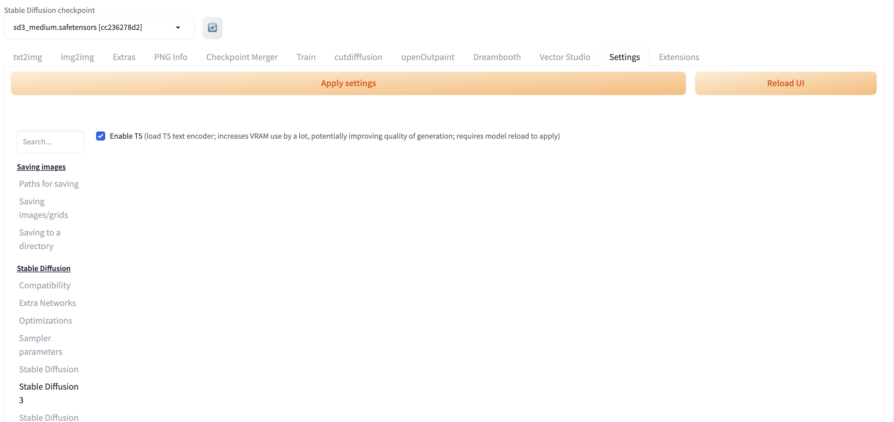

竟然是定义在这个位置的       

Downloading: "https://huggingface.co/AUTOMATIC/stable-diffusion-3-medium-text-encoders/resolve/main/t5xxl_fp16.safetensors" to /teams/ai_model_1667305326/WujieAITeam/private/lujunda/newlytest/a1111webui193/stable-diffusion-webui/models/CLIP/t5xxl_fp16.safetensors

100%|██████████| 9.12G/9.12G [05:19<00:00, 30.6MB/s]
Applying attention optimization: Doggettx... done.

开启

## sd3-ref

https://github.com/mcmonkey4eva/sd3-ref/

https://github.com/mcmonkey4eva/sd3-ref/blob/master/mmdit.py

这个属于比较原生的推理代码     
很多平台都有，今天617    
但是这个事3月前发布

SD3 的仅推理微型参考实现。

包含文本编码器（OpenAI CLIP-L/14、OpenCLIP bigG、Google T5-XXL）的代码（这些模型都是公开的）、VAE 解码器（类似于之前的 SD 模型，但有 16 通道且没有后量化转换步骤）和核心 MM-DiT（全新）。

推理 SD3 所需的一切（权重文件除外）。

注意：此 repo 是一个早期参考库，旨在协助合作伙伴组织实施 SD3。对于正常推理，请使用Comfy或基于它的 UI，例如Swarm。

文件指南    

    sd3_infer.py- 入口点，查看此内容以了解扩散模型和三重 tenc cat 的基本用法
    sd3_impls.py- 包含 MMDiT 和 VAE 的包装器
    other_impls.py- 包含 CLIP 模型、T5 模型和一些实用程序
    mmdit.py- 包含 MMDiT 本身的核心
    models包含以下文件的 文件夹（单独下载）：
    clip_g.safetensors（openclip bigG，与 SDXL 相同，可获取公开副本）
    clip_l.safetensors（OpenAI CLIP-L，与 SDXL 相同，可以获取公共副本）
    t5xxl.safetensors（谷歌 T5-v1.1-XXL，可以获取公开副本）
    sd3_medium.safetensors（或任何主 MMDiT 模型文件）

代码来源   
此处包含的代码源自：

    Stability AI 内部研究代码库（MM-DiT）
    公共稳定性 AI 存储库（例如 VAE）
    Alex Goodwin 为 Stability AI 编写的此参考 repo 的一些独特代码
    来自 SD3 的 ComfyUI 内部稳定性实现的一些代码（用于一些代码更正和处理程序）
    HuggingFace 和上游提供商（针对 CLIP/T5 代码部分）

竟然不是基于diffusers或其他k diffusion    
纯自己写    

但是实现过程参考了其他地方的

mmdit 但这样直接看没什么意义

    def forward_core_with_concat(self, x: torch.Tensor, c_mod: torch.Tensor, context: Optional[torch.Tensor] = None) -> torch.Tensor:
        if self.register_length > 0:
            context = torch.cat((repeat(self.register, "1 ... -> b ...", b=x.shape[0]), context if context is not None else torch.Tensor([]).type_as(x)), 1)

        # context is B, L', D
        # x is B, L, D
        for block in self.joint_blocks:
            context, x = block(context, x, c=c_mod)

        x = self.final_layer(x, c_mod)  # (N, T, patch_size ** 2 * out_channels)
        return x

    def forward(self, x: torch.Tensor, t: torch.Tensor, y: Optional[torch.Tensor] = None, context: Optional[torch.Tensor] = None) -> torch.Tensor:
        """
        Forward pass of DiT.
        x: (N, C, H, W) tensor of spatial inputs (images or latent representations of images)
        t: (N,) tensor of diffusion timesteps
        y: (N,) tensor of class labels
        """
        hw = x.shape[-2:]
        x = self.x_embedder(x) + self.cropped_pos_embed(hw)
        c = self.t_embedder(t, dtype=x.dtype)  # (N, D)
        if y is not None:
            y = self.y_embedder(y)  # (N, D)
            c = c + y  # (N, D)

        context = self.context_embedder(context)

        x = self.forward_core_with_concat(x, c, context)

        x = self.unpatchify(x, hw=hw)  # (N, out_channels, H, W)
        return x

### 作者 
我是FreneticLLC的首席执行官、 Stability.AI的机器学习工程师以及DenizenScript的项目负责人。

官方发布

我从小就通过游戏模组学习编程，从那以后我就再也没有停止过。现在我的经验相当丰富。

拥有十多年经验的软件开发人员，主要使用 C# 和 Java。

我开发过的一些编程相关工具    

    IDEs: Visual Studio (C#, C, C++), Code::Blocks (C, C++), VS Code (variety of langs), NP++, IntelliJ IDEA (Java), Eclipse (past Java), NetBeans (past Java)
    硬件接口：x86、x86_64、OpenGL、OpenAL、Nvidia CUDA、Win32
    数据语法：ini、toml、quake cfg、JSON、HTML、XML、YAML、FDS（我自己创建的，哈哈）
    数据库：SQL 服务器、SQLite、MongoDB、Redis、LiteDB，以及一些专有公司产品（otel、AWS S3、datadog、bigquery ......）
    通信：电子邮件（自动化、账户确认工具等）、IRC（机器人）、Discord（机器人）、GitHub（API）、xenforo（修改/扩展）、phpbb（修改/扩展）
    高级开发工具：Java 反编译器、Java 字节码查看器、ILSpy、HexEdit、YourKit
    操作系统：Windows（XP/7/8/8.1/10/11、Home 和 Pro）、Linux（Debian 服务器/桌面、Raspbian 桌面、Ubuntu 服务器/桌面（及衍生产品）、CentOS）
    CLI 工具：Windows Batch、Powershell、通过 Linux 终端的 Bash、通过 SSH 的 Bash、git（显然哈哈）、SQL/Mongo/python/等的实时 shell。
    我修改过的游戏：《帝国战争》（C、XML）、《绝地武士 2》（C、C++）[1]、《绝地学院》（C、C++）、《我的世界》（Java）[1]、《Garry's Mod》（Lua）、《武装突袭 3》（内部 Bohemia Script），以及各种我曾尝试修改但从未发布过太多内容的游戏

我的编程语言经验（以及适用的公共项目链接）：

    重大/长期经验：C# [1] [2] [3] [4] [5] [6]，Java [1] [2] [3]
    经验丰富：Web（HTML/CSS/JavaScript）[1] [2] [3] [4]、TypeScript [1]、Python [1] [2] [3]、GLSL [1]
    曾使用过以下编程语言：x86_64 Assembly、C [1]、C++、Rust [1]、Lua、Bash、Batch、Bohemia Script、.NET CIL [1]、Java 字节码
    涉猎过：SQL、PHP、Powershell、HLSL、各种领域特定语言
    我自己创建的：DenizenScript [1] [2]，FreneticScript [1]

我有经验的主题：

    Webdev（用于各种项目的多个站点和站点生成器）
    游戏开发（Voxalia）
    游戏引擎开发 (FreneticGameEngine)
    低级系统（构建汇编和 C-API 工具以及操作系统修改的实验）
    低级 CPU/GPU 代码优化
    算法优化
    脚本语言开发（DenizenScript/FreneticScript）
    微服务（我的仓库列表中全是微服务）
    AI/ML 技术（稳定扩散和 LLM 工具，包括推理和训练工作，以及为其开发 UI/UX 工具，包括在Stability.AI的专业工作）（“AI 艺术”不是一个东西，“AI 图像生成”是一种工具，人类可以用它来创作艺术，但那是以 AI 为工具的人类艺术）
    软件安全（曾参与过数据加密、账户隐私保护等项目）（我还深入研究与安全问题相关的新闻 - 新的漏洞、未来的威胁（如量子）、保护用户的新方法等）（还曾应项目作者的要求担任其他项目的红队成员）
    用户界面（UI/GUI）（但我不是平面设计师）
    用户体验 (UX)（我对好的用户体验有非常强烈的看法。软件工具应该最大限度地提高用户自由度，同时尽量减少混乱，我们可以比目前许多流行的软件项目做得更好）
    数据库（我最喜欢的是 Mongo 和 LiteDB，我可以处理 SQL，但我认为它有点过度了）
    高级异步编程和多线程（世界上大多数异步代码都是缺少访问锁的定时炸弹。我试图比大多数人更好地避免这种情况）
    数据处理和流式传输，包括低级（例如 tarfile、网络数据流等）和高级（数据库、数据管理接口等）

稍微离谱

游戏minecraft也有点离谱     
还做ai    

原来计算机 做游戏 都这么离谱

Frenetic LLC is hiring!

Positions:

C# Software Developer • Internship • Unpaid • College Credit • Remote

Open positions (up to 4 at a time) for college students in Software Development or Game Develop programs.
Gain work experience building real C# software in the exciting world of the Video Game industry.
Please note this position is compensated only in College Credits and details are subject to your individual college program.

疯狂的游戏引擎
一个强大的基于 C# 的 3D 和 2D 游戏引擎。

这是什么
FGE 是一个游戏引擎。它是游戏背后的强大引擎。它收集定义游戏的所有数据（游戏机制、艺术作品等），并将其转化为功能性的东西！它通过提供强大的渲染系统、游戏可能需要的无数便捷实用程序以及与高质量物理引擎的直接链接来实现这一点。

这不是什么
FGE 不是游戏。您无法开箱即玩。它没有太多功能，只是空转。要让 FGE 做任何事情，您（或任何开发人员）必须首先创建游戏内容。这意味着从艺术作品到游戏机制的所有内容都必须由您或游戏开发人员添加。

# MixDQ

## 论文信息

https://arxiv.org/abs/2405.17873

[Submitted on 28 May 2024 (v1), last revised 30 May 2024 (this version, v2)]

代码开源时间6月初

赵天辰是清华大学电子工程系NICS-EFC 实验室的博士生，指导老师是王宇教授。他还与宁雪飞博士密切合作。他分别于 2020 年和 2023 年在北京航空航天大学电子工程系获得学士和硕士学位。他的主要研究重点是高效深度学习和软硬件协同优化。

消息
[2024-03] 我们的论文FlashEval被CVPR24接受
[2023-12] 一篇合作论文于DATE24被接受
[2023-09] 在TechBeat上发表关于我们关于高效 3D 感知的工作的演讲。
[2023-09] 正式成为NICS-EFC实验室的一员，开始我的博士课程。
[2023-07] 我们的论文Ada3D被ICCV23接受，请查看项目页面。
[2023-05] 加入Infinigence担任研究实习生。

教育
电气工程博士，2023 年

清华大学

电气工程硕士，2020 年

北京航空航天大学

电气工程学士，2016 年

北京航空航天大学

https://cloud.infini-ai.com/platform/ai

高效、低成本的模型落地

无问芯穹

MixDQ: Memory-Efficient Few-Step Text-to-Image Diffusion Models with Metric-Decoupled Mixed Precision Quantization

我们设计了 MixDQ，这是一个混合精度量化框架，成功解决了具有挑战性的几步文本到图像扩散模型量化问题。在视觉质量下降和内容变化几乎可以忽略不计的情况下，MixDQ 可以实现 W4A8，同时内存压缩率相当于 3.4 倍，延迟加速率相当于 1.5 倍。

https://github.com/A-suozhang/MixDQ

MixDQ 是一种混合精度量化方法，可在保持生成质量的同时压缩文本到图像扩散模型的内存和计算使用量。它支持少步扩散模型（例如 SDXL-turbo、LCM-lora），以构建快速和微小扩散模型。提供高效的 CUDA 内核实现，以节省实际资源。

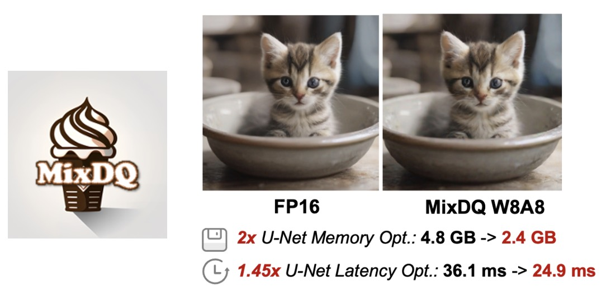

在几乎不影响视觉质量下降和内容变化的情况下，MixDQ 可以实现 W4A8，同时内存压缩率相当于3.4 倍，延迟加速率相当于 1.5 倍。

扩散模型已经实现了显著的视觉生成质量。然而，它们巨大的计算和内存成本给它们在资源受限的移动设备甚至桌面 GPU 上的应用带来了挑战。最近的几步扩散模型通过减少去噪步骤来缩短推理时间。然而，它们的内存消耗仍然过大。

训练后量化 (PTQ) 用低位整数值 (INT4/8) 代替高位宽 FP 表示，这是一种有效且高效的降低内存成本的技术。然而，当应用于少步扩散模型时，现有的量化方法在保持图像质量和文本对齐方面面临挑战。

为了解决这个问题，我们提出了一个混合精度量化框架 - MixDQ。首先，我们设计了专门的 BOS 感知量化方法，用于高度敏感的文本嵌入量化。然后，我们进行度量解耦灵敏度分析来测量每一层的灵敏度。最后，我们开发了一种基于整数规划的方法来进行位宽分配。

尽管现有的量化方法在 W8A8 上达不到要求，但 MixDQ 可以在不损失性能的情况下实现 W8A8，在几乎不影响视觉效果的情况下实现 W4A8。与 FP16 相比，我们将模型大小和内存成本降低了3-4 倍，并将延迟加速了1.45 倍。

我们通过实验发现，与多步扩散模型相比，少步扩散模型对量化更敏感，而现有的扩散量化方法面临挑战。Q-扩散 W8A8 量化模型在少步下面临严重的质量下降。此外，即使是多步模型，量化也会损害文本-图像对齐。

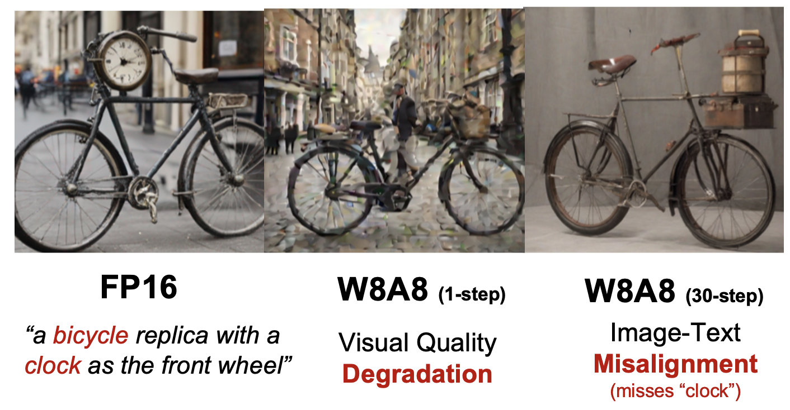

我们进行了初步实验，深入探讨了量化失败的原因，并发现了两个有启发性的发现：（1）量化被一些高度敏感的层“瓶颈化”。 （2）量化模型的不同部分分别影响生成的图像质量和内容。

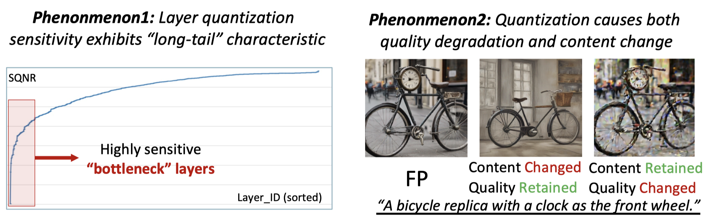

混合精度量化框架 MixDQ ：

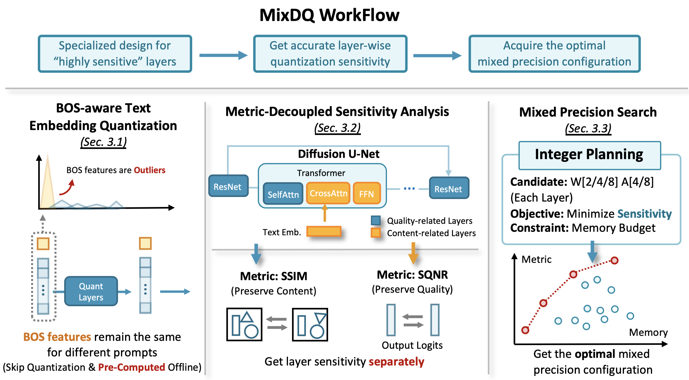

BOS 感知文本嵌入量化    
我们发现 CLIP 文本嵌入的第一个标记是阻碍量化的异常值。此外，我们注意到第一个标记是句首 (BOS) 标记，对于不同的提示，它保持不变。因此，我们可以离线预先计算它并跳过它的量化。

度量解耦灵敏度分析    
当仅保留导致最大量化误差FP16的层时，我们发现生成的图像仍然面临质量下降的问题，这表明现有的量化灵敏度分析的准确性需要提高。受量化对图像质量和文本对齐的影响的启发，我们设计了一种度量解耦灵敏度分析方法。我们将各层分为两组，分别对它们进行具有不同度量的灵敏度分析。

基于整数规划的位宽分配    
在获得量化灵敏度之后，我们将位宽分配问题转化为整数规划方法，并采用现成的求解器有效地求解。

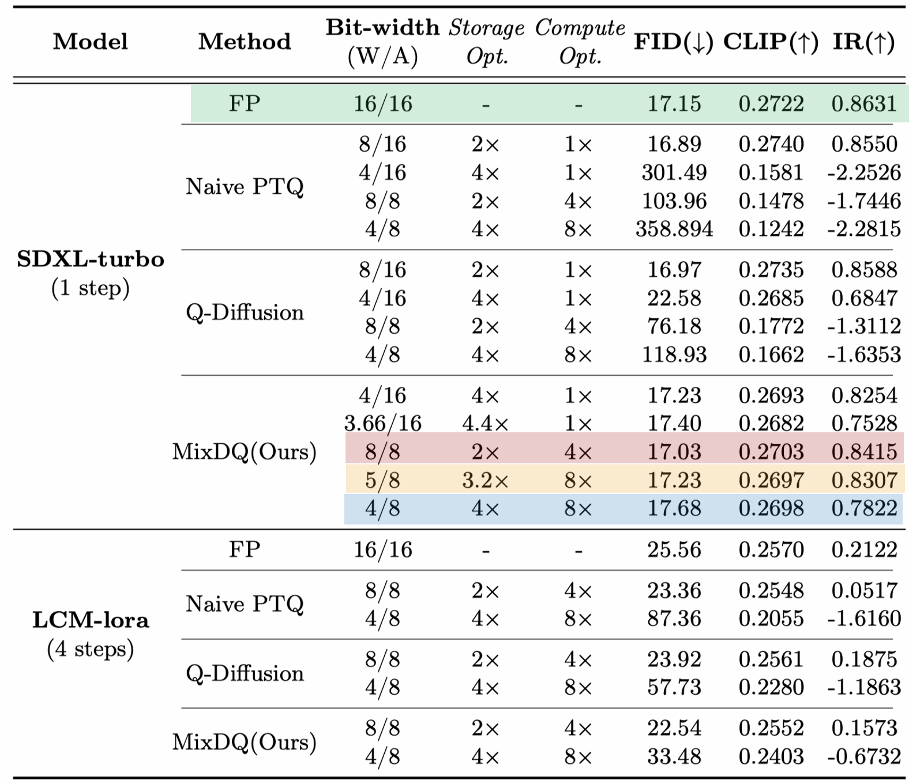

我们给出了一些定性结果，将统计度量值与生成的图像联系起来。可以看出，与 Q-Diffusion 和朴素 minmax 量化相比，MixDQ-W4A8 可以生成与 FP 图像几乎相同的图像，而其他方法无法为 W8A8 生成可读图像。

与其他现有扩散模型量化工具相比，只有闭式 TensorRT INT8 实现实现了实际的延迟加速。MixDQ 是第一个针对少步扩散模型实现实际内存和延迟优化的工具，可实现“微小而快速”的图像生成。

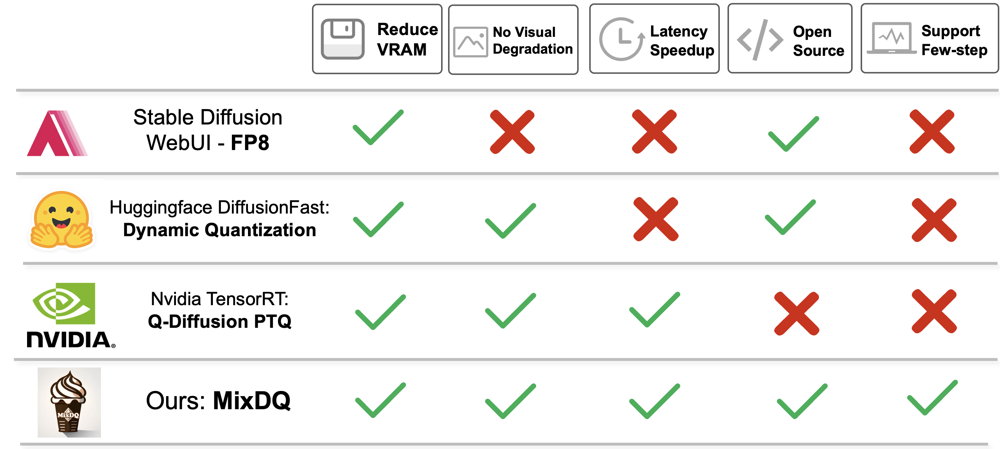

致谢    
我们的代码是基于Q-Diffusion和Diffusers Libraray开发的。

待办事项    
评估脚本（FID、ClipScore、ImageReward）   
高效的 INT8 GPU 内核实现  

普通 fp16 没有 

AttributeError: 'StableDiffusionXLPipeline' object has no attribute 'set_cuda_graph'

AttributeError: 'StableDiffusionXLPipeline' object has no attribute 'run_for_test'

## 原理

    def quantize_unet(
            self,
            w_bit=None,
            a_bit=None,
            bos=False,
            # cuda_graph_only=True,
            # run_pipeline=True,
            # compile=False,
        ):
        r"""
        This function helps quantize the UNet in the SDXL Pipeline
        Now we only support quantization with the setting W8A8

        Args:
            w_bit: (`str`):
                the bit width of weight
            a_bit: (`str`):
                the bit width of activation
            bos: (`bool`):
                if to use bos technique
            cuda_graph_only: (`bool`):
                if to use cuda_graph
            run_pipeline: (`bool`):
                run the full pipeline or just the unet
        """

path = hf_hub_download(
            repo_id="Stein-Fun/mixdq_test",
            filename="quant_para_wsym_fp16.pt",
            revision="version_0",
        )

## diffusers使用安装环境
    3  pip install mixdq-extension
    4  pip uninstall torchaudio
    5  pip install xformers==0.0.25 对标 torch 2.2.1

AttributeError: 'StableDiffusionXLPipeline' object has no attribute 'quantize_unet'

AttributeError: type object 'DiffusionPipeline' has no attribute 'from_single_file'

    class MixDQ_SDXLTurbo_Pipeline_W8A8(
        DiffusionPipeline,
        FromSingleFileMixin,
        StableDiffusionXLLoraLoaderMixin,
        TextualInversionLoaderMixin,
        IPAdapterMixin,
    ):
        r"""
        Pipeline for text-to-image generation using Stable Diffusion XL.

        This model inherits from [`DiffusionPipeline`]. Check the superclass documentation for the generic methods the
        library implements for all the pipelines (such as downloading or saving, running on a particular device, etc.)

        In addition the pipeline inherits the following loading methods:
            - *LoRA*: [`loaders.StableDiffusionXLLoraLoaderMixin.load_lora_weights`]
            - *Ckpt*: [`loaders.FromSingleFileMixin.from_single_file`]

先转diffusers使用DiffusionPipeline加载sdxl

    IndexError                                Traceback (most recent call last)
    Cell In[48], line 2
        1 # quant the UNet
    ----> 2 pipe.quantize_unet(
        3                 w_bit = 8, 
        4                 a_bit = 8, 
        5                 bos=True, 
        6                 )

    File ~/.cache/huggingface/modules/diffusers_modules/local/pipeline.py:2766, in MixDQ_SDXLTurbo_Pipeline_W8A8.quantize_unet(self, w_bit, a_bit, bos)
    2756 ckpt = torch.load(path, map_location='cpu')
    2758 register_qconfig_from_input_files(
    2759     self.unet,
    2760     # args,
    (...)
    2764     bos_dict=bos_dict
    2765 )
    -> 2766 convert_to_quantized(self.unet, ckpt)

    File ~/.cache/huggingface/modules/diffusers_modules/local/pipeline.py:1924, in convert_to_quantized(unet, ckpt)
    1922 def convert_to_quantized(unet, ckpt):
    1923     # from quantize import convert
    -> 1924     convert(unet,
    1925             mapping={nn.Linear: QuantizedLinear,
    ...
    --> 791         _split = _SPLIT[_NUM]
        792         _NUM = _NUM + 1
        793         # num = num + 1

    IndexError: list index out of range

32精度的问题     
还是sdxl不支持？？？       

IndexError: list index out of range

fp16不行

RuntimeError: Not all keys in weight yaml map to a module in UNet.

sd1.5不行

原代码使用

python scr
ipts/txt2img.py \ --config ./configs/stable-diffusion/$config_name \ --base_path $BASE_PATH --batch_size 2 --num_imgs 8  --prompt  "a vanilla and chocolate mixing icecream cone, ice background" \ --fp16

usage: txt2img.py [-h] [--prompt [PROMPT]]
                  [--base_path [BASE_PATH]]
                  [--batch_size BATCH_SIZE] [--cfg CFG]
                  [--config CONFIG]
                  [--image_folder IMAGE_FOLDER]
                  [--num_imgs NUM_IMGS] [--seed SEED]
                  [--fp16]
txt2img.py: error: unrecognized arguments:  --config ./configs/stable-diffusion/sdxl.yaml  --base_path ./logs/debug_fp  --fp16

python scripts/txt2img.py  --config ./configs/stable-diffusion/$config_name  --base_path $BASE_PATH --batch_size 2 --num_imgs 8  --prompt  "a vanilla and chocolate mixing icecream cone, ice background"  --fp16

可以了

python scripts/txt2img.py  --config ./configs/stable-diffusion/$config_name  --base_path $BASE_PATH --batch_size 1 --num_imgs 2  --prompt  "(8k, RAW photo,masterpiece
),(realistic, photo-realistic:1.37),ID photo,jk,teen
agers,woman,solo,looking at viewer,simple background
,brown eyes,necktie,upper body"  --fp16

公司自己模型     

python scripts/gen_calib_data.py --config ./configs/stable-diffusion/$config_name.yaml --save_image_path ./debug_imgs

FileNotFoundError: [Errno 2] No such file or directory: './scripts/utils/captions_val2014.json'

Traceback (most recent call last):
  newlytest/MixDQ/scripts/gen_calib_data.py", line 131, in <module>
    main()
  newlytest/MixDQ/scripts/gen_calib_data.py", line 51, in main
    prompt_list, image_path = prepare_coco_text_and_image(json_file=json_file)
  newlytest/MixDQ/quant_utils/qdiff/utils.py", line 587, in prepare_coco_text_and_image
    info = json.load(open(json_file, 'r'))
FileNotFoundError: [Errno 2] No such file or directory: './scripts/utils/captions_val2014.json'

优先级大于hidiffusion     

个人优先级？   
patcher实现的细致认知    
普通代码阅读    
中期   

阅读无关普通代码 好像已经没有必要      
确实没必要   
都是java k8s相关 

## 先验知识

https://pytorch.org/docs/stable/quantization.html

量化简介    
量化是指以比浮点精度更低的位宽执行计算和存储张量的技术。量化模型对张量执行部分或全部操作时精度会降低，而不是全精度（浮点）值。这允许更紧凑的模型表示和在许多硬件平台上使用高性能矢量化操作。与典型的 FP32 模型相比，PyTorch 支持 INT8 量化，可将模型大小减少 4 倍，并将内存带宽要求减少 4 倍。与 FP32 计算相比，硬件对 INT8 计算的支持通常快 2 到 4 倍。量化主要是一种加速推理的技术，量化运算符仅支持前向传递。

PyTorch 支持多种方法来量化深度学习模型。在大多数情况下，模型在 FP32 中训练，然后将模型转换为 INT8。此外，PyTorch 还支持量化感知训练，它使用假量化模块对前向和后向传递中的量化误差进行建模。请注意，整个计算都是以浮点进行的。在量化感知训练结束时，PyTorch 提供转换函数将训练后的模型转换为较低的精度。

在较低级别，PyTorch 提供了一种表示量化张量并使用它们执行操作的方法。它们可用于直接构建以较低精度执行全部或部分计算的模型。提供了更高级别的 API，其中包含将 FP32 模型转换为较低精度的典型工作流程，同时将精度损失降至最低。

感谢您对我们工作的关注！我们还没有尝试过 ONNXRuntime，但我们认为它是适用的。MixDQ 采用标准且易于部署的量化方案，我们已经使用pytorch_quantization部署工具测试了 MixDQ。

支持三种类型的量化：

动态量化（使用浮点读取/存储的激活量化的权重并进行计算量化）

静态量化（权重量化、激活量化、训练后需要校准）

静态量化感知训练（训练期间量化的权重、量化的激活、量化数值建模）

There are three types of quantization supported:

dynamic quantization (weights quantized with activations read/stored in floating point and quantized for compute)

static quantization (weights quantized, activations quantized, calibration required post training)

static quantization aware training (weights quantized, activations quantized, quantization numerics modeled during training)

训练后静态量化
训练后静态量化 (PTQ static) 量化模型的权重和激活。它会尽可能将激活融合到前面的层中。它需要使用代表性数据集进行校准，以确定激活的最佳量化参数。训练后静态量化通常用于内存带宽和计算节省都很重要的情况，CNN 就是一个典型用例。

在应用训练后静态量化之前，我们可能需要修改模型。请参阅Eager Mode 静态量化的模型准备。

静态量化的量化感知训练      
量化感知训练 (QAT) 可在训练期间模拟量化效果，与其他量化方法相比，可实现更高的准确度。我们可以对静态、动态或仅权重量化进行 QAT。在训练期间，所有计算均以浮点数完成，其中 fake_quant 模块通过限制和舍入来模拟量化效果，以模拟 INT8 的效果。在模型转换后，权重和激活会被量化，并且激活会尽可能融合到前一层。它通常与 CNN 一起使用，与静态量化相比，可实现更高的准确度。

在应用训练后静态量化之前，我们可能需要修改模型。请参阅Eager Mode 静态量化的模型准备。

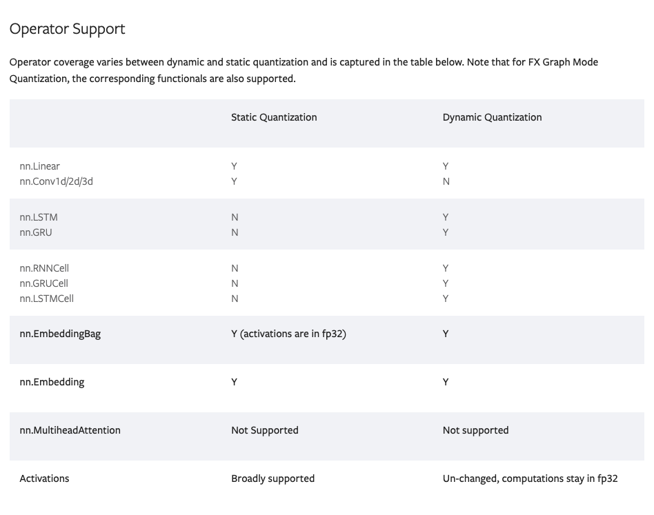

经常问的问题
如何在 GPU 上进行量化推理？：

我们尚未提供官方的 GPU 支持，但这是一个积极开发的领域，您可以 在此处找到更多信息

我可以在哪里获得对我的量化模型的 ONNX 支持？

如果在导出模型时出现错误（使用 下的 API torch.onnx），您可以在 PyTorch 存储库中打开一个问题。在问题标题前加上 ，[ONNX]并将问题标记为。module: onnx

如果您遇到 ONNX Runtime 的问题，请在GitHub - microsoft/onnxruntime上打开一个问题。

算法级量化模拟代码（在github中）支持混合精度（包括W4A8），系统级量化代码（在huggingface中，包括cuda内核）目前仅支持W8A8，我们仍在致力于混合精度CUDA内核的实现。

## 环境位置

四机

myconda

## 量化自有xl模型

严重问题是量化后好像不能gpu推理        

目前已有的w8a8 diffusers可以gpu推理     

再往下好像不行了     

With negligible visual quality degradation and content change, MixDQ could achieve W4A8, with equivalent 3.4x memory compression and 1.5x latency speedup.

 Open-Source Huggingface Pipeline 🤗: We implement efficient INT8 GPU kernel to achieve actual GPU acceleration (1.45x) and memory savings (2x) for W8A8

The quantization process consists of 3 steps: (1) generating the calibration data. (2) conduct PTQ process. (3) conduct quantized model inference. We also provide the scripts for each of the 3 processes

 (main_calib_data.sh,main_ptq.sh,main_quant_infer.sh)

1.1 Generate Calibration Data    
 generating the calibration data      
main_calib_data   

1.2 Post Training Quantization (PTQ) Process     
conduct PTQ process
main_ptq    

1.3 Inference Quantized Model   
conduct quantized model inference      
main_quant_infer    
1.3.1 Normal   
1.3.2 Mixed Precision     
The "act protect" represents layers that are preserved as FP16. (It's also worth noting that the mixed_precision_scripts/quant_inference_mp.py are used for mixed precision search, for infering the mixed precision quant model, use scripts/quant_txt2img.py)

Data Preparation    
The stable diffusion checkpoints are automatically downloaded with the diffusers pipeline, we also provide manual download scripts in ./scripts/utils/download_huggingface_model.py. For text-to-image generation on COCO annotations, we provide the captions_val2014.json with Google Drive, please put it in the ./scripts/utils.

3. Mixed Precision Search     
Please download the util_files from Google Drive, and unzip it in the repository root directory. Please refer to the ./mixed_precision_scripts/mixed_precision_search.md for detailed process of the mixed precision search process.

## 新开源 ViDiT-Q

6.24开源代码

https://github.com/A-suozhang/ViDiT-Q

https://arxiv.org/abs/2406.02540

[Submitted on 4 Jun 2024]

我们引入了 ViDiT-Q，一种专门用于扩散变压器的量化方法。对于用于视频和图像生成任务的流行大型模型（例如 open-sora、Latte、Pixart-α、Pixart-Σ），ViDiT-Q 可以实现 W8A8 量化而不会导致度量下降，并且可以实现 W4A8 量化而不会导致视觉质量明显下降。

Acknowledgments      
Our code was developed based on opensora v1.0(Apache License), PixArt-alpha(AGPL-3.0 license), PixArt-sigama(AGPL-3.0 license) and q-diffusion(MIT License)

# HelloWorld 7.0 更新 - 2024 年 6 月 13 日

HelloWorld 7.0是迭代优化的版本，拥有全系列最优的本体表现，概念范围与细节丰富度进一步增强。

更新详细信息：

通过添加负面训练图片、加强姿势训练、优化clip模型，模型肢体和手部准确率较之前版本有所提升，推荐的负面提示词为：“bad hand、bad anatomy、worst quality、ai generated images、low quality、average quality”。

从官方的 SPO 模型中提取了经过微调的 LoRA ，并将其纳入 HelloWorld 7.0。SPO 是对 DPO 方法的进一步改进。使用 SPO 基础模型比 DPO XL 基础模型和原始 SDXL 基础模型性能更好。SPO LoRA 可以增强图像细节和对比度并美化图像。感谢 SPO 背后的技术团队。

继续扩大训练集的概念范围，但对训练集进行了优化和精简（大训练集微调太贵，而且最近H800租起来也难，负担不起本地训练的时间）。目前总训练集为20821张图片。训练集分辨率分布如下，建议使用图片数量较多的几种分辨率进行输出：

    (832, 1248) - Count: 7128
    (896, 1152) - Count: 6250
    (1248, 832) - Count: 2402
    (1024, 1024) - Count: 1639
    (1360, 768) - Count: 928
    (1152, 896) - Count: 870
    (768, 1360) - Count: 432
    (960, 1088) - Count: 506
    (992, 1056) - Count: 162
    (1088, 960) - Count: 140
    (704, 1472) - Count: 120
    (1056, 992) - Count: 122
    (1472, 704) - Count: 115
    (1632, 640) - Count: 75
    (640, 1632) - Count: 12
使用 GPT4O 对所有数据集进行重新标注。本次采用了结构化的标注方法，具体结构为：“一句话概括描述+多个图元标签+灵感来自 XXX+美学品质描述词”，其中美学品质描述词分为五个等级：最差品质、低品质、一般品质、最好品质、杰作。典型的标注示例如下：

conceptual art featuring a human hand wrapped in red and beige ribbons, isolated against a plain, light background, realistic style, minimalist color scheme, smooth textures, elongated and surreal aesthetic, inspired by salvador dalí's surrealist works, masterpiece
Inspired by XXX for HelloWorld 7.0版本所涉及的“高频标注词表”和“高频艺术风格表”仅提供给商业授权用户，以往购买过Helloworld XL系列模型授权的伙伴，如有遗漏请联系我免费获取。

各位玩家可以参考HelloWorld 6.0高频标注词表，另外我在图库中也提供了150+张高质量的HelloWorld 7.0示例图，可以作为大家输出的参考。模型制作不易，感谢各位玩家的理解与包容！

LEOSAM HelloWorld 6.0 Top 250 High-Frequency Tagging Word List 

The main body of the HelloWorld 6.0 training set employs GPT4v tagging. For images that GPT4v cannot tag, cogVQA guided by blip2-opt-6.7b is used for tagging. The tagging language style of these multimodal models differs significantly from the traditional WD1.4 tagger. To facilitate more accurate triggering of different concepts in the training set, I have compiled the top 250 high-frequency tagging words from the HelloWorld 6.0 training set. 

**摄影技术和美学/Photography Techniques and Aesthetics:**

- 模拟胶片摄影美学 (film photography aesthetic)
- 时尚摄影 (Fashion photography, Fashion portrait)
- 人像摄影 (Portrait photography, portrait photography, Elegant portrait photography)
- 野生动物摄影 (wildlife photography)
- 私房摄影 (Intimate boudoir photography)
- 高分辨率 (high-resolution, high-resolution clarity, high-resolution image, high-resolution portrait)
- 极简主义风格 (minimalist aesthetic, minimalistic aesthetic, minimalistic style, minimalist style, minimalist design)
- 复古美学 (vintage aesthetic)

**构图和背景/Composition and Background:**

- 特写 (Close-up, Close-up portrait)
- 鸟瞰视角 (Aerial perspective, Aerial view)
- 对称构图 (symmetrical composition)
- 极简主义构图 (minimalist composition)
- 浅景深 (shallow depth of field)

**色彩:/Color:**

- 黑白 (Black and white portrait, Monochrome portrait)
- 暖色调 (warm color palette, Warm)
- 冷色调 (cool color palette)
- 柔和的色彩 (muted color palette, pastel color palette, neutral color palette, earthy tones)
- 鲜艳的色彩 (Vibrant color palette, vibrant colors, rich)

**人物特征/Characteristics:**

- 年龄范围:
    - 十几岁到20岁初 (late teens to early twenties, late teens or early twenties)
    - 20多岁 (early twenties, early to mid-20s, likely in her 20s, mid-20s, likely in her twenties)
- 女性角色 (young female character,female subject, young adult female, female model)
- 年轻亚洲女性 (young Asian woman, young Asian female, Asian woman, Asian female)
- 男性主体 (young Asian male, male subject)

**插图和数字艺术/Illustrations and Digital Art:**

- 动漫风格插图 (Anime-style illustration, Vibrant anime-style illustration)
- 数字插图 (Vibrant digital illustration, Digital illustration, Vibrant digital artwork)
- 手绘插图 (Hand-drawn illustration)
- 动漫风格 (anime style)
- 数字艺术 (digital art)
- 简洁的线条 (clean lines)

**其他/Others:**

- 优雅 (Elegant, elegance, timeless elegance, casual elegance, sophisticated)
- 梦幻 (ethereal, ethereal quality, ethereal ambiance, ethereal atmosphere, ethereal aesthetic)
- 宁静 (serene, serene ambiance, serene atmosphere, tranquil ambiance, tranquil atmosphere)

**发型/Hairstyle:**

- 长黑发 (long dark hair, long black hair)
- 短黑发 (short black hair)
- 长而飘逸的头发 (long flowing hair)

**服装/Clothing:**

- 白色衬衫 (white shirt, crisp white shirt)
- 休闲装扮 (casual attire, casual fashion, casual style)
- 白色运动鞋 (white sneakers)
- 及膝袜 (knee-high socks)
- 白色袜子 (white socks)
- 没有明显的配饰 (no visible accessories)

**表情/Expression:**

- 平静的表情 (serene expression, serene facial expression)
- 沉思的表情 (contemplative expression, thoughtful expression, pensive expression, contemplative mood)
- 专注的表情 (focused expression)
- 温和的表情 (gentle expression)
- 微笑 (slight smile, subtle smile, gentle smile, radiant smile)
- 严肃的表情 (solemn expression)
- 快乐的表情 (joyful expression, playful expression)
- 中性表情 (neutral expression)
- 内省的情绪 (introspective mood)

**姿势和态度/Posture and Attitude:**

- 直视 (direct gaze, intense gaze, piercing gaze, focused gaze, soft gaze, contemplative gaze, gentle gaze, introspective gaze)
- 闭眼 (eyes closed, closed eyes)
- 侧面 (side profile)
- 放松的姿势 (relaxed pose, relaxed posture, relaxed demeanor)
- 大方得体的姿态 (poised stance, poised demeanor, poised expression, confident stance)

**面部特征/Facial Features:**

- 细腻的面部特征 (delicate features, delicate facial features, clear complexion)
- 亚洲面孔特征 (Asian features)
- 白皙肌肤 (fair skin, fair complexion, pale skin, light skin, porcelain skin)
- 光滑的皮肤 (smooth skin, flawless skin, clear skin)
- 微妆 (subtle makeup, minimal makeup, natural makeup)
    - 强调自然美的微妆 (subtle makeup emphasizing natural beauty, subtle makeup highlighting natural beauty, subtle makeup enhancing natural beauty, subtle makeup highlighting natural features)
- 脸颊上淡淡的腮红 (subtle blush on cheeks)

## SPO-Diffusion-Models/SPO-SDXL_4k-p_10ep

步骤感知偏好优化：在每一步中将偏好与去噪性能相结合

Step-aware Preference Optimization: Aligning Preference with Denoising Performance at Each Step

最近，直接偏好优化 (DPO) 已将其成功从对齐大型语言模型 (LLM) 扩展到对齐文本到图像的扩散模型与人类偏好。与大多数现有的 DPO 方法假设所有扩散步骤与最终生成的图像共享一致的偏好顺序不同，我们认为这种假设忽略了特定于步骤的去噪性能，并且偏好标签应该根据每个步骤的贡献进行量身定制。

为了解决这一限制，我们提出了步进感知偏好优化 (SPO)，这是一种新颖的后训练方法，它使用步进感知偏好模型和步进重采样器来确保准确的步进感知监督，从而独立评估和调整每一步的去噪性能。具体来说，在每个去噪步骤中，我们都会从一组图像中抽样，找到合适的胜负对，最重要的是，从池中随机选择一张图像来初始化下一个去噪步骤。这个步进重采样过程可确保下一个胜负图像对来自同一图像，使胜负比较独立于上一步。为了评估每一步的偏好，我们训练了一个单独的步进感知偏好模型，该模型可应用于嘈杂图像和干净图像。

我们对 Stable Diffusion v1.5 和 SDXL 的实验表明，SPO 在将生成的图像与复杂、详细的提示对齐以及增强美感方面明显优于最新的 Diffusion-DPO，同时训练效率也提高了 20 倍以上。代码和模型：https://rockeycoss.github.io/spo.github.io/

该模型是从stable-diffusion-xl-base-1.0微调而来的。它已针对 4,000 个提示进行了 10 个时期的训练。

这是一个合并检查点，将 LoRA 检查点与基础模型stable-diffusion-xl-base-1.0相结合。如果您想访问 LoRA 检查点，请访问SPO-SDXL_4k-p_10ep_LoRA 。我们还提供了与stable-diffusion-webui兼容的 LoRA 检查点，可在此处访问。

# EasyAnimate

easyphoto出品    

可用于生成AI图片与视频、训练Diffusion Transformer的基线模型与Lora模型，我们支持从已经训练好的EasyAnimate模型直接进行预测，生成不同分辨率，6秒左右、fps24的视频（1 ~ 144帧, 未来会支持更长的视频），也支持用户训练自己的基线模型与Lora模型，进行一定的风格变换。

新特性：

更新到v2版本，最大支持144帧(768x768, 6s, 24fps)生成。[ 2024.05.26 ]

功能概览：

    数据预处理
    训练VAE
    训练DiT
    模型生成

pixart a 基础模型     
训练   

1. 引入运动模块（Motion Module），以实现从2D图像到3D视频的扩展   
2. 引入slice VAE压缩时间轴，有助于长视频生成。

# MV-VTON

PyTorch implementation of MV-VTON: Multi-View Virtual Try-On with Diffusion Models

https://github.com/hywang2002/MV-VTON

🔥The first multi-view virtual try-on dataset MVG is now available.
🔥Checkpoints on both frontal-view and multi-view virtual try-on tasks are released.

   [提交于 2024 年 4 月 26 日（v1），最后修订于 2024 年 4 月 29 日（此版本，v2）]     
MV-VTON：采用扩散模型的多视图虚拟试穿   
王浩宇、张志禄、邸东林、张世良、左王猛    
基于图像的虚拟试穿的目标是生成目标人物自然穿着给定服装的图像。然而，大多数现有方法仅关注使用正面服装的正面试穿。当服装和人物的视图明显不一致时，特别是当人物的视图不是正面时，结果并不令人满意。为了应对这一挑战，我们引入了多视图虚拟试穿 (MV-VTON)，旨在使用给定的服装从多个视图重建人物的穿衣结果。一方面，由于单视图服装为 MV-VTON 提供的信息不足，我们改为使用两幅图像，即服装的正面和背面视图，以尽可能地涵盖完整的视图。另一方面，采用表现出卓越能力的扩散模型来执行我们的 MV-VTON。特别是，我们提出了一种视图自适应选择方法，其中硬选择和软选择分别应用于全局和局部服装特征提取。这确保服装特征大致符合人的视角。随后，我们建议使用联合注意力模块来对齐和融合服装特征与人物特征。此外，我们收集了一个 MV-VTON 数据集，即多视图服装 (MVG)，其中每个人都有多张具有不同视角和姿势的照片。实验表明，所提出的方法不仅在使用我们的 MVG 数据集的 MV-VTON 任务上取得了最佳结果，而且在使用 VITON-HD 和 DressCode 数据集的正面虚拟试穿任务上也具有优势。代码和数据集将在此 https URL上公开发布。

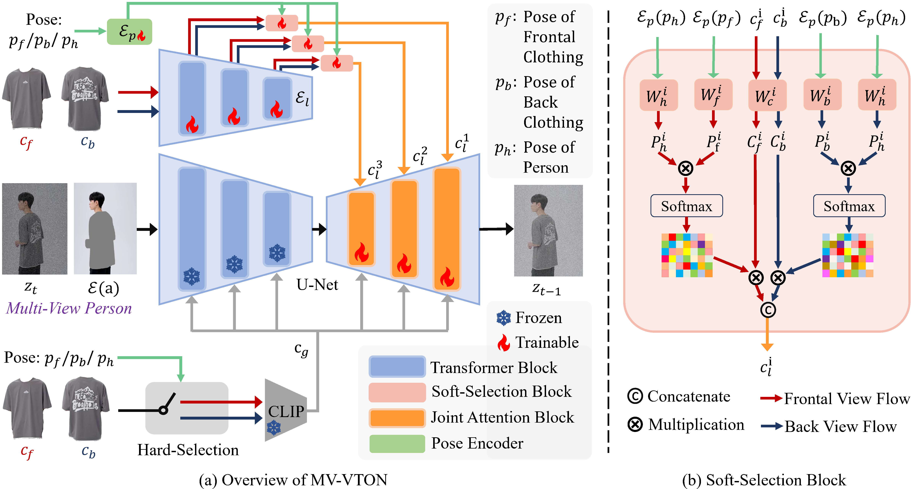

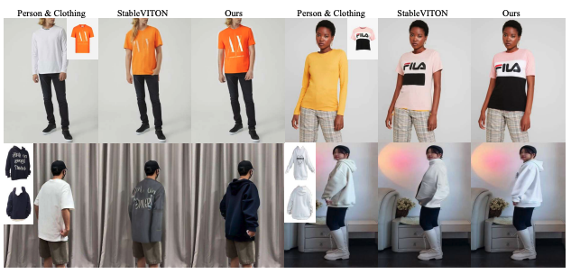

哈尔滨工业大学

估计是准备上研一 大四刚毕业 直接保    

Acknowledgements   
Our code is heavily borrowed from Paint-by-Example and DCI-VTON. We also thank previous work PF-AFN, GP-VTON, LaDI-VTON and StableVITON.

实习

理想汽车是中国新能源汽车市场的领导者。本公司设计、研发、制造和销售豪华智能电动车。理想汽车的使命是创造移动的家，创造幸福的家。通过产品、技术和业务模式的创新，本公司为家庭用户提供安全、便捷、舒适的产品与服务。在中国，理想汽车是成功将增程式电动车商业化的先驱。理想汽车于2019年11月开始量产。

可以准备去淘宝京东了    

# LCM-LoRA

潜在一致性模型 (LCM) 通常只需 2-4 个步骤即可生成高质量的图像，从而可以在几乎实时的设置中使用扩散模型。

只需 4,000 个训练步骤（约 32 个 A100 GPU 小时）即可从任何预先训练的稳定扩散 (SD) 中提取 LCM，从而以 2~4 个步骤甚至一个步骤生成高质量的 768 x 768 分辨率图像，显著加快文本到图像的生成速度。我们使用 LCM 仅用 4,000 次训练迭代就提取了 Dreamshaper-V7 版本的 SD。

但是，每个模型都需要单独进行蒸馏才能进行潜在一致性蒸馏。LCM-LoRA 的核心思想是只训练几个适配器层，在本例中适配器就是 LoRA。这样，我们就不必训练整个模型，并且可以控制可训练参数的数量。然后可以将生成的 LoRA 应用于模型的任何微调版本，而无需单独蒸馏它们。此外，LoRA 可以应用于图像到图像、ControlNet/T2I-Adapter、修复、AnimateDiff 等。LCM-LoRA 还可以与其他 LoRA 结合使用，以极少的步骤（4-8）生成风格化图像。

LCM-LoRA 适用于stable-diffusion-v1-5、stable-diffusion-xl-base-1.0和SSD-1B模型。所有检查点都可以在此集合中找到。

    加载特定任务的管道和模型。
    将调度程序设置为LCMScheduler。
    为模型加载 LCM-LoRA 权重。
    减少guidance_scale间隔[1.0, 2.0]并将num_inference_steps间隔设置为[4, 8]。
    使用常用参数通过管道执行推理。

首先，确保您已安装peft，以获得更好的 LoRA 支持。

已复制
pip 安装-U peft

您可能已经注意到我们设置了guidance_scale=1.0，这将禁用无分类器指导。这是因为 LCM-LoRA 是在指导下训练的，因此在这种情况下批处理大小不必加倍。这可以缩短推理时间，但缺点是负面提示对去噪过程没有任何影响。

您也可以使用 LCM-LoRA 进行指导，但由于训练的性质，模型对值非常敏感guidance_scale，高值可能会导致生成的图像中出现伪影。在我们的实验中，我们发现最佳值在 [1.0, 2.0] 范围内。

This is because the LCM-LoRA is trained with guidance, so the batch size does not have to be doubled in this case. 

与风格化的 LoRA 相结合     
LCM-LoRA 可以与其他 LoRA 结合使用，只需几个步骤（4-8）即可生成样式图像。在下面的示例中，我们将使用 LCM-LoRA 和剪纸 LoRA

lora更像是一种过拟合的下游任务训练     
包括加速lora     
其本质就是下次输入的提示词很少就有原来的风格     
包括微调模型，现在基本上将先验设置成了美丽和好看

动画差异   
AnimateDiff允许您使用稳定扩散模型为图像制作动画。为了获得良好的结果，我们需要生成多个帧（16-24），而使用标准 SD 模型执行此操作可能会非常慢。LCM-LoRA 可用于显著加快该过程，因为您只需为每个帧执行 4-8 个步骤。让我们看看如何使用 LCM-LoRA 和 AnimateDiff 执行动画。

    import torch
    from diffusers import MotionAdapter, AnimateDiffPipeline, DDIMScheduler, LCMScheduler
    from diffusers.utils import export_to_gif

    adapter = MotionAdapter.from_pretrained("diffusers/animatediff-motion-adapter-v1-5")
    pipe = AnimateDiffPipeline.from_pretrained(
        "frankjoshua/toonyou_beta6",
        motion_adapter=adapter,
    ).to("cuda")

    # set scheduler
    pipe.scheduler = LCMScheduler.from_config(pipe.scheduler.config)

    # load LCM-LoRA
    pipe.load_lora_weights("latent-consistency/lcm-lora-sdv1-5", adapter_name="lcm")
    pipe.load_lora_weights("guoyww/animatediff-motion-lora-zoom-in", weight_name="diffusion_pytorch_model.safetensors", adapter_name="motion-lora")

    pipe.set_adapters(["lcm", "motion-lora"], adapter_weights=[0.55, 1.2])

    prompt = "best quality, masterpiece, 1girl, looking at viewer, blurry background, upper body, contemporary, dress"
    generator = torch.manual_seed(0)
    frames = pipe(
        prompt=prompt,
        num_inference_steps=5,
        guidance_scale=1.25,
        cross_attention_kwargs={"scale": 1},
        num_frames=24,
        generator=generator
    ).frames[0]
    export_to_gif(frames, "animation.gif")

## 原理
抽象的     
潜在扩散模型 (LDM) 在合成高分辨率图像方面取得了显著成果。然而，迭代采样过程计算量巨大，导致生成速度缓慢。受一致性模型 (song 等人) 的启发，我们提出了潜在一致性模型 (LCM)，能够在任何预先训练的 LDM（包括稳定扩散 (rombach 等人)）上以最少的步骤进行快速推理。将引导的逆扩散过程视为求解增强概率流 ODE (PF-ODE)，LCM 旨在直接预测此类 ODE 在潜在空间中的解，从而无需多次迭代并允许快速、高保真采样。从预先训练的无分类器引导扩散模型中有效提炼而来，高质量的 768 x 768 2~4 步 LCM 仅需 32 个 A100 GPU 小时进行训练。此外，我们引入了潜在一致性微调 (LCF)，这是一种新方法，专门用于在定制图像数据集上微调 LCM。在 LAION-5B-Aesthetics 数据集上的评估表明，LCM 仅需几步推理即可实现最先进的文本到图像生成性能。项目页面：https://latent-consistency-models.github.io/

## 使用效果
正如预期的那样，仅使用1步即可生成近似形状，没有可辨别的特征，也缺乏纹理。但是，结果会迅速改善，通常只需 4 到 6 步即可获得令人满意的结果。就我个人而言，我发现上一个测试中的 8 步图像有点太饱和和“卡通化”，不符合我的口味，因此我可能会在此示例中选择 5 步和 6 步的图像。生成速度非常快，您只需 4 步就可以创建大量不同的变体，然后选择您喜欢的变体，并根据需要使用更多步骤和细化提示进行迭代。

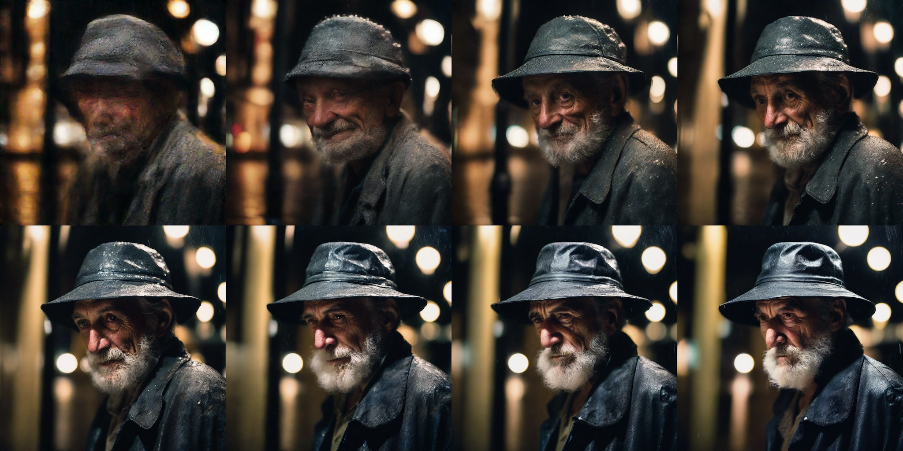

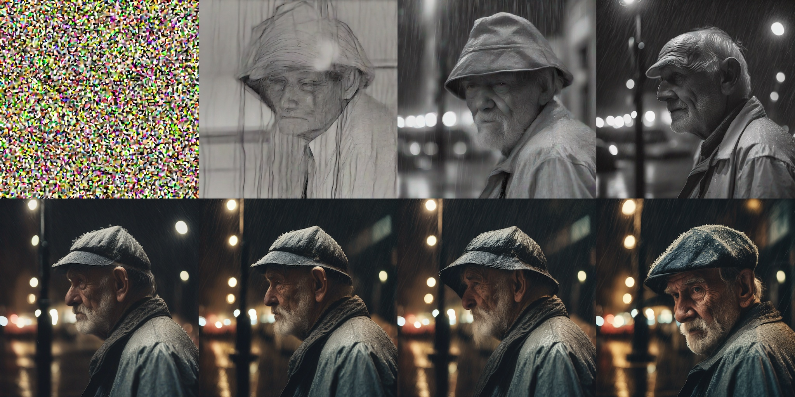

SDXL 管道结果（相同的提示和随机种子），使用 1、4、8、15、20、25、30 和 50 个步骤。

## peft

PEFT: Parameter-Efficient Fine-Tuning of Billion-Scale Models on Low-Resource Hardware

PEFT：在低资源硬件上对十亿级模型进行参数高效微调

基于 Transformer 架构的大型语言模型 (LLM)，如 GPT、T5 和 BERT，已在各种自然语言处理 (NLP) 任务中取得了最佳成果。它们还开始涉足其他领域，例如计算机视觉 (CV)（VIT、Stable Diffusion、LayoutLM）和音频（Whisper、XLS-R）。传统范式是在通用网络规模数据上进行大规模预训练，然后对下游任务进行微调。与开箱即用的预训练 LLM（例如零样本推理）相比，在下游数据集上对这些预训练的 LLM 进行微调可带来巨大的性能提升。

PEFT 方法仅微调少量（额外）模型参数，同时冻结预训练 LLM 的大多数参数，从而大大降低了计算和存储成本。这也克服了灾难性遗忘问题，这是在 LLM 完全微调期间观察到的行为。PEFT 方法还显示出比低数据范围内的微调更好，并且更好地推广到域外场景。它可以应用于各种模态，例如图像分类和稳定扩散 dreambooth。

    LoRA：LORA：大型语言模型的低秩自适应
    前缀调优：P-Tuning v2：即时调优可与跨尺度和任务的普遍微调相媲美
    快速调优：参数高效快速调优的规模化力量
    P-Tuning：GPT 也能理解

    LoRA: LORA: LOW-RANK ADAPTATION OF LARGE LANGUAGE MODELS
    Prefix Tuning: P-Tuning v2: Prompt Tuning Can Be Comparable to Fine-tuning Universally Across Scales and Tasks
    Prompt Tuning: The Power of Scale for Parameter-Efficient Prompt Tuning
    P-Tuning: GPT Understands, Too

# sd3 canny
6.16

# 结尾