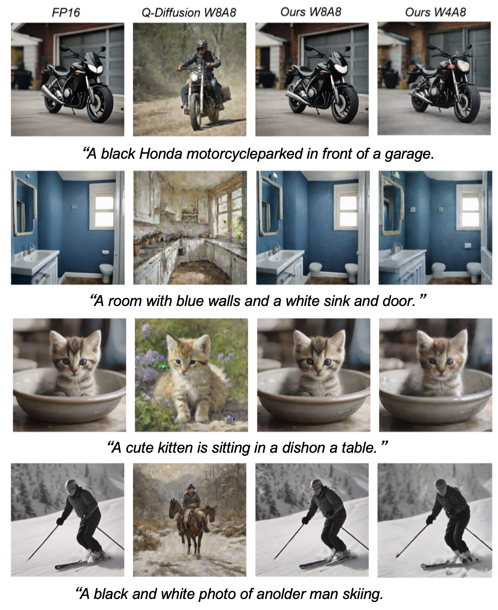

# sd3部署
部署位置    
teams     
/newlytest/stable-diffusion-3-medium/app.py

diffusers from_pretrained     
默认 cache_dir none     
PosixPath('/root/.cache/huggingface/hub/models--stabilityai--stable-diffusion-3-medium-diffusers/snapshots/b1148b4028b9ec56ebd36444c193d56aeff7ab56')

    

都是软连接    

功能有：监控时间和输入信息    
简单改写scheduler    

gradio

模型下载完后运行，tokenizer不匹配     
很多包要最新的      
手动装，最后request包还是不匹配     

huggingface token下载      

20g 1024*1024

直接使用 huggingface space的 gradio部署

Passing `scale` via `joint_attention_kwargs` when not using the PEFT backend is ineffective.

dpmpp 2m 直接配置还是黑图     
出不了正常图    
diffusers采样器不知道如何改

为什么iclight能使用？？？？

普通生图手指畸形

a green sign that says "Very Deep learning" and is at the edge of the Grand Canyon

A portrait photo of a kangaroo wearing an orange hoodie
and blue sunglasses standing on the grass in front of the Sydney
Opera House holding a sign on the chest that says "WUJIE"!

A portrait photo of a kangaroo wearing an orange hoodie and blue sunglasses standing on the grass in front of the Sydney Opera House holding a sign on the chest that says "陆"!

如果是comfyui也许会好一些    

# MixDQ
MixDQ: Memory-Efficient Few-Step Text-to-Image Diffusion Models with Metric-Decoupled Mixed Precision Quantization

我们设计了 MixDQ，这是一个混合精度量化框架，成功解决了具有挑战性的几步文本到图像扩散模型量化问题。在视觉质量下降和内容变化几乎可以忽略不计的情况下，MixDQ 可以实现 W4A8，同时内存压缩率相当于 3.4 倍，延迟加速率相当于 1.5 倍。

https://github.com/A-suozhang/MixDQ

MixDQ 是一种混合精度量化方法，可在保持生成质量的同时压缩文本到图像扩散模型的内存和计算使用量。它支持少步扩散模型（例如 SDXL-turbo、LCM-lora），以构建快速和微小扩散模型。提供高效的 CUDA 内核实现，以节省实际资源。

在几乎不影响视觉质量下降和内容变化的情况下，MixDQ 可以实现 W4A8，同时内存压缩率相当于3.4 倍，延迟加速率相当于 1.5 倍。

扩散模型已经实现了显著的视觉生成质量。然而，它们巨大的计算和内存成本给它们在资源受限的移动设备甚至桌面 GPU 上的应用带来了挑战。最近的几步扩散模型通过减少去噪步骤来缩短推理时间。然而，它们的内存消耗仍然过大。

训练后量化 (PTQ) 用低位整数值 (INT4/8) 代替高位宽 FP 表示，这是一种有效且高效的降低内存成本的技术。然而，当应用于少步扩散模型时，现有的量化方法在保持图像质量和文本对齐方面面临挑战。

为了解决这个问题，我们提出了一个混合精度量化框架 - MixDQ。首先，我们设计了专门的 BOS 感知量化方法，用于高度敏感的文本嵌入量化。然后，我们进行度量解耦灵敏度分析来测量每一层的灵敏度。最后，我们开发了一种基于整数规划的方法来进行位宽分配。

尽管现有的量化方法在 W8A8 上达不到要求，但 MixDQ 可以在不损失性能的情况下实现 W8A8，在几乎不影响视觉效果的情况下实现 W4A8。与 FP16 相比，我们将模型大小和内存成本降低了3-4 倍，并将延迟加速了1.45 倍。

我们通过实验发现，与多步扩散模型相比，少步扩散模型对量化更敏感，而现有的扩散量化方法面临挑战。Q-扩散 W8A8 量化模型在少步下面临严重的质量下降。此外，即使是多步模型，量化也会损害文本-图像对齐。

我们进行了初步实验，深入探讨了量化失败的原因，并发现了两个有启发性的发现：（1）量化被一些高度敏感的层“瓶颈化”。 （2）量化模型的不同部分分别影响生成的图像质量和内容。

混合精度量化框架 MixDQ ：

BOS 感知文本嵌入量化    
我们发现 CLIP 文本嵌入的第一个标记是阻碍量化的异常值。此外，我们注意到第一个标记是句首 (BOS) 标记，对于不同的提示，它保持不变。因此，我们可以离线预先计算它并跳过它的量化。

度量解耦灵敏度分析    
当仅保留导致最大量化误差FP16的层时，我们发现生成的图像仍然面临质量下降的问题，这表明现有的量化灵敏度分析的准确性需要提高。受量化对图像质量和文本对齐的影响的启发，我们设计了一种度量解耦灵敏度分析方法。我们将各层分为两组，分别对它们进行具有不同度量的灵敏度分析。

基于整数规划的位宽分配    
在获得量化灵敏度之后，我们将位宽分配问题转化为整数规划方法，并采用现成的求解器有效地求解。

我们给出了一些定性结果，将统计度量值与生成的图像联系起来。可以看出，与 Q-Diffusion 和朴素 minmax 量化相比，MixDQ-W4A8 可以生成与 FP 图像几乎相同的图像，而其他方法无法为 W8A8 生成可读图像。

与其他现有扩散模型量化工具相比，只有闭式 TensorRT INT8 实现实现了实际的延迟加速。MixDQ 是第一个针对少步扩散模型实现实际内存和延迟优化的工具，可实现“微小而快速”的图像生成。

致谢    
我们的代码是基于Q-Diffusion和Diffusers Libraray开发的。

待办事项    
评估脚本（FID、ClipScore、ImageReward）   
高效的 INT8 GPU 内核实现  

## diffusers使用安装
    3  pip install mixdq-extension
    4  pip uninstall torchaudio
    5  pip install xformers==0.0.25 对标 torch 2.2.1

# 结尾