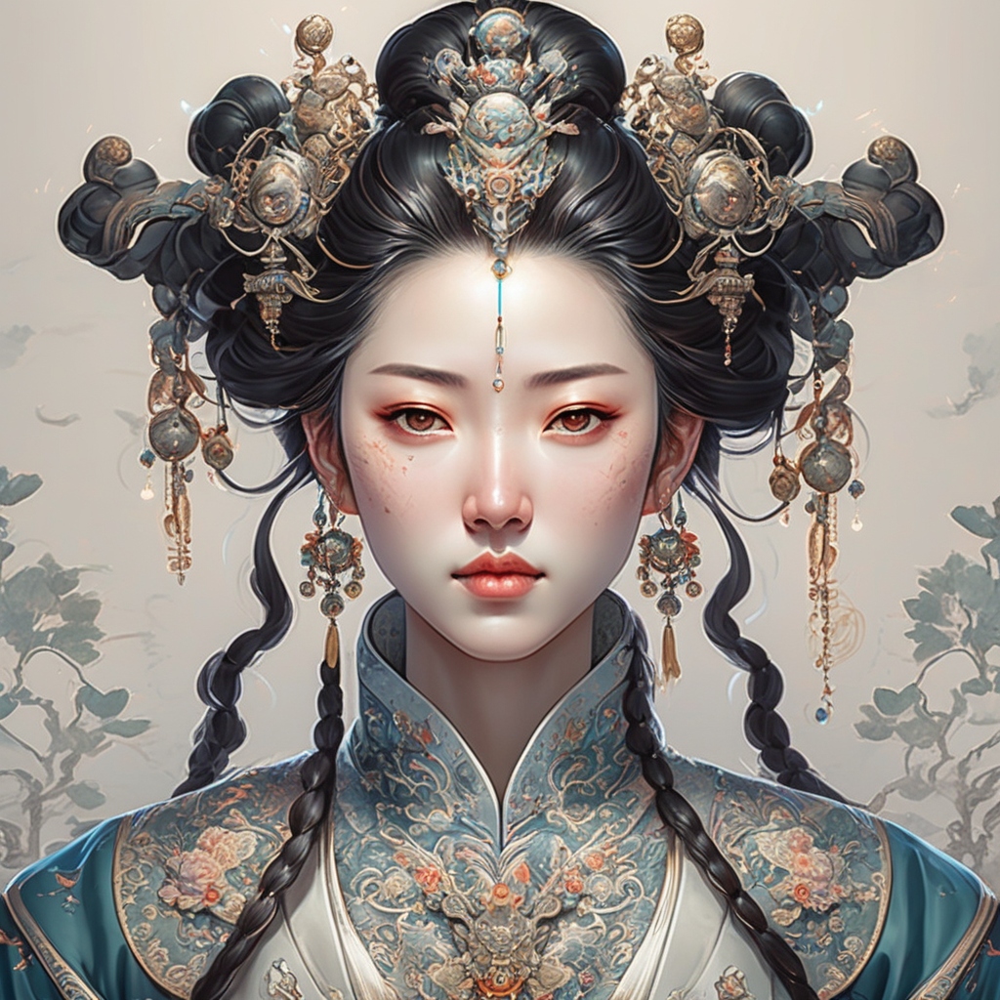

# sd3部署
部署位置    
teams     
/newlytest/stable-diffusion-3-medium/app.py

diffusers from_pretrained     
默认 cache_dir none     
PosixPath('/root/.cache/huggingface/hub/models--stabilityai--stable-diffusion-3-medium-diffusers/snapshots/b1148b4028b9ec56ebd36444c193d56aeff7ab56')

    

都是软连接    

功能有：监控时间和输入信息    
简单改写scheduler    

gradio

模型下载完后运行，tokenizer不匹配     
很多包要最新的      
手动装，最后request包还是不匹配     

huggingface token下载      

20g 1024*1024

直接使用 huggingface space的 gradio部署

Passing `scale` via `joint_attention_kwargs` when not using the PEFT backend is ineffective.

dpmpp 2m 直接配置还是黑图     
出不了正常图    
diffusers采样器不知道如何改

为什么iclight能使用？？？？

普通生图手指畸形

a green sign that says "Very Deep learning" and is at the edge of the Grand Canyon

A portrait photo of a kangaroo wearing an orange hoodie
and blue sunglasses standing on the grass in front of the Sydney
Opera House holding a sign on the chest that says "WUJIE"!

A portrait photo of a kangaroo wearing an orange hoodie and blue sunglasses standing on the grass in front of the Sydney Opera House holding a sign on the chest that says "陆"!

如果是comfyui也许会好一些    

# MixDQ
MixDQ: Memory-Efficient Few-Step Text-to-Image Diffusion Models with Metric-Decoupled Mixed Precision Quantization

我们设计了 MixDQ，这是一个混合精度量化框架，成功解决了具有挑战性的几步文本到图像扩散模型量化问题。在视觉质量下降和内容变化几乎可以忽略不计的情况下，MixDQ 可以实现 W4A8，同时内存压缩率相当于 3.4 倍，延迟加速率相当于 1.5 倍。

https://github.com/A-suozhang/MixDQ

MixDQ 是一种混合精度量化方法，可在保持生成质量的同时压缩文本到图像扩散模型的内存和计算使用量。它支持少步扩散模型（例如 SDXL-turbo、LCM-lora），以构建快速和微小扩散模型。提供高效的 CUDA 内核实现，以节省实际资源。

在几乎不影响视觉质量下降和内容变化的情况下，MixDQ 可以实现 W4A8，同时内存压缩率相当于3.4 倍，延迟加速率相当于 1.5 倍。

扩散模型已经实现了显著的视觉生成质量。然而，它们巨大的计算和内存成本给它们在资源受限的移动设备甚至桌面 GPU 上的应用带来了挑战。最近的几步扩散模型通过减少去噪步骤来缩短推理时间。然而，它们的内存消耗仍然过大。

训练后量化 (PTQ) 用低位整数值 (INT4/8) 代替高位宽 FP 表示，这是一种有效且高效的降低内存成本的技术。然而，当应用于少步扩散模型时，现有的量化方法在保持图像质量和文本对齐方面面临挑战。

为了解决这个问题，我们提出了一个混合精度量化框架 - MixDQ。首先，我们设计了专门的 BOS 感知量化方法，用于高度敏感的文本嵌入量化。然后，我们进行度量解耦灵敏度分析来测量每一层的灵敏度。最后，我们开发了一种基于整数规划的方法来进行位宽分配。

尽管现有的量化方法在 W8A8 上达不到要求，但 MixDQ 可以在不损失性能的情况下实现 W8A8，在几乎不影响视觉效果的情况下实现 W4A8。与 FP16 相比，我们将模型大小和内存成本降低了3-4 倍，并将延迟加速了1.45 倍。

我们通过实验发现，与多步扩散模型相比，少步扩散模型对量化更敏感，而现有的扩散量化方法面临挑战。Q-扩散 W8A8 量化模型在少步下面临严重的质量下降。此外，即使是多步模型，量化也会损害文本-图像对齐。

我们进行了初步实验，深入探讨了量化失败的原因，并发现了两个有启发性的发现：（1）量化被一些高度敏感的层“瓶颈化”。 （2）量化模型的不同部分分别影响生成的图像质量和内容。

混合精度量化框架 MixDQ ：

BOS 感知文本嵌入量化    
我们发现 CLIP 文本嵌入的第一个标记是阻碍量化的异常值。此外，我们注意到第一个标记是句首 (BOS) 标记，对于不同的提示，它保持不变。因此，我们可以离线预先计算它并跳过它的量化。

度量解耦灵敏度分析    
当仅保留导致最大量化误差FP16的层时，我们发现生成的图像仍然面临质量下降的问题，这表明现有的量化灵敏度分析的准确性需要提高。受量化对图像质量和文本对齐的影响的启发，我们设计了一种度量解耦灵敏度分析方法。我们将各层分为两组，分别对它们进行具有不同度量的灵敏度分析。

基于整数规划的位宽分配    
在获得量化灵敏度之后，我们将位宽分配问题转化为整数规划方法，并采用现成的求解器有效地求解。

我们给出了一些定性结果，将统计度量值与生成的图像联系起来。可以看出，与 Q-Diffusion 和朴素 minmax 量化相比，MixDQ-W4A8 可以生成与 FP 图像几乎相同的图像，而其他方法无法为 W8A8 生成可读图像。

与其他现有扩散模型量化工具相比，只有闭式 TensorRT INT8 实现实现了实际的延迟加速。MixDQ 是第一个针对少步扩散模型实现实际内存和延迟优化的工具，可实现“微小而快速”的图像生成。

致谢    
我们的代码是基于Q-Diffusion和Diffusers Libraray开发的。

待办事项    
评估脚本（FID、ClipScore、ImageReward）   
高效的 INT8 GPU 内核实现  

普通 fp16 没有 

AttributeError: 'StableDiffusionXLPipeline' object has no attribute 'set_cuda_graph'

AttributeError: 'StableDiffusionXLPipeline' object has no attribute 'run_for_test'

## 原理

    def quantize_unet(
            self,
            w_bit=None,
            a_bit=None,
            bos=False,
            # cuda_graph_only=True,
            # run_pipeline=True,
            # compile=False,
        ):
        r"""
        This function helps quantize the UNet in the SDXL Pipeline
        Now we only support quantization with the setting W8A8

        Args:
            w_bit: (`str`):
                the bit width of weight
            a_bit: (`str`):
                the bit width of activation
            bos: (`bool`):
                if to use bos technique
            cuda_graph_only: (`bool`):
                if to use cuda_graph
            run_pipeline: (`bool`):
                run the full pipeline or just the unet
        """

path = hf_hub_download(
            repo_id="Stein-Fun/mixdq_test",
            filename="quant_para_wsym_fp16.pt",
            revision="version_0",
        )

## diffusers使用安装环境
    3  pip install mixdq-extension
    4  pip uninstall torchaudio
    5  pip install xformers==0.0.25 对标 torch 2.2.1

AttributeError: 'StableDiffusionXLPipeline' object has no attribute 'quantize_unet'

AttributeError: type object 'DiffusionPipeline' has no attribute 'from_single_file'

    class MixDQ_SDXLTurbo_Pipeline_W8A8(
        DiffusionPipeline,
        FromSingleFileMixin,
        StableDiffusionXLLoraLoaderMixin,
        TextualInversionLoaderMixin,
        IPAdapterMixin,
    ):
        r"""
        Pipeline for text-to-image generation using Stable Diffusion XL.

        This model inherits from [`DiffusionPipeline`]. Check the superclass documentation for the generic methods the
        library implements for all the pipelines (such as downloading or saving, running on a particular device, etc.)

        In addition the pipeline inherits the following loading methods:
            - *LoRA*: [`loaders.StableDiffusionXLLoraLoaderMixin.load_lora_weights`]
            - *Ckpt*: [`loaders.FromSingleFileMixin.from_single_file`]

先转diffusers使用DiffusionPipeline加载sdxl

    IndexError                                Traceback (most recent call last)
    Cell In[48], line 2
        1 # quant the UNet
    ----> 2 pipe.quantize_unet(
        3                 w_bit = 8, 
        4                 a_bit = 8, 
        5                 bos=True, 
        6                 )

    File ~/.cache/huggingface/modules/diffusers_modules/local/pipeline.py:2766, in MixDQ_SDXLTurbo_Pipeline_W8A8.quantize_unet(self, w_bit, a_bit, bos)
    2756 ckpt = torch.load(path, map_location='cpu')
    2758 register_qconfig_from_input_files(
    2759     self.unet,
    2760     # args,
    (...)
    2764     bos_dict=bos_dict
    2765 )
    -> 2766 convert_to_quantized(self.unet, ckpt)

    File ~/.cache/huggingface/modules/diffusers_modules/local/pipeline.py:1924, in convert_to_quantized(unet, ckpt)
    1922 def convert_to_quantized(unet, ckpt):
    1923     # from quantize import convert
    -> 1924     convert(unet,
    1925             mapping={nn.Linear: QuantizedLinear,
    ...
    --> 791         _split = _SPLIT[_NUM]
        792         _NUM = _NUM + 1
        793         # num = num + 1

    IndexError: list index out of range

32精度的问题     
还是sdxl不支持？？？       

IndexError: list index out of range

fp16不行

RuntimeError: Not all keys in weight yaml map to a module in UNet.

sd1.5不行

# HelloWorld 7.0 更新 - 2024 年 6 月 13 日

HelloWorld 7.0是迭代优化的版本，拥有全系列最优的本体表现，概念范围与细节丰富度进一步增强。

更新详细信息：

通过添加负面训练图片、加强姿势训练、优化clip模型，模型肢体和手部准确率较之前版本有所提升，推荐的负面提示词为：“bad hand、bad anatomy、worst quality、ai generated images、low quality、average quality”。

从官方的 SPO 模型中提取了经过微调的 LoRA ，并将其纳入 HelloWorld 7.0。SPO 是对 DPO 方法的进一步改进。使用 SPO 基础模型比 DPO XL 基础模型和原始 SDXL 基础模型性能更好。SPO LoRA 可以增强图像细节和对比度并美化图像。感谢 SPO 背后的技术团队。

继续扩大训练集的概念范围，但对训练集进行了优化和精简（大训练集微调太贵，而且最近H800租起来也难，负担不起本地训练的时间）。目前总训练集为20821张图片。训练集分辨率分布如下，建议使用图片数量较多的几种分辨率进行输出：

    (832, 1248) - Count: 7128
    (896, 1152) - Count: 6250
    (1248, 832) - Count: 2402
    (1024, 1024) - Count: 1639
    (1360, 768) - Count: 928
    (1152, 896) - Count: 870
    (768, 1360) - Count: 432
    (960, 1088) - Count: 506
    (992, 1056) - Count: 162
    (1088, 960) - Count: 140
    (704, 1472) - Count: 120
    (1056, 992) - Count: 122
    (1472, 704) - Count: 115
    (1632, 640) - Count: 75
    (640, 1632) - Count: 12
使用 GPT4O 对所有数据集进行重新标注。本次采用了结构化的标注方法，具体结构为：“一句话概括描述+多个图元标签+灵感来自 XXX+美学品质描述词”，其中美学品质描述词分为五个等级：最差品质、低品质、一般品质、最好品质、杰作。典型的标注示例如下：

conceptual art featuring a human hand wrapped in red and beige ribbons, isolated against a plain, light background, realistic style, minimalist color scheme, smooth textures, elongated and surreal aesthetic, inspired by salvador dalí's surrealist works, masterpiece
Inspired by XXX for HelloWorld 7.0版本所涉及的“高频标注词表”和“高频艺术风格表”仅提供给商业授权用户，以往购买过Helloworld XL系列模型授权的伙伴，如有遗漏请联系我免费获取。

各位玩家可以参考HelloWorld 6.0高频标注词表，另外我在图库中也提供了150+张高质量的HelloWorld 7.0示例图，可以作为大家输出的参考。模型制作不易，感谢各位玩家的理解与包容！

LEOSAM HelloWorld 6.0 Top 250 High-Frequency Tagging Word List 

The main body of the HelloWorld 6.0 training set employs GPT4v tagging. For images that GPT4v cannot tag, cogVQA guided by blip2-opt-6.7b is used for tagging. The tagging language style of these multimodal models differs significantly from the traditional WD1.4 tagger. To facilitate more accurate triggering of different concepts in the training set, I have compiled the top 250 high-frequency tagging words from the HelloWorld 6.0 training set. 

**摄影技术和美学/Photography Techniques and Aesthetics:**

- 模拟胶片摄影美学 (film photography aesthetic)
- 时尚摄影 (Fashion photography, Fashion portrait)
- 人像摄影 (Portrait photography, portrait photography, Elegant portrait photography)
- 野生动物摄影 (wildlife photography)
- 私房摄影 (Intimate boudoir photography)
- 高分辨率 (high-resolution, high-resolution clarity, high-resolution image, high-resolution portrait)
- 极简主义风格 (minimalist aesthetic, minimalistic aesthetic, minimalistic style, minimalist style, minimalist design)
- 复古美学 (vintage aesthetic)

**构图和背景/Composition and Background:**

- 特写 (Close-up, Close-up portrait)
- 鸟瞰视角 (Aerial perspective, Aerial view)
- 对称构图 (symmetrical composition)
- 极简主义构图 (minimalist composition)
- 浅景深 (shallow depth of field)

**色彩:/Color:**

- 黑白 (Black and white portrait, Monochrome portrait)
- 暖色调 (warm color palette, Warm)
- 冷色调 (cool color palette)
- 柔和的色彩 (muted color palette, pastel color palette, neutral color palette, earthy tones)
- 鲜艳的色彩 (Vibrant color palette, vibrant colors, rich)

**人物特征/Characteristics:**

- 年龄范围:
    - 十几岁到20岁初 (late teens to early twenties, late teens or early twenties)
    - 20多岁 (early twenties, early to mid-20s, likely in her 20s, mid-20s, likely in her twenties)
- 女性角色 (young female character,female subject, young adult female, female model)
- 年轻亚洲女性 (young Asian woman, young Asian female, Asian woman, Asian female)
- 男性主体 (young Asian male, male subject)

**插图和数字艺术/Illustrations and Digital Art:**

- 动漫风格插图 (Anime-style illustration, Vibrant anime-style illustration)
- 数字插图 (Vibrant digital illustration, Digital illustration, Vibrant digital artwork)
- 手绘插图 (Hand-drawn illustration)
- 动漫风格 (anime style)
- 数字艺术 (digital art)
- 简洁的线条 (clean lines)

**其他/Others:**

- 优雅 (Elegant, elegance, timeless elegance, casual elegance, sophisticated)
- 梦幻 (ethereal, ethereal quality, ethereal ambiance, ethereal atmosphere, ethereal aesthetic)
- 宁静 (serene, serene ambiance, serene atmosphere, tranquil ambiance, tranquil atmosphere)

**发型/Hairstyle:**

- 长黑发 (long dark hair, long black hair)
- 短黑发 (short black hair)
- 长而飘逸的头发 (long flowing hair)

**服装/Clothing:**

- 白色衬衫 (white shirt, crisp white shirt)
- 休闲装扮 (casual attire, casual fashion, casual style)
- 白色运动鞋 (white sneakers)
- 及膝袜 (knee-high socks)
- 白色袜子 (white socks)
- 没有明显的配饰 (no visible accessories)

**表情/Expression:**

- 平静的表情 (serene expression, serene facial expression)
- 沉思的表情 (contemplative expression, thoughtful expression, pensive expression, contemplative mood)
- 专注的表情 (focused expression)
- 温和的表情 (gentle expression)
- 微笑 (slight smile, subtle smile, gentle smile, radiant smile)
- 严肃的表情 (solemn expression)
- 快乐的表情 (joyful expression, playful expression)
- 中性表情 (neutral expression)
- 内省的情绪 (introspective mood)

**姿势和态度/Posture and Attitude:**

- 直视 (direct gaze, intense gaze, piercing gaze, focused gaze, soft gaze, contemplative gaze, gentle gaze, introspective gaze)
- 闭眼 (eyes closed, closed eyes)
- 侧面 (side profile)
- 放松的姿势 (relaxed pose, relaxed posture, relaxed demeanor)
- 大方得体的姿态 (poised stance, poised demeanor, poised expression, confident stance)

**面部特征/Facial Features:**

- 细腻的面部特征 (delicate features, delicate facial features, clear complexion)
- 亚洲面孔特征 (Asian features)
- 白皙肌肤 (fair skin, fair complexion, pale skin, light skin, porcelain skin)
- 光滑的皮肤 (smooth skin, flawless skin, clear skin)
- 微妆 (subtle makeup, minimal makeup, natural makeup)
    - 强调自然美的微妆 (subtle makeup emphasizing natural beauty, subtle makeup highlighting natural beauty, subtle makeup enhancing natural beauty, subtle makeup highlighting natural features)
- 脸颊上淡淡的腮红 (subtle blush on cheeks)

## SPO-Diffusion-Models/SPO-SDXL_4k-p_10ep

步骤感知偏好优化：在每一步中将偏好与去噪性能相结合

Step-aware Preference Optimization: Aligning Preference with Denoising Performance at Each Step

最近，直接偏好优化 (DPO) 已将其成功从对齐大型语言模型 (LLM) 扩展到对齐文本到图像的扩散模型与人类偏好。与大多数现有的 DPO 方法假设所有扩散步骤与最终生成的图像共享一致的偏好顺序不同，我们认为这种假设忽略了特定于步骤的去噪性能，并且偏好标签应该根据每个步骤的贡献进行量身定制。

为了解决这一限制，我们提出了步进感知偏好优化 (SPO)，这是一种新颖的后训练方法，它使用步进感知偏好模型和步进重采样器来确保准确的步进感知监督，从而独立评估和调整每一步的去噪性能。具体来说，在每个去噪步骤中，我们都会从一组图像中抽样，找到合适的胜负对，最重要的是，从池中随机选择一张图像来初始化下一个去噪步骤。这个步进重采样过程可确保下一个胜负图像对来自同一图像，使胜负比较独立于上一步。为了评估每一步的偏好，我们训练了一个单独的步进感知偏好模型，该模型可应用于嘈杂图像和干净图像。

我们对 Stable Diffusion v1.5 和 SDXL 的实验表明，SPO 在将生成的图像与复杂、详细的提示对齐以及增强美感方面明显优于最新的 Diffusion-DPO，同时训练效率也提高了 20 倍以上。代码和模型：https://rockeycoss.github.io/spo.github.io/

该模型是从stable-diffusion-xl-base-1.0微调而来的。它已针对 4,000 个提示进行了 10 个时期的训练。

这是一个合并检查点，将 LoRA 检查点与基础模型stable-diffusion-xl-base-1.0相结合。如果您想访问 LoRA 检查点，请访问SPO-SDXL_4k-p_10ep_LoRA 。我们还提供了与stable-diffusion-webui兼容的 LoRA 检查点，可在此处访问。

# EasyAnimate

easyphoto出品    

可用于生成AI图片与视频、训练Diffusion Transformer的基线模型与Lora模型，我们支持从已经训练好的EasyAnimate模型直接进行预测，生成不同分辨率，6秒左右、fps24的视频（1 ~ 144帧, 未来会支持更长的视频），也支持用户训练自己的基线模型与Lora模型，进行一定的风格变换。

新特性：

更新到v2版本，最大支持144帧(768x768, 6s, 24fps)生成。[ 2024.05.26 ]

功能概览：

    数据预处理
    训练VAE
    训练DiT
    模型生成

pixart a 基础模型     
训练   

1. 引入运动模块（Motion Module），以实现从2D图像到3D视频的扩展   
2. 引入slice VAE压缩时间轴，有助于长视频生成。

# 结尾