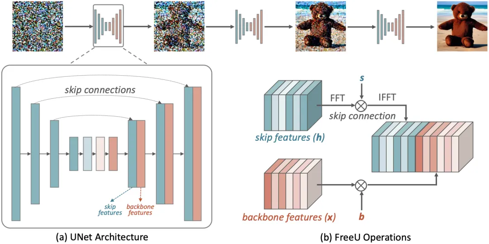

# 为什么forge比webui快那么多 显存还小
整体较快    
插件层面 cn multi较快

Forge backend removes all WebUI's codes related to resource management and reworked everything. All previous CMD flags like medvram, lowvram, medvram-sdxl, precision full, no half, no half vae, attention_xxx, upcast unet, ... are all REMOVED. Adding these flags will not cause error but they will not do anything now. We highly encourage Forge users to remove all cmd flags and let Forge to decide how to load models.

Forge 后端删除了所有与资源管理相关的 WebUI 代码并重新设计了所有内容。

Without any cmd flag, Forge can run SDXL with 4GB vram and SD1.5 with 2GB vram.

UNet Patcher   
Note that Forge does not use any other software as backend. The full name of the backend is Stable Diffusion WebUI with Forge backend, or for simplicity, the Forge backend. The API and python symbols are made similar to previous software only for reducing the learning cost of developers.

Now developing an extension is super simple. We finally have a patchable UNet.

Below is using one single file with 80 lines of codes to support FreeU:

in my tests, forge was only faster on low end hardware when compared to sdnext with lowvram as it's more efficient with aggressive model offloading. but slower in pretty much all other scenarios.

为什么offload还能比别人快？？

文生图更快

我觉得 Forge 更高效的地方在于 RAM 使用和模型切换。

您是否因为 Forge 的智能卸载等而避免了高分辨率下的 OOM 错误？您的特定显卡的加速效果是否显著？您是否使用 Forge 独有（而非自动）工具，如 Layer Diffuse 或 IP Adapter masking？如果是，那么它可能值得。

由于有“永不 OOM”选项卡，我能够通过 hires.fix 生成高分辨率图像，而无需额外的脚本。

3080 10GB

（WEBUI 时间/手动计时器）

A1111 - 5 张图片 - 832x1216 - SDXL turbo - 11 个步骤 - DPM++SDE KARRAS - 57.5 / 60.12

Forge - 5 张图片 - 832x1216 - SDXL turbo - 11 个步骤 -DPM++SDE KARRAS - 50.1 / 51.39

他是controlnet模块的发明者。

它只是具有更高效后端的自动化系统。 

对我来说，它在低端 GPU 上的速度是原来的两倍，所以它实际上是一个游戏规则的改变者

# freeU
今天主题介绍为：FreeU一款Stable Diffusion的实用插件，它通过调整模型的去噪器来提升图像质量，并且该方法针对写实模型或动漫模型都有显著的质量增强效果。FreeU是一种无需额外训练或微调即可增强图像的生成质量。关键的洞察是策略性地重新权衡来自U-Net跳跃连接和主干特征图的贡献，以利用U-Net架构的两个组成部分的优势。研究团队在图像和视频生成任务实验结果表明，FreeU可以轻松集成到现有的扩散模型中，例如Stable Diffusion、DreamBooth、ModelScope、Rerender和ReVersion等，并且只需几行代码即可通过调整两个缩放因子在推理过程中提高生成质量。

FreeU不增加成本获得更好的AI图像

FreeU一键为你的SD绘图增添惊艳光影和质量

FreeU方法通过以下步骤实现：

• 识别U-Net架构的贡献：分析U-Net的主干和跳跃连接对去噪过程的不同贡献。

• 重新权衡贡献：调整来自跳跃连接和主干特征图的贡献，以发挥两者的优势。

• 无需额外训练：FreeU不需要额外的训练或微调，可以直接应用于现有的扩散模型。

• 易于集成：只需在推理过程中调整两个缩放因子，即可轻松集成到现有模型中。

FreeU插件使用指南

效果看上去没区别

# 结尾