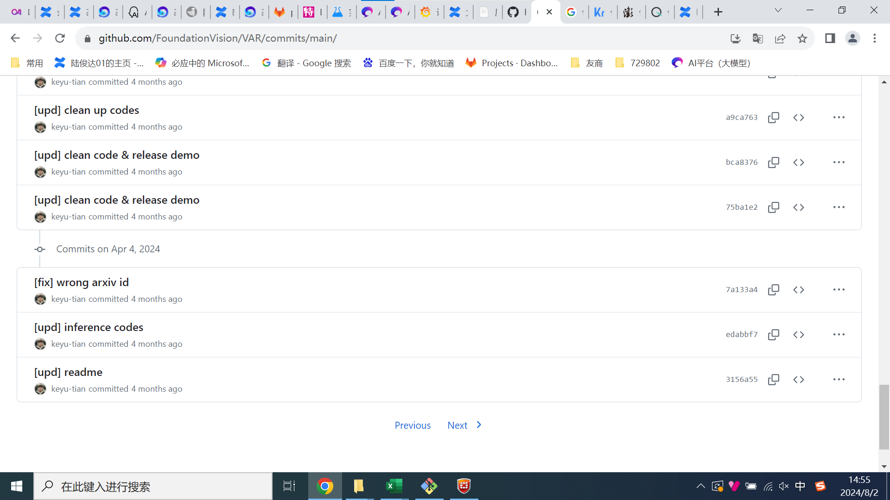
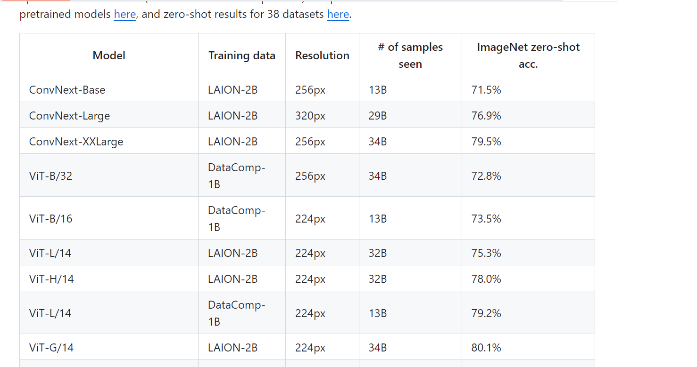
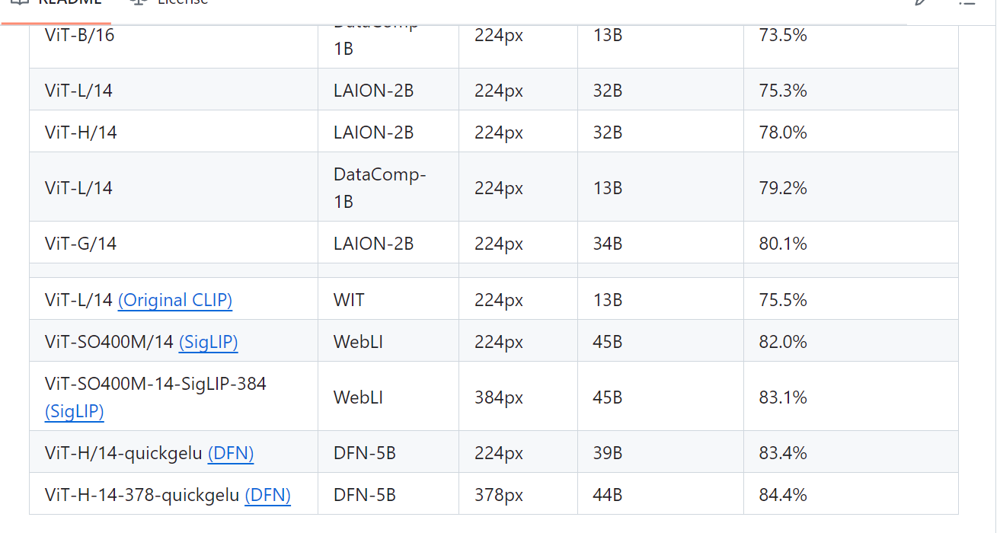
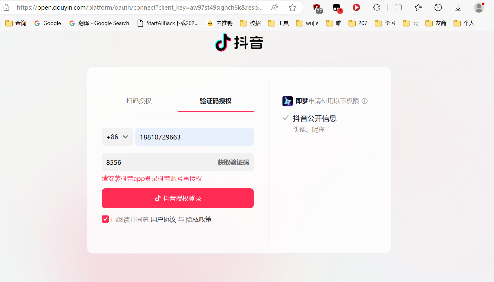
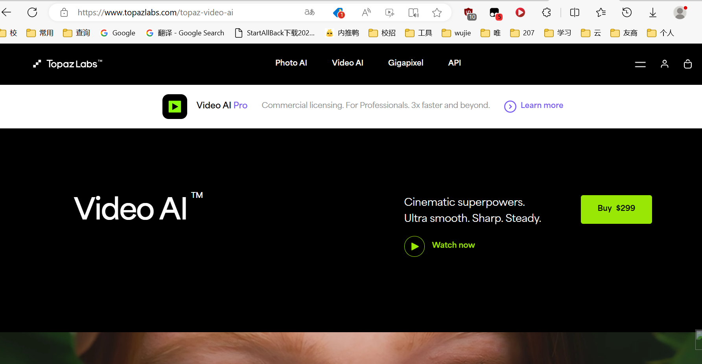

# 自回归
## mar
无需矢量量化的自回归图像生成

[Submitted on 17 Jun 2024 (v1), last revised 28 Jul 2024 (this version, v2)]
Autoregressive Image Generation without Vector Quantization

竟然比字节晚

Tianhong Li, Yonglong Tian, He Li, Mingyang Deng, Kaiming He
Conventional wisdom holds that autoregressive models for image generation are typically accompanied by vector-quantized tokens. We observe that while a discrete-valued space can facilitate representing a categorical distribution, it is not a necessity for autoregressive modeling. In this work, we propose to model the per-token probability distribution using a diffusion procedure, which allows us to apply autoregressive models in a continuous-valued space. Rather than using categorical cross-entropy loss, we define a Diffusion Loss function to model the per-token probability. This approach eliminates the need for discrete-valued tokenizers. We evaluate its effectiveness across a wide range of cases, including standard autoregressive models and generalized masked autoregressive (MAR) variants. By removing vector quantization, our image generator achieves strong results while enjoying the speed advantage of sequence modeling. We hope this work will motivate the use of autoregressive generation in other continuous-valued domains and applications. Code is available at: this https URL

## llamagen
Autoregressive Model Beats Diffusion: 🦙 Llama for Scalable Image Generation

Autoregressive Model Beats Diffusion: Llama for Scalable Image Generation
Peize Sun, Yi Jiang, Shoufa Chen, Shilong Zhang, Bingyue Peng, Ping Luo, Zehuan Yuan
HKU, ByteDance

[Submitted on 10 Jun 2024]

[2024.06.28] Image tokenizers and AR models for text-conditional image generation are released ! Try it !
[2024.06.15] All models ranging from 100M to 3B parameters are supported by vLLM !
[2024.06.11] Image tokenizers and AR models for class-conditional image generation are released !
[2024.06.11] Code and Demo are released !

We introduce LlamaGen, a new family of image generation models that apply original next-token prediction paradigm of large language models to visual generation domain. It is an affirmative answer to whether vanilla autoregressive models, e.g., Llama, without inductive biases on visual signals can achieve state-of-the-art image generation performance if scaling properly. We reexamine design spaces of image tokenizers, scalability properties of image generation models, and their training data quality.

In this repo, we release:

Two image tokenizers of downsample ratio 16 and 8.
Seven class-conditional generation models ranging from 100M to 3B parameters.
Two text-conditional generation models of 700M parameters.
Online demos in Hugging Face Spaces for running pre-trained models.
Supported vLLM serving framework to enable 300% - 400% speedup.

We introduce LlamaGen, a new family of image generation models that apply original ``next-token prediction'' paradigm of large language models to visual generation domain. It is an affirmative answer to whether vanilla autoregressive models, e.g., Llama, without inductive biases on visual signals can achieve state-of-the-art image generation performance if scaling properly. We reexamine design spaces of image tokenizers, scalability properties of image generation models, and their training data quality. The outcome of this exploration consists of: (1) An image tokenizer with downsample ratio of 16, reconstruction quality of 0.94 rFID and codebook usage of 97% on ImageNet benchmark. (2) A series of class-conditional image generation models ranging from 111M to 3.1B parameters, achieving 2.18 FID on ImageNet 256x256 benchmarks, outperforming the popular diffusion models such as LDM, DiT. (3) A text-conditional image generation model with 775M parameters, from two-stage training on LAION-COCO and high aesthetics quality images, demonstrating competitive performance of visual quality and text alignment. (4) We verify the effectiveness of LLM serving frameworks in optimizing the inference speed of image generation models and achieve 326% - 414% speedup. We release all models and codes to facilitate open-source community of visual generation and multimodal foundation models.

## VAR
VAR: a new visual generation method elevates GPT-style models beyond diffusion🚀 & Scaling laws observed📈

About
[GPT beats diffusion🔥] [scaling laws in visual generation📈] Official impl. of "Visual Autoregressive Modeling: Scalable Image Generation via Next-Scale Prediction". An *ultra-simple, user-friendly yet state-of-the-art* codebase for autoregressive image generation!

好像都比he kaiming早 后者不过是创新mar

# mamba

mamba 自回归 beat 

# open clip

https://github.com/mlfoundations/open_clip/blob/main/docs/PRETRAINED.md

竟然有进化了 超越conNext

# AI-ISP

AI降噪模型: 针对RAW domain的2D AI-NR

本人是刚入行ISP的小白，上半年接触AI-ISP相关的知识并着重学习了降噪相关的概念和开发流程，

这是一个关于AI-ISP模块：Noise Reduction 的工程实现文档，针对目标camera如（sensor：IMX766）梳理AI降噪的实现流程，该项目包含：数据准备、模型设计、模型训练、模型压缩、模型推理等。请先确保安装该项目的依赖项，通过git clone下载该项目，然后在该项目的根目录下执行以下命令安装依赖项。

AI-ISP的用途是逐步取代传统ISP链条上一些难以优化的模块如NR、HDR，以实现人眼观感提升或机器视觉指标的特定优化。
当前主流的方案是用AI-ISP和传统算法共同作用于一个模块来保证其稳定性，也有一些paper希望用一个Network来实现整个ISP Pipe的替代，但目前还存在无法合理tuning及不稳定等缺陷。
AI-ISP model的应用通常是针对特定嵌入式硬件来将PC端侧的推理框架（如torch、tensorflow）转为平台自研的推理框架来实现OP的一一映射，中间可以会存在某些OP的优化和改写以实现良好的部署效果，所以也能接触一些硬件架构学习和部署相关的概念，个人认为有良好的学习前景，共勉！

# coreml
它支持用于分析图像的 Vision、用于处理文本的 Natural Language、用于将音频转换为文本的 Speech 以及用于识别音频中声音的声音分析。Core ML 本身建立在 Accelerate 和 BNNS 等低级基元以及 Metal Performance Shaders 之上。

Core ML 是 Apple 的框架，用于将机器学习模型集成到所有平台上的 app 中。它使开发人员能够直接在设备上实现一系列机器学习功能，例如图像识别和自然语言处理。

正如 Apple 所说，“Core ML 针对设备性能进行了优化，从而最大限度地减少了内存占用和功耗。严格在设备上运行可确保用户数据的隐私，并保证您的应用程序在网络连接不可用时保持功能和响应能力。

# 即梦

傻逼玩意

二次短信验证都不给

# topazai

# 结尾