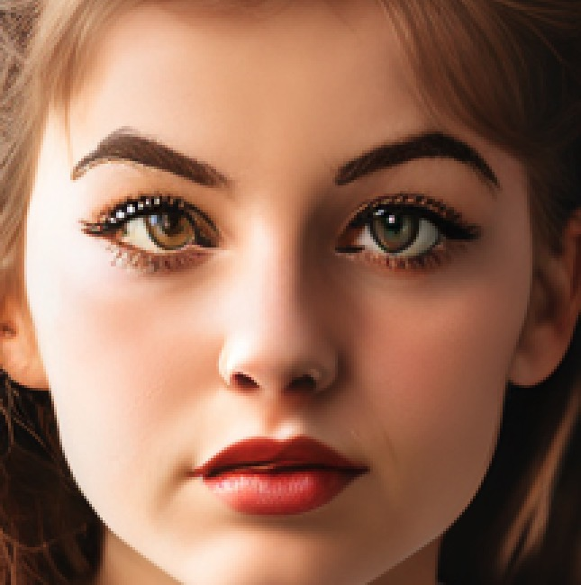
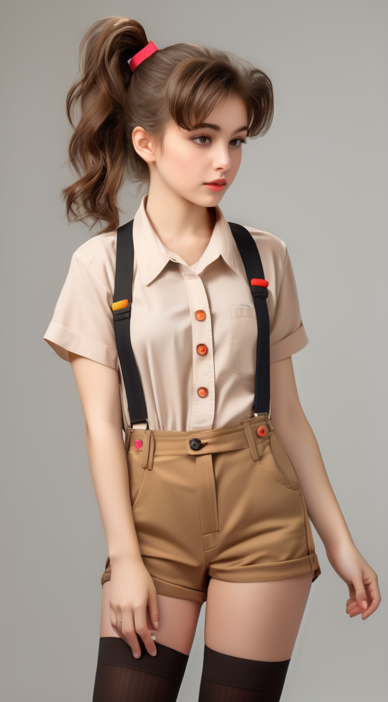
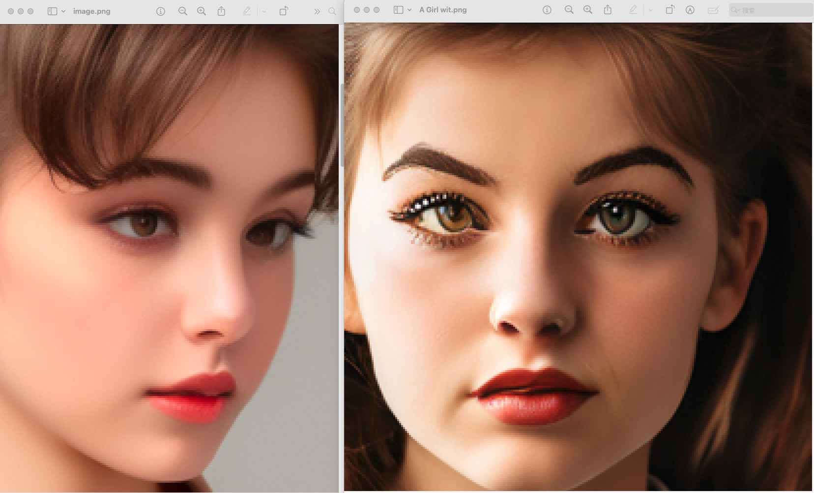
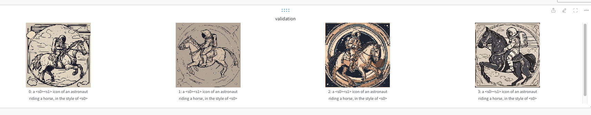
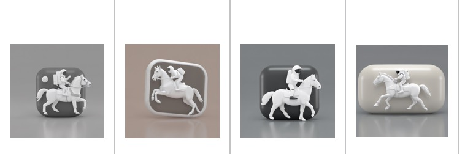
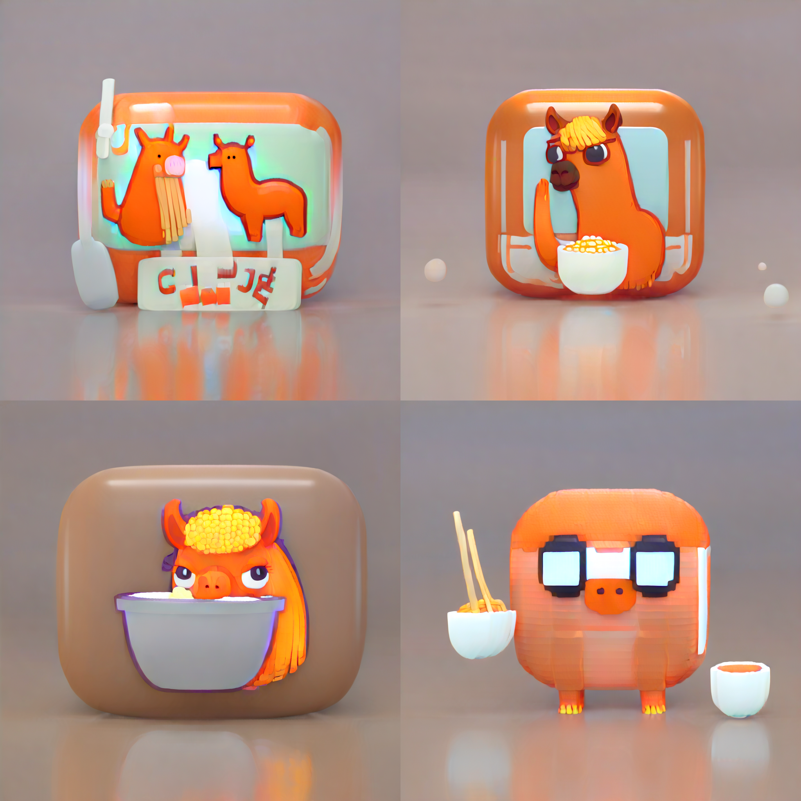

# Elucidating the Design Space of Diffusion-Based Generative Models

## 项目背景
PlaygroundAI 三月初推出 Playground v2.5 ，其仿佛基于edm公式训练。质量宣称优于现有各种模型        
我们解决了三个关键问题：增强色彩和对比度、改进多宽高比生成以及改进以人为中心的精细细节。    
英文版博客 https://playground.com/blog/playground-v2-5     
技术报告 https://marketing-cdn.playground.com/research/pgv2.5_compressed.pdf    

diffuser库在2024三月十号上新，支持 Playground v2.5 推理和基于其的 dreambooth_lora 微调 (可以带上edm)      

diffuser
v0.27.0: Stable Cascade, Playground v2.5, EDM-style training, IP-Adapter image embeds, and more   
需要实测模型效果    
大致看来可以达到加速，以及质量不降低的特效   
类似LCM   

更新概览：    

Stable Cascade    
Stable Cascade 系列管道与 Stable Diffusion 的不同之处在于，它们建立在三个不同的模型之上，并允许对患者图像进行分层压缩，从而实现卓越的输出。   
allow for hierarchical compression of image patients, achieving remarkable outputs.


Playground v2.5   
PlaygroundAI 发布了新的 v2.5 模型（playgroundai/playground-v2.5-1024px-aesthetic），该模型在美观方面尤其出色。除了一些调整之外，该模型紧密遵循 Stable Diffusion XL 的架构。   

EDM-style training   
EDM 是指以下论文中介绍的训练和采样技术：Elucidating the Design Space of Diffusion-Based Generative Models。我们在脚本中引入了对使用 EDM 公式进行训练的支持train_dreambooth_lora_sdxl.py。  
要stabilityai/stable-diffusion-xl-base-1.0使用 EDM 公式进行训练，您只需--do_edm_style_training在训练命令中指定标志即可   
采用 EDM 公式的新调度程序   
为了更好地支持 Playground v2.5 模型和 EDM 式培训，我们提供了对EDMDPMSolverMultistepScheduler和 的支持EDMEulerScheduler。DPMSolverMultistepScheduler它们分别支持和 的EDM 公式EulerDiscreteScheduler。    

Trajectory Consistency Distillation   
轨迹一致性蒸馏 (TCD) 使模型能够以更少的步骤生成更高质量和更详细的图像。此外，由于蒸馏过程中有效的误差缓解，即使在推理步骤较大的情况下，TCD 也表现出优越的性能。它是在轨迹一致性蒸馏中提出的。   
此版本提供了支持TCDScheduler这种快速采样的功能。与 LCM-LoRA 非常相似，TCD 需要额外的适配器来加速。   

IP-Adapter 图像嵌入和屏蔽 embeddings and masking     
所有支持 IP 适配器的管道都接受 ip_adapter_image_embeds 参数。    
我们还引入了对提供二进制掩码的支持，以指定应将输出图像的哪一部分分配给 IP 适配器。对于每个输入 IP 适配器图像，必须提供二进制掩码和 IP 适配器。   


合并 LoRA 指南    
合并 LoRA 是一种有趣且富有创意的方式来创建新的、独特的图像。set_adaptersDiffusers 通过连接 LoRA 权重进行合并的方法提供合并支持。   
现在，Diffusers 还支持add_weighted_adapterPEFT 库中的方法，解锁更高效的合并方法，如 TIES、DARE、线性，甚至这些合并方法的组合，如dare_ties.    

LEDITS++   
我们正在添加对名为 LEDITS++ 的真实图像编辑技术的支持：使用文本到图像模型进行无限图像编辑 Limitless Image Editing using Text-to-Image Models ，这是一种无参数方法，不需要微调或任何优化。   
为了编辑真实图像，LEDITS++ 管道首先反转图像 DPM-solver++ 调度程序，该调度程序有助于通过 只需要 20 个扩散步骤进行编辑，以实现反转和推理相结合。LEDITS++ 指导的定义使其既反映了编辑的方向（如果我们想要远离/靠近编辑概念）又反映了效果的强度。该指南还包括一个专注于相关图像区域的屏蔽术语，特别是对于多次编辑，可确保每个概念的相应指南术语大部分保持隔离，从而限制干扰。    


## 原理

摘要   
我们认为，基于扩散的生成模型的理论和实践目前不必要地复杂化，并试图通过提出一个明确区分具体设计选择的设计空间来弥补这种情况。这让我们能够识别采样和训练过程以及评分网络的预处理的一些变化。总之，我们的改进使 CIFAR-10 在类条件设置下的 FID 达到 1.79，在无条件设置下达到 1.97，采样速度比之前的设计快得多（每个图像 35 个网络评估）。为了进一步证明其模块化性质，我们表明我们的设计更改极大地提高了之前工作中预训练评分网络的效率和质量，包括将之前训练的 ImageNet-64 模型的 FID 从 2.07 提高到接近 SOTA 1.55 ，并在使用我们建议的改进进行重新训练后达到新的 SOTA 1.36。   


Tero Karras 等研究者在论文《Elucidating the design space of diffusionbased generative models》中对扩散模型的设计空间进行了分析，并确定了 3 个阶段，分别为   
i) 选择噪声水平的调度，  
ii) 选择网络参数化（每个参数化生成一个不同的损失函数），  
iii) 设计采样算法。     

本来是想直接consistency model的，但是发现consistency model基本被Karras method全文贯穿了，所以索性就直接从Karras method开始了  

Karras method 来源于

'' Karras T, Aittala M, Aila T, et al. Elucidating the design space of diffusion-based generative models[C]. NIPS, 2022. '' https://arxiv.org/pdf/2206.00364.pdf

这篇文章主要干了3件事情：

1. 给出了几种diffusion模型的通用框架，并且将这些模型分成了几个部分，然后加以分析，看一看什么是对模型影响最大的，哪些需要调整之类的事情。

2. 着眼于sampling过程，即图像生成部分，琢磨怎么有效减少生成图片的步数。

3. 反思了神经网络结构部分，并且尝试修改这个部分，以便他达到更好的效果。


总体来说Karras文章告诉我们的事情是，如果把整个diffusion模型的架构统一起来，那么就可以发现不少可以加速模型，提升效果的点。

### Consistency Model

''Consistency Models Yang Song, Prafulla Dhariwal, Mark Chen, and Ilya Sutskever In the 40th International Conference on Machine Learning, 2023.'' https://arxiv.org/pdf/2303.01469.pdf

Consistency Model的目标是让目标生成的速度尽可能快，比如一步到位，同时也可以支持基于zero-shot的图像生成问题，比如图像填充之类的问题。这是因为Consistency Model不光可以从0开始重新训练，也可以先获得一个预训练模型，然后在这个预训练模型的基础上进行修正，以此达到完成既定的任务。

参考链接 https://zhuanlan.zhihu.com/p/630353542


## 测试
测试 playgroundai/playground-v2.5-1024px-aesthetic   
推理fp16   
显存占用   
加载模型比较久，将近四分钟    
模型加载8g左右   
50步用时   

过程问题   
在底层计算卷积时报错返回   
报错invalid argument   
torch和torchvision不匹配   
没有按照torch官网安装  

按照官网装torch后终于运行成功     
其实还是挺快   


    from diffusers import DiffusionPipeline
    import torch

    model_path = "/models/playground-v2.5-1024px-aesthetic/"
    #model_path = "/home/WujieAITeam/private/dj/models/playground-v2.5-1024px-aesthetic/playground-v2.5-1024px-aesthetic.fp16.safetensors"

    pipe = DiffusionPipeline.from_pretrained(
        model_path,
        torch_dtype=torch.float16,
        variant="fp16",
    ).to("cuda")

    # # Optional: Use DPM++ 2M Karras scheduler for crisper fine details
    # from diffusers import EDMDPMSolverMultistepScheduler
    # pipe.scheduler = EDMDPMSolverMultistepScheduler()

    prompt = "Astronaut in a jungle, cold color palette, muted colors, detailed, 8k"
    image = pipe(prompt=prompt, num_inference_steps=50, guidance_scale=3).images[0]

    image.save("/home/WujieAITeam/private/lujunda/infer-pics/playground-v2.5/" + prompt[:10] + ".png")

1024*1024  1.4mb   


prompt = "A Girl with brown hair with a ponytail, With a light brown shirt from the 80s, with short pants with Brown suspenders with colorful buttons, With black tights with light brown sneakers in a classic tone,"   
negative_prompt = "watermark, low quality, cloned face, ugly, poorly drawn hands, extra limbs, missing legs, (bad body), (signature), (watermark), (username), blurry, cropped, (text), too many fingers, long neck,lowres, bad anatomy, bad hands, text, error, missing fingers, extra digit, fewer digits, cropped, worst quality, low quality, normal quality, jpeg artifacts, signature, watermark, username, blurry, bad feet,{{poorly drawn hands}}, {{poorly drawn face}}, {{{mutation}}}, {{{deformed}}}, {{ugly}}, blurry, {{bad anatomy}}, {{{bad proportions}}}, {{extra limbs}}, cloned face, {{{disfigured}}}, {{{more than 2 nipples}}}, {{{adult}}}, out of frame, ugly, extra limbs, {bad anatomy}, gross proportions, {malformed limbs}, {{missing arms}}, {{missing legs}}, {{{extra arms}}}, {{{extra legs}}}, mutated hands, {fused fingers}, {too many fingers}, (((long neck:1.3)), missing fingers, extra digit, fewer digits, bad feet, sideways, side view portrait, no photo frame, ((long length neck:1.5))"   

显存14g    
耗时两分钟   
1024*1024   
1.18mb   
   
    


采用“webui 效果抖动” prompt      
原图   
     
    


## 训练
训练 dreambooth_lora      
其原理和特点在于dreambooth微调unet,同时训练lora层     
还用lora微调text encoders   
Training with text encoder(s)   
Alongside the UNet, LoRA fine-tuning of the text encoders is also supported.    

使用edm    
计划采用 /diffusers-main/examples/advanced_diffusion_training    
或者 diffusers-main/examples/dreambooth/train_dreambooth_lora_sdxl.py     

### 单纯advanced
会使用   
__main__ - list of token identifiers: ['TOK']  
validation prompt: a \<s0>\<s1> icon of an astronaut riding a horse, in the style of \<s0>\<s1>   
所谓text_inverse的方法加入到dreambooth_lora中训练     
枢轴微调 (Pivotal Tuning) ,关键调整, 将文本反转与常规扩散微调相结合 - 我们将新标记插入模型的文本编码器中，而不是重用现有标记。然后，我们优化新插入的令牌嵌入来表示新概念。    

除了 UNet 之外，还支持 LoRA 文本编码器微调。   

optimizer: for this example, we'll use prodigy - an adaptive optimizer   
pivotal tuning   
min SNR gamma   
我们把 Replicate 在 SDXL Cog 训练器中使用的枢轴微调 (Pivotal Tuning) 技术与 Kohya 训练器中使用的 Prodigy 优化器相结合，再加上一堆其他优化，一起对 SDXL 进行 Dreambooth LoRA 微调，取得了非常好的效果。    

使用 Dreambooth LoRA 微调后的 Stable Diffusion XL(SDXL) 模型仅需借助少量图像即可捕获新概念，同时保留了 SDXL 出图美观高质的优势。   


#### Pivotal tuning
以 Dreambooth 为例，进行常规 Dreambooth 微调时，你需要选择一个稀有词元作为触发词，例如“一只 sks 狗” 中的 sks 。但是，因为这些词元原本就来自于词表，所以它们通常有自己的原义，这就有可能会影响你的结果。举个例子，社区之前经常使用 sks 作为触发词，但实际上其原义是一个武器品牌。   

为了解决这个问题，我们插入一个新词元\<s0>\<s1>到模型的文本编码器中，而非重用词表中现有的词元。然后，我们优化新插入词元的嵌入向量来表示新概念，这种想法就是文本逆化，即我们对嵌入空间中的新词元进行学习来达到学习新概念的目的。一旦我们获得了新词元及其对应的嵌入向量，我们就可以用这些词元嵌入向量来训练我们的 Dreambooth LoRA，以获得两全其美的效果。


#### 第一次启动训练    
没有使用dora    

用了连不上网  --push_to_hub   
需要升级peft使用dora 安装prodigyopt     


占用22g显存   
训练时间半个小时  

原始   
    
```
训练命令
accelerate launch train_dreambooth_lora_sdxl_advanced.py \
  --pretrained_model_name_or_path=$MODEL_NAME \
  --pretrained_vae_model_name_or_path=$VAE_PATH \
  --dataset_name=$DATASET_NAME \
  --instance_prompt="3d icon in the style of TOK" \
  --validation_prompt="a TOK icon of an astronaut riding a horse, in the style of TOK" \
  --output_dir=$OUTPUT_DIR \
  --caption_column="prompt" \
  --mixed_precision="bf16" \
  --resolution=1024 \
  --train_batch_size=3 \
  --repeats=1 \
  --report_to="wandb"\
  --gradient_accumulation_steps=1 \
  --gradient_checkpointing \
  --learning_rate=1.0 \
  --text_encoder_lr=1.0 \
  --optimizer="prodigy"\
  --train_text_encoder_ti\
  --train_text_encoder_ti_frac=0.5\
  --snr_gamma=5.0 \
  --lr_scheduler="constant" \
  --lr_warmup_steps=0 \
  --rank=8 \
  --max_train_steps=1000 \
  --checkpointing_steps=2000 \
  --seed="0" \


Loaded scheduler as EulerDiscreteScheduler 
Num examples = 22
03/27/2024 07:07:33 - INFO - __main__ -   Num batches each epoch = 8
03/27/2024 07:07:33 - INFO - __main__ -   Num Epochs = 125
03/27/2024 07:07:33 - INFO - __main__ -   Instantaneous batch size per device = 3
03/27/2024 07:07:33 - INFO - __main__ -   Total train batch size (w. parallel, distributed & accumulation) = 3
03/27/2024 07:07:33 - INFO - __main__ -   Gradient Accumulation steps = 1
03/27/2024 07:07:33 - INFO - __main__ -   Total optimization steps = 1000

Loaded scheduler as EulerDiscreteScheduler 进行 validation 推理

```

The weights were trained using DreamBooth.

LoRA for the text encoder was enabled: False.

Pivotal tuning was enabled: True.

Special VAE used for training: madebyollin/sdxl-vae-fp16-fix.  

Trigger words    
To trigger image generation of trained concept(or concepts) replace each concept identifier in you prompt with the new inserted tokens:    

to trigger concept TOK-> use <s0><s1> in your prompt


####   第二次启动训练
使用 dora    
加大训练轮次3000    
依旧是22g显存    
两个小时   


#### 推理    
不同之处在于，当我们进行枢轴微调时，除了 LoRA 的 *.safetensors 权重之外，还有经过训练的新词元及其文本嵌入模型的 *.safetensors 。为了对这些进行推理，我们在加载 LoRA 模型的方式上加了 2 个步骤:       

为什么训练结束后没有保存embed_safetensor???         
却要调用hug上面的？？？？    
Pivotal tuning 的 emb获取并没有任何说明





#### 总结
advanced训练原理：    
优化器prodigy，标配学习率1，且文本编码器和unet学习率必须相同    
训练unet的lora，不确定文本编码器是否训练lora  
dreambooth方式训练，给文本（罕见词）和图片一起去训练  
罕见词替换设置，所谓pivotal finetune   
可以设置dora训练    
秩默认8     


### advanced + edm 训练
EDM 式训练尚不支持 Min-SNR gamma。    


# advance 基础知识
## snr_gamma


## prodigy


## dora
DoRA：权重分解低阶自适应中提出， DoRA与 LoRA 非常相似，不同之处在于它将预训练的权重分解为大小和方向两个部分，并采用 LoRA 进行定向更新，以有效地最小化可训练参数的数量。作者发现，通过使用 DoRA，LoRA 的学习能力和训练稳定性都得到了增强，并且在推理过程中没有任何额外的开销。    

LoRA 似乎比 DoRA 收敛得更快（因此训练 LoRA 时可能导致过度拟合的一组参数可能对 DoRA 效果很好）
DoRA 质量优于 LoRA，尤其是在较低等级中，等级 8 的 DoRA 和等级 8 的 LoRA 的质量差异似乎比训练等级为 32 或 64 时更显着。
这也与论文中显示的一些定量分析相一致。
用法


# 结尾