## 生成模型指标 (Metrics of Generative Models)
生成模型 (genrative model) 的生成结果通常没有直接的 ground truth 来计算样本的生成质量. 比如图像生成既要考虑生成图像的噪声要低, 清晰度要高, 同时生成的多样性要高. 我们可以直接找一些人来做图灵测试, 从而评估图像生成的效果, 但这样评估的成本显然是比较高的. 本文介绍几种论文中常用的近似指标 IS, FID, NLL. 既然是近似指标, 那么就说明, 这些指标好不代表生成的样本一定好, 它们仅仅是在一定程度上可以反映生成样本的质量.  

### Inception Score, IS
Salimans 等人在 2016 年 《Improved Techniques for Training GANs》 一文中提出了 Inception Score 来衡量生成模型的结果. 作者发现 IS
 的得分与人类评估的结果是匹配的不错的. IS
 的定义基于 Inception-V3 分类模型, 该模型是 Szegedy 等人在 2015 年 《Rethinking the Inception Architecture for Computer Vision》 一文中提出的, 用于 ImageNet 1000 个类别的分类.


 ### Fréchet Inception Distance, FID
 区别于 IS 是在 Inception-V3 输出的分布上计算的, FID 是在高层特征上计算真假图片之间的距离. FID 是 Heusel 等人在 2017 年 《GANs Trained by a Two Time-Scale Update Rule Converge to a Local Nash Equilibrium》 一文中提出的用于衡量生成样本质量的指标. 其计算方式如下：   

 $\text{FID} = \Vert \mu_r - \mu_g \Vert^2 + Tr\left( \Sigma_r + \Sigma_g - 2(\Sigma_r\Sigma_g)^{\frac12} \right)$

 tex command 才能在 md 写公式

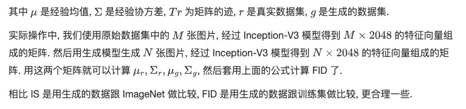   

## 损失
### LPIPS 损失
LPIPS 是一种衡量图像相似度的方法，它通过深度学习模型来评估两个图像之间的感知差异。LPIPS 认为，即使两个图像在像素级别上非常接近，人类观察者也可能将它们视为不同。因此，LPIPS 使用预训练的深度网络（如 VGG、AlexNet）来提取图像特征，然后计算这些特征之间的距离，以评估图像之间的感知相似度。        

来源于CVPR2018的一篇论文《The Unreasonable Effectiveness of Deep Features as a Perceptual Metric》     
LPIPS 比传统方法（比如L2/PSNR, SSIM, FSIM）更符合人类的感知情况。LPIPS的值越低表示两张图像越相似，反之，则差异越大。       
    

由传统的评价标准如L2、SSIM、PSNR等评价结果和人体认为的大不相同，这是传统方法的弊端。如果图片平滑，那么传统的评价方式则大概率会失效。而目前GAN尤其是VAE等生成模型生成结果都过于平滑。     


### 感知损失（Perceptual loss）
计算方法：
感知损失通常用于图像重建或生成任务中，如风格迁移、超分辨率等，其目的是使生成的图像在感知上更接近目标图像。感知损失通过使用深度网络（如 VGG）的中间层激活来比较原始图像和生成图像。不同于直接比较像素值，感知损失关注于图像的高级特征（如纹理、形状等），这更接近于人类的视觉感知。     

两者之间的关系
相同点：

目标相似性：两者都旨在通过深度学习模型捕捉图像的感知质量，更接近人类的视觉系统。
实现方式：它们都使用了深度卷积网络（如 VGG）来提取图像的特征表示。这些网络经过训练能够捕捉到图像的关键视觉特征，从而用于计算图像间的差异或相似性。
不同点：

应用场景的差异：尽管两者在理论上都关注于感知质量，但LPIPS更多用于评估图像相似度，如图像质量评估任务，而感知损失通常作为一种损失函数来使用，广泛应用于图像生成和重建任务，帮助生成的图像在感知上更加自然和真实。           


### GAN的损失函数

GAN的训练方法，能够巧妙的解决这个问题：

先训练D，再训练G，二者相互对抗，直到收敛

在原始的GAN中，提出的loss是：   
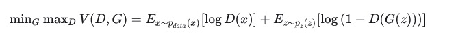   
当G固定且运算可逆时（实际上这一点一般不成立，但不影响了解GAN的思想）：    
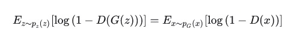    
代入loss公式，进而有：    
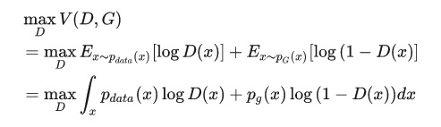     
对于积分区间内的每一个x，设被积函数为f 为：     
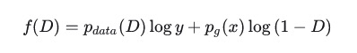    
注意这里x是固定的，变量是D。对f求导，得到当     
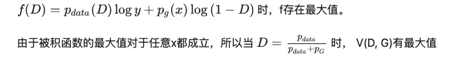    

代入loss公式，有:   
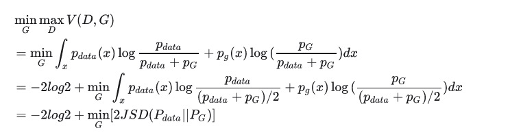    

所以原始GAN的loss实际等价于JS散度
Wasserstein Loss   

JS散度存在一个严重的问题：两个分布没有重叠时，JS散度为零，而在训练初期，JS散度是有非常大的可能为零的。所以如果D被训练的过于强，loss会经常收敛到-2log2而没有梯度    
对于这个问题，WGAN提出了一个新的loss，Wasserstein loss， 也称作地球移动距离：     

Hinge loss

Hinge loss 是对地球移动距离的一种拓展

Hinge loss 最初是SVM中的概念，其基本思想是让正例和负例之间的距离尽量大，后来在Geometric GAN中，被迁移到GAN:     
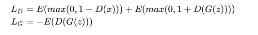     
对于D来说，只有当D(x) < 1 的正向样本，以及D(G(z)) > -1的负样本才会对结果产生影响    

也就是说，只有一些没有被合理区分的样本，才会对梯度产生影响   
这种方法可以使训练更加稳定


#### JS散度

GAN实际是通过对先验分布施加一个运算G, 来拟合一个新的分布    

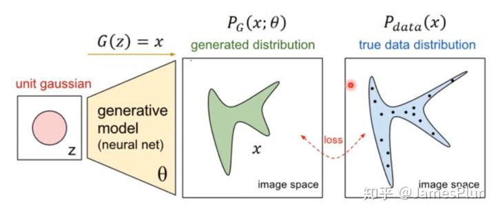    

如果从传统的判别式网络的思路出发，只要选定合适的loss，就可以使生成分布和真实分布之间的距离尽可能逼近

KL散度经常用来衡量分布之间距离    
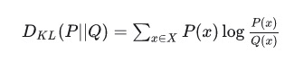    

但KL散度是不对称的。不对称意味着，对于同一个距离，观察方式不同，获取的loss也不同，那么整体loss下降的方向就会趋向于某个特定方向????????。这在GAN中非常容易造成模式崩塌，即生成数据的多样性不足   

JS散度在KL散度的基础上进行了修正，保证了距离的对称性：   
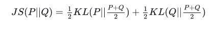    
实际上，无论KL散度还是JS散度，在直接用作loss时，都是难以训练的：由于分布只能通过取样计算，这个loss在每次迭代时都几乎为零    

GAN的训练方法，能够巧妙的解决这个问题：?????

先训练D，再训练G，二者相互对抗，直到收敛


## diffusers快速生图
jupyter notebook


## diffusers多图生成方式
```
generator = torch.manual_seed(318)
steps = 2
img_list = []
for age in [2,20,30,50,60,80]:
    imgs = pipeline(prompt=f"A photo of a cute girl, {age} yr old, XT3",
                        num_inference_steps=steps, 
                        num_images_per_prompt = 1,
                            generator = generator,
                            guidance_scale=1.1,
                       )[0]
    img_list.append(imgs[0])
make_image_grid(img_list,rows=1,cols=len(img_list))


```
   


下面这样生成的图片和每个图片绑定seed结果不太一样   
```
seed = 0

#image = pipe(prompt=prompt, num_inference_steps=25, cross_attention_kwargs={"scale": 1.0}).images[0]
image = pipe(
        prompt, 
        num_inference_steps=1, 
        num_images_per_prompt = 8,
        guidance_scale=0,
        generator=torch.Generator(device="cuda").manual_seed(seed)
    )
print(image.images)
print(len(image.images))


folder_path = '/home/WujieAITeam/private/lujunda/infer-pics/pic-sdxs-512-0.9/'
if not os.path.exists(folder_path):
    os.makedirs(folder_path)
for i in range(len(image.images)):
# 返回的image.images就是单纯四个PIL文件  
    image.images[i].save(folder_path + prompt[:10] + str(i) + ".png")

```


# 结尾

惶惶然不知所往   
宿命感   
往往这时候忘记都是因为压力降临，有紧迫任务而忘记   
明白但是仅此而已    
五斗米折腰   
