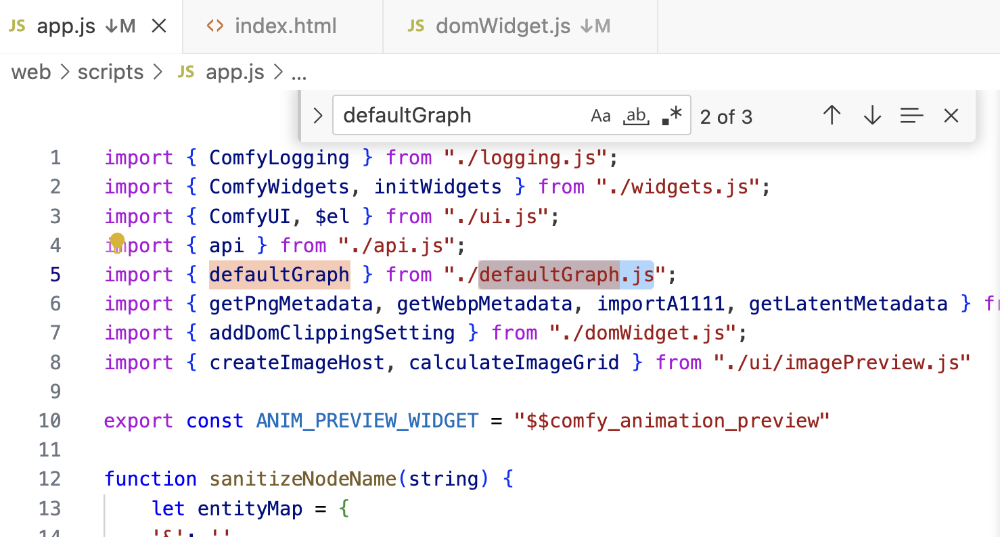

# 安装自定义节点
## manager
## 手动
git clone repo 到 ComfyUI/custom_nodes/    
其他不用改    
模型那些遵照readme即可   

特殊的，如果comfyui官方未支持节点的一些底层推理    
需要在comfyui根路径git apply patch      

# comfyui特有denoise
当您以 1.0 运行 Ksampler 时，它会完全模糊任何传入的图像或噪声，然后按照给定的步骤数对其进行处理。

如果您以 0.6 运行 ksampler，它会模糊 60% 的强度，并根据给定的步数对其进行降噪。

两者之间的区别在于，100% 时它使用的是原始噪声或图像的极小部分。

而在 60% 时，它使用了大部分原始图像的颜色、明暗信息。

# 服务器端口卡住，本地映射加载不出页面
python main.py --port 12345   
换就可以   
本地端口一般不用改   

有时候卡住    
在原端口附近个位数变化换端口，本地和服务器一起换也不行    
好像换大点变化数和重启cmd可以   

# 启动，公网链接
python main.py --port 8895 --listen 0.0.0.0    
然后就能使用公网链接   

因为 

    if os.name == 'nt' and address == '0.0.0.0':
            address = '127.0.0.1'
        webbrowser.open(f"http://{address}:{port}")

    try:
        loop.run_until_complete(run(server, address=args.listen, port=args.port, verbose=not args.dont_print_server, call_on_start=call_on_start))
    except KeyboardInterrupt:
        logging.info("\nStopped server")

默认是127.0.0.1    

设置默认json     
web/scripts/app.js     
import { defaultGraph } from "./defaultGraph.js";    

解决方法    
自己的json赋变量名调用   
改成js文件   
并且 export const defaultGraph =    

import { defaultGraph } from "./AestheticPredictorV2.5-workflow.js";

有时浏览器缓存了旧的    
load default成功    

# 结尾

