# pipe.scheduler 修改

    euler_anc = EulerAncestralDiscreteScheduler.from_pretrained(repo_id, subfolder="scheduler")
    euler = EulerDiscreteScheduler.from_pretrained(repo_id, subfolder="scheduler")
    dpm = DPMSolverMultistepScheduler.from_pretrained(repo_id, subfolder="scheduler")


如果修改是改     
pipe.scheduler.config      
还是pipe.scheduler底下的参数？      
有同名的      
然后是from_pretrained看起来已经加载了一些东西？？？？

感觉不是改config，pipe也有config     
真正的权重好像在pipe底下，      
这个大问题就是直接改pipe.scheduler是否有效，不会已经预加载了吧      

=赋值会自动调用diffusionpipeline底下方法setattr       
类似webui的p赋值也会调用内置方法       
这种是怎么设计的？      


官方文档           
pipeline.scheduler = DPMSolverMultistepScheduler.from_config(pipeline.scheduler.config)       
然后应该就是直接改变pipeline.scheduler底下参数即可，可以一试        

DPM++ 2M	DPMSolverMultistepScheduler	    
DPM++ 2M Karras	DPMSolverMultistepScheduler	init with use_karras_sigmas=True
DPM++ 2M SDE	DPMSolverMultistepScheduler	init with algorithm_type="sde-dpmsolver++"      
DPM++ 2M SDE Karras	DPMSolverMultistepScheduler	init with and use_karras_sigmas=Truealgorithm_type="sde-dpmsolver++"


试了一下好像不是直接 pipeline.scheduler 改？？？algorithm_type    
这个从config读取好像直接构建        
不知道怎么只改一个变量     


这是iclight gradio加载方式

    ddim_scheduler = DDIMScheduler(
        num_train_timesteps=1000,
        beta_start=0.00085,
        beta_end=0.012,
        beta_schedule="scaled_linear",
        clip_sample=False,
        set_alpha_to_one=False,
        steps_offset=1,
    )

    euler_a_scheduler = EulerAncestralDiscreteScheduler(
        num_train_timesteps=1000,
        beta_start=0.00085,
        beta_end=0.012,
        steps_offset=1
    )

    dpmpp_2m_sde_karras_scheduler = DPMSolverMultistepScheduler(
        num_train_timesteps=1000,
        beta_start=0.00085,
        beta_end=0.012,
        algorithm_type="sde-dpmsolver++",
        use_karras_sigmas=True,
        steps_offset=1
    )

这是我根据文档改的加载方式，感觉这样才比较正确，在from_config之前进行参数设置

    dpmpp_2m_sde_karras_scheduler2config = copy.deepcopy(global_scheduler[model_name])
    dpmpp_2m_sde_karras_scheduler2config.config.use_karras_sigmas=True

    dpmpp_2m_karras_scheduler = DPMSolverMultistepScheduler.from_config(
        dpmpp_2m_sde_karras_scheduler2config
    )

    dpmpp_2m_sde_karras_scheduler2config.config.algorithm_type="sde-dpmsolver++"
    dpmpp_2m_sde_karras_scheduler2 = DPMSolverMultistepScheduler.from_config(
        dpmpp_2m_sde_karras_scheduler2config
    )


好像也不对        
解析的时候解出另外的东西      


    # 隔离措施
    
    dpmpp_2m_sde_karras_scheduler2config = copy.deepcopy(global_scheduler[model_name])
    temp = DPMSolverMultistepScheduler.from_config(
        dpmpp_2m_sde_karras_scheduler2config.config
    )
    
    temp.config.use_karras_sigmas=True
    # config成功赋值，但是底下没读进去？
    dpmpp_2m_karras_scheduler = DPMSolverMultistepScheduler.from_config(
        temp.config
    )

    temp.config.algorithm_type="sde-dpmsolver++"
    dpmpp_2m_sde_karras_scheduler2 = DPMSolverMultistepScheduler.from_config(
        temp.config
    )


有可能是那些数字强制赋值了


    def extract_init_dict(cls, config_dict, **kwargs):
        # Skip keys that were not present in the original config, so default __init__ values were used
        used_defaults = config_dict.get("_use_default_values", [])
        config_dict = {k: v for k, v in config_dict.items() if k not in used_defaults and k != "_use_default_values"}
这个位置被赋原始值 false


# pipeline参数：

# StableDiffusionPipeline
```
class StableDiffusionPipeline(
    DiffusionPipeline,
    StableDiffusionMixin,
    TextualInversionLoaderMixin,
    LoraLoaderMixin,
    IPAdapterMixin,
    FromSingleFileMixin,
):
    r"""
    Pipeline for text-to-image generation using Stable Diffusion.

    This model inherits from [`DiffusionPipeline`]. Check the superclass documentation for the generic methods
    implemented for all pipelines (downloading, saving, running on a particular device, etc.).

    The pipeline also inherits the following loading methods:
        - [`~loaders.TextualInversionLoaderMixin.load_textual_inversion`] for loading textual inversion embeddings
        - [`~loaders.LoraLoaderMixin.load_lora_weights`] for loading LoRA weights
        - [`~loaders.LoraLoaderMixin.save_lora_weights`] for saving LoRA weights
        - [`~loaders.FromSingleFileMixin.from_single_file`] for loading `.ckpt` files
        - [`~loaders.IPAdapterMixin.load_ip_adapter`] for loading IP Adapters

    Args:
        vae ([`AutoencoderKL`]):
            Variational Auto-Encoder (VAE) model to encode and decode images to and from latent representations.
        text_encoder ([`~transformers.CLIPTextModel`]):
            Frozen text-encoder ([clip-vit-large-patch14](https://huggingface.co/openai/clip-vit-large-patch14)).
        tokenizer ([`~transformers.CLIPTokenizer`]):
            A `CLIPTokenizer` to tokenize text.
        unet ([`UNet2DConditionModel`]):
            A `UNet2DConditionModel` to denoise the encoded image latents.
        scheduler ([`SchedulerMixin`]):
            A scheduler to be used in combination with `unet` to denoise the encoded image latents. Can be one of
            [`DDIMScheduler`], [`LMSDiscreteScheduler`], or [`PNDMScheduler`].
        safety_checker ([`StableDiffusionSafetyChecker`]):
            Classification module that estimates whether generated images could be considered offensive or harmful.
            Please refer to the [model card](https://huggingface.co/runwayml/stable-diffusion-v1-5) for more details
            about a model's potential harms.
        feature_extractor ([`~transformers.CLIPImageProcessor`]):
            A `CLIPImageProcessor` to extract features from generated images; used as inputs to the `safety_checker`.
    """
```

## __call__
```
    @torch.no_grad()
    @replace_example_docstring(EXAMPLE_DOC_STRING)
    def __call__(
        self,
        prompt: Union[str, List[str]] = None,
        height: Optional[int] = None,
        width: Optional[int] = None,
        num_inference_steps: int = 50,
        timesteps: List[int] = None,
        guidance_scale: float = 7.5,
        negative_prompt: Optional[Union[str, List[str]]] = None,
        num_images_per_prompt: Optional[int] = 1,
        eta: float = 0.0,
        generator: Optional[Union[torch.Generator, List[torch.Generator]]] = None,
        latents: Optional[torch.FloatTensor] = None,
        prompt_embeds: Optional[torch.FloatTensor] = None,
        negative_prompt_embeds: Optional[torch.FloatTensor] = None,
        ip_adapter_image: Optional[PipelineImageInput] = None,
        ip_adapter_image_embeds: Optional[List[torch.FloatTensor]] = None,
        output_type: Optional[str] = "pil",
        return_dict: bool = True,
        cross_attention_kwargs: Optional[Dict[str, Any]] = None,
        guidance_rescale: float = 0.0,
        clip_skip: Optional[int] = None,
        callback_on_step_end: Optional[Callable[[int, int, Dict], None]] = None,
        callback_on_step_end_tensor_inputs: List[str] = ["latents"],
        **kwargs,
    ):
        r"""
        The call function to the pipeline for generation.

        Args:
            prompt (`str` or `List[str]`, *optional*):
                The prompt or prompts to guide image generation. If not defined, you need to pass `prompt_embeds`.
            height (`int`, *optional*, defaults to `self.unet.config.sample_size * self.vae_scale_factor`):
                The height in pixels of the generated image.
            width (`int`, *optional*, defaults to `self.unet.config.sample_size * self.vae_scale_factor`):
                The width in pixels of the generated image.
            num_inference_steps (`int`, *optional*, defaults to 50):
                The number of denoising steps. More denoising steps usually lead to a higher quality image at the
                expense of slower inference.
            timesteps (`List[int]`, *optional*):
                Custom timesteps to use for the denoising process with schedulers which support a `timesteps` argument
                in their `set_timesteps` method. If not defined, the default behavior when `num_inference_steps` is
                passed will be used. Must be in descending order.
            guidance_scale (`float`, *optional*, defaults to 7.5):
                A higher guidance scale value encourages the model to generate images closely linked to the text
                `prompt` at the expense of lower image quality. Guidance scale is enabled when `guidance_scale > 1`.
            negative_prompt (`str` or `List[str]`, *optional*):
                The prompt or prompts to guide what to not include in image generation. If not defined, you need to
                pass `negative_prompt_embeds` instead. Ignored when not using guidance (`guidance_scale < 1`).
            num_images_per_prompt (`int`, *optional*, defaults to 1):
                The number of images to generate per prompt.
            eta (`float`, *optional*, defaults to 0.0):
                Corresponds to parameter eta (η) from the [DDIM](https://arxiv.org/abs/2010.02502) paper. Only applies
                to the [`~schedulers.DDIMScheduler`], and is ignored in other schedulers.
            generator (`torch.Generator` or `List[torch.Generator]`, *optional*):
                A [`torch.Generator`](https://pytorch.org/docs/stable/generated/torch.Generator.html) to make
                generation deterministic.
            latents (`torch.FloatTensor`, *optional*):
                Pre-generated noisy latents sampled from a Gaussian distribution, to be used as inputs for image
                generation. Can be used to tweak the same generation with different prompts. If not provided, a latents
                tensor is generated by sampling using the supplied random `generator`.
            prompt_embeds (`torch.FloatTensor`, *optional*):
                Pre-generated text embeddings. Can be used to easily tweak text inputs (prompt weighting). If not
                provided, text embeddings are generated from the `prompt` input argument.
            negative_prompt_embeds (`torch.FloatTensor`, *optional*):
                Pre-generated negative text embeddings. Can be used to easily tweak text inputs (prompt weighting). If
                not provided, `negative_prompt_embeds` are generated from the `negative_prompt` input argument.
            ip_adapter_image: (`PipelineImageInput`, *optional*): Optional image input to work with IP Adapters.
            ip_adapter_image_embeds (`List[torch.FloatTensor]`, *optional*):
                Pre-generated image embeddings for IP-Adapter. It should be a list of length same as number of
                IP-adapters. Each element should be a tensor of shape `(batch_size, num_images, emb_dim)`. It should
                contain the negative image embedding if `do_classifier_free_guidance` is set to `True`. If not
                provided, embeddings are computed from the `ip_adapter_image` input argument.
            output_type (`str`, *optional*, defaults to `"pil"`):
                The output format of the generated image. Choose between `PIL.Image` or `np.array`.
            return_dict (`bool`, *optional*, defaults to `True`):
                Whether or not to return a [`~pipelines.stable_diffusion.StableDiffusionPipelineOutput`] instead of a
                plain tuple.
            cross_attention_kwargs (`dict`, *optional*):
                A kwargs dictionary that if specified is passed along to the [`AttentionProcessor`] as defined in
                [`self.processor`](https://github.com/huggingface/diffusers/blob/main/src/diffusers/models/attention_processor.py).
            guidance_rescale (`float`, *optional*, defaults to 0.0):
                Guidance rescale factor from [Common Diffusion Noise Schedules and Sample Steps are
                Flawed](https://arxiv.org/pdf/2305.08891.pdf). Guidance rescale factor should fix overexposure when
                using zero terminal SNR.
            clip_skip (`int`, *optional*):
                Number of layers to be skipped from CLIP while computing the prompt embeddings. A value of 1 means that
                the output of the pre-final layer will be used for computing the prompt embeddings.
            callback_on_step_end (`Callable`, *optional*):
                A function that calls at the end of each denoising steps during the inference. The function is called
                with the following arguments: `callback_on_step_end(self: DiffusionPipeline, step: int, timestep: int,
                callback_kwargs: Dict)`. `callback_kwargs` will include a list of all tensors as specified by
                `callback_on_step_end_tensor_inputs`.
            callback_on_step_end_tensor_inputs (`List`, *optional*):
                The list of tensor inputs for the `callback_on_step_end` function. The tensors specified in the list
                will be passed as `callback_kwargs` argument. You will only be able to include variables listed in the
                `._callback_tensor_inputs` attribute of your pipeline class.

        Examples:

        Returns:
            [`~pipelines.stable_diffusion.StableDiffusionPipelineOutput`] or `tuple`:
                If `return_dict` is `True`, [`~pipelines.stable_diffusion.StableDiffusionPipelineOutput`] is returned,
                otherwise a `tuple` is returned where the first element is a list with the generated images and the
                second element is a list of `bool`s indicating whether the corresponding generated image contains
                "not-safe-for-work" (nsfw) content.
        """
```


# DiffusionPipeline
没有 __call__   
用以读取配置文件，自动识别出类型，即 StableDiffusionPipeline   
然后调用他的 __call__      
```
class DiffusionPipeline(ConfigMixin, PushToHubMixin):
    r"""
    Base class for all pipelines.

    [`DiffusionPipeline`] stores all components (models, schedulers, and processors) for diffusion pipelines and
    provides methods for loading, downloading and saving models. It also includes methods to:

        - move all PyTorch modules to the device of your choice
        - enable/disable the progress bar for the denoising iteration

    Class attributes:

        - **config_name** (`str`) -- The configuration filename that stores the class and module names of all the
          diffusion pipeline's components.
        - **_optional_components** (`List[str]`) -- List of all optional components that don't have to be passed to the
          pipeline to function (should be overridden by subclasses).
    """


    def from_pretrained(cls, pretrained_model_name_or_path: Optional[Union[str, os.PathLike]], **kwargs):
        r"""
        Instantiate a PyTorch diffusion pipeline from pretrained pipeline weights.

        The pipeline is set in evaluation mode (`model.eval()`) by default.

        If you get the error message below, you need to finetune the weights for your downstream task:

        ```
        Some weights of UNet2DConditionModel were not initialized from the model checkpoint at runwayml/stable-diffusion-v1-5 and are newly initialized because the shapes did not match:
        - conv_in.weight: found shape torch.Size([320, 4, 3, 3]) in the checkpoint and torch.Size([320, 9, 3, 3]) in the model instantiated
        You should probably TRAIN this model on a down-stream task to be able to use it for predictions and inference.
        ```

        Parameters:
            pretrained_model_name_or_path (`str` or `os.PathLike`, *optional*):
                Can be either:

                    - A string, the *repo id* (for example `CompVis/ldm-text2im-large-256`) of a pretrained pipeline
                      hosted on the Hub.
                    - A path to a *directory* (for example `./my_pipeline_directory/`) containing pipeline weights
                      saved using
                    [`~DiffusionPipeline.save_pretrained`].
            torch_dtype (`str` or `torch.dtype`, *optional*):
                Override the default `torch.dtype` and load the model with another dtype. If "auto" is passed, the
                dtype is automatically derived from the model's weights.
            custom_pipeline (`str`, *optional*):

                <Tip warning={true}>

                🧪 This is an experimental feature and may change in the future.

                </Tip>

                Can be either:

                    - A string, the *repo id* (for example `hf-internal-testing/diffusers-dummy-pipeline`) of a custom
                      pipeline hosted on the Hub. The repository must contain a file called pipeline.py that defines
                      the custom pipeline.
                    - A string, the *file name* of a community pipeline hosted on GitHub under
                      [Community](https://github.com/huggingface/diffusers/tree/main/examples/community). Valid file
                      names must match the file name and not the pipeline script (`clip_guided_stable_diffusion`
                      instead of `clip_guided_stable_diffusion.py`). Community pipelines are always loaded from the
                      current main branch of GitHub.
                    - A path to a directory (`./my_pipeline_directory/`) containing a custom pipeline. The directory
                      must contain a file called `pipeline.py` that defines the custom pipeline.

                For more information on how to load and create custom pipelines, please have a look at [Loading and
                Adding Custom
                Pipelines](https://huggingface.co/docs/diffusers/using-diffusers/custom_pipeline_overview)
            force_download (`bool`, *optional*, defaults to `False`):
                Whether or not to force the (re-)download of the model weights and configuration files, overriding the
                cached versions if they exist.
            cache_dir (`Union[str, os.PathLike]`, *optional*):
                Path to a directory where a downloaded pretrained model configuration is cached if the standard cache
                is not used.
            resume_download (`bool`, *optional*, defaults to `False`):
                Whether or not to resume downloading the model weights and configuration files. If set to `False`, any
                incompletely downloaded files are deleted.
            proxies (`Dict[str, str]`, *optional*):
                A dictionary of proxy servers to use by protocol or endpoint, for example, `{'http': 'foo.bar:3128',
                'http://hostname': 'foo.bar:4012'}`. The proxies are used on each request.
            output_loading_info(`bool`, *optional*, defaults to `False`):
                Whether or not to also return a dictionary containing missing keys, unexpected keys and error messages.
            local_files_only (`bool`, *optional*, defaults to `False`):
                Whether to only load local model weights and configuration files or not. If set to `True`, the model
                won't be downloaded from the Hub.
            token (`str` or *bool*, *optional*):
                The token to use as HTTP bearer authorization for remote files. If `True`, the token generated from
                `diffusers-cli login` (stored in `~/.huggingface`) is used.
            revision (`str`, *optional*, defaults to `"main"`):
                The specific model version to use. It can be a branch name, a tag name, a commit id, or any identifier
                allowed by Git.
            custom_revision (`str`, *optional*):
                The specific model version to use. It can be a branch name, a tag name, or a commit id similar to
                `revision` when loading a custom pipeline from the Hub. Defaults to the latest stable 🤗 Diffusers
                version.
            mirror (`str`, *optional*):
                Mirror source to resolve accessibility issues if you’re downloading a model in China. We do not
                guarantee the timeliness or safety of the source, and you should refer to the mirror site for more
                information.
            device_map (`str` or `Dict[str, Union[int, str, torch.device]]`, *optional*):
                A map that specifies where each submodule should go. It doesn’t need to be defined for each
                parameter/buffer name; once a given module name is inside, every submodule of it will be sent to the
                same device.

                Set `device_map="auto"` to have 🤗 Accelerate automatically compute the most optimized `device_map`. For
                more information about each option see [designing a device
                map](https://hf.co/docs/accelerate/main/en/usage_guides/big_modeling#designing-a-device-map).
            max_memory (`Dict`, *optional*):
                A dictionary device identifier for the maximum memory. Will default to the maximum memory available for
                each GPU and the available CPU RAM if unset.
            offload_folder (`str` or `os.PathLike`, *optional*):
                The path to offload weights if device_map contains the value `"disk"`.
            offload_state_dict (`bool`, *optional*):
                If `True`, temporarily offloads the CPU state dict to the hard drive to avoid running out of CPU RAM if
                the weight of the CPU state dict + the biggest shard of the checkpoint does not fit. Defaults to `True`
                when there is some disk offload.
            low_cpu_mem_usage (`bool`, *optional*, defaults to `True` if torch version >= 1.9.0 else `False`):
                Speed up model loading only loading the pretrained weights and not initializing the weights. This also
                tries to not use more than 1x model size in CPU memory (including peak memory) while loading the model.
                Only supported for PyTorch >= 1.9.0. If you are using an older version of PyTorch, setting this
                argument to `True` will raise an error.
            use_safetensors (`bool`, *optional*, defaults to `None`):
                If set to `None`, the safetensors weights are downloaded if they're available **and** if the
                safetensors library is installed. If set to `True`, the model is forcibly loaded from safetensors
                weights. If set to `False`, safetensors weights are not loaded.
            use_onnx (`bool`, *optional*, defaults to `None`):
                If set to `True`, ONNX weights will always be downloaded if present. If set to `False`, ONNX weights
                will never be downloaded. By default `use_onnx` defaults to the `_is_onnx` class attribute which is
                `False` for non-ONNX pipelines and `True` for ONNX pipelines. ONNX weights include both files ending
                with `.onnx` and `.pb`.
            kwargs (remaining dictionary of keyword arguments, *optional*):
                Can be used to overwrite load and saveable variables (the pipeline components of the specific pipeline
                class). The overwritten components are passed directly to the pipelines `__init__` method. See example
                below for more information.
            variant (`str`, *optional*):
                Load weights from a specified variant filename such as `"fp16"` or `"ema"`. This is ignored when
                loading `from_flax`.
```
# ConfigMixin
```
class ConfigMixin:
    r"""
    Base class for all configuration classes. All configuration parameters are stored under `self.config`. Also
    provides the [`~ConfigMixin.from_config`] and [`~ConfigMixin.save_config`] methods for loading, downloading, and
    saving classes that inherit from [`ConfigMixin`].

    Class attributes:
        - **config_name** (`str`) -- A filename under which the config should stored when calling
          [`~ConfigMixin.save_config`] (should be overridden by parent class).
        - **ignore_for_config** (`List[str]`) -- A list of attributes that should not be saved in the config (should be
          overridden by subclass).
        - **has_compatibles** (`bool`) -- Whether the class has compatible classes (should be overridden by subclass).
        - **_deprecated_kwargs** (`List[str]`) -- Keyword arguments that are deprecated. Note that the `init` function
          should only have a `kwargs` argument if at least one argument is deprecated (should be overridden by
          subclass).
    """
```


# StableDiffusionXLPipeline
```
class StableDiffusionXLPipeline(
    DiffusionPipeline,
    StableDiffusionMixin,
    FromSingleFileMixin,
    StableDiffusionXLLoraLoaderMixin,
    TextualInversionLoaderMixin,
    IPAdapterMixin,
):
    r"""
    Pipeline for text-to-image generation using Stable Diffusion XL.

    This model inherits from [`DiffusionPipeline`]. Check the superclass documentation for the generic methods the
    library implements for all the pipelines (such as downloading or saving, running on a particular device, etc.)

    The pipeline also inherits the following loading methods:
        - [`~loaders.TextualInversionLoaderMixin.load_textual_inversion`] for loading textual inversion embeddings
        - [`~loaders.FromSingleFileMixin.from_single_file`] for loading `.ckpt` files
        - [`~loaders.StableDiffusionXLLoraLoaderMixin.load_lora_weights`] for loading LoRA weights
        - [`~loaders.StableDiffusionXLLoraLoaderMixin.save_lora_weights`] for saving LoRA weights
        - [`~loaders.IPAdapterMixin.load_ip_adapter`] for loading IP Adapters

    Args:
        vae ([`AutoencoderKL`]):
            Variational Auto-Encoder (VAE) Model to encode and decode images to and from latent representations.
        text_encoder ([`CLIPTextModel`]):
            Frozen text-encoder. Stable Diffusion XL uses the text portion of
            [CLIP](https://huggingface.co/docs/transformers/model_doc/clip#transformers.CLIPTextModel), specifically
            the [clip-vit-large-patch14](https://huggingface.co/openai/clip-vit-large-patch14) variant.
        text_encoder_2 ([` CLIPTextModelWithProjection`]):
            Second frozen text-encoder. Stable Diffusion XL uses the text and pool portion of
            [CLIP](https://huggingface.co/docs/transformers/model_doc/clip#transformers.CLIPTextModelWithProjection),
            specifically the
            [laion/CLIP-ViT-bigG-14-laion2B-39B-b160k](https://huggingface.co/laion/CLIP-ViT-bigG-14-laion2B-39B-b160k)
            variant.
        tokenizer (`CLIPTokenizer`):
            Tokenizer of class
            [CLIPTokenizer](https://huggingface.co/docs/transformers/v4.21.0/en/model_doc/clip#transformers.CLIPTokenizer).
        tokenizer_2 (`CLIPTokenizer`):
            Second Tokenizer of class
            [CLIPTokenizer](https://huggingface.co/docs/transformers/v4.21.0/en/model_doc/clip#transformers.CLIPTokenizer).
        unet ([`UNet2DConditionModel`]): Conditional U-Net architecture to denoise the encoded image latents.
        scheduler ([`SchedulerMixin`]):
            A scheduler to be used in combination with `unet` to denoise the encoded image latents. Can be one of
            [`DDIMScheduler`], [`LMSDiscreteScheduler`], or [`PNDMScheduler`].
        force_zeros_for_empty_prompt (`bool`, *optional*, defaults to `"True"`):
            Whether the negative prompt embeddings shall be forced to always be set to 0. Also see the config of
            `stabilityai/stable-diffusion-xl-base-1-0`.
        add_watermarker (`bool`, *optional*):
            Whether to use the [invisible_watermark library](https://github.com/ShieldMnt/invisible-watermark/) to
            watermark output images. If not defined, it will default to True if the package is installed, otherwise no
            watermarker will be used.
    """


```
## call
没有 bin 桶 参数
```
@torch.no_grad()
    @replace_example_docstring(EXAMPLE_DOC_STRING)
    def __call__(
        self,
        prompt: Union[str, List[str]] = None,
        prompt_2: Optional[Union[str, List[str]]] = None,
        height: Optional[int] = None,
        width: Optional[int] = None,
        num_inference_steps: int = 50,
        timesteps: List[int] = None,
        denoising_end: Optional[float] = None,
        guidance_scale: float = 5.0,
        negative_prompt: Optional[Union[str, List[str]]] = None,
        negative_prompt_2: Optional[Union[str, List[str]]] = None,
        num_images_per_prompt: Optional[int] = 1,
        eta: float = 0.0,
        generator: Optional[Union[torch.Generator, List[torch.Generator]]] = None,
        latents: Optional[torch.FloatTensor] = None,
        prompt_embeds: Optional[torch.FloatTensor] = None,
        negative_prompt_embeds: Optional[torch.FloatTensor] = None,
        pooled_prompt_embeds: Optional[torch.FloatTensor] = None,
        negative_pooled_prompt_embeds: Optional[torch.FloatTensor] = None,
        ip_adapter_image: Optional[PipelineImageInput] = None,
        ip_adapter_image_embeds: Optional[List[torch.FloatTensor]] = None,
        output_type: Optional[str] = "pil",
        return_dict: bool = True,
        cross_attention_kwargs: Optional[Dict[str, Any]] = None,
        guidance_rescale: float = 0.0,
        original_size: Optional[Tuple[int, int]] = None,
        crops_coords_top_left: Tuple[int, int] = (0, 0),
        target_size: Optional[Tuple[int, int]] = None,
        negative_original_size: Optional[Tuple[int, int]] = None,
        negative_crops_coords_top_left: Tuple[int, int] = (0, 0),
        negative_target_size: Optional[Tuple[int, int]] = None,
        clip_skip: Optional[int] = None,
        callback_on_step_end: Optional[Callable[[int, int, Dict], None]] = None,
        callback_on_step_end_tensor_inputs: List[str] = ["latents"],
        **kwargs,
    ):
        r"""
        Function invoked when calling the pipeline for generation.

        Args:
            prompt (`str` or `List[str]`, *optional*):
                The prompt or prompts to guide the image generation. If not defined, one has to pass `prompt_embeds`.
                instead.
            prompt_2 (`str` or `List[str]`, *optional*):
                The prompt or prompts to be sent to the `tokenizer_2` and `text_encoder_2`. If not defined, `prompt` is
                used in both text-encoders
            height (`int`, *optional*, defaults to self.unet.config.sample_size * self.vae_scale_factor):
                The height in pixels of the generated image. This is set to 1024 by default for the best results.
                Anything below 512 pixels won't work well for
                [stabilityai/stable-diffusion-xl-base-1.0](https://huggingface.co/stabilityai/stable-diffusion-xl-base-1.0)
                and checkpoints that are not specifically fine-tuned on low resolutions.
            width (`int`, *optional*, defaults to self.unet.config.sample_size * self.vae_scale_factor):
                The width in pixels of the generated image. This is set to 1024 by default for the best results.
                Anything below 512 pixels won't work well for
                [stabilityai/stable-diffusion-xl-base-1.0](https://huggingface.co/stabilityai/stable-diffusion-xl-base-1.0)
                and checkpoints that are not specifically fine-tuned on low resolutions.
            num_inference_steps (`int`, *optional*, defaults to 50):
                The number of denoising steps. More denoising steps usually lead to a higher quality image at the
                expense of slower inference.
            timesteps (`List[int]`, *optional*):
                Custom timesteps to use for the denoising process with schedulers which support a `timesteps` argument
                in their `set_timesteps` method. If not defined, the default behavior when `num_inference_steps` is
                passed will be used. Must be in descending order.
            denoising_end (`float`, *optional*):
                When specified, determines the fraction (between 0.0 and 1.0) of the total denoising process to be
                completed before it is intentionally prematurely terminated. As a result, the returned sample will
                still retain a substantial amount of noise as determined by the discrete timesteps selected by the
                scheduler. The denoising_end parameter should ideally be utilized when this pipeline forms a part of a
                "Mixture of Denoisers" multi-pipeline setup, as elaborated in [**Refining the Image
                Output**](https://huggingface.co/docs/diffusers/api/pipelines/stable_diffusion/stable_diffusion_xl#refining-the-image-output)
            guidance_scale (`float`, *optional*, defaults to 5.0):
                Guidance scale as defined in [Classifier-Free Diffusion Guidance](https://arxiv.org/abs/2207.12598).
                `guidance_scale` is defined as `w` of equation 2. of [Imagen
                Paper](https://arxiv.org/pdf/2205.11487.pdf). Guidance scale is enabled by setting `guidance_scale >
                1`. Higher guidance scale encourages to generate images that are closely linked to the text `prompt`,
                usually at the expense of lower image quality.
            negative_prompt (`str` or `List[str]`, *optional*):
                The prompt or prompts not to guide the image generation. If not defined, one has to pass
                `negative_prompt_embeds` instead. Ignored when not using guidance (i.e., ignored if `guidance_scale` is
                less than `1`).
            negative_prompt_2 (`str` or `List[str]`, *optional*):
                The prompt or prompts not to guide the image generation to be sent to `tokenizer_2` and
                `text_encoder_2`. If not defined, `negative_prompt` is used in both text-encoders
            num_images_per_prompt (`int`, *optional*, defaults to 1):
                The number of images to generate per prompt.
            eta (`float`, *optional*, defaults to 0.0):
                Corresponds to parameter eta (η) in the DDIM paper: https://arxiv.org/abs/2010.02502. Only applies to
                [`schedulers.DDIMScheduler`], will be ignored for others.
            generator (`torch.Generator` or `List[torch.Generator]`, *optional*):
                One or a list of [torch generator(s)](https://pytorch.org/docs/stable/generated/torch.Generator.html)
                to make generation deterministic.
            latents (`torch.FloatTensor`, *optional*):
                Pre-generated noisy latents, sampled from a Gaussian distribution, to be used as inputs for image
                generation. Can be used to tweak the same generation with different prompts. If not provided, a latents
                tensor will ge generated by sampling using the supplied random `generator`.
            prompt_embeds (`torch.FloatTensor`, *optional*):
                Pre-generated text embeddings. Can be used to easily tweak text inputs, *e.g.* prompt weighting. If not
                provided, text embeddings will be generated from `prompt` input argument.
            negative_prompt_embeds (`torch.FloatTensor`, *optional*):
                Pre-generated negative text embeddings. Can be used to easily tweak text inputs, *e.g.* prompt
                weighting. If not provided, negative_prompt_embeds will be generated from `negative_prompt` input
                argument.
            pooled_prompt_embeds (`torch.FloatTensor`, *optional*):
                Pre-generated pooled text embeddings. Can be used to easily tweak text inputs, *e.g.* prompt weighting.
                If not provided, pooled text embeddings will be generated from `prompt` input argument.
            negative_pooled_prompt_embeds (`torch.FloatTensor`, *optional*):
                Pre-generated negative pooled text embeddings. Can be used to easily tweak text inputs, *e.g.* prompt
                weighting. If not provided, pooled negative_prompt_embeds will be generated from `negative_prompt`
                input argument.
            ip_adapter_image: (`PipelineImageInput`, *optional*): Optional image input to work with IP Adapters.
            ip_adapter_image_embeds (`List[torch.FloatTensor]`, *optional*):
                Pre-generated image embeddings for IP-Adapter. It should be a list of length same as number of
                IP-adapters. Each element should be a tensor of shape `(batch_size, num_images, emb_dim)`. It should
                contain the negative image embedding if `do_classifier_free_guidance` is set to `True`. If not
                provided, embeddings are computed from the `ip_adapter_image` input argument.
            output_type (`str`, *optional*, defaults to `"pil"`):
                The output format of the generate image. Choose between
                [PIL](https://pillow.readthedocs.io/en/stable/): `PIL.Image.Image` or `np.array`.
            return_dict (`bool`, *optional*, defaults to `True`):
                Whether or not to return a [`~pipelines.stable_diffusion_xl.StableDiffusionXLPipelineOutput`] instead
                of a plain tuple.
            cross_attention_kwargs (`dict`, *optional*):
                A kwargs dictionary that if specified is passed along to the `AttentionProcessor` as defined under
                `self.processor` in
                [diffusers.models.attention_processor](https://github.com/huggingface/diffusers/blob/main/src/diffusers/models/attention_processor.py).
            guidance_rescale (`float`, *optional*, defaults to 0.0):
                Guidance rescale factor proposed by [Common Diffusion Noise Schedules and Sample Steps are
                Flawed](https://arxiv.org/pdf/2305.08891.pdf) `guidance_scale` is defined as `φ` in equation 16. of
                [Common Diffusion Noise Schedules and Sample Steps are Flawed](https://arxiv.org/pdf/2305.08891.pdf).
                Guidance rescale factor should fix overexposure when using zero terminal SNR.
            original_size (`Tuple[int]`, *optional*, defaults to (1024, 1024)):
                If `original_size` is not the same as `target_size` the image will appear to be down- or upsampled.
                `original_size` defaults to `(height, width)` if not specified. Part of SDXL's micro-conditioning as
                explained in section 2.2 of
                [https://huggingface.co/papers/2307.01952](https://huggingface.co/papers/2307.01952).
            crops_coords_top_left (`Tuple[int]`, *optional*, defaults to (0, 0)):
                `crops_coords_top_left` can be used to generate an image that appears to be "cropped" from the position
                `crops_coords_top_left` downwards. Favorable, well-centered images are usually achieved by setting
                `crops_coords_top_left` to (0, 0). Part of SDXL's micro-conditioning as explained in section 2.2 of
                [https://huggingface.co/papers/2307.01952](https://huggingface.co/papers/2307.01952).
            target_size (`Tuple[int]`, *optional*, defaults to (1024, 1024)):
                For most cases, `target_size` should be set to the desired height and width of the generated image. If
                not specified it will default to `(height, width)`. Part of SDXL's micro-conditioning as explained in
                section 2.2 of [https://huggingface.co/papers/2307.01952](https://huggingface.co/papers/2307.01952).
            negative_original_size (`Tuple[int]`, *optional*, defaults to (1024, 1024)):
                To negatively condition the generation process based on a specific image resolution. Part of SDXL's
                micro-conditioning as explained in section 2.2 of
                [https://huggingface.co/papers/2307.01952](https://huggingface.co/papers/2307.01952). For more
                information, refer to this issue thread: https://github.com/huggingface/diffusers/issues/4208.
            negative_crops_coords_top_left (`Tuple[int]`, *optional*, defaults to (0, 0)):
                To negatively condition the generation process based on a specific crop coordinates. Part of SDXL's
                micro-conditioning as explained in section 2.2 of
                [https://huggingface.co/papers/2307.01952](https://huggingface.co/papers/2307.01952). For more
                information, refer to this issue thread: https://github.com/huggingface/diffusers/issues/4208.
            negative_target_size (`Tuple[int]`, *optional*, defaults to (1024, 1024)):
                To negatively condition the generation process based on a target image resolution. It should be as same
                as the `target_size` for most cases. Part of SDXL's micro-conditioning as explained in section 2.2 of
                [https://huggingface.co/papers/2307.01952](https://huggingface.co/papers/2307.01952). For more
                information, refer to this issue thread: https://github.com/huggingface/diffusers/issues/4208.
            callback_on_step_end (`Callable`, *optional*):
                A function that calls at the end of each denoising steps during the inference. The function is called
                with the following arguments: `callback_on_step_end(self: DiffusionPipeline, step: int, timestep: int,
                callback_kwargs: Dict)`. `callback_kwargs` will include a list of all tensors as specified by
                `callback_on_step_end_tensor_inputs`.
            callback_on_step_end_tensor_inputs (`List`, *optional*):
                The list of tensor inputs for the `callback_on_step_end` function. The tensors specified in the list
                will be passed as `callback_kwargs` argument. You will only be able to include variables listed in the
                `._callback_tensor_inputs` attribute of your pipeline class.


```


# PixArtSigmaPipeline pipeline_pixart_alpha
```
def pipeline_pixart_alpha_call(
        self,
        prompt: Union[str, List[str]] = None,
        negative_prompt: str = "",
        num_inference_steps: int = 20,
        timesteps: List[int] = None,
        guidance_scale: float = 4.5,
        num_images_per_prompt: Optional[int] = 1,
        height: Optional[int] = None,
        width: Optional[int] = None,
        eta: float = 0.0,
        generator: Optional[Union[torch.Generator, List[torch.Generator]]] = None,
        latents: Optional[torch.FloatTensor] = None,
        prompt_embeds: Optional[torch.FloatTensor] = None,
        prompt_attention_mask: Optional[torch.FloatTensor] = None,
        negative_prompt_embeds: Optional[torch.FloatTensor] = None,
        negative_prompt_attention_mask: Optional[torch.FloatTensor] = None,
        output_type: Optional[str] = "pil",
        return_dict: bool = True,
        callback: Optional[Callable[[int, int, torch.FloatTensor], None]] = None,
        callback_steps: int = 1,
        clean_caption: bool = True,
        use_resolution_binning: bool = True,
        max_sequence_length: int = 120,
        **kwargs,
) -> Union[ImagePipelineOutput, Tuple]:
    """
    Function invoked when calling the pipeline for generation.

    Args:
        prompt (`str` or `List[str]`, *optional*):
            The prompt or prompts to guide the image generation. If not defined, one has to pass `prompt_embeds`.
            instead.
        negative_prompt (`str` or `List[str]`, *optional*):
            The prompt or prompts not to guide the image generation. If not defined, one has to pass
            `negative_prompt_embeds` instead. Ignored when not using guidance (i.e., ignored if `guidance_scale` is
            less than `1`).
        num_inference_steps (`int`, *optional*, defaults to 100):
            The number of denoising steps. More denoising steps usually lead to a higher quality image at the
            expense of slower inference.
        timesteps (`List[int]`, *optional*):
            Custom timesteps to use for the denoising process. If not defined, equal spaced `num_inference_steps`
            timesteps are used. Must be in descending order.
        guidance_scale (`float`, *optional*, defaults to 4.5):
            Guidance scale as defined in [Classifier-Free Diffusion Guidance](https://arxiv.org/abs/2207.12598).
            `guidance_scale` is defined as `w` of equation 2. of [Imagen
            Paper](https://arxiv.org/pdf/2205.11487.pdf). Guidance scale is enabled by setting `guidance_scale >
            1`. Higher guidance scale encourages to generate images that are closely linked to the text `prompt`,
            usually at the expense of lower image quality.
        num_images_per_prompt (`int`, *optional*, defaults to 1):
            The number of images to generate per prompt.
        height (`int`, *optional*, defaults to self.unet.config.sample_size):
            The height in pixels of the generated image.
        width (`int`, *optional*, defaults to self.unet.config.sample_size):
            The width in pixels of the generated image.
        eta (`float`, *optional*, defaults to 0.0):
            Corresponds to parameter eta (η) in the DDIM paper: https://arxiv.org/abs/2010.02502. Only applies to
            [`schedulers.DDIMScheduler`], will be ignored for others.
        generator (`torch.Generator` or `List[torch.Generator]`, *optional*):
            One or a list of [torch generator(s)](https://pytorch.org/docs/stable/generated/torch.Generator.html)
            to make generation deterministic.
        latents (`torch.FloatTensor`, *optional*):
            Pre-generated noisy latents, sampled from a Gaussian distribution, to be used as inputs for image
            generation. Can be used to tweak the same generation with different prompts. If not provided, a latents
            tensor will ge generated by sampling using the supplied random `generator`.
        prompt_embeds (`torch.FloatTensor`, *optional*):
            Pre-generated text embeddings. Can be used to easily tweak text inputs, *e.g.* prompt weighting. If not
            provided, text embeddings will be generated from `prompt` input argument.
        prompt_attention_mask (`torch.FloatTensor`, *optional*): Pre-generated attention mask for text embeddings.
        negative_prompt_embeds (`torch.FloatTensor`, *optional*):
            Pre-generated negative text embeddings. For PixArt-Alpha this negative prompt should be "". If not
            provided, negative_prompt_embeds will be generated from `negative_prompt` input argument.
        negative_prompt_attention_mask (`torch.FloatTensor`, *optional*):
            Pre-generated attention mask for negative text embeddings.
        output_type (`str`, *optional*, defaults to `"pil"`):
            The output format of the generate image. Choose between
            [PIL](https://pillow.readthedocs.io/en/stable/): `PIL.Image.Image` or `np.array`.
        return_dict (`bool`, *optional*, defaults to `True`):
            Whether or not to return a [`~pipelines.stable_diffusion.IFPipelineOutput`] instead of a plain tuple.
        callback (`Callable`, *optional*):
            A function that will be called every `callback_steps` steps during inference. The function will be
            called with the following arguments: `callback(step: int, timestep: int, latents: torch.FloatTensor)`.
        callback_steps (`int`, *optional*, defaults to 1):
            The frequency at which the `callback` function will be called. If not specified, the callback will be
            called at every step.
        clean_caption (`bool`, *optional*, defaults to `True`):
            Whether or not to clean the caption before creating embeddings. Requires `beautifulsoup4` and `ftfy` to
            be installed. If the dependencies are not installed, the embeddings will be created from the raw
            prompt.
        use_resolution_binning (`bool` defaults to `True`):
            If set to `True`, the requested height and width are first mapped to the closest resolutions using
            `ASPECT_RATIO_1024_BIN`. After the produced latents are decoded into images, they are resized back to
            the requested resolution. Useful for generating non-square images.


class PixArtSigmaPipeline(PixArtAlphaPipeline):
    r"""
    tmp Pipeline for text-to-image generation using PixArt-Sigma.
    """

    def __init__(
            self,
            tokenizer: T5Tokenizer,
            text_encoder: T5EncoderModel,
            vae: AutoencoderKL,
            transformer: Transformer2DModel,
            scheduler: DPMSolverMultistepScheduler,
    ):
        super().__init__(tokenizer, text_encoder, vae, transformer, scheduler)

        self.register_modules(
            tokenizer=tokenizer, text_encoder=text_encoder, vae=vae, transformer=transformer, scheduler=scheduler
        )

        self.vae_scale_factor = 2 ** (len(self.vae.config.block_out_channels) - 1)
        self.image_processor = VaeImageProcessor(vae_scale_factor=self.vae_scale_factor)


```

## sd1.5 diffusers正确关闭safechecker方式
错误

    pipe.config.requires_safety_checker=False
正确

    pipe.requires_safety_checker=False
    或者#pipe.safety_checker=None

虽然参数在config里，但是不在里面改    
而且diffuser会自动忽略不存在键名    
而且nas这种vscode debug不会跳转到原函数，估计是因为环境和代码保存的机器不一样，无法进去手动修改    
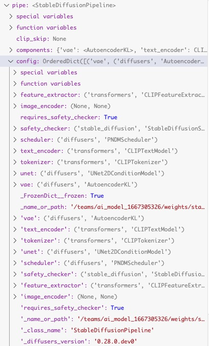    
另外config之外也有同名键，是真正起作用的    
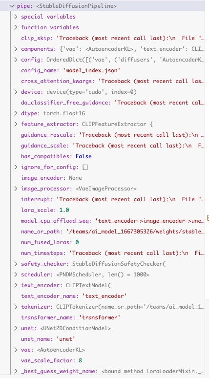    


# 库中集成方法

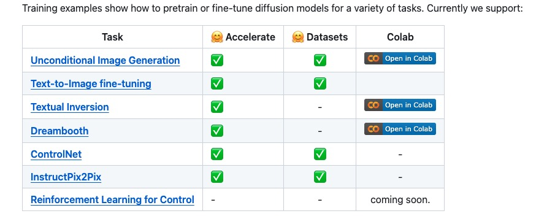

## Würstchen text-to-image fine-tuning

export DATASET_NAME="lambdalabs/naruto-blip-captions"


简而言之，LoRA 允许通过向现有权重添加成对的秩分解矩阵并仅训练那些新添加的权重来调整预训练模型。这有几个优点：

    先前预训练的权重保持冻结，以便模型不易发生灾难性遗忘。
    秩分解矩阵的参数比原始模型少得多，这意味着经过训练的 LoRA 权重很容易移植。
    LoRA 注意力层允许通过参数控制模型适应新训练图像的程度scale。

Würstchen: AN EFFICIENT ARCHITECTURE FOR LARGE-SCALETEXT-TO-IMAGE DIFFUSION MODELS

ICLR 2024 spotlight WURSTCHEN - 一个高效的大规模文本到图像扩散模型的架构

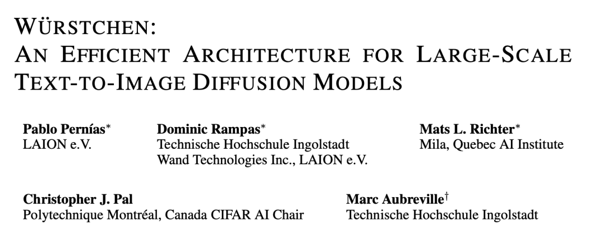


[Submitted on 1 Jun 2023 (v1), last revised 29 Sep 2023 (this version, v2)]
Wuerstchen: An Efficient Architecture for Large-Scale Text-to-Image Diffusion Models


我们工作的一个关键贡献是开发了一种潜在扩散技术，在该技术中我们学习了用于指导扩散过程的详细但极其紧凑的语义图像表示。与语言的潜在表示相比，这种高度压缩的图像表示提供了更详细的指导，这显着降低了实现最先进结果的计算要求。我们的方法还根据我们的用户偏好研究提高了文本条件图像生成的质量。我们的方法的训练要求包括 24,602 A100-GPU 小时 - 相比之下，Stable Diffusion 2.1 的训练要求为 200,000 GPU 小时。我们的方法还需要更少的训练数据来实现这些结果。此外，我们紧凑的潜在表示使我们能够以两倍以上的速度执行推理，从而显着削减最先进（SOTA）扩散模型的通常成本和碳足迹，而不会影响最终性能。在与 SOTA 模型的更广泛比较中，我们的方法效率明显更高，并且在图像质量方面也具有优势。我们相信这项工作会更加强调性能和计算可访问性的优先级。

这篇文章提出了一个高效的用于文本到图像生成模型架构，整体思路比较直白，在不损失图像生成质量的情况下，相比于现有T2I模型（SD1.4，SD2.1等）大大节约了成本。附录部分给了一些有趣的东西，比如FID的鲁棒性

和pixart一样`节省训练时间`思路     
不太提升质量   

整篇文章还有点疑惑，比如阶段B的训练，使用的模型；节省成本主要是在说C阶段？那A和B呢；256的潜在空间训练，不应该比SD在64的潜在空间训练更加成本高昂吗？看hf的权重大小，STAGE-A 296M，STAGE-B 3.4G， STAGE-C 3.97G好像和SD2.1的也差不多

更新1：附录D提到**“在我们的工作中，我们将阶段 C 视为模型的主要工作部分，当涉及到从文本中生成图像时”**。  
更新2：一定要看附录D！


    paper：https://arxiv.org/abs/2306.00637
    code：https://github.com/dome272/wuerstchen
    publication：ICLR 2024 Oral


Würstchen 是一个用于训练文本条件模型的新框架，通过将计算量大的文本条件阶段移动到高度压缩的潜在空间中。常见的方法使用单级压缩，而 Würstchen 则引入了另一个引入更多压缩的阶段。总的来说，我们有阶段 A 和 B 负责压缩图像，阶段 C 负责学习低维潜在空间中的文本条件部分。由此，Würstchen 实现了 42 倍的压缩系数，同时仍然忠实地重建图像。这使得阶段 C 的训练变得快速且计算成本低廉。我们参考该论文了解详细信息。


贡献

    我们提出了一种新的三阶段结构，用于强压缩比的文本图像合成，由两个条件潜在扩散阶段和一个潜在图像解码器组成。
    我们表明，通过在强压缩的潜在空间中使用文本条件扩散模型，我们可以在显着降低的训练成本和推理速度的情况下实现最先进的性能。
    我们提供了基于自动化指标和人工反馈的模型功效的综合实验验证。
    我们公开发布源代码和整套模型权重


训练

**Stage A：** 最初，训练一个 VQGAN。    
**StageB：** 阶段 B 被训练为阶段 A 的潜在空间内的扩散模型。阶段 B 以文本嵌入和语义压缩器的输出为条件，它产生同一图像的强烈下采样的潜在表示。    
**StageC：** 阶段 C 在语义压缩器作为文本条件 LDM 的潜在表示上进行训练，有效地以 42 : 1 的压缩比运行。（只有这个阶段需要重头训练）    


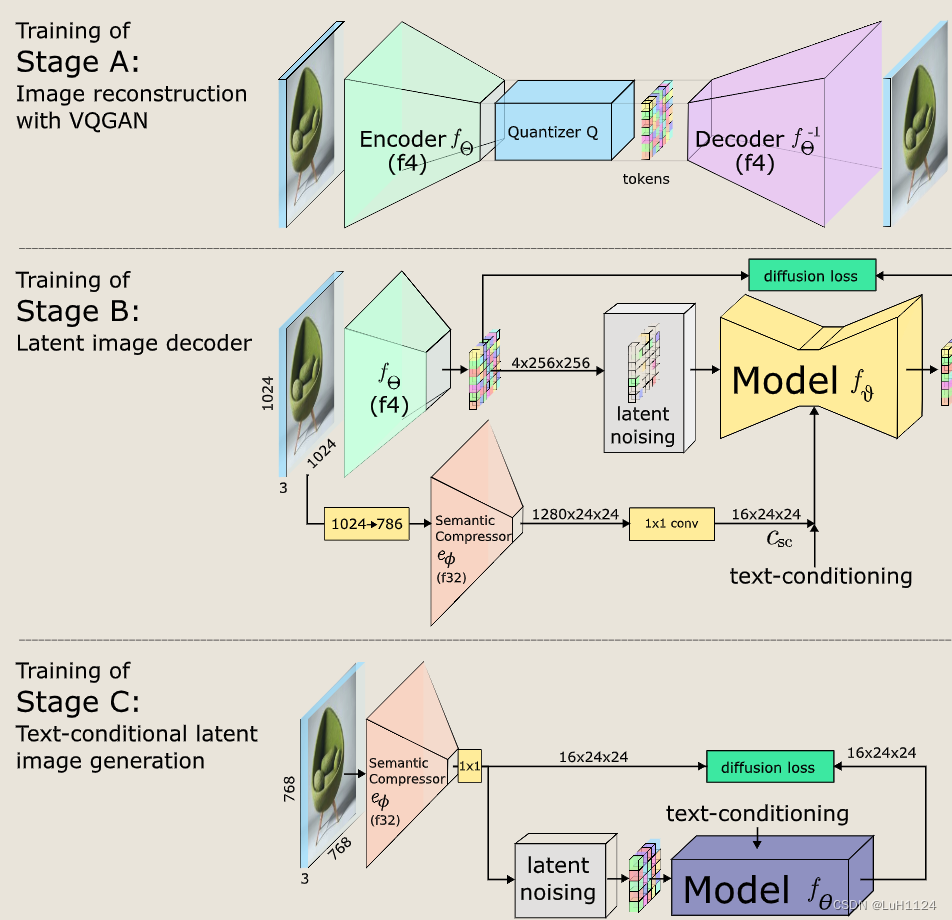


推理

    使用文本条件 LDM（阶段 C）以强压缩比生成潜在图像。(Text conditioning is applied on Stage C using CLIP-H )
    这种表示通过负责这种重建的次要模型转换为压缩较少的潜在空间（阶段 B）。
    对该中间分辨率中包含潜在图像的标记被解码以产生输出图像（阶段 A）。

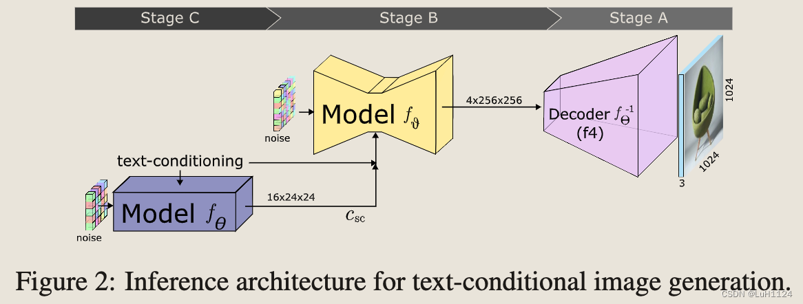


附录D

解决了疑问：

    在我们的工作中，我们将阶段 C 视为模型的主要工作部分，当涉及到从文本中生成图像时。
简要讨论阶段 B 和阶段 C 如何共享图像生成的工作量。通过这样做，我们证明了`阶段 C 负责图像的内容`，而`阶段 B 充当细化模型`，添加细节并提高分辨率，但最终不会以语义上有意义的方式更改图像。

        为了研究，我们训练了一个小（3.9M 参数）解码器来从阶段 C 产生的潜伏期重建图像，并将重建与以阶段 C 为条件的阶段 B 的重建进行了比较。图 17, 18, 19 和 20 中的结果表明，阶段 C 生成的图像与阶段 B 和 C 组合生成的图像非常相似。
        由此我们得出结论，阶段 C 是将文本转换为图像时的主要因素。这进一步得到了以下事实的支持：在替代训练机制上进行的简短实验表明，阶段 B 的文本调节并不能提高图像的质量，并且可以在未来几代中丢弃我们的模型。


## Amused training
Amused 可以相对便宜且快速地在简单数据集上进行微调。使用 8 位优化器、lora 和梯度累积，可以在低至 5.5 GB 的情况下对 amused 进行微调。以下是一些在一些相对简单的数据集上进行微调的示例。这些训练方法积极面向最少的资源和快速验证——即批量大小相当低，学习率相当高。为了获得最佳质量，您可能需要增加批量大小并降低学习率。

所有训练示例都使用 fp16 混合精度和梯度检查点。我们没有显示 8 位 adam + lora，因为它的内存使用量与仅使用 lora 的内存使用量大致相同（bitsandbytes 使用全精度优化器状态来处理低于最小大小的权重）。


## Community Pipeline Examples
社区管道示例包含社区已添加的管道。请查看下表以了解所有社区示例的概述。单击“代码示例”即可获取可供复制和粘贴的代码示例，您可以尝试一下。如果社区管道未按预期工作，请提出问题并 ping 作者。

使用方法    
from examples.community.pipeline_stable_diffusion_xl_differential_img2img import (
    StableDiffusionXLDifferentialImg2ImgPipeline,
)

### Long Prompt Weighting Stable Diffusion
Features of this custom pipeline:

Input a prompt without the 77 token length limit.
Includes tx2img, img2img. and inpainting pipelines.
Emphasize/weigh part of your prompt with parentheses as so: a baby deer with (big eyes)
De-emphasize part of your prompt as so: a [baby] deer with big eyes
Precisely weigh part of your prompt as so: a baby deer with (big eyes:1.3)
Prompt weighting equivalents:

    a baby deer with == (a baby deer with:1.0)
    (big eyes) == (big eyes:1.1)
    ((big eyes)) == (big eyes:1.21)
    [big eyes] == (big eyes:0.91)
    You can run this custom pipeline as so:

pytorch

    from diffusers import DiffusionPipeline
    import torch

    pipe = DiffusionPipeline.from_pretrained(
        'hakurei/waifu-diffusion',
        custom_pipeline="lpw_stable_diffusion",

        torch_dtype=torch.float16
    )
    pipe=pipe.to("cuda")

    prompt = "best_quality (1girl:1.3) bow bride brown_hair closed_mouth frilled_bow frilled_hair_tubes frills (full_body:1.3) fox_ear hair_bow hair_tubes happy hood japanese_clothes kimono long_sleeves red_bow smile solo tabi uchikake white_kimono wide_sleeves cherry_blossoms"
    neg_prompt = "lowres, bad_anatomy, error_body, error_hair, error_arm, error_hands, bad_hands, error_fingers, bad_fingers, missing_fingers, error_legs, bad_legs, multiple_legs, missing_legs, error_lighting, error_shadow, error_reflection, text, error, extra_digit, fewer_digits, cropped, worst_quality, low_quality, normal_quality, jpeg_artifacts, signature, watermark, username, blurry"

    pipe.text2img(prompt, negative_prompt=neg_prompt, width=512,height=512,max_embeddings_multiples=3).images[0]


### Wildcard Stable Diffusion
Following the great examples from https://github.com/jtkelm2/stable-diffusion-webui-1/blob/master/scripts/wildcards.py and https://github.com/AUTOMATIC1111/stable-diffusion-webui/wiki/Custom-Scripts#wildcards, here's a minimal implementation that allows for users to add "wildcards", denoted by __wildcard__ to prompts that are used as placeholders for randomly sampled values given by either a dictionary or a .txt file. For example:

Say we have a prompt:

prompt = "__animal__ sitting on a __object__ wearing a __clothing__"
We can then define possible values to be sampled for animal, object, and clothing. These can either be from a .txt with the same name as the category.


### Perturbed-Attention Guidance (PAG).
[2024年3月26日提交]
具有扰动注意力引导的自校正扩散采样
安东勋、赵亨源、珉元、张佑锡、金正宇、金善华、朴贤熙、金景焕、金胜龙
最近的研究表明，扩散模型能够生成高质量的样本，但其质量在很大程度上取决于采样引导技术，例如分类器引导（CG）和无分类器引导（CFG）。这些技术通常不适用于无条件生成或各种下游任务（例如图像恢复）。在本文中，我们提出了一种新颖的采样指导，称为扰动注意指导（PAG），它可以提高无条件和条件设置下的扩散样本质量，无需额外的训练或集成外部模块即可实现这一目标。 PAG 旨在在整个去噪过程中逐步增强样本的结构。它涉及通过用单位矩阵替换扩散 U-Net 中选定的自注意力图来生成结构退化的中间样本，考虑自注意力机制捕获结构信息的能力，并引导去噪过程远离这些退化样本。在 ADM 和稳定扩散中，PAG 令人惊讶地提高了有条件甚至无条件情况下的样本质量。此外，PAG 显着提高了无法充分利用 CG 或 CFG 等现有指导的各种下游任务的基线性能，包括具有空提示的 ControlNet 以及修复和去模糊等图像恢复。

### UnCLIP
稳定的UnCLIP	用于组合先前模型（从文本生成剪辑图像嵌入， UnCLIPPipeline "kakaobrain/karlo-v1-alpha"）和解码器管道（将剪辑图像嵌入解码为图像， StableDiffusionImageVariationPipeline "lambdalabs/sd-image-variations-diffusers"）的扩散管道。	稳定的UnCLIP	-	王瑞     
UnCLIP 文本插值管道	扩散管道，允许传递两个提示并生成图像，同时在两个提示的文本嵌入之间进行插值	UnCLIP 文本插值管道	-	纳迦·赛·阿比奈·德瓦林蒂     
UnCLIP 图像插值管道	扩散管道，允许传递两个图像/图像嵌入并在图像嵌入之间进行插值时生成图像


### 很多


## Kandinsky2.2 text-to-image fine-tuning
Kandinsky 2.2 包括一个根据文本提示生成图像嵌入的先前管道，以及一个根据图像嵌入生成输出图像的解码器管道。我们提供train_text_to_image_prior.py脚本train_text_to_image_decoder.py来向您展示如何根据您自己的数据集分别微调康定斯基先验模型和解码器模型。为了获得最佳结果，您应该微调先验模型和解码器模型。   
how to fine-tune the Kandinsky prior and decoder models separately based on your own dataset.     

笔记：

该脚本是实验性的。该脚本对整个模型进行微调，但模型经常会过度拟合并遇到灾难性遗忘等问题。建议尝试不同的超参数以获得数据集的最佳结果。


2024.1     
Kandinsky 3.0

（俄罗斯AI Forever研究团队）


论文：Kandinsky 3.0 Technical Report

Kandinsky 3.0 技术报告


简述：本文提出了Kandinsky 3.0，一个基于潜在扩散的大规模文本到图像生成模型，旨在提高图像生成的质量和真实性。该模型通过使用更大的U-Net主干网和文本编码器以及去除扩散映射进行改进。文中详细介绍了模型的架构、训练过程和生产系统，并强调了关键组件对提升模型质量的重要性。实验表明，Kandinsky 3.0在文本理解和特定领域表现上有所提升。


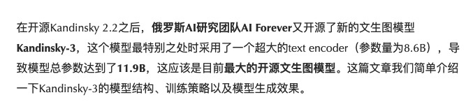

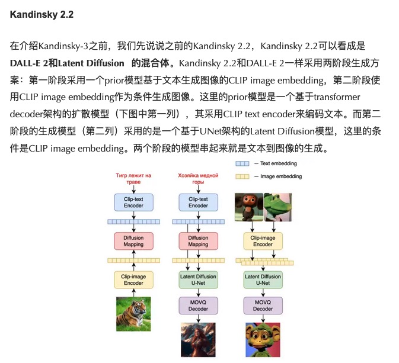

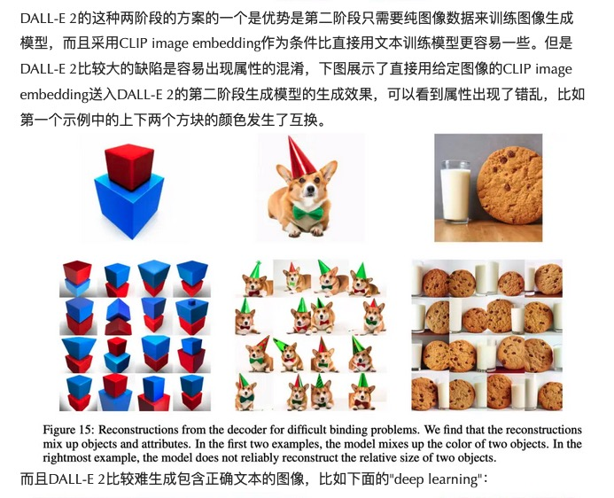

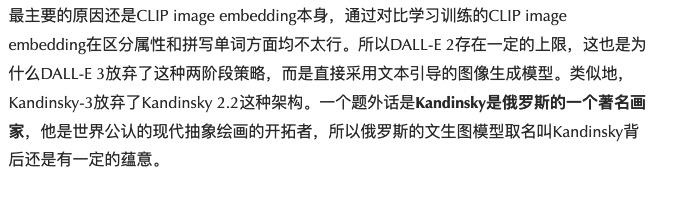

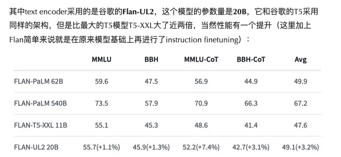

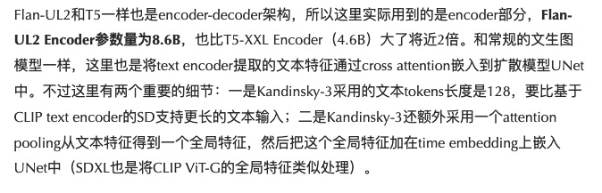

PixArt-Σ 使用T5并将token长度从120升级到300

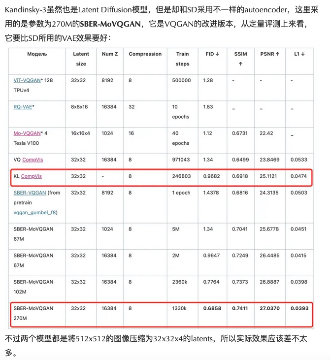

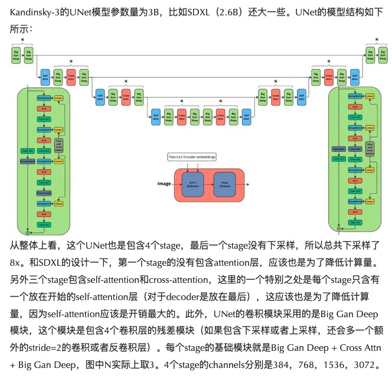

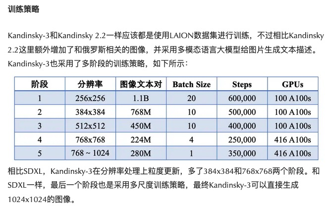


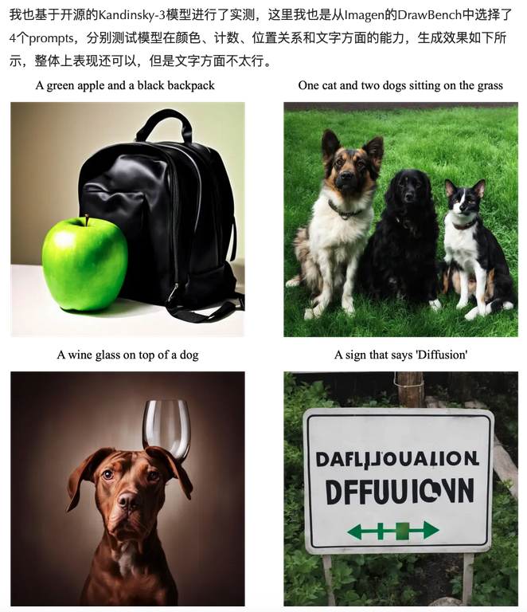

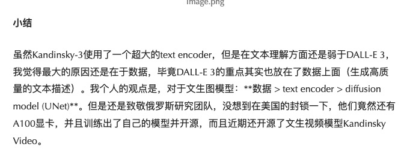


## reinforcement_learning
不太成熟


[Submitted on 20 May 2022 (v1), last revised 21 Dec 2022 (this version, v2)]   
Planning with Diffusion for Flexible Behavior Synthesis

灵活行为综合的扩散规划   
迈克尔·詹纳、杜一伦、约书亚·B·特南鲍姆、谢尔盖·莱文   
基于模型的强化学习方法通​​常仅将学习用于估计近似动态模型，将其余决策工作卸载给经典轨迹优化器。虽然概念上很简单，但这种组合存在许多经验缺陷，表明学习模型可能不太适合标准轨迹优化。在本文中，我们考虑将尽可能多的轨迹优化管道折叠到建模问题中会是什么样子，这样从模型中采样并用它进行规划变得几乎相同。我们技术方法的核心在于通过迭代去噪轨迹进行规划的扩散概率模型。我们展示了如何将分类器引导的采样和图像修复重新解释为连贯的规划策略，探索基于扩散的规划方法的不寻常且有用的属性，并证明我们的框架在强调长期决策和控制设置的控制设置中的有效性。测试时间的灵活性。

这些示例展示了如何在 Diffusers 中运行Diffuser 。有两种使用脚本的方法run_diffuser_locomotion.py。

关键选项是变量的更改n_guide_steps。当 时n_guide_steps=0，轨迹是从扩散模型中采样的，但未进行微调以最大化环境中的奖励。默认情况下，n_guide_steps=2与原始实现相匹配。


## T2I-Adapter
已经被cn全面取代     


We don't yet support training T2I-Adapters on Stable Diffusion yet. For training T2I-Adapters on Stable Diffusion XL, refer here.


T2I-Adapter: 让马良之神笔（扩散模型）从文本生成图像更加可控

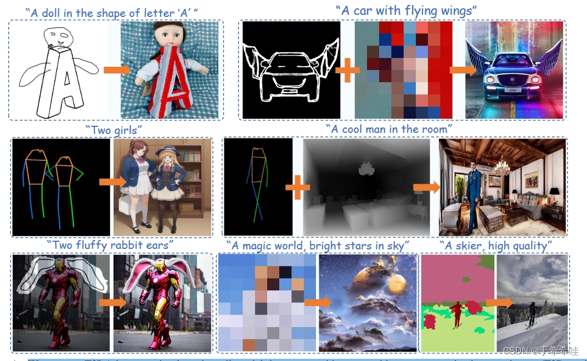


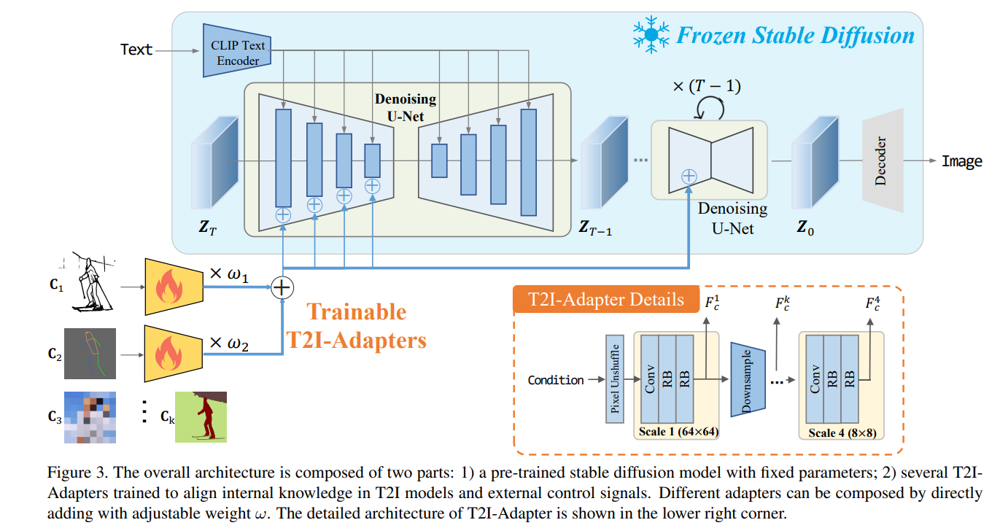


T2I 适配器由四个特征提取块和三个用于改变特征分辨率的下采样块组成。


## unconditional diffusion model


## research_projects

### Diffusion Model Alignment Using Direct Preference Optimization
使用直接偏好优化的扩散模型对齐    
dpo    
该目录提供了Bram Wallace、Meihua Dang、Rafael Rafailov、Linqi Zhou、Aaron Lou、Senthil Purushwalkam、Stefano Ermon、Caiming Xiong、Shafiq Joty 和 Nikhil Naik 在《使用直接偏好优化的 DiffusionModel Alignment》中提出的 Diffusion DPO 的 LoRA实现。

我们提供稳定扩散 (SD) 和稳定扩散 XL (SDXL) 的实现。原始检查点可通过以下 URL 获取：


### diffusion_orpo
[2024年3月12日提交（v1），最后修订于2024年3月14日（本版本，v2）]    
ORPO：没有参考模型的整体偏好优化    
洪志宇、诺亚·李、詹姆斯·索恩     
虽然最近的语言模型偏好对齐算法已经展示了有希望的结果，但监督微调（SFT）对于实现成功收敛仍然至关重要。在本文中，我们研究了 SFT 在偏好对齐背景下的关键作用，强调对不受欢迎的生成方式进行较小的惩罚对于偏好对齐的 SFT 来说就足够了。在此基础上，我们引入了一种简单且创新的无参考模型的整体比值比偏好优化算法 ORPO，消除了额外的偏好调整阶段的必要性。我们从经验和理论上证明，优势比是在 SFT 期间对比从 125M 到 7B 的不同大小的受欢迎和不受欢迎风格的明智选择。具体来说，仅在 UltraFeedback 上使用 ORPO 微调 Phi-2 (2.7B)、Llama-2 (7B) 和 Mistral (7B) 就超越了超过 7B 和 13B 的最先进语言模型的性能参数：实现高达12.20%羊驼毛评估2.0（图 1），IFEval 为 66.19%（指令级松散，表 6），MT-Bench 为 7.32（图 12）。我们发布了 Mistral-ORPO 的代码和模型检查点-A(7B) 和米斯特拉尔-ORPO-乙(7B)。


该项目试图检查是否可以在文本条件扩散模型上应用ORPO ，以便在没有参考模型的情况下将其与偏好数据对齐。该实现基于Huggingface/trl#1435。

警告

我们假设扩散公式中的 MSE 近似于 ORPO 要求的对数概率（向@kashif致敬）。因此，请认为这是非常实验性的。


### Dreambooth for the inpainting model
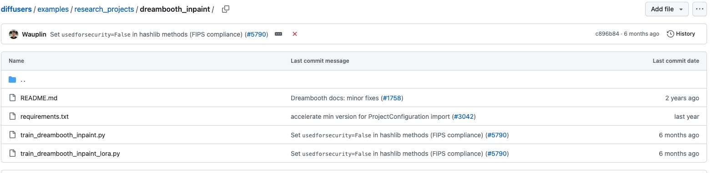


### Multi Subject Dreambooth for Inpainting Models

该项目由两部分组成。训练稳定扩散进行修复需要提示-图像-掩模对。修复模型的 Unet 有 5 个额外的输入通道（4 个用于编码蒙版图像，1 个用于蒙版本身）。

第一部分，即multi_inpaint_dataset.ipynb笔记本，演示了如何制作提示-图像-掩码对的 🤗 数据集。但是，您可以跳过第一部分，直接转到包含本项目中的示例数据集的第二部分。 （猫玩具数据集被屏蔽，土豆先生头数据集被屏蔽）

第二部分是train_multi_subject_inpainting.py训练脚本，演示如何为一个或多个主题实施训练程序并使其适应修复的稳定


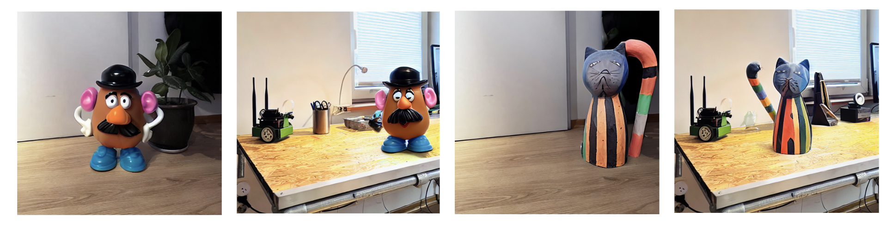


    export MODEL_NAME="runwayml/stable-diffusion-inpainting"
    export OUTPUT_DIR="path-to-save-model"

    export DATASET_1="gzguevara/mr_potato_head_masked"
    export DATASET_2="gzguevara/cat_toy_masked"
    ... # Further paths to 🤗 datasets

    accelerate launch train_multi_subject_dreambooth_inpaint.py \
    --pretrained_model_name_or_path=$MODEL_NAME  \
    --instance_data_dir $DATASET_1 $DATASET_2 \
    --output_dir=$OUTPUT_DIR \
    --resolution=512 \
    --train_batch_size=1 \
    --gradient_accumulation_steps=2 \
    --learning_rate=3e-6 \
    --max_train_steps=500 \
    --report_to_wandb


### RealFill

[Submitted on 28 Sep 2023]
RealFill: Reference-Driven Generation for Authentic Image Completion


生成图像的最新进展带来了修复和修复模型，这些模型可以在未知区域生成高质量、可信的图像内容，但这些模型幻觉的内容必然是不真实的，因为这些模型缺乏关于真实场景的足够背景。在这项工作中，我们提出了 RealFill，这是一种新颖的图像补全生成方法，可以用本应存在的内容填充图像的缺失区域。 RealFill 是一种生成修复模型，仅使用场景的一些参考图像即可实现个性化。这些参考图像不必与目标图像对齐，并且可以使用截然不同的视点、照明条件、相机光圈或图像风格来拍摄。一旦个性化，RealFill 就能够完成具有视觉上引人注目的内容且忠实于原始场景的目标图像。我们在新的图像完成基准上评估 RealFill，该基准涵盖了一系列多样化且具有挑战性的场景，并发现它大幅优于现有方法。在我们的项目页面上查看更多结果


RealFill是一种个性化文本到图像修复模型的方法，例如仅给定场景的几张（1~5）图像的稳定扩散修复。该train_realfill.py脚本展示了如何实施稳定扩散修复的训练过程。


### 很多


# 结尾