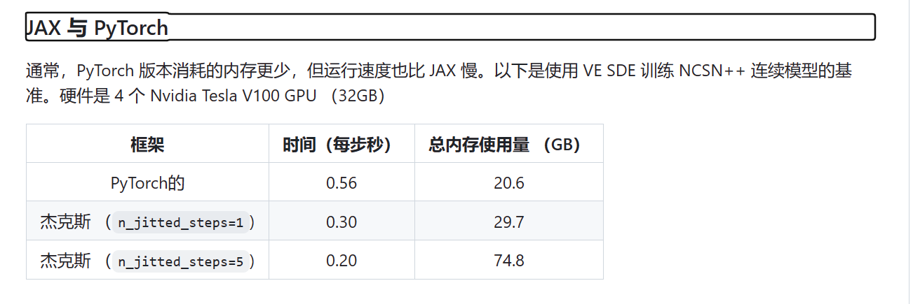

# original DDPM implementation

https://github.com/hojonathanho/diffusion

TPU

TensorFlow 

# PyTorch DDPM implementation
https://github.com/pesser/pytorch_diffusion

# DDIM implementation
https://github.com/ermongroup/ddim

https://github.com/ermongroup/ncsnv2 (code structure).    
Improved Techniques for Training Score-Based Generative Models

# Generative Modeling by Estimating Gradients of the Data Distribution
[Submitted on 12 Jul 2019 (v1), last revised 10 Oct 2020 (this version, v3)]        
Generative Modeling by `Estimating Gradients of the Data Distribution `      

NCSN    

我们引入了一种新的生成模型，其中通过`Langevin动力学`使用通过`分数匹配估计的数据分布梯度`来生成样本。由于`当数据驻留在低维流形上时，梯度可能定义不清且难以估计，因此我们用不同级别的高斯噪声扰动数据，并共同估计相应的分数`，即所有噪声水平的扰动数据分布梯度的向量场。      
Because gradients can be ill-defined and hard to estimate when the data resides on low-dimensional manifolds, we perturb the data with different levels of Gaussian noise, and jointly estimate the corresponding scores, i.e., the vector fields of gradients of the perturbed data distribution for all noise levels.

对于采样，我们提出了一种退火的Langevin动力学，其中我们使用梯度，当采样过程接近数据流形时，噪声水平逐渐降低。    
For sampling, we propose an annealed Langevin dynamics where we use gradients corresponding to gradually decreasing noise levels as the sampling process gets closer to the data manifold.

Our framework allows flexible model architectures, requires no sampling during training or the use of adversarial methods, and provides a learning objective that can be used for principled model comparisons.     
我们的框架允许灵活的模型架构，在训练或使用对抗性方法时不需要采样，并提供了一个可用于原则性模型比较的学习目标。我们的模型在 MNIST、CelebA 和 CIFAR-10 数据集上生成的样本与 GAN 相当，在 CIFAR-10 上获得了 8.87 分的最新初始得分。此外，我们证明了我们的模型通过图像修复实验学习有效的表示。

Additionally, we demonstrate that our models learn effective representations via image inpainting experiments.

# Improved Techniques for Training Score-Based Generative Models
[Submitted on 16 Jun 2020 (v1), last revised 23 Oct 2020 (this version, v2)]     

NCSNv2 

https://github.com/ermongroup/ncsnv2

Improved Techniques for Training Score-Based Generative Models

by Yang Song and Stefano Ermon, Stanford AI Lab.

改进了训练基于分数的生成模型的技术

基于分数的生成模型可以生成与 GAN 相当的高质量图像样本，`而无需对抗性优化`。但是，现有的训练程序仅限于低分辨率的图像（通常低于 32x32），并且在某些设置下可能不稳定。我们提供了一种新的理论分析，从高维空间的分数模型中学习和抽样，解释了现有的故障模式，并激发了跨数据集泛化的新解决方案。为了增强稳定性，我们还建议保持模型权重的指数移动平均线。通过这些改进，我们可以`毫不费力地将基于分数的生成模型扩展到分辨率从 64x64 到 256x256 的前所未有的图像`。我们基于分数的模型可以生成高保真样本，`在各种图像数据集（包括 CelebA、FFHQ 和多个 LSUN 类别）上与一流的 GAN 相媲美`。

在加速推理的turbo流中，又将对抗优化引了回来，想要快速。从统一视角讲，加速方案是一致的，但这样说回来就没有优化进步的任何期望和前景了       

当初的GAN应该也能用来做快速渲染，生视频吧。    
不知道以前有没有cn类的框架，应该也有吧     
从前不可考，大多重复，包括现在的自己，抄别人，抄过去，都在抄啊       

We significantly improve the method proposed in `Generative Modeling by Estimating Gradients of the Data Distribution.`

我们通过估计数据分布的梯度显着改进了生成建模中提出的方法。基于分数的生成模型是灵活的神经网络，经过训练可以捕获基础数据分布的分数函数，即指向数据密度增长最快的方向的向量场。我们提出了提高基于分数的生成模型性能的新技术，将它们缩放到以前不可能的高分辨率图像。无需对抗性训练，它们可以产生与 GAN 相媲美的清晰多样的图像样本。

 they can produce sharp and diverse image samples that rival GANs

Note: The method has been extended by the subsequent work Score-Based Generative Modeling through Stochastic Differential Equations (code) that allows better sample quality and exact log-likelihood computation.

子集计算

Computing FID values quickly for a range of checkpoints      
We can specify and under the group in the configuration file. For example, by running the following command, we can generate a small number of samples per checkpoint within the range - for a quick (and rough) FID evaluation.        begin_ckptend_ckptfast_fidbegin_ckptend_ckpt

python main.py --fast_fid --config bedroom.yml -i bedroom

# Score-Based Generative Modeling through Stochastic Differential Equations
Score-VE and Score-VP implementations   
https://github.com/yang-song/score_sde     

请在此处找到一个 PyTorch 实现，它支持除使用预训练分类器生成类条件之外的所有内容。     
https://github.com/yang-song/score_sde_pytorch   

arxiv    
[Submitted on 26 Nov 2020 (v1), last revised 10 Feb 2021 (this version, v2)]     
Score-Based Generative Modeling through Stochastic Differential Equations

ICLR     
Published: 13 Jan 2021, Last Modified: 03 Apr 2024            
ICLR 2021 Oral        

从数据中产生噪音很容易;从噪声创建数据是生成式建模。我们提出了一个随机微分方程（SDE），它通过缓慢注入噪声将复杂的数据分布平滑地转换为已知的先验分布，以及相应的反向时间SDE，通过缓慢去除噪声将先验分布转换回数据分布。至关重要的是，逆时 SDE 仅取决于扰动数据分布的瞬态梯度场（\aka，分数）。通过利用基于分数的生成建模的进步，我们可以使用神经网络准确估计这些分数，并使用数值 SDE 求解器生成样本。我们表明，该框架封装了基于分数的生成建模和扩散概率建模中的先前方法，允许新的采样程序和新的建模功能。特别是，我们引入了一个预测器-校正器框架来校正离散化逆时间SDE演化过程中的误差。我们还推导出了一个等效的神经常微分方程，该常微分方程从与 SDE 相同的分布中采样，但还可以实现精确的似然计算，并提高采样效率。此外，我们还提供了一种使用基于分数的模型求解逆问题的新方法，正如类条件生成、图像修复和着色实验所证明的那样。结合多项架构改进，我们在 CIFAR-10 上实现了创纪录的无条件图像生成性能，初始得分为 9.89，FID 为 2.20，竞争可能性为 2.99 位/暗，并首次展示了基于分数的生成模型生成 1024 x 1024 图像的高保真度。

我们提出了一个统一的框架，通过随机微分方程（SDE）的视角来概括和改进以前关于基于分数的生成模型的工作。特别是，我们可以将数据转换为简单的噪声分布，并具有由SDE描述的连续时间随机过程。如果我们知道每个中间时间步的边际分布分数，则可以反转此 SDE 以生成样本，这可以通过分数匹配进行估计。基本思想如下图所示：    
We propose a unified framework that generalizes and improves previous work on score-based generative models through the lens of stochastic differential equations (SDEs). In particular, we can transform data to a simple noise distribution with a continuous-time stochastic process described by an SDE. This SDE can be reversed for sample generation if we know the score of the marginal distributions at each intermediate time step, which can be estimated with score matching. The basic idea is captured in the figure below:

除了本文中的 NCSN++ 和 DDPM++ 模型外，该代码库还在一个地方重新实现了许多以前基于分数的模型，包括来自 Generative Modeling by Estimating Gradients of the Data Distribution 的 NCSN、来自 Improved Techniques for Training Score-Based Generative Models 的 NCSNv2 和 Denoising Diffusion Probabilistic Models 的 DDPM。

它支持训练新模型，评估样本质量和现有模型的可能性。我们精心设计了模块化的代码，并且易于扩展到新的 SDE、预测器或校正器。

新的 SDE：固有的抽象类并实现所有抽象方法。该方法是可选的，默认值为 Euler-Maruyama 离散化。现有的抽样方法和似然计算将自动适用于这个新的 SDE。sde_lib.SDEdiscretize()    
新的预测变量：固有的抽象类，实现抽象方法，并将其名称注册为 。新的预测变量可以直接用于预测变量-校正变量采样，以及 中的所有其他可控生成方法。sampling.Predictorupdate_fn@register_predictorsampling.get_pc_samplercontrollable_generation.py     
新的校正器：抽象类固有，实现抽象方法，并将其名称注册为 。新的校正器可以直接用于 ，所有其他可控生成方法都可以用于 。sampling.Correctorupdate_fn@register_correctorsampling.get_pc_samplercontrollable_generation.py     

感觉这上面展示的图像比sd1.5还好      
普通人最直观的评价就是好     

使用 JAX 代码库时，您可以将多个训练步骤组合在一起，以提高训练速度，但代价是占用更多的内存。

 (signal-to-noise ratio)（信噪比）参数在某种程度上表现得像温度参数。较大的，样品通常更平滑，而较小，样品则更多样化但质量更低。的典型值是 ，它需要调整才能达到最佳状态。     snrLangevinCorrectorsnrsnrsnr0.05 - 0.2
对于 VE SDE，我们建议选择训练数据集中数据样本之间的最大成对距离。config.model.sigma_max    

For VE SDEs, we recommend choosing to be the maximum pairwise distance between data samples in the training dataset.

如果说作弊，snr是作弊，      
逆向采样根据数据的epsilon scale减少方差也是作弊    
什么叫作弊      
很多东西其实是有助于训练的      
并且给你开卷作弊你也很难回答正确，    
过拟合是相对的     

This work is built upon some previous papers which might also interest you:

Song, Yang, and Stefano Ermon. "Generative Modeling by Estimating Gradients of the Data Distribution." Proceedings of the 33rd Annual Conference on Neural Information Processing Systems. 2019.   
Song, Yang, and Stefano Ermon. "Improved techniques for training score-based generative models." Proceedings of the 34th Annual Conference on Neural Information Processing Systems. 2020.        
Ho, Jonathan, Ajay Jain, and Pieter Abbeel. "Denoising diffusion probabilistic models." Proceedings of the 34th Annual Conference on Neural Information Processing Systems. 2020.

# 结尾

