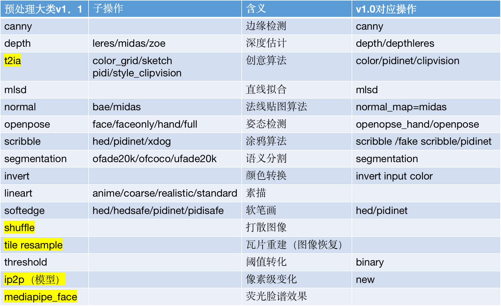

人脸mask inpainting instant-id face-id      
layerdiffusion      
Steps: 20, Sampler: DPM++ 2M Karras, CFG scale: 7       
scribble to image       
lyrasd腾讯音乐天琴实验室MUSELight大模型推理加速引擎 类比pytorch xformer tensorrt    
SDXL-LCM-LORA   
打标 Img2Tags Danbooru RAM Mini GPT-4 moondream  

controlnet outpainting
https://github.com/Mikubill/sd-webui-controlnet/discussions/1464    
https://github.com/Mikubill/sd-webui-controlnet/discussions/1597    
photopea outpainting
https://github.com/yankooliveira/sd-webui-photopea-embed    
stablityAI uncrop
https://clipdrop.co/uncrop  
Adobe firefly Generative fill
https://firefly.adobe.com/upload/inpaint    
Photoshop Generative fill   
Midjourney zoomout
https://docs.midjourney.com/docs/zoom-out   

1.Control Net v1.1      
Canny softedge_hed lineart_anime lineart_coarse  
invert  
mediapip_face  
threshold  
t2ia_grid_color  
normal_bae   
mlsd  
   

tags2text   
haiyi   
scenex自然语言对sd控制效果可能欠佳      
waifu 2tag   
text caps       

prompt评价指标  
中文语言下  
自然语言：用jieba分词后，计算NLG指标，包括BLEU、METEOR、ROUGE、CIDER等
tag：用jieba分词，预处理去掉“的”、“，”等无关词后，计算BLEU-1即可    
英语语言下  
自然语言：直接用NLG指标 
tag：用nltk词形还原，拼接单词，用逗号分割，获得原始短语，计算BLEU-1指标     

Animatediff lightning  
onediff     
SDXL-Lightning 效果尚可，但和SDXL-Base仍有一定差距  

[火] InstantID Mutil-ControlNet测试

[休假] 小结：
1、softedge 基本没用，效果太差
2、openpose效果也一般，权重调高可以对齐部分姿势
3、depth效果较好，基本可以还原参考图的姿势，但权重不能太高
4、canny效果也不错，接近depth的效果
5、onediif目前不支持IPAdapter

PeRFlow [休假] 测试下来没什么用，首先无法适配C站上的模型  
Mutil-LoRA  
TCD(Trajectory Consistency Distillation)    
ToDo / ToMe     

RPG-DiffusionMaster 需要先推理LLMs  
MJ v6       
● X-Adapter 是一种通用升级器，旨在使预训练的插件模块（例如 ControlNet、LoRA 等）能够直接与升级后的文本到图像扩散模型（例如 SDXL）兼容，而无需进一步的重新训练。
● 这一目标是通过训练一个额外的网络来实现的，该网络控制着升级后模型，并使用新的文本-图像数据对。具体来说，X-Adapter 保留了旧模型的冻结副本，以保留不同插件的连接器。     

StableCascade   
[休假] 图片质量上，对比SDXL-Base效果更好，但某些提示词下效果很差
[休假] 推理速度和显存消耗方面同样的steps下相差不大
[休假] 不能兼容SDXL的LoRA和ControlNet       

Concept Sliders     
TextDiffuser-2  
[休假] 测试效果很一般，目前还只能生成512x512的图片
[休假] 生成的图片质量比较低，而且稍微复杂点的提示词就不能正常生成文字了     

AnyText测试 
[休假] 测试效果很不错，但目前只能生成<=768分辨率的图片  
[休假] 图片编辑对于复杂的字体效果不行，这一点UDiffText更好一些  
[休假] 提供了两种方式生成文字，一种是使用prompt和绘制位置（可选），另一种是使用inpainting的方式
[休假] 仅使用prompt而不绘制位置的效果有时候很差

UDiffText   
[休假] 目前只能使用Inpainting方式生成文字，效果还可以
[休假] 能生成数字和英文，生成特殊字符效果较差
[休假] 生成平行或者稍弯曲的文字效果还行，竖直和倾斜效果很差
[休假] 生成文字的风格无法控制，但与涂抹的区域风格有关    
利用字符级 (CL) 文本编码器从要渲染的文本中获得稳健的嵌入。使用去噪得分匹配（DSM）以及基于字符级分割图计算的局部注意力损失和辅助场景文本识别损失来训练模型。训练期间仅更新交叉注意（CA）块的参数。   

PIA  
[休假] 通过输入单张图像 + 提示词 生成短视频，效果一般   

i2vgen-xl

SCEdit  
SCEdit效果要优于Drambooth LoRA微调方法   

AnimateDiff + ControlNet 测试       

ZipLoRA     
非官方实现无法支持Kohya脚本训练得出的LoRA模型，只能支持diffusers的脚本训练的LoRA   

LCM-LoRA蒸馏        

MagicAnimate    

LCM&TurboMix LoRA

LaVie  
[休假] 效果不如SVD，细节画面波动比较明显  
Style-aligned   

Multi-LoRA-Composition  
OMG Occlusion-friendly Personalized Multi-concept Generation in Diffusion Models   

AniPortrait 
VideoBooth  
MotionCtrl + SVD    
AnimateLCM-SVD-xt   
AnimateAnyone-reproduction  
prompt → SD1.5/SDXL → image → SVD → video   
champ   
DragNUWA        
Haiper  
MagicDance  
DynamiCrafter   

