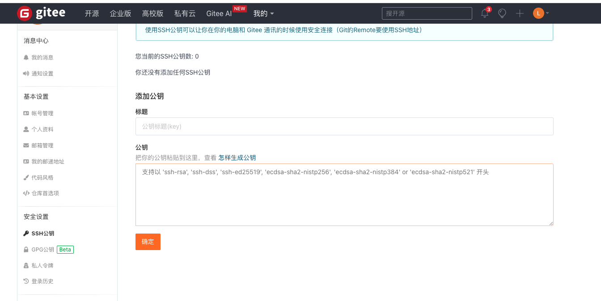

终端操作
# ssh私钥公钥配置
ssh-keygen -t rsa

支持以 'ssh-rsa', 'ssh-dss, 'ssh-ed25519', 'ecdsa-sha2-nistp256', 'ecdsa-sha2-nistp384'or 'ecdsa-sha2-nistp521' 开头

ls /root/.ssh    
私钥自动调用id_rsa_lu      
公钥id_rsa_lu.pub     

git clone git@gitee.com:btc8/sd-webui-ic-light.git

# 推拉

## 一般推拉法1
git clone git@gitee.com:btc8/sd-webui-ic-light.git

git add .    
把所有修改过的文件暂存,准备提交    
git status   
查看当前代码相比远程仓库有哪些修改。    
git commit -m ""     
git push

## 法2
如果是第一次推送代码到远程仓库,需要先添加远程仓库地址,使用如下命令:     
git remote add origin 远程仓库地址    
如果是pull来的就不用了

和方法1的差别，在于先创建仓库。

    $ git init     
    $ git remote add origin https://gitee.com/用户个性地址/HelloGitee.git

这样就完成了版本的一次初始化。
接下去，进入你已经初始化好的或者克隆仓库的目录,然后执行：

    $ git pull origin master

修改/添加文件，否则与原文件相比就没有变动。

    $ git add .
    $ git commit -m "第一次提交"
    $ git push origin master

在新建仓库时，如果在 Gitee 平台仓库上已经存在 readme 或其他文件，在提交时可能会存在冲突，这时用户需要选择的是保留线上的文件或者舍弃线上的文件，如果您舍弃线上的文件，则在推送时选择强制推送，强制推送需要执行下面的命令(默认不推荐该行为)：

    $ git push origin master -f
如果您选择保留线上的 readme 文件,则需要先执行：

    $ git pull origin master

## 强制覆盖
git reset --hard    
git pull

暂存本地修改   
git stash     
这将暂时保存您本地的修改,让您有一个干净的工作区用于pull操作。之后您可以使用git stash pop来重新应用您的修改。

手动合并冲突

暂时不做其他操作,手动编辑存在冲突的文件,解决代码冲突。解决后再次git add暂存,git commit提交。最后git pull拉取远程代码,Git会尝试合并本地提交和远程修改。    
一般来说,暂存本地修改或手动合并是比较保险的做法,除非您确定不需要保留本地代码修改。在团队协作时,保持代码同步很重要,但也要小心不要覆盖别人的修改。

## 查看版本差异

### git diff 

比较工作区与特定提交之间的差异    
git diff 77616e54217ade76529e2384394d56fdd302a2a0   
对id查看该提交所做修改

比较工作区与上次提交之间的差异     
git diff

比较两个提交之间的差异   
git diff 旧的提交ID 新的提交ID  

查看某个文件的修改    
git diff 提交ID 文件路径     
可以只查看单个文件在不同版本之间的变化差异。

### git log
git log 查看提交记录和id 

查看指定数量的日志   
git log -n 3     
加上 -n 参数后面加数字,可以指定只展示最近 n 次的提交日志。   

查看精简的提交 ID 日志   
git log --oneline     
这个命令会以精简的一行格式展示提交日志,每一行最前面的字符串就是提交 ID。

## 分支
git remote -v     
git push --set-upstream origin master      
如果是新建的分支,需要先将本地分支与远程分支关联   

要查看当前所在的 Git 分支，可以使用以下命令：

git branch

    * base_on_patcher
    master

查看所有远程和本地分支：

git branch -a

切换到另一个分支：

git checkout branch-name

创建并切换到新分支：

git checkout -b new-branch-name

删除本地分支：

git branch -d branch-name

删除远程分支：

git push origin --delete branch-name

### 创建和push新分支
git clone https://github.com/your-username/your-repository.git    
cd your-repository    
创建新分支   
创建一个新分支，并切换到该分支。假设新分支的名字为 new-feature：   
git checkout -b new-feature    
将修改的文件添加到暂存区：    
git add .      
提交你的修改，并添加提交信息：     
git commit -m "Add new feature or fix something"     
推送新分支到远程仓库    
将新分支推送到远程仓库：    
git push origin new-feature   

8. 创建 Pull Request（可选）   
推送后，你可以到 GitHub 上打开你的仓库，并创建一个 Pull Request，从新分支 new-feature 合并到主分支（通常是 main 或 master）。

### 互换分支名字
    # 获取最新的远程分支
    git fetch origin

    # 切换到 main 分支并获取最新的更新
    git checkout main
    git pull origin main

    # 将 main 分支重命名为 old-main
    git branch -m main old-main

    # 将 new-feature 分支重命名为 main
    git branch -m new-feature main

    # 强制推送新的 main 分支到远程仓库
    git push -f origin main

    # 确保远程仓库的 HEAD 指向新的 main 分支
    git push origin --delete main
    git push origin main

    # 删除远程的 old-main 分支
    git push origin --delete old-main

你就成功地将远程的 main 分支与 new-feature 分支互换了。注意，强制推送（git push -f）可能会覆盖远程分支的历史记录，因此请谨慎使用，并确保所有团队成员知晓这一更改。

修改分支名称并不会变更你或仓库其他成员本地的代码分支，请使用以下命令对你的本地仓库分支进行变更：

    git branch -m master <BRANCH>
    git fetch origin
    git branch -u origin/<BRANCH>
    git remote set-head origin -a

这就麻烦了   
还是别改了    

分支保护是为了防止相关成员推送代码到重要的分支（例如 master 分支），便于仓库的分支管理，点击前往分支设置管理保护分支规则。

    常规分支：仓库成员（开发者权限及以上）可推送分支
    保护分支：可自定义保护策略，默认仓库管理员才能管理（推送）被保护的分支
    只读分支：任何人都无法推送代码（包括管理员和所有者），需要推送代码时应设为“常规”或“保护”分支

### 拉取原地更新
git clone https://github.com/username/repository.git    
cd repository    
获取所有远程分支  
更新本地的远程分支信息：      
git fetch origin      
切换到dev分支    
如果分支已经存在于本地，你可以直接切换到dev分支：     
git checkout dev     
如果dev分支在本地还不存在，可以使用以下命令创建并切换到dev分支：    
git checkout -b dev origin/dev      
git pull origin dev     

git branch 查看本地已有分支

获取远程分支列表    
使用 git branch -r 命令查看远程仓库中的所有分支：

获取所有分支列表（包括本地和远程分支）    
使用 git branch -a 命令查看本地和远程所有分支：

  
获取详细信息    
要查看远程分支的详细信息，可以使用 git ls-remote 命令：

### 直接克隆dev分支
是的，你可以在克隆仓库的时候直接指定克隆dev分支。这样做可以避免克隆整个仓库的默认分支（通常是main或master），然后再切换分支。使用--branch选项可以直接克隆指定的分支。以下是具体的命令：    
git clone --branch dev <repository-url>

### origin

在运行 git push 命令时,不加任何参数的话,Git 会尝试将代码推送到 origin 远程仓库

git push origin 分支名

在 Git 中, origin 是一个默认的远程仓库名称。

git remote add origin https://github.com/user/repo.git     
这条命令会将 https://github.com/user/repo.git 设置为一个远程仓库,并默认将其命名为 origin。

当然,origin 只是一个默认的别名而已,你可以用 git remote rename 命令将其重命名为其他名字。有些人也会为不同的远程仓库设置不同的名称,而不使用 origin。

### changes

    # 查看所有本地分支
    git branch

    # 切换到指定的分支
    git checkout 分支名

    git pull   
    拉最新

git checkout -b dev origin/dev
error: Your local changes to the following files would be overwritten by checkout:
        modules/processing.py
        modules/scripts.py
Please commit your changes or stash them before you switch branches.
Aborting

如果你想暂时保存当前的更改，可以使用 git stash 命令。这样可以在不提交的情况下保存更改，并切换到其他分支：

暂存更改：

git stash

切换到 dev 分支：

git checkout -b dev origin/dev

恢复暂存的更改（可选，如果你想在新分支上应用这些更改）：

git stash pop

选项 3: 丢弃本地更改
如果你确定不需要保留当前更改，可以丢弃它们：

丢弃本地更改：

git reset --hard
切换到 dev 分支：

git checkout -b dev origin/dev

查看工作区中的更改  
使用 git status 查看当前工作区中的更改状态：

这将显示哪些文件被修改、添加或删除了。

查看具体的更改内容    
使用 git diff 查看具体的更改内容。它会显示未暂存的更改：

查看已暂存的更改   
如果你已经使用 git add 暂存了一些更改，可以使用以下命令查看已暂存的更改：

git diff --cached

查看所有更改（包括未暂存和已暂存）
使用 git diff HEAD 查看相对于最新提交的所有更改，包括已暂存和未暂存的更改：

在使用 git diff 查看更改时，Git 通常会将输出发送到一个分页器（如 less），以便你可以方便地滚动查看内容。当你完成查看并希望退出分页器时，可以按以下键：

退出分页器
按 q 键：这将退出 less 或其他分页器，返回到命令行提示符。

# .gitignore

## .gitignore不能删去远端已有文件

git rm --cached .DS_Store     
git commit -m "Remove .DS_Store from repository"      
git push

## 通用配置

    **/__pycache__

这样可以把文件夹中的__pycache__文件夹忽略，并且子文件夹中的__pycache__也一并忽略。

*.py[cod]通配符表示该文件可能是.pyc、.pyo或.pyd.

通用配置

    .DS_Store
    .DS_Store
    */__pycache__
    **/__pycache__

    # python 
    *.py[cod]

    # Byte-compiled / optimized / DLL files
    __pycache__/
    *.py[cod]
    *$py.class

    # C extensions
    *.so

    # Distribution / packaging
    .Python
    build/
    develop-eggs/
    dist/
    downloads/
    eggs/
    .eggs/
    lib/
    lib64/
    parts/
    sdist/
    var/
    wheels/
    share/python-wheels/
    *.egg-info/
    .installed.cfg
    *.egg
    MANIFEST

    # PyInstaller
    #  Usually these files are written by a python script from a template
    #  before PyInstaller builds the exe, so as to inject date/other infos into it.
    *.manifest
    *.spec

    # Installer logs
    pip-log.txt
    pip-delete-this-directory.txt

    # Unit test / coverage reports
    htmlcov/
    .tox/
    .nox/
    .coverage
    .coverage.*
    .cache
    nosetests.xml
    coverage.xml
    *.cover
    *.py,cover
    .hypothesis/
    .pytest_cache/
    cover/

    # Translations
    *.mo
    *.pot

    # Django stuff:
    *.log
    local_settings.py
    db.sqlite3
    db.sqlite3-journal

    # Flask stuff:
    instance/
    .webassets-cache

    # Scrapy stuff:
    .scrapy

    # Sphinx documentation
    docs/_build/

    # PyBuilder
    .pybuilder/
    target/

    # Jupyter Notebook
    .ipynb_checkpoints

    # IPython
    profile_default/
    ipython_config.py

    # pyenv
    #   For a library or package, you might want to ignore these files since the code is
    #   intended to run in multiple environments; otherwise, check them in:
    # .python-version

    # pipenv
    #   According to pypa/pipenv#598, it is recommended to include Pipfile.lock in version control.
    #   However, in case of collaboration, if having platform-specific dependencies or dependencies
    #   having no cross-platform support, pipenv may install dependencies that don't work, or not
    #   install all needed dependencies.
    #Pipfile.lock

    # poetry
    #   Similar to Pipfile.lock, it is generally recommended to include poetry.lock in version control.
    #   This is especially recommended for binary packages to ensure reproducibility, and is more
    #   commonly ignored for libraries.
    #   https://python-poetry.org/docs/basic-usage/#commit-your-poetrylock-file-to-version-control
    #poetry.lock

    # pdm
    #   Similar to Pipfile.lock, it is generally recommended to include pdm.lock in version control.
    #pdm.lock
    #   pdm stores project-wide configurations in .pdm.toml, but it is recommended to not include it
    #   in version control.
    #   https://pdm.fming.dev/#use-with-ide
    .pdm.toml

    # PEP 582; used by e.g. github.com/David-OConnor/pyflow and github.com/pdm-project/pdm
    __pypackages__/

    # Celery stuff
    celerybeat-schedule
    celerybeat.pid

    # SageMath parsed files
    *.sage.py

    # Environments
    .env
    .venv
    env/
    venv/
    ENV/
    env.bak/
    venv.bak/

    # Spyder project settings
    .spyderproject
    .spyproject

    # Rope project settings
    .ropeproject

    # mkdocs documentation
    /site

    # mypy
    .mypy_cache/
    .dmypy.json
    dmypy.json

    # Pyre type checker
    .pyre/

    # pytype static type analyzer
    .pytype/

    # Cython debug symbols
    cython_debug/

    # PyCharm
    #  JetBrains specific template is maintained in a separate JetBrains.gitignore that can
    #  be found at https://github.com/github/gitignore/blob/main/Global/JetBrains.gitignore
    #  and can be added to the global gitignore or merged into this file.  For a more nuclear
    #  option (not recommended) you can uncomment the following to ignore the entire idea folder.
    #.idea/

# 结尾