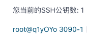
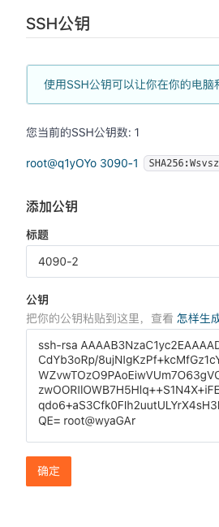
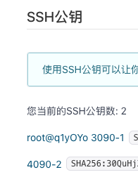

终端操作
# ssh私钥公钥配置
ssh-keygen -t rsa    
开始配置

支持以 'ssh-rsa', 'ssh-dss, 'ssh-ed25519', 'ecdsa-sha2-nistp256', 'ecdsa-sha2-nistp384'or 'ecdsa-sha2-nistp521' 开头

点击    
    
进入复制

ls /root/.ssh    
私钥自动调用id_rsa_lu      
公钥id_rsa_lu.pub     

git clone git@gitee.com:btc8/sd-webui-ic-light.git

如果要push 仍然需要

    git config --global user.email "you@example.com"
    git config --global user.name "Your Name"

被reject

不同机器需要配置不一样的公钥

生成 SSH 公钥
Windows 用户建议使用 Windows PowerShell 或者 Git Bash，在 命令提示符 下无 cat 和 ls 命令。

1、通过命令 ssh-keygen 生成 SSH Key：

ssh-keygen -t ed25519 -C "Gitee SSH Key"

-t key 类型
-C 注释
输出，如：

Generating public/private ed25519 key pair.
Enter file in which to save the key (/home/git/.ssh/id_ed25519):
Enter passphrase (empty for no passphrase):
Enter same passphrase again:
Your identification has been saved in /home/git/.ssh/id_ed25519
Your public key has been saved in /home/git/.ssh/id_ed25519.pub
The key fingerprint is:
SHA256:ohDd0OK5WG2dx4gST/j35HjvlJlGHvihyY+Msl6IC8I Gitee SSH Key
The key's randomart image is:
+--[ED25519 256]--+
|    .o           |
|   .+oo          |
|  ...O.o +       |
|   .= * = +.     |
|  .o +..S*. +    |
|. ...o o..+* *   |
|.E. o . ..+.O    |
| . . ... o =.    |
|    ..oo. o.o    |
+----[SHA256]-----+

中间通过三次回车键确定

2、查看生成的 SSH 公钥和私钥：

ls ~/.ssh/

输出：

id_ed25519  id_ed25519.pub

私钥文件 id_ed25519
公钥文件 id_ed25519.pub
3、读取公钥文件 ~/.ssh/id_ed25519.pub：

cat ~/.ssh/id_ed25519.pub

输出，如：

ssh-ed25519 AAAA***5B Gitee SSH Key

复制终端输出的公钥。

重新配置

基本到这里就可以了

(myconda) (myconda) root@wyaGAr:/# ssh-keygen -t rsa
Generating public/private rsa key pair.
Enter file in which to save the key (/root/.ssh/id_rsa): /root/.ssh/id_rsa_lu
Enter passphrase (empty for no passphrase): 
Enter same passphrase again: 
Your identification has been saved in /root/.ssh/id_rsa_lu
Your public key has been saved in /root/.ssh/id_rsa_lu.pub
The key fingerprint is:
SHA256:CbpuDbL9RamPFhBCg5ezrhr2q9Ir9d22vj/EZg6YVGs root@wyaGAr
The key's randomart image is:
+---[RSA 3072]----+
| oo.             |
|. =..   .        |
| . + ... .       |
|  . ....Eo       |
| .  .o +S.       |
|  + ..+o. =      |
|.= =.+.o.*       |
|=.+.+ ++o o      |
|+oo=oooo=+..     |
+----[SHA256]-----+
(myconda) (myconda) root@wyaGAr:/# 

重新生成 不设置密码

ls /root/.ssh   

cat /root/.ssh/id_rsa_lu.pub
ssh-rsa AAAAB3NzaC1yc2EAAAADAQABAAABgQC+zRpz7bedQmxR2hAkGhurvXMMUc4CTA7E+yMwm5YqevnP0XVLYOVp33HqkGIdHthM0

认您已经生成了 SSH 密钥：
如果还没有，可以使用以下命令生成：
Copyssh-keygen -t rsa -C "your_email@example.com"

查看您的公钥：
Copycat ~/.ssh/id_rsa.pub

将公钥添加到 Gitee：

登录 Gitee
进入"设置" -> "SSH 公钥"
点击"添加公钥"，粘贴您的公钥内容

测试 SSH 连接：
Copyssh -T git@gitee.com
如果成功，您应该看到欢迎消息。
确保您使用的是 SSH URL 而不是 HTTPS URL：
检查您的远程仓库 URL：
Copygit remote -v
如果是 HTTPS URL，更改为 SSH URL：
Copygit remote set-url origin git@gitee.com:username/repository.git

如果还是不行，可以尝试重新添加 Gitee 的主机密钥：
Copyssh-keyscan -t rsa gitee.com >> ~/.ssh/known_hosts

检查 SSH 代理：
Copyeval $(ssh-agent -s)
ssh-add ~/.ssh/id_rsa

ssh -T git@gitee.com
Enter passphrase for key '/root/.ssh/id_rsa':

Edit
这个提示表明您的 SSH 密钥是受密码保护的。这是一个额外的安全措施，要求您在使用密钥时输入密码。以下是一些建议和解释：

输入密码： 首先，请输入您在创建 SSH 密钥时设置的密码。如果密码正确，您应该能够成功连接到 Gitee。
如果不记得密码： 如果您忘记了密码，不幸的是没有办法恢复它。您需要生成一个新的 SSH 密钥对。
避免每次都输入密码： 如果您不想每次使用 Git 操作时都输入密码，可以使用 SSH 代理：

Copy
eval $(ssh-agent -s)
ssh-add ~/.ssh/id_rsa
这会在当前会话中记住您的密码。
永久解决方案： 如果您希望永久解决这个问题，可以考虑以下选项： a. 创建一个新的、不带密码的 SSH 密钥：

Copy
ssh-keygen -t rsa -b 4096 -C "your_email@example.com"
创建过程中，当提示输入密码时，直接按 Enter 跳过。 b. 使用 SSH 配置文件： 在 ~/.ssh/config 文件中添加：

Copy
Host gitee.com
    IdentityFile ~/.ssh/id_rsa
    AddKeysToAgent yes
    UseKeychain yes
安全考虑： 请注意，移除 SSH 密钥的密码会降低安全性。如果您选择这样做，请确保妥善保管您的私钥。

## 其他

账户的 SSH Key 和账户绑定，当账户具有 推送/拉取 权限时可通过 SSH 方式 推送/拉取 的仓库。

通过 ssh -T 测试时，输出 SSH Key 绑定的用户名：

$ ssh -T git@gitee.com
Hi USERNAME! You've successfully authenticated, but GITEE.COM does not provide shell access.

仓库的 SSH key 只针对仓库，且我们仅对仓库提供了部署公钥，即仓库下的公钥仅能拉取仓库，这通常用于生产服务器拉取仓库的代码。

通过 ssh -T 测试时，输出 Anonymous：

ssh -T git@gitee.com
Hi Anonymous! You've successfully authenticated, but GITEE.COM does not provide shell access.

# 推拉

## 一般推拉法1
git clone git@gitee.com:btc8/sd-webui-ic-light.git

git add .    
把所有修改过的文件暂存,准备提交    
git status   
查看当前代码相比远程仓库有哪些修改。    
git commit -m ""     
git push

## 法2
如果是第一次推送代码到远程仓库,需要先添加远程仓库地址,使用如下命令:     
git remote add origin 远程仓库地址    
如果是pull来的就不用了

和方法1的差别，在于先创建仓库。

    $ git init     
    $ git remote add origin https://gitee.com/用户个性地址/HelloGitee.git

这样就完成了版本的一次初始化。
接下去，进入你已经初始化好的或者克隆仓库的目录,然后执行：

    $ git pull origin master

修改/添加文件，否则与原文件相比就没有变动。

    $ git add .
    $ git commit -m "第一次提交"
    $ git push origin master

在新建仓库时，如果在 Gitee 平台仓库上已经存在 readme 或其他文件，在提交时可能会存在冲突，这时用户需要选择的是保留线上的文件或者舍弃线上的文件，如果您舍弃线上的文件，则在推送时选择强制推送，强制推送需要执行下面的命令(默认不推荐该行为)：

    $ git push origin master -f
如果您选择保留线上的 readme 文件,则需要先执行：

    $ git pull origin master

## 强制覆盖
git reset --hard    
git pull

暂存本地修改   
git stash     
这将暂时保存您本地的修改,让您有一个干净的工作区用于pull操作。之后您可以使用git stash pop来重新应用您的修改。

手动合并冲突

暂时不做其他操作,手动编辑存在冲突的文件,解决代码冲突。解决后再次git add暂存,git commit提交。最后git pull拉取远程代码,Git会尝试合并本地提交和远程修改。    
一般来说,暂存本地修改或手动合并是比较保险的做法,除非您确定不需要保留本地代码修改。在团队协作时,保持代码同步很重要,但也要小心不要覆盖别人的修改。

## 删除本地commit 重新commit

清空本地 Git commit 并重新 commit 的过程如下：

这个比较靠谱

软重置到初始状态：
首先，我们需要撤销所有的本地 commit，但保留文件更改。使用以下命令：
git reset --soft HEAD~<n>
其中 <n> 是您想要撤销的 commit 数量

这个最好不要使用，所有重新init 导致落后 得--force才能commit

如果想撤销所有 commit 到初始状态，可以使用：    
git reset --soft $(git rev-list --max-parents=0 HEAD)

这个过程会改变 Git 历史。如果这是一个共享的分支，请确保与您的团队沟通。
在执行这些操作之前，最好先创建一个备份分支：
Copygit branch backup-branch

如果您只是想修改最后一个 commit，可以使用 git commit --amend。

冲突

强制推送（慎用）：
如果您确定要用您的本地版本覆盖远程版本，可以使用强制推送：
Copygit push --force origin master
警告：这会覆盖远程仓库的历史。如果这是一个共享仓库，可能会影响其他协作者的工作。
拉取并重新应用更改：
如果您想保留远程的更改：
a. 首先，获取远程更改：
Copygit fetch origin
b. 然后，重新应用您的更改：
Copygit rebase origin/master
c. 如果有冲突，解决它们，然后继续变基：
Copygit rebase --continue
d. 最后，推送更改：
Copygit push origin master

合并远程更改：
如果您想保留两边的历史：
Copygit pull --rebase origin master
git push origin master

创建新分支：
如果您不确定如何处理，可以创建一个新分支来保存您的更改：
Copygit checkout -b new-changes
git push origin new-changes

## 删除远端冗余
在本地做文件删除后     
push即可    

## vscode上传含有他人文件夹
如果子文件夹有其他人的.git,删除即可作为自己文件夹，vscode才可以上传，不删除则会链接到原作者

能上传 网页还是打不开

可能要强制覆盖远端文件信息

彻底解决

再做以下步

打开终端

要删除远端的文件而不删除本地文件，可以按照以下步骤操作：

将文件从暂存区移除（不删除本地文件）：

    bash
    复制代码
    git rm --cached <file>

然后在图形界面 commit push即可 删除同时 覆盖新的 自动化

终端push不了 可能要登录密码

## 查看版本差异

### git diff 

比较工作区与特定提交之间的差异    
git diff 77616e54217ade76529e2384394d56fdd302a2a0   
对id查看该提交所做修改

比较工作区与上次提交之间的差异     
git diff

比较两个提交之间的差异   
git diff 旧的提交ID 新的提交ID  

查看某个文件的修改    
git diff 提交ID 文件路径     
可以只查看单个文件在不同版本之间的变化差异。

### git log
git log 查看提交记录和id 

查看指定数量的日志   
git log -n 3     
加上 -n 参数后面加数字,可以指定只展示最近 n 次的提交日志。   

查看精简的提交 ID 日志   
git log --oneline     
这个命令会以精简的一行格式展示提交日志,每一行最前面的字符串就是提交 ID。

## 下载某个commit

要在GitHub上下载特定的提交(commit),您可以按照以下步骤操作:

    打开项目的GitHub页面,找到该commit的SHA哈希值。您可以在"Commits"页面中找到这个值。
    将提交哈希值附加到以下URL中:
    https://github.com/用户名/项目名/archive/提交哈希值.zip
    例如,如果要下载提交哈希值为ab3d92的压缩包,URL将是:
    https://github.com/用户名/项目名/archive/ab3d92.zip
    在浏览器中打开这个URL,它将开始下载该提交对应的源码压缩包。
    下载完成后,解压该zip文件,您将获得一个以提交哈希值命名的目录,其中包含该提交时项目代码的状态。

另一种方式是使用Git命令行,先克隆整个repo,然后用git checkout切换到指定的提交:    

    git clone https://github.com/用户名/项目名.git
    cd 项目名
    git checkout 提交哈希值
这样您就可以在本地获取该特定提交时的代码状态。    
需要注意的是,使用Git命令行获取单个提交时,您将下载整个repo的历史,而直接下载zip压缩包将更小更快。

### 切换到某个pull的commit， 但还没有合并

在大多数情况下，PR 是从一个特定的分支提交的。因此，你需要先获取这个 PR 分支。

    bash
    复制代码
    git fetch origin pull/<PR编号>/head:<本地分支名>

例如，如果 PR 编号是 1234，你想将它拉到本地的 pr-1234 分支，可以运行：

    bash
    复制代码
    git fetch origin pull/1234/head:pr-1234

切换到该分支:

获取分支后，切换到该分支：

    bash
    复制代码
    git checkout pr-1234
切换到指定的 commit:

最后，切换到你想要查看的特定 commit：

    bash
    复制代码
    git checkout <commit-id>

https://github.com/AUTOMATIC1111/stable-diffusion-webui/pull/16035

例如，在GitHub上，URL通常类似于https://github.com/用户名/仓库名/pull/1234，其中1234就是PR号。

ebui# git fetch origin pull/16035/head:dev
fatal: Refusing to fetch into current branch refs/heads/dev of non-bare repository

先switch 到别的 更新后 再回来

## 分支

### 直接拉目标分支
git clone https://github.com/AUTOMATIC1111/stable-diffusion-webui.git -b dev

### 切换

(myconda) root@ZB7j0G:/home# git switch webui-1.8.0
error: Your local changes to the following files would be overwritten by checkout:
        stable_diffusion_webui_master/cache.json.lock
Please commit your changes or stash them before you switch branches.
Aborting

Option 2: Stash Your Changes
Stash your changes:
sh
复制代码
git stash push -m "Stash changes to cache.json.lock"
Switch branches:
sh
复制代码
git switch webui-1.8.0
Optional: Apply the stashed changes if needed:
sh
复制代码
git stash apply

Option 3: Discard Your Changes
If you do not need the changes in stable_diffusion_webui_master/cache.json.lock, you can discard them:

Discard your changes:
sh
复制代码
git checkout -- stable_diffusion_webui_master/cache.json.lock

git switch 和 git checkout 在某些情况下功能相似，但它们有一些细微的区别。

相似点

    切换分支: 两者都可以用来切换分支。
    git switch <branch>
    git checkout <branch>

不同点

    创建和切换分支: git switch 只能创建并切换到新的分支，而不能像 git checkout 一样同时更新工作区文件。
    创建新分支并切换: git switch -c <new-branch>
    创建新分支并切换: git checkout -b <new-branch>
    切换到特定的提交: git checkout 可以用来切换到特定的提交，而 git switch 主要用于切换分支。
    切换到特定提交: git checkout <commit>
    意图明确: git switch 更加专注于分支管理，而 git checkout 功能更广，包括更新工作区文件等。

推荐使用
git switch 是为了更清晰地分离分支切换操作而引入的，推荐在需要切换分支的情况下使用 git switch，而在需要切换到特定提交或者更新工作区文件时使用 git checkout。

创建并切换到新分支:

    bash
    复制代码
    git switch -c feature/new-feature
或者:

    bash
    复制代码
    git checkout -b feature/new-feature
切换到特定提交:

    bash
    复制代码
    git checkout abc1234

在 Git 中，更新工作区文件是指通过 git checkout 或其他命令将暂存区（staging area）或某个分支、标签、提交（commit）中的内容更新到当前工作目录中。

场景1：恢复文件到上一个提交的状态
假设你对某个文件做了一些修改，但你决定放弃这些修改并恢复到上一个提交的状态。

    bash
    复制代码
    git checkout HEAD -- path/to/file
这个命令会将 path/to/file 恢复到当前分支最后一次提交的状态。

场景2：切换到特定提交
当你想要查看某个特定提交的内容时，可以使用 git checkout 切换到那个提交。这样，工作区文件会被更新为那个提交时的状态。

场景3：丢弃未暂存的更改
如果你对某些文件进行了修改，但还没有暂存（即使用 git add ），并且你想要放弃这些修改，可以使用 git checkout 恢复这些文件。

    bash
    复制代码
    git checkout -- path/to/file
这个命令会将 path/to/file 恢复为暂存区的状态（如果没有暂存的更改，则恢复为上一个提交的状态）。

虽然 git switch 专注于分支管理，但在切换分支时它同样会更新工作区文件以匹配目标分支的最新提交状态。

切换到已有分支：

    bash
    复制代码
    git switch develop
这会将工作区文件更新为 develop 分支上的最新提交状态。

### 检查差异

git log sd3..origin/sd3

这个命令会列出所有在 origin/master 分支上有但在 master 分支上没有的提交。

如果你想查看相反的差异，即本地有而远程没有的提交，可以使用：

git log origin/master..master

3. 使用图形化工具
如果你更喜欢图形化界面，可以使用以下几种方法：

使用 gitk

gitk master origin/master    
gitk 是 Git 自带的一个图形化工具，它可以直观地展示提交历史和差异。

使用 git diff --stat    
如果只想要一个概要统计，可以使用：

git diff --stat master origin/master

查看具体差异：

git diff master origin/master

git log master..origin/master.

    commit feee37d75f1b168768014e4634dcb156ee649c05 (tag: v1.9.4, origin/master, origin/HEAD)
    Merge: 1c0a0c4c 801b72b9
    Author: AUTOMATIC1111 <16777216c@gmail.com>
    Date:   Tue May 28 21:20:40 2024 +0300

        Merge branch 'dev'

    commit 801b72b92b4f07e5d2fa9737b160762ea8f67088
    Author: AUTOMATIC1111 <16777216c@gmail.com>
    Date:   Tue May 28 21:20:23 2024 +0300

        update changelog

    commit 759f396a2eb524bd9ab569a5f26f24cda038c0ac
    Merge: ddb28b33 a6394623
    Author: AUTOMATIC1111 <16777216c@gmail.com>
    Date:   Tue May 28 21:16:28 2024 +0300

        Merge pull request #15882 from AUTOMATIC1111/setuptools==69.5.1
        
        Fix method 1 : pin Setuptools==69.5.1

    commit a63946233b71083f6726006b96fc16e3033ab844 (origin/setuptools==69.5.1)
    Author: w-e-w <40751091+w-e-w@users.noreply.github.com>
    Date:   Sat May 25 14:18:05 2024 +0900

        setuptools==69.5.1

    commit ddb28b33a3561a360b429c76f28f7ff1ffe282a0
    Merge: 7dfe959f 1c0a0c4c
    Author: AUTOMATIC1111 <16777216c@gmail.com>
    Date:   Mon Apr 22 18:01:16 2024 +0300

        Merge branch 'master' into dev

### 旧版
git remote -v     
git push --set-upstream origin master      
如果是新建的分支,需要先将本地分支与远程分支关联   

要查看当前所在的 Git 分支，可以使用以下命令：

git branch

    * base_on_patcher
    master

查看所有远程和本地分支：

git branch -a

切换到另一个分支：

git checkout branch-name

创建并切换到新分支：

git checkout -b new-branch-name

删除本地分支：

git branch -d branch-name

删除远程分支：

git push origin --delete branch-name

### 创建和push新分支
git clone https://github.com/your-username/your-repository.git    
cd your-repository    
创建新分支   
创建一个新分支，并切换到该分支。假设新分支的名字为 new-feature：   
git checkout -b new-feature    
将修改的文件添加到暂存区：    
git add .      
提交你的修改，并添加提交信息：     
git commit -m "Add new feature or fix something"     
推送新分支到远程仓库    
将新分支推送到远程仓库：    
git push origin new-feature   

8. 创建 Pull Request（可选）   
推送后，你可以到 GitHub 上打开你的仓库，并创建一个 Pull Request，从新分支 new-feature 合并到主分支（通常是 main 或 master）。

git push不写origin，那么会push到远端的master还是当前本地分支同名的远端

如果你只执行 git push 而不指定远程仓库和分支,Git 的行为会取决于你的 Git 配置和当前分支的设置。通常情况下:

如果当前分支设置了上游分支（upstream branch），Git 会推送到该上游分支。
如果没有设置上游分支，Git 会遵循 push.default 配置的行为。这个配置有几个常见的值：

simple（Git 2.0 之后的默认值）: 推送当前分支到与之同名的远程分支。
current: 推送当前分支到远程同名分支，如果远程不存在该分支则创建。
matching: 推送所有有相同名字的本地和远程分支。
upstream: 推送当前分支到它的上游分支。

如果没有设置 push.default，Git 可能会报错或提示你设置远程分支。

为了避免混淆，建议:

使用 git push origin <branch-name> 明确指定要推送的远程和分支。
或者，为你的分支设置上游分支：git push -u origin <branch-name>。

这样设置后，以后只使用 git push 就会推送到正确的远程分支。
需要注意的是，直接使用 git push 可能会导致意外的结果，特别是在多人协作的项目中。始终确保你了解你的 Git 配置和当前分支的设置。 

### 互换分支名字
    # 获取最新的远程分支
    git fetch origin

    # 切换到 main 分支并获取最新的更新
    git checkout main
    git pull origin main

    # 将 main 分支重命名为 old-main
    git branch -m main old-main

我直接git push origin新分支    
Your branch is up to date with 'origin/master'.     

    # 将 new-feature 分支重命名为 main
    git branch -m new-feature main

    # 强制推送新的 main 分支到远程仓库
    git push -f origin main

没有强制 报错

To gitee.com:btc8/sd-webui-ic-light.git
 ! [rejected]        master -> master (non-fast-forward)
error: failed to push some refs to 'git@gitee.com:btc8/sd-webui-ic-light.git'
hint: Updates were rejected because the tip of your current branch is behind
hint: its remote counterpart. Integrate the remote changes (e.g.
hint: 'git pull ...') before pushing again.
hint: See the 'Note about fast-forwards' in 'git push --help' for details.

    # 确保远程仓库的 HEAD 指向新的 main 分支
    git push origin --delete main
    git push origin main

上面我没做   
直接下面   

    # 删除远程的 old-main 分支
    git push origin --delete old-main

可行

测试

stable-diffusion-webui/testleetcode# ls
sd-webui-ic-light
(webui310) (myconda) root@q1yOYo:stable-diffusion-webui/testleetcode# git branch
  dev
* master
  sd3

.git影响深远

stable-diffusion-webui/testleetcode/sd-webui-ic-light# git branch
* master

代码正确

你就成功地将远程的 main 分支与 new-feature 分支互换了。注意，强制推送（git push -f）可能会覆盖远程分支的历史记录，因此请谨慎使用，并确保所有团队成员知晓这一更改。

修改分支名称并不会变更你或仓库其他成员本地的代码分支，请使用以下命令对你的本地仓库分支进行变更：

    git branch -m master <BRANCH>
    git fetch origin
    git branch -u origin/<BRANCH>
    git remote set-head origin -a

这就麻烦了   
还是别改了    

分支保护是为了防止相关成员推送代码到重要的分支（例如 master 分支），便于仓库的分支管理，点击前往分支设置管理保护分支规则。

    常规分支：仓库成员（开发者权限及以上）可推送分支
    保护分支：可自定义保护策略，默认仓库管理员才能管理（推送）被保护的分支
    只读分支：任何人都无法推送代码（包括管理员和所有者），需要推送代码时应设为“常规”或“保护”分支

### 拉取原地更新
最快的   
git switch sd3

查看   
git branch

git clone https://github.com/username/repository.git    
cd repository    
获取所有远程分支  
更新本地的远程分支信息：      
git fetch origin      
切换到dev分支    
如果分支已经存在于本地，你可以直接切换到dev分支：     
git checkout dev     
如果dev分支在本地还不存在，可以使用以下命令创建并切换到dev分支：    
git checkout -b dev origin/dev      
git pull origin dev     

git branch 查看本地已有分支

获取远程分支列表    
使用 git branch -r 命令查看远程仓库中的所有分支：

获取所有分支列表（包括本地和远程分支）    
使用 git branch -a 命令查看本地和远程所有分支：

  
获取详细信息    
要查看远程分支的详细信息，可以使用 git ls-remote 命令：

### 直接克隆dev分支
是的，你可以在克隆仓库的时候直接指定克隆dev分支。这样做可以避免克隆整个仓库的默认分支（通常是main或master），然后再切换分支。使用--branch选项可以直接克隆指定的分支。以下是具体的命令：    
git clone --branch dev <repository-url>

### origin

在运行 git push 命令时,不加任何参数的话,Git 会尝试将代码推送到 origin 远程仓库

git push origin 分支名

在 Git 中, origin 是一个默认的远程仓库名称。

git remote add origin https://github.com/user/repo.git     
这条命令会将 https://github.com/user/repo.git 设置为一个远程仓库,并默认将其命名为 origin。

当然,origin 只是一个默认的别名而已,你可以用 git remote rename 命令将其重命名为其他名字。有些人也会为不同的远程仓库设置不同的名称,而不使用 origin。

### changes

    # 查看所有本地分支
    git branch

    # 切换到指定的分支
    git checkout 分支名

    git pull   
    拉最新

git checkout -b dev origin/dev
error: Your local changes to the following files would be overwritten by checkout:
        modules/processing.py
        modules/scripts.py
Please commit your changes or stash them before you switch branches.
Aborting

如果你想暂时保存当前的更改，可以使用 git stash 命令。这样可以在不提交的情况下保存更改，并切换到其他分支：

暂存更改：

git stash

切换到 dev 分支：

git checkout -b dev origin/dev

恢复暂存的更改（可选，如果你想在新分支上应用这些更改）：

git stash pop

选项 3: 丢弃本地更改
如果你确定不需要保留当前更改，可以丢弃它们：

丢弃本地更改：

git reset --hard
切换到 dev 分支：

git checkout -b dev origin/dev

查看工作区中的更改  
使用 git status 查看当前工作区中的更改状态：

这将显示哪些文件被修改、添加或删除了。

查看具体的更改内容    
使用 git diff 查看具体的更改内容。它会显示未暂存的更改：

查看已暂存的更改   
如果你已经使用 git add 暂存了一些更改，可以使用以下命令查看已暂存的更改：

git diff --cached

查看所有更改（包括未暂存和已暂存）
使用 git diff HEAD 查看相对于最新提交的所有更改，包括已暂存和未暂存的更改：

在使用 git diff 查看更改时，Git 通常会将输出发送到一个分页器（如 less），以便你可以方便地滚动查看内容。当你完成查看并希望退出分页器时，可以按以下键：

退出分页器
按 q 键：这将退出 less 或其他分页器，返回到命令行提示符。

## 合并

发布

    1.在 develop 分支，修改版本号

    package.json version属性
    2.从 develop 分支切换到 master 分支,并合并 develop 分支代码

    git checkout master
    git merge develop
    3.添加 git tag

    git tag vx.x.x
    git push origin --tags

# git tag

## 使用

### 复杂写tag
tag 会自动创建下载包         
确实的一个版本

进一步可以通过tag 创建发行版 也就是github上一般看到的    

标签命名建议
通常的做法是在你的版本名称前加上字母 v 前缀， v1.0 或者 v2.3.4。

如果标签不适合在生产环境下使用，请在版本名称后添加预发行版本。例如：v0.2-alpha 或者 v5.9-beta.3。

附件大小说明
单个附件不能超过 100M（GVP 项目200M），每个仓库总附件不可超过 1G（推荐项目不可超过 5G；GVP 项目不可超过 20G）。附件总容量统计包括仓库附件和发行版附件。

版本格式：主版本号.次版本号.修订号，版本号递增规则如下：

主版本号：当你做了不兼容的 API 修改，
次版本号：当你做了向下兼容的功能性新增，
修订号：当你做了向下兼容的问题修正。
先行版本号及版本编译信息可以加到“主版本号.次版本号.修订号”的后面，作为延伸。

https://semver.org/lang/zh-CN/

若开头的标识符都相同时，栏位比较多的先行版本号优先层级比较高。

例如：1.0.0-alpha < 1.0.0-alpha.1 < 1.0.0-alpha.beta < 1.0.0-beta < 1.0.0-beta.2 < 1.0.0-beta.11 < 1.0.0-rc.1 < 1.0.0。

当然可以为 git tag 写更长的内容。Git 允许您为 tag 添加详细的注释。以下是如何创建一个带有长描述的 annotated tag：

使用 -a 选项创建 annotated tag：

git tag -a <标签名> -m "标签描述"

如果您想输入更长的描述，可以省略 -m 选项，这样 Git 会打开您默认的文本编辑器：

git tag -a <标签名>

在打开的编辑器中，您可以输入任意长度的描述。第一行通常被视为标题，空一行后的内容被视为详细描述。例如：

    版本 1.0.0 发布

    这是我们的第一个正式版本，包含以下重要更新：

    1. 实现了用户认证功能
    2. 优化了数据库查询性能
    3. 修复了若干已知 bug

    贡献者：
    - 张三：核心功能开发
    - 李四：UI 设计
    - 王五：测试

    发布日期：2024-07-18

保存并关闭编辑器后，tag 就创建好了。
查看 tag 信息：

git show <标签名>

推送 tag 到远程仓库：

git push origin <标签名>

如果您写错了 tag 标签名，可以通过以下步骤修改：

删除错误的 tag：
对于本地 tag：
Copygit tag -d <错误的标签名>
如果已经推送到远程仓库，还需要删除远程 tag：
Copygit push origin :refs/tags/<错误的标签名>

创建新的正确 tag：
Copygit tag <正确的标签名> <commit hash>

如果您想将标签推送到特定的分支（在这个情况下是 master 分支），您可以使用以下命令：
Copygit push origin <标签名>:refs/tags/<标签名>

这个命令会将标签推送到远程仓库的 master 分支。
然而，需要注意的是，Git 中的标签通常是与特定的提交相关联的，而不是与特定的分支。标签在所有分支间是共享的。当你推送一个标签时，它会被添加到远程仓库中，所有能访问该提交的分支都可以看到这个标签。
如果您的意图是在 push 标签的同时也 push master 分支的更改，可以这样做：

git push origin master <标签名>

### 简短写tag

 git push 之前设置 git commit 和 git tag 的基本步骤如下：

修改文件后，先添加修改到暂存区：

git add .

创建 commit：

git commit -m "你的提交信息"

如果需要，创建 tag：

Copygit tag <标签名> -m "标签描述"
例如：
Copygit tag v1.0.0 -m "版本1.0.0发布"

最后推送 commit 和 tag 到远程仓库：

Copygit push origin <分支名>
git push origin <标签名>
或者一次性推送所有 tag：
Copygit push origin --tags

## 简介
git tag 用于给特定的 commit 打上标签，以便于标识和引用这个特定的 commit。标签通常用于版本号、发布号或者重要的里程碑版本。标签可以帮助开发者和团队更容易地查找和访问重要的历史版本。

常见的 git tag 命令包括：

    git tag：列出所有存在的标签。
    git tag <tagname>：在当前 commit 上打上指定名称的标签。
    git tag -a <tagname> -m "message"：创建带有附注的标签。

打一个简单的标签：

    bash
    复制代码
    git tag v1.0.0
或者创建一个带有附注的标签：

    bash
    复制代码
    git tag -a v1.0.0 -m "Release version 1.0.0"

git commit -m ""
git commit -m "" 是用于将当前工作目录中的修改提交到本地仓库的命令。它会创建一个新的 commit，并将提交信息（commit message）附加在这个 commit 上。

git tag: 用于标记和记录重要的历史节点（如版本发布）。它不会更改工作区或暂存区的状态，只是为了标记特定的 commit。    
git commit -m "": 用于将当前工作目录的修改保存到本地仓库中作为一个新的 commit。它会更改仓库中的状态，记录新的文件快照，并且需要添加一个描述性的提交信息。

# .gitignore

## .gitignore不能删去远端已有文件

git rm --cached .DS_Store     
git commit -m "Remove .DS_Store from repository"      
git push

## 通用配置

    **/__pycache__

这样可以把文件夹中的__pycache__文件夹忽略，并且子文件夹中的__pycache__也一并忽略。

*.py[cod]通配符表示该文件可能是.pyc、.pyo或.pyd.

通用配置

    .DS_Store
    .DS_Store
    */__pycache__
    **/__pycache__

    # python 
    *.py[cod]

    # Byte-compiled / optimized / DLL files
    __pycache__/
    *.py[cod]
    *$py.class

    # C extensions
    *.so

    # Distribution / packaging
    .Python
    build/
    develop-eggs/
    dist/
    downloads/
    eggs/
    .eggs/
    lib/
    lib64/
    parts/
    sdist/
    var/
    wheels/
    share/python-wheels/
    *.egg-info/
    .installed.cfg
    *.egg
    MANIFEST

    # PyInstaller
    #  Usually these files are written by a python script from a template
    #  before PyInstaller builds the exe, so as to inject date/other infos into it.
    *.manifest
    *.spec

    # Installer logs
    pip-log.txt
    pip-delete-this-directory.txt

    # Unit test / coverage reports
    htmlcov/
    .tox/
    .nox/
    .coverage
    .coverage.*
    .cache
    nosetests.xml
    coverage.xml
    *.cover
    *.py,cover
    .hypothesis/
    .pytest_cache/
    cover/

    # Translations
    *.mo
    *.pot

    # Django stuff:
    *.log
    local_settings.py
    db.sqlite3
    db.sqlite3-journal

    # Flask stuff:
    instance/
    .webassets-cache

    # Scrapy stuff:
    .scrapy

    # Sphinx documentation
    docs/_build/

    # PyBuilder
    .pybuilder/
    target/

    # Jupyter Notebook
    .ipynb_checkpoints

    # IPython
    profile_default/
    ipython_config.py

    # pyenv
    #   For a library or package, you might want to ignore these files since the code is
    #   intended to run in multiple environments; otherwise, check them in:
    # .python-version

    # pipenv
    #   According to pypa/pipenv#598, it is recommended to include Pipfile.lock in version control.
    #   However, in case of collaboration, if having platform-specific dependencies or dependencies
    #   having no cross-platform support, pipenv may install dependencies that don't work, or not
    #   install all needed dependencies.
    #Pipfile.lock

    # poetry
    #   Similar to Pipfile.lock, it is generally recommended to include poetry.lock in version control.
    #   This is especially recommended for binary packages to ensure reproducibility, and is more
    #   commonly ignored for libraries.
    #   https://python-poetry.org/docs/basic-usage/#commit-your-poetrylock-file-to-version-control
    #poetry.lock

    # pdm
    #   Similar to Pipfile.lock, it is generally recommended to include pdm.lock in version control.
    #pdm.lock
    #   pdm stores project-wide configurations in .pdm.toml, but it is recommended to not include it
    #   in version control.
    #   https://pdm.fming.dev/#use-with-ide
    .pdm.toml

    # PEP 582; used by e.g. github.com/David-OConnor/pyflow and github.com/pdm-project/pdm
    __pypackages__/

    # Celery stuff
    celerybeat-schedule
    celerybeat.pid

    # SageMath parsed files
    *.sage.py

    # Environments
    .env
    .venv
    env/
    venv/
    ENV/
    env.bak/
    venv.bak/

    # Spyder project settings
    .spyderproject
    .spyproject

    # Rope project settings
    .ropeproject

    # mkdocs documentation
    /site

    # mypy
    .mypy_cache/
    .dmypy.json
    dmypy.json

    # Pyre type checker
    .pyre/

    # pytype static type analyzer
    .pytype/

    # Cython debug symbols
    cython_debug/

    # PyCharm
    #  JetBrains specific template is maintained in a separate JetBrains.gitignore that can
    #  be found at https://github.com/github/gitignore/blob/main/Global/JetBrains.gitignore
    #  and can be added to the global gitignore or merged into this file.  For a more nuclear
    #  option (not recommended) you can uncomment the following to ignore the entire idea folder.
    #.idea/

# 报错

## 修改单个文件add失败
为什么我使用 git add . 不起作用
On branch base_on_patcher
Changes not staged for commit:
(use "git add <file>..." to update what will be committed)
(use "git restore <file>..." to discard changes in working directory)
modified: ../README.md

no changes added to commit (use "git add" and/or "git commit -a")

modified: ../README.md

因为不再根目录运行命令，导致无法

# push钩子创建作者信息

在push的文件首如何自动创建一些信息：比如
"""
Author: 
Date: 2024-07-01
 AI
"""

要在推送的文件开头自动添加这样的信息，您可以使用 Git 钩子（hooks）。具体来说，我们可以使用 pre-commit 钩子来实现这个功能。以下是详细的步骤：

创建 pre-commit 钩子脚本：
在您的项目根目录下，创建 .git/hooks/pre-commit 文件（如果不存在的话）。确保这个文件是可执行的。
编辑 pre-commit 脚本：
使用您喜欢的文本编辑器打开 .git/hooks/pre-commit 文件，并添加以下内容：

    #!/bin/bash

    # 获取当前日期
    current_date=$(date +"%Y-%m-%d")

    # 遍历所有暂存的文件
    for file in $(git diff --cached --name-only); do
    # 检查文件是否已经有头部信息
    if ! grep -q "Author: " "$file"; then
        # 创建临时文件
        temp_file=$(mktemp)
        
        # 写入头部信息
        echo '"""' > "$temp_file"
        echo "Author: " >> "$temp_file"
        echo "Date: $current_date" >> "$temp_file"
        echo "AI" >> "$temp_file"
        echo '"""' >> "$temp_file"
        echo >> "$temp_file"  # 添加一个空行
        
        # 将原文件内容追加到临时文件
        cat "$file" >> "$temp_file"
        
        # 用临时文件替换原文件
        mv "$temp_file" "$file"
        
        # 将更改添加到暂存区
        git add "$file"
    fi
    done

    exit 0

使脚本可执行：

chmod +x .git/hooks/pre-commit

这个脚本会在每次提交前检查所有暂存的文件，如果文件还没有头部信息，就会添加。
注意事项：

这个脚本会修改您的文件内容。确保您理解并接受这种行为。
对于已经有头部信息的文件，脚本不会重复添加。
这个脚本会自动使用当前日期。如果您想手动控制日期，需要修改脚本。
这个方法会在本地添加信息。如果您想在远程仓库中看到这些更改，需要提交并推送。

如果您想让团队中的每个人都使用这个钩子，可以考虑将它添加到版本控制中，并提供一个设置脚本来安装钩子。

理解您的情况。由于 .git/hooks/pre-commit 脚本只在提交时触发，而您现有的文件没有改动，因此 git add . 确实不会产生效果。要在远程仓库中看到这些更改，我们需要手动触发文件的修改。以下是几种方法：

手动修改文件：
对于每个您想添加头信息的文件，做一个小的修改（比如添加一个空行），然后保存。这会触发 Git 检测到文件变化。

使用 touch 命令：
在命令行中，对每个文件使用 touch 命令来更新其修改时间：

touch file1.py file2.py file3.py

    (myconda) (myconda) root@wyaGAr:/home# touch a.py
    (myconda) (myconda) root@wyaGAr:/home# vim a.py 
    (myconda) (myconda) root@wyaGAr:/home# touch a.py
    (myconda) (myconda) root@wyaGAr:/home# cat a.py 
    ada

确实只改变时间

    (myconda) (myconda) root@wyaGAr:/home# ls -lh a.py 
    -rw-r--r-- 1 root root 4 Jul 18 05:59 a.py
    (myconda) (myconda) root@wyaGAr:/home# touch a.py
    (myconda) (myconda) root@wyaGAr:/home# ls -lh a.py 
    -rw-r--r-- 1 root root 4 Jul 18 06:00 a.py
    (myconda) (myconda) root@wyaGAr:/home# cat a.py 
    ada

git touch 并不能 git add

    (myconda) (myconda) root@wyaGAr:/home/sd-webui-ic-light# git commit -m "v1.1.0"
    hint: The '.git/hooks/pre-commit' hook was ignored because it's not set as executable.
    hint: You can disable this warning with `git config advice.ignoredHook false`.
    [master 2802b2d] v1.1.0
    4 files changed, 4 insertions(+), 93 deletions(-)
    (myconda) (myconda) root@wyaGAr:/home/sd-webui-ic-light# 

# 结尾