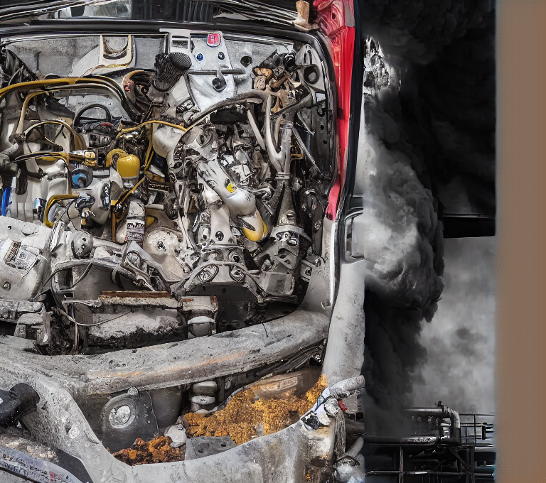

# outpaint

   
    
prompt: explosion, white, black    


一般来说全参调，或者lora,或者controlnet   
去网上，社区找开源模型    
2.controlnet 局部重绘 inpaint_only_lama control_v11p_sd15_inpaint    
powerpaint   
等   

涂鸦 inpaint都可以视作扩图方法 都做mask

# glid


https://github.com/Jack000/glid-3-xl-stable    
https://huggingface.co/Jack000/glid-3-xl-stable/tree/main/default   
运行训练有些问题   
可以推理   


拆开ckpt:   

    # split checkpoint
    python split.py sd-v1-4.ckpt

    # you should now have diffusion.pt and kl.pt

    # alternatively
    wget -O diffusion.pt https://huggingface.co/Jack000/glid-3-xl-stable/resolve/main/default/diffusion-1.4.pt
    wget -O kl.pt https://huggingface.co/Jack000/glid-3-xl-stable/resolve/main/default/kl-1.4.pt

kl模型暂不知用意是什么，拆开vae? 只在训练时候输入模型路径，推理不用？？？    


## 模型信息
GLID-3-xl-stable is stable diffusion back-ported to the OpenAI `guided diffusion` codebase, for easier development and training.

Commits on Aug 21, 2022     


## 代码

    elif args.outpaint == 'left':
        input_image = torch.zeros(1, 4, im.shape[2], im.shape[3]+32, device=device)
        input_image[:,:,:,32:32+im.shape[3]] = im
        input_image_mask = torch.zeros(1, 1, im.shape[2], im.shape[3]+32, device=device, dtype=torch.bool)
        input_image_mask[:,:,:,32:32+im.shape[3]] = True
1.创建一个与输入图像 im 相同大小的张量，但是宽度增加了32个像素的空白区域。这个张量是用零填充的，表示黑色背景。        
2.将原始图像 im 复制到这个新创建的张量中，复制到新张量的右侧，即向左填充32个像素的空白区域。      
3.创建一个与输入图像 im 相同大小的布尔型张量，同样是宽度增加了32个像素的空白区域，用于表示图像的掩码。       
4.将掩码的相应区域设置为 True，表示在这个区域内需要进行处理。     

这段代码的作用是在输入图像的左侧添加一个32像素宽的空白区域，同时为该区域生成一个掩码，用于后续的图像处理。     


```
from PIL import Image
import os

def resize_images(input_folder, output_folder_resize, output_folder_crop):
    # 创建保存文件夹
    os.makedirs(output_folder_resize, exist_ok=True)
    os.makedirs(output_folder_crop, exist_ok=True)

    # 遍历文件夹中的所有文件
    for filename in os.listdir(input_folder):
        # 确保是图片文件
        if filename.endswith(".jpg") or filename.endswith(".png") or filename.endswith(".jpeg"):
            # 打开图片
            img_path = os.path.join(input_folder, filename)
            img = Image.open(img_path)

            # Resize图片为512x512
            resized_img = img.resize((512, 512))

            # 保存resize后的图片到文件夹1
            output_path_resize = os.path.join(output_folder_resize, filename)
            resized_img.save(output_path_resize)

            # 切割图片
            width, height = resized_img.size
            left = width // 2
            top = 0
            right = width
            bottom = height
            cropped_img = resized_img.crop((left, top, right, bottom))

            # 保存切割后的图片到文件夹2
            output_path_crop = os.path.join(output_folder_crop, filename)
            cropped_img.save(output_path_crop)

    print("任务完成！")

# 设置输入文件夹和输出文件夹
input_folder = "input_folder_path"
output_folder_resize = "output_folder1_path"
output_folder_crop = "output_folder2_path"

# 调用函数
resize_images(input_folder, output_folder_resize, output_folder_crop)


```

178张

```
from PIL import Image
import os
def resize_images(input_folder, output_folder_crop):
    # 创建保存文件夹
    os.makedirs(output_folder_crop, exist_ok=True)
    i=0
    # 遍历文件夹中的所有文件
    for filename in os.listdir(input_folder):
        # 确保是图片文件
        i += 1
        if filename.endswith(".jpg") or filename.endswith(".png") or filename.endswith(".jpeg"):
            # 打开图片
            img_path = os.path.join(input_folder, filename)
            img = Image.open(img_path)


            # 切割图片
            width, height = img.size
            left = width // 2
            top = 0
            right = width
            bottom = height
            cropped_img = img.crop((left, top, right, bottom))

            # 保存切割后的图片到文件夹2
            #output_path_crop = os.path.join(output_folder_crop, filename)
            #cropped_img.save(output_path_crop)

    print(f"{i} 任务完成！")

```


    else:
        input_image_pil = Image.open(fetch(args.edit)).convert('RGB')

        im = transforms.ToTensor()(input_image_pil).unsqueeze(0).to(device)
        im = 2*im-1
        im = ldm.encode(im).sample()
        有些奇怪 
取一半outpaint，感觉不正确，因为图原本已经裁一半了    
但是生出的还是挺大的    
32 改成 im.shape[3]//2    

在latant空间加减像素吗？？？    
另外该程序最后还不是resize。是填充灰色    
     


## 报错
    Traceback (most recent call last):
    File "/data/lujunda/sd/glid-3-xl-stable-master/sample.py", line 32, in <module>
        from transformers import CLIPTokenizer, CLIPTextModel
    File "/home/lujunda/.conda/envs/glid-sd/lib/python3.9/site-packages/transformers/__init__.py", line 43, in <module>
        from . import dependency_versions_check
    File "/home/lujunda/.conda/envs/glid-sd/lib/python3.9/site-packages/transformers/dependency_versions_check.py", line 41, in <module>
        require_version_core(deps[pkg])
    File "/home/lujunda/.conda/envs/glid-sd/lib/python3.9/site-packages/transformers/utils/versions.py", line 94, in require_version_core
        return require_version(requirement, hint)
    File "/home/lujunda/.conda/envs/glid-sd/lib/python3.9/site-packages/transformers/utils/versions.py", line 85, in require_version
        if want_ver is not None and not ops[op](version.parse(got_ver), version.parse(want_ver)):
    File "/home/lujunda/.conda/envs/glid-sd/lib/python3.9/site-packages/packaging/version.py", line 54, in parse
        return Version(version)
    File "/home/lujunda/.conda/envs/glid-sd/lib/python3.9/site-packages/packaging/version.py", line 200, in __init__
        raise InvalidVersion(f"Invalid version: '{version}'")
    packaging.version.InvalidVersion: Invalid version: '0.10.1,<0.11'

需要升级transformers   
numpy也是和torch版本一一对应      

    Traceback (most recent call last):
    File "/data/lujunda/sd/glid-3-xl-stable-master/sample.py", line 252, in <module>
        ldm = instantiate_from_config(kl_config.model)
    File "/data/lujunda/sd/glid-3-xl-stable-master/latent-diffusion/ldm/util.py", line 85, in instantiate_from_config
        return get_obj_from_str(config["target"])(**config.get("params", dict()))
    File "/data/lujunda/sd/glid-3-xl-stable-master/latent-diffusion/ldm/util.py", line 93, in get_obj_from_str
        return getattr(importlib.import_module(module, package=None), cls)
    File "/home/lujunda/.conda/envs/glid-sd/lib/python3.9/importlib/__init__.py", line 127, in import_module
        return _bootstrap._gcd_import(name[level:], package, level)
    File "<frozen importlib._bootstrap>", line 1030, in _gcd_import
    File "<frozen importlib._bootstrap>", line 1007, in _find_and_load
    File "<frozen importlib._bootstrap>", line 986, in _find_and_load_unlocked
    File "<frozen importlib._bootstrap>", line 680, in _load_unlocked
    File "<frozen importlib._bootstrap_external>", line 850, in exec_module
    File "<frozen importlib._bootstrap>", line 228, in _call_with_frames_removed
    File "/data/lujunda/sd/glid-3-xl-stable-master/latent-diffusion/ldm/models/autoencoder.py", line 2, in <module>
        import pytorch_lightning as pl
    File "/home/lujunda/.conda/envs/glid-sd/lib/python3.9/site-packages/pytorch_lightning/__init__.py", line 20, in <module>
        from pytorch_lightning import metrics  # noqa: E402
    File "/home/lujunda/.conda/envs/glid-sd/lib/python3.9/site-packages/pytorch_lightning/metrics/__init__.py", line 15, in <module>
        from pytorch_lightning.metrics.classification import (  # noqa: F401
    File "/home/lujunda/.conda/envs/glid-sd/lib/python3.9/site-packages/pytorch_lightning/metrics/classification/__init__.py", line 14, in <module>
        from pytorch_lightning.metrics.classification.accuracy import Accuracy  # noqa: F401
    File "/home/lujunda/.conda/envs/glid-sd/lib/python3.9/site-packages/pytorch_lightning/metrics/classification/accuracy.py", line 18, in <module>
        from pytorch_lightning.metrics.utils import deprecated_metrics, void
    File "/home/lujunda/.conda/envs/glid-sd/lib/python3.9/site-packages/pytorch_lightning/metrics/utils.py", line 22, in <module>
        from torchmetrics.utilities.data import get_num_classes as _get_num_classes
    ImportError: cannot import name 'get_num_classes' from 'torchmetrics.utilities.data' (/home/lujunda/.conda/envs/glid-sd/lib/python3.9/site-packages/torchmetrics/utilities/data.py)


pip install pytorch-lightning  --upgrade
要使用torch2.2与nvcc不匹配

使用nvcc 11.3 torch1.12    
pip --no-cache-dir install pytorch-lightning==2.1.0    


    This application failed to start because no Qt platform plugin could be initialized. Reinstalling the application may fix this problem.


pip3 install opencv-python==4.1.2.30     
找不到

For me, it worked by using a opencv-python version prior to 4.2 version that just got released. 

pip3 install opencv-python==3.4.18.65   
找不到别的

    qt.qpa.xcb: could not connect to display 
    qt.qpa.plugin: Could not load the Qt platform plugin "xcb" in "" even though it was found.
    This application failed to start because no Qt platform plugin could be initialized. Reinstalling the application may fix this problem.

    Available platform plugins are: eglfs, linuxfb, minimal, minimalegl, offscreen, vnc, wayland-egl, wayland, wayland-xcomposite-egl, wayland-xcomposite-glx, webgl, xcb.

    已放弃 (核心已转储)

无法用 学校a100可能需要   
For Ubuntu users,

sudo apt-get install qt5-default fixes the issue.

(I'm using OpenCV 4.4)

## 2080
还是已放弃 (核心已转储)   
安装 sudo apt-get install qt5-default    
找不到      

sudo apt-get install qtbase5-dev qtchooser qt5-qmake qtbase5-dev-tools qtcreator

无法发起与 mirrors.tuna.tsinghua.edu.cn:80 (

    
过于麻烦，后续再看


## 顺利安装
只需要矩池云就可以顺利安装所有的环境       

推理运行时：       
ImportError: cannot import name 'masks_to_boxes' from 'torchvision.ops' (/root/miniconda3/envs/ldm/lib/python3.8/site-packages/torchvision/ops/__init__.py)       

torch2.3   torchvision 0.8.1   

pip install torch==2.0.1 torchvision==0.15.2 torchaudio==2.0.2

    File "sample.py", line 32, in <module>
        from transformers import CLIPTokenizer, CLIPTextModel
    File "/root/miniconda3/envs/ldm/lib/python3.8/site-packages/transformers/__init__.py", line 43, in <module>
    from . import dependency_versions_check

    File "/root/miniconda3/envs/ldm/lib/python3.8/site-packages/packaging/version.py", line 200, in __init__
        raise InvalidVersion(f"Invalid version: '{version}'")
    packaging.version.InvalidVersion: Invalid version: '0.10.1,<0.11'


    pip show packaging
    Name: packaging
    Version: 24.0


报错原因

    packaging.version版本过高

    解决方向
    降低packaging版本；
    先尝试降低2个版本：

    pip install packaging==21.3 -i https://pypi.tuna.tsinghua.edu.cn/simple/
    1
    问题解决结果（成功解决）

接下来


    Traceback (most recent call last):
    File "sample.py", line 32, in <module>
        from transformers import CLIPTokenizer, CLIPTextModel
    ImportError: cannot import name 'CLIPTokenizer' from 'transformers' (unknown location)


    pip show transformers
    Name: transformers
    Version: 4.3.1

    pip install transformers==4.8.0


终于版本检查通过，可以运行进去了        


ImportError:      
cannot import name 'get_num_classes' from 'torchmetrics.utilities.data' (/root/miniconda3/envs/ldm/lib/python3.8/site-packages/torchmetrics/utilities/data.py)

pip --no-cache-dir install pytorch-lightning==2.1.0    

    Attempting uninstall: pytorch-lightning
        Found existing installation: pytorch-lightning 1.4.2
        Uninstalling pytorch-lightning-1.4.2:
        Successfully uninstalled pytorch-lightning-1.4.2
    Successfully installed pytorch-lightning-2.1.0

还是这个    

    making attention of type 'vanilla' with 512 in_channels
    draw the area for inpainting, then close the window
    qt.qpa.plugin: Could not load the Qt platform plugin "xcb" in "" even though it was found.
    This application failed to start because no Qt platform plugin could be initialized. Reinstalling the application may fix this problem.

    Available platform plugins are: eglfs, linuxfb, minimal, minimalegl, offscreen, vnc, wayland-egl, wayland, wayland-xcomposite-egl, wayland-xcomposite-glx, webgl, xcb.


pip install opencv-python-headless

sudo apt-get install qt5-default

解决不了，这个版本已经对了 opencv-python             4.1.2.30           

pip install --upgrade pyqt5_tools

    Attempting uninstall: pyqt5
        Found existing installation: PyQt5 5.15.10
        Uninstalling PyQt5-5.15.10:
        Successfully uninstalled PyQt5-5.15.10
    Successfully installed pyqt5-5.15.9 pyqt5-plugins-5.15.9.2.3 pyqt5-tools-5.15.9.3.3 python-dotenv-1.0.1 qt5-applications-5.15.2.2.3 qt5-tools-5.15.2.1.3

单单是运行就已经报错改了三次还不行        
启动还很慢      


    Version:0.9 StartHTML:0000000170 EndHTML:0000004125 StartFragment:0000000206 EndFragment:0000004089 SourceURL:https://github.com/NVlabs/instant-ngp/discussions/300 I was trying hard, but could not fix it. I was downloading literally hundreds of different packages, over and over again, trying all sorts of "hacks" found online, eventually trying anaconda, a massive download...
    In the end, I don't know if that was the fix, because my system is about to be reinstalled after all of my "trying", BUT, after I wrote this in console:
    export QT_QPA_PLATFORM=offscreen

## 解决关键 export QT_QPA_PLATFORM=offscreen


第四次好像成功了，但是linux没有图形界面

    Working with z of shape (1, 4, 32, 32) = 4096 dimensions.
    making attention of type 'vanilla' with 512 in_channels
    draw the area for inpainting, then close the window
    QStandardPaths: XDG_RUNTIME_DIR not set, defaulting to '/tmp/runtime-root'


用linux服务器没有图形界面，qt一直打不开，后续应该只能直接使用mask_file做输入才能出结果，这个我还得看下怎么改

运行显存 8620MiB         


    警告或报错问题：XDG_RUNTIME_DIR not set, defaulting to ‘/tmp/runtime-root‘
    解决方法：
    方法一：设置环境变量：终端输入export XDG_RUNTIME_DIR=/usr/lib/
    方法二：在/etc/profile末尾增加两句

    export XDG_RUNTIME_DIR=/usr/lib/
    export RUNLEVEL=3
    1
    2
    然后刷新全局变量

    source /etc/profile


在MacOS系统上安装Putty，得先安装MacPorts，它是一个类似brew的包管理工具。    
因为putty工具在Linux和macOS下，都是使用的GTK+图形界面，所以需要安装GTK支持。打开终端，使用port命令安装GTK+，命令如下：   

四、安装XQuartz

XQuartz提供Mac下的绘图层支持，请打开下方链接下载dmg文件：

五、安装Putty

sudo port install putty

稍微麻烦 四步完成，不如直接提供mask_file

需要本地电脑装putty     
服务器再装一个可视化服务器       
gpt        


## gui这一步总算是运行成功
但是需要一个mask_file     
应该就可以了


module 'PIL.Image' has no attribute 'ANTIALIAS'         


pip uninstall -y Pillow       
pip install Pillow==9.5.0


Successfully uninstalled pillow-10.3.0


## 终于

    Using device: cuda:0
    making attention of type 'vanilla' with 512 in_channels
    Working with z of shape (1, 4, 32, 32) = 4096 dimensions.
    making attention of type 'vanilla' with 512 in_channels
    sample.py:362: DeprecationWarning: ANTIALIAS is deprecated and will be removed in Pillow 10 (2023-07-01). Use LANCZOS or Resampling.LANCZOS instead.
    mask_image = mask_image.resize((input_image.shape[3],input_image.shape[2]), Image.ANTIALIAS)
    100%|█████████████████████████████| 50/50 [00:09<00:00,  5.10it/s]
    100%|█████████████████████████████| 50/50 [00:10<00:00,  4.97it/s]
    100%|█████████████████████████████| 50/50 [00:10<00:00,  4.97it/s]
    100%|█████████████████████████████| 50/50 [00:10<00:00,  4.96it/s]


显存峰值10676mb

好像是ddim     
50步         
然后使用类似tile渲染      

python sample.py --model_path inpaint.pt --edit 1.png --text "explosion, grepscale" --outpaint left --kl_path kl.pt --mask mask1.png    





大小正确但是不可控     


## 更改prompt
mask1     
     
512*512     


按照32扩展    
python sample.py --model_path inpaint.pt --edit 1.png --text "explosion black white" --outpaint left --kl_path kl.pt --mask mask1.png --negative "color object human" --seed 0 --prefix "explosion" --guidance_scale 5.0     


按照一半扩展    
python sample_my.py --model_path inpaint.pt --edit 1.png --text "explosion black white" --outpaint left --kl_path kl.pt --mask mask1.png --negative "color object human" --seed 0 --prefix "explosion" --guidance_scale 5.0    
11916mb    
      
1024*680      

making attention of type 'vanilla' with 512 in_channels    
Working with z of shape (1, 4, 32, 32) = 4096 dimensions.    
making attention of type 'vanilla' with 512 in_channels    
im.shape[3]= 64    
im.shape[2]= 85     

     

mask全白       

扩展32       
   
结果差不多一样，但是比上面那个mask更好     
上面少了一些信息     

扩展一半     


全白mask生效分析     
mask1 = np.ones((height, width, 1), np.uint8) * 255
cv2.imwrite('mask-white.png', mask1)    

0黑，255是白      
灰度图和彩色图区别为：组成不同、通道不同、表示不同。      

推理代码处理 

    input_image = torch.zeros(1, 4, im.shape[2], im.shape[3]+32, device=device)
    input_image[:,:,:,32:32+im.shape[3]] = im
    input_image_mask = torch.zeros(1, 1, im.shape[2], im.shape[3]+32, device=device, dtype=torch.bool)
    input_image_mask[:,:,:,32:32+im.shape[3]] = True
    这行代码创建了一个全零的张量（tensor），使用了 torch.zeros 函数。该张量是一个布尔类型（torch.bool），并且被设定在特定的 device 上（这个设备由代码中的变量 device 决定，可能是 GPU 或 CPU）。
    这段代码的作用是创建一个和输入图像同样大小的掩码，这个掩码的宽度比输入图像的宽度大 32 个像素，掩码中除了与输入图像宽度相同的部分外，其余部分都被标记为无效。

    mask1 = (mask > 0.5)
    input_image_mask *= mask1

    扩展后的图片全部设置成true然后inpaint
    但是是如何保证原油的不变？？
    因为这个相乘操作。原本扩展部分就是默认是false的，所以整个input_image_mask属于正常逻辑的mask,不需要特别提供mask_file，给个全白即可，自动outpaint

    image_embed = torch.cat(args.batch_size*2*[input_image], dim=0).float()


    kwargs = {
        "context": torch.cat([text_emb, text_emb_blank], dim=0).float(),
        "clip_embed": None,
        "image_embed": image_embed
    }


    后续
    overlap = 32
    这个overlap导致图片空白边缘出现。为了满足模型的一些限制   


    if args.edit:
        for i in range(args.num_batches):
            output = input_image.detach().clone()
            output *= input_image_mask.repeat(1, 4, 1, 1).float()
            output就是im所在部分true 

            mask = input_image_mask.detach().clone()

            box = masks_to_boxes(~mask.squeeze(0))[0]

            x0 = int(box[0])
            y0 = int(box[1])
            x1 = int(box[2] + 1)
            y1 = int(box[3] + 1)

            x_num = math.ceil(((x1-x0)-overlap)/(64-overlap))
            y_num = math.ceil(((y1-y0)-overlap)/(64-overlap))

            if x_num < 1:
                x_num = 1
            if y_num < 1:
                y_num = 1

            for y in range(y_num):
                for x in range(x_num):
                    offsetx = x0 + x*(64-overlap)
                    offsety = y0 + y*(64-overlap)

                    if offsetx + 64 > x1:
                        offsetx = x1 - 64
                    if offsetx < 0:
                        offsetx = 0

                    if offsety + 64 > y1:
                        offsety = y1 - 64
                    if offsety < 0:
                        offsety = 0

                    patch_input = output[:,:, offsety:offsety+64, offsetx:offsetx+64]
                    patch_mask = mask[:,:, offsety:offsety+64, offsetx:offsetx+64]

                    if not torch.any(~patch_mask):
                        # region does not require any inpainting
                        output[:,:, offsety:offsety+64, offsetx:offsetx+64] = patch_input
                        continue

                    mask[:,:, offsety:offsety+64, offsetx:offsetx+64] = True

                    patch_init = None
    
    
                    if args.skip_timesteps > 0:
                        patch_init = input_image[:,:, offsety:offsety+64, offsetx:offsetx+64]
                        patch_init = torch.cat([patch_init, patch_init], dim=0)

                    skip_timesteps = args.skip_timesteps

                    if not torch.any(patch_mask):
                        # region has no input image, cannot use init
                        patch_init = None
                        skip_timesteps = 0

                    patch_kwargs = {
                        "context": kwargs["context"],
                        "clip_embed": None,
                        "image_embed": torch.cat([patch_input, patch_input], dim=0)
                    }


                    cur_t = diffusion.num_timesteps - 1

                    samples = sample_fn(
                        model_fn,
                        (2, 4, 64, 64),
                        clip_denoised=False,
                        model_kwargs=patch_kwargs,
                        cond_fn=cond_fn,
                        device=device,
                        progress=True,
                        init_image=patch_init,
                        skip_timesteps=skip_timesteps,
                    )

                    for j, sample in enumerate(samples):
                        cur_t -= 1
                        output[0,:, offsety:offsety+64, offsetx:offsetx+64] = sample['pred_xstart'][0]
                        if j % 25 == 0:
                            save_sample(i, output, square=(offsetx, offsety))

                    save_sample(i, output)


## 接下来
换prompt     
进去看隐变量大小    


# 训练glid
Training/Fine tuning 和 Train inpainting 的 arg 参数一致     

Train with same flags as guided diffusion. Data directory should contain image and text files with the same name (image1.png image1.txt)

A custom inpainting/outpainting model trained for an additional 100k steps

对于正常训练模型会merge会sd14      

    model_path = sys.argv[1]
    diffusion_path = sys.argv[2]

    state = torch.load(model_path)
    diffusion = torch.load(diffusion_path)

    diffusion_prefix = 'model.diffusion_model.'

    for key in diffusion.keys():
        state['state_dict'][diffusion_prefix + key] = diffusion[key]

    torch.save(state, 'model-merged.pt')

## 代码差异观察
inpaint多了    

    blur = transforms.GaussianBlur(kernel_size=35, sigma=(0.1, 5)
    定义了一个高斯模糊的变换，它将被用于生成随机的遮罩(mask)。


    emb_cond = emb.detach().clone()

    for i in range(batch.shape[0]):
        if random.randint(0,100) < 20:
        以20%的概率执行以下操作。
            emb_cond[i,:,:,:] = 0 # unconditional
        else:
            if random.randint(0,100) < 50: # random mask
            随机掩码：以一定的概率，生成一个随机的掩码（mask），通过模糊化处理后，将其应用于输入的特征向量（emb_cond）。这个掩码是一个二元的张量，与输入的特征向量形状相同，用于控制哪些元素被保留（值为1）或者被遮蔽（值为0）。
                mask = torch.randn(1, emb.shape[2], emb.shape[3]).to(dist_util.dev())
                mask = blur(mask)
                mask = (mask > 0)
                mask = mask.repeat(4, 1, 1)
                mask = mask.float()
                emb_cond[i] *= mask
                生成一个与输入特征向量（emb）同形状的随机张量作为掩码，然后通过blur函数进行模糊处理，将其二值化为0或1，并将其复制多份以覆盖整个特征向量的空间维度。最后将掩码应用于输入特征向量，将对应位置的元素置为0。
            else:
            随机遮蔽矩形：以一定的概率，对输入的特征向量应用随机数量的矩形遮罩。每个矩形的位置和大小都是随机生成的，并且会将这些矩形区域内的元素置为0，从而达到遮蔽的效果。
                # mask out 4 random rectangles
                for j in range(random.randint(1,4)):
                随机生成1到4之间的数值，确定要生成的矩形数量。然后对每个矩形，随机生成其宽度和高度，并根据特征向量的尺寸确定其位置，将该区域内的元素置为0，以达到遮蔽的效果。
                    max_area = emb.shape[2]*emb.shape[3]//2

                    w = random.randint(1,emb.shape[3])
                    h = random.randint(1,emb.shape[2])
                    if w*h > max_area:
                        if random.randint(0,100) < 50:
                            w = max_area//h
                        else:
                            h = max_area//w
                    if w == emb.shape[3]:
                        offsetx = 0
                    else:
                        offsetx = random.randint(0, emb.shape[3]-w)
                    if h == emb.shape[2]:
                        offsety = 0
                    else:
                        offsety = random.randint(0, emb.shape[2]-h)
                    emb_cond[i,:, offsety:offsety+h, offsetx:offsetx+w] = 0


    model_kwargs["image_embed"] = emb_cond
    将处理后的条件化的嵌入张量 emb_cond 存储在模型参数字典 model_kwargs 中，以便后续传递给模型。


    defaults['image_condition'] = True


## lora解决
这是全量微调的代码     

考虑直接训练一个爆炸图片的lora     
trainer不知道行不    
到时加载底模，训练框架有些问题     
必须用trainer或diffusers训练lora，那里比较成熟。但是底模不知道能不能加载上原本的      

训练和推理有些问题    
倒是可以训练一个任意底模的LORA，用SD-SCRIPT    
但是推理时候怎么合到源代码里面？     


glid源代码模型加载方式     

    model_config = model_and_diffusion_defaults()
    model_config.update(model_params)

    # Load models
    model, diffusion = create_model_and_diffusion(**model_config)
    model.load_state_dict(model_state_dict, strict=True)
    model.requires_grad_(False).eval().to(device)


加载lora比较麻烦     
直接全参数训练吧     

## 全参数训练解决
继承于 guided_diffusion

其模型结构     

    def model_and_diffusion_defaults():
        """
        Defaults for image training.
        """
        res = dict(
            image_size=64,
            num_channels=128,
            num_res_blocks=2,
            num_heads=4,
            num_heads_upsample=-1,
            num_head_channels=-1,
            attention_resolutions="16,8",
            channel_mult="",
            dropout=0.0,
            class_cond=False,
            use_checkpoint=True,
            use_scale_shift_norm=True,
            resblock_updown=False,
            use_fp16=False,

            use_spatial_transformer=True,
            context_dim=768,

            clip_embed_dim=None,
            image_condition=False,
            super_res_condition=False
        )
        res.update(diffusion_defaults())
        return res


# stable-diffusion-infinity-xl
装环境可以，运行app.py报错：   

    (sd-inf) root@q1yOYo:/private/lujunda/stable-diffusion-infinity-xl-main# python app.py
    patch_match compiling failed, will fall back to edge_pad
    [Taichi] version 1.7.0, llvm 15.0.4, commit 2fd24490, linux, python 3.10.14
    Found 1 CUDA devices
    Device 0: NVIDIA GeForce RTX 3090
    SMs: 82
    Global mem: 24260 MB
    CUDA Cap: 8.6
    [PIE]Successfully initialize PIE grid solver with cuda backend
    Traceback (most recent call last):
    File "/private/lujunda/stable-diffusion-infinity-xl-main/app.py", line 1148, in
    setup_button.click(
    TypeError: EventListener._setup..event_trigger() got an unexpected keyword argument '_js'
作者已经不维护   


## webui inpaint script
https://github.com/AUTOMATIC1111/stable-diffusion-webui/wiki/Features#inpainting-model-sd2     
https://github.com/runwayml/stable-diffusion#inpainting-with-stable-diffusion


v1.5    
### 1. 直接resize大小，往左右两边扩展       
但这不是需求  

### 2. poor man's outpainting   
可以选择方向    
    
    
    
   

### 3. outpainting mk2   
    
    
     
   
参数比较难调   

采用专门对inpaint优化的模型   
sd2.1基准    
https://huggingface.co/webui/stable-diffusion-2-inpainting/tree/main    


controlnet：   
https://huggingface.co/lllyasviel/control_v11p_sd15_inpaint   
sd1.5基准   
    
ControlNet插件inpaint局部重绘模型对于接缝处的处理 确实比图生图自带的局部重绘功能处理的要好太多了。     
https://zhuanlan.zhihu.com/p/633750880?utm_id=0    


### webui插件支持outpaint


比较难以安装    
相比于comfyui   

直接使用inpaint    
   
   


装插件    
1. masoic    
16步，比较模糊   
原理扩展加masoic然后又有另一张mask图片，通过这些去做inpaint   
我的理解是输入前处理latent，生图。获取的结果通过mask过滤   
可以选择方向，功能齐全，效果略差    
可以使用controlnet   
后期也许可以考虑叠加lora，   
    
   
   


2. 另一个是infinite zoom   
介绍是生视频的，生出五张图，没有方向控制    
https://youtube.com/shorts/Erju6TzEAEM?feature=share   


3. 另一个是画板形式插件，类似stable-diffusion-infinity-xl   
但是还不了解如何作画，使用    


# 其他
## guided_diffusion
从DDPM到GLIDE：基于扩散模型的图像生成算法进展    
前几天，OpenAI在Arxiv上挂出来了他们最新最强的文本-图像生成GLIDE [1]，如头图所示，GLIDE能生成非常真实的结果。GLIDE并非基于对抗生成网络或是VQ-VAE类模型所设计，而是采用了一种新的图像生成范式 - 扩散模型（Diffusion Model）。作为一种新的生成模型范式，扩散模型有着和GAN不同且有趣的很多特质。    

发布于 2021-12-27 10:34・IP 属地未知

### 一、扩散模型与DDPM


### 二、Guided Diffusion - 基于类别引导的扩散模型

https://github.com/openai/guided-diffusion     

 [Submitted on 11 May 2021 (v1), last revised 1 Jun 2021 (this version, v4)]     
Diffusion Models Beat GANs on Image Synthesis


通常而言，对于通用图像生成任务，加入类别条件能够比无类别条件生成获得更好的效果，这是因为加入类别条件的时候，实际上是大大减小了生成时的多样性。OpenAI的Guided Diffusion [4]就提出了一种简单有效的类别引导的扩散模型生成方式。Guided Diffusion的核心思路是在逆向过程的每一步，用一个分类网络对生成的图片进行分类，再基于分类分数和目标类别之间的交叉熵损失计算梯度，用梯度引导下一步的生成采样。这个方法一个很大的优点是，不需要重新训练扩散模型，只需要在前馈时加入引导既能实现相应的生成效果。


基于条件的逆向过程

在DDPM中，无条件的逆向过程可以用
来描述，在加入类别条件 后，逆向过程可以表示为     


扩散模型结构改进

guided diffusion 中，还对DDPM中采用的U-Net 结构的Autoencoder进行了一些结构上的改进。包括加深网络、增加attention head数量、增加添加attention layer的尺度数量、采用BigGAN的残差模块结构。此外，在这篇工作中还采用了一种称为Adaptive Group Normalization （AdaGN）的归一化模块。


### 三、Semantic Guidence Diffusion - 更多的扩散引导形式（图片/文本）

在Guided Diffusion 中，每一步逆向过程里通过引入朝向目标类别的梯度信息，来实现针对性的生成。这个过程其实和基于优化（Optimization）的图像生成算法（即固定网络，直接对图片本身进行优化）有很大的相似之处。这就意味着之前很多基于优化的图像生成算法都可以迁移到扩散模型上。换一句话说，我们可以轻易地通过修改Guided Diffusion中的条件类型，来实现更加丰富、有趣的扩散生成效果。在Semantic Guidence Diffusion （SGD）[5] 中，作者就将类别引导改成了基于参考图引导以及基于文本引导两种形式，通过设计对应的梯度项，实现对应的引导效果，实现了不错的效果。


### 四、Classifier-Free Diffusion Guidence - 无分类器的扩散引导

上述的各种引导函数，基本都是额外的网络前向 + 梯度计算的形式，这种形式虽然有着成本低，见效快的优点。也存在着一些问题：（1）额外的计算量比较多；（2）引导函数和扩散模型分别进行训练，不利于进一步扩增模型规模，不能够通过联合训练获得更好的效果。DDPM的作者，谷歌的Jonathan Ho等人在今年NIPS 的workshop 上对Guided Diffusion 进行了一波改进，提出了无需额外分类器的扩散引导方法 [6]。


### 五、GLIDE - 基于扩散模型的文本图像生成大模型


GLIDE(Guided Language to Image Diffusion for Generation and Editing)       

GLIDE: Towards Photorealistic Image Generation and Editing with Text-Guided Diffusion Models

https://github.com/openai/glide-text2im


[Submitted on 20 Dec 2021 (v1), last revised 8 Mar 2022 (this version, v3)]     
GLIDE: Towards Photorealistic Image Generation and Editing with Text-Guided Diffusion Models


上一节说到no-classifer guidence 可以更好的将条件信息加入到扩散模型的训练中去以得到更好的训练效果，但同时也会增加训练成本。财大气粗的OpenAI 就基于no-classifier guidence 的思想，整了一个超大规模的基于扩散模型的文本图像生成模型GLIDE。其中算法的核心即将前面的类别条件更新为了文本条件：


其余部分在方法上并没有什么特别新的东西，说的上是大力出奇迹了。这里简单介绍一些重要的点

    更大的模型：算法采用了Guided Diffusion方法中相同的Autoencoder结构，但是进一步扩大了通道数量，使得最终的网络参数数量达到了3.5 billion；
    更多的数据：采用了和DALLE [7]相同的大规模文本-图像对数据集
    很高的训练成本：这里作者没有细说，只说了采用2048batch size，训练了250万轮，总体成本接近Dalle。

在2020年Google 发表DDPM后，这两年扩散模型有成为一个新的研究热点的趋势，除了上面介绍的几篇论文之外，还有不少基于扩散模型所设计的优秀的生成模型，应用于多种不同的任务，比如超分、inpainting等。除了在视觉任务上的应用，也有工作针对DDPM的速度进行优化[8]，加速生成时的采样过程。此外，也有将扩散模型与VQ-VAE结合起来实现文本图像生成的算法[9]。其实在七八月份的时候，就已经看了一些DDPM的相关工作，不过因为种种原因当时没有follow下去，还是比较可惜。


# 结尾