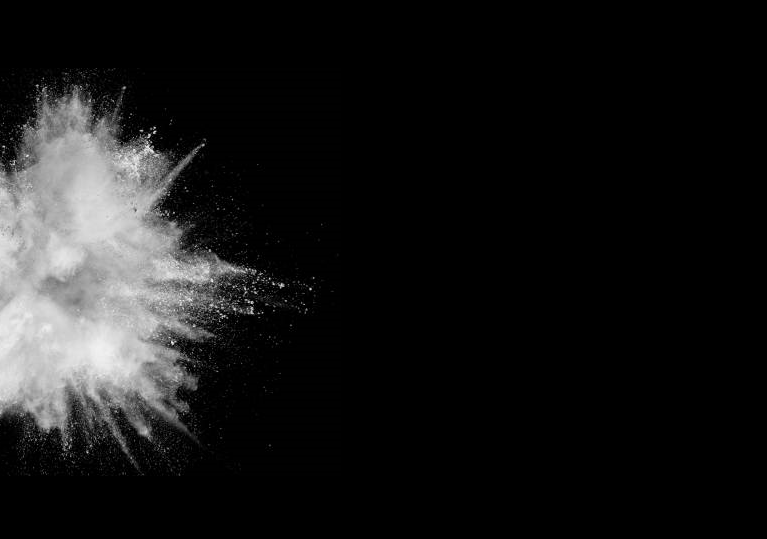
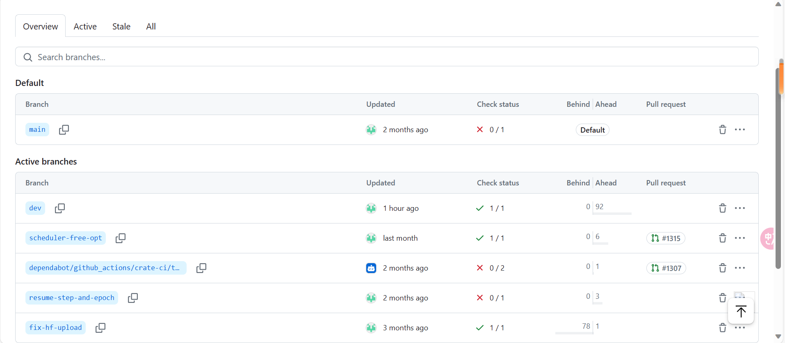
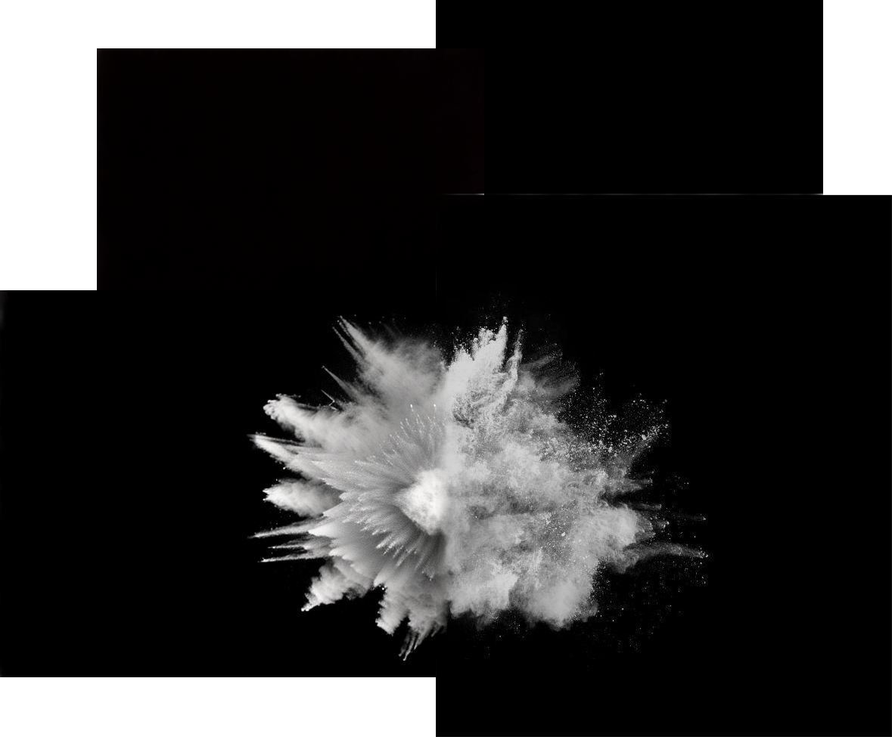
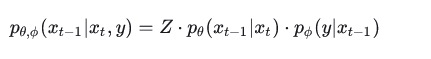

# outpaint

   
    
prompt: explosion, white, black    


一般来说全参调，或者lora,或者controlnet   
去网上，社区找开源模型    
2.controlnet 局部重绘 inpaint_only_lama control_v11p_sd15_inpaint    
powerpaint   
等   

涂鸦 inpaint都可以视作扩图方法 都做mask

# glid


https://github.com/Jack000/glid-3-xl-stable    
https://huggingface.co/Jack000/glid-3-xl-stable/tree/main/default   
运行训练有些问题   
可以推理   


拆开ckpt:   

    # split checkpoint
    python split.py sd-v1-4.ckpt

    # you should now have diffusion.pt and kl.pt

    # alternatively
    wget -O diffusion.pt https://huggingface.co/Jack000/glid-3-xl-stable/resolve/main/default/diffusion-1.4.pt
    wget -O kl.pt https://huggingface.co/Jack000/glid-3-xl-stable/resolve/main/default/kl-1.4.pt

kl模型暂不知用意是什么，拆开vae? 只在训练时候输入模型路径，推理不用？？？    


## 模型信息
GLID-3-xl-stable is stable diffusion back-ported to the OpenAI `guided diffusion` codebase, for easier development and training.

Commits on Aug 21, 2022     


## 代码

    elif args.outpaint == 'left':
        input_image = torch.zeros(1, 4, im.shape[2], im.shape[3]+32, device=device)
        input_image[:,:,:,32:32+im.shape[3]] = im
        input_image_mask = torch.zeros(1, 1, im.shape[2], im.shape[3]+32, device=device, dtype=torch.bool)
        input_image_mask[:,:,:,32:32+im.shape[3]] = True
1.创建一个与输入图像 im 相同大小的张量，但是宽度增加了32个像素的空白区域。这个张量是用零填充的，表示黑色背景。        
2.将原始图像 im 复制到这个新创建的张量中，复制到新张量的右侧，即向左填充32个像素的空白区域。      
3.创建一个与输入图像 im 相同大小的布尔型张量，同样是宽度增加了32个像素的空白区域，用于表示图像的掩码。       
4.将掩码的相应区域设置为 True，表示在这个区域内需要进行处理。     

这段代码的作用是在输入图像的左侧添加一个32像素宽的空白区域，同时为该区域生成一个掩码，用于后续的图像处理。     


```
from PIL import Image
import os

def resize_images(input_folder, output_folder_resize, output_folder_crop):
    # 创建保存文件夹
    os.makedirs(output_folder_resize, exist_ok=True)
    os.makedirs(output_folder_crop, exist_ok=True)

    # 遍历文件夹中的所有文件
    for filename in os.listdir(input_folder):
        # 确保是图片文件
        if filename.endswith(".jpg") or filename.endswith(".png") or filename.endswith(".jpeg"):
            # 打开图片
            img_path = os.path.join(input_folder, filename)
            img = Image.open(img_path)

            # Resize图片为512x512
            resized_img = img.resize((512, 512))

            # 保存resize后的图片到文件夹1
            output_path_resize = os.path.join(output_folder_resize, filename)
            resized_img.save(output_path_resize)

            # 切割图片
            width, height = resized_img.size
            left = width // 2
            top = 0
            right = width
            bottom = height
            cropped_img = resized_img.crop((left, top, right, bottom))

            # 保存切割后的图片到文件夹2
            output_path_crop = os.path.join(output_folder_crop, filename)
            cropped_img.save(output_path_crop)

    print("任务完成！")

# 设置输入文件夹和输出文件夹
input_folder = "input_folder_path"
output_folder_resize = "output_folder1_path"
output_folder_crop = "output_folder2_path"

# 调用函数
resize_images(input_folder, output_folder_resize, output_folder_crop)


```

178张

```
from PIL import Image
import os
def resize_images(input_folder, output_folder_crop):
    # 创建保存文件夹
    os.makedirs(output_folder_crop, exist_ok=True)
    i=0
    # 遍历文件夹中的所有文件
    for filename in os.listdir(input_folder):
        # 确保是图片文件
        i += 1
        if filename.endswith(".jpg") or filename.endswith(".png") or filename.endswith(".jpeg"):
            # 打开图片
            img_path = os.path.join(input_folder, filename)
            img = Image.open(img_path)


            # 切割图片
            width, height = img.size
            left = width // 2
            top = 0
            right = width
            bottom = height
            cropped_img = img.crop((left, top, right, bottom))

            # 保存切割后的图片到文件夹2
            #output_path_crop = os.path.join(output_folder_crop, filename)
            #cropped_img.save(output_path_crop)

    print(f"{i} 任务完成！")

```


    else:
        input_image_pil = Image.open(fetch(args.edit)).convert('RGB')

        im = transforms.ToTensor()(input_image_pil).unsqueeze(0).to(device)
        im = 2*im-1
        im = ldm.encode(im).sample()
        有些奇怪 
取一半outpaint，感觉不正确，因为图原本已经裁一半了    
但是生出的还是挺大的    
32 改成 im.shape[3]//2    

在latant空间加减像素吗？？？    
另外该程序最后还不是resize。是填充灰色    
     


## 报错
    Traceback (most recent call last):
    File "/data/lujunda/sd/glid-3-xl-stable-master/sample.py", line 32, in <module>
        from transformers import CLIPTokenizer, CLIPTextModel
    File "/home/lujunda/.conda/envs/glid-sd/lib/python3.9/site-packages/transformers/__init__.py", line 43, in <module>
        from . import dependency_versions_check
    File "/home/lujunda/.conda/envs/glid-sd/lib/python3.9/site-packages/transformers/dependency_versions_check.py", line 41, in <module>
        require_version_core(deps[pkg])
    File "/home/lujunda/.conda/envs/glid-sd/lib/python3.9/site-packages/transformers/utils/versions.py", line 94, in require_version_core
        return require_version(requirement, hint)
    File "/home/lujunda/.conda/envs/glid-sd/lib/python3.9/site-packages/transformers/utils/versions.py", line 85, in require_version
        if want_ver is not None and not ops[op](version.parse(got_ver), version.parse(want_ver)):
    File "/home/lujunda/.conda/envs/glid-sd/lib/python3.9/site-packages/packaging/version.py", line 54, in parse
        return Version(version)
    File "/home/lujunda/.conda/envs/glid-sd/lib/python3.9/site-packages/packaging/version.py", line 200, in __init__
        raise InvalidVersion(f"Invalid version: '{version}'")
    packaging.version.InvalidVersion: Invalid version: '0.10.1,<0.11'

需要升级transformers   
numpy也是和torch版本一一对应      

    Traceback (most recent call last):
    File "/data/lujunda/sd/glid-3-xl-stable-master/sample.py", line 252, in <module>
        ldm = instantiate_from_config(kl_config.model)
    File "/data/lujunda/sd/glid-3-xl-stable-master/latent-diffusion/ldm/util.py", line 85, in instantiate_from_config
        return get_obj_from_str(config["target"])(**config.get("params", dict()))
    File "/data/lujunda/sd/glid-3-xl-stable-master/latent-diffusion/ldm/util.py", line 93, in get_obj_from_str
        return getattr(importlib.import_module(module, package=None), cls)
    File "/home/lujunda/.conda/envs/glid-sd/lib/python3.9/importlib/__init__.py", line 127, in import_module
        return _bootstrap._gcd_import(name[level:], package, level)
    File "<frozen importlib._bootstrap>", line 1030, in _gcd_import
    File "<frozen importlib._bootstrap>", line 1007, in _find_and_load
    File "<frozen importlib._bootstrap>", line 986, in _find_and_load_unlocked
    File "<frozen importlib._bootstrap>", line 680, in _load_unlocked
    File "<frozen importlib._bootstrap_external>", line 850, in exec_module
    File "<frozen importlib._bootstrap>", line 228, in _call_with_frames_removed
    File "/data/lujunda/sd/glid-3-xl-stable-master/latent-diffusion/ldm/models/autoencoder.py", line 2, in <module>
        import pytorch_lightning as pl
    File "/home/lujunda/.conda/envs/glid-sd/lib/python3.9/site-packages/pytorch_lightning/__init__.py", line 20, in <module>
        from pytorch_lightning import metrics  # noqa: E402
    File "/home/lujunda/.conda/envs/glid-sd/lib/python3.9/site-packages/pytorch_lightning/metrics/__init__.py", line 15, in <module>
        from pytorch_lightning.metrics.classification import (  # noqa: F401
    File "/home/lujunda/.conda/envs/glid-sd/lib/python3.9/site-packages/pytorch_lightning/metrics/classification/__init__.py", line 14, in <module>
        from pytorch_lightning.metrics.classification.accuracy import Accuracy  # noqa: F401
    File "/home/lujunda/.conda/envs/glid-sd/lib/python3.9/site-packages/pytorch_lightning/metrics/classification/accuracy.py", line 18, in <module>
        from pytorch_lightning.metrics.utils import deprecated_metrics, void
    File "/home/lujunda/.conda/envs/glid-sd/lib/python3.9/site-packages/pytorch_lightning/metrics/utils.py", line 22, in <module>
        from torchmetrics.utilities.data import get_num_classes as _get_num_classes
    ImportError: cannot import name 'get_num_classes' from 'torchmetrics.utilities.data' (/home/lujunda/.conda/envs/glid-sd/lib/python3.9/site-packages/torchmetrics/utilities/data.py)


pip install pytorch-lightning  --upgrade
要使用torch2.2与nvcc不匹配

使用nvcc 11.3 torch1.12    
pip --no-cache-dir install pytorch-lightning==2.1.0    


    This application failed to start because no Qt platform plugin could be initialized. Reinstalling the application may fix this problem.


pip3 install opencv-python==4.1.2.30     
找不到

For me, it worked by using a opencv-python version prior to 4.2 version that just got released. 

pip3 install opencv-python==3.4.18.65   
找不到别的

    qt.qpa.xcb: could not connect to display 
    qt.qpa.plugin: Could not load the Qt platform plugin "xcb" in "" even though it was found.
    This application failed to start because no Qt platform plugin could be initialized. Reinstalling the application may fix this problem.

    Available platform plugins are: eglfs, linuxfb, minimal, minimalegl, offscreen, vnc, wayland-egl, wayland, wayland-xcomposite-egl, wayland-xcomposite-glx, webgl, xcb.

    已放弃 (核心已转储)

无法用 学校a100可能需要   
For Ubuntu users,

sudo apt-get install qt5-default fixes the issue.

(I'm using OpenCV 4.4)

## 2080
还是已放弃 (核心已转储)   
安装 sudo apt-get install qt5-default    
找不到      

sudo apt-get install qtbase5-dev qtchooser qt5-qmake qtbase5-dev-tools qtcreator

无法发起与 mirrors.tuna.tsinghua.edu.cn:80 (

    
过于麻烦，后续再看


## 顺利安装
只需要矩池云就可以顺利安装所有的环境       

推理运行时：       
ImportError: cannot import name 'masks_to_boxes' from 'torchvision.ops' (/root/miniconda3/envs/ldm/lib/python3.8/site-packages/torchvision/ops/__init__.py)       

torch2.3   torchvision 0.8.1   

pip install torch==2.0.1 torchvision==0.15.2 torchaudio==2.0.2

    File "sample.py", line 32, in <module>
        from transformers import CLIPTokenizer, CLIPTextModel
    File "/root/miniconda3/envs/ldm/lib/python3.8/site-packages/transformers/__init__.py", line 43, in <module>
    from . import dependency_versions_check

    File "/root/miniconda3/envs/ldm/lib/python3.8/site-packages/packaging/version.py", line 200, in __init__
        raise InvalidVersion(f"Invalid version: '{version}'")
    packaging.version.InvalidVersion: Invalid version: '0.10.1,<0.11'


    pip show packaging
    Name: packaging
    Version: 24.0


报错原因

    packaging.version版本过高

    解决方向
    降低packaging版本；
    先尝试降低2个版本：

    pip install packaging==21.3 -i https://pypi.tuna.tsinghua.edu.cn/simple/
    1
    问题解决结果（成功解决）

接下来


    Traceback (most recent call last):
    File "sample.py", line 32, in <module>
        from transformers import CLIPTokenizer, CLIPTextModel
    ImportError: cannot import name 'CLIPTokenizer' from 'transformers' (unknown location)


    pip show transformers
    Name: transformers
    Version: 4.3.1

    pip install transformers==4.8.0


终于版本检查通过，可以运行进去了        


ImportError:      
cannot import name 'get_num_classes' from 'torchmetrics.utilities.data' (/root/miniconda3/envs/ldm/lib/python3.8/site-packages/torchmetrics/utilities/data.py)

pip --no-cache-dir install pytorch-lightning==2.1.0    

    Attempting uninstall: pytorch-lightning
        Found existing installation: pytorch-lightning 1.4.2
        Uninstalling pytorch-lightning-1.4.2:
        Successfully uninstalled pytorch-lightning-1.4.2
    Successfully installed pytorch-lightning-2.1.0

还是这个    

    making attention of type 'vanilla' with 512 in_channels
    draw the area for inpainting, then close the window
    qt.qpa.plugin: Could not load the Qt platform plugin "xcb" in "" even though it was found.
    This application failed to start because no Qt platform plugin could be initialized. Reinstalling the application may fix this problem.

    Available platform plugins are: eglfs, linuxfb, minimal, minimalegl, offscreen, vnc, wayland-egl, wayland, wayland-xcomposite-egl, wayland-xcomposite-glx, webgl, xcb.


pip install opencv-python-headless

sudo apt-get install qt5-default

解决不了，这个版本已经对了 opencv-python             4.1.2.30           

pip install --upgrade pyqt5_tools

    Attempting uninstall: pyqt5
        Found existing installation: PyQt5 5.15.10
        Uninstalling PyQt5-5.15.10:
        Successfully uninstalled PyQt5-5.15.10
    Successfully installed pyqt5-5.15.9 pyqt5-plugins-5.15.9.2.3 pyqt5-tools-5.15.9.3.3 python-dotenv-1.0.1 qt5-applications-5.15.2.2.3 qt5-tools-5.15.2.1.3

单单是运行就已经报错改了三次还不行        
启动还很慢      


    Version:0.9 StartHTML:0000000170 EndHTML:0000004125 StartFragment:0000000206 EndFragment:0000004089 SourceURL:https://github.com/NVlabs/instant-ngp/discussions/300 I was trying hard, but could not fix it. I was downloading literally hundreds of different packages, over and over again, trying all sorts of "hacks" found online, eventually trying anaconda, a massive download...
    In the end, I don't know if that was the fix, because my system is about to be reinstalled after all of my "trying", BUT, after I wrote this in console:
    export QT_QPA_PLATFORM=offscreen

## 解决关键 export QT_QPA_PLATFORM=offscreen


第四次好像成功了，但是linux没有图形界面

    Working with z of shape (1, 4, 32, 32) = 4096 dimensions.
    making attention of type 'vanilla' with 512 in_channels
    draw the area for inpainting, then close the window
    QStandardPaths: XDG_RUNTIME_DIR not set, defaulting to '/tmp/runtime-root'


用linux服务器没有图形界面，qt一直打不开，后续应该只能直接使用mask_file做输入才能出结果，这个我还得看下怎么改

运行显存 8620MiB         


    警告或报错问题：XDG_RUNTIME_DIR not set, defaulting to ‘/tmp/runtime-root‘
    解决方法：
    方法一：设置环境变量：终端输入export XDG_RUNTIME_DIR=/usr/lib/
    方法二：在/etc/profile末尾增加两句

    export XDG_RUNTIME_DIR=/usr/lib/
    export RUNLEVEL=3
    1
    2
    然后刷新全局变量

    source /etc/profile


在MacOS系统上安装Putty，得先安装MacPorts，它是一个类似brew的包管理工具。    
因为putty工具在Linux和macOS下，都是使用的GTK+图形界面，所以需要安装GTK支持。打开终端，使用port命令安装GTK+，命令如下：   

四、安装XQuartz

XQuartz提供Mac下的绘图层支持，请打开下方链接下载dmg文件：

五、安装Putty

sudo port install putty

稍微麻烦 四步完成，不如直接提供mask_file

需要本地电脑装putty     
服务器再装一个可视化服务器       
gpt        


## gui这一步总算是运行成功
但是需要一个mask_file     
应该就可以了


module 'PIL.Image' has no attribute 'ANTIALIAS'         


pip uninstall -y Pillow       
pip install Pillow==9.5.0


Successfully uninstalled pillow-10.3.0


## 终于

    Using device: cuda:0
    making attention of type 'vanilla' with 512 in_channels
    Working with z of shape (1, 4, 32, 32) = 4096 dimensions.
    making attention of type 'vanilla' with 512 in_channels
    sample.py:362: DeprecationWarning: ANTIALIAS is deprecated and will be removed in Pillow 10 (2023-07-01). Use LANCZOS or Resampling.LANCZOS instead.
    mask_image = mask_image.resize((input_image.shape[3],input_image.shape[2]), Image.ANTIALIAS)
    100%|█████████████████████████████| 50/50 [00:09<00:00,  5.10it/s]
    100%|█████████████████████████████| 50/50 [00:10<00:00,  4.97it/s]
    100%|█████████████████████████████| 50/50 [00:10<00:00,  4.97it/s]
    100%|█████████████████████████████| 50/50 [00:10<00:00,  4.96it/s]


显存峰值10676mb

好像是ddim     
50步         
然后使用类似tile渲染      

python sample.py --model_path inpaint.pt --edit 1.png --text "explosion, grepscale" --outpaint left --kl_path kl.pt --mask mask1.png    


大小正确但是不可控     


## 更改prompt
mask1     
     
512*512     

左黑右白可用     

按照32扩展    
python sample.py --model_path inpaint.pt --edit 1.png --text "explosion black white" --outpaint left --kl_path kl.pt --mask mask1.png --negative "color object human" --seed 0 --prefix "explosion" --guidance_scale 5.0     


按照一半扩展    
python sample_my.py --model_path inpaint.pt --edit 1.png --text "explosion black white" --outpaint left --kl_path kl.pt --mask mask1.png --negative "color object human" --seed 0 --prefix "explosion" --guidance_scale 5.0    
11916mb    
      
1024*680      

making attention of type 'vanilla' with 512 in_channels    
Working with z of shape (1, 4, 32, 32) = 4096 dimensions.    
making attention of type 'vanilla' with 512 in_channels    
im.shape[3]= 64    
im.shape[2]= 85     

     

mask全白       

扩展32       
   
结果差不多一样，但是比上面那个mask更好     
上面少了一些信息     

扩展一半     


全白mask生效分析     
mask1 = np.ones((height, width, 1), np.uint8) * 255
cv2.imwrite('mask-white.png', mask1)    

0黑，255是白      
灰度图和彩色图区别为：组成不同、通道不同、表示不同。      


## mask代码
推理代码处理 

    input_image = torch.zeros(1, 4, im.shape[2], im.shape[3]+32, device=device)
    input_image[:,:,:,32:32+im.shape[3]] = im
    input_image_mask = torch.zeros(1, 1, im.shape[2], im.shape[3]+32, device=device, dtype=torch.bool)
    input_image_mask[:,:,:,32:32+im.shape[3]] = True
    这行代码创建了一个全零的张量（tensor），使用了 torch.zeros 函数。该张量是一个布尔类型（torch.bool），并且被设定在特定的 device 上（这个设备由代码中的变量 device 决定，可能是 GPU 或 CPU）。
    这段代码的作用是创建一个和输入图像同样大小的掩码，这个掩码的宽度比输入图像的宽度大 32 个像素，掩码中除了与输入图像宽度相同的部分外，其余部分都被标记为无效。

    mask1 = (mask > 0.5)
    input_image_mask *= mask1

    扩展后的图片全部设置成true然后inpaint
    但是是如何保证原油的不变？？
    因为这个相乘操作。原本扩展部分就是默认是false的，所以整个input_image_mask属于正常逻辑的mask,不需要特别提供mask_file，给个全白即可，自动outpaint

    image_embed = torch.cat(args.batch_size*2*[input_image], dim=0).float()


    kwargs = {
        "context": torch.cat([text_emb, text_emb_blank], dim=0).float(),
        "clip_embed": None,
        "image_embed": image_embed
    }


    后续
    overlap = 32
    这个overlap导致图片空白边缘出现。为了满足模型的一些限制   


    if args.edit:
        for i in range(args.num_batches):
            output = input_image.detach().clone()
            output *= input_image_mask.repeat(1, 4, 1, 1).float()
            output就是im所在部分true 

            mask = input_image_mask.detach().clone()

            box = masks_to_boxes(~mask.squeeze(0))[0]

            x0 = int(box[0])
            y0 = int(box[1])
            x1 = int(box[2] + 1)
            y1 = int(box[3] + 1)

            x_num = math.ceil(((x1-x0)-overlap)/(64-overlap))
            y_num = math.ceil(((y1-y0)-overlap)/(64-overlap))

            if x_num < 1:
                x_num = 1
            if y_num < 1:
                y_num = 1

            for y in range(y_num):
                for x in range(x_num):
                    offsetx = x0 + x*(64-overlap)
                    offsety = y0 + y*(64-overlap)

                    if offsetx + 64 > x1:
                        offsetx = x1 - 64
                    if offsetx < 0:
                        offsetx = 0

                    if offsety + 64 > y1:
                        offsety = y1 - 64
                    if offsety < 0:
                        offsety = 0

                    patch_input = output[:,:, offsety:offsety+64, offsetx:offsetx+64]
                    patch_mask = mask[:,:, offsety:offsety+64, offsetx:offsetx+64]

                    if not torch.any(~patch_mask):
                        # region does not require any inpainting
                        output[:,:, offsety:offsety+64, offsetx:offsetx+64] = patch_input
                        continue

                    mask[:,:, offsety:offsety+64, offsetx:offsetx+64] = True

                    patch_init = None
    
    
                    if args.skip_timesteps > 0:
                        patch_init = input_image[:,:, offsety:offsety+64, offsetx:offsetx+64]
                        patch_init = torch.cat([patch_init, patch_init], dim=0)

                    skip_timesteps = args.skip_timesteps

                    if not torch.any(patch_mask):
                        # region has no input image, cannot use init
                        patch_init = None
                        skip_timesteps = 0

                    patch_kwargs = {
                        "context": kwargs["context"],
                        "clip_embed": None,
                        "image_embed": torch.cat([patch_input, patch_input], dim=0)
                    }


                    cur_t = diffusion.num_timesteps - 1

                    samples = sample_fn(
                        model_fn,
                        (2, 4, 64, 64),
                        clip_denoised=False,
                        model_kwargs=patch_kwargs,
                        cond_fn=cond_fn,
                        device=device,
                        progress=True,
                        init_image=patch_init,
                        skip_timesteps=skip_timesteps,
                    )

                    for j, sample in enumerate(samples):
                        cur_t -= 1
                        output[0,:, offsety:offsety+64, offsetx:offsetx+64] = sample['pred_xstart'][0]
                        if j % 25 == 0:
                            save_sample(i, output, square=(offsetx, offsety))

                    save_sample(i, output)


## 接下来
换prompt     
进去看隐变量大小    


# 训练glid
Training/Fine tuning 和 Train inpainting 的 arg 参数一致     

Train with same flags as guided diffusion. Data directory should contain image and text files with the same name (image1.png image1.txt)

A custom inpainting/outpainting model trained for an additional 100k steps

对于正常训练模型会merge会sd14      

    model_path = sys.argv[1]
    diffusion_path = sys.argv[2]

    state = torch.load(model_path)
    diffusion = torch.load(diffusion_path)

    diffusion_prefix = 'model.diffusion_model.'

    for key in diffusion.keys():
        state['state_dict'][diffusion_prefix + key] = diffusion[key]

    torch.save(state, 'model-merged.pt')

## 代码差异观察
inpaint多了    

    blur = transforms.GaussianBlur(kernel_size=35, sigma=(0.1, 5)
    定义了一个高斯模糊的变换，它将被用于生成随机的遮罩(mask)。


    emb_cond = emb.detach().clone()

    for i in range(batch.shape[0]):
        if random.randint(0,100) < 20:
        以20%的概率执行以下操作。
            emb_cond[i,:,:,:] = 0 # unconditional
        else:
            if random.randint(0,100) < 50: # random mask
            随机掩码：以一定的概率，生成一个随机的掩码（mask），通过模糊化处理后，将其应用于输入的特征向量（emb_cond）。这个掩码是一个二元的张量，与输入的特征向量形状相同，用于控制哪些元素被保留（值为1）或者被遮蔽（值为0）。
                mask = torch.randn(1, emb.shape[2], emb.shape[3]).to(dist_util.dev())
                mask = blur(mask)
                mask = (mask > 0)
                mask = mask.repeat(4, 1, 1)
                mask = mask.float()
                emb_cond[i] *= mask
                生成一个与输入特征向量（emb）同形状的随机张量作为掩码，然后通过blur函数进行模糊处理，将其二值化为0或1，并将其复制多份以覆盖整个特征向量的空间维度。最后将掩码应用于输入特征向量，将对应位置的元素置为0。
            else:
            随机遮蔽矩形：以一定的概率，对输入的特征向量应用随机数量的矩形遮罩。每个矩形的位置和大小都是随机生成的，并且会将这些矩形区域内的元素置为0，从而达到遮蔽的效果。
                # mask out 4 random rectangles
                for j in range(random.randint(1,4)):
                随机生成1到4之间的数值，确定要生成的矩形数量。然后对每个矩形，随机生成其宽度和高度，并根据特征向量的尺寸确定其位置，将该区域内的元素置为0，以达到遮蔽的效果。
                    max_area = emb.shape[2]*emb.shape[3]//2

                    w = random.randint(1,emb.shape[3])
                    h = random.randint(1,emb.shape[2])
                    if w*h > max_area:
                        if random.randint(0,100) < 50:
                            w = max_area//h
                        else:
                            h = max_area//w
                    if w == emb.shape[3]:
                        offsetx = 0
                    else:
                        offsetx = random.randint(0, emb.shape[3]-w)
                    if h == emb.shape[2]:
                        offsety = 0
                    else:
                        offsety = random.randint(0, emb.shape[2]-h)
                    emb_cond[i,:, offsety:offsety+h, offsetx:offsetx+w] = 0


    model_kwargs["image_embed"] = emb_cond
    将处理后的条件化的嵌入张量 emb_cond 存储在模型参数字典 model_kwargs 中，以便后续传递给模型。


    defaults['image_condition'] = True


## lora解决
这是全量微调的代码     

考虑直接训练一个爆炸图片的lora     
trainer不知道行不    
到时加载底模，训练框架有些问题     
必须用trainer或diffusers训练lora，那里比较成熟。但是底模不知道能不能加载上原本的      

训练和推理有些问题    
倒是可以训练一个任意底模的LORA，用SD-SCRIPT    
但是推理时候怎么合到源代码里面？     


glid源代码模型加载方式     

    model_config = model_and_diffusion_defaults()
    model_config.update(model_params)

    # Load models
    model, diffusion = create_model_and_diffusion(**model_config)
    model.load_state_dict(model_state_dict, strict=True)
    model.requires_grad_(False).eval().to(device)


加载lora比较麻烦     
直接全参数训练吧     

## 全参数训练解决
继承于 guided_diffusion

其模型结构     

    def model_and_diffusion_defaults():
        """
        Defaults for image training.
        """
        res = dict(
            image_size=64,
            num_channels=128,
            num_res_blocks=2,
            num_heads=4,
            num_heads_upsample=-1,
            num_head_channels=-1,
            attention_resolutions="16,8",
            channel_mult="",
            dropout=0.0,
            class_cond=False,
            use_checkpoint=True,
            use_scale_shift_norm=True,
            resblock_updown=False,
            use_fp16=False,

            use_spatial_transformer=True,
            context_dim=768,

            clip_embed_dim=None,
            image_condition=False,
            super_res_condition=False
        )
        res.update(diffusion_defaults())
        return res


24g bs1训练不了


## 学校a100装环境报错
mpi4py    
ERROR: Could not build wheels for mpi4py, which is required to install pyproject.toml-based projects      

训练不起来    


    collect2: error: ld returned 1 exit status
        failure.
        removing: _configtest.c _configtest.o
        error: Cannot link MPI programs. Check your configuration!!!
        [end of output]
    
    note: This error originates from a subprocess, and is likely not a problem with pip.
    ERROR: Failed building wheel for mpi4py
    Failed to build mpi4py
    ERROR: Could not build wheels for mpi4py, which is required to install pyproject.toml-based projects


解决方法:     
换conda安装     
conda install mpi4py       

StackOverflow也有说sudo装一些东西，但没必要了         

## 训练过程

bs1 训练显存33g

    MODEL_FLAGS="--actual_image_size 512 --lr_warmup_steps 10000 --ema_rate 0.9999 --attention_resolutions 64,32,16 --class_cond False --diffusion_steps 1000 --image_size 64 --learn_sigma False --noise_schedule linear --num_channels 320 --num_heads 8 --num_res_blocks 2 --resblock_updown False --use_fp16 True --use_scale_shift_norm False "
    TRAIN_FLAGS="--lr 5e-5 --batch_size 1 --log_interval 10 --save_interval 10000 --kl_model checkpoint/kl-1.4.pt --resume_checkpoint checkpoint/ema_0.9999_100000.pt"
    export OPENAI_LOGDIR=./logs_inpaint/
    python scripts/image_train_inpaint.py --data_dir datasets/mydata $MODEL_FLAGS $TRAIN_FLAGS

两张图片训练       
       


A custom inpainting/outpainting model trained for an additional 100k steps

readme说额外训练10万步       
不知道他的数据量多少      

model, diffusion = create_model_and_diffusion(
        **args_to_dict(args, model_and_diffusion_defaults().keys())
    )

有些奇怪         


OPENAI_
LOGDIR=./logs_inpaint1/ python -m debugpy --l
isten 7890 --wait-for-client scripts/image_tr
ain_inpaint.py --data_dir datasets/mydata --lr 5e
-5 --batch_size 1 --log_interval 10 --save_in
terval 10000 --kl_model checkpoint/kl-1.4.pt 
--resume_checkpoint checkpoint/ema_0.9999_100
000.pt --actual_image_size 512 --lr_warmup_st
eps 10000 --ema_rate 0.9999 --attention_resol
utions 64,32,16 --class_cond False --diffusio
n_steps 1000 --image_size 64 --learn_sigma Fa
lse --noise_schedule linear --num_channels 32
0 --num_heads 8 --num_res_blocks 2 --resblock
_updown False --use_fp16 True --use_scale_shi
ft_norm False --lr_anneal_steps 15000 结束步数


OPENAI_
LOGDIR=./logs_inpaint1/ python scripts/image_tr
ain_inpaint.py --data_dir datasets/mydata --lr 5e
-5 --batch_size 1 --log_interval 10 --save_in
terval 10000 --kl_model checkpoint/kl-1.4.pt 
--resume_checkpoint checkpoint/ema_0.9999_100
000.pt --actual_image_size 512 --lr_warmup_st
eps 10000 --ema_rate 0.9999 --attention_resol
utions 64,32,16 --class_cond False --diffusio
n_steps 1000 --image_size 64 --learn_sigma Fa
lse --noise_schedule linear --num_channels 32
0 --num_heads 8 --num_res_blocks 2 --resblock
_updown False --use_fp16 True --use_scale_shi
ft_norm False --lr_anneal_steps 15000 结束步数


## 扩图方向增加
这个guidance diffusion模型应该在 webui inpaint 用不了，现在都是直接支持sd1.5 或者 sdxl类型的，这个早版本的架构没人用的。应该不支持    


# 通用训练 inpaint
使用sd1.5 sdxl框架     
然后用webui     


## train_dreambooth_inpaint_lora
diffusers/examples/research_projects/dreambooth_inpaint/train_dreambooth_inpaint_lora.py

diffusers还算注释详细，有点良心的      
功能较齐全     

### glid代码mask处理

    input_image = torch.zeros(1, 4, im.shape[2], im.shape[3]+32, device=device)
    input_image[:,:,:,32:32+im.shape[3]] = im
    input_image_mask = torch.zeros(1, 1, im.shape[2], im.shape[3]+32, device=device, dtype=torch.bool)
    input_image_mask[:,:,:,32:32+im.shape[3]] = True
    这行代码创建了一个全零的张量（tensor），使用了 torch.zeros 函数。该张量是一个布尔类型（torch.bool），并且被设定在特定的 device 上（这个设备由代码中的变量 device 决定，可能是 GPU 或 CPU）。
    这段代码的作用是创建一个和输入图像同样大小的掩码，这个掩码的宽度比输入图像的宽度大 32 个像素，掩码中除了与输入图像宽度相同的部分外，其余部分都被标记为无效。

    mask1 = (mask > 0.5)
    input_image_mask *= mask1


### mask准备     

    def prepare_mask_and_masked_image(image, mask):
        image = np.array(image.convert("RGB"))
        image = image[None].transpose(0, 3, 1, 2)
        image = torch.from_numpy(image).to(dtype=torch.float32) / 127.5 - 1.0

        mask = np.array(mask.convert("L"))
        mask = mask.astype(np.float32) / 255.0
        mask = mask[None, None]
        mask[mask < 0.5] = 0
        mask[mask >= 0.5] = 1
        mask = torch.from_numpy(mask)

        masked_image = image * (mask < 0.5)
        逻辑与glid相反，左黑右白可用。也就是glid白色才是正确mask原图位置。glid逻辑比较多，负负得正的效果，比较乱     
        

        return mask, masked_image


    # generate random masks
    def random_mask(im_shape, ratio=1, mask_full_image=False):
        mask = Image.new("L", im_shape, 0)
        draw = ImageDraw.Draw(mask)
        size = (random.randint(0, int(im_shape[0] * ratio)), random.randint(0, int(im_shape[1] * ratio)))
        随机size
        # use this to always mask the whole image
        if mask_full_image:
            size = (int(im_shape[0] * ratio), int(im_shape[1] * ratio))
        limits = (im_shape[0] - size[0] // 2, im_shape[1] - size[1] // 2)
        控制 center 范围不要超出
        center = (random.randint(size[0] // 2, limits[0]), random.randint(size[1] // 2, limits[1]))
        随机 center
        draw_type = random.randint(0, 1)
        if draw_type == 0 or mask_full_image: 长方形
            draw.rectangle(
                (center[0] - size[0] // 2, center[1] - size[1] // 2, center[0] + size[0] // 2, center[1] + size[1] // 2),
                fill=255,
            )
        else: 画椭圆
            draw.ellipse(
                (center[0] - size[0] // 2, center[1] - size[1] // 2, center[0] + size[0] // 2, center[1] + size[1] // 2),
                fill=255,
            )

        return mask

        glid中好像是有1-4个正方形，随机遮


### mask collate_fn

    def collate_fn(examples):
        input_ids = [example["instance_prompt_ids"] for example in examples]
        pixel_values = [example["instance_images"] for example in examples]

        # Concat class and instance examples for prior preservation.
        # We do this to avoid doing two forward passes.
        if args.with_prior_preservation:
            input_ids += [example["class_prompt_ids"] for example in examples]
            pixel_values += [example["class_images"] for example in examples]
            pior_pil = [example["class_PIL_images"] for example in examples]

        masks = []
        masked_images = []
        for example in examples:
            pil_image = example["PIL_images"]
            # generate a random mask
            mask = random_mask(pil_image.size, 1, False)
            # prepare mask and masked image
            mask, masked_image = prepare_mask_and_masked_image(pil_image, mask)

            masks.append(mask)
            masked_images.append(masked_image)

        if args.with_prior_preservation:
            for pil_image in pior_pil:
                # generate a random mask
                mask = random_mask(pil_image.size, 1, False)
                # prepare mask and masked image
                mask, masked_image = prepare_mask_and_masked_image(pil_image, mask)

                masks.append(mask)
                masked_images.append(masked_image)

        pixel_values = torch.stack(pixel_values)
        pixel_values = pixel_values.to(memory_format=torch.contiguous_format).float()

        input_ids = tokenizer.pad({"input_ids": input_ids}, padding=True, return_tensors="pt").input_ids
        masks = torch.stack(masks)
        masked_images = torch.stack(masked_images)
        batch = {"input_ids": input_ids, "pixel_values": pixel_values, "masks": masks, "masked_images": masked_images}
        return batch

    train_dataloader = torch.utils.data.DataLoader(
        train_dataset, batch_size=args.train_batch_size, shuffle=True, collate_fn=collate_fn
    )        


### mask使用

    # Convert masked images to latent space
    masked_latents = vae.encode(
        batch["masked_images"].reshape(batch["pixel_values"].shape).to(dtype=weight_dtype)
    ).latent_dist.sample()
    masked_latents = masked_latents * vae.config.scaling_factor

    masks = batch["masks"]
    # resize the mask to latents shape as we concatenate the mask to the latents
    mask = torch.stack(
        [
            torch.nn.functional.interpolate(mask, size=(args.resolution // 8, args.resolution // 8))
            for mask in masks
        ]
    ).to(dtype=weight_dtype)
    mask = mask.reshape(-1, 1, args.resolution // 8, args.resolution // 8)

    # concatenate the noised latents with the mask and the masked latents
    latent_model_input = torch.cat([noisy_latents, mask, masked_latents], dim=1)

### Training with prior-preservation loss
Prior-preservation is used to avoid overfitting and language-drift.

For prior-preservation we first generate images using the model with a class prompt and then use those during training along with our data.        
According to the paper, it's recommended to generate num_epochs * num_samples images for prior-preservation. 200-300 works well for most cases.


Training with gradient checkpointing and 8-bit optimizer:       
With the help of gradient checkpointing and the 8-bit optimizer from bitsandbytes it's possible to run train dreambooth on a 16GB GPU.


Fine-tune text encoder with the UNet.       
The script also allows to fine-tune the text_encoder along with the unet. It's been observed experimentally that fine-tuning text_encoder gives much better results especially on faces. Pass the --train_text_encoder argument to the script to enable training text_encoder.


### loss

    # Convert images to latent space
    # Convert masked images to latent space
    # resize the mask to latents shape as we concatenate the mask to the latents

    mask = torch.stack(
        [
            torch.nn.functional.interpolate(mask, size=(args.resolution // 8, args.resolution // 8))
            for mask in masks
        ]
    ).to(dtype=weight_dtype)
    mask = mask.reshape(-1, 1, args.resolution // 8, args.resolution // 8)

    noise = torch.randn_like(latents)

    # Add noise to the latents according to the noise magnitude at each timestep
    # (this is the forward diffusion process)
    noisy_latents = noise_scheduler.add_noise(latents, noise, timesteps)

    # concatenate the noised latents with the mask and the masked latents
    latent_model_input = torch.cat([noisy_latents, mask, masked_latents], dim=1)

    # Get the text embedding for conditioning
    encoder_hidden_states = text_encoder(batch["input_ids"])[0]

    # Predict the noise residual
    noise_pred = unet(latent_model_input, timesteps, encoder_hidden_states).sample


    # Get the target for loss depending on the prediction type
    if noise_scheduler.config.prediction_type == "epsilon":
        target = noise
    elif noise_scheduler.config.prediction_type == "v_prediction":
        target = noise_scheduler.get_velocity(latents, noise, timesteps)
    else:
        raise ValueError(f"Unknown prediction type {noise_scheduler.config.prediction_type}")

    if args.with_prior_preservation:
        # Chunk the noise and noise_pred into two parts and compute the loss on each part separately.
        noise_pred, noise_pred_prior = torch.chunk(noise_pred, 2, dim=0)
        target, target_prior = torch.chunk(target, 2, dim=0)

        # Compute instance loss
        loss = F.mse_loss(noise_pred.float(), target.float(), reduction="none").mean([1, 2, 3]).mean()
        reduction="none" 参数指定了不进行降维操作，因此它会返回一个与输入相同形状的张量，其中每个元素代表对应位置的损失值。接着使用 .mean([1, 2, 3]) 对每个样本的损失进行求均值，最后再使用 .mean() 对所有样本的损失值再进行一次求均值，得到最终的损失值。
        .mean([1, 2, 3]) 表示在指定的维度上求均值。在PyTorch中，对张量调用 .mean() 方法时可以传入一个维度参数，该参数告诉函数在哪些维度上计算均值。在这种情况下，传入 [1, 2, 3] 表示在第1、2、3个维度上分别求均值。

        假设你有一个4维张量，形状为 [batch_size, channels, height, width]，那么 .mean([1, 2, 3]) 就会在通道、高度和宽度三个维度上分别计算均值，最终得到每个样本的均值。


        # Compute prior loss
        prior_loss = F.mse_loss(noise_pred_prior.float(), target_prior.float(), reduction="mean")
        通过 reduction="mean" 参数对所有元素的损失值进行求均值，得到最终的损失值。

        # Add the prior loss to the instance loss.
        loss = loss + args.prior_loss_weight * prior_loss

        好简单，就一个scale控制
    else:
        loss = F.mse_loss(noise_pred.float(), target.float(), reduction="mean")
    
直接就是 noisy_latent(加噪的latent)和mask和mask_latent 一起丢入unet，预测噪声，然后于真实噪声算mse            
mask_latent是没有加噪的。     


### 保存权重
    # Save the lora layers
    if accelerator.is_main_process:
        unet = unet.to(torch.float32)
        unet.save_attn_procs(args.output_dir)


### lora初始化

    # We only train the additional adapter LoRA layers
    vae.requires_grad_(False)
    text_encoder.requires_grad_(False)
    unet.requires_grad_(False)

    weight_dtype = torch.float32
    if args.mixed_precision == "fp16":
        weight_dtype = torch.float16
    elif args.mixed_precision == "bf16":
        weight_dtype = torch.bfloat16


    # Move text_encode and vae to gpu.
    # For mixed precision training we cast the text_encoder and vae weights to half-precision
    # as these models are only used for inference, keeping weights in full precision is not required.
    经验之谈
    unet.to(accelerator.device, dtype=weight_dtype)
    vae.to(accelerator.device, dtype=weight_dtype)
    text_encoder.to(accelerator.device, dtype=weight_dtype)


    if args.enable_xformers_memory_efficient_attention:
        if is_xformers_available():
            unet.enable_xformers_memory_efficient_attention()
        else:
            raise ValueError("xformers is not available. Make sure it is installed correctly")
    好像comfyui是给vae用xformers

    # now we will add new LoRA weights to the attention layers
    # It's important to realize here how many attention weights will be added and of which sizes
    # The sizes of the attention layers consist only of two different variables:
    # 1) - the "hidden_size", which is increased according to `unet.config.block_out_channels`.
    # 2) - the "cross attention size", which is set to `unet.config.cross_attention_dim`.

    # Let's first see how many attention processors we will have to set.
    # For Stable Diffusion, it should be equal to:
    # - down blocks (2x attention layers) * (2x transformer layers) * (3x down blocks) = 12
    # - mid blocks (2x attention layers) * (1x transformer layers) * (1x mid blocks) = 2
    # - up blocks (2x attention layers) * (3x transformer layers) * (3x down blocks) = 18
    # => 32 layers

    # Set correct lora layers
    lora_attn_procs = {}
    for name in unet.attn_processors.keys():
        cross_attention_dim = None if name.endswith("attn1.processor") else unet.config.cross_attention_dim
        这些个不是很理解
        if name.startswith("mid_block"):
            hidden_size = unet.config.block_out_channels[-1]
        elif name.startswith("up_blocks"):
            block_id = int(name[len("up_blocks.")])
            这些个不是很理解
            hidden_size = list(reversed(unet.config.block_out_channels))[block_id]
        elif name.startswith("down_blocks"):
            block_id = int(name[len("down_blocks.")])
            hidden_size = unet.config.block_out_channels[block_id]
    这个代码写法很像MoMA的set_ip_adapter


        lora_attn_procs[name] = LoRAAttnProcessor(hidden_size=hidden_size, cross_attention_dim=cross_attention_dim)

    unet.set_attn_processor(lora_attn_procs)
    lora_layers = AttnProcsLayers(unet.attn_processors)

    accelerator.register_for_checkpointing(lora_layers)


### 学习目标：dreambooth 和 dreambooth_lora 和 lora 训练的区别

dreambooth先验保留的图片如何生成

dreambooth_lora: 我理解是使用 dreambooth 损失训练lora, 这样可能稍微好一些    


## train_dreambooth_inpaint
diffusers/examples/research_projects/dreambooth_inpaint/train_dreambooth_inpaint.py


### 训练命令

    export MODEL_NAME="runwayml/stable-diffusion-inpainting"
    export INSTANCE_DIR="path-to-instance-images"
    export CLASS_DIR="path-to-class-images"
    export OUTPUT_DIR="path-to-save-model"

    accelerate launch train_dreambooth_inpaint.py \
    --pretrained_model_name_or_path=$MODEL_NAME  \
    --train_text_encoder \
    --instance_data_dir=$INSTANCE_DIR \
    --class_data_dir=$CLASS_DIR \
    --output_dir=$OUTPUT_DIR \
    --with_prior_preservation --prior_loss_weight=1.0 \
    --instance_prompt="a photo of sks dog" \
    --class_prompt="a photo of dog" \
    --resolution=512 \
    --train_batch_size=1 \
    --use_8bit_adam \
    --gradient_checkpointing \
    --learning_rate=2e-6 \
    --lr_scheduler="constant" \
    --lr_warmup_steps=0 \
    --num_class_images=200 \
    --max_train_steps=800

dreambooth读数据      


相关输入参数

    parser.add_argument(
        "--instance_data_dir",
        type=str,
        default=None,
        required=True,
        help="A folder containing the training data of instance images.",
    )
    parser.add_argument(
        "--class_data_dir",
        type=str,
        default=None,
        required=False,
        help="A folder containing the training data of class images.",
    )
    parser.add_argument(
        "--instance_prompt",
        type=str,
        default=None,
        help="The prompt with identifier specifying the instance",
    )
    parser.add_argument(
        "--class_prompt",
        type=str,
        default=None,
        help="The prompt to specify images in the same class as provided instance images.",
    )
    parser.add_argument(
        "--with_prior_preservation",
        default=False,
        action="store_true",
        help="Flag to add prior preservation loss.",
    )
    parser.add_argument("--prior_loss_weight", type=float, default=1.0, help="The weight of prior preservation loss.")

    parser.add_argument(
        "--num_class_images",
        type=int,
        default=100,
        help=(
            "Minimal class images for prior preservation loss. If not have enough images, additional images will be"
            " sampled with class_prompt."
        ),
    )

就是说如果没有准备够，模型会先自己采样的，其实也不需要额外手动准备        

class DreamBoothDataset(Dataset):

    """
    A dataset to prepare the instance and class images with the prompts for fine-tuning the model.
    It pre-processes the images and the tokenizes prompts.
    """

    def __init__(
        self,
        instance_data_root,
        instance_prompt,
        tokenizer,
        class_data_root=None,
        class_prompt=None,
        size=512,
        center_crop=False,
    ):

        if class_data_root is not None:
            self.class_data_root = Path(class_data_root)
            self.class_data_root.mkdir(parents=True, exist_ok=True)
            self.class_images_path = list(self.class_data_root.iterdir())
            self.num_class_images = len(self.class_images_path)
            self._length = max(self.num_class_images, self.num_instance_images)
            self.class_prompt = class_prompt
        else:
            self.class_data_root = None

    def __getitem__(self, index):
        if self.class_data_root:
            class_image = Image.open(self.class_images_path[index % self.num_class_images])
            if not class_image.mode == "RGB":
                class_image = class_image.convert("RGB")
            class_image = self.image_transforms_resize_and_crop(class_image)
            example["class_images"] = self.image_transforms(class_image)
            example["class_PIL_images"] = class_image
            example["class_prompt_ids"] = self.tokenizer(
                self.class_prompt,
                padding="do_not_pad",
                truncation=True,
                max_length=self.tokenizer.model_max_length,
            ).input_ids

        return example


### class文件夹不够数量自动生成


    if args.with_prior_preservation:
        class_images_dir = Path(args.class_data_dir)
        if not class_images_dir.exists():
            class_images_dir.mkdir(parents=True)
        cur_class_images = len(list(class_images_dir.iterdir()))

        if cur_class_images < args.num_class_images:


            num_new_images = args.num_class_images - cur_class_images

            sample_dataset = PromptDataset(args.class_prompt, num_new_images)
            sample_dataloader = torch.utils.data.DataLoader(
                sample_dataset, batch_size=args.sample_batch_size, num_workers=1
            )

            for example in tqdm(
                sample_dataloader, desc="Generating class images", disable=not accelerator.is_local_main_process
            ):

            这个是inpaint训练代码，生成的竟然还要做mask？？？？
            没有mask还能理解dreambooth，这有了之后就不理解了
                bsz = len(example["prompt"])
                fake_images = torch.rand((3, args.resolution, args.resolution))
                transform_to_pil = transforms.ToPILImage()
                fake_pil_images = transform_to_pil(fake_images)

                fake_mask = random_mask((args.resolution, args.resolution), ratio=1, mask_full_image=True)
            
            全部mask掉，不就是输入空的latent吗，为了统一模型的输入吧
            和后面的统一


                images = pipeline(prompt=example["prompt"], mask_image=fake_mask, image=fake_pil_images).images

                for i, image in enumerate(images):
                    hash_image = insecure_hashlib.sha1(image.tobytes()).hexdigest()
                    image_filename = class_images_dir / f"{example['index'][i] + cur_class_images}-{hash_image}.jpg"
                    image.save(image_filename)

            del pipeline
            if torch.cuda.is_available():
                torch.cuda.empty_cache()


### 保存权重
这个脚本才能训练unet和text_encoder       
上个脚本只有个lora   

    # Create the pipeline using using the trained modules and save it.
    if accelerator.is_main_process:
        pipeline = StableDiffusionPipeline.from_pretrained(
            args.pretrained_model_name_or_path,
            unet=accelerator.unwrap_model(unet),
            text_encoder=accelerator.unwrap_model(text_encoder),
        )
        pipeline.save_pretrained(args.output_dir)


## 混淆项 train_dreambooth_lora.py

这些不是inpaint模型的      

https://github.com/huggingface/diffusers/tree/main/examples/dreambooth

https://github.com/huggingface/diffusers/blob/main/examples/dreambooth/train_dreambooth_lora.py


但是输入命令，数据集都可以是一致的，只是训练脚本内部稍微不一样       


# 训练 dreambooth lora
diffutorch201环境不需要特别安装，我看了一下都满足    
数据集 /data/lujunda/207/explosion   
模型在上一个文件夹   

代码位置 /data/lujunda/new-diffuser/diffuser
s-main/examples/research_projects/dreambooth_inpaint     
    

需要inpaint模型     


https://github.com/runwayml/stable-diffusion#inpainting-with-stable-diffusion

https://github.com/AUTOMATIC1111/stable-diffusion-webui/wiki/Features#inpainting-model-sd2  

Inpainting Model SD2      
Model specifically designed for inpainting trained on SD 2.0 512 base.

512 inpainting (2.0) - (model+yaml) - .safetensors      
inpainting_mask_weight or inpainting conditioning mask strength works on this too.

https://huggingface.co/webui/stable-diffusion-2-inpainting/tree/main


diffusers这种文档缺陷好大       
不能自定义每个图片的prompt       
不能分桶      

唯一优势在于khoya没有专门的inpaint lora训练


文本 explosion Grayscale image

## 脚本无法转inpaint???
获取Inpaint方式一般融合权重，但这样的格式也是webui格式      

考虑直接用sd1.4训练一个Lora试一下，普通训练      
diffusers训练      


可以转      

但是使用最新环境 代码就转不了


ValueError: Cannot load /data/master/lujunda/207/stable-diffusion-2-inpainting-diffusers2 because conv_in.weight expected shape tensor(..., device='meta', size=(320, 4, 3, 3)), but got torch.Size([320, 9, 3, 3]). If you want to instead overwrite randomly initialized weights, please make sure to pass both `low_cpu_mem_usage=False` and `ignore_mismatched_sizes=True`. For more information, see also: https://github.com/huggingface/diffusers/issues/1619#issuecomment-1345604389 as an example.


我看research文档写得不行，让load inpaint，代码却不行    

 unrecognized arguments: --low_cpu_mem_usage=False --ignore_mismatched_sizes=True

这难道是环境和代码版本冲突？？？


    Version:0.9 StartHTML:0000000105 EndHTML:0000001719 StartFragment:0000000141 EndFragment:0000001683
    export MODEL_NAME="/data/master/lujunda/207/stable-diffusion-v1-4"
    export INSTANCE_DIR="/data/master/lujunda/207/explosion"
    export OUTPUT_DIR="/data/master/lujunda/207/output_dreambooth"

    python train_dreambooth_inpaint.py \
      --pretrained_model_name_or_path=$MODEL_NAME  \
      --instance_data_dir=$INSTANCE_DIR \
      --output_dir=$OUTPUT_DIR \
      --instance_prompt="a photo of sks explosion, grepscale image" \
      --resolution=512 \
      --train_batch_size=1 \
      --gradient_accumulation_steps=1 \
      --learning_rate=5e-6 \
      --lr_scheduler="constant" \
      --lr_warmup_steps=0 \
      --max_train_steps=400 \


报错

    sample = self.mid_block(sample)
    File "/home/kongzhi/miniconda3/envs/diffuserslowacce/lib/python3.9/site-packages/torch/nn/modules/module.py", line 1130, in _call_impl
        return forward_call(*input, **kwargs)
    File "/home/kongzhi/miniconda3/envs/diffuserslowacce/lib/python3.9/site-packages/diffusers/models/unets/unet_2d_blocks.py", line 738, in forward
        hidden_states = attn(hidden_states, temb=temb)
    File "/home/kongzhi/miniconda3/envs/diffuserslowacce/lib/python3.9/site-packages/torch/nn/modules/module.py", line 1130, in _call_impl
        return forward_call(*input, **kwargs)
    File "/home/kongzhi/miniconda3/envs/diffuserslowacce/lib/python3.9/site-packages/diffusers/models/attention_processor.py", line 549, in forward
        return self.processor(
    File "/home/kongzhi/miniconda3/envs/diffuserslowacce/lib/python3.9/site-packages/diffusers/models/attention_processor.py", line 794, in __call__
        query = attn.to_q(hidden_states)
    File "/home/kongzhi/miniconda3/envs/diffuserslowacce/lib/python3.9/site-packages/torch/nn/modules/module.py", line 1130, in _call_impl
        return forward_call(*input, **kwargs)
    File "/home/kongzhi/miniconda3/envs/diffuserslowacce/lib/python3.9/site-packages/torch/nn/modules/linear.py", line 114, in forward
        return F.linear(input, self.weight, self.bias)
    RuntimeError: CUDA error: CUBLAS_STATUS_INVALID_VALUE when calling `cublasSgemmStridedBatched( handle, opa, opb, m, n, k, &alpha, a, lda, stridea, b, ldb, strideb, &beta, c, ldc, stridec, num_batches)`
    Steps:   0%|  


旧环境跑


    询问了同事，同事说因为是CUBLAS的问题，可以尝试卸载虚拟环境中的CUBLAS相关包试试，成功。

    也就是卸载了nvidia-cublas-cu11=11.10.3.66， 不过具体原因还是没有搞清楚。


pip uninstall nvidia-cublas-cu11

WARNING: Skipping nvidia-cublas-cu11 as it is not installed.


echo $LD_LIBRARY_PATH     
/usr/local/cuda-11.6/lib64:/usr/local/cuda-11.6/lib64:


unset LD_LIBRARY_PATH

可以的


    File "/data/master/lujunda/diffusers-main/examples/research_projects/dreambooth_inpaint/train_dreambooth_inpaint.py", line 733, in main
        noise_pred = unet(latent_model_input, timesteps, encoder_hidden_states).sample
    File "/home/kongzhi/miniconda3/envs/diffuserslowacce/lib/python3.9/site-packages/torch/nn/modules/module.py", line 1130, in _call_impl
        return forward_call(*input, **kwargs)
    File "/home/kongzhi/miniconda3/envs/diffuserslowacce/lib/python3.9/site-packages/diffusers/models/unets/unet_2d_condition.py", line 1173, in forward
        sample = self.conv_in(sample)
    File "/home/kongzhi/miniconda3/envs/diffuserslowacce/lib/python3.9/site-packages/torch/nn/modules/module.py", line 1130, in _call_impl
        return forward_call(*input, **kwargs)
    File "/home/kongzhi/miniconda3/envs/diffuserslowacce/lib/python3.9/site-packages/torch/nn/modules/conv.py", line 457, in forward
        return self._conv_forward(input, self.weight, self.bias)
    File "/home/kongzhi/miniconda3/envs/diffuserslowacce/lib/python3.9/site-packages/torch/nn/modules/conv.py", line 453, in _conv_forward
        return F.conv2d(input, weight, bias, self.stride,
    RuntimeError: Given groups=1, weight of size [320, 4, 3, 3], expected input[1, 9, 64, 64] to have 4 channels, but got 9 channels instead
    Steps:   0%|                      


这份代码好像用不了     
这竟然没处理？？？   


# khoya ss练一个Lora

然后考虑提前合并权重？？    
确实也可以，但这样不能随时调整lora强度  


犹记得 diffusers训练lora也能使用3090    

https://github.com/kohya-ss/sd-scripts/blob/main/docs/train_README-zh.md

https://github.com/kohya-ss/sd-scripts/blob/main/docs/train_network_README-zh.md#other-scripts

有个gui版本的,但感觉不太好用      

这个库为所有脚本支持使用 mask loss 训练，但可能要魔改一些地方      
还有支持 scheduled huen loss     



这个东西一直在更新         

grad_hook之类的


## 数据准备
但是请勿使用极小的图像，若其尺寸比训练分辨率（稍后将提到）还小，建议事先使用超分辨率AI等进行放大。另外，请注意不要使用过大的图像（约为3000 x 3000像素以上），因为这可能会导致错误，建议事先缩小。


可以使用几种方法指定训练数据。以下是其中的一些方法（每个名称都不是通用的，而是该存储库自定义的定义）。有关正则化图像的信息将在稍后提供。

1.DreamBooth、class + identifier方式（可使用正则化图像）

将训练目标与特定单词（identifier）相关联进行训练。无需准备说明。例如，当要学习特定角色时，由于无需准备说明，因此比较方便，但由于训练数据的所有元素都与identifier相关联，例如发型、服装、背景等，因此在生成时可能会出现无法更换服装的情况。

2.DreamBooth、说明方式（可使用正则化图像）

事先给每个图片写说明（caption），存放到文本文件中，然后进行训练。例如，通过将图像详细信息（如穿着白色衣服的角色A、穿着红色衣服的角色A等）记录在caption中，可以将角色和其他元素分离，并期望模型更准确地学习角色。

3.微调方式（不可使用正则化图像）

先将说明收集到元数据文件中。支持分离标签和说明以及预先缓存latents等功能，以加速训练（这些将在另一篇文档中介绍）。（虽然名为fine tuning方式，但不仅限于fine tuning。）


如果您想要训练LoRA、Textual Inversion而不需要准备说明（caption）文件，则建议使用DreamBooth class+identifier。如果您能够准备caption文件，则DreamBooth Captions方法更好。如果您有大量的训练数据并且不使用正则化图像，则请考虑使用fine-tuning方法。

对于DreamBooth也是一样的，但不能使用fine-tuning方法。

若要进行微调，只能使用fine-tuning方式。


详细数据集格式       
https://github.com/kohya-ss/sd-scripts/blob/main/docs/config_README-ja.md


DreamBooth，class+identifier方法（可使用正则化图像）
在该方法中，每个图像将被视为使用与 class identifier 相同的标题进行训练（例如 shs dog）。

这样一来，每张图片都相当于使用标题“分类标识 class identifier ”（例如“shs dog”）进行训练。


## 直接跑
1.DreamBooth、class + identifier方式（可使用正则化图像）

最简单的

不写caption

同时不打算调整分辨率    
不打算分桶     

我这个也简单些不使用正则化图像


class是训练目标的一般类别。例如，如果要学习特定品种的狗，则class将是“dog”。对于动漫角色，根据模型不同，可能是“boy”或“girl”，也可能是“1boy”或“1girl”。

identifier是用于识别训练目标并进行学习的单词。可以使用任何单词，但是根据原始论文，“Tokenizer生成的3个或更少字符的罕见单词”是最好的选择


（作为identifier，我最近使用的一些参考是“shs sts scs cpc coc cic msm usu ici lvl cic dii muk ori hru rik koo yos wny”等。最好是不包含在Danbooru标签中的单词。）

step 2. 决定是否使用正则化图像，并在使用时生成正则化图像
正则化图像是为防止前面提到的语言漂移，即整个类别被拉扯成为训练目标而生成的图像。如果不使用正则化图像，例如在 shs 1girl 中学习特定角色时，即使在简单的 1girl 提示下生成，也会越来越像该角色。这是因为 1girl 在训练时的标题中包含了该角色的信息。

就是dreambooth 损失


如果您只想在LoRA或DreamBooth中使用特定的角色，则可以不使用正则化图像。


在Textual Inversion中也不需要使用（如果要学习的token string不包含在标题中，则不会学习任何内容）。


Textual Inversion

或者我可以训练一个 Textual Inversion？？？


一般情况下，使用在训练目标模型时只使用类别名称生成的图像作为正则化图像是常见的做法（例如 1girl）。但是，如果生成的图像质量不佳，可以尝试修改提示或使用从网络上另外下载的图像。

（由于正则化图像也被训练，因此其质量会影响模型。）


通常，准备数百张图像是理想的（图像数量太少会导致类别图像无法被归纳，特征也不会被学习）。

如果要使用生成的图像，生成图像的大小通常应与训练分辨率（更准确地说，是bucket的分辨率，见下文）相匹配。


创建一个文本文件，并将其扩展名更改为.toml。例如，您可以按以下方式进行描述：

训练设置

## toml文件

    [general]
    enable_bucket = false                        # 是否使用Aspect Ratio Bucketing

    [[datasets]]
    resolution = 512                            # 训练分辨率
    batch_size = 1                              # 批次大小

    [[datasets.subsets]]
    image_dir = ''                     # 指定包含训练图像的文件夹
    class_tokens = 'cpc explosion'                # 指定标识符类
    num_repeats = 10                          # 训练图像的重复次数

删除

    # 以下仅在使用正则化图像时进行描述。不使用则删除
    
    [[datasets.subsets]]
    is_reg = true
    image_dir = 'C:\reg'                      # 指定包含正则化图像的文件夹
    class_tokens = 'girl'                     # 指定class
    num_repeats = 1                           # 正则化图像的重复次数，基本上1就可以了

训练分辨率

指定一个数字表示正方形（如果是 512，则为 512x512），如果使用方括号和逗号分隔的两个数字，则表示横向×纵向（如果是[512,768]，则为 512x768）。在SD1.x系列中，原始训练分辨率为512。指定较大的分辨率，如 [512,768] 可能会减少纵向和横向图像生成时的错误。


关于重复次数
重复次数用于调整正则化图像和训练用图像的数量。由于正则化图像的数量多于训练用图像，因此需要重复使用训练用图像来达到一对一的比例，从而实现训练。

请将重复次数指定为“ 训练用图像的重复次数×训练用图像的数量≥正则化图像的重复次数×正则化图像的数量 ”。

（1个epoch（指训练数据过完一遍）的数据量为“训练用图像的重复次数×训练用图像的数量”。如果正则化图像的数量多于这个值，则剩余的正则化图像将不会被使用。）


## 其他

DreamBooth，文本说明（caption）方式（可使用正则化图像）

微调方法(fine tuning)      
步骤 1. 准备元数据      
将caption和标签整合到管理文件中称为元数据。它的扩展名为 .json，格式为json。由于创建方法较长，因此在本文档的末尾进行描述。

步骤 2. 编写设置文件      
创建一个文本文件，将扩展名设置为 .toml。例如，可以按以下方式编写：


1个epoch的步骤数通常为“数据量÷批次大小”，但如果使用Aspect Ratio Bucketing，则略微增加（由于不同bucket的数据不能在同一个批次中，因此步骤数会增加）。

长宽比分桶（Aspect Ratio Bucketing）
Stable Diffusion 的 v1 是以 512*512 的分辨率进行训练的，但同时也可以在其他分辨率下进行训练，例如 256*1024 和 384*640。这样可以减少裁剪的部分，希望更准确地学习图像和标题之间的关系。

此外，由于可以在任意分辨率下进行训练，因此不再需要事先统一图像数据的长宽比。

此值可以被设定，其在此之前的配置文件示例中已被启用（设置为 true）。

只要不超过作为参数给出的分辨率区域（= 内存使用量），就可以按 64 像素的增量（默认值，可更改）在垂直和水平方向上调整和创建训练分辨率。

在机器学习中，通常需要将所有输入大小统一，但实际上只要在同一批次中统一即可。

这下面的就算了

以前的指定格式（不使用 .toml 文件，而是使用命令行选项指定）      
这是一种通过命令行选项而不是指定 .toml 文件的方法。有 DreamBooth 类+标识符方法、DreamBooth caption方法、微调方法三种方式。

DreamBooth、类+标识符方式
指定文件夹名称以指定迭代次数。还要使用 train_data_dir 和 reg_data_dir 选项。

第1步。准备用于训练的图像
创建一个用于存储训练图像的文件夹。此外，按以下名称创建目录。

<迭代次数>_<标识符> <类别>
不要忘记下划线_。


## 其他2   命令行参数
--v2 / --v_parameterization

如果使用 Hugging Face 的 stable-diffusion-2-base 或来自它的微调模型作为学习目标模型（对于在推理时指示使用 v2-inference.yaml 的模型），- 当使用-v2 选项与 stable-diffusion-2、768-v-ema.ckpt 及其微调模型（对于在推理过程中使用 v2-inference-v.yaml 的模型），- 指定两个 -v2和 --v_parameterization 选项。

以下几点在 Stable Diffusion 2.0 中发生了显着变化。

    使用分词器
    使用哪个Text Encoder，使用哪个输出层（2.0使用倒数第二层）
    Text Encoder的输出维度(768->1024)
    U-Net的结构（CrossAttention的头数等）
    v-parameterization（采样方式好像变了）
    其中base使用1-4，非base使用1-5（768-v）。使用 1-4 进行 v2 选择，使用 5 进行 v_parameterization 选择。


--pretrained_model_name_or_path

指定要从中执行额外训练的模型。您可以指定Stable Diffusion检查点文件（.ckpt 或 .safetensors）、diffusers本地磁盘上的模型目录或diffusers模型 ID（例如“stabilityai/stable-diffusion-2”）。

--dataset_config

指定描述数据集配置的 .toml 文件。

--max_train_steps / --max_train_epochs

指定要训练的步数或epoch数。如果两者都指定，则 epoch 数优先。

相当于魔改diffusers

--gradient_checkpointing

通过逐步计算权重而不是在训练期间一次计算所有权重来减少训练所需的 GPU 内存量。关闭它不会影响准确性，但打开它允许更大的批次大小，所以那里有影响。

另外，打开它通常会减慢速度，但可以增加批次大小，因此总的训练时间实际上可能会更快。


--xformers / --mem_eff_attn

当指定 xformers 选项时，使用 xformers 的 CrossAttention。如果未安装 xformers 或发生错误（取决于环境，例如 mixed_precision="no"），请指定 mem_eff_attn 选项而不是使用 CrossAttention 的内存节省版本（xformers 比 慢）。

--save_precision

指定保存时的数据精度。为 save_precision 选项指定 float、fp16 或 bf16 将以该格式保存模型（在 DreamBooth 中保存 Diffusers 格式时无效，微调）。当您想缩小模型的尺寸时请使用它。


--save_model_as （DreamBooth, fine tuning 仅有的）

您可以从 ckpt, safetensors, diffusers, diffusers_safetensors 中选择模型保存格式。

--save_model_as=safetensors 指定喜欢当读取Stable Diffusion格式（ckpt 或safetensors）并以diffusers格式保存时，缺少的信息通过从 Hugging Face 中删除 v1.5 或 v2.1 信息来补充。

--clip_skip

2 如果指定，则使用文本编码器 (CLIP) 的倒数第二层的输出。如果省略 1 或选项，则使用最后一层。

*SD2.0默认使用倒数第二层，训练SD2.0时请不要指定。

如果被训练的模型最初被训练为使用第二层，则 2 是一个很好的值。

如果您使用的是最后一层，那么整个模型都会根据该假设进行训练。因此，如果再次使用第二层进行训练，可能需要一定数量的teacher数据和更长时间的训练才能得到想要的训练结果。


--max_token_length

默认值为 75。您可以通过指定“150”或“225”来扩展令牌长度来训练。使用长字幕训练时指定。

但由于训练时token展开的规范与Automatic1111的web UI（除法等规范）略有不同，如非必要建议用75训练。

与clip_skip一样，训练与模型训练状态不同的长度可能需要一定量的teacher数据和更长的学习时间。


--persistent_data_loader_workers

在 Windows 环境中指定它可以显着减少时期之间的延迟。

--weighted_captions

如果指定，将启用类似于 Automatic1111 的 Web UI 的加权标题。它可以用于“文本倒置和XTI”以外的学习。它不仅对字幕有效，而且对 DreamBooth 方法的标记字符串有效。

加权标题表示法与 Web UI 几乎相同，您可以使用 (abc)、[abc]、(abc:1.23) 等。嵌套也是可能的。请勿在括号内包含逗号，因为这会导致提示随机播放/退出时括号映射不正确。


--noise_offset 本文的实现：https://www.crosslabs.org//blog/diffusion-with-offset-noise

看起来它可能会为整体更暗和更亮的图像产生更好的结果。它似乎对 LoRA 训练也有效。指定一个大约 0.1 的值似乎很好。


--debug_dataset

通过添加此选项，您可以在训练之前检查将训练什么样的图像数据和标题。按 Esc 退出并返回命令行。按 S 进入下一步（批次），按 E 进入下一个epoch。

*图片在 Linux 环境（包括 Colab）下不显示。


--cache_latents

在主内存中缓存 VAE 输出以减少 VRAM 使用。除 flip_aug 之外的任何增强都将不可用。此外，整体训练速度略快。

--min_snr_gamma

指定最小 SNR 加权策略。细节是这里请参阅。论文中推荐5。


--adaptive_noise_scale（实验选项）

该选项根据每个通道潜在值的平均值的绝对值自动调整噪声偏移值。--noise_offset同时指定时有效。噪声偏移值noise_offset + abs(mean(latents, dim=(2,3))) * adaptive_noise_scale通过 计算。由于 Latent 接近正态分布，因此最好指定 1/10 之间的值并与 Noise_Offset 相同。

也可以指定负值，在这种情况下噪声偏移将被限制在 0 以上。

--multires_noise_iterations/--multires_noise_discount

多分辨率噪声（金字塔噪声）设置。有关更多信息，请参阅PR#471和本页用于扩散模型训练的多分辨率噪声。

--multires_noise_iterations当您指定 的值时，它变得有效。 610 左右的值似乎不错。--multires_noise_discount0.1 至请指定大约0.3的值（当数据集相对较小时，PR作者推荐，例如用于LoRA学习）或大约0.8的值（原文章推荐）（默认为0.3）。


自动captioning    
如果您只想训练没有标题的标签，请跳过。    
如果您只想学习标签而不使用标题，请跳过此部分。

另外，手动准备caption时，请准备在与教师数据图像相同的目录下，文件名相同，扩展名.caption等。每个文件应该是只有一行的文本文件。

使用 BLIP 添加caption
最新版本不再需要 BLIP 下载、权重下载和额外的虚拟环境。按原样工作。

运行 finetune 文件夹中的 make_captions.py。


会生成扩展名为 .caption 的caption文件。


由 DeepDanbooru 标记     
如果不想给danbooru标签本身打标签，请继续“标题和标签信息的预处理”。

标记是使用 DeepDanbooru 或 WD14Tagger 完成的。 WD14Tagger 似乎更准确。如果您想使用 WD14Tagger 进行标记，请跳至下一章。

它会被这样标记（信息量很大...）。

在与教师数据图像相同的目录中创建具有相同文件名和扩展名.txt 的标记文件。它很慢，因为它是一个接一个地处理的。

如果有多个教师数据文件夹，则对每个文件夹执行。

WD14Tagger标记


在与教师数据图像相同的目录中创建具有相同文件名和扩展名.txt 的标记文件。

预处理caption和标签信息      
将caption和标签作为元数据合并到一个文件中，以便从脚本中轻松处理。


caption预处理       
要将caption放入元数据，请在您的工作文件夹中运行以下命令（如果您不使用caption进行训练，则不需要运行它）（它实际上是一行，依此类推）。指定 --full_path 选项以将图像文件的完整路径存储在元数据中。如果省略此选项，则会记录相对路径，但 .toml 文件中需要单独的文件夹规范。

python merge_captions_to_metadata.py --full_path <教师资料夹>
　  --in_json <要读取的元数据文件名> <元数据文件名>


标签预处理
同样，标签也收集在元数据中（如果标签不用于训练，则无需这样做）。

python merge_dd_tags_to_metadata.py --full_path <教师资料夹> 
    --in_json <要读取的元数据文件名> <要写入的元数据文件名>

标题和标签清理
到目前为止，标题和DeepDanbooru标签已经被整理到元数据文件中。然而，自动标题生成的标题存在表达差异等微妙问题（※），而标签中可能包含下划线和评级（DeepDanbooru的情况下）。因此，最好使用编辑器的替换功能清理标题和标签。

※例如，如果要学习动漫中的女孩，标题可能会包含girl/girls/woman/women等不同的表达方式。另外，将"anime girl"简单地替换为"girl"可能更合适。

我们提供了用于清理的脚本，请根据情况编辑脚本并使用它。

（不需要指定教师数据文件夹。将清理元数据中的所有数据。）

python clean_captions_and_tags.py <要读取的元数据文件名> <要写入的元数据文件名>


预先获取 latents
※ 这一步骤并非必须。即使省略此步骤，也可以在训练过程中获取 latents。但是，如果在训练时执行 random_crop 或 color_aug 等操作，则无法预先获取 latents（因为每次图像都会改变）。如果不进行预先获取，则可以使用到目前为止的元数据进行训练。

提前获取图像的潜在表达并保存到磁盘上。这样可以加速训练过程。同时进行 bucketing（根据宽高比对训练数据进行分类）。

请在工作文件夹中输入以下内容。

python prepare_buckets_latents.py --full_path <教师资料夹>  
<要读取的元数据文件名> <要写入的元数据文件名> 
    <要微调的模型名称或检查点> 
    --batch_size <批次大小> 
    --max_resolution <分辨率宽、高> 
    --mixed_precision <准确性>

教师数据文件夹中，latents以numpy的npz格式保存。

您可以使用--min_bucket_reso选项指定最小分辨率大小，--max_bucket_reso指定最大大小。默认值分别为256和1024。例如，如果指定最小大小为384，则将不再使用分辨率为256 * 1024或320 * 768等。如果将分辨率增加到768 * 768等较大的值，则最好将最大大小指定为1280等。


如果指定--flip_aug选项，则进行左右翻转的数据增强。虽然这可以使数据量伪造一倍，但如果数据不是左右对称的（例如角色外观、发型等），则可能会导致训练不成功。

对于翻转的图像，也会获取latents，并保存名为\ *_flip.npz的文件，这是一个简单的实现。在fline_tune.py中不需要特定的选项。如果有带有_flip的文件，则会随机加载带有和不带有flip的文件。


## 开始训练 训练命令


python train_network.py 
    --pretrained_model_name_or_path=<.ckpt或.safetensord或Diffusers版模型目录> 
    --dataset_config=<数据集配置的.toml文件> 
    --output_dir=<训练过程中的模型输出文件夹>  
    --output_name=<训练模型输出时的文件名> 
    --save_model_as=safetensors 
    --prior_loss_weight=1.0 
    --max_train_steps=400 
    --learning_rate=1e-4 
    --mixed_precision="fp16" 
    --cache_latents 
    --gradient_checkpointing
    --save_every_n_epochs=1 
    --network_module=networks.lora

删除

    --optimizer_type="AdamW8bit" 
    --xformers 


此外，还可以指定以下选项：

    --network_dim
    指定LoRA的RANK（例如：--network_dim=4）。默认值为4。数值越大表示表现力越强，但需要更多的内存和时间来训练。而且不要盲目增加此数值。
    --network_alpha
    指定用于防止下溢并稳定训练的alpha值。默认值为1。如果与network_dim指定相同的值，则将获得与以前版本相同的行为。
    --persistent_data_loader_workers
    在Windows环境中指定可大幅缩短epoch之间的等待时间。
    --max_data_loader_n_workers
    指定数据读取进程的数量。进程数越多，数据读取速度越快，可以更有效地利用GPU，但会占用主存。默认值为“8或CPU同步执行线程数-1的最小值”，因此如果主存不足或GPU使用率超过90％，则应将这些数字降低到约2或1。
    --network_weights
    在训练之前读取预训练的LoRA权重，并在此基础上进行进一步的训练。
    --network_train_unet_only
    仅启用与U-Net相关的LoRA模块。在类似fine tuning的学习中指定此选项可能会很有用。
    --network_train_text_encoder_only
    仅启用与Text Encoder相关的LoRA模块。可能会期望Textual Inversion效果。
    --unet_lr
    当在U-Net相关的LoRA模块中使用与常规学习率（由--learning_rate选项指定）不同的学习率时，应指定此选项。
    --text_encoder_lr
    当在Text Encoder相关的LoRA模块中使用与常规学习率（由--learning_rate选项指定）不同的学习率时，应指定此选项。可能最好将Text Encoder的学习率稍微降低（例如5e-5）。
    --network_args
    可以指定多个参数。将在下面详细说明。
    当未指定--network_train_unet_only和--network_train_text_encoder_only时（默认情况），将启用Text Encoder和U-Net的两个LoRA模块。


Successfully installed einops-0.8.0

Successfully installed toml-0.10.2


Successfully installed imagesize-1.4.1

 pip install opencv-python==4.7.0.68


pip install voluptuous==0.13.1 easygui==0.98.3 altair==4.2.2 

ImportError: Using `low_cpu_mem_usage=True` or a `device_map` requires Accelerate: `pip install accelerate`

train_network.py: error: unrecognized arguments: --low_cpu_mem_usage=False


pip install accelerate==0.25.0


    # for kohya_ss library
    -e .

这个没运行


跑起来了

400步 batch 1 repeat 10

两分钟

## 运行位置
4090   
/data/master/lujunda 

跳转上网到4090还算方便       


## 第二次训练


python train_network.py \
    --pretrained_model_name_or_path='/data/master/lujunda/207/stable-diffusion-v1-4'\
    --dataset_config='/data/master/lujunda/207/sd-scripts/mytoml.toml'\
    --output_dir='./207_output_dim16'  \
    --output_name='207'\
    --save_model_as=safetensors \
    --prior_loss_weight=1.0 \
    --max_train_steps=400 \
    --learning_rate=1e-4 \
    --mixed_precision="fp16" \
    --cache_latents \
    --gradient_checkpointing\
    --save_every_n_epochs=1 \
    --network_module=networks.lora\
    --max_train_epochs=60\
    --network_dim=16


prepare tokenizer
Traceback (most recent call last):
  File "/home/kongzhi/miniconda3/envs/diffuserslowacce/lib/python3.9/site-packages/urllib3/connectionpool.py", line 467, in _make_request
    self._validate_conn(conn)
  File "/home/kongzhi/miniconda3/envs/diffuserslowacce/lib/python3.9/site-packages/urllib3/connectionpool.py", line 1096, in _validate_conn
    conn.connect()

还要联网才能训练


6289m   
1核心   


    create LoRA network. base dim (rank): 16, alpha: 1
    neuron dropout: p=None, rank dropout: p=None, module dropout: p=None
    create LoRA for Text Encoder:
    create LoRA for Text Encoder: 72 modules.
    create LoRA for U-Net: 192 modules.
    enable LoRA for text encoder
    enable LoRA for U-Net
    CrossAttnDownBlock2D False -> True
    CrossAttnDownBlock2D False -> True
    CrossAttnDownBlock2D False -> True
    DownBlock2D False -> True
    UNetMidBlock2DCrossAttn False -> True
    UpBlock2D False -> True
    CrossAttnUpBlock2D False -> True
    CrossAttnUpBlock2D False -> True
    CrossAttnUpBlock2D False -> True
    prepare optimizer, data loader etc.
    use AdamW optimizer | {}
    override steps. steps for 60 epochs is / 指定エポックまでのステップ数: 48600
    running training / 学習開始
    num train images * repeats / 学習画像の数×繰り返し回数: 810
    num reg images / 正則化画像の数: 0
    num batches per epoch / 1epochのバッチ数: 810
    num epochs / epoch数: 60
    batch size per device / バッチサイズ: 1
    gradient accumulation steps / 勾配を合計するステップ数 = 1
    total optimization steps / 学習ステップ数: 48600
    steps:   0%|                                                                       | 0/48600 [00:00<?, ?it/s]
    epoch 1/60
    steps:   1%|▎                                          | 395/48600 [02:37<5:20:51,  2.50it/s, avr_loss=0.117]


## 测试
400step        
81图        
810 1 epoch


400step dim4       
5 10 epoch lora dim 16          

real模型

cpc explosion, <lora:207:1>

400step


cpc explosion, <lora:207:1>
Steps: 20, Sampler: DPM++ 2M, Schedule type: Karras, CFG scale: 7, Seed: 966911465, Size: 512x512, Model hash: 15012c538f, Model: realisticVisionV51_v51VAE, Clip skip: 2, ControlNet 0: "Module: none, Model: None, Weight: 1.0, Resize Mode: Crop and Resize, Processor Res: 512, Threshold A: 0.5, Threshold B: 0.5, Guidance Start: 0.0, Guidance End: 1.0, Pixel Perfect: False, Control Mode: Balanced", ControlNet 1: "Module: none, Model: None, Weight: 1.0, Resize Mode: Crop and Resize, Processor Res: 512, Threshold A: 0.5, Threshold B: 0.5, Guidance Start: 0.0, Guidance End: 1.0, Pixel Perfect: False, Control Mode: Balanced", ControlNet 2: "Module: none, Model: None, Weight: 1.0, Resize Mode: Crop and Resize, Processor Res: 512, Threshold A: 0.5, Threshold B: 0.5, Guidance Start: 0.0, Guidance End: 1.0, Pixel Perfect: False, Control Mode: Balanced", Lora hashes: "207: fd0e0d7d115e", Version: v1.9.3


cpc explosion, <lora:207-000005:1>


cpc explosion, <lora:207-000010:1>


cpc explosion


训练数据一览


 总结

单纯 lora   
统一tag  
文生图效果还可以            


## 扩图测试


cpc explosion, <lora:207-000005:1>

inpaint模型

blur 64         


cpc explosion, <lora:207-000005:1>


cpc explosion, <lora:207:1>


会自己加


real模型


inpaint 


为什么感觉不好用了？


anything inpaint


坏图很多

文字

仿佛lora没起作用

文生图正确


(pure black background:5)     
text, (white:2), color     




先检测出爆炸位置，扣出爆炸，再加纯黑背景


## 问题

感觉可以直接训练inpaint专属模型

inpaint lora脚本不完善

lora再去做inpaint效果不好：可以再测试script的outpaint    

或者加强文本控制？


百度两边扩：    


mask 星绘

一朵娇艳欲滴的花朵，花瓣层层叠叠，花蕊金黄

原有也被重绘


## outpaint mk2

real

cpc explosion, <lora:207-000005:1>


80 eu a


inpaint


控不住

Networks with errors: 207-000005 (68)

class ExtraNetworkLora(extra_networks.ExtraNetwork):

    def __init__(self):
        super().__init__('lora')

        self.errors = {}
        """mapping of network names to the number of errors the network had during operation"""

    def deactivate(self, p):
        if self.errors:
            p.comment("Networks with errors: " + ", ".join(f"{k} ({v})" for k, v in self.errors.items()))

            self.errors.clear()


## 文生图测试lora
lora是使用activate和deactivate进行卸载    
也是script脚本形式     


### real

cpc explosion, <lora:207-000005:1>


cpc explosion


### inpaint

cpc explosion


cpc explosion, <lora:207-000005:1>

    [2024-06-16 01:57:02,313][DEBUG][root] - Network 207-000005 layer diffusion_model_input_blocks_
    1_1_transformer_blocks_0_attn2_to_k: The size of tensor a (1024) must match the size of tensor 
    b (768) at non-singleton dimension 1                                                           
    [2024-06-16 01:57:02,320][DEBUG][root] - Network 207-000005 layer diffusion_model_input_blocks_
    1_1_transformer_blocks_0_attn2_to_v: The size of tensor a (1024) must match the size of tensor 
    b (768) at non-singleton dimension 1                                                           
    [2024-06-16 01:57:02,345][DEBUG][root] - Network 207-000005 layer diffusion_model_input_blocks_
    2_1_transformer_blocks_0_attn2_to_k: The size of tensor a (1024) must match the size of tensor 
    b (768) at non-singleton dimension 1                                                           
    [2024-06-16 01:57:02,352][DEBUG][root] - Network 207-000005 layer diffusion_model_input_blocks_
    2_1_transformer_blocks_0_attn2_to_v: The size of tensor a (1024) must match the size of tensor 
    b (768) at non-singleton dimension 1                                                           
    [2024-06-16 01:57:02,404][DEBUG][root] - Network 207-000005 layer diffusion_model_input_blocks_
    4_1_transformer_blocks_0_attn2_to_k: The size of tensor a (1024) must match the size of tensor 
    b (768) at non-singleton dimension 1                                                           
    [2024-06-16 01:57:02,412][DEBUG][root] - Network 207-000005 layer diffusion_model_input_blocks_
    4_1_transformer_blocks_0_attn2_to_v: The size of tensor a (1024) must match the size of tensor 
    b (768) at non-singleton dimension 1                                                           
    [2024-06-16 01:57:02,446][DEBUG][root] - Network 207-000005 layer diffusion_model_input_blocks_
    5_1_transformer_blocks_0_attn2_to_k: The size of tensor a (1024) must match the size of tensor 
    b (768) at non-singleton dimension 1                                                           
    [2024-06-16 01:57:02,453][DEBUG][root] - Network 207-000005 layer diffusion_model_input_blocks_
    5_1_transformer_blocks_0_attn2_to_v: The size of tensor a (1024) must match the size of tensor 
    b (768) at non-singleton dimension 1                                                           
    [2024-06-16 01:57:02,533][DEBUG][root] - Network 207-000005 layer diffusion_model_input_blocks_
    7_1_transformer_blocks_0_attn2_to_k: The size of tensor a (1024) must match the size of tensor 
    b (768) at non-singleton dimension 1                                                           
    [2024-06-16 01:57:02,542][DEBUG][root] - Network 207-000005 layer diffusion_model_input_blocks_
    7_1_transformer_blocks_0_attn2_to_v: The size of tensor a (1024) must match the size of tensor 
    b (768) at non-singleton dimension 1                                                           
    [2024-06-16 01:57:02,618][DEBUG][root] - Network 207-000005 layer diffusion_model_input_blocks_
    8_1_transformer_blocks_0_attn2_to_k: The size of tensor a (1024) must match the size of tensor 
    b (768) at non-singleton dimension 1                                                           
    [2024-06-16 01:57:02,630][DEBUG][root] - Network 207-000005 layer diffusion_model_input_blocks_8_1_transformer_blocks_0_attn2_to_v: The size of tensor a (1024) must match the size of tensor b (768) at non-singleton dimension 1
    [2024-06-16 01:57:02,825][DEBUG][root] - Network 207-000005 layer diffusion_model_middle_block_1_transformer_blocks_0_attn2_to_k: The size of tensor a (1024) must match the size of tensor b (768) at non-singleton dimension 1
    [2024-06-16 01:57:02,834][DEBUG][root] - Network 207-000005 layer diffusion_model_middle_block_1_transformer_blocks_0_attn2_to_v: The size of tensor a (1024) must match the size of tensor b (768) at non-singleton dimension 1
    [2024-06-16 01:57:03,187][DEBUG][root] - Network 207-000005 layer diffusion_model_output_blocks_3_1_transformer_blocks_0_attn2_to_k: The size of tensor a (1024) must match the size of tensor b (768) at non-singleton dimension 1
    [2024-06-16 01:57:03,195][DEBUG][root] - Network 207-000005 layer diffusion_model_output_blocks_3_1_transformer_blocks_0_attn2_to_v: The size of tensor a (1024) must match the size of tensor b (768) at non-singleton dimension 1
    [2024-06-16 01:57:03,294][DEBUG][root] - Network 207-000005 layer diffusion_model_output_blocks_4_1_transformer_blocks_0_attn2_to_k: The size of tensor a (1024) must match the size of tensor b (768) at non-singleton dimension 1
    [2024-06-16 01:57:03,302][DEBUG][root] - Network 207-000005 layer diffusion_model_output_blocks_4_1_transformer_blocks_0_attn2_to_v: The size of tensor a (1024) must match the size of tensor b (768) at non-singleton dimension 1

    [2024-06-16 01:57:02,834][DEBUG][root] - Network 207-000005 layer diffusion_model_middle_block_1_transformer_blocks_0_attn2_to_v: The size of tensor a (1024) must match the size of tensor b (768) at non-singleton dimension 1
    [2024-06-16 01:57:03,187][DEBUG][root] - Network 207-000005 layer diffusion_model_output_blocks_3_1_transformer_blocks_0_attn2_to_k: The size of tensor a (1024) must match the size of tensor b (768) at non-singleton dimension 1
    [2024-06-16 01:57:03,195][DEBUG][root] - Network 207-000005 layer diffusion_model_output_blocks_3_1_transformer_blocks_0_attn2_to_v: The size of tensor a (1024) must match the size of tensor b (768) at non-singleton dimension 1
    [2024-06-16 01:57:03,294][DEBUG][root] - Network 207-000005 layer diffusion_model_output_blocks_4_1_transformer_blocks_0_attn2_to_k: The size of tensor a (1024) must match the size of tensor b (768) at non-singleton dimension 1
    [2024-06-16 01:57:03,302][DEBUG][root] - Network 207-000005 layer diffusion_model_output_blocks_4_1_transformer_blocks_0_attn2_to_v: The size of tensor a (1024) must match the size of tensor b (768) at non-singleton dimension 1
    [2024-06-16 01:57:03,419][DEBUG][root] - Network 207-000005 layer diffusion_model_output_blocks_5_1_transformer_blocks_0_attn2_to_k: The size of tensor a (1024) must match the size of tensor b (768) at non-singleton dimension 1
    [2024-06-16 01:57:03,428][DEBUG][root] - Network 207-000005 layer diffusion_model_output_blocks
    _5_1_transformer_blocks_0_attn2_to_v: The size of tensor a (1024) must match the size of tensor
    b (768) at non-singleton dimension 1
    [2024-06-16 01:57:03,531][DEBUG][root] - Network 207-000005 layer diffusion_model_output_blocks
    _6_1_transformer_blocks_0_attn2_to_k: The size of tensor a (1024) must match the size of tensor
    b (768) at non-singleton dimension 1
    [2024-06-16 01:57:03,538][DEBUG][root] - Network 207-000005 layer diffusion_model_output_blocks
    _6_1_transformer_blocks_0_attn2_to_v: The size of tensor a (1024) must match the size of tensor
    b (768) at non-singleton dimension 1
    [2024-06-16 01:57:03,593][DEBUG][root] - Network 207-000005 layer diffusion_model_output_blocks
    _7_1_transformer_blocks_0_attn2_to_k: The size of tensor a (1024) must match the size of tensor
    b (768) at non-singleton dimension 1
    [2024-06-16 01:57:03,601][DEBUG][root] - Network 207-000005 layer diffusion_model_output_blocks
    _7_1_transformer_blocks_0_attn2_to_v: The size of tensor a (1024) must match the size of tensor
    b (768) at non-singleton dimension 1
    [2024-06-16 01:57:03,653][DEBUG][root] - Network 207-000005 layer diffusion_model_output_blocks
    _8_1_transformer_blocks_0_attn2_to_k: The size of tensor a (1024) must match the size of tensor
    b (768) at non-singleton dimension 1
    [2024-06-16 01:57:03,664][DEBUG][root] - Network 207-000005 layer diffusion_model_output_blocks
    _8_1_transformer_blocks_0_attn2_to_v: The size of tensor a (1024) must match the size of tensor
    b (768) at non-singleton dimension 1
    [2024-06-16 01:57:03,717][DEBUG][root] - Network 207-000005 layer diffusion_model_output_blocks
    _9_1_transformer_blocks_0_attn2_to_k: The size of tensor a (1024) must match the size of tensor
    b (768) at non-singleton dimension 1
    [2024-06-16 01:57:03,724][DEBUG][root] - Network 207-000005 layer diffusion_model_output_blocks
    _9_1_transformer_blocks_0_attn2_to_v: The size of tensor a (1024) must match the size of tensor
    b (768) at non-singleton dimension 1
    [2024-06-16 01:57:03,759][DEBUG][root] - Network 207-000005 layer diffusion_model_output_blocks
    _10_1_transformer_blocks_0_attn2_to_k: The size of tensor a (1024) must match the size of tenso
    r b (768) at non-singleton dimension 1
    [2024-06-16 01:57:03,766][DEBUG][root] - Network 207-000005 layer diffusion_model_output_blocks
    _10_1_transformer_blocks_0_attn2_to_v: The size of tensor a (1024) must match the size of tenso
    r b (768) at non-singleton dimension 1
    [2024-06-16 01:57:03,793][DEBUG][root] - Network 207-000005 layer diffusion_model_output_blocks
    _11_1_transformer_blocks_0_attn2_to_k: The size of tensor a (1024) must match the size of tenso
    r b (768) at non-singleton dimension 1
    [2024-06-16 01:57:03,800][DEBUG][root] - Network 207-000005 layer diffusion_model_output_blocks
    _11_1_transformer_blocks_0_attn2_to_v: The size of tensor a (1024) must match the size of tenso
    r b (768) at non-singleton dimension 1


结果导致lora不起作用

非單一維度


### anything inpaint

cpc explosion


cpc explosion, <lora:207-000005:1>


没有报错     


cpc explosion, <lora:207-000010:1>


cpc explosion, <lora:207:1>   


可以考虑换上sd1.5的inpaint试试


### 分析

Anything-v3-inpainting.ckpt [92cb44cc9a]

#### 512-inpainting-ema.safetensors [b29e2ed9a8]

好像来自这里     
https://huggingface.co/webui/stable-diffusion-2-inpainting/tree/main

我是基于sd1.4训练    
所以在transformer部分的qkv对应的是sd1.4


这个也许需要加载专门的yaml    

    unet_config:
      target: ldm.modules.diffusionmodules.openaimodel.UNetModel
      params:
        use_checkpoint: True
        image_size: 32 # unused
        in_channels: 9
        out_channels: 4
        model_channels: 320
        attention_resolutions: [ 4, 2, 1 ]
        num_res_blocks: 2
        channel_mult: [ 1, 2, 4, 4 ]
        num_head_channels: 64 # need to fix for flash-attn  不一样
        use_spatial_transformer: True
        use_linear_in_transformer: True
        transformer_depth: 1
        context_dim: 1024  不一样
        legacy: False

    cond_stage_config:
      target: ldm.modules.encoders.modules.FrozenOpenCLIPEmbedder  不一样
      params:
        freeze: True
        layer: "penultimate"


    data:

    target: ldm.data.laion.WebDataModuleFromConfig
    params:
        tar_base: null  # for concat as in LAION-A
        p_unsafe_threshold: 0.1
        filter_word_list: "data/filters.yaml"
        max_pwatermark: 0.45
        batch_size: 8
        num_workers: 6
        multinode: True
        min_size: 512
        train:
        shards:
            - "pipe:aws s3 cp s3://stability-aws/laion-a-native/part-0/{00000..18699}.tar -"
            - "pipe:aws s3 cp s3://stability-aws/laion-a-native/part-1/{00000..18699}.tar -"
            - "pipe:aws s3 cp s3://stability-aws/laion-a-native/part-2/{00000..18699}.tar -"
            - "pipe:aws s3 cp s3://stability-aws/laion-a-native/part-3/{00000..18699}.tar -"
            - "pipe:aws s3 cp s3://stability-aws/laion-a-native/part-4/{00000..18699}.tar -"  #{00000-94333}.tar"
        shuffle: 10000
        image_key: jpg
        image_transforms:
        - target: torchvision.transforms.Resize
            params:
            size: 512
            interpolation: 3
        - target: torchvision.transforms.RandomCrop
            params:
            size: 512
        postprocess:
            target: ldm.data.laion.AddMask
            params:
            mode: "512train-large"
            p_drop: 0.25
        # NOTE use enough shards to avoid empty validation loops in workers
        validation:
        shards:
            - "pipe:aws s3 cp s3://deep-floyd-s3/datasets/laion_cleaned-part5/{93001..94333}.tar - "
        shuffle: 0
        image_key: jpg
        image_transforms:
        - target: torchvision.transforms.Resize
            params:
            size: 512
            interpolation: 3
        - target: torchvision.transforms.CenterCrop
            params:
            size: 512
        postprocess:
            target: ldm.data.laion.AddMask
            params:
            mode: "512train-large"
            p_drop: 0.25


#### sd-v1-5-inpainting.safetensors

这个可能才可行

https://huggingface.co/webui/stable-diffusion-inpainting/tree/main


    config_default = shared.sd_default_config
    config_sd2 = os.path.join(sd_repo_configs_path, "v2-inference.yaml")
    config_sd2v = os.path.join(sd_repo_configs_path, "v2-inference-v.yaml")
    config_sd2_inpainting = os.path.join(sd_repo_configs_path, "v2-inpainting-inference.yaml")
    config_sdxl = os.path.join(sd_xl_repo_configs_path, "sd_xl_base.yaml")
    config_sdxl_refiner = os.path.join(sd_xl_repo_configs_path, "sd_xl_refiner.yaml")
    config_sdxl_inpainting = os.path.join(sd_configs_path, "sd_xl_inpaint.yaml")
    config_depth_model = os.path.join(sd_repo_configs_path, "v2-midas-inference.yaml")
    config_unclip = os.path.join(sd_repo_configs_path, "v2-1-stable-unclip-l-inference.yaml")
    config_unopenclip = os.path.join(sd_repo_configs_path, "v2-1-stable-unclip-h-inference.yaml")
    config_inpainting = os.path.join(sd_configs_path, "v1-inpainting-inference.yaml")
    config_instruct_pix2pix = os.path.join(sd_configs_path, "instruct-pix2pix.yaml")
    config_alt_diffusion = os.path.join(sd_configs_path, "alt-diffusion-inference.yaml")
    config_alt_diffusion_m18 = os.path.join(sd_configs_path, "alt-diffusion-m18-inference.yaml")


a1111webui193/stable-diffusion-webui/configs/v1-inpainting-inference.yaml

    unet_config:
      target: ldm.modules.diffusionmodules.openaimodel.UNetModel
      params:
        image_size: 32 # unused
        in_channels: 9  # 4 data + 4 downscaled image + 1 mask
        out_channels: 4
        model_channels: 320
        attention_resolutions: [ 4, 2, 1 ]
        num_res_blocks: 2
        channel_mult: [ 1, 2, 4, 4 ]
        num_heads: 8
        use_spatial_transformer: True
        transformer_depth: 1
        context_dim: 768
        use_checkpoint: True
        legacy: False


    cond_stage_config:
      target: ldm.modules.encoders.modules.FrozenCLIPEmbedder


    cond_stage_trainable: false   # Note: different from the one we trained before
    conditioning_key: hybrid   # important
    monitor: val/loss_simple_ema
    scale_factor: 0.18215
    finetune_keys: null

    scheduler_config: # 10000 warmup steps
      target: ldm.lr_scheduler.LambdaLinearScheduler
      params:
        warm_up_steps: [ 2500 ] # NOTE for resuming. use 10000 if starting from scratch
        cycle_lengths: [ 10000000000000 ] # incredibly large number to prevent corner cases
        f_start: [ 1.e-6 ]
        f_max: [ 1. ]
        f_min: [ 1. ]


## 他人测试报告
sd-v1.5-inpaint

采用dpm++ 2m sde 30步 出现类似正常推理的两三步推理花图结果   
乱码   


待定位问题     


# openoutpaint启用
python webui.py --xformers --port=8895 --listen --api

这时可选模型，但还是灰的，同时采样器等其他无可选项

python webui.py --xformers --port=8895 --listen --api --cors-allow-origins=http://0.0.0.0:8895

一样的结果

python webui.py --xformers --port=8895 --listen --api --cors-allow-origins=https://hz-t2.matpool.com:29930/

还是一样 应该说这个不起作用


AUTOMATIC1111 webUI Extension       
openOutpaint is now available as a native A1111 extension directly from within webUI.     
 Simply open the "Extensions" tab, open the "Available" subtab, and click the "Load From" button with the default index URL value. openOutpaint should appear in the list of available extensions you can install directly into webUI. Doing so will allow you to remove the --cors-allow-origins flag from your webui-user launch script, but does still require the --api flag to be set. You can also enable the --lock-oo-submodule flag to prevent the extension from updating the main openOutpaint component as of d903006 in the event that you wish to checkout and use a particular revision.

openOutpaint 现在可作为原生 A1111 扩展直接从 webUI 中使用。只需打开“扩展”选项卡，打开“可用”子选项卡，然后单击带有默认索引 URL 值的“加载自”按钮。openOutpaint 应出现在可直接安装到 webUI 中的可用扩展列表中。这样做将允许您--cors-allow-origins从 webui-user 启动脚本中删除该标志，但仍需要--api设置该标志。如果您希望签出并使用特定修订版，您还可以启用该标志以防止扩展更新自d903006--lock-oo-submodule起的主要 openOutpaint 组件。


采样器选择器允许您选择您喜欢的 SD 采样器。当 openOutpaint 启动或刷新时，这些采样器的列表会更新。


主页指示     

    quickstart speedrun     
    edit your cors-allow-origins to include https://zero01101.github.io and run webUI
    go to https://zero01101.github.io/openOutpaint/ and fill in the host value with your webUI API address
    click things and do stuff


python webui.py --xformers --port=8895 --listen --api --cors-allow-origins=https://zero01101.github.io/openOutpaint/

去到网站是黄色的       
cor error       


python webui.py --xformers --port=8895 --listen --api --cors-allow-origins=https://zero01101.github.io

这个竟然可以好神奇       

extensions 竟然一直不行，也不知道是什么神奇原因

realist模型

ocean floor scientific expedition, underwater wildlife

people, person, humans, human, divers, diver, glitch, error, text, watermark, bad quality, blurry

生图


扩图    
sd inpaint      


ocean floor scientific expedition

 underwater wildlife, people, person, humans, human, divers, diver, glitch, error, text, watermark, bad quality, blurry


img2img 结果


t2i     


只能dream       
t2i


img2img就是只能inpaint

而且边界感太明显     
开启soft inpaint    

mask blur 64


比较难以控制 严重依赖文本 同时初始图像信息输入也要大      


# stable-diffusion-infinity-xl
这个应该可以的，因为是sd1.5 sdxl框架      


装环境可以，运行app.py报错：   

    (sd-inf) root@q1yOYo:/private/lujunda/stable-diffusion-infinity-xl-main# python app.py
    patch_match compiling failed, will fall back to edge_pad
    [Taichi] version 1.7.0, llvm 15.0.4, commit 2fd24490, linux, python 3.10.14
    Found 1 CUDA devices
    Device 0: NVIDIA GeForce RTX 3090
    SMs: 82
    Global mem: 24260 MB
    CUDA Cap: 8.6
    [PIE]Successfully initialize PIE grid solver with cuda backend
    Traceback (most recent call last):
    File "/private/lujunda/stable-diffusion-infinity-xl-main/app.py", line 1148, in
    setup_button.click(
    TypeError: EventListener._setup..event_trigger() got an unexpected keyword argument '_js'
作者已经不维护   


# prompt
--text "explosion black white" --negative "color object human"


# webui inpaint script 局限
https://github.com/AUTOMATIC1111/stable-diffusion-webui/wiki/Features#inpainting-model-sd2     

https://github.com/runwayml/stable-diffusion#inpainting-with-stable-diffusion

功能里面没有image_condition的设置，全图输入，这个局限太大了   


v1.5    
## 1. 直接resize大小，往左右两边扩展       
但这不是需求  

## 2. poor man's outpainting   
可以选择方向    
    
    
    
   

## 3. outpainting mk2   
    
    
     
   
参数比较难调   

### 采用专门对inpaint优化的模型   
sd2.1基准    
https://huggingface.co/webui/stable-diffusion-2-inpainting/tree/main    


也有   
https://huggingface.co/webui/stable-diffusion-inpainting/tree/main

这两个都是2023.1.26的

#### 复现

原图   
371 × 681像素     
    

##### 结果一


explosion black white   
Negative prompt: color object human     
Steps: 20, Sampler: DPM++ 2M Karras, CFG scale: 7, Seed: 3527031196, Size: 512x704, Model hash: b29e2ed9a8, Model: 512-inpainting-ema, Denoising strength: 0.75, Conditional mask weight: 1.0, Version: f0.0.17v1.8.0rc-latest-276-g29be1da7   
Time taken: 3.5 sec.

A: 3.31 GB, R: 3.68 GB, Sys: 8.3/23.6914 GB (34.9%)   


512 × 681像素     


left   
pixel expand 128 
mask blur  8   
fall off exponent 1     
color variation 0.05     

Recommended settings: Sampling Steps: 80-100, Sampler: Euler a, Denoising strength: 0.8      


接续扩展      
640 × 681像素     


##### 结果二
一次性扩展最大256       
640 × 681像素      


Time taken: 2.3 sec.

A: 3.31 GB, R: 3.68 GB, Sys: 8.3/23.6914 GB (35.0%)

再二次扩展可能需要根据黑边prompt作为输入，具体看需求

###### 二次扩展
896 × 681像素    


black white,  black background   


black white,  ((black background))     
   

black white,  ((pure black background))    
color object human, explosion    
    

((pure black background))   
color object human, explosion   
    

((pure black background))   
color object human, explosion, smoke    
    

((pure black background))   
color object human, (explosion, smoke), white    
    


# controlnet优化模型：   
局限，没有参照框限制重绘和参考区域

https://huggingface.co/lllyasviel/control_v11p_sd15_inpaint   
sd1.5基准   
    
ControlNet插件inpaint局部重绘模型对于接缝处的处理 确实比图生图自带的局部重绘功能处理的要好太多了。     
https://zhuanlan.zhihu.com/p/633750880?utm_id=0    


# webui插件


比较难以安装    
相比于comfyui   

直接使用inpaint    
   
   


装插件    
## masoic    
16步，比较模糊   
原理扩展加masoic然后又有另一张mask图片，通过这些去做inpaint   
我的理解是输入前处理latent，生图。获取的结果通过mask过滤   
可以选择方向，功能齐全，效果略差    
可以使用controlnet   
后期也许可以考虑叠加lora，   
    
   
   


## infinite zoom   
介绍是生视频的，生出五张图，没有方向控制    
https://youtube.com/shorts/Erju6TzEAEM?feature=share   


## OpenOutpaint
类似stable-diffusion-infinity-xl   
但是还不了解如何作画，使用    

OpenOutpaint


https://blog.csdn.net/ddrfan/article/details/130316244


https://www.bilibili.com/video/BV1TM411P7a8/?spm_id_from=333.337.search-card.all.click&vd_source=15487431cfc74ae938beabdb124d750a


一直在offline       
用不了？？？       


# inpaint模型结构有什么改变？

训练加mask     
添加方式略有了解     

loss怎么计算      

    RGB图像（3个通道）：原始的RGB图像包含三个通道（红色、绿色和蓝色），这些通道表示图像的颜色信息。

    掩码图像（3个通道）：在许多修复任务中，需要修复的区域通过掩码来指示。掩码版本的RGB图像（也是3个通道）可以作为输入，其中掩码区域可能用特定的值（例如黑色或其他占位符值）填充。

    二值掩码（1个通道）：二值掩码指示图像中哪些部分缺失并需要修复。这个掩码有一个通道，每个像素要么是0（表示像素缺失），要么是1（表示像素存在）。

    额外的引导信息（2个通道）：一些模型使用额外的通道提供更多的上下文或引导信息用于修复任务。这些信息可以包括边缘图、梯度、深度信息或其他形式的辅助数据，这些数据可以帮助模型理解缺失区域的结构和上下文。


# 社区模型
Anything V3-inpainting       
hako-mikan/sd-webui-supermerger    


这个融合方法感觉上只是保存到本地，不好借鉴到iclight


# fooocus outpaint
原理应该是一样的


# 其他
## guided_diffusion
从DDPM到GLIDE：基于扩散模型的图像生成算法进展    
前几天，OpenAI在Arxiv上挂出来了他们最新最强的文本-图像生成GLIDE [1]，如头图所示，GLIDE能生成非常真实的结果。GLIDE并非基于对抗生成网络或是VQ-VAE类模型所设计，而是采用了一种新的图像生成范式 - 扩散模型（Diffusion Model）。作为一种新的生成模型范式，扩散模型有着和GAN不同且有趣的很多特质。    

发布于 2021-12-27 10:34・IP 属地未知

### 一、扩散模型与DDPM


### 二、Guided Diffusion - 基于类别引导的扩散模型

https://github.com/openai/guided-diffusion     

 [Submitted on 11 May 2021 (v1), last revised 1 Jun 2021 (this version, v4)]     
Diffusion Models Beat GANs on Image Synthesis


通常而言，对于通用图像生成任务，加入类别条件能够比无类别条件生成获得更好的效果，这是因为加入类别条件的时候，实际上是大大减小了生成时的多样性。OpenAI的Guided Diffusion [4]就提出了一种简单有效的类别引导的扩散模型生成方式。Guided Diffusion的核心思路是在逆向过程的每一步，用一个分类网络对生成的图片进行分类，再基于分类分数和目标类别之间的交叉熵损失计算梯度，用梯度引导下一步的生成采样。这个方法一个很大的优点是，不需要重新训练扩散模型，只需要在前馈时加入引导既能实现相应的生成效果。


基于条件的逆向过程

在DDPM中，无条件的逆向过程可以用
来描述，在加入类别条件 后，逆向过程可以表示为     



扩散模型结构改进

guided diffusion 中，还对DDPM中采用的U-Net 结构的Autoencoder进行了一些结构上的改进。包括加深网络、增加attention head数量、增加添加attention layer的尺度数量、采用BigGAN的残差模块结构。此外，在这篇工作中还采用了一种称为Adaptive Group Normalization （AdaGN）的归一化模块。


### 三、Semantic Guidence Diffusion - 更多的扩散引导形式（图片/文本）

在Guided Diffusion 中，每一步逆向过程里通过引入朝向目标类别的梯度信息，来实现针对性的生成。这个过程其实和基于优化（Optimization）的图像生成算法（即固定网络，直接对图片本身进行优化）有很大的相似之处。这就意味着之前很多基于优化的图像生成算法都可以迁移到扩散模型上。换一句话说，我们可以轻易地通过修改Guided Diffusion中的条件类型，来实现更加丰富、有趣的扩散生成效果。在Semantic Guidence Diffusion （SGD）[5] 中，作者就将类别引导改成了基于参考图引导以及基于文本引导两种形式，通过设计对应的梯度项，实现对应的引导效果，实现了不错的效果。


### 四、Classifier-Free Diffusion Guidence - 无分类器的扩散引导

上述的各种引导函数，基本都是额外的网络前向 + 梯度计算的形式，这种形式虽然有着成本低，见效快的优点。也存在着一些问题：（1）额外的计算量比较多；（2）引导函数和扩散模型分别进行训练，不利于进一步扩增模型规模，不能够通过联合训练获得更好的效果。DDPM的作者，谷歌的Jonathan Ho等人在今年NIPS 的workshop 上对Guided Diffusion 进行了一波改进，提出了无需额外分类器的扩散引导方法 [6]。


### 五、GLIDE - 基于扩散模型的文本图像生成大模型


GLIDE(Guided Language to Image Diffusion for Generation and Editing)       

GLIDE: Towards Photorealistic Image Generation and Editing with Text-Guided Diffusion Models

https://github.com/openai/glide-text2im


[Submitted on 20 Dec 2021 (v1), last revised 8 Mar 2022 (this version, v3)]     
GLIDE: Towards Photorealistic Image Generation and Editing with Text-Guided Diffusion Models


上一节说到no-classifer guidence 可以更好的将条件信息加入到扩散模型的训练中去以得到更好的训练效果，但同时也会增加训练成本。财大气粗的OpenAI 就基于no-classifier guidence 的思想，整了一个超大规模的基于扩散模型的文本图像生成模型GLIDE。其中算法的核心即将前面的类别条件更新为了文本条件：


其余部分在方法上并没有什么特别新的东西，说的上是大力出奇迹了。这里简单介绍一些重要的点

    更大的模型：算法采用了Guided Diffusion方法中相同的Autoencoder结构，但是进一步扩大了通道数量，使得最终的网络参数数量达到了3.5 billion；
    更多的数据：采用了和DALLE [7]相同的大规模文本-图像对数据集
    很高的训练成本：这里作者没有细说，只说了采用2048batch size，训练了250万轮，总体成本接近Dalle。

在2020年Google 发表DDPM后，这两年扩散模型有成为一个新的研究热点的趋势，除了上面介绍的几篇论文之外，还有不少基于扩散模型所设计的优秀的生成模型，应用于多种不同的任务，比如超分、inpainting等。除了在视觉任务上的应用，也有工作针对DDPM的速度进行优化[8]，加速生成时的采样过程。此外，也有将扩散模型与VQ-VAE结合起来实现文本图像生成的算法[9]。其实在七八月份的时候，就已经看了一些DDPM的相关工作，不过因为种种原因当时没有follow下去，还是比较可惜。


# 结尾