# 3090
## 黑图和xyz
真实感大模型sdxl加载失败    
File "/teams/ai_model_1667305326/WujieAITeam/private/lujunda/stable-diffusion-webui-master/modules/sd_disable_initialization.py", line 219, in load_state_dict
    state_dict = {k: v.to(device="meta", dtype=v.dtype) for k, v in state_dict.items()}
  File "/teams/ai_model_1667305326/WujieAITeam/private/lujunda/stable-diffusion-webui-master/modules/sd_disable_initialization.py", line 219, in <dictcomp>
    state_dict = {k: v.to(device="meta", dtype=v.dtype) for k, v in state_dict.items()}
RuntimeError: dictionary changed size during iteration

Applying attention optimization: Doggettx... done.
Model loaded in 182.3s (calculate hash: 76.8s, load weights from disk: 5.3s, create model: 0.7s, apply weights to model: 98.9s, calculate empty prompt: 0.3s).

1 girl    
Steps: 20, Sampler: DPM++ 2M Karras, CFG scale: 7, Seed: 1957970079, Size: 512x512, Model hash: a2e2de4c7a, Model: 0307_Rocky_sdxl_PrivateImaging_model, Version: 1.8.0-RC

sdxl turbo和原模型一样大.推理时8g-10g跳动，才像是cfg起作用，以及可能是采样器问题，只是快    

xyz plot    
AssertionError: Error: Resulting grid would be too large (367 MPixels) (max configured size is 200 MPixels)    
sdxl-turbo   
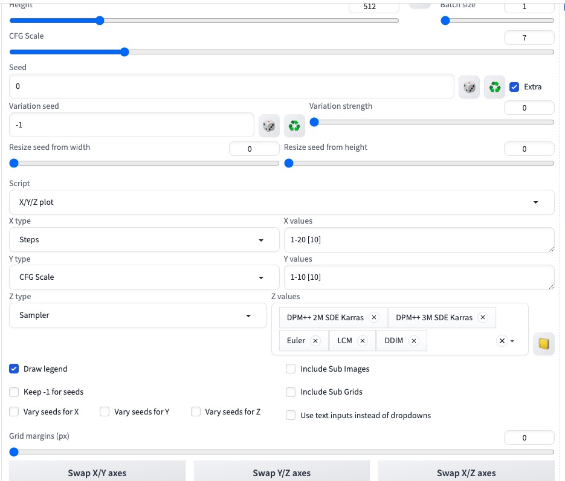   
这些图片要一小时才能生成完    
大概3,4it/s    
全是黑图    

关了hires   
使用v1.5   
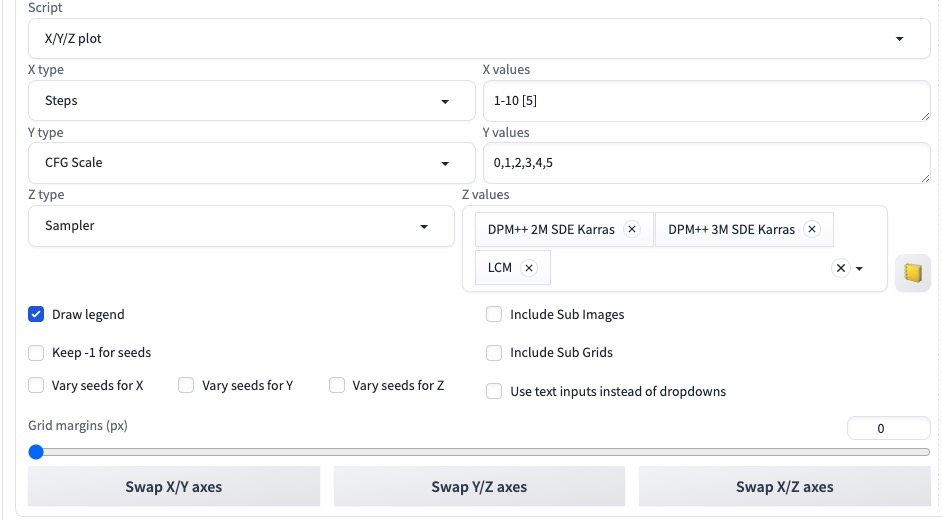    
    

    File "/teams/ai_model_1667305326/WujieAITeam/private/lujunda/stable-diffusion-webui-master/repositories/k-diffusion/k_diffusion/sampling.py", line 701, in sample_dpmpp_3m_sde
        h_1, h_2 = h, h_1
    UnboundLocalError: local variable 'h' referenced before assignment
虽然也有这些错误，但是还是能正常生图    
dpm 2m 3m都会有这个问题

使用turbo sdxl    
   
估计被打码了？？？   

sdxl私人摄影也是   
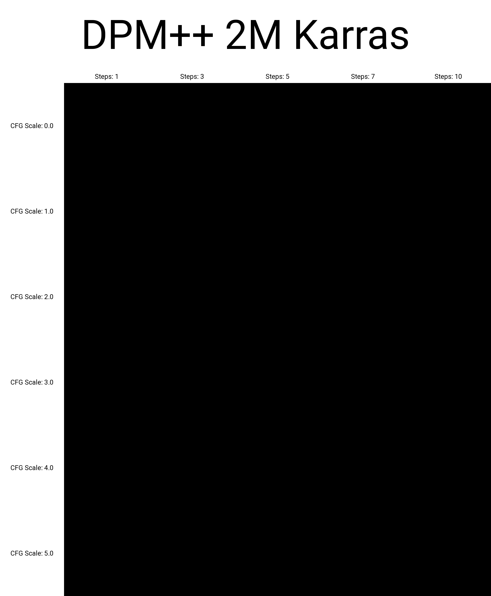   

有些模型是这样的     
爆uint8错误    
记忆里面vae训练也是用fp32才不容易出问题    

可以使用修复的vae      

### 解决方法
网上说可能是显卡半精度问题    
需要在启动webui时候 no half, full   
--precision full --no-half   

sdxl私人摄影    
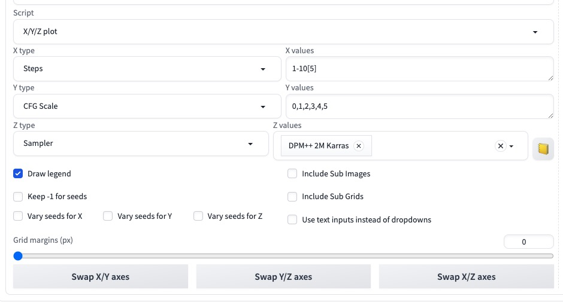     
   
   
推理步数，采样器都一致   
也需要1分钟，15g   

sdxl turbo fp16     
   
1分钟    
15g   

真实感大模型加载成功   
15g   
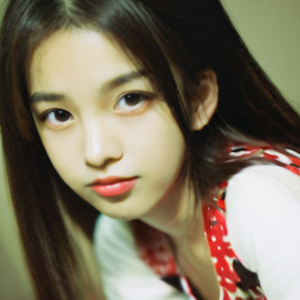   
1 girl    
Steps: 20, Sampler: DPM++ 2M Karras, CFG scale: 7, Seed: 0, Size: 512x512, Model hash: dfe73aa42d, Model: LEOSAM_HelloWorld_新世界_SDXL真实感大模型_v3.2_AutoDPO, Version: 1.8.0-RC

Time taken: 5.1 sec.

A: 13.96 GB, R: 15.27 GB, Sys: 14.6/23.6914 GB (61.8%)

开hires refiner    
    
1 girl   
Steps: 20, Sampler: DPM++ 2M Karras, CFG scale: 7, Seed: 0, Size: 512x512, Model hash: dfe73aa42d, Model: LEOSAM_HelloWorld_新世界_SDXL真实感大模型_v3.2_AutoDPO, Denoising strength: 0.7, Hires upscale: 2, Hires upscaler: Latent, Version: 1.8.0-RC

Time taken: 18.1 sec.

A: 16.59 GB, R: 18.12 GB, Sys: 19.0/23.6914 GB (80.3%)

seed 0
    
Sampler: DPM++ 2M SDE Karras,   

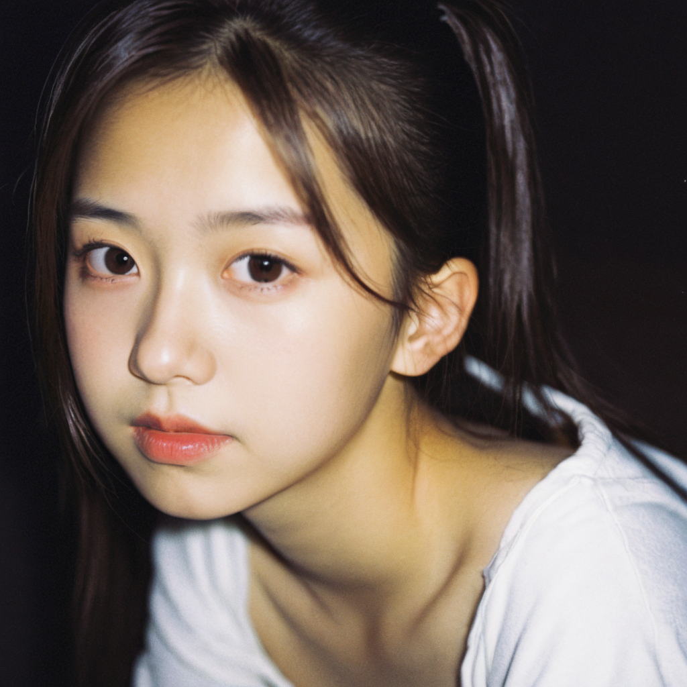
Sampler: DPM++ 3M SDE Karras,

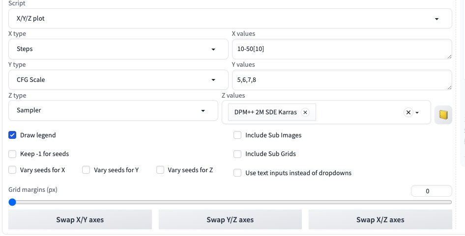   
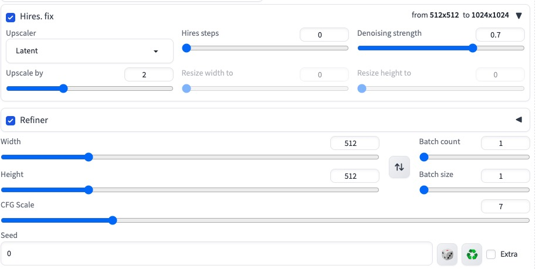     
18分钟    
推理过程一般18g    
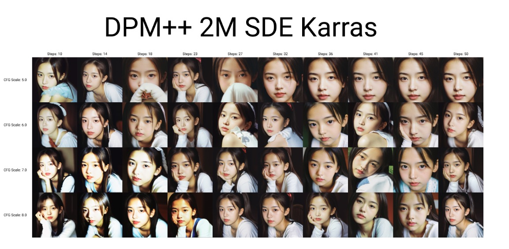   
50mb   

## webui启动方式
python webui.py   
python launch.py    
--precision full --no-half   
--xformers   

而comfyui会自动调用xformers

# 安装方式
不知道为什么首选方法：venv安装一直安装不了venv        
每次都得launch安装，   
forge也是      

# url安装插件报错 gnutls_handshake() failed: The TLS connection was non-properly terminated. '
    GitCommandError: Cmd('git') failed due to: exit code(128) cmdline: git clone -v --filter=blob:none -- https://github.com/huchenlei/sd-forge-ic-light /teams/ai_model_1667305326/WujieAITeam/private/lujunda/newlytest/stable-diffusion-webui-forge/tmp/sd-forge-ic-light stderr: 'Cloning into '/teams/ai_model_1667305326/WujieAITeam/private/lujunda/newlytest/stable-diffusion-webui-forge/tmp/sd-forge-ic-light'... fatal: unable to access 'https://github.com/huchenlei/sd-forge-ic-light/': gnutls_handshake() failed: The TLS connection was non-properly terminated. '

git config --global http.sslVerify false

 如上图，从 socks5:// 改为 socks5h:// 后访问正常。

改http https all_proxy也没用

git config --global  --unset https.https://github.com.proxy     
git config --global  --unset http.https://github.com.proxy 

最后发现是节点问题。万分傻逼

# hires 精绘 高修 超分？？？

在comfyui的实现也是对latant做最近邻差值再采样一次    
相当于refiner模型变异    
而且时插值方式对   

 Diffusers 包有几个限制，阻止它生成与 Stable Diffusion WebUI 生成的图像一样好的图像。这些限制中最重要的包括：

无法使用 .safetensor 文件格式的自定义模型；
77个提示符限制；
缺乏 LoRA 支持；
并且缺少图像放大功能（在 Stable Diffusion WebUI 中也称为 HighRes）；
默认情况下性能低，VRAM 使用率高。

一个方便的选项，可以以较低的分辨率部分渲染图像，放大图像，然后以高分辨率添加细节。换句话说，这相当于在 txt2img 中生成图像，通过您选择的方法对其进行放大，然后对 img2img 中现在放大的图像运行第二遍，以进一步细化放大并创建最终结果。

默认情况下，基于 SD1/2 的模型会以非常高的分辨率创建可怕的图像，因为这些模型仅在 512px 或 768px 下进行训练。该方法可以通过在大版本的去噪过程中利用小图片的构图来避免这个问题。通过选中 txt2img 页面上的“Hires.fix”复选框来启用。    
This method makes it possible to avoid this issue by utilizing the small picture's composition in the denoising process of the larger version. Enabled by checking the "Hires. fix" checkbox on the txt2img page.     

1.8.0 更新：图像现在可以通过雇佣来升级。在图像查看器中选择相关图像时，单击 [✨] 按钮，在初始生成后作为单独的过程进行修复。    
1.8.0 Update: Images can now be upscaled with hires. fix as a separate process after the initial generation by clicking on the [✨] button while the relevant image is selected in the image viewer.    
 
小图片将以您使用宽度/高度滑块设置的任何分辨率呈现。大图片的尺寸由三个滑块控制：“缩放比例”乘数（雇用放大）、“将宽度调整为”和/或“将高度调整为”（雇用调整大小）。    

"Scale by" multiplier (Hires upscale), "Resize width to" and/or "Resize height to" (Hires resize).

    If "Resize width to" and "Resize height to" are 0, "Scale by" is used.
    If "Resize width to" is 0, "Resize height to" is calculated from width and height.
    If "Resize height to" is 0, "Resize width to" is calculated from width and height.
    If both "Resize width to" and "Resize height to" are non-zero, image is upscaled to be at least those dimensions, and some parts are cropped.

To potentially further enhance details in hires. fix, see the notes on extra noise.

## Extra noise
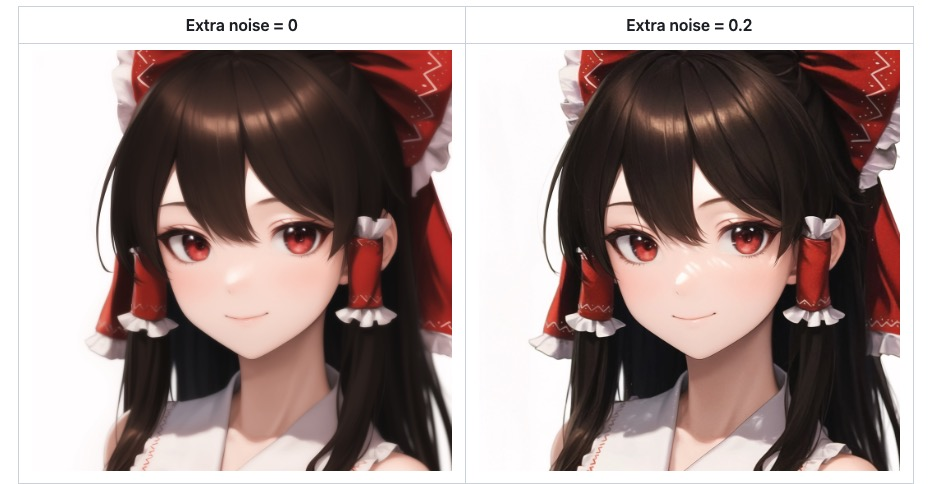     
从随机种子中添加额外的噪声，由设置决定，默认为0。在 1.6.0 版本中通过#12564img2img实现，可在->下的设置中使用Extra noise multiplier for img2img and hires fix。如 UI 中所述，此参数应始终低于用于产生最佳结果的去噪强度。

此调整的一个目的是在招聘修复中添加更多详细信息。为了非常简化的理解，您可以将其视为 GAN 升级和潜在升级之间的交叉。    
 For a very simplified understanding, you may think of it as a cross between GAN upscaling and latent upscaling.      
所以现在高分辨率还是需要gan啊    

下面的示例是应用了 Hires 修复的 512x512 图像，使用 GAN 放大器 (4x-UltraSharp)，降噪强度为 0.45。右侧的图像利用了这种额外的噪声调整。

请注意，几个月前实施的先前设置（Noise multiplier for img2img）在技术上达到了相同的效果，但正如名称中所指出的，仅适用于 img2img（而不是雇用。修复），并且由于它的实施，它非常敏感，实际上仅适用于有用的范围为1到1.1。对于几乎所有操作，建议改用新Extra noise参数。

对于开发者来说，回调也是存在的（on_extra_noise）。下面是一个使用示例，使区域可以添加噪声以进行屏蔽。

and due to it was implemented it is very sensitive, realisticly only useful in a range of 1 to 1.1. For almost all operations it would be suggested to use the new Extra noise parameter instead.

For developers, a callback also exists (on_extra_noise).

# Upscalers
下拉菜单允许您选择用于调整图像大小的放大器类型。除了“附加”选项卡上提供的所有升级器之外，还有一个选项可以升级潜在空间图像，这就是稳定扩散在内部工作的方式 - 对于 3x512x512 RGB 图像，其潜在空间表示将为 4x64x64。要查看每个潜在空间放大器的作用，您可以将去噪强度设置为 0，并将 Hires 步长设置为 1 - 您将获得稳定扩散在放大图像上的作用的非常好的近似值。    

A dropdown allows you to to select the kind of upscaler to use for resizing the image. In addition to all upscalers you have available on extras tab, there is an option to `upscale a latent space image`, which is what stable diffusion works with internally - for a 3x512x512 RGB image, its latent space representation would be 4x64x64. To see what each latent space upscaler does, you can set Denoising strength to 0 and Hires steps to 1 - you'll get a very good approximation of what stable diffusion would be working with on upscaled image.

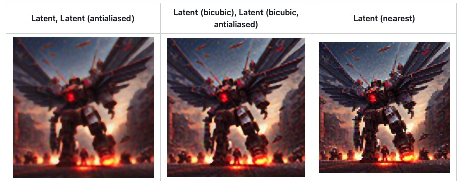     

神秘的latent空间放大    

# Soft inpainting
软修复允许降噪器直接使用软边缘（即非二元）蒙版，从而使未蒙版的内容与具有渐变过渡的修复内容无缝混合。它在概念上类似于每像素去噪强度。     
Soft inpainting allows the denoiser to work directly with soft-edged (i.e. non-binary) masks, whereby unmasked content is blended seamlessly with inpainted content with gradual transitions. It is conceptually similar to per-pixel denoising strength.     

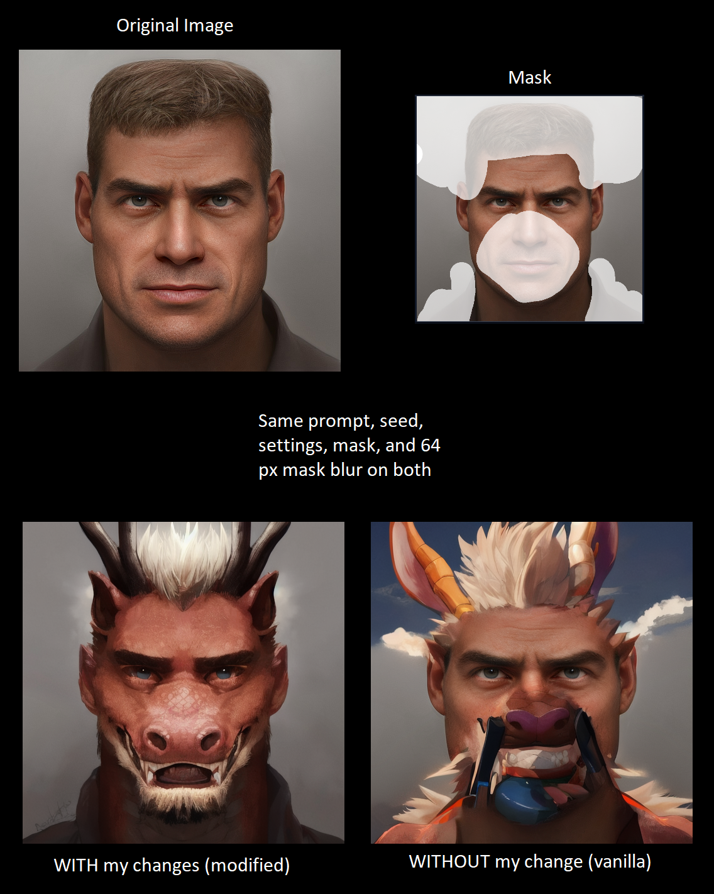    

# debug
webui.py设置了5秒间隔，用处是在程序运行时候每5秒监听一次服务器端的输入，5秒的时间段里面则在跑代码，如推理     
比较蠢的进去具体县城方法是，在跑的那5秒快速暂停，然后到进程那里点下一步。但是这样会每跳一步回到时间监听程序一次     

这样调试太慢了。    
每次只能积累到正好所停步的堆栈查看   

比如这次    
正好停到前向传播的unet的SpatialTransformer    

解决：不把断点打在时间循环处

# 内部参数
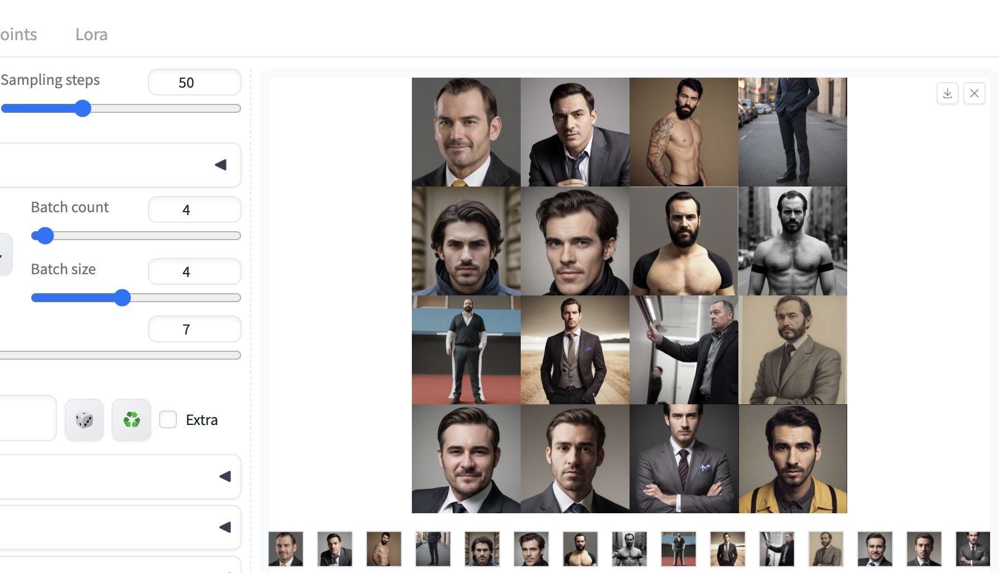

# 升级插件
check update   
applly and quit    

# 端口映射

demo.launch(server_name="127.0.0.1", server_port=27121, share=True)这个端口怎么设置才能在https://px-star-1.matpool.com:27121这个链接上查看gradio

server_name="0.0.0.0", server_port=8895

# 结尾

