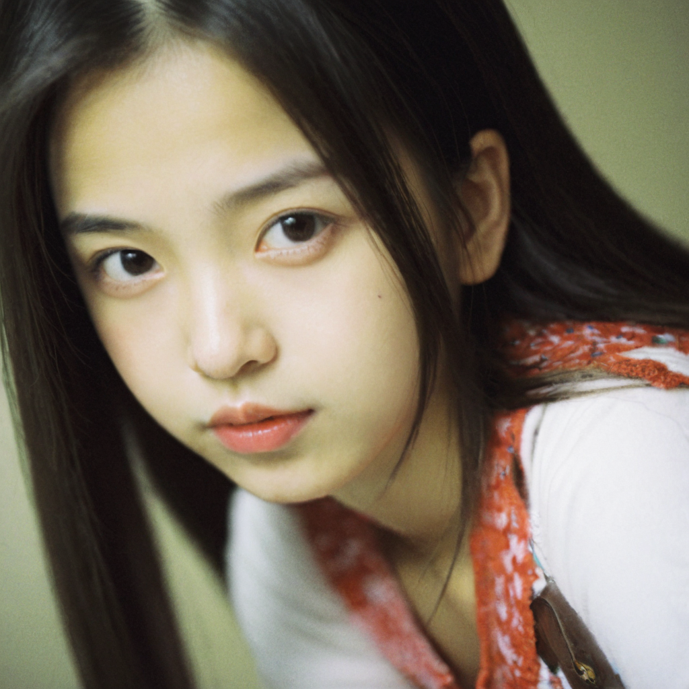
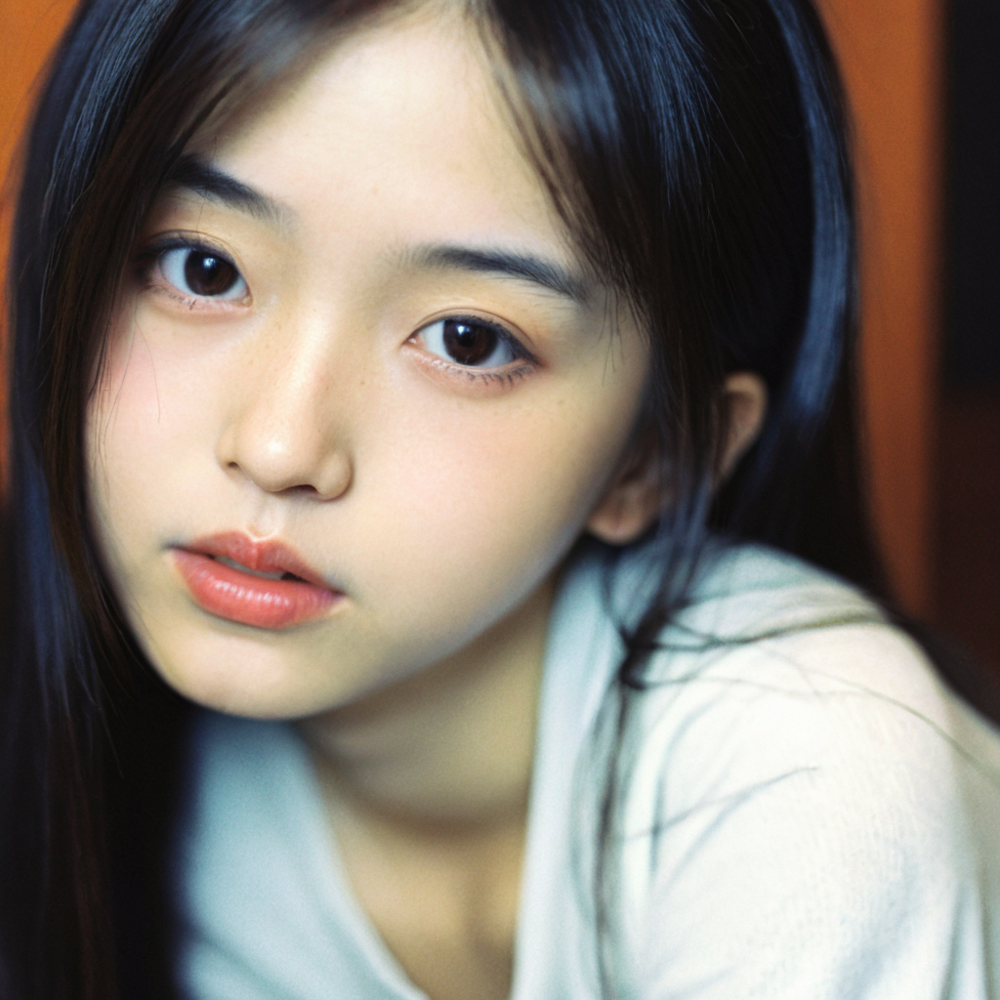
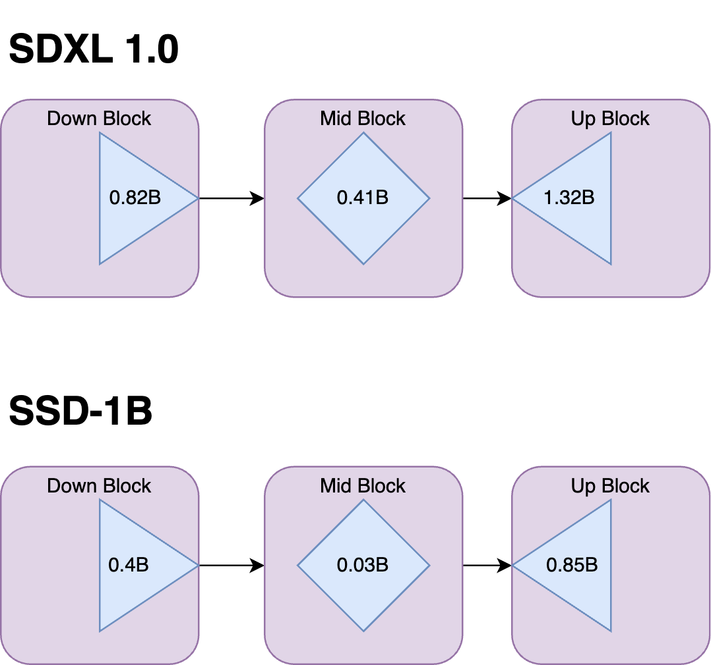
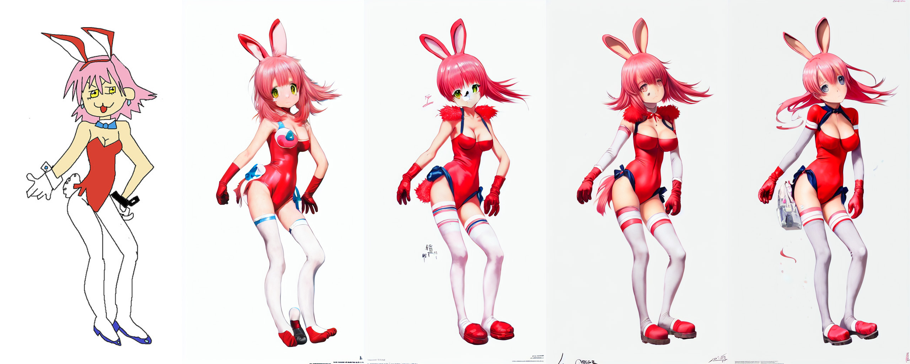

# 3090
## 黑图和xyz
真实感大模型sdxl加载失败    
File "/teams/ai_model_1667305326/WujieAITeam/private/lujunda/stable-diffusion-webui-master/modules/sd_disable_initialization.py", line 219, in load_state_dict
    state_dict = {k: v.to(device="meta", dtype=v.dtype) for k, v in state_dict.items()}
  File "/teams/ai_model_1667305326/WujieAITeam/private/lujunda/stable-diffusion-webui-master/modules/sd_disable_initialization.py", line 219, in <dictcomp>
    state_dict = {k: v.to(device="meta", dtype=v.dtype) for k, v in state_dict.items()}
RuntimeError: dictionary changed size during iteration

Applying attention optimization: Doggettx... done.
Model loaded in 182.3s (calculate hash: 76.8s, load weights from disk: 5.3s, create model: 0.7s, apply weights to model: 98.9s, calculate empty prompt: 0.3s).

1 girl    
Steps: 20, Sampler: DPM++ 2M Karras, CFG scale: 7, Seed: 1957970079, Size: 512x512, Model hash: a2e2de4c7a, Model: 0307_Rocky_sdxl_PrivateImaging_model, Version: 1.8.0-RC

sdxl turbo和原模型一样大.推理时8g-10g跳动，才像是cfg起作用，以及可能是采样器问题，只是快    

xyz plot    
AssertionError: Error: Resulting grid would be too large (367 MPixels) (max configured size is 200 MPixels)    
sdxl-turbo   
   
这些图片要一小时才能生成完    
大概3,4it/s    
全是黑图    

关了hires   
使用v1.5   
    
    

    File "/teams/ai_model_1667305326/WujieAITeam/private/lujunda/stable-diffusion-webui-master/repositories/k-diffusion/k_diffusion/sampling.py", line 701, in sample_dpmpp_3m_sde
        h_1, h_2 = h, h_1
    UnboundLocalError: local variable 'h' referenced before assignment
虽然也有这些错误，但是还是能正常生图    
dpm 2m 3m都会有这个问题

使用turbo sdxl    
   
估计被打码了？？？   

sdxl私人摄影也是   
   

有些模型是这样的     
爆uint8错误    
记忆里面vae训练也是用fp32才不容易出问题    

可以使用修复的vae      

### 解决方法
网上说可能是显卡半精度问题    
需要在启动webui时候 no half, full   
--precision full --no-half   

sdxl私人摄影    
     
   
   
推理步数，采样器都一致   
也需要1分钟，15g   

sdxl turbo fp16     
   
1分钟    
15g   

真实感大模型加载成功   
15g   
   
1 girl    
Steps: 20, Sampler: DPM++ 2M Karras, CFG scale: 7, Seed: 0, Size: 512x512, Model hash: dfe73aa42d, Model: LEOSAM_HelloWorld_新世界_SDXL真实感大模型_v3.2_AutoDPO, Version: 1.8.0-RC

Time taken: 5.1 sec.

A: 13.96 GB, R: 15.27 GB, Sys: 14.6/23.6914 GB (61.8%)

开hires refiner    
    
1 girl   
Steps: 20, Sampler: DPM++ 2M Karras, CFG scale: 7, Seed: 0, Size: 512x512, Model hash: dfe73aa42d, Model: LEOSAM_HelloWorld_新世界_SDXL真实感大模型_v3.2_AutoDPO, Denoising strength: 0.7, Hires upscale: 2, Hires upscaler: Latent, Version: 1.8.0-RC

Time taken: 18.1 sec.

A: 16.59 GB, R: 18.12 GB, Sys: 19.0/23.6914 GB (80.3%)

seed 0
    
Sampler: DPM++ 2M SDE Karras,   

Sampler: DPM++ 3M SDE Karras,

   
     
18分钟    
推理过程一般18g    
   
50mb   

## webui启动方式
python webui.py   
python launch.py    
--precision full --no-half   
--xformers   

而comfyui会自动调用xformers

huchenlei     
命令行参数：--opt-split-attention --xformers

# 安装方式
不知道为什么首选方法：venv安装一直安装不了venv        
每次都得launch安装，   
forge也是      

# url安装插件报错 gnutls_handshake() failed: The TLS connection was non-properly terminated. '
    GitCommandError: Cmd('git') failed due to: exit code(128) cmdline: git clone -v --filter=blob:none -- https://github.com/huchenlei/sd-forge-ic-light /teams/ai_model_1667305326/WujieAITeam/private/lujunda/newlytest/stable-diffusion-webui-forge/tmp/sd-forge-ic-light stderr: 'Cloning into '/teams/ai_model_1667305326/WujieAITeam/private/lujunda/newlytest/stable-diffusion-webui-forge/tmp/sd-forge-ic-light'... fatal: unable to access 'https://github.com/huchenlei/sd-forge-ic-light/': gnutls_handshake() failed: The TLS connection was non-properly terminated. '

git config --global http.sslVerify false

 如上图，从 socks5:// 改为 socks5h:// 后访问正常。

改http https all_proxy也没用

git config --global  --unset https.https://github.com.proxy     
git config --global  --unset http.https://github.com.proxy 

最后发现是节点问题。万分傻逼

# hires 精绘 高修 超分？？？
wiki好像没说时如何实现的        
源代码中是一个img2img过程       
但是是对latent做二倍插值吗，我没有看过      

在comfyui的实现也是对latant做最近邻差值再采样一次    
相当于refiner模型变异    
而且时插值方式对   

 Diffusers 包有几个限制，阻止它生成与 Stable Diffusion WebUI 生成的图像一样好的图像。这些限制中最重要的包括：

无法使用 .safetensor 文件格式的自定义模型；
77个提示符限制；
缺乏 LoRA 支持；
并且缺少图像放大功能（在 Stable Diffusion WebUI 中也称为 HighRes）；
默认情况下性能低，VRAM 使用率高。

一个方便的选项，可以以较低的分辨率部分渲染图像，放大图像，然后以高分辨率添加细节。换句话说，这相当于在 txt2img 中生成图像，通过您选择的方法对其进行放大，然后对 img2img 中现在放大的图像运行第二遍，以进一步细化放大并创建最终结果。

默认情况下，基于 SD1/2 的模型会以非常高的分辨率创建可怕的图像，因为这些模型仅在 512px 或 768px 下进行训练。该方法可以通过在大版本的去噪过程中利用小图片的构图来避免这个问题。通过选中 txt2img 页面上的“Hires.fix”复选框来启用。    
This method makes it possible to avoid this issue by utilizing the small picture's composition in the denoising process of the larger version. Enabled by checking the "Hires. fix" checkbox on the txt2img page.     

1.8.0 更新：图像现在可以通过雇佣来升级。在图像查看器中选择相关图像时，单击 [✨] 按钮，在初始生成后作为单独的过程进行修复。    
1.8.0 Update: Images can now be upscaled with hires. fix as a separate process after the initial generation by clicking on the [✨] button while the relevant image is selected in the image viewer.    
 
小图片将以您使用宽度/高度滑块设置的任何分辨率呈现。大图片的尺寸由三个滑块控制：“缩放比例”乘数（雇用放大）、“将宽度调整为”和/或“将高度调整为”（雇用调整大小）。    

"Scale by" multiplier (Hires upscale), "Resize width to" and/or "Resize height to" (Hires resize).

    If "Resize width to" and "Resize height to" are 0, "Scale by" is used.
    If "Resize width to" is 0, "Resize height to" is calculated from width and height.
    If "Resize height to" is 0, "Resize width to" is calculated from width and height.
    If both "Resize width to" and "Resize height to" are non-zero, image is upscaled to be at least those dimensions, and some parts are cropped.

To potentially further enhance details in hires. fix, see the notes on extra noise.

## Extra noise
     
从随机种子中添加额外的噪声，由设置决定，默认为0。在 1.6.0 版本中通过#12564img2img实现，可在->下的设置中使用Extra noise multiplier for img2img and hires fix。如 UI 中所述，此参数应始终低于用于产生最佳结果的去噪强度。

此调整的一个目的是在招聘修复中添加更多详细信息。为了非常简化的理解，您可以将其视为 GAN 升级和潜在升级之间的交叉。    
 For a very simplified understanding, you may think of it as a cross between GAN upscaling and latent upscaling.      
所以现在高分辨率还是需要gan啊    

下面的示例是应用了 Hires 修复的 512x512 图像，使用 GAN 放大器 (4x-UltraSharp)，降噪强度为 0.45。右侧的图像利用了这种额外的噪声调整。

请注意，几个月前实施的先前设置（Noise multiplier for img2img）在技术上达到了相同的效果，但正如名称中所指出的，仅适用于 img2img（而不是雇用。修复），并且由于它的实施，它非常敏感，实际上仅适用于有用的范围为1到1.1。对于几乎所有操作，建议改用新Extra noise参数。

对于开发者来说，回调也是存在的（on_extra_noise）。下面是一个使用示例，使区域可以添加噪声以进行屏蔽。

and due to it was implemented it is very sensitive, realisticly only useful in a range of 1 to 1.1. For almost all operations it would be suggested to use the new Extra noise parameter instead.

For developers, a callback also exists (on_extra_noise).

# Upscalers

下拉菜单允许您选择用于调整图像大小的放大器类型。除了“附加”选项卡上提供的所有升级器之外，还有一个选项可以升级潜在空间图像，这就是稳定扩散在内部工作的方式 - 对于 3x512x512 RGB 图像，其潜在空间表示将为 4x64x64。要查看每个潜在空间放大器的作用，您可以将去噪强度设置为 0，并将 Hires 步长设置为 1 - 您将获得稳定扩散在放大图像上的作用的非常好的近似值。    

A dropdown allows you to to select the kind of upscaler to use for resizing the image. In addition to all upscalers you have available on extras tab, there is an option to `upscale a latent space image`, which is what stable diffusion works with internally - for a 3x512x512 RGB image, its latent space representation would be 4x64x64. To see what each latent space upscaler does, you can set Denoising strength to 0 and Hires steps to 1 - you'll get a very good approximation of what stable diffusion would be working with on upscaled image.

     

神秘的latent空间放大    

Extras tab with:

    GFPGAN, neural network that fixes faces
    CodeFormer, face restoration tool as an alternative to GFPGAN
    RealESRGAN, neural network upscaler
    ESRGAN, neural network upscaler with a lot of third party models
    SwinIR and Swin2SR (see here), neural network upscalers
    LDSR, Latent diffusion super resolution upscaling

## Stable Diffusion upscale
ℹ️ Note: This is not the preferred method of upscaling, as this causes SD to lose attention to the rest of the image due to tiling. It should only be used if VRAM bound, or in tandem with something like ControlNet + the tile model. For the preferred method, see Hires. fix.

Recommended parameters for upscaling:

    Sampling method: Euler a
    Denoising strength: 0.2, can go up to 0.4 if you feel adventurous
    A larger denoising strength is problematic due to the fact SD upscale works in tiles, as the diffusion process is then unable to give attention to the image as a whole.

构图改变严重       
相当于重绘，denoise再低也会重绘        
运行逻辑上就有问题     

tile原理，适用于高马赛克模糊图片       
不适用于小图单纯放大      

# Soft inpainting
软修复允许降噪器直接使用软边缘（即非二元）蒙版，从而使未蒙版的内容与具有渐变过渡的修复内容无缝混合。它在概念上类似于每像素去噪强度。     
Soft inpainting allows the denoiser to work directly with soft-edged (i.e. non-binary) masks, whereby unmasked content is blended seamlessly with inpainted content with gradual transitions. It is conceptually similar to per-pixel denoising strength.     

    

# debug
webui.py设置了5秒间隔，用处是在程序运行时候每5秒监听一次服务器端的输入，5秒的时间段里面则在跑代码，如推理     
比较蠢的进去具体县城方法是，在跑的那5秒快速暂停，然后到进程那里点下一步。但是这样会每跳一步回到时间监听程序一次     

这样调试太慢了。    
每次只能积累到正好所停步的堆栈查看   

比如这次    
正好停到前向传播的unet的SpatialTransformer    

解决：不把断点打在时间循环处

# 内部参数

# 升级插件
check update   
applly and quit    

# 端口映射 部署

python webui.py --xformers --port 8895 --listen   
python webui.py --xformers --port=8895 --listen

两个都可以

demo.launch(server_name="127.0.0.1", server_port=27121, share=True)这个端口怎么设置才能在https://px-star-1.matpool.com:27121这个链接上查看gradio

server_name="0.0.0.0", server_port=8895

python webui.py --xformers 

start_server
    raise OSError(
OSError: Cannot find empty port in range: 8895-8895. You can specify a different port by setting the GRADIO_SERVER_PORT environment variable or passing the `server_port` parameter to `launch()`.
Applying attention optimization: xformers... done.

找到占用端口的进程ID（PID）

lsof -i :8895

kill -9 1234

方法二：重启系统
如果找不到具体进程或无法终止进程，重启系统可以释放所有端口。

方法三：检查并关闭特定应用程序
某些应用程序可能会占用端口8895，关闭这些应用程序可以释放端口。常见的应用程序包括：

    本地运行的开发服务器
    容器化应用（例如Docker）

检查Docker容器

如果使用Docker，可以查看正在运行的容器：

docker ps   
找到使用特定端口的容器后，停止容器：

docker stop [CONTAINER_ID]

方法四：配置系统防火墙
某些情况下，系统防火墙或网络安全软件可能会占用或阻止端口。检查并调整防火墙设置，确保端口未被占用。

# 最佳 SDXL 使用
ClashSAN 编辑了此页面 on Dec 15, 2023 · 6 修订
以下是要针对您的设置进行调整的事项的快速列表：

命令行参数：

    英伟达 （12gb+）--xformers
    英伟达 （8gb）--medvram-sdxl --xformers
    英伟达 （4gb）--lowvram --xformers
    AMD （4gb） + TAESD 设置--lowvram --opt-sub-quad-attention
详细信息
rocm 和 directml 都会以 fp16 生成至少 1024x1024 的图片。如果您的 AMD 显卡需要 --no-half，请尝试启用 --upcast-sampling，因为全精度 sdxl 太大，无法容纳 4gb。

使用 sdxl-vae-fp16-fix;不需要在 fp32 中运行的 VAE。这将提高速度并减少VRAM的使用，同时几乎没有质量损失。    
使用TAESD;一个以牺牲质量为代价使用更少 vram 的 VAE。

Use an SSD for faster load time, especially if a pagefile is required.     
Have at least 24gb ram on Windows 11, and at least 16gb on Windows 10      
这是为什么        

(Linux) install , greatly reducing RAM usage: (#10117).tcmallocsudo apt install --no-install-recommends google-perftools       
Add a pagefile/swapfile to prevent failure loading weights due to low RAM.

## sdxl-vae-fp16-fix是如何修复的？？
主要有很多问题我都要一一考证吗        
就像历史学习，有很多名词典故梗       
我好像没办法考证，只能说做过哪些讲哪些       
这是不可能的事情     

更实际的是直接看接口文档的使用说明       
一般能讲明白       
具体实现可能才得深入进去看       

# 一些功能

Sampling method selection  

    Adjust sampler eta values (noise multiplier)
    More advanced noise setting options
Interrupt processing at any time

Live prompt token length validation

Tiling support, a checkbox to create images that can be tiled like textures    
Progress bar and live image generation preview

    Can use a separate neural network to produce previews with almost none VRAM or compute requirement

Styles, a way to save part of prompt and easily apply them via dropdown later       
Variations, a way to generate same image but with tiny differences

Seed resizing, a way to generate same image but at slightly different resolution        
CLIP interrogator, a button that tries to guess prompt from an image

Prompt Editing, a way to change prompt mid-generation, say to start making a watermelon and switch to anime girl midway

Highres Fix, a convenience option to produce high resolution pictures in one click without usual distortions

DeepDanbooru integration, creates danbooru style tags for anime prompts       
xformers, major speed increase for select cards: (add --xformers to commandline args)

Composable-Diffusion, a way to use multiple prompts at once

    separate prompts using uppercase AND
    also supports weights for prompts: a cat :1.2 AND a dog AND a penguin :2.2

和pos neg有什么区别吗      
是前身么        
neg如何实现？          
直接embed相减吗？        
还是生成的latent相减，是每一步减还是最后一步减？    

Training tab     
hypernetworks and embeddings options        
Preprocessing images: cropping, mirroring, autotagging using BLIP or deepdanbooru (for anime)

Hypernetworks      
Loras (same as Hypernetworks but more pretty)

via extension: Aesthetic Gradients, a way to generate images with a specific aesthetic by using clip images embeds (implementation of https://github.com/vicgalle/stable-diffusion-aesthetic-gradients)    
Stable Diffusion 2.0 support - see wiki for instructions     
Alt-Diffusion support - see wiki for instructions

具有美学梯度🎨的稳定扩散   
这是文章 Personalizing Text-to-Image Generation via Aesthetic Gradients 的代码库：

这项工作提出了美学梯度，这是一种通过引导生成过程走向用户从一组图像中定义的自定义美学来个性化 CLIP 条件扩散模型的方法。该方法通过定性和定量实验进行了验证，使用最近的稳定扩散模型和几个经过美学过滤的数据集。

特别是，这种再现允许用户使用前一篇论文中描述的美学渐变技术来个性化稳定扩散。

tl;博士
有了这个，您不必学习很多法术/修饰符来提高生成图像的质量。

--aesthetic_steps：进行个性化设置时的优化步骤数。对于给定的提示，建议从几个步骤（2 或 3）开始，然后逐渐增加它（尝试 5、10、15、20 等）。该值越大，生成的图像就越偏向于美学嵌入。    
--aesthetic_lr：美学梯度优化的学习率。默认值为 0.0001。这个值通常工作得很好，所以你只能调整前面的参数。   
--aesthetic_embedding：包含美学嵌入的存储 pytorch 张量（.pt 格式）的路径。它的形状必须为 1x768（CLIP-L/14 尺寸）。请参阅下文，以计算您自己的美学嵌入。

 your own aesthetic embeddings.

此外，还融入了新的美学嵌入：

fantasy.pt：通过仅过滤标题中带有“幻想”字样的图像，从 https://huggingface.co/datasets/ChristophSchuhmann/improved_aesthetics_6.5plus 创建。按分数排名前 2000 的图像被选中进行嵌入。      
flower_plant.pt：通过仅过滤标题中带有“植物”、“花卉”、“花卉”、“植被”或“花园”字样的图像，从 https://huggingface.co/datasets/ChristophSchuhmann/improved_aesthetics_6.5plus 创建。按分数排名前 2000 的图像被选中进行嵌入。

Eased resolution restriction: generated image's dimensions must be a multiple of 8 rather than 64

Segmind Stable Diffusion support     
segmind/SSD-1B

Segmind Stable Diffusion Model （SSD-1B） 是 Stable Diffusion XL （SDXL） 的精炼 50% 缩小版本，提供 60% 的加速，同时保持高质量的文本到图像生成功能。它已经在各种数据集上进行了训练，包括 Grit 和 Midjourney 抓取数据，以增强其基于文本提示创建各种视觉内容的能力。

该模型采用知识蒸馏策略，先后利用多个专家模型（包括 SDXL、ZavyChromaXL 和 JuggernautXL）的教学，结合它们的优势并产生令人印象深刻的视觉输出。

特别感谢 HF 团队🤗，尤其是 Sayak、Patrick 和 Poli 对这项工作的合作和指导。

 

培训信息
以下是训练期间使用的关键超参数：

    步数：251000
    学习率：1e-5
    批次大小：32
    梯度累积步骤：4
    图像分辨率：1024
    混合精度：fp16

## Loopback

# 结尾

